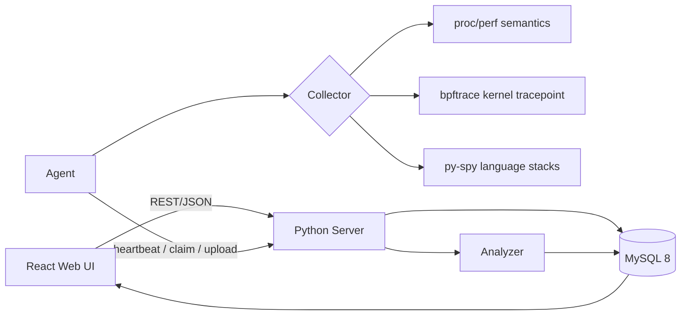
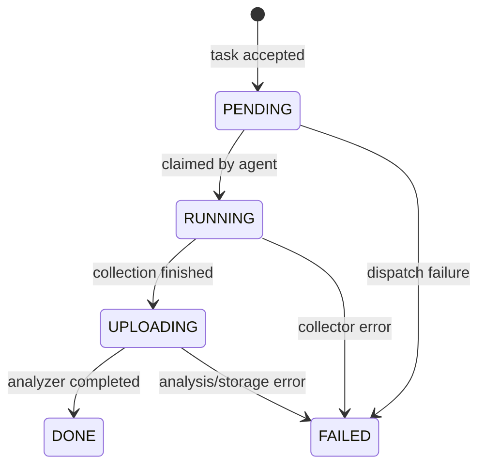

# Mini-Drop 设计说明

## 1. 目标与范围

这个实现围绕“复刻 Drop 的主要诊断能力”展开：一条 `docker compose up --build` 命令构建 React UI，并启动 FastAPI 控制面、MySQL 8 和 Python Agent。浏览器中可以演示任务下发、实时状态、性能分析、持续采样切片和 Agent 审计。Linux 采集工具使用真实进程调用，采集结果会标记真实 backend 和降级状态。

题目分基础题、扩展题和加分项。当前版本完成基础链路，覆盖 Continuous Profiling、eBPF、py-spy，并选择自然语言采集规划作为加分项。生产级鉴权、COS/对象存储、分布式队列、长期保留策略和细粒度 eBPF 权限还没有补齐，我把它们作为生产化差距列出。

## 2. 架构

FastAPI Server 是任务真相源。Agent 不直接写数据库，只领取任务、执行采集、上传原始结果或失败原因。SQLAlchemy 负责持久化，Agent 领取任务时使用行锁避免重复领取。Analyzer 独立成模块，保持 `analyze(raw) -> result` 这个稳定接口，后续可以迁移到队列 Worker，不影响采集器和 UI。

React UI 使用 TypeScript/TSX 编写，由 Vite 构建，Docker 多阶段构建后交给 FastAPI 托管静态资源。前端入口、路由、状态、API 和业务组件分层：`main.tsx` 只挂载应用，`router.tsx` 维护页面路由，Zustand store 管理 Agent、任务、审计、轮询和业务动作。FastAPI 统一处理 `/api` 路由，用 Pydantic 做请求校验，并在 `/docs` 暴露 OpenAPI 文档。

## 3. 状态机

`Store.transition` 是唯一状态修改入口。它校验状态边，并拒绝空 `reason`。任务当前状态和追加式状态迁移记录在同一个 SQLAlchemy 事务中提交。

## 4. 心跳与审计

Agent 每 5 秒领取任务前发送心跳。Server watcher 每 5 秒扫描一次，30 秒没有心跳就把 Agent 标记为离线。首次连接、恢复和离线事件写入审计表，普通心跳不刷屏。

## 5. 采集器

所有采集器实现 `collect(pid, duration, rate)`，并返回统一结构：时序样本、folded stack、可选 histogram 和元数据。

- CPU profiling 调用真实 `perf record`，再解析 `perf script` 调用栈；旁路线程采样 `/proc/<pid>/{stat,status,io}`，记录 CPU ticks、RSS 和 I/O。
- eBPF 调用真实 bpftrace `kprobe:vfs_write` 内核探针，并展示写入分布。内核 tracing 不可用时，用 `/proc/diskstats` 保持演示可运行，并明确标记 `degraded`。
- py-spy 获取 Python 语言级调用栈。降级路径会明确标记 `degraded`。

外部命令通过 `subprocess.run` 的参数数组执行，不经过 shell 拼接。

## 6. 分析与可验证归因

Analyzer 生成层级火焰树、TopN inclusive 样本数、时序数据和采集器专项 histogram。归因采用确定性规则：每条结论都带 TopN 证据和触发规则。结果 fingerprint 让多次比较保持稳定。

这比直接把原始数据丢给 LLM 更可控。后续如果接入 LLM，它只能读取结构化证据，并必须引用同一套证据输出结论。

## 7. Continuous Profiling

持续采样任务在一个切片到达 `DONE` 后自动创建后继切片。每个切片不可变，并可单独查询。Web 时间窗口选择器可以回看任意区间，停止 API 会关闭匹配任务的后续续建。生产版本需要继续补保留策略和按 Agent 的背压控制。

## 8. 可靠性与安全

MySQL 保存任务真相，较大的原始 profile 使用 `LONGTEXT`。SQLAlchemy 事务保证状态变更和状态迁移记录原子提交，`SELECT ... FOR UPDATE SKIP LOCKED` 防止两个 Agent 领取同一个任务。错误以 JSON 返回，Agent 失败会进入终态迁移。

eBPF Agent 在演示环境使用 `privileged`，因为 bpftrace 需要内核 tracing 能力。生产环境应改成签名探针目录、能力集收敛、Agent 认证、TLS、租户授权，以及原始 profile 对象存储。

## 9. 测试与证据

测试覆盖状态机约束、离线/恢复审计、采集器、自然语言规划、Analyzer 输出，以及成功和失败路径的端到端流程。覆盖率阈值为 50%，当前本地验收结果为 66%。运行命令：`make coverage`。

普通使用下，采集内存和 `duration * min(rate, 20)` 成正比；分析复杂度和总栈帧数线性相关。UI 只渲染 TopN 和火焰图叶子节点，避免 DOM 无上限增长。进入生产前，需要用压测确定队列延迟和原始 profile 大小上限。

## 10. 继续完善计划

一个 Python 代码库便于评审运行和检查，但还没有隔离 Analyzer 故障，也没有横向扩容能力。MySQL 适合保存控制面状态，原始 profile 后续应迁移到对象存储，不应长期放在数据库 `LONGTEXT` 中。

如果继续做，我会按顺序补 Alembic 数据库迁移、持久化队列、S3/MinIO、Agent 身份认证、native 符号解析、保留/背压策略，并在 CI 中发布覆盖率和压测报告。

## AI 协作

AI 用来加速脚手架、对照考题检查接口、补充失败路径。关键判断由我确认：状态迁移必须落库、降级必须透明、归因必须带证据、后端迁移到 FastAPI/MySQL、演示路径必须可复现。

我评估 AI 产物时不只看页面效果，而是看证据：单元测试、覆盖率、Docker Compose 启动、API 检查，以及至少一条真实采集路径。早期版本不够时，我继续把提示词收紧到具体要求：真实 eBPF、真实 `perf record`、py-spy 语言栈、可见持续采样时间线、MySQL 持久化，以及对生产化差距的清楚说明。
