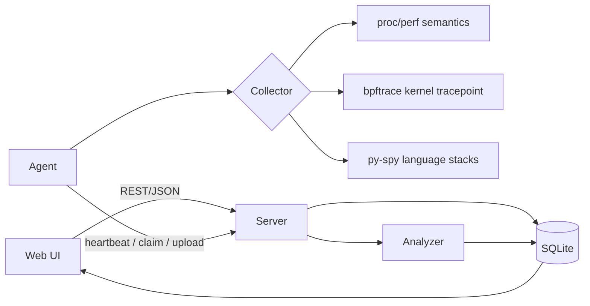
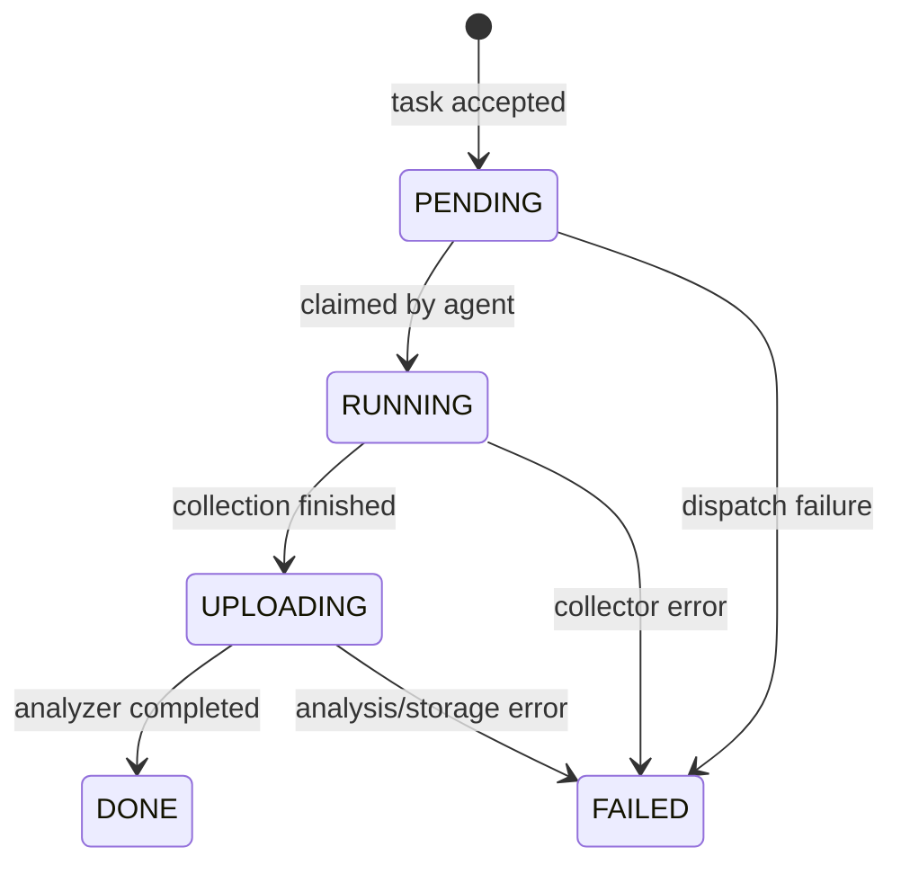

# Mini-Drop Design

## 1. Scope

This implementation optimizes for a reproducible ten-minute review: one Compose command starts a control plane and a privileged Agent, while the browser demonstrates dispatch, live state, analysis, continuous slices, and connectivity audit. SQLite and Python's standard library keep the baseline small. Optional Linux profiling tools remain real processes rather than simulated APIs.

## 2. Architecture

The Server owns task truth. Agents never write storage directly; they request a task, collect data, and submit either raw output or an explicit failure. The Analyzer is isolated as a module with a stable `analyze(raw) -> result` contract, so it can later move to a queue-backed worker without changing collectors or UI.

## 3. State machine

`Store.transition` is the only mutation path. It validates edges and rejects an empty reason. Task state and an append-only transition record are committed in the same SQLite transaction.

## 4. Heartbeats and audit

The Agent heartbeats before every five-second claim cycle. A Server watcher scans every five seconds and marks Agents offline after thirty seconds. First connection, recovery, and offline events are appended to the audit table. Repeated heartbeats do not create noise.

## 5. Collectors

All collectors implement `collect(pid, duration, rate)` and return the same envelope: time-series samples, folded stacks, optional histogram, and metadata.

- CPU/perf semantics samples `/proc/<pid>/{stat,status,io}`. This always works when the PID is visible.
- eBPF executes a real bpftrace `sys_enter_write` tracepoint and exposes its distribution. If kernel tracing is unavailable, `/proc/diskstats` keeps the demo operable while clearly marking the result degraded.
- py-spy obtains Python language-level frames. Its fallback is explicitly marked degraded.

External commands use argument arrays with `subprocess.run`; no shell interpretation is involved.

## 6. Analysis and verifiable attribution

The Analyzer creates a hierarchical flame tree, TopN inclusive sample counts, time series, and collector-specific histogram. Attribution is deterministic and verifiable: every conclusion contains the exact TopN evidence and regex rule that caused it. A result fingerprint makes comparisons stable.

This is intentionally safer than sending unrestricted prompts to an LLM. A future LLM can only consume these structured tools and must cite the same evidence.

## 7. Continuous profiling

A continuous task automatically creates its successor after a slice reaches `DONE`. Each slice is immutable and independently queryable, so any five-minute window can be reconstructed from slices without mutating historical data. A production version would add retention and per-Agent backpressure.

## 8. Reliability and security

SQLite WAL-sized workloads are sufficient for the demo, but writes are guarded with a process lock and indexed by Agent/status and task transition. Errors are returned as JSON and Agent failures become terminal state transitions. Static-file traversal is rejected using resolved path ancestry.

The eBPF Agent is privileged for demonstration. Production should use a signed, allow-listed probe catalog, narrow capabilities, authentication, TLS, tenant authorization, and object storage for raw profiles.

## 9. Testing and performance evidence

Tests cover state-machine constraints, offline/recovery audit, Analyzer output, and three end-to-end workflows: success, missing PID, and unsupported collector. Run `make test`.

Collection memory is proportional to `duration * min(rate, 20)` in ordinary usage. Analysis is linear in total frames. The UI only renders TopN and flame leaves, avoiding unbounded DOM growth for the demo. Before production, load tests should establish queue latency and cap raw profile size.

## 10. Key tradeoffs and seven more days

Using one Python codebase makes the assessment easy to run and inspect, but it does not isolate Analyzer failure or provide horizontal scaling. SQLite avoids infrastructure startup cost, but PostgreSQL is the right next step for concurrent control planes.

With seven more days I would move analysis behind a durable queue, add PostgreSQL and S3/MinIO, implement authenticated Agent identities, parse native `perf script` folded stacks, add a true five-minute time-range selector, enforce retention/backpressure, and publish coverage plus load-test reports in CI.

## AI collaboration

AI was used to accelerate scaffolding, review interfaces against the assessment, and enumerate failure paths. Human-owned decisions include the persisted transition invariant, degraded-mode transparency, deterministic attribution evidence, and keeping the review path free from mandatory external services. Generated code was validated with repository tests and manual end-to-end execution.
