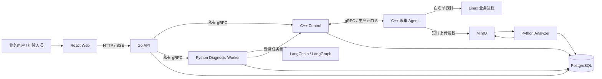

# Mini-Drop · Linux 多节点性能诊断平台

Mini-Drop 将业务请求、进程采集和 AI 调查连接起来：用户描述“哪个后台、什么操作变慢”，系统绑定真实运行进程，选择采集工具，分析调用栈与资源指标，再生成带证据引用的诊断报告。

项目包含两条入口：**基础采集**由用户选择目标与采集器；**AI 诊断**由受约束的 Agent 在预算内提出假设、调用工具、寻找反证并继续调查。二者共用任务、采集、分析和存储链路。

[项目教程](docs/PROJECT_LEARNING_GUIDE.md) · [演示指南](docs/INTERVIEW_DEMO_GUIDE.md) · [业务接入](docs/SERVICE_INTEGRATION.md) · [部署文档](docs/REPLICATION.md) · [面试深挖](docs/INTERVIEW_DEEP_DIVE.md) · [全部文档](docs/README.md)

> 状态说明更新于 **2026-09-14**。当前支持真实 Linux 采集和多轮调查，根因与修复结果按每份报告独立判定。最新部署与待办以 [项目上下文](docs/PROJECT_CONTEXT.md) 为准，历史案例不代表每次诊断都能成功定位。

## 目录

- [解决什么问题](#解决什么问题)
- [页面与演示](#页面与演示)
- [系统架构](#系统架构)
- [核心能力](#核心能力)
- [如何接入业务](#如何接入业务)
- [项目结构](#项目结构)
- [启动与部署](#启动与部署)
- [开发与测试](#开发与测试)
- [验证结果与能力边界](#验证结果与能力边界)
- [常见问题](#常见问题)
- [源码阅读路线](#源码阅读路线)

## 解决什么问题

后台出现延迟、吞吐下降或资源异常时，通常需要先找到服务实例，再选择工具，最后判断采集结果是否真的解释了业务现象。Mini-Drop 把这些步骤组织成可追踪的调查流程。

| 场景 | 可以进行的调查 | 需要核对的证据 |
| --- | --- | --- |
| CPU 升高、吞吐下降 | 系统指标初筛，随后采样调用栈 | 热点函数、样本数、运行时间窗及目标归属 |
| CPU 不高但响应慢 | 检查等待、I/O、运行时及依赖方向 | 不能仅凭宿主机 I/O 推断某个进程的根因 |
| 内存持续增长 | 观察 RSS、smaps 或受支持的运行时 Profile | 增长趋势、分配热点与独立计数器 |
| 业务某次操作变慢 | 从网关请求进入对应后台的诊断 | 请求时间、状态、服务身份与当前复现窗口 |
| 想比较两种调查路线 | 禁用或启用 Skill，记录工具顺序与结果 | 相同目标、相同负载、独立证据与实验范围 |

系统保留失败采集、证据不足和未验证修复的状态，使使用者能够判断下一步该补什么信息。

## 页面与演示

已部署的受控演示入口：[Mini-Drop 工作台](https://120.24.187.205/ai-diagnosis)。访问凭据由部署者提供；该环境使用私有 CA，需要先配置证书信任。它不是匿名公共服务，也不提供可随意注入生产故障的入口。

### 从真实业务请求开始

下面是 2026-09-14 的云端实拍。页面列出原业务后台，可以打开业务页面、选择已记录的 HTTP 操作，再描述异常并进入诊断。截图中的耗时与状态属于当时的请求。


### 五分钟演示路线

1. 打开 **访问凭据**，使用部署端签发的 API Key 建立浏览器会话。
2. 进入 **AI 诊断 → 接入服务**，打开一个业务页面，完成笔记读写、文件上传或其他真实操作。
3. 返回平台，刷新并选择该服务的请求，填写症状。系统根据最新进程快照绑定目标；存在多实例歧义时先确认实例。
4. 在 **对话 / 探索树** 中查看每轮假设、工具、证据和报告，必要时补充上下文或要求寻找反证。
5. 先读报告的根因结论与限制，再看独立的修复复测记录。报告生成不代表已经修改业务代码。

如果需要可重复的受控故障，进入 **验证与 A/B → 故障广场**；如果只想学习采样工具，从 **采集任务** 创建任务。具体按钮、截图和讲解词见 [演示指南](docs/INTERVIEW_DEMO_GUIDE.md)。

<details>
<summary>展开查看探索树示例</summary>


这张 2026-09-10 的历史截图用于说明树的结构。节点包括问题、假设、工具、证据和报告；颜色表示调查状态，绿色路径不表示故障已经修复。Skill 路线只提供调查先验，单独展示，不计作现场证据。

</details>

## 系统架构



| 模块 | 实际职责 | 主要技术 |
| --- | --- | --- |
| Web | 任务、业务入口、对话、探索树、图表与报告 | React 18、Vite、Ant Design、D3、ECharts |
| API | 唯一公开 HTTP/SSE 入口；鉴权、查询、任务请求与内部服务编排 | Go 1.23、gRPC、pgx |
| Control | Agent 注册、心跳、租约、任务分发、取消与结果回调 | C++17、gRPC、libpqxx |
| 采集 Agent | 进程发现、身份快照、白名单 Collector、产物上传与结果重试 | C++17、Linux procfs、perf 等 |
| Analyzer | 将原始采集物转换为火焰图、TopN、趋势和分析元数据 | Python、异步 AnalysisJob |
| Diagnosis Worker | 假设生成、工具规划、LATS 调查、证据裁决与报告 | Python、LangChain、LangGraph |
| PostgreSQL | Task、Attempt、Diagnosis、Evidence、Report、审计、Outbox 与 Checkpoint | PostgreSQL 16、SQLAlchemy、Alembic |
| MinIO | 保存原始采集文件及分析产物 | S3 兼容对象存储 |

这里有两个不同的 Agent：**C++ 采集 Agent**在目标机器旁采事实；**Python 诊断 Agent**组织调查。Go API 与 C++ Control 也是两个独立服务。

### 一次诊断的数据链

```text
业务请求 / 用户描述
  → 服务身份与诊断时间窗
  → Diagnosis → Hypothesis → ToolCall
  → Task → Attempt → 原始 Artifact
  → AnalysisJob → 分析产物
  → Evidence Gate → Evidence → Report
  → 继续调查 / 明确终止原因
  → 独立的修复前后复测
```

Task 记录一次采集要求，Attempt 记录执行尝试，Artifact 保存产物，Evidence 表示通过准入检查后的观察，Report 引用本会话证据。采集状态与分析状态分别记录，避免把“上传完成”当成“诊断完成”。

## 核心能力

### 多运行时采集与可视化

| 采集类型 | 工具 / 数据来源 | 页面结果 |
| --- | --- | --- |
| `sys_metrics` | Linux 系统与进程指标 | CPU、内存、线程、FD 等可用指标与趋势 |
| `perf_cpu` | perf | CPU 火焰图、TopN、调用路径 |
| `pyspy` | py-spy | Python 调用栈与热点 |
| `go_pprof` | 已登记、与目标绑定的 pprof 端点 | Go Profile、火焰图与热点 |
| `java_async` | async-profiler；受支持目标上的 JVM 计数器 | Java Profile、分配热点及可用 GC 信息 |
| `memory_smaps` | `/proc/<pid>/smaps` 等 | 进程内存分布和趋势 |
| `ebpf_io` | 可用的原生 eBPF I/O 采集路径 | I/O 延迟分布与事件统计 |
| `continuous_perf` | 连续 perf 窗口 | 多窗口火焰图与聚合对照 |

采集能力依赖目标运行时、Linux 内核、权限和工具安装情况。任务枚举存在不代表每台机器都具备该能力；参数、默认时长和产物合同以 [taskkinds.json](contracts/taskkinds.json) 为准。

### 多轮 AI 调查

- **受约束的规划**：模型提出假设和工具请求；服务端检查目标、参数、权限与预算后执行。
- **真实探索树**：展示持久化事件中的选择、取证、反思、回溯和终止原因，支持人工补充、改变方向与寻找反证。
- **LATS 的两种环境**：实时诊断使用 `BUDGETED_LATS`，当前自主路径最多 4 轮；`FULL_LATS / FROZEN_REPLAY` 只用于白名单冻结、可复位观察，不连接真实采集 Agent。
- **证据门禁**：检查目标归属、时间窗、样本质量和支持/反证语义。工具调用失败属于不可观测，不能直接当作假设被反驳。
- **报告边界**：区分调查结束、根因确认和修复验证；没有足够证据时明确输出 `INSUFFICIENT_EVIDENCE`。

### Skill、知识与记忆

仓库当前登记 **13 个诊断 Skill**。系统先召回轻量元数据，再按需读取完整 `SKILL.md`，校验目录、章节和摘要，并记录沿用、切换、偏离与退出轨迹。Skill 提供探针路线，不提供本次故障答案。

知识检索读取 [knowledge/](knowledge/)；Skill 检索使用进程内词法与确定性特征匹配，当前未使用外部向量数据库。领域状态以 PostgreSQL 为权威；LangGraph Checkpoint 的请求后端与实际后端分别显示，降级到内存时不承诺跨进程恢复。长期偏好与本次诊断事实也分别管理。

### 执行与数据保护

AI 不拥有任意 Shell 权限，不能由浏览器传入 PID 或任意 URL 来绕过服务绑定。进程身份结合 PID、启动时间、boot ID、命名空间、可执行文件和快照核对；Java attach 前还检查真实 `libjvm.so` 映射，避免误向其他运行时发送信号。

任务使用租约、幂等与结果 Outbox 处理重试；Agent 按单任务授权上传对象，不持有长期对象存储密钥。前端通过同源 HttpOnly 会话访问 API，业务网关限制转发的 Cookie，并移除平台 API Key。

## 如何接入业务

业务继续独立运行，保留自己的网页、账号和数据。Mini-Drop 在业务机器部署采集 Agent，通过服务目录、网关请求和新鲜进程快照关联诊断。

```text
用户在原业务页面操作
  → 网关记录 request_id、服务、操作、耗时和 HTTP 状态
  → Mini-Drop“接入服务”选择请求并填写现象
  → 服务端核对服务目录和 Agent 最新进程快照
  → 绑定当前后台实例，进入已有采集与 AI 诊断链路
```

### 已接入的业务

| 业务 | 真实操作 | 接入用途 |
| --- | --- | --- |
| AGI 办公助手 | 登录、上传文档、知识库问答 | 完整 FastAPI 后台、独立业务库与真实生成模型 |
| Memos | 笔记读写、标签与附件 | 小型 Go / SQLite 业务 |
| File Browser | 目录浏览、文件上传下载与完整性核对 | 文件读写与传输；上游已归档，仅保留隔离演示 |
| linkding | 书签保存、检索与网页标题抓取 | Python 后台及外部依赖等待 |
| ntfy | 消息发布、持续订阅与消息匹配 | Go 后台和长连接场景 |

网关只记录固定分类后的请求字段，不保存正文、查询词、文件名或凭据。网关观察作为调查上下文保存，**不自动升级为原生采样 Evidence**；历史请求也不能通过事后采样还原调用栈。

### 接入自己的服务

1. 在 Linux 主机运行业务，并安装能观察该业务进程的 Mini-Drop Agent，确认心跳和进程快照正常。
2. 在服务目录登记稳定的 `id`、环境、`agent_id` 和 `service_hint`；使用 systemd 服务名等稳定标识，不保存会复用的 PID。
3. 如需从请求进入诊断，接入符合固定字段合同的网关日志，并配置服务端只读观察目录。
4. 在“接入服务”核对发现状态；多个匹配进程需要明确选择，过期或缺失快照需要刷新。
5. 在异常发生或受控复现期间开始诊断，检查产物、报告和独立修复复测结果。

当前目录属于运维登记，尚未提供任意业务的自助注册或 Kubernetes 自动发现。轻量业务的生成源位于 [integrations/lightweight/](integrations/lightweight/)，修改目录和网关配置应通过源合同及生成器完成。具体字段、网络和部署步骤见 [服务接入](docs/SERVICE_INTEGRATION.md)；后续阶段观测设计见 [业务接入设计](docs/BUSINESS_ONBOARDING_DESIGN.md)。

## 项目结构

```text
mini-drop/
├── web/                 React 页面、图表、API 客户端和组件测试
├── apiserver/           Go HTTP/SSE API、鉴权、任务与调度
├── native/
│   ├── control/         C++ 控制面
│   ├── agent/           C++ 采集 Agent 与 Collector
│   └── gperftools_bridge/  gperftools 产物兼容桥
├── server/
│   ├── app/drop_insight/   诊断、证据、LATS、Skill 与业务关联
│   ├── app/agent_runtime/ LangGraph、检索、上下文和记忆适配
│   ├── app/repositories/  持久化与 Outbox
│   └── migrations/        Alembic 数据库迁移
├── analyzer/            原始 Profile 解析与统一可视化产物
├── integrations/        原办公助手和轻量业务的接入材料
├── demo/                Python、Go、Java、C++ 故障实验室及 HTTP 样例
├── proto/               Protobuf / gRPC 源合同与生成入口
├── contracts/           任务类型、状态、错误码与测试计划
├── skills/              可复用调查路线及目录
├── knowledge/           诊断知识条目
├── benchmarks/          评测输入与数据合同
├── tests/               Python 行为、合同、并发与失败边界测试
├── scripts/             合同生成、验证、评测和文档生成工具
├── deploy/              Dockerfile、Nginx、证书与 systemd 配置
├── docs/                教程、设计、部署、接口和截图
└── reports/             历史验收报告与可提交的结果摘要
```

每个文件的职责见 [学习手册第 34 节](docs/PROJECT_LEARNING_GUIDE.md)。本地 `output/` 还可能包含截图、构建与验收执行材料；大体积原始产物、下载缓存和凭据不随源码仓库完整分发，复现实验需遵循对应报告的步骤。

## 启动与部署

### 环境要求

完整采集环境使用 **Linux**。Windows/macOS 可以开发页面、运行部分测试；真实 perf/eBPF 采集需要 Linux 主机或配置合适的 Linux 虚拟机，Docker Desktop 的进程视图不等于物理宿主机的进程视图。

| 开发内容 | 环境 |
| --- | --- |
| 容器运行 | Docker Engine、Docker Compose v2 |
| Python Worker / 测试 | Python 3.11（与 CI 一致）及 `pyproject.toml` 依赖 |
| Go API | Go 1.23，精确工具链见 `apiserver/go.mod` |
| Web | Node.js 22.12+、npm；使用 `web/package-lock.json` 安装 |
| 原生源码构建 | C++17、CMake 3.16+、gRPC、Protobuf；Control 另需 libpqxx |

### Linux 本地开发栈

以下命令用于新建的隔离开发环境。默认 Compose 包含开发认证设置和演示端口；公网部署使用下一节的 Control/Worker 配置。

```bash
git clone https://github.com/llongwang751-arch/mini-drop.git
cd mini-drop
cp .env.example .env
```

编辑 `.env`：配置数据库与对象存储连接。要调用真实模型，填写 `MINI_DROP_AI_API_KEY`，并核对 Provider、模型名和 Base URL；不调用模型时显式设置 `MINI_DROP_AI_ENABLED=none`，该模式的结果不能记作真实模型验收。

```bash
# 限制构建并发，先生成共享 Python Worker 镜像及其余服务镜像。
export COMPOSE_PARALLEL_LIMIT=1
docker compose --profile demo-target config --quiet
docker compose --profile demo-target build
docker compose --profile demo-target up -d --no-build
docker compose --profile demo-target ps

# 默认 Web 映射到本机 80 端口。
curl --fail http://localhost/api/healthz
```

浏览器打开 `http://localhost/ai-diagnosis`。`migrate` 是一次性初始化服务，成功退出属于预期；其余常驻服务应健康。不需要故障实验室时，去掉 `--profile demo-target`。镜像下载、构建依赖和采集权限问题按 [基础复刻](docs/REPLICATION.md) 排查。

### 云端 Control / Worker

当前云端采用 **1 台 Control + 2 台 Worker**，Control 上另有专用演示 Agent。Control 运行数据层、API、两个 Python Worker 和 Web，业务进程旁的 Agent 负责采集。

| 配置入口 | 用途 |
| --- | --- |
| [docker-compose.control.yml](docker-compose.control.yml) | Control 与可选 `interview-demo` 实验环境 |
| [docker-compose.worker.yml](docker-compose.worker.yml) | 独立 Worker |
| [control.env.example](deploy/env/control.env.example) | Control 的域名、证书、存储和模型配置模板 |
| [worker.env.example](deploy/env/worker.env.example) | 每台 Worker 的身份、地址和证书模板 |
| [init-control-pki.sh](deploy/scripts/init-control-pki.sh) / [issue-agent-cert.sh](deploy/scripts/issue-agent-cert.sh) | Control PKI 与独立 Agent 证书 |
| [mini-drop-agent.service](deploy/systemd/mini-drop-agent.service) | Agent 裸机 systemd 运行方式 |

首次部署需要完成证书签发、网络可达性、存储上传地址和环境变量配置，再启动服务；完整命令见 [部署文档](docs/REPLICATION.md)。在已有环境发布时保留版本目录和回滚镜像，只更新受影响服务，不重新初始化 CA 或清理数据库与对象存储卷。

## 开发与测试

下面每组命令均从仓库根目录执行。测试依赖与生产依赖分别由 `pyproject.toml`、`web/package.json` 和 Go 模块声明。

```bash
# Python
python3.11 -m venv .venv
source .venv/bin/activate
python -m pip install -e ".[dev]"
python -m pytest -q

# Web；单 Worker 避免低配置机器并行导入组件库造成超时。
npm --prefix web ci
npm --prefix web test -- --maxWorkers=1
npm --prefix web run build:check

# Go
go -C apiserver test ./...
```

Windows PowerShell 激活虚拟环境使用 `.\.venv\Scripts\Activate.ps1`。PostgreSQL 专用测试需要独立测试库；跳过项不能算通过，不能把生产库当测试库使用。

```bash
# 检查源合同与生成代码是否一致
python scripts/generate_taskkind_contracts.py --check
python scripts/generate_status_contracts.py --check
python scripts/generate_error_code_contracts.py --check
python scripts/generate_business_contracts.py --check
python scripts/check_openapi_routes.py

# 本地 HTTP 业务样例验收：生成三窗结果，不等于 AI 根因验收
python scripts/run_business_acceptance.py \
  --output output/business-campaign.json --require-outcomes
```

Linux 原生构建示例（先安装对应系统依赖）：

```bash
cmake -S native/agent -B build/agent -DCMAKE_BUILD_TYPE=Release
cmake --build build/agent --parallel 1
ctest --test-dir build/agent --output-on-failure
```

CI 入口见 [.github/workflows/ci.yml](.github/workflows/ci.yml)，覆盖仓库检查、Python、Go、Web、原生构建、合同一致性与 HTTP 业务样例。修改协议和任务枚举时，应先改源合同，再生成各语言代码。

## 验证结果与能力边界

以下是已保存的 **2026-09-14 发布批次**记录，不是实时指标；后续代码仍需对应回归。

| 验证项 | 已记录结果 | 解释 |
| --- | --- | --- |
| Python | 560 passed、5 skipped | 跳过项未计入本次通过 |
| Web | 39 个测试文件、172 项通过 | 构建及 bundle 检查通过 |
| Go / OpenAPI | Go 测试通过、83 组路由匹配 | 核对接口合同与实现 |
| 公网页面 | 桌面、手机、报告、探索树、记忆检查通过 | 34 个静态文件哈希匹配，0 个浏览器异常 |
| 轻量业务 | 8 项基础操作通过；16 次采集中 15 次成功 | 1 次 perf 无有效样本；4 个 AI 会话均为证据不足 |
| 21 场景严格复验 | 1 项通过、20 项未通过 | Java GC 通过；旧 21/21 只表示旧采集链路合同通过 |

发布验证见 [清理版本发布记录](reports/cleanup-release-20260914.json)，业务结果见 [轻量业务验收](reports/business-acceptance/轻量业务接入与验收-20260914.md)，21 场景规则见 [严格验收协议](docs/FAULT_PLAZA_ACCEPTANCE.md)。部分机器原始记录只保留在验收/部署环境，源码仓库中的摘要不会替代原始证据。

当前仍需完善的方向：

- 业务函数阶段、数据库执行计划和跨服务观察；尚未完成完整 OpenTelemetry 拓扑与数据库诊断连接器。
- 真实业务缺陷的定位、代码修复及相同负载复测；撤销受控延迟不等于修复业务缺陷。
- 大样本随机 A/B、长期稳定性和容量上限；离线 540 条回放及 500 组配对测试不能外推生产准确率。
- V2 的端到端资源范围隔离；当前范围受限账号被拒绝访问，不宣称完整多租户支持。
- 自动演进的范围目前是候选 Skill、评测、人工发布和回滚，不包含 AI 自行修改生产代码、权限或 Prompt。

## 常见问题

**CPU / RSS / IO R/W 是谁的指标？**

Agent 列表中的这些值描述采集 Agent 自身的开销。RSS 是驻留内存，IO R/W 是读写速率；目标业务进程的指标要进入对应采集任务查看。未上报与实测为零分别展示。

**为什么 CPU 火焰图会报 `NO_PERF_SAMPLES`？**

目标可能空闲、阻塞或未在采样窗口承载请求。先核对目标和负载，再按症状选择合适工具；没有样本不能生成有效热点证据，也不能证明业务没有问题。

**报告有结论，为什么还显示“未验证修复”？**

诊断报告回答“当前证据支持什么”，修复复测回答“修改后是否改善”。需要单独提供可比较的前后窗口，不能从模型建议或绿色节点推导故障已解决。

**没有模型 Key 能用吗？**

基础采集不依赖大模型。关闭模型后的确定性路径、冻结回放与真实模型调查分别记录；模型不可用时的兜底也不能包装成模型成功调用。

**为什么健康检查不能只看页面能否打开？**

静态页面返回 200 不代表内部服务正常。使用 `/api/healthz` 检查结构化依赖状态；当前公网 `/readyz` 可能命中 SPA fallback，不能只用其 HTTP 状态码判断就绪。

## 源码阅读路线

| 想理解什么 | 从哪里开始 |
| --- | --- |
| 一次请求如何关联业务进程 | [ManagedServicesPanel.jsx](web/src/components/ManagedServicesPanel.jsx) → [managed_services.py](server/app/drop_insight/managed_services.py) → [business_observations.py](server/app/drop_insight/business_observations.py) |
| 采集如何创建和下发 | [Go HTTP API](apiserver/internal/httpapi/server.go) → [C++ Control](native/control/src/main.cpp) → [C++ Agent](native/agent/src/main.cpp) |
| 原始文件如何变成图表 | [analysis_jobs.py](server/app/analysis_jobs.py) → [analyzer_runner.py](server/app/analyzer_runner.py) → [Analyzer](analyzer/mini_drop_analyzer/) |
| AI 如何选择下一步 | [diagnosis_agent.py](server/app/drop_insight/diagnosis_agent.py) → [lats.py](server/app/drop_insight/lats.py) → [service.py](server/app/drop_insight/service.py) |
| 证据如何影响结论 | [evidence.py](server/app/drop_insight/evidence.py) 与 [AI 诊断文档](docs/AI_DIAGNOSIS.md) |
| 如何准备项目面试 | [学习手册](docs/PROJECT_LEARNING_GUIDE.md) → [演示指南](docs/INTERVIEW_DEMO_GUIDE.md) → [100 道深挖题](docs/INTERVIEW_DEEP_DIVE.md) |

继续开发前，按 [AGENTS.md](AGENTS.md) 阅读当前上下文与对应领域文档。README 是项目总览；逐文件讲解、部署细节和历史实验记录在各自的专题文档维护。
