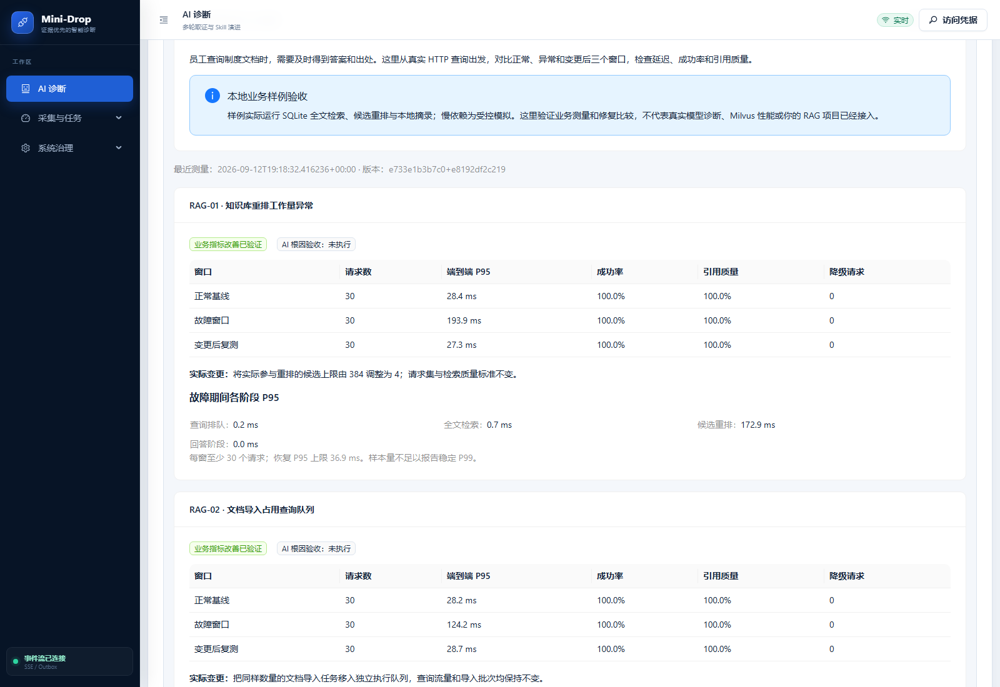
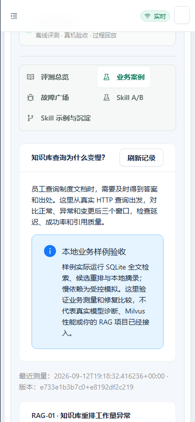

# 业务观测与同负载验收

## 2026-09-26 验收判定修复与统一执行入口（本地）

阶段 P95 只使用含有该阶段观测的请求；不存在的观测不补 0，实测为 0 仍参与统计。新汇总中的 `stage_sample_counts` 给出每阶段分母，稀疏阶段不能拿总请求数冒充采样量。降级响应现在也须达到质量阈值且不低于基线；HTTP 成功但回答全部不合格会判 `REJECTED`，不再判 `DEGRADED_AVAILABLE`。总请求延迟仍包括所有发起请求的失败与排队。

旧实际 RAG 报告缺少新增计数字段时，投影器允许该字段缺失并使用重算的完整汇总，但旧 P95、质量指标、结论和哈希仍需一致；原始报告不回写。新增稀疏阶段、零值、质量下降、历史兼容及篡改拒绝测试。可运行 `python scripts/run_quality_gate.py --profile business`，沿用本页三条真实 HTTP 案例，并额外生成总质量报告。测试工程合同、范围及开源对照见 [TEST_ENGINEERING.md](TEST_ENGINEERING.md)。

> 2026-09-13 后续更正：本页记录的引擎适配器与测量页面属于实验，不等于完整业务服务接入。原办公助手完整后台现已单独常驻部署，并通过服务目录、实时 Agent 进程发现与真实模型问答接入 Mini-Drop，见 [真实后台服务接入](SERVICE_INTEGRATION.md)。历史 A/B 成绩不转移给新部署，实际服务的诊断结论以新会话为准。

## 实际 RAG 接入（2026-09-13 后续批次）

主修复发布 `/opt/mini-drop-releases/20260913T061539Z`，更新 Web 与两个 Python Worker；最终 Web 发布为 `/opt/mini-drop-releases/20260913T064123Z`，小于 0.1ms 的正数显示为 `< 0.1 ms`，不再四舍五入为零。API、原生 Agent、数据库 schema 不变。实际 RAG 重跑会话 `insight_d3044891bd5142458b2a3fd7effd8ad9` 目标匹配，4 个采集/分析任务完成，11 条证据、4 份报告。Python 433 个有效样本定位到 JSON 解码路径，但报告仍为 `PARTIAL_WITHOUT_COUNTER`；业务同负载复测通过与 AI 严格根因未通过同时成立。[完整复盘、源码补丁、数据与截图](../reports/business-acceptance/实际RAG优化与AI联调-20260913.md)。临时业务容器已经停止，保留测试 DB/证据，线上 Mini-Drop 健康。

版本化计划增加 `RAG-ACTUAL-01`，声明冻结外部源码依赖；常规 CI 不把该外部实验自动算成通过。变更影响检查也修复“已知路径与未知代码同时变化时只选已知案例”的遗漏。后端全量 537 passed / 5 skipped，后续投影及计划定向 11 项通过，前端相关 5 项与生产构建通过。

已发现并接入本机 `AGI-saber-python/final` 的实际检索代码。本节取代下方首批“原 RAG 仓库尚未提供”的待办；下面首批结果保留历史记录。

- 实际路径：HTTP 适配器 → 原 `Engine.query_with_history_trace` → 原 `HybridStore.search_multi` → 原 `LocalRagChunkRepo.search_local` → 原父块去重与摘录。没有启动原助手完整 FastAPI 登录、上传、聊天链路，没有调用远程生成或 Milvus。
- 源码核对：Python 本地搜索逐行词法打分，读取该用户所有分块；不能在面试中把它说成 FTS5。优化前还加载 embedding JSON 和 ORM 实体，且每条分块重复计算查询词项。优化后只流式读取 id/content/parent_content，查询词项算一次，用有界 TopK 保持相同分数及 id 排序。仍为 O(N) 文本扫描，未消除规模增长成本。
- 原仓库的改动在 `internal/application/local_repos.py`；独立排序、租户隔离及增删改新鲜度回归在 `tests/test_local_rag_search_performance_contract.py`。原用户数据未修改。修复前后 102 份 Python 源文件各自冻结并记录 SHA-256，云端运行这些冻结版本。
- 请求观测记录 trace/span/parent ID、PID、实例 ID、源码指纹和阶段耗时，最多保留 512 个请求，公开保留数量和总量。观测不导出问题、答案、文档正文和凭据，不宣称已接入完整 OpenTelemetry 导出器。
- Linux 实验受限于 0.75 CPU、512MiB 容器；600 条人工制度/归档分块，各带 1536 维测试向量字段。查询不使用这些向量；保留它们是为了重现真实表的无用字段反序列化开销。三窗语料和资源相同，每秒 1 请求、30 次测量、4 次预热、最大 4 并发。六个固定问题含中英文，检查期望答案标记和非空引用，不代表一般回答正确率。
- 正常基线使用修复版，异常窗口使用保存的旧版，再切回修复版复测。P95 分别 19.07/570.03/13.03ms，三窗成功与固定答案检查均 100%；这是版本回归对照，未向真实用户业务注入故障。
- 先前 2000 分块、每秒 2 请求的本地实验发生请求积压，判 `INCOMPARABLE/LOAD_GENERATOR_LAG`。首次汇总函数缺参数，完整请求已保存，随后只恢复确定性汇总并保留原 RUNNING 报告；没有删失败数据或放宽门禁。

运行入口：

```powershell
python scripts/run_actual_rag_acceptance.py --before <修复前冻结源码目录> --after <修复后冻结源码目录> --output <新的输出目录> --rows 600 --arrival-rate 1
python scripts/build_business_acceptance_view.py reports/business-acceptance/local-20260913-01.json reports/business-acceptance/latest-view.json --actual-rag reports/business-acceptance/actual-rag-linux-20260913-01/report.json
```

第一次 AI 会话 `insight_a4081cb56ff24ea6839bbf5dc5ab5376` 误绑定旧 `python-hotspot`，不算实际 RAG 诊断。修复 `auto_scope=false` 的持久化与后台重试语义后，已完成可信绑定重跑；业务测量通过不能替代 AI 根因门禁。实际诊断阶段只向模型提供业务症状，不提供修复差异、测试真值或正确根因。

## 当前实现与边界（2026-09-13）

本轮增加独立的业务测量合同、本地知识库 HTTP 样例、三种业务问题的可重复实验、只读结果页，以及 CI 中的测试计划校验与业务请求回归。当前样例是 SQLite FTS5 检索、SequenceMatcher 重排和本地摘录；慢生成阶段是受控依赖延迟。它不是用户原 RAG 办公助手，不调用远程模型，也没有接入 Milvus。

本轮业务测量结果不进入 AI Evidence，不改变旧 Report 或 21 场景的验收状态。将真实 RAG 服务关联到 Agent/PID、业务 trace 与受控采集工具，以及根因到修复的 AI 全链路，仍须接入实际仓库后继续实施。

## 可运行链路

```text
固定问题集 → 本地 HTTP /query → 单请求队列 → SQLite FTS5 → 候选重排 → 回答/摘录
                    ↓ 每个真实请求的结果、阶段耗时与 trace_id
正常窗口 / 故障窗口 / 同负载变更后窗口
                    ↓ 可比性、成功率、引用质量和延迟门禁
完整改善 / 仅降级 / 未通过 / 不可比较
                    ↓ 完成的报告 + SHA-256 → 只读页面
```

样例 trace_id 是本地请求关联标识，当前没有声称导出了完整 OpenTelemetry span。固定问题集用英文制度文档检索，页面说明使用中文。引用质量指标检查返回引用是否包含该题预先指定文档，不代表一般语义正确率。

## 三条案例

| ID | 正常与故障 | 实施的变更 | 正确判定 |
| --- | --- | --- | --- |
| RAG-01 | 实际重排候选上限由 4 增为 384，真实词法匹配工作量增大 | 恢复候选上限 4，查询集、到达速率不变 | 延迟恢复且引用质量不下降时才通过 |
| RAG-02 | 同样的文档导入和查询共享单个执行队列 | 导入改用独立执行队列；仍导入同样批次与文档数 | 查询恢复且导入工作完成才通过 |
| RAG-03 | 受控生成依赖每次延迟 120ms | 依赖仍延迟 120ms，调用超时设为 10ms，使用摘录回退 | 仅降级可用，不能判完整恢复 |

导入使用真实 SQLite FTS5 staging 索引，不修改冻结的查询语料。导入批次属于负载，不能在修复后取消来降低竞争。依赖延迟模拟使用 sleep，报告必须保留受控依赖说明，不能把该结果写成真实服务商故障。

## 运行方法

```powershell
python -m demo.rag_service.app --port 8097
# 第二个终端访问本地接口：
Invoke-RestMethod http://127.0.0.1:8097/query -Method Post -ContentType application/json -Body '{"question":"annual leave policy"}'
```

服务默认只监听本机，没有对浏览器开放故障开关、任意 URL、数据库路径或命令。故障控制在验收执行器侧。

```powershell
python scripts/check_business_test_plan.py
python scripts/generate_business_contracts.py --check
python scripts/run_business_acceptance.py --output reports/business-acceptance/<新的名称>.json --require-outcomes
python scripts/build_business_acceptance_view.py reports/business-acceptance/<新的名称>.json reports/business-acceptance/latest-view.json
```

每次必须用新的报告名，执行器拒绝覆盖。发生中断时保留 RUNNING 汇总和已完成场景；只有 COMPLETED 且汇总、逐场哈希全部匹配时才能生成页面投影。`--require-outcomes` 将不符合计划的场景转成非零退出码，但原始数据继续保留。

## 比较规则

`server/app/drop_insight/business_acceptance.py` 是 Pydantic 源合同，JSON Schema 由 `scripts/generate_business_contracts.py` 生成，不能独立修改生成物。

- 必须匹配数据集、问题集、到达速率、请求数、并发上限、种子、预热、环境、服务及资源指纹。
- 每个发起的请求都记录一次，包含错误、超时和降级；不允许丢弃失败请求、复用 trace 或重复窗口。
- 客户端排队算入端到端延迟；负载发生器明显跟不上时判不可比较。
- 正常基线自身不健康、没有观察到故障、没有记录配置或代码变更，都不能通过。
- 本轮固定每窗 30 个请求、6 次/秒、最多 8 并发、4 次预热。P95 使用 nearest-rank；少于 1,000 个样本时不输出 P99。
- 恢复 P95 门槛为正常 P95 的 1.3 倍与 20ms 绝对容差中的较大值；成功率至少 98%，引用质量至少 98% 且不能低于本次基线。这是样例的冻结实验标准，不是生产 SLO。
- 任意回退响应只能进入降级判定，即使更快且仍返回正确引用，也不算完整能力恢复。

这些比较函数处理测量数据，不认证任意外部上传数字的真实性。当前生产接口只有读报告，没有“上传一个 JSON 就认证修复成功”的入口。

## 页面与后端

入口：AI 诊断 → 验证与 A/B → 业务案例。

`GET /api/v2/showcases/business-acceptance` 经过现有 Go 鉴权/范围边界和私有 RPC，读取服务端固定文件。默认 `/workspace-source/reports/business-acceptance/latest-view.json`，可由部署环境变量 `MINI_DROP_BUSINESS_ACCEPTANCE_VIEW` 指定。用户不能传路径。

文件缺失显示“尚未运行”；损坏显示“不能确认”；有效报告显示每条案例的窗口、成功率、引用质量、降级数、实际变更和阶段耗时。每条均显示“AI 根因验收：未执行”。本地结果在云端展示时仍标“本地业务样例”，不能冒充云端真机诊断。

## 测试计划如何维护

`contracts/business_test_plan.json` 记录稳定案例 ID、业务需求、风险、责任角色、影响路径、执行入口和预期结果。增加或删除执行器里的案例而未同步计划，检查会失败；引用不存在的测试也会失败。责任角色是分工建议，不表示已经存在对应团队成员。

CI 的 business job 校验计划、检查生成合同、生成 PR 影响清单，随后完整执行三条本地 HTTP 案例并保留证据。路径映射只是辅助，未知代码改动仍触发全量业务冒烟。现有其他语言测试继续运行。尚未配置团队级审批规则、线上真实 RAG 发布门禁或定时生产故障注入。

## 面试反馈补充与未完成项

上一份方案之外，本轮特别补强三点：

1. 个人贡献可追溯：用“问题、代码改动、关键取舍、测试和失败记录”说明自己完成的部分，不能把 AI 生成的全部代码都算作已掌握。
2. 平台收益要有人工基线：相同案例测人工操作数、诊断耗时和业务开销，尚未实测的收益明确留空，不能预填节省百分比。
3. 测试正确性独立核验：保留负例和测试方真值，避免 AI 写实现和测试时共享错误假设；只读测量摘要不能成为 Agent 根因答案。

下一阶段仍需：接入用户实际 RAG 仓库；实现业务阶段观测进入受控证据链；做真实根因诊断与同负载修复；独立留出案例和有/无 Skill 对照；完成实际 Milvus 索引实验。当前四周方案不能因三条本地测量通过而被标为全部完成。

## 首轮结果与发布

本地首轮共 270 个测量请求，另有 36 个预热请求。RAG-01 的 P95 从故障窗口 193.94ms 降至 27.34ms，RAG-02 从 124.20ms 降至 28.72ms；两条均满足本次冻结比较标准。RAG-03 从 149.61ms 降至 36.68ms，但 30 个请求都使用回退，因此只判“仅降级可用”。这些是小样例测量，不是生产收益。

机器原始记录与逐场详情见 [首轮业务验收](../reports/business-acceptance/首轮业务验收-20260913.md)。

已发布至 `/opt/mini-drop-releases/20260912T192613Z`（UTC 标签，本地日期 9 月 13 日）；只替换 Web、Diagnosis Worker、Analyzer，API 和原生 Agent 保留原版本，未修改数据库 schema。公网只读接口返回的报告哈希与本地生成物一致，三个依赖健康。发布证据见 [发布记录](../reports/ai-diagnosis/business-acceptance-deploy-20260912T192613Z.json)。

本轮 Python 全量 532 passed / 5 skipped，前端全量 38 文件 / 167 项通过，生产构建及包体检查通过，OpenAPI 校验 81 组路径通过。前端初次默认并发运行出现本机内存耗尽，失败日志保留；使用 `npx vitest run --maxWorkers=2` 重跑通过。CI 配置已经落盘，本次未向远程 Git 仓库推送，不宣称 GitHub CI 已运行成功。




