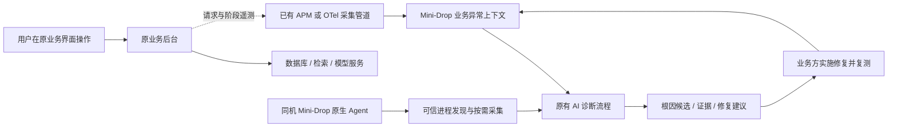

# Mini-Drop 如何接入业务：优化设计与执行顺序

> 2026-09-23 增量：AGI-saber 已接入请求级 RAG 阶段计时，并在 Mini-Drop 中选择真实问答发起诊断。此项属于专用业务遥测，不等于下文设计中的通用 OTel 连接器、SQL span、跨服务拓扑或同负载修复复测。实际状态见 [服务接入](SERVICE_INTEGRATION.md)。

> 2026-09-14 实施进展：首批 Memos、File Browser、linkding、ntfy 已运行并接入网关 request_id 与可信进程采集。八项基础操作通过；真实标题抓取与受控依赖延迟另测。详情见 [业务验收](../reports/business-acceptance/轻量业务接入与验收-20260914.md)。本文函数 span、数据库连接器与完整业务修复闭环仍属后续设计，不因部署了应用而视为完成。

日期：2026-09-13。状态：代码审查后的设计，本文新增能力尚未实现或部署。现有部署与实测结果仍以 [SERVICE_INTEGRATION.md](SERVICE_INTEGRATION.md) 为准。

## 1. 面试官关心的问题

依据用户提供的《李明远的面试-元宝纪要.txt》：16:13–18:01 追问进程承担什么业务、用户感受到什么问题；23:52–26:35 追问 RAG 查询慢的具体定位；41:18–43:08 要求从发现问题到修复的完整最佳实践。这是 AI 生成的会议纪要，不能当作逐字录音。

据此，优化目标是：业务负责人能说明接入成本；业务开发者能从一次异常请求进入诊断；诊断结果能指导具体修复；业务用户的等待、失败或资源成本有可复查的改善。

首个业务就用已有办公助手：员工上传制度文档后问问题，关心多久开始回答、多久答完、是否超时、引用是否正确。先完成一个可信案例，再推广到订单、搜索等其他项目。

## 2. 业务团队实际怎么接入

业务项目继续在自己的主机或容器运行，用户继续访问原网址。当前 `/api/office/` 只是演示访问入口，反向代理不是通用接入要求。

| 业务方的动作 | 平台负责的动作 | 完成后的能力 |
| --- | --- | --- |
| 登记应用、环境、版本、负责人、部署实例 | 建立受控的服务目录及访问范围 | 知道诊断对象属于哪个业务 |
| 在业务主机部署 Mini-Drop 原生 Agent，并设置允许的采集能力 | 发现并校验实际进程身份，控制采集时长和并发 | 获取主机指标、运行时栈与性能采样 |
| 连接已有 APM/链路系统；没有时接入标准遥测组件 | 读取授权的请求耗时、错误和阶段记录 | 知道哪类业务操作慢、慢在哪一段 |
| 在少量业务边界补充阶段记录，如检索、生成、入库 | 将业务阶段关联到同一请求上下文 | 区分检索等待、模型等待与本地处理 |
| 从慢请求或告警发起诊断 | 带入服务、实例、时间窗、业务现象，再按需采集 | 开发者不必填写 PID 或挑选 perf 参数 |
| 应用经过审核的修复，按相同业务负载复测 | 保存版本、证据、前后指标与剩余限制 | 判断修复是否有效，形成可复用案例 |

主机 Agent 安装后即可支持进程诊断，但它不会自动知道“用户在查询制度”或“这一段属于重排”。这些信息需要业务埋点或已有遥测系统提供。若业务方暂时不能改代码，应明确仅提供接口/进程级排查，不能承诺完整阶段定位。

## 3. 接入架构

建议优先对接现有链路存储，避免再造整套 APM。没有现成系统时，试点使用 OpenTelemetry SDK/自动插桩补充少量业务 span，经 Collector 输出到选定的可查询后端，再由 Mini-Drop 读取有限范围数据。Collector 本身不是历史查询数据库，Mini-Drop 当前也没有 OTLP 接收和查询能力。

OpenTelemetry 的上下文传播可以关联跨组件调用；Collector gateway 可以集中接收并转发遥测。这两个机制可作为接入基础，不能代替本项目的权限、证据和业务验收设计。参考：[上下文传播](https://opentelemetry.io/docs/concepts/context-propagation/)、[Collector gateway](https://opentelemetry.io/docs/collector/deploy/gateway/)。

OpenTelemetry Collector 与 Mini-Drop 的 C++ Agent 分工不同：前者处理遥测，后者发现进程并执行受控采样。业务请求不应同步等待诊断服务，Mini-Drop 不可用也不应使问答不可用。

## 4. 当前实现与具体缺口

| 位置 | 已经存在 | 需要优化 |
| --- | --- | --- |
| `server/app/drop_insight/managed_services.json` | 服务到指定 Agent/systemd 的静态登记 | 增加受控的业务归属、环境、实例、版本及遥测源关联；先保持配置登记，暂不做复杂自助门户 |
| `server/app/drop_insight/managed_services.py` | 新鲜快照、精确服务匹配、重启后重新绑定 | 诊断目前只接收症状和模式；增加来自已校验业务异常记录的上下文 |
| `server/app/diagnostic_ai_rpc.py` | 服务查询与创建诊断接口 | 增加异常查询/选择入口及范围授权，维护源模型和 OpenAPI 合同 |
| `server/app/drop_insight/evidence.py` | Task/Artifact/Analyzer 来源链与质量门禁 | 业务观察与原生采样分开建模；不能伪造 task_id 或直接把请求日志当成有效支持证据 |
| `web/src/components/ManagedServicesPanel.jsx` | 选择后台、输入现象并诊断 | 复用此处展示近期异常和选中的请求上下文，不再另造只有说明文字的业务页面 |
| 原助手 `internal/handler/handler.py` | HTTP request_id、日志、普通与流式问答接口 | 修正计时口径；跨线程传播上下文；验证同步处理阻塞、流式取消及错误语义 |
| 原助手 `internal/application/api.py` | 按用户隔离的 RAG trace 查询 | 梳理与 HTTP 请求的关联，仅输出授权、脱敏的诊断投影，不整包导出问题和文档正文 |
| `integrations/agi_saber/traffic.py` | 有界真实 HTTP 流量 | 增加原 UI 使用的流式请求验收、登录与问答分开测量、上传与问答并发场景 |

上表原助手路径相对于 `D:/洛伦兹力不做功/Desktop/AGI-Core项目/AGI-saber-python/final`。这些是待修改位置，不是已经交付的功能列表。

代码审查发现的具体问题：

1. `production_guardrails` 在 `await call_next(request)` 后记录耗时，尚未跟踪流式响应最后一个消息发送完毕。该日志不能直接称为流式问答总耗时；应分别记录响应开始、首个有效答案 token、正常结束/取消/失败。
2. 普通 `async def chat` 直接调用同步 `process_with_options`。若调用在事件循环线程执行耗时工作，会阻塞其他请求。先用并发问答及轻量健康请求复现；再根据业务对象的线程安全和取消语义选择异步调用、受限执行池或后台任务，不能机械地换成无限制线程。
3. 流式路径用显式 `threading.Thread` 执行业务。新增 trace/span 上下文时必须传入线程并测试并发隔离，不能只在 HTTP 中间件设置一次上下文。
4. 当前原生采样包含登录和问答混合负载。`AuthService.login` 占样本较多不等于一次问答主要慢在登录，不能将进程栈比例当作请求各阶段耗时。

以上第 2 项是源码支持的风险，尚无本轮复现数据，不能写成已确认的线上根因。

## 5. 一条业务异常需要带什么

先定义独立的业务观察对象，再定义由观察生成的诊断上下文。字段建议如下；不是已发布 API。

| 字段组 | 内容与用途 |
| --- | --- |
| 归属 | 平台登记的 service_id、环境、受信实例映射；从认证与登记得出，不能只信请求自报 |
| 关联 | request_id、trace_id、span_id、parent_span_id；用于关联观察，不授权操作某个进程 |
| 请求 | 方法、路由模板、服务版本、开始/结束时间、HTTP 状态与业务完成状态 |
| 业务阶段 | 本地检索、生成、入库等实际执行阶段的起止时间、结果、依赖种类；未执行的阶段不填零 |
| 流式结果 | 首个有效答案 token 时间、结束时间、正常完成/客户端取消/业务失败；HTTP 200 不能代表回答成功 |
| 质量与规模 | 测试语料版本、分块规模、召回数量、模型配置版本等有限元数据；答案质量由独立验收计算 |
| 来源与完整性 | 遥测源、采样策略、接收时间、丢失/截断标记、关联源记录；记录时钟偏差和不完整范围 |

不同计时明确命名：服务器请求时长不等于浏览器用户等待；首个 SSE `start` 事件不等于首个答案 token。持续时长在本地用单调时钟测量，跨系统关联保留 UTC 时间及误差。嵌套、重叠、并行 span 不能简单相加后当作总耗时。

遥测默认不包含密码、Cookie、Authorization、提示词、用户文档、SQL 参数和完整 URL 查询串。只上传白名单字段；指标标签使用路由模板，不能使用 request_id 或用户文本造成无界基数。业务侧采用有界、异步导出，队列满时记录丢弃数量；平台不应要求业务请求为遥测无限重试。

权限必须覆盖写入与读取：业务上报凭据仅能写所属服务，查看异常与发起采集沿用真实用户授权。当前 V2 受限资源账号仍返回 403，补完范围隔离前不能宣传可供多个团队安全自助使用。

## 6. 从异常到采集，保留时间与证据边界

建议异常记录拥有独立 incident_id，并引用源观察；诊断创建接收 incident_id，再由服务端读取已授权上下文，而非让浏览器提交任意“证据 JSON”。任务、报告和复测继续引用该异常记录，保留各自版本和时间。

- 历史请求已经结束：展示保存的阶段记录；如需采样，明确要求在相同版本和负载下复现。后来的采样标注“复现窗口”，不能标为原请求的火焰图。
- 故障正在持续：用异常对应的服务与实例选择可信目标，限定采样时长和并发；若实例已重启，明确显示“历史实例已结束”，新实例仅作为复现目标。
- 同一 PID 同时处理多个请求：阶段 trace 属于请求，进程 profile 通常属于时间窗。没有额外的请求级采样关联机制时，不声称两者一一对应。
- 有阶段异常但无运行时证据：允许报告“生成阶段等待增加，原因未确认”；下一步取证，不根据单个长 span 宣称供应商故障。
- 有火焰图但没有业务异常：保留性能观察，不宣布已经找到了用户问题。

业务观察不能自动满足现有 Evidence 的采样门禁。首版把它作为带来源的诊断上下文；后续若纳入正式证据，应增加专门的来源模型与验证器，保留原生证据规则，测试来源伪造、范围错误、时间不重叠和不完整数据。

## 7. 第一条业务案例怎么做

场景：员工问答在文档导入或并发问答期间出现等待。业务流程是真实登录、上传、入库和模型问答，使用独立测试账号与人工编写语料。

1. 冻结业务源码版本、数据量、检索配置、模型配置与请求集，先记录正常基线。登录单独测量，避免认证计算混入问答采样；共享用户会话状态的并发请求另设测试。
2. 从实际代码风险中复现异常：优先验证同步问答是否阻塞其他请求，以及导入是否影响问答。不能用任意 sleep 代替真实缺陷后宣称发现了原业务问题；若采用依赖延迟注入，必须标记受控故障。
3. 从慢请求进入 Mini-Drop，携带真实服务、版本、时间、阶段信息。诊断程序只接收症状与观测，预设根因真值留给验收端。
4. 根据阶段变化选择采集器：本地计算考虑 Python/CPU 栈；等待考虑依赖时长、事件循环延迟和适合该运行时的等待观测。不能因为现有 CPU 工具可用就固定调用它。
5. 至少区分本地处理与远程模型两条竞争解释。记录支持与反证；定位到具体路径之后实施对应修复。尚未复现或定位时不先写结论。
6. 在相同负载、语料和配置下复测，记录问答首 token P95、总耗时 P95、业务成功率、取消/超时、引用质量及平台开销。真实模型波动单独标明，受控依赖实验只解释局部机制。

先完成小规模可重复工程验证，再做多窗口重复及更大样本。原来的 180 次请求成功仅证明集成路径可用，不提供上述根因或改善结果；21 个故障场景的严格成绩也不因此变更。

## 8. 分阶段交付与验收

| 顺序 | 交付内容 | 验收条件 |
| --- | --- | --- |
| P0：先看清一次请求 | 原助手请求/阶段关联、流式计时、完成状态；选择已有 trace 投影或 OTel 查询后端，给出实际资源预算 | 普通成功、失败、并发、流式首 token、完成、取消均口径正确；线程不串请求；不导出正文或凭据 |
| P0：让请求进入诊断 | 业务观察与异常合同、受限读取、服务端上下文装配、已有入口选择异常 | 同一异常关联到正确服务与版本；旧实例不会静默替换；跨服务读取/写入/采集被拒绝；无日志不显示零 |
| P0：跑通一个修复案例 | 完整后台正常/异常/修复窗口，诊断报告与业务复测关联 | 真实业务症状、具体缺陷、支持与对照证据、修复差异、业务恢复分别有记录；失败状态如实保留 |
| P1：降低推广成本 | 可复用接入配置、最少埋点示例、依赖配置与卸载说明、第二个业务服务试点 | 第二个服务不需要改诊断算法即可接入；业务方明确需改哪些配置/代码、数据保留多久、谁能访问 |
| P1：持续使用 | 业务方约定阈值的告警入口、限流去重、采集预算与反馈 | 重复告警合并；业务高峰不触发采集风暴；遥测/诊断不可用不阻断业务；测量采集开关前后开销 |
| P2：扩大场景 | 多实例聚合、Kubernetes、跨服务依赖、容量与长期稳定性 | 有真实部署与测试需求后实施；不能用拓扑图代替定位证明 |

测试计划随合同与实现一起修改，CI 检查字段与权限回归；有业务行为变化的 PR 必须说明影响的端到端用例。发布后保留源码版本、环境、原始测量、诊断报告和失败原因。P0 的计时、上下文和证据链未通过前，暂不扩展更多业务案例展示。

## 9. 面试演示如何变化

演示从原办公助手开始：发起真实问答，展示等待或失败；凭请求记录进入 Mini-Drop，解释选中的服务、实例及时间；展示某阶段异常与对应运行时证据、排除过的其他解释；打开具体修复差异；最后回到办公助手及相同条件下的复测记录。

只有完成这条流程，才可以陈述“帮助业务解决了什么问题”。当前可以陈述“已部署独立业务后台并能绑定、采集”，还不能陈述“业务请求自动关联和完整修复案例已完成”。

## 10. 开源业务项目选型（用户追加要求，2026-09-13）

> 后续选择调整：用户进一步要求轻量、多个小业务，第 11 节为当前优先方案。本节保留较重项目的比较依据，Petclinic 和电商微服务移至后续备选。

可以用开源项目补全业务场景。实际运行上游业务流程，用真实 HTTP、真实数据库和明确标注的模拟外部依赖完成诊断实验，能够证明平台处理这类业务问题的能力；没有真实客户持续使用时，应称为“开源业务场景验证”，不能写成生产客户落地。

本次查看了下列上游仓库与官方文档。表内“诊断方向”是候选实验，不代表已发现上游缺陷。尚未下载构建、部署或验收这些新增项目。

| 项目及原始来源 | 可以演示的业务 | 适合验证的诊断方向 | 本项目采用建议 |
| --- | --- | --- | --- |
| [Spring Petclinic 主版本](https://github.com/spring-projects/spring-petclinic) | 登记宠物主人、宠物，查询资料，新增就诊记录；自带网页 | 查询/保存延迟、JVM 计算与等待、数据库访问及连接池 | 首个外部业务试点；单应用优先，选择独立 PostgreSQL 测试库，保留原网页 |
| [Spring Petclinic REST](https://github.com/spring-petclinic/spring-petclinic-rest) | 相同诊所实体的 REST 操作 | API 并发、服务层与持久化层关联 | 主版本的替代选项，不重复算第二类业务；它没有自带 UI，需要另配 Angular 前端 |
| [OpenTelemetry Demo](https://opentelemetry.io/docs/demo/) | 电商浏览、购物车与结算链路 | 跨服务等待、错误传播、依赖不可达 | 第二阶段优先；已有遥测和故障开关，适合检验 Mini-Drop 能否利用已有 APM 信息 |
| [Online Boutique](https://github.com/GoogleCloudPlatform/microservices-demo) | 商品浏览、购物车、结算，多语言微服务 | gRPC 调用、购物车 Redis、结算依赖链路 | 电商备选；上游主要展示 Kubernetes 部署，支付、发货和邮件为模拟实现；不与 OTel Demo 同时开工 |
| [mall](https://github.com/macrozheng/mall) | 中文商城前台与后台，商品、购物车、订单 | 数据库查询、缓存、搜索与消息依赖 | 后续面向 Java 电商的扩展；先锁定具体版本及所需模块。只启动管理后台不能算完成购买链路 |

选择依据：Petclinic 主版本默认 H2，也提供 PostgreSQL/MySQL 配置；本次建议使用 PostgreSQL 是为了验证数据库业务路径，不是为了复用 Mini-Drop 自己的数据。REST 版本与主版本分别计入构建来源，不能混用接口文档。mall 上游列出多种中间件，说明仅运行 admin 时可以缩减到 MySQL/Redis；完整商城应根据选定源码的实际调用确认依赖，不能直接将它改成 PostgreSQL。[Petclinic 数据库配置](https://github.com/spring-projects/spring-petclinic#database-configuration)、[REST 说明](https://github.com/spring-petclinic/spring-petclinic-rest)、[mall 部署说明](https://github.com/macrozheng/mall#%E7%8E%AF%E5%A2%83%E6%90%AD%E5%BB%BA)。

OpenTelemetry Demo 官方当前列出约 6GB 内存、14GB 磁盘，minimal 模式约 3GB 内存；其故障开关包括支付失败、支付服务不可达等。可以使用这些受控故障，验收端保存开关真值，诊断端通过业务请求与遥测判断；关闭开关应称为“撤销注入后恢复”，不能称为“代码修复”。[资源要求](https://opentelemetry.io/docs/demo/docker-deployment/)、[故障开关](https://opentelemetry.io/docs/demo/feature-flags/)。

本次只读检查控制机得到总内存 3499MiB、可用内存 1670MiB、根盘可用 6261MiB。该快照不是另外两台 Worker 的资源测量；不能把多台机器内存直接相加当作单机部署容量。暂不在控制机启动完整 OTel Demo，不删除现有数据或历史发布来腾空间。Petclinic 的最终选址仍需测量目标 Worker 的可用资源及构建/运行峰值。

### 首个外部项目的接入执行单

1. 冻结 Petclinic 上游提交、许可证、构建依赖与源代码哈希，保持它是独立业务项目；Mini-Drop 只维护接入配置、遥测配置、业务负载与验收材料。保留上游署名，贡献说明聚焦本项目增加的诊断接入与验证。
2. 在独立运行目录和独立业务数据卷部署，端口与现有服务分离。配置稳定的服务身份，由目标 Agent 发现实际进程；不复制固定 PID，不使用 Mini-Drop 数据库管理员凭据。
3. 保留原业务网页，完成“登记主人 → 登记宠物 → 新增就诊记录 → 再次查询确认持久化”的浏览器验收，再编写相同业务动作的有界负载。
4. 通过 Java 遥测接入 HTTP/JDBC 观察，绑定业务请求与服务实例。数据库端观察另设只读、限定范围的连接器；当前 Mini-Drop 没有通用 SQL 根因诊断能力，Java 栈本身不能证明缺哪个索引。
5. 固定测试数据规模，先测基线，再选择一种可复现的业务异常。数据库慢查询、锁等待或连接池排队都只是候选；根据真实观测选择，不能假定上游存在某种缺陷。
6. 报告分别记录受影响的业务操作、阶段变化、进程采样、数据库观察及竞争解释。对发现的缺陷实施修复并复测；若只是注入场景，标注注入与恢复的边界。
7. 保留原页面、异常请求、诊断证据、修复差异和复测五组材料。以业务结果与根因证据决定是否通过，不能以容器健康或任务成功替代。

采用顺序：先把已有 RAG 请求接入能力做通，再用 Petclinic 检验它能否迁移到另一种业务；随后选择 OTel Demo 扩展跨服务能力。研究多个项目用于选型，实施优先保证每个项目都有完整、可复查的业务案例。

## 11. 轻量小业务组合（当前优先方案）

用户要求业务场景更多、单个业务更小。优先选择可独立运行、自带交互入口、数据库依赖少的项目。以下保留选型时的目标操作。首批四个已在 9 月 14 日部署并记录资源，扩展两项未部署；实测范围以验收报告为准。

| 顺序 | 开源项目 | 最小部署方式 | 两个业务验收场景 | 排查方向（待验证，非上游已知缺陷） |
| --- | --- | --- | --- | --- |
| 首批 | [Memos](https://usememos.com/docs/deploy/docker) | Go 单应用，SQLite 与本地附件，不必单独部署数据库 | 写笔记后按标签查找；上传附件再读取 | 数据量增长后的查询、写入与附件 I/O |
| 首批 | [File Browser](https://filebrowser.org/installation) | 单二进制或容器，内嵌数据库及独立文件目录 | 上传再下载校验一致性；浏览包含大量文件的目录 | 磁盘/网络吞吐、目录操作、并发传输等待 |
| 首批 | [linkding](https://github.com/sissbruecker/linkding) | Python/Django 单应用，默认 SQLite；首批不用网页归档浏览器组件 | 添加书签并读取页面标题；导入书签后筛选标签 | 外部网页等待、后台任务积压、数据库查询 |
| 首批 | [ntfy](https://docs.ntfy.sh/install/) | Go 单应用，可用本地 SQLite 持久缓存 | 测试客户端订阅后接收消息；断开再连接读取缓存消息 | 长连接、消息延迟、慢消费者与缓存写入 |
| 扩展 | [Vikunja](https://vikunja.io/docs/full-docker-example/) | 单应用，可用 SQLite 与附件卷；外部数据库按规模再选 | 新建/完成待办；筛选任务与更新看板 | 列表查询、并发修改、附件读取 |
| 扩展 | [Miniflux](https://github.com/miniflux/v2) | Go 单应用加 PostgreSQL；原生要求 PostgreSQL | 刷新 RSS 后读取文章；搜索并标记已读 | 外部订阅源等待、后台刷新与 PostgreSQL 查询 |

功能与部署来源补充：[Memos 使用流程](https://usememos.com/docs/getting-started)、[File Browser 内嵌数据库](https://filebrowser.org/cli/filebrowser.html)、[linkding 安装](https://linkding.link/installation/)、[ntfy 缓存配置](https://docs.ntfy.sh/config/)、[Vikunja 看板与任务](https://vikunja.io/features/)。Memos 文档含候选版本功能，实施时锁定稳定版本及对应 API，不直接照搬候选版字段。

Miniflux 是有意保留的数据库业务样例：不为了省资源把它改成 SQLite，也不让它访问 Mini-Drop 的业务表；如部署，应使用独立业务数据库和账号，并确认数据库实例的资源与故障隔离。Shlink 短链接也查看过，其 PHP 运行时、管理端与地理位置配置增加接入工作，暂不放进最先一批。[Shlink 上游部署说明](https://shlink.io/documentation/install-docker-image/)。

### 业务多样性不靠堆项目数量

首批四个项目覆盖四种不同的业务路径：笔记读写、文件传输、书签网页抓取、通知发布订阅；已有办公助手继续覆盖检索与模型等待。后续两个项目补充任务协作与 PostgreSQL 后台刷新。表中的 12 个新业务操作是验收计划，不能计入已执行或通过数量。

为每个操作保存原始业务结果，而不只测 HTTP 成功：笔记内容和标签应一致，文件上传下载需校验哈希，书签标题应来自测试页面，通知需核对消息 ID、收到时间和缓存读取结果，待办状态应持久化，订阅文章应正确入库。已有通知测试只针对我们自己的测试客户端，不发送给外部人员。

每个项目仍独立运行，通过统一服务登记、请求/任务上下文、Agent 采样和原报告链路接入。不能为了“整合”将所有操作改写为 Mini-Drop 自己的假接口，也不把新业务的网页复制成平台页面。

### 资源安排与试验次序

1. 先选 Memos 验证最小接入路径；按稳定版本部署原应用，记录实际空闲 RSS、正常负载峰值、镜像/数据大小，再决定驻留配置。
2. 接 File Browser 验证 I/O 路径；使用专用测试文件目录与有限文件大小，不挂载用户个人资料或平台证据库。
3. 接 linkding 与 ntfy，分别验证外部等待和长连接。网页与 RSS 使用本地可控制的测试源；关闭不属于试验的外部归档/推送集成，避免网络波动及额外开销。
4. 每次仅对一个业务施加有界负载，其他业务低负载或按需启动；共享磁盘上的 I/O 压力仍会相互影响，跨业务干扰须记录，不能假设容器内存限制能隔离磁盘。
5. 完成一个业务的“正常 → 异常 → 诊断 → 修复或撤销注入 → 复测”后再扩展。先通过实例映射、访问范围、请求关联、真实结果校验，随后才累计场景数量。
6. 原有机器资源快照只能用于预筛选，部署前读取目标 Worker 的当前状态。没有实测前不承诺六个项目能同时跑满负载；不新购服务器，不删除现有业务数据或证据。

本节最初是选型计划；9 月 14 日首批部署与验收见文首进展，未执行的场景继续保留为计划。
