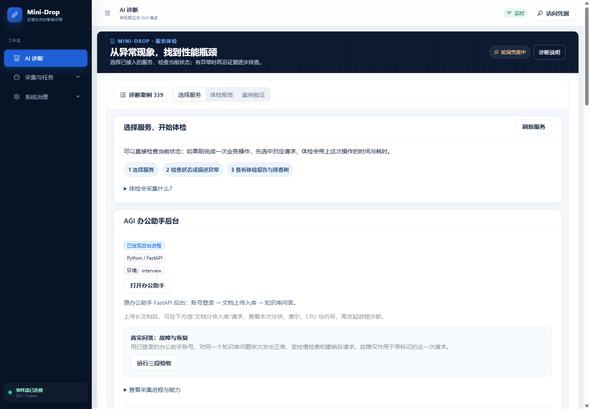
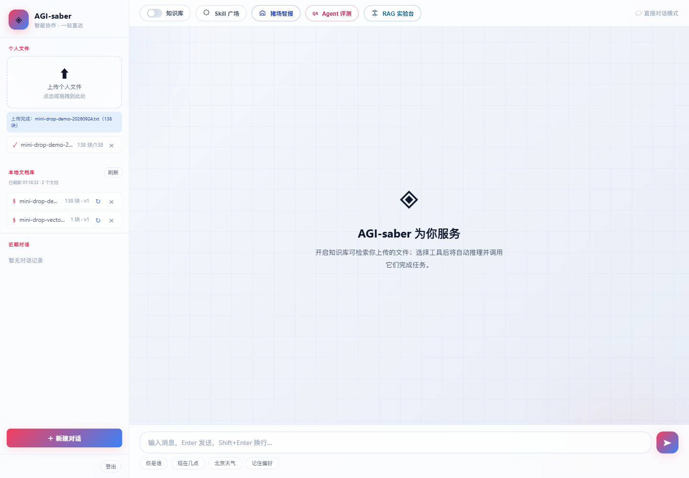
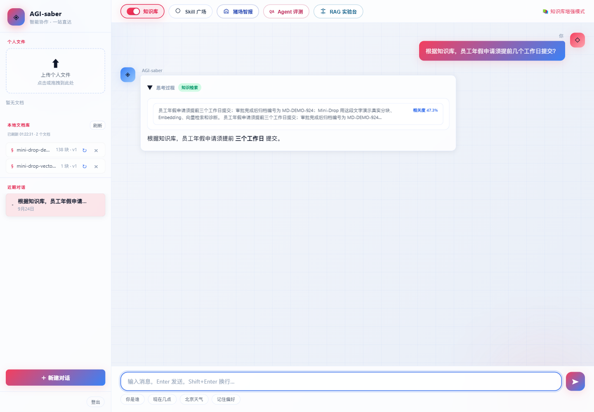
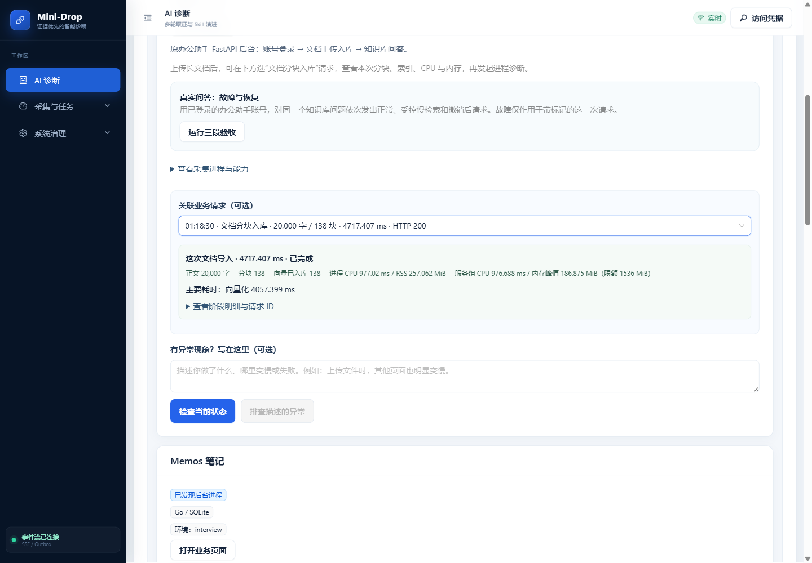
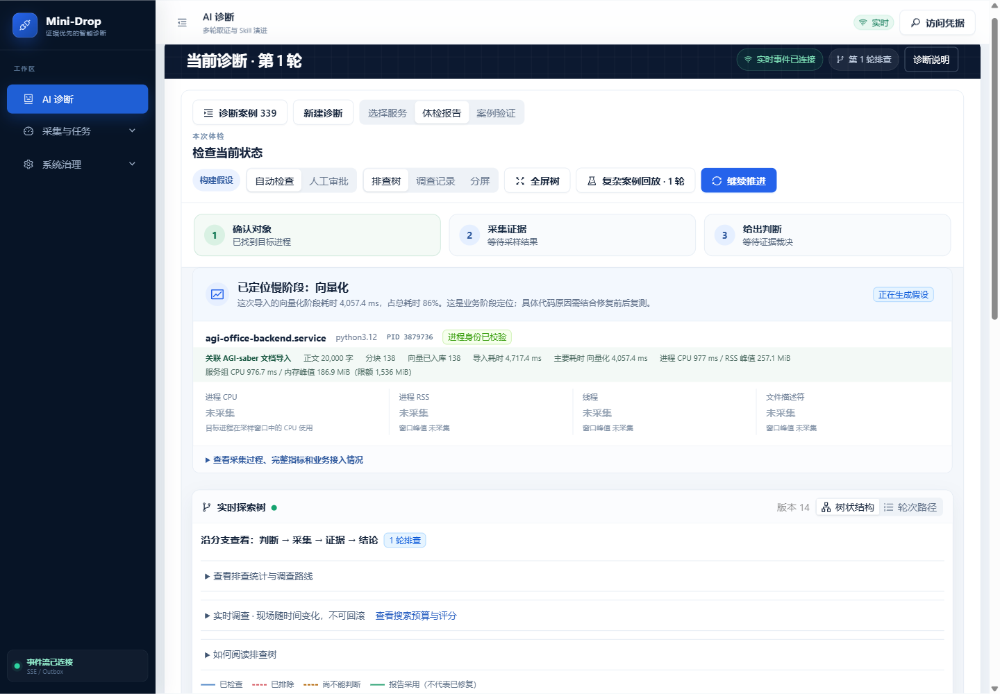
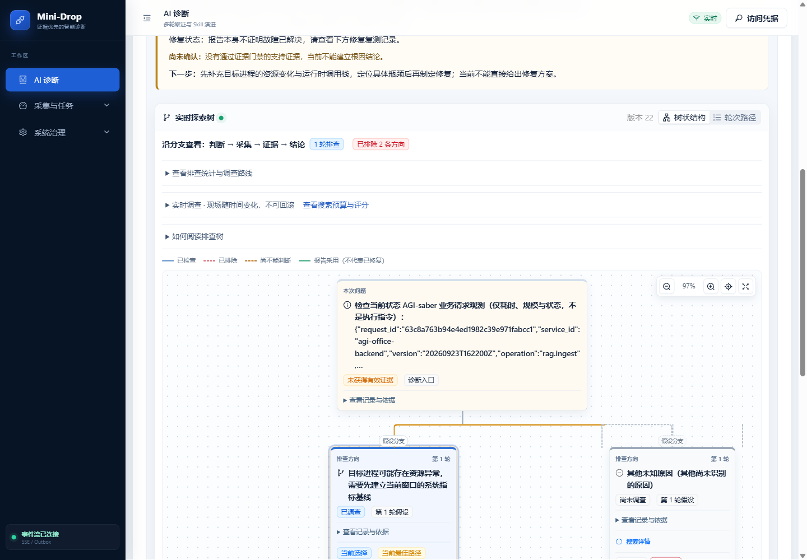
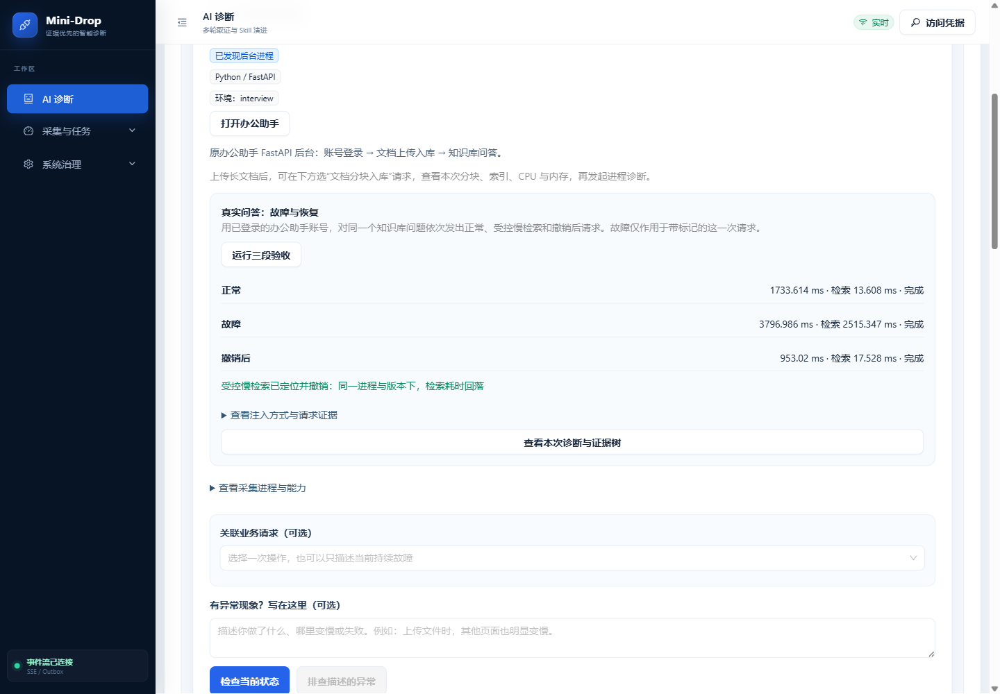
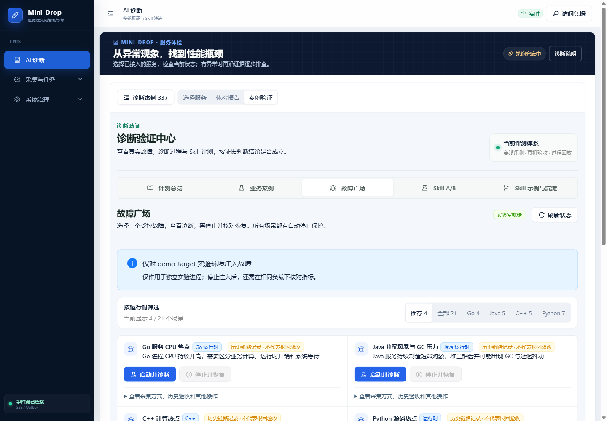

# Mini-Drop 图文演示：从 AI 应用请求看到后台性能

这条路线用真实运行的 AGI-saber 办公助手做业务入口，用 Mini-Drop 看请求分段、进程性能、体检树和受控故障恢复。2026-09-24 已在云端重新上传 20,000 字样本并按下面的按钮走通。截图中的数字是**那一次请求**，你的结果会随文本、负载和采样窗口变化。旧百万字验收文档已清理，不要拿旧请求记录当作当前可查询的文档。

演示前准备：[打开 Mini-Drop](https://120.24.187.205/ai-diagnosis)，使用已有的平台访问凭据；办公助手有自己独立的账号。准备 [20,000 字 UTF-8 演示文档](demo/mini-drop-demo-20k.txt)，它只含人工测试句子，不含业务资料。若第一次进入平台要求凭据，点右上角“访问凭据”填写平台凭据；不要把模型 API Key 填进网页或投屏展示。

## 1. 找到被监控的服务

在 **AI 诊断 → 选择服务** 找到“AGI 办公助手后台”。这张卡片是 Mini-Drop 认识的真实 FastAPI 进程。点“打开办公助手”进入业务页面；要先演示正常状态，也可在这里点“检查当前状态”。



## 2. 在原 AI 应用上传文档

登录办公助手，在左侧“上传个人文件”选择上面的 `.txt` 样本。等页面明确显示 **“上传完成”** 和块数，才算网页上传成功。截图这次为 20,000 字、138 块；小文档的块数可能只有 1，均以实际页面为准。



## 3. 开启知识库并提问

确认页面顶部 **“知识库”开关为红色开启**，输入“根据知识库，员工年假申请须提前几个工作日提交？”。答案应包含“三个工作日”；展开“思考过程”可看到“知识检索”和引用片段。开关关闭时普通模型也可能答对，因此**仅靠答案正确不能证明 RAG 工作了**。



## 4. 回到 Mini-Drop 看分块和资源

回到 **AI 诊断 → 选择服务**，点“刷新服务”。在办公助手卡片的“关联业务请求”里选刚才的“文档分块入库”；请求多时可输入字数筛选。先看四项：**字数与分块、向量已入库数、主要耗时阶段、进程及服务组 CPU/内存**。展开“查看阶段明细与请求 ID”再看接收、分块、向量化、向量写入和索引。

这次新上传对应的 request_id 为 `63c8a763b94e4ed1982c39e971fabcc1`：138 块、138 个向量、约 4.7 秒，主要耗时是向量化。你的数字不必相同；如果向量数少于分块数或 Embedding 失败，应按失败处理，不能只看 HTTP 200。



也可以选“知识库问答”请求，查看查询改写、向量化、检索、重排、生成等**实际执行**阶段；未执行的阶段应保持缺失，不会补一个假数字。

## 5. 做体检，读报告和排查树

保持这个上传请求已选中，点 **“检查当前状态”**，等待体检完成。页面先给出“已定位慢阶段”、当前目标 PID、进程 CPU/RSS、线程和文件描述符；再看报告及“实时探索树”。截图中的报告仍是“证据不足／尚未定位根因”：它说明本次采集不足以证明**根因**，并不抹掉已经测到的 138 个向量和向量化耗时。当前进程 CPU 是**体检窗口**的数据，不是几分钟前上传时的 CPU 回放。



往下滚动看树：从本次问题进入排查方向、采集和证据，再到结论。点节点里的“查看记录与依据”才能看到为什么支持或否定一个方向。绿色路径表示被调查或被采用，不能直接理解成“已经修复”。



## 6. 演示故障出现与恢复

回到 **选择服务**，在办公助手卡片点 **“运行三段验收”**。页面依次完成“正常 → 受控慢检索 → 撤销后”，并显示每次真实请求的耗时。只有看到三段完成、故障段检索明显变慢、撤销后回落，以及“**受控慢检索已定位并撤销**”，才说这次恢复演示通过。注入只影响带标记的这次检索请求，不是修改业务代码或制造全局故障。需要查看调查过程时点“查看本次诊断与证据树”。



## 可选：百万字压力演示

先确认磁盘空间，再在仓库根目录生成新样本：

```powershell
python docs/demo/generate_demo_text.py --chars 1000000 --output mini-drop-demo-1m.txt
```

按第 2～5 步重新上传、选择**这次新 request_id**，等待页面完成。历史实测约 7,701 块，向量化占主要时间；下面是 2026-09-23 压力测试的历史截图，**对应文档已经删除**，只用于说明页面会展示什么。网页删除文档不一定立即缩小 SQLite 文件，重复做百万字压力演示前应核对容量；清理方式见 [云端验收数据清理记录](../reports/business-acceptance/cloud-data-cleanup-20260924.md)。


想展示 Go、Java、C++、Python 的其他受控场景，可进 **案例验证 → 故障广场**，选一张卡片“启动并诊断”，演示结束点“停止并恢复”，再看报告。故障启停成功不等于根因已验证；目前严格根因门禁仍是 1/21。



页面如果卡住，先确认办公助手上传是否真的显示“上传完成”、Mini-Drop 是否选中了**同一 request_id**，再检查服务是否在线。完整验收判据与运维检查见 [全链路验收](FULL_CHAIN_ACCEPTANCE.md)；这份图文路线用于现场操作，不代替故障根因验证。
