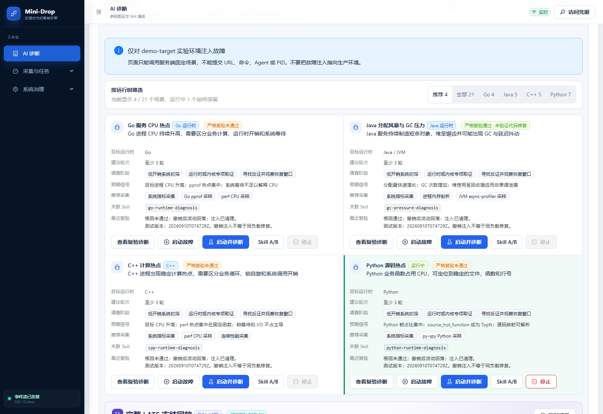
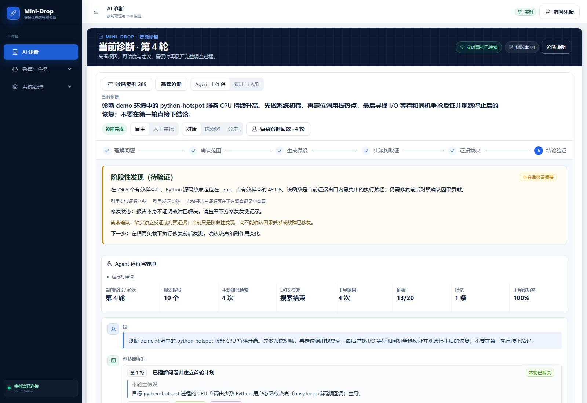

# 21 场景严格验收

本轮由用户明确要求重新验收，使用云端四种运行时的 21 个受控故障。历史的 `passed: true` 只代表链路与清理校验，不能当作根因准确率。

## 执行与证据

- 执行器：`scripts/run_fault_plaza_strict_acceptance.py`；通过已认证的 Client 和只读实验室快照提供器调用 `run_campaign`。
- 本轮入口：`output/acceptance/project-review-20260910/run_strict_21.py`。凭据只在内存中读取，不写入报告。
- 每个故障最多注入 300 秒，诊断预算 240 秒；串行运行，在 finally 中停止故障，确认停用后才进入下一场景。
- 正常、故障和撤销后三个独立窗口读取真实 `/snapshot`。累计计数比较窗口内增量，不能拿累计总数当实时延迟或实时负载。
- 每个场景保存原始诊断、工具调用、任务/尝试/产物与 SHA-256、全部证据、假设、报告和被拒绝的声明。失败不会使证据丢失，也不能用后来的成功覆盖原始失败。
- 对报告中的 `verification.status`、独立反证或对照、覆盖率、具体发现与场景词汇逐项核对。只重复假设的结论不算命中。

## 通过口径

| 字段 | 含义 |
| --- | --- |
| `lineage_verified` | 旧链路校验器检查通过；不等于根因成立 |
| `root_gate_verified` | 报告是 VERIFIED、有独立反证或对照、覆盖率为 1、有支持引用 |
| `root_cause_accepted` | 上述门禁通过，并给出与该场景相符的具体结论 |
| `injection_observed` | 测量窗口观察到场景规定的实际指标变化 |
| `recovery_observed` | 撤销注入后的规定指标回落，不是仅凭 active=false |
| `cleanup_verified` | 故障广场回读确认故障停用 |
| `passed` | 链路、根因、指标恢复和清理同时通过 |
| `fix_verified` | 本次没有修改故障程序的修复实验，始终为 false |

场景词汇匹配是保守的自动筛查，最终仍须阅读报告判断函数、资源或依赖是否解释了故障。单次 21 场景结果不能称为生产准确率或大样本 A/B 结果。

**撤销注入会减少工作负载。** 因此 `recovery_observed` 仅证明被注入的活动消退，不证明同样流量下延迟/SLO 恢复，也不能证明完成了代码修复。快照作为验收方独立观测保存，不会写入 Agent 的证据表，更不会把它冒充 Agent 自己采集出的反证。

## 页面和历史报告

旧的 `LIVE_DIAGNOSIS_VERIFIED`、`FULL_CHAIN`、`LIVE_E2E` 标签不能继续显示“全链路已验收”。当前场景定义改为 `HISTORICAL_LINEAGE_VERIFIED`；前端兼容旧接口时也明确显示“历史链路记录 · 不代表根因验收”。没有验收字段的场景显示“尚无验收记录”，不再根据场景名称硬编码通过。

首轮完成后的汇总是 `reports/ai-diagnosis/fault-plaza-strict-21-20260910-r2.json`，每场原始数据在同名 `-cases` 目录。初次启动的运行器导入路径错误保留在不带 `r2` 的报告中；该次尚未注入故障，不计作有效场景测量。

## 本轮已定位的实现问题（已发布，另存复测）

1. 请求写出 `python-hotspot 入口请求…` 时，旧服务名解析要求后面紧跟“服务”，可能漏掉指定名称；模型随后选到了诊断 Worker。修复将明确机器名称优先匹配可信进程列表，明确进程不存在时不绑定无关候选。
2. `perf` 的 `[libpython…]` 等未解析库名曾被当成具体函数反证。修复将此类名称保留为未解析观测。
3. `continuous_perf_analysis.v2` 没有走原生采样的 self sample 限制，导致自身采样为 0 的进程名称也可能变成“100% 热点”。修复统一连续和单次采样的判断，并用真实自身采样权重判断原生函数反证。
4. 故障广场曾通过名称硬编码“全链路已验收”，或者把缺失验收字段默认为通过。修复为明确的历史链路说明或无记录。

5. Java 锁竞争请求最后提及“寻找 GC 反证”时，JVM event 被全句关键词优先级错误选择为 alloc。修复按优先出现的正向症状选择 lock/alloc/wall/cpu，并排除后续否定描述。

这些修复不能补造缺少的独立对照，也不能自动把旧报告变成 VERIFIED。原始 21 项测量使用固定云端版本；发布后的复测必须单独记录版本、诊断 ID 和结果。

上述修复于 `20260910T091223Z` 发布。当前目录为 `/opt/mini-drop-releases/20260910T091223Z`，Web 与 Python Worker 使用该标签，API 保留 `20260910T073914Z`，数据库保持 `20260910_0008`。发布后独立复测 Python 源码热点、入口负载饱和、Go CPU 热点与 Java 锁竞争，结果保存在 `fault-plaza-fixes-retest-20260910.json`，不会覆盖首轮证据。

## 页面实拍

以下截图拍摄于修复发布后、针对性复测进行中。卡片的“最近复验”当时读取首轮 21 项结果，故障运行状态则反映正在进行的新复测。

## 最新验收结果的页面投影

`scripts/build_fault_plaza_acceptance_index.py` 只接受 COMPLETED 的 Campaign，校验汇总和每场报告的规范化 SHA-256，再生成 `reports/ai-diagnosis/fault-plaza-acceptance-index.json`。该文件是生成物，不能手工修改成绩。诊断 Worker 从只读的 `/workspace-source` 证据挂载读取，故障广场逐项显示门禁结果、测试版本和诊断入口。没有有效投影时只显示历史链路说明，不能默认成功。更新复测结果只需重新运行生成器并同步证据文件，无需改写历史诊断。

首轮运行器源文件快照保留于 `output/acceptance/project-review-20260910/strict_runner_r2.py`。随后为针对性复测补充了非有限数拒绝、未解决反证拒绝和失败会话终态等待；重新核对首轮 21 份记录，结论均未改变。失败会话仍保留，不使用归档或删除来清理验收证据。

## 原生证据分支补充修复

4 项复测暴露锁反证与通用关键词匹配分支仍可引用零自身采样的进程包装帧。补丁统一可归属函数的自身权重，并排除零权重包装帧，已发布 `20260910T092419Z`。Go CPU 补充复测另存 `fault-plaza-predicate-retest-20260910.json`，不修改前两次测量。全部结果与剩余缺口见 [本轮验收结论](../reports/ai-diagnosis/21场景验收结论-20260910.md)。

## 2026-09-20 证据门禁收紧与复测要求

- 假设谓词移除了全部捏造覆盖槽位：`covered or [0]`、`[0] if falsification else []`、硬编码 `[0]`/`[0, 1]`（GIL 反证与用户态热点 SUPPORT 分支）、以及 `claim_verifier` 在谓词未映射槽位时默认补槽位 0 的兜底。覆盖槽位现在只能由判据文本与证据域的真实匹配（`_criterion_text_indexes`）产生；谓词未映射槽位时，方向性 claim 仍参与反证/对照判定，但不覆盖覆盖率分母。
- 因此 `root_gate_verified` 中"覆盖率为 1"的语义比 2026-09-10 更严格：无法再靠结构分支把覆盖槽位"送满"。
- 首轮 `1/21`（`fault-plaza-strict-21-20260910-r2.json`）与两次针对性复测均在旧门禁下测得。在新门禁下重跑 21 场景之前，这些数字不得引用为当前能力；页面投影读取历史运行记录，不会自动变成新门禁成绩。
- 复测必须按本协议执行并单独记录云端版本与诊断 ID；本地离线测试全绿不构成复测。受控回放基准（`reports/evaluation/`）不等于本协议的真机验收。
