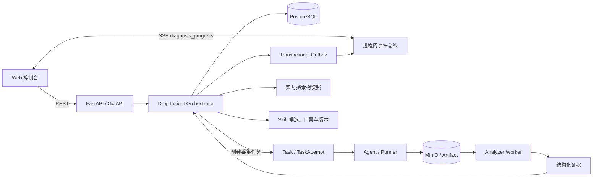

# Mini-Drop 最终答辩实现说明

> 交付日期：2026-08-27<br>
> 项目负责人：李明远<br>
> 实现主线：Drop 基础能力复刻 + 动态诊断探索树 + 诊断 Skill 演进

## 1. 这次交付解决什么

基础系统保留 Drop 复刻指南中的四条主链路：

1. Agent 负责目标发现、采集器执行和制品上传。
2. Server 负责 Agent 注册、任务租约、状态机和对象存储入口。
3. Analyzer Worker 负责领取分析任务、解析制品并产出结构化结果。
4. Web/API 负责任务编排、结果展示、审计和诊断交互。

在此基础上新增 AI 诊断层。它不是在任务结果后附加一段模型回答，而是把一次诊断拆成可追踪的假设、工具、证据、反证、方向切换、结论和恢复验证，并在执行过程中持续构建探索树。可信轨迹完成后，系统再把真实走过的路径沉淀为可评测、可发布、可隔离、可回滚的诊断 Skill。

## 2. 最终架构



关键约束：

- 任务状态、诊断事件和 SSE 发布使用事务 Outbox，避免“数据库已更新但页面没有事件”。
- 探索树不维护第二份容易漂移的可变 JSON；后端从会话、假设、工具调用、证据、报告、恢复验证和事件序列推导当前快照。
- Server 重启后，树可以从持久事实完整恢复，而不是依赖浏览器内存。
- Web 以 SSE 做实时更新，以低频 GET 轮询做断线兜底。

## 3. 动态探索树如何在过程中生长

### 3.1 数据来源

| 节点 | 持久化来源 | 何时出现 |
| --- | --- | --- |
| 诊断入口 | `drop_insight_sessions` | 创建诊断后 |
| 候选假设 | `drop_insight_hypotheses` | Planner 生成或新一轮重规划后 |
| 工具节点 | `drop_insight_tool_calls` | 工具被规划、审批、运行或失败时 |
| 证据节点 | `drop_insight_evidence` | Analyzer 结果通过证据分类后 |
| 阶段结论/根因 | `drop_insight_reports` | 证据裁决形成报告后 |
| 恢复验证 | `fix_verifications` | 修复窗口复测后 |

### 3.2 增量刷新链路

```text
领域状态变化
  -> 同一事务写入 drop_insight_events
  -> 同一事务写入 outbox_messages
  -> Outbox Dispatcher 发布 diagnosis_progress
  -> 浏览器收到 SSE
  -> 只刷新当前 diagnosis 的 exploration-tree
  -> 220ms 合并刷新其余详情
  -> SSE 断开时回退到 2.5s 轮询；连接正常时保留 10s 看门狗
```

树快照包含 `revision`。浏览器只接受不低于当前版本的快照，防止并发请求把新树覆盖成旧树。最近变化节点会标记为“刚刚更新”。树支持滚轮缩放、拖动、按钮缩放和双击复位。

### 3.3 节点语义

- 蓝色：已经调查、仍在形成证据的路径。
- 红色：被反证、工具失败或证据质量不足后剪掉的路径。
- 绿色：证据支持的根因和恢复验证路径。
- 灰色：满足停止条件后没有继续调查的方向。
- 方向切换：相邻工具跨越 CPU、Python、I/O、数据库或系统域时记录切换原因。

默认最多允许 6 轮诊断，可通过 `max_diagnosis_rounds` 在 1 至 12 轮之间配置。每轮都要有新增证据、明确反证或安全探针耗尽理由，不能让模型无边界扩展分支。

## 4. 多轮诊断与 Skill 演进

### 4.1 第一次诊断

系统按当前证据动态选择路线，允许走错和转向。最终 Skill 会保存：

- 实际调用的探针顺序；
- 探索过的假设和轮次；
- 被剪枝的分支及原因；
- 跨方向切换；
- 最少证据要求；
- 结论停止规则；
- 反证优先规则；
- 来源诊断和版本关系。

只有报告状态为 `VERIFIED`、引用了可信证据且存在真实完成的工具调用，才能生成候选 Skill。普通对话文本或静态展示数据不能直接生成发布版本。

### 4.2 发布门禁

候选 Skill 先执行三类确定性门禁：

1. 相似正例重放：同类上下文应命中并沿可信路线取证。
2. 误导反例：症状相似但根因不同，应拒绝套用旧路线。
3. 环境漂移：环境或采集能力不兼容时，应降级到动态诊断。

门禁全部通过后仍需要人工发布。门禁验证的是策略契约，不冒充真实生产 Campaign 的准确率结论。

### 4.3 一次诊断可以组合多个 Skill

一次诊断不再限制为只能命中一个 Skill。系统按当前故障类别和环境选择候选 Skill：例如先用 CPU Skill 排除用户态热点，转向 I/O 后再组合 I/O Skill。数据库按 `(diagnosis_id, skill_id)` 保留每个命中，单个 Skill 内还记录连续选择的工具步骤。

### 4.4 负迁移与回滚

- 人工反馈错误会回写本次使用过的 Skill 激活记录。
- 同一版本累计至少两次错误，且错误占比达到 50%，自动进入 `QUARANTINED`。
- 新版本发布时旧版本进入 `RETIRED`，但不会删除。
- 新版本失效后可回滚到最近一个已发布历史版本。

## 5. 页面与接口

### 5.1 页面

- `AI 诊断工作台`：案例列表、诊断阶段、证据对话、实时探索树、Skill 结果。
- `验证中心`：测试集、诊断 Skill 广场、门禁、产品对照和真实故障复现。
- `任务面板`：基础采集任务与结果入口。
- `计划任务 / 复合采集`：周期任务和跨工具采集。
- `审计日志 / 系统设置`：操作追踪与接入配置。

### 5.2 新增或强化接口

| 方法 | 路径 | 用途 |
| --- | --- | --- |
| GET | `/api/v2/diagnoses/{id}/exploration-tree` | 获取当前实时树快照 |
| GET | `/api/v2/events/stream` | 接收 Python 诊断引擎的 `diagnosis_progress` 事件 |
| GET | `/api/events/stream` | 接收 Go 控制面的任务、Agent 和旧诊断事件 |
| POST | `/api/v2/diagnoses/{id}/diagnostic-skills/candidate` | 从可信轨迹生成候选 Skill |
| POST | `/api/v2/diagnostic-skills/{id}/evaluate` | 运行三类发布门禁 |
| POST | `/api/v2/diagnostic-skills/{id}/publish` | 人工发布 |
| POST | `/api/v2/diagnostic-skills/{id}/quarantine` | 隔离负迁移版本 |
| POST | `/api/v2/diagnostic-skills/{id}/rollback` | 恢复上一发布版本 |
| GET | `/api/v2/diagnoses/{id}/diagnostic-skill-activations` | 查看本次组合的 Skill 和选择轨迹 |

## 6. 真实功能与答辩回放的边界

真实功能：

- 新建诊断后，树随真实会话、假设、工具、证据和报告增量更新。
- 所有运行时 Skill 数据来自数据库，候选生成、门禁、发布、命中、隔离和回滚均有后端状态。
- Outbox、SSE、断线轮询和版本保护参与实际运行。

受控回放：

- “复杂案例回放”准备了订单服务跨宿主机 I/O、Python 原生线程过量、数据库跨服务阻塞链三个多轮样例。
- 回放用于答辩时快速展示 5 至 6 轮诊断、剪枝和转向，不声称这些静态样例是当前现场刚运行的生产数据。
- 验证中心会明确区分确定性离线报告、当前运行实例数据和待真实环境采集指标。

## 7. 三分钟演示顺序

1. 在工作台创建诊断，指出空画布和树版本。
2. 运行 Planner，展示候选假设在过程中出现，而不是诊断结束后才画树。
3. 审批或推进工具，展示工具状态、证据节点和树版本变化。
4. 打开复杂案例回放，讲一次反证剪枝和一次跨域转向，不逐个念节点。
5. 展示可信报告如何自动形成候选 Skill。
6. 进入验证中心，展示正例、误导反例、环境漂移门禁和人工发布边界。
7. 回到相似诊断，展示 Skill 命中后减少无效探针；再说明跨方向时可组合第二个 Skill。
8. 最后展示错误反馈触发隔离以及版本回滚入口。

## 8. 代码定位

- 实时树推导：`server/app/drop_insight/exploration_tree.py`
- 诊断事件与 Outbox：`server/app/drop_insight/service.py`
- SSE 发布：`server/app/event_bus.py`、`server/app/outbox_dispatcher.py`
- Skill 演进：`server/app/drop_insight/skill_evolution.py`
- Skill 组合迁移：`server/migrations/versions/20260827_0034_diagnostic_skill_composition.py`
- 工作台：`web/src/pages/AIDiagnosis.jsx`
- 交互树：`web/src/components/ActualExplorationTree.jsx`
- Skill 广场：`web/src/components/SkillEvolutionPanel.jsx`
- 实时连接：`web/src/hooks/useSSE.js`

## 9. 验收命令

```powershell
python -m pytest tests/test_drop_insight_exploration_tree.py -q
python -m pytest tests/test_diagnostic_skill_evolution.py tests/test_diagnostic_skill_benchmark.py -q
python -m pytest tests/test_migrations.py::test_migrations_upgrade_rollback_and_reapply -q
cd web
npm test -- --reporter=dot
npm run build
```

云端发布后还需检查：

```text
GET /api/healthz
GET /api/v2/diagnoses/{id}/exploration-tree
GET /api/v2/events/stream
```

最终验收标准不是“页面上有一棵树”，而是诊断过程中的每次状态变化都能成为可恢复、可审计的树事实；也不是“报告旁边出现 Skill 标签”，而是 Skill 有来源、门禁、发布边界、真实命中记录、负迁移隔离和版本回滚。

## 10. 2026-08-27 最终回归结果

| 验证项 | 结果 |
| --- | --- |
| Python 全量回归 | `1297 passed, 3 skipped`，耗时 408.24 秒 |
| Go API 回归 | `go test ./...` 全部通过 |
| Web 全量组件测试 | `15` 个测试文件、`69 passed` |
| Web 生产构建 | Vite 构建成功，`4632` 个模块完成转换 |
| Alembic 迁移头 | `20260827_0034`，单一 head |
| Git 差异检查 | `git diff --check` 通过 |

完整回归同时修复了一个测试隔离问题：内存清理测试导入受控故障 Demo 时，默认会启动 CPU 故障线程并污染后续用例。测试现在显式关闭该故障入口，避免后台负载影响后续数据库测试；产品运行时的默认故障行为未改变。

## 11. 2026-08-28 答辩前演示加固

- SSE 建立连接后立即发送注释帧，浏览器无需等待下一条诊断事件或心跳即可显示“实时事件已连接”。
- 健康检查不再创建对象存储 Bucket；未配置 MinIO 的本地模式显示 `disabled`，已配置时执行带超时的只读探测。
- 诊断记录标题支持两行展示和完整内容提示，复杂案例不再因单行省略而难以辨认。
- 新增站点图标，真实浏览器巡检无 4xx/5xx；本地页面约 0.56 秒进入实时连接状态，健康检查约 0.19 秒返回。
- 答辩核心后端套件 `104 passed`，Web 全量组件测试 `69 passed`。动态树测试覆盖诊断事件持久化后节点和版本随过程增长，Skill 测试覆盖候选生成、门禁、发布、复用、隔离和回滚。
