# Mini-Drop 从 0 到 1 学习手册

> 读者不需要先懂性能分析或 Agent。本文先教你在网页上完成一次演示，再解释数据链、代码、LATS、Skill、记忆、操作系统和网络知识。
>
> 当前页面入口：`https://120.24.187.205/ai-diagnosis`。线上版本、健康状态和最新验收报告以 [`PROJECT_CONTEXT.md`](PROJECT_CONTEXT.md) 与 [`RESTART_HANDOFF.md`](RESTART_HANDOFF.md) 为准。

> 2026-09-08 基线：Python 501 项通过、3 项跳过，Web 32 个测试文件、133 项通过，Go 两个模块与 OpenAPI 80 组路由检查通过，Web 生产构建和 bundle 检查通过。线上版本和当前发布状态以 `RESTART_HANDOFF.md` 为准。同一发布版本的完整 Linux live Campaign 已得到 21/21，机器报告为 `reports/ai-diagnosis/fault-plaza-full-21-final-v2-20260908.json`；该结果不能外推为生产准确率。

### 这份文档怎么读

这是一份项目总教程，不是接口字典。第一次接触时按下面顺序读，面试前则直接走演示路线：

| 你的目标 | 建议阅读 |
|---|---|
| 十分钟先把页面跑起来 | 第 1～5 节 |
| 理解 AI 为什么不是“一问一答” | 第 6～13 节 |
| 学会基础采集和每个页面控件 | 第 14～18 节 |
| 从前端一路跟到 Agent、存储和报告 | 第 19～24 节 |
| 准备操作系统、网络和运行时面试题 | 第 25～27、31 节 |
| 讲清 540/500 测试集 | 第 28 节 |
| 面试现场照着操作 | [`INTERVIEW_DEMO_GUIDE.md`](INTERVIEW_DEMO_GUIDE.md) |
| 查某个目录或文件负责什么 | 第 20～21 节先理解主干，第 34 节查逐文件字典 |

文中有三种状态口径：**已实现**表示代码和合同存在；**本地回归通过**表示自动化测试通过；**真机验收通过**表示云端产生了新的 Task、Artifact、Evidence 与 Report。三者不能互相替代。

文中页面截图抓取于 2026-09-08（UTC+8），来自当前云端演示环境。Diagnosis 数量、树版本、PID、Task ID、状态和时间会继续变化，学习时看区域和按钮位置，不要背截图里的编号。所有缩略图都可以点击打开原尺寸图片。

## 1. 一句话认识这个项目

Mini-Drop 是一套面向 Linux 服务器的“证据驱动性能诊断系统”。用户描述现象，AI 决定下一项值得采集的证据，但 AI 不能直接执行任意命令；真正的采集由受控 Agent 和白名单 Collector 完成，结论必须引用当前诊断中新采集、通过门禁的 Evidence。

最小心智模型：

```text
用户描述问题
  → 服务端确定安全目标和时间窗
  → Agent 生成多个可证伪假设
  → LATS 选择下一条调查分支
  → 受控工具创建采集任务
  → Worker 上传原始产物
  → Analyzer 生成火焰图/指标/调用图
  → Evidence Gate 判断支持、反证、中性或受限
  → Agent 反思、回传价值、继续或跨域转向
  → 报告引用 Evidence，给出置信度和限制
```

项目最重要的设计不是“AI 会聊天”，而是“AI 的每个判断都落到可审计的状态、工具、产物和证据上”。

## 2. 先跑通一次：新手十分钟路线

### 2.1 保存访问凭据

打开页面后点击右上角 **访问凭据**：

- 输入框：填写部署端签发的 API Key；
- **保存凭据**：先建立同源的 HttpOnly 会话，再由页面访问 API；
- 不要把 Key 放进 URL、截图、Markdown 或前端源码。

页头的 **实时事件已连接**表示 SSE 正常；**轮询兜底中**表示 SSE 暂时断开，页面退回低频轮询。它不是要求重启服务器的提示。

### 2.2 从页面制造故障

1. 打开 **AI 诊断**。
2. 切换到 **验证与 A/B**。
3. 进入 **故障广场**。
4. 保持“推荐”筛选，先选择“Go 服务 CPU 热点”；默认推荐区按 Go、Java、C++、Python 各展示一个案例，也可用运行时筛选查看全部 21 个场景。
5. 持续时间选 `120 秒`。
6. 点击 **启动并诊断**。
7. 页面会创建新的 Diagnosis，并自动发现目标、规划、取证和更新探索树。

Go 路径最适合讲清“同一个症状、Skill 开关导致首工具不同”：开启 Skill 会优先选 Go pprof，关闭 Skill 从系统指标开始；两条路线仍必须重新采集当前证据。若要重点演示源码文件、Python 函数与行号，再选择“Python 源码热点”，其 py-spy 火焰图和 TopN 更直观。

### 2.3 人工推动下一轮

在对话底部选择 **寻找反证**，输入：

```text
验证这个热点是否足以解释 CPU，并排除 I/O 等待和同机争抢。
```

点击 **发送并继续诊断**。你应该看到新一轮假设、Tool Call、Evidence 或转向，而不是旧答案被覆盖。

### 2.4 打开探索树

切换到 **探索树**：

- 看真实父子分支，而不是一列流程卡；
- 点击 **查看评分**，区分访问次数、Q、UCT/PUCT 和报告置信度；
- 对未证实节点点击 **优先调查**或 **寻找反证**；
- 节点多时使用全屏、缩放、拖动和复位。

### 2.5 看真实采集物

打开本次 Tool Call 关联的任务，进入任务结果：

- 先看采集状态和分析状态；
- 再看 Attempt 和 Artifact；
- 最后看火焰图、TopN、调用关系图或系统指标。

到这里你已经完成了“页面制造故障 → AI 多轮调查 → 真实采集 → Evidence → 树和报告”的完整入门。

## 3. 页面地图

左侧导航有三组：

```text
AI 诊断
采集与任务
├── 任务面板
└── 计划任务
系统治理
└── 审计日志
```

全局按钮：

| 按钮 | 作用 |
|---|---|
| 左上角菜单图标 | 收起或展开导航，给工作台更多横向空间 |
| 访问凭据 | 保存 API Key；不展示业务数据 |
| 实时事件已连接 / 轮询兜底中 | 当前事件更新方式，不是业务状态 |

#### 图 1：第一次打开 AI 诊断页

[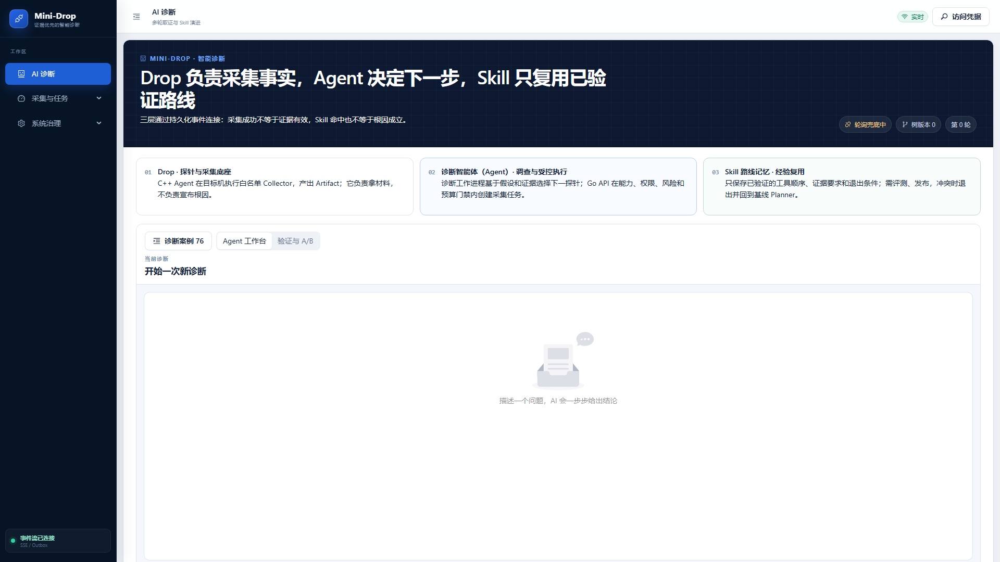](assets/learning-guide/01-ai-diagnosis-workbench.png)

从左到右、从上到下看：

| 位置 | 你看到的内容 | 演示时怎么说 |
|---|---|---|
| 左侧深色导航 | AI 诊断、采集与任务、系统治理 | “AI 是重点，但采集、计划任务和审计仍是完整产品的一部分。” |
| 页面右上角 | 实时/轮询状态、访问凭据 | “事件流负责刷新进度；凭据只用于 API 鉴权。” |
| 深色横幅 | 当前轮次、树版本、职责说明 | “Drop 采事实，Agent 决策，Skill 复用路线。” |
| 三张架构卡 | Drop、诊断 Agent、Skill Memory 的职责边界 | “模型不能直接把猜测写成 Evidence。” |
| 诊断案例 | 打开历史会话抽屉 | “历史记录在服务端，抽屉只负责选择。” |
| Agent 工作台 / 验证与 A/B | 在真实诊断和评测演示之间切换 | “两种视图不会清空当前会话。” |
| 页面底部事件状态 | SSE 或 Outbox 是否连接 | “断开时可以轮询兜底，不等于诊断任务失败。” |

## 4. AI 诊断页面：每个区域怎么用

### 4.1 页面顶部

顶部三张架构卡说明职责边界：

- Drop/Agent 负责采集事实和产出 Artifact；
- Diagnosis Agent 负责范围、假设、工具路线和调查；
- Skill Memory 只复用经过验证的路线，不复用旧 Evidence。

右侧的树版本和轮次来自当前诊断事件。数字变化代表服务端状态变化，不是浏览器动画。

### 4.2 诊断案例抽屉

点击 **诊断案例**打开历史抽屉。选择案例后抽屉自动收起，避免历史列表长期挤占宽度。

[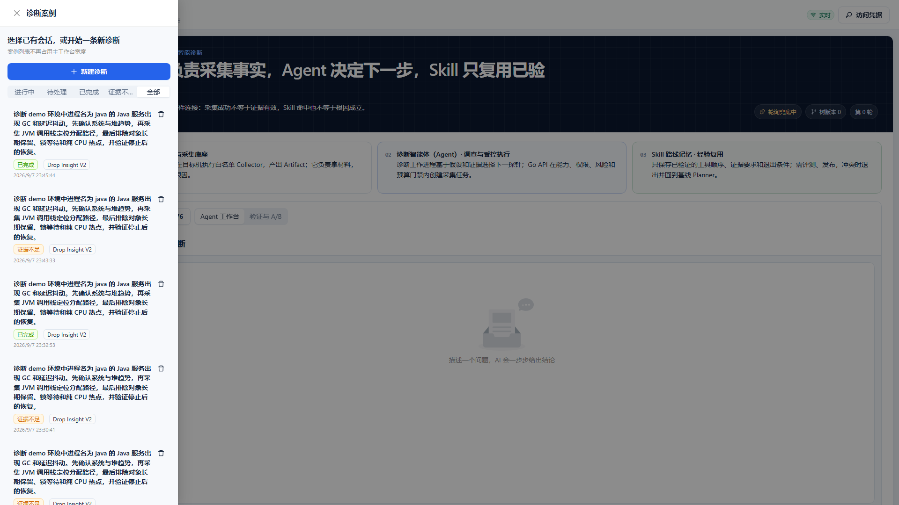](assets/learning-guide/02-diagnosis-case-drawer.png)

图中左侧抽屉的使用顺序：先点击“新建诊断”开始空白会话；需要查看旧链路时用“进行中/待处理/已完成/证据不足/全部”筛选；点击整张案例卡加载会话；右侧垃圾桶图标只做归档入口，不会把 Evidence、审计记录或对象存储一起抹掉。

- 状态筛选：按进行中、等待、完成、证据不足等状态过滤；
- 删除图标：归档/隐藏入口，不应删除 Evidence、审计或对象存储；
- 选择案例：加载该 Diagnosis 的范围、轮次、树、Evidence 和报告；
- 列表只负责找入口，权威数据仍从服务端读取。

### 4.3 Agent 工作台与验证中心

| 切换项 | 作用 |
|---|---|
| **Agent 工作台** | 当前 Diagnosis 的多轮调查、对话、树和报告 |
| **验证与 A/B** | 评测总览、故障广场、Skill A/B、Skill 示例与沉淀 |

切换不会删除当前诊断。A/B 页面还会从浏览器保存的两条 Diagnosis ID 恢复最近对照。

[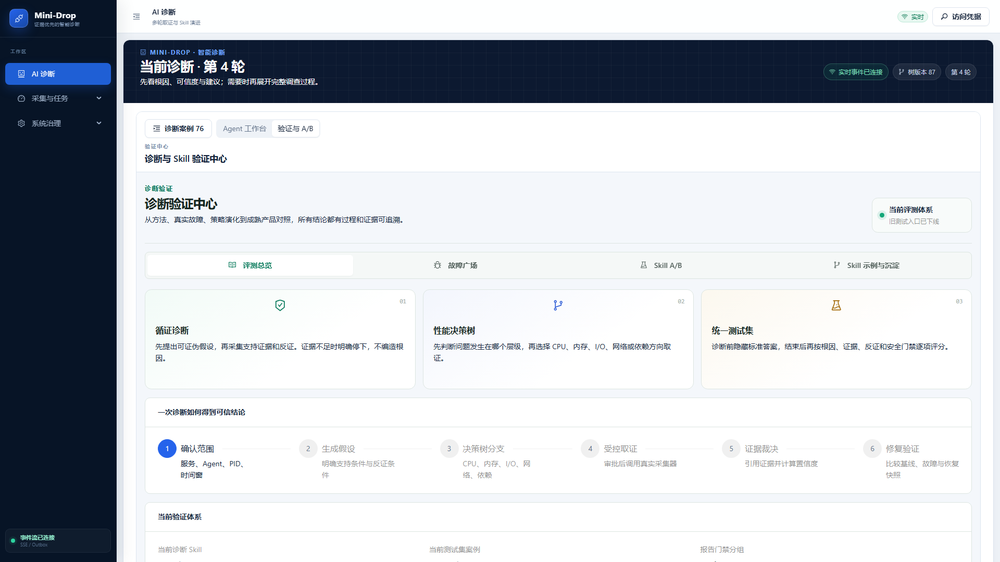](assets/learning-guide/05-evaluation-overview.png)

图中的四个横向入口分别回答四个问题：评测总览说明“怎样算可信”；故障广场回答“怎样现场制造故障”；Skill A/B 回答“复用路线到底有没有量化提升”；Skill 示例与沉淀回答“经验怎样经过门禁后进入策略库”。

### 4.4 自主与人工审批

| 模式 | 行为 |
|---|---|
| **自主** | 低风险只读工具可在白名单、预算、目标 binding 和门禁内自动推进 |
| **人工审批** | 每次需要审批的 Tool Call 先暂停；人可调整允许参数或拒绝 |

人工审批不是“给 AI root 权限”。Agent、PID、启动时间、命名空间和服务端签发的 binding 不可在审批弹窗中改写。

### 4.5 对话、探索树和分屏

| 显示方式 | 适用场景 |
|---|---|
| **对话** | 默认全宽，阅读多轮问题、假设、工具、证据和结论 |
| **探索树** | 全宽查看真实分支、剪枝、回溯、最佳路径和评分 |
| **分屏** | 人工干预时对照对话与树；屏幕较小时不推荐 |
| **全屏查看探索树** | 节点很多或面试讲解评分时使用 |

### 4.6 新建诊断与确认范围

点击 **新建诊断** 后，先用一句自然语言描述现象。系统会理解意图并自动发现目标，不要求用户一开始就知道 PID。进入“确认范围”后，页面中的字段含义如下：

[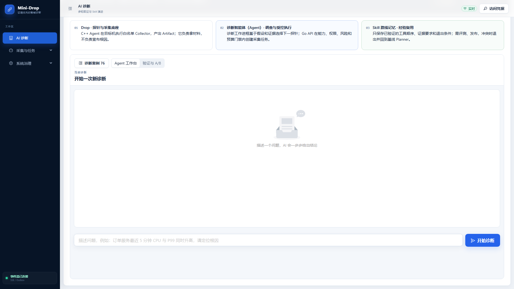](assets/learning-guide/02b-new-diagnosis-composer.png)

图中最下方长输入框是问题描述，右侧蓝色“开始诊断”才会向服务端创建 Diagnosis。建议按“现象 + 对象 + 时间 + 希望排除的方向”输入，例如：`订单服务最近 5 分钟 CPU 与 P99 同时升高，请定位根因并排除 I/O 等待。` Enter 发送，Shift+Enter 换行。不要在这里直接写“根因一定是数据库”，否则会给规划器不必要的锚定。

| 控件 | 作用 | 为什么需要 |
|---|---|---|
| 问题描述 | 写现象、对象、时间和希望排除的方向 | 这是 Agent 的任务目标，不是预设根因 |
| 重新发现目标 | 重新请求服务端进程发现 | 进程可能重启，旧 PID 不能长期复用 |
| 服务 | 业务服务名，例如 `order-service`；故障广场会自动带入 | 用于业务归属和候选过滤，不直接作为系统权限 |
| 环境 | `development`、`staging`、`production` 或 `demo` | 防止把演示目标误当生产目标 |
| 诊断目标 | 从服务端签发的候选中选一个安全 binding | binding 内含 Agent、PID、启动时间等只读身份，浏览器不能自己编造 |
| 开始时间 / 结束时间 | 故障证据窗口 | 一旦确认便不可随意平移，避免先看证据再改窗口 |
| 确认范围并开始取证 | 锁定范围，进入假设生成和工具规划 | 之后改变方向应通过多轮干预，而不是偷偷换目标 |

若服务端发现唯一且安全的目标，Agent 可以自主确认；若出现多个候选、目标过期或权限不足，页面会要求人工选择。故障广场创建的会话会带入服务端白名单目标，但最终 binding 仍由本次进程发现产生。

### 4.7 多轮输入框

| 意图按钮 | 输入示例 | Agent 的处理 |
|---|---|---|
| 补充 / 追问 | `故障只在发布后出现。` | 补充会话上下文，并继续调查 |
| 继续取证 | `继续采集独立证据。` | 在预算内选择下一项允许工具 |
| 调整方向 | `先看内存与 swap。` | 降低旧路线优先级，扩展新域 |
| 寻找反证 | `验证 CPU 热点能否被 I/O 证据推翻。` | 建立证伪条件和交叉验证路线 |

输入框中的话不会直接变成 Evidence。服务端先保存 intervention，再规划新假设和工具；旧轮次保持只读。

### 4.8 其他按钮

| 按钮 | 含义 |
|---|---|
| **复杂案例回放** | 只读查看当前案例的树、Evidence 和报告，不切换案例 |
| **审计细节** | 展开 Tool Call、Evidence、Report 和事件的技术详情 |
| **继续推进** | 请求未终止诊断继续一步；不要连续重复点击 |
| **优先调查** | 从某个假设节点开启下一轮，并提高这条方向优先级 |
| **寻找反证** | 从节点开启证伪调查，不把人工质疑当成科学反证 |

### 4.9 探索树里的 Skill 路线怎么看

切到 **探索树** 后，真正的 LATS 父子树仍是主图。若本次会话启用了并命中 Skill，树上方会多出一条虚线的 **Skill 调查路线**：

```text
召回候选 → 激活路线 → 第 2/3/4 轮沿用 → 偏离或退出
                 ↓
          推荐探针 1 → 2 → 3
```

- “完整 `SKILL.md` 已加载”表示服务端已经校验来源、hash 和章节，并把完整路线合同交给 Agent；不表示根因已成立。
- “路由已纠偏”表示规则分类先猜错了域，但 Skill 的强文本信号通过门禁后选中了更匹配的类别。
- “当前步骤”表示本轮优先使用哪一个仍可用的白名单工具。
- 工具节点的“Skill 路线第 N 步 · 已采用”表示真实 Tool Call 与路线对上了。
- “偏离/退出/耗尽”说明证据、人工方向或可用能力已不再支持继续沿旧路线。

点击任一阶段或探针步骤，会弹出命中依据、检索分数、来源文件、正文 SHA-256、已加载章节和逐轮记录。虚线和“非证据先验”是刻意设计：Skill 负责告诉 Agent **优先查什么**，LATS 和 Evidence 负责说明 **这次机器实际上发生了什么**。

### 4.10 验证与 A/B 的四个入口

| 入口/按钮 | 含义 |
|---|---|
| **评测总览** | 展示循证诊断、性能决策树、统一测试集，以及 Skill/Case/门禁的实际报告统计；缺失时显示“-” |
| **查看示例与运行实例** | 打开“诊断 Skill 广场”，查看内置参考路线和数据库运行实例 |
| **故障广场** | 同时包含完整 LATS 冻结回放和 21 个实时白名单故障 |
| **刷新场景** | 只刷新冻结回放 catalog，不启动回放 |
| **新建回放会话** | 创建一条新的冻结回放 Diagnosis |
| **刷新状态** | 重新查询四种运行时实验室状态 |
| **故障持续时间** | 选择 30、60 或 120 秒；服务端上限为 300 秒 |
| **启动故障** | 只注入故障，适合之后手工创建基础采集任务 |
| **启动并诊断** | 注入故障并创建真实多轮 Diagnosis |
| **Skill A/B** | 注入故障后，把同一问题带到 AUTO/DISABLED 对比 |
| **停止** | 主动停止当前卡片的故障 |
| **Skill A/B 页** | 输入两组共用问题、启动真实对比、刷新两组和恢复历史 |
| **Skill 示例与沉淀** | 打开大弹窗，查看候选、已发布、已隔离 Skill 及评测/发布/回滚操作 |

### 4.11 工具审批、反馈与修复验证

这些控件只会在相应状态出现；看不到某个按钮，通常表示当前诊断还没有走到该阶段。

| 区域/控件 | 作用 | 使用注意 |
|---|---|---|
| 工具卡片 → 修改参数 | 在执行前调整本次采集时长或采样率 | 安全目标、Agent、PID 和进程启动时间不可修改 |
| 时长（秒） | 调整一次只读探针持续时间 | 页面和服务端都有限制，不能借此创建无限任务 |
| 采样率（Hz） | 调整支持该参数的采集器频率 | 采样越密，开销通常越高 |
| 通过 | 批准当前 Tool Call，服务端随后创建真实 Task | 只有 `PENDING_APPROVAL` 状态出现 |
| 拒绝 | 拒绝当前 Tool Call，并把结果记入审计和下一轮规划 | 拒绝不是删除节点，Agent 可以换路线 |
| 正确 / 部分正确 / 错误 | 给最终结论提供人工标签 | “部分正确”和“错误”会要求补充可执行的纠正信息 |
| 纠正后的根因 | 告诉 Agent 哪个根因被遗漏或判断错误 | 它是人工反馈，不会直接伪造成机器 Evidence |
| 补充说明 | 写入发布、变更、负载等背景 | 后续轮次会读取，会话外是否沉淀仍受记忆策略控制 |
| 提交反馈并开始下一轮取证 | 保存反馈并从当前状态继续规划、调用工具和更新树 | 适合结论证据不足或方向判断错误时使用 |
| 修复前任务 | 填入根因确认阶段的 Task ID | 必须已经完成分析并有可比较产物 |
| 修复后任务 | 用相同目标、采集器和负载复采后的 Task ID | 不要拿不同服务或不同负载直接比较 |
| 修复说明 | 记录本次代码或配置修改，例如“缓存序列化结果” | 用于报告解释，不参与伪造指标 |
| 对比验证 | 比较修复前后 TopN 和关键指标并形成验证结论 | 证明“改完是否真的变好”，不是重新猜一次根因 |

### 4.12 Skill 管理与 A/B 页全部操作

| 控件 | 作用 |
|---|---|
| 打开完整评测中心 | 从驾驶舱跳到验证中心，查看数据集、回归和 Skill 指标 |
| 两组共用问题 | 为启用 Skill 与关闭 Skill 两臂提供完全相同的问题文本 |
| 启动真实对比 | 分别创建 `AUTO` 和 `DISABLED` 两条真实诊断；两组独立发现目标，不能共享 Evidence |
| 刷新两组 | 从服务端重读两条诊断的轮次、工具、Evidence、门禁和报告，不重建会话 |
| 打开该诊断 | 回到该臂的 Agent 工作台，检查具体树和证据 |
| 查看机器报告 | 打开 540 条根因集和 500 组同题 A/B 的机器可读报告 |
| A/B 历史中的恢复 | 用浏览器保存的 Diagnosis ID 恢复一组对照；真正指标仍从服务端读取 |
| 刷新 / 重新读取 | 重新读取 Skill 运行实例；后者常在加载失败提示中出现 |
| 全部 / 候选 / 已发布 / 已隔离 | 按 Skill 生命周期筛选，不会修改状态 |
| 生成候选 Skill | 从结论已验证且引用可信 Evidence 的轨迹提取路线合同 |
| 运行三类门禁 / 运行三类门禁评测 | 执行相似正例、误导反例、环境迁移测试 |
| 发布技能 | 门禁通过后人工投入复用；不是 Agent 自动改生产策略 |
| 隔离 | 人工发现负迁移时停止继续召回该版本 |
| 回滚上一版 | 当前版本有父版本时恢复上一份已验证路线 |
| 打开 Skill 广场 | 查看示例路线、数据库实例、来源诊断和真实复用次数 |
| 查看 Skill 详情 | 从探索树打开命中依据、BM25/规则分数、正文 hash、加载章节和逐轮轨迹 |
| 关闭回放 / 关闭 | 关闭只读案例或详情弹窗，不停止真实诊断 |

## 5. Agent 运行驾驶舱怎么看

驾驶舱把当前会话压缩成可点击指标：

[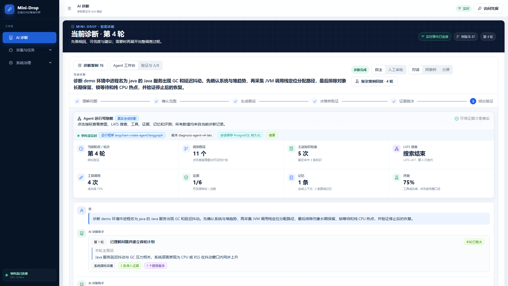](assets/learning-guide/03-selected-diagnosis.png)

这张图适合面试时讲“它不是一次问答”：顶部显示第 4 轮和树版本 87；阶段条已经经过理解问题、确认范围、生成假设、决策树取证、证据裁决和结论验证；驾驶舱同时显示假设、知识检索、工具、Evidence、记忆和评测。右上角可以在自主/人工审批以及对话/探索树/分屏之间切换。

| 指标 | 表示什么 | 点击后看什么 |
|---|---|---|
| 当前阶段 / 轮次 | 理解问题、规划、取证、裁决或验证 | 该阶段来自哪些服务端事件 |
| 规划假设 | 当前去重后的候选数 | 主假设、备选、证伪条件和工具计划 |
| Agentic RAG | 本轮知识检索次数 | query、知识源、文件 hash、匹配词、证据要求和限制 |
| 工具调用 | 已创建的 Tool Call 数 | 工具、参数、策略结果、Task/Attempt 状态 |
| 证据 | 门禁接受数/总数 | 支持、反证、中性、受限与拒绝原因 |
| 记忆 | 会话上下文和路线记忆 | 短期对话、领域事实、Skill 路线，不与 Evidence 混用 |
| 评测 | 当前会话可用的评估 | 报告状态、限制、反馈或未运行说明 |
| LATS 搜索 | 选择、路径和预算 | 当前节点、最佳/最近路径、UCT/PUCT、停止原因 |

RAG 命中的文档是知识先验，不是这次机器的 Evidence。一个“CPU 热点诊断指南”即使完全匹配，也不能证明当前 PID 确实有 CPU 热点。

点击驾驶舱中的任一指标会打开详情，而不是跳到另一个黑盒页面。例如点击“规划假设”：

[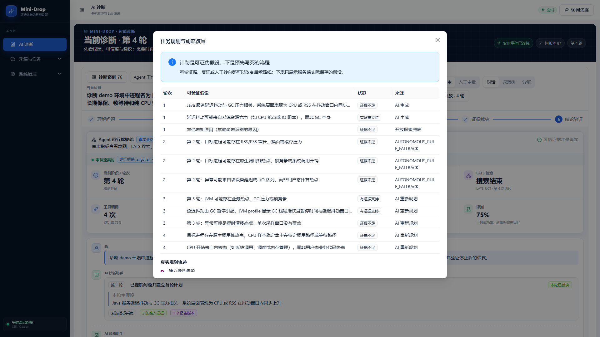](assets/learning-guide/03b-cockpit-metric-dialog.png)

弹窗逐轮列出假设、状态和来源。“AI 生成”是模型首轮候选，“AI 重新规划”是后续轮次根据 Evidence 改写，“开放探索兜底”保证既有假设都不成立时仍可探索其他原因。状态为“有证据支持”也不等于最终根因，还要经过反证、报告和修复验证。

### 5.1 结论卡到底在说什么

结论卡不是火焰图，也不是下载文档。它是结构化 Report 的页面投影，正文必须回答“当前证据具体定位到了什么”，同时保留置信度、证据门禁、下一步、限制和 Evidence ID。火焰图、TopN、系统指标等是 Report 引用的 Artifact/Evidence，可以从完整调查过程或任务结果页打开。

| 卡片标题 | 严格含义 |
|---|---|
| 根因结论 | 支持、反证/对照和覆盖门禁已经满足，可以作为当前时间窗内的最终判断 |
| 阶段性根因 | 已定位到具体函数、资源或依赖，但缺独立反证/对照；可以指导下一步，不能说因果完全闭环 |
| 本轮判断 | 当前分支未建立根因，可能有反证或证据不足 |

以 Java allocation 为例，合格正文会写出 `Hotspot.lambda$startWorkers$1`、100% 有效样本和主要分配对象 `byte[]`；同时明确“没有独立证明 GC 暂停或锁竞争是主瓶颈”。“JVM 可能存在业务热点、GC 压力或锁竞争”只是待检验假设，不能当作根因结论。

历史 Report 是审计记录，不能回写篡改。页面遇到旧版 `SUPPORTED：支持假设……` 时，会从该 Report 已保存且校验通过的 `HYPOTHESIS_PREDICATE` 与 TopN claims 恢复具体中文阶段性根因；这只是确定性展示兼容，不创造新 Evidence。

## 6. 探索树：从图形读懂 LATS

### 6.1 为什么是树，不是一条链

传统单链 Agent 可能先猜 CPU，工具失败后仍沿 CPU 路线反复尝试。LATS 同时保存多个候选：CPU、内存、I/O、网络、运行时、依赖和开放世界未知原因。一个分支被反证后，系统把结果回传到树上，再选择更值得探索的分支。

页面把论文六阶段中的 Simulation 拆成“行动”和“观察”，因此你可能看到七个可读步骤：

```text
选择 → 扩展 → 评估 → 行动 → 观察 → 反思 → 价值回传
```

### 6.2 UCT 与 PUCT

默认 UCT 的直觉：

```text
分数 = 已知平均回报 + 对访问较少分支的探索奖励
```

已访问节点的近似公式：

```text
Q(s) = value_sum(s) / visits(s)
UCT(s) = Q(s) + c * sqrt(ln(parent_visits) / visits(s))
```

PUCT 是可选扩展，会加入候选先验 `prior`。无论 UCT 还是 PUCT，选择分数只决定“下一步先查谁”，不是根因置信度。

### 6.3 评分弹窗

| 字段 | 含义 |
|---|---|
| 访问次数 | 该节点实际参与回传的次数 |
| 累计奖励 | 历次有界 reward 的总和 |
| 平均回报 Q | 累计奖励除以访问次数 |
| 先验 | 候选初始倾向，只有 PUCT 直接参与先验奖励 |
| UCT/PUCT | 当前选择时的排序分 |
| 本轮奖励 | 本轮 Observation 经评估后的反馈 |

“查看评分”与画布拖动是两种交互：短按按钮打开弹窗，按住空白处拖动画布。没有服务端值就显示“未记录”，不应补零。

### 6.4 树状结构与轮次路径

- **树状结构**：回答“节点怎样分叉、剪枝、回溯，最佳路径在哪里”；
- **轮次路径**：回答“第几轮为什么转向，用了什么工具，得到什么证据”；
- 两者是同一份服务端事件的不同投影，不是两棵树。

一个容易混淆的细节是：节点的出生深度不等于执行轮次。初次 Expansion 可能一次生成三个同层 sibling，它们的 `tree_depth` 都是 1；LATS 随后在第 1、2、3 次迭代依次选择它们时，页面应分别显示第 1、2、3 轮。服务端用 `lats.node_selected.iteration` 统计真正产生 Report 的轮次，用 `Hypothesis.round_index` 保留原始父子层级。这样既不会把回溯画成一条假链，也不会把三次真实采集误算成一轮。

### 6.5 为什么事件会重复

不同搜索迭代都需要选择、观察、反思和回传，所以相同类型事件在不同轮出现是算法必需。系统只去除同一轮、同一对象、相同语义的真正重复；数值更新和跨轮事件必须保留。

### 6.6 探索树画布上的按钮

| 控件 | 作用 |
|---|---|
| 树状结构 / 轮次路径 | 在真实父子树与按执行轮次阅读的路径板之间切换 |
| 查看评分 | 打开当前节点的访问次数、价值、先验、UCT/PUCT 和奖励历史 |
| 查看 Skill 详情 | 打开 Skill 召回、激活、沿用、偏离或退出的逐轮解释 |
| 优先调查 | 以当前假设为下一轮人工优先方向，服务端会新增事件和节点 |
| 寻找反证 | 要求 Agent 主动寻找能推翻当前假设的独立证据 |
| 缩小 / 放大 | 只改变画布视图，不改变服务端树 |
| 复位 | 恢复默认缩放和位移，不回滚诊断 |
| 全屏 | 用大弹窗显示同一棵树，适合节点多时讲解 |
| 关闭 | 关闭评分、Skill 详情或全屏弹窗 |

树的更新来自服务端事件流：新假设、Tool Call、Evidence、剪枝、方向切换和价值回传都会形成新版本。人工介入不是在浏览器里拖节点改 JSON，而是点击“优先调查”“寻找反证”或提交多轮输入；服务端据此追加新轮次，旧节点和旧证据保持可审计。

[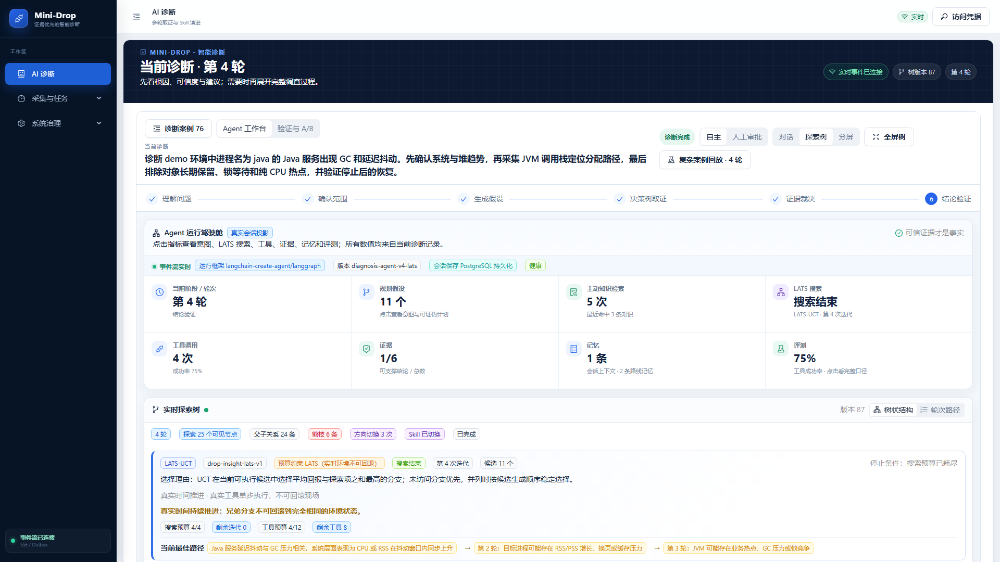](assets/learning-guide/04-dynamic-exploration-tree.png)

看这张图时按五步讲：

1. 左上角“4 轮、探索 25 个可见节点、剪枝 6 条、方向切换 3 次”是服务端真实统计；
2. `LATS-UCT` 表示选择策略，“预算约束 LATS”说明真实机器不能回滚；
3. “搜索预算 4/4、工具预算 4/12”说明停止不是页面卡死，而是搜索预算已经耗尽；
4. “当前最佳路径”只是搜索排序结果，仍需回到 Evidence 和 Report 验证；
5. 右上角“树状结构/轮次路径”和“全屏树”负责换读法，不修改诊断数据。

冻结回放则可以展示一棵更适合讲解剪枝、跨域转向和恢复验证的树：

[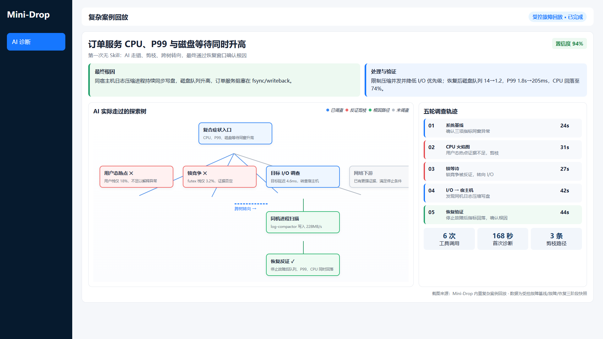](../web/public/report-assets/complex-showcase.png)

这张内置图的观察是固定快照，适合解释算法，但不能冒充当前服务器实时 Evidence。面试时应先用它讲完整 LATS，再用上一张实时树证明真实 Task 和 Evidence 链路。

## 7. 实时 LATS 与完整 LATS 的边界

### 7.1 实时诊断：BUDGETED_LATS

真实 CPU、队列和网络状态随墙钟时间变化。Tool Call 一旦执行就改变观察窗口，无法把整台生产机器倒回几秒前。因此实时诊断是预算约束的渐进搜索：只对被选分支调用一次真实工具，记录观察后继续或转向。

### 7.2 冻结回放：FULL_LATS

验证中心的冻结回放使用固定 fixture：

- 快照有稳定摘要；
- 每个兄弟 rollout 前恢复相同快照；
- Simulation 返回可重复 Observation；
- 树节点、选择、反思和回传都持久化；
- 真实 Tool Call、Task、Artifact、Evidence 和 Report 为 0。

它证明算法完整性，不证明机器故障。

### 7.3 受控复现

只有编排器能证明故障、负载、目标和初始状态在每次 rollout 前都一致，才能接近完整复现。仅把会话 mode 命名为 `REPLAY` 或 `REPRODUCTION` 不够，缺少 reset proof 时必须降级为 BUDGETED_LATS。

## 8. 证据不支持假设时，Agent 怎样自由探索

一次分支可能得到四类有效准入：

| 门禁结果 | 含义 | 后续 |
|---|---|---|
| 支持 | Evidence 支持假设 | 仍需检查反证与最少轮次 |
| 反证 | Evidence 明确推翻假设 | 降低奖励、剪枝或转向 |
| 中性 | Evidence 有效，但暂不支持也不反驳 | 选择更有信息量的工具/分支 |
| 受限 | Evidence 有效但存在质量或覆盖限制 | 保留限制并补充交叉证据 |

以下不是科学反证：Agent 离线、权限不足、采集器不兼容、Tool Call 失败、审批拒绝。这些只能标记为不可观测。

服务端记录已尝试工具、已覆盖证据域、观察和反思。只要预算还在，当前分支不成立就从未覆盖的 CPU、内存、I/O、网络、运行时或依赖域扩展；如果已经有可信支持报告但尚未满足最少轮次，也会继续交叉验证。只有达到预算、没有合格工具或覆盖耗尽后，才以“证据不足”或带限制的最好报告结束。

## 9. 故障广场：为什么能体现 Agent 能力

当前代码提供 21 个白名单场景：Python 7、Go 4、Java 5、C++ 5。

[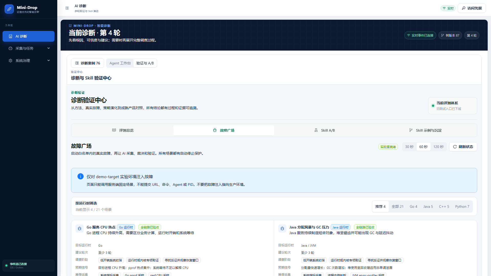](assets/learning-guide/06-fault-plaza.png)

图中右上角 30/60/120 秒是故障持续时间，刷新状态只查询实验室状态；“推荐/全部/Go/Java/C++/Python”只筛选卡片。向下滚动每张卡会看到“启动故障”“启动并诊断”“Skill A/B”“停止”。现场优先点“启动并诊断”，系统会创建新故障实例和新 Diagnosis；只点“启动故障”时，需要再去任务面板手工采集。演示完成要确认卡片恢复为“实验室就绪”。

| 运行时 | CPU | 内存 | I/O | 锁 | 网络/依赖 | 其他 |
|---|---:|---:|---:|---:|---:|---|
| Python/基础 | 2 | 1 | 1 | 0 | 0 | 噪声邻居、负载饱和、队列堆积 |
| Go | 1 | 1 | 1 | 0 | 1 | — |
| Java | 0 | 1（堆外） | 1 | 1 | 1 | GC 压力 |
| C++ | 1 | 1 | 1 | 1 | 1 | — |

完整名称、取证建议和面试脚本见 [`INTERVIEW_DEMO_GUIDE.md`](INTERVIEW_DEMO_GUIDE.md)。

难度来自“相似症状需要不同证据”，而不是把第一轮答案藏起来。例如延迟升高可能来自 CPU 饱和、锁等待、同步 I/O 或下游变慢；RSS 上升可能来自堆对象、堆外内存、匿名映射或页缓存。服务端要求故障广场诊断至少经过 3 个有报告轮次，防止 Agent 看到场景名就一轮结束。

## 10. Skill：复用路线，不复用答案

### 10.1 Skill 是什么

Skill 保存经过验证的调查路线，例如：

```text
触发词/适用类别
  → 候选假设先验
  → 推荐探针顺序
  → 必须满足的证据条件
  → 冲突退出与安全限制
```

仓库 `skills/catalog.json` 当前登记 13 个内置 Skill，覆盖 CPU、C++ 运行时、依赖、FD、JVM GC、Go 运行时、I/O、锁、内存、网络、Python、队列和同机竞争。

### 10.2 AUTO 与 DISABLED

- `AUTO`：检索已发布 Skill，命中后调整 Prior 和探针顺序；
- `DISABLED`：完全绕过 Skill 检索，使用基线 Planner；
- 两组都要为当前 Diagnosis 重新创建 Tool Call、Task、Artifact 和 Evidence；
- DISABLED 组不能事后补写一个 Skill activation。

### 10.3 Skill 到底怎么检索

不是 Elasticsearch，也不是关键词 `contains`，当前也没有向量数据库。因为只有 13 个 Skill，服务端直接在 Python 进程内完成：

```text
结构门禁（环境/运行时/能力）
  → BM25（中英文 token + 中文二元词）
  → 512 维哈希 n-gram/领域概念特征相似度
  → 类别 Prior 与歧义拒绝
  → 命中后读取完整 SKILL.md
```

本地“特征向量”不是神经 embedding：它由可重复的 token、ASCII 3/4-gram 和有限领域同义概念哈希得到，不需要训练和外部服务。类别只加权，不再硬过滤；例如初始误判为 I/O，但问题明确写了 Python GIL，Python Skill 仍可在强信号和运行时门禁下纠偏。最高分不够或两个候选太接近时会弃权，让基线 Planner 继续。

这就是渐进式披露：先读所有 Skill 的目录卡片，确定命中后才读那一份完整正文。完整正文以后每个重规划轮都会保留，直到 Skill 被切换、偏离或耗尽。

### 10.4 A/B 页面上的指标

[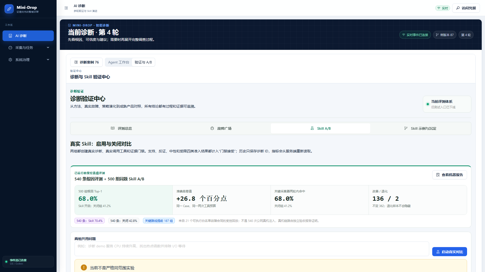](assets/learning-guide/07-skill-ab.png)

图中上半部分是已经生成的 540/500 机器报告：68.4% 是启用 Skill 的 500 组代理 Top-1，41.2% 是同题关闭 Skill 基线，差值为 27.2 个百分点；改善 136、退化 0。“查看机器报告”打开原始 JSON。下方“两组共用问题”输入框和“启动真实对比”用于页面现场 A/B；它与上面的离线大样本评测是两种证据，不要混讲。

| 指标 | 说明 |
|---|---|
| Skill 激活 | 当前会话真实 activation 条数 |
| 工具调用 | Tool Call 条数，不等同成功数 |
| 证据总数 | 当前会话全部 Evidence |
| 门禁接受 | 支持、反证、中性、受限四类合计 |
| 诊断轮次 | 服务端树统计的轮次 |
| 首条证据 | 创建诊断到第一条 Evidence 的时间 |
| 真实路线 | 按实际 Tool Call 去重后的顺序 |
| 报告 | 当前最新 Report 的置信度和状态 |

### 10.5 历史恢复

页面把最近 12 组 AUTO/DISABLED Diagnosis ID 保存在浏览器 `localStorage`，键为 `mini-drop:skill-ab-history:v1`。返回验证中心或刷新后，用 ID 从服务端重新读取所有指标。

它不是账号级实验档案：换浏览器、无痕窗口或清站点数据会丢入口索引，但不会删除服务端 Diagnosis。

### 10.6 为什么当前 A/B 不是统计实验

公共 API 允许两组独立自动发现目标和时间窗。Scope 不一致时页面明确提示“当前不是严格同范围实验”。即使 Scope 相同，单次顺序运行也不能证明普遍提速或准确率提升。严格 A/B 还需要故障重置、相同负载、随机化、足够样本、统计检验和异常样本剔除。

## 11. Skill 怎样沉淀与“自进化”

[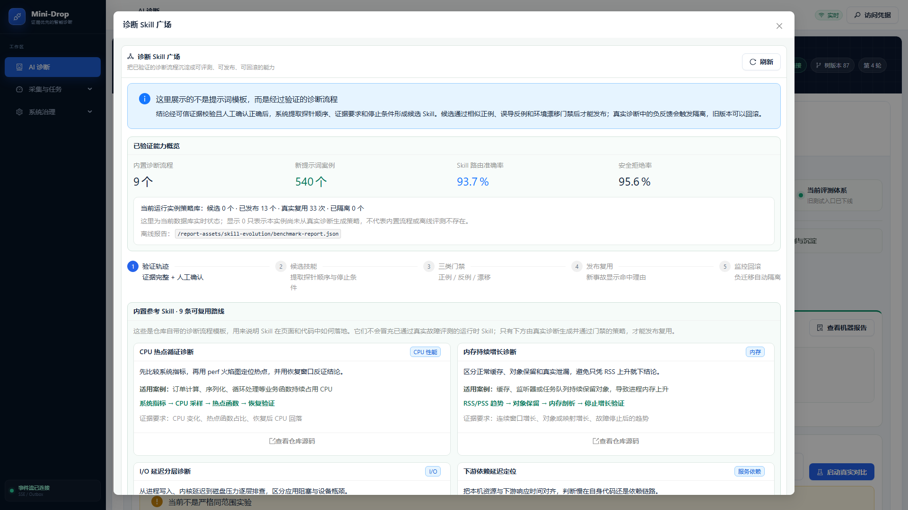](assets/learning-guide/08-skill-plaza.png)

图中顶部四个数字来自评测报告和数据库实例：内置路线数量、新提示词 Case、路线准确率、安全拒绝率。中间五步是 Skill 生命周期。下方“内置参考 Skill”只用于展示合同结构；继续向下滚动才是数据库中的候选、已发布、已隔离实例，以及“运行三类门禁、发布技能、隔离、回滚上一版”等真实操作。发布和回滚都是人工动作。

当前自进化是受控工程流程，不是模型在线改代码：

```text
成功报告与用户反馈
  → 生成候选 Skill
  → 静态校验和冲突检测
  → 新测试集离线评测
  → 人工审批发布
  → 小范围激活
  → 负反馈累计
  → 隔离或回滚
```

页面 **验证与 A/B → Skill 示例与沉淀**展示内置参考路线与运行实例。示例卡用于教学；数据库 activation、版本、评测和报告才是运行事实。

当前没有自动修改 Prompt/代码/权限并直接发布生产的闭环，也没有在线随机实验平台。这样的限制是安全设计，不是漏做一个按钮。

## 12. Agentic RAG、上下文和记忆

### 12.1 Agentic RAG

当前 Knowledge RAG 对仓库 `knowledge/` 做确定性混合词法检索。每轮保存：

- 查询；
- 命中文档；
- 源文件 hash；
- 匹配词；
- 证据要求；
- 路线限制。

它帮助 Planner 知道“该查什么”，不会自行访问互联网，也不是向量数据库。检索结果固定标记 `is_evidence=false`。

### 12.2 三类记忆

| 类型 | 保存内容 | 权威存储 | 能否作证据 |
|---|---|---|---|
| 会话短期记忆 | 模型消息、最近几轮上下文 | LangGraph Checkpoint | 不能 |
| 领域事实记忆 | Scope、Hypothesis、Tool Call、Evidence、Report、事件 | PostgreSQL | Evidence 本身可以，其余按角色使用 |
| 路线记忆 | Skill、成功探针顺序、可靠性反馈 | Skill 数据与数据库 | 不能直接证明本次根因 |

### 12.3 为什么重启后不应丢上下文

领域事实、树和报告以 PostgreSQL 为权威；刷新页面会重新读取。LangGraph Checkpoint 请求 PostgreSQL 时，页面会同时显示 requested backend 与 actual backend。如果初始化失败并降级为内存，状态必须显示 `DEGRADED`；此时短期模型消息可能在 Worker 重启后丢失，但已经持久化的领域事件和 Evidence 仍在。

## 13. Harness、Theme 与框架选择

### 13.1 为什么选择 LangChain + LangGraph

项目使用 LangChain `create_agent` 负责模型/工具循环，LangGraph 负责 thread、checkpoint 和可恢复执行；Mini-Drop 自己负责领域状态、权限、工具白名单、预算、Evidence Gate 和 LATS 搜索。

当前云端 `MINI_DROP_AI_MODEL` 为 `deepseek-chat`，通过 OpenAI 兼容接口接入；模型名、Base URL 和密钥都来自部署环境，不写死在前端或领域代码里。换模型不会改变 Task、Evidence、权限和状态机合同。模型超时、返回非法结构或不可用时，服务端会记录原因并使用中文确定性规则兜底，因此“模型在线”与“诊断系统可审计”是两层能力。

这样分工的原因：

- 不把业务真相塞进通用 Agent 内存；
- 可以替换模型或 Agent 框架，不破坏证据链；
- 工具权限和状态机由服务端控制，不靠 Prompt 约束；
- LangGraph 适合多轮和 checkpoint，LATS 则作为领域搜索层叠加。

Pi Agent、其他轻量 Agent SDK 也能做模型循环，但本项目需要成熟的 checkpoint、工具中间件和图式恢复，因此选择 LangGraph 更合适。框架不是卖点，真实的安全边界和 Evidence 合同才是。

### 13.2 Harness 是什么

Harness 是 Agent 的运行护栏：

- 注入只读上下文；
- 裁剪消息和 token；
- 校验结构化模型输出；
- 拒绝模型创造目标或工具；
- 在超时、非法 JSON、模型不可用时使用确定性兜底；
- 将 Tool Call 转交领域服务，而不是本地执行 shell；
- 记录 checkpoint、trace、模型版本与结果来源。

### 13.3 Theme 是什么

Theme 是不同诊断域的策略配置，不是前端颜色主题。CPU、内存、I/O、网络、JVM、Go、Python、C++ 可以有不同候选假设、证据门禁和探针偏好，但都必须复用同一套安全执行与证据合同。

## 14. 基础采集页面：每个输入框和按钮

进入 **采集与任务 → 任务面板**。

[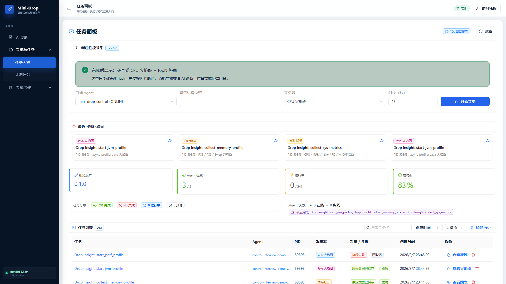](assets/learning-guide/09-task-dashboard.png)

图中最上方是新建性能采集表单；中间“最近可视化结果”用于快速回看；四张数字卡是服务状态；底部才是可搜索、排序、停止和归档的 Task 列表。它只创建采集任务，不负责直接宣判根因。

### 14.1 新建性能采集

| 控件 | 含义 |
|---|---|
| 目标 Agent | 运行采集器的节点；离线节点不可选 |
| 可信进程快照 | Agent 最近上报的进程；选择时关联新鲜 PID/启动时间信息 |
| 采集器 | 只列当前 Agent 能力允许的 TaskKind |
| 时长（秒） | 本次采样持续时间，受采集器上限约束 |
| 开始采集 | 创建 Task，并跳到新任务结果页 |

选择持续 perf 后：

| 控件 | 含义 |
|---|---|
| 窗口（秒） | 按窗口轮转原始 Profile，单窗最多 900 秒 |
| CPU 触发阈值 | 0 为立即开始；大于 0 时等待目标达到阈值 |
| 连续命中次数 | 连续达到阈值才触发，过滤瞬时尖峰 |
| 等待上限 | 等待触发的最长时间；0 表示任务期内持续等待 |
| 保留层级 | 短期、标准或延长的对象存储策略 |

### 14.2 任务面板其他区域

| 区域/按钮 | 作用 |
|---|---|
| 刷新 | 立即重新拉取任务和 Agent，不等下一次自动刷新 |
| 最近可视化结果 | 快速打开最近火焰图、I/O 图或系统指标 |
| 服务版本 | 当前 Go API 版本 |
| Agent 在线 | 在线数/总数 |
| 进行中 | 排队、运行、上传、分析中的任务数 |
| 成功率 | 已结束任务中的成功比例，不能代替诊断准确率 |
| 搜索任务名 | 本地筛选当前任务列表 |
| 排序字段/升降序 | 按时间、名称、状态、Agent、采集器或 PID 排序 |
| 查看进度/原因/火焰图/图表 | 按任务状态进入详情 |
| 停止图标 | 取消排队或运行中的 Task |
| 删除图标 | 归档已结束任务；Evidence 和审计仍保留 |
| Agent 列表 | 查看节点、主机、CPU、RSS、I/O 与在线状态 |

## 15. 任务结果页面

### 15.1 双状态

采集状态和分析状态必须分开读：

```text
采集：PENDING → RUNNING → UPLOADING → COLLECTED
分析：PENDING → ANALYZING → SUCCESS / FAILED
```

`COLLECTED`只表示材料上传完成；只有 Analysis 成功，火焰图/TopN 等结构化产物才可信。空 Profile 会产生 `NO_PERF_SAMPLES`、`NO_FOLDED_STACKS` 或 `NO_PROFILE_SAMPLES`，不渲染假火焰图。

[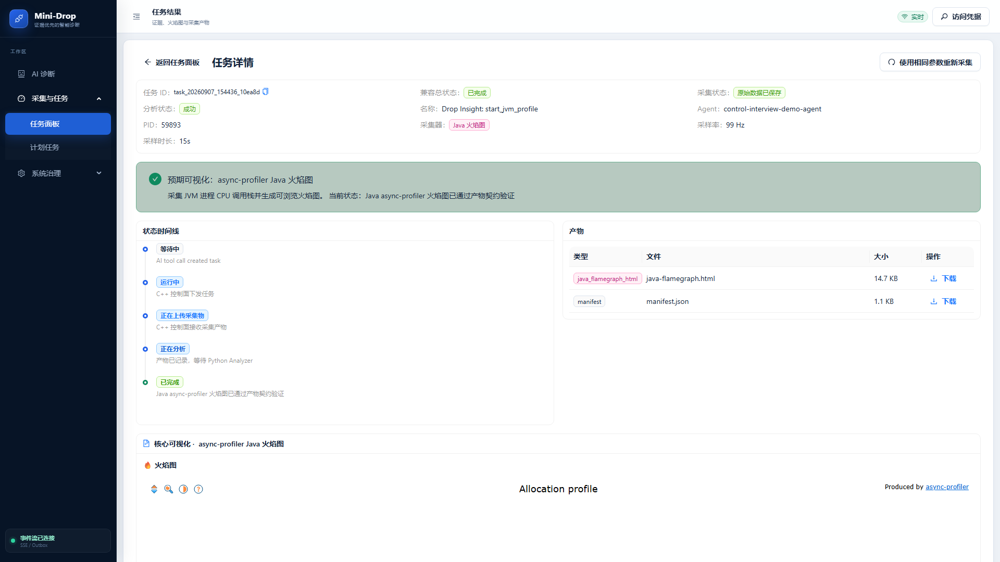](assets/learning-guide/10-task-result.png)

从上到下读：任务身份和采集参数 → 采集/分析双状态 → 状态时间线 → Artifact 下载列表 → 核心可视化。图中是 Java async-profiler 结果；不同采集器会替换成 CPU 火焰图、TopN、内存趋势、eBPF I/O 或系统多维指标。右上“使用相同参数重新采集”一定创建新 Task，不覆盖本次结果。

### 15.2 页面按钮

| 按钮 | 作用 |
|---|---|
| 返回任务面板 | 回到任务列表 |
| 使用相同参数重新采集 | 创建新 Task，不覆盖旧 Attempt/Artifact |
| 选择持续窗口 | 切换某个 Profile 窗口的分析结果 |
| 下载 | 下载对应 Artifact |
| 进入 AI 诊断 | 导航到 AI 工作台；不会把原始 Artifact 自动伪装成 Evidence |
| 重新采集有效样本 | 当 Profile 为空或样本无效时，用相同目标和参数创建新任务；不覆盖失败记录 |
| 打开完整结果 | 从 AI 工具卡的内联预览进入任务结果页 |

### 15.3 可视化怎么读

- 火焰图：横向宽度是样本占比，纵向是调用栈深度；
- TopN：热点函数排序，可与火焰图联动；
- 调用关系图：边表示 Caller → Callee，节点显示 self/inclusive samples；
- eBPF I/O：看延迟分布、调用路径和块设备等待；
- 内存分析：看 RSS/PSS、匿名内存、映射与趋势；
- 系统多维指标：CPU、内存、I/O、网络和进程维度；
- Go pprof/Java 火焰图：运行时专项产物，必须匹配目标运行时。

### 15.4 火焰图内部交互

| 控件/动作 | 作用 |
|---|---|
| 搜索函数名 | 高亮匹配栈帧，适合快速定位业务包、类或方法 |
| 点击栈帧 | 下钻并把该帧作为当前可视范围的根 |
| 悬停栈帧 | 查看函数名、样本数和占比 |
| 重置 | 回到完整火焰图视图，清除下钻缩放 |
| 刷新 | 重新读取当前 Artifact；不会重新采集 |
| 选择持续窗口 | 在持续采集产生的多个窗口之间切换，不能把不同窗口数据拼成一个假火焰图 |

若页面显示 `NO_PROFILE_SAMPLES` 等原因码，应点击“重新采集有效样本”或调整目标/权限，而不是期待“刷新”生成不存在的数据。

系统指标还要注意契约版本：`sys_metrics.v1` 只含逐秒 RSS、线程和文件描述符，任务详情会显示“已恢复历史系统指标”以及完整采样表；CPU、负载、I/O 和网络明确写成“未采集”。`sys_metrics.v2` 才有汇总面板。旧页面出现空白不是“没有故障”，而是前端曾只识别 v2 `summary`；当前兼容层已修复这项数据结构错位。

## 16. Agent 详情页面

从任务面板点击 Agent ID：

| 区域/按钮 | 含义 |
|---|---|
| 返回 | 回到任务面板 |
| 刷新 | 拉取最新心跳、指标和历史任务 |
| Agent 详细信息 | ID、状态、主机名、IP、版本、OS、最后心跳、注册时间 |
| 采集能力 | 当前 Agent 声明的 Collector capability |
| 实时开销 | Agent 自身 CPU、RSS、读写速率和子进程数 |
| 资源趋势 | 近期采样点形成的趋势图，不是长期监控数据库 |
| 搜索任务 | 过滤该 Agent 的历史任务 |

Agent 显示在线只证明心跳可达，不证明每种 Collector 权限都可用。真正能力还要看 capability 和某次 Task 的 Attempt 结果。

## 17. 计划任务页面

[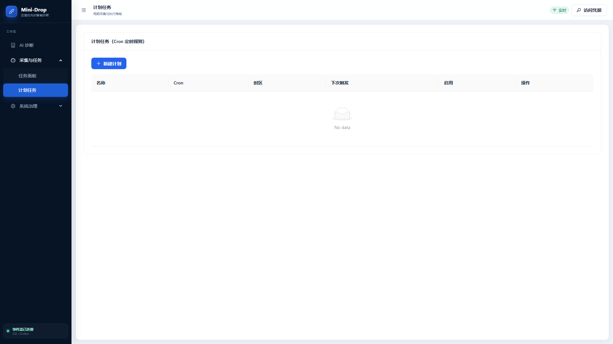](assets/learning-guide/11-schedules.png)

列表为空时不是功能损坏，只表示还没有保存 Cron 计划。点击左上“新建计划”打开表单：

[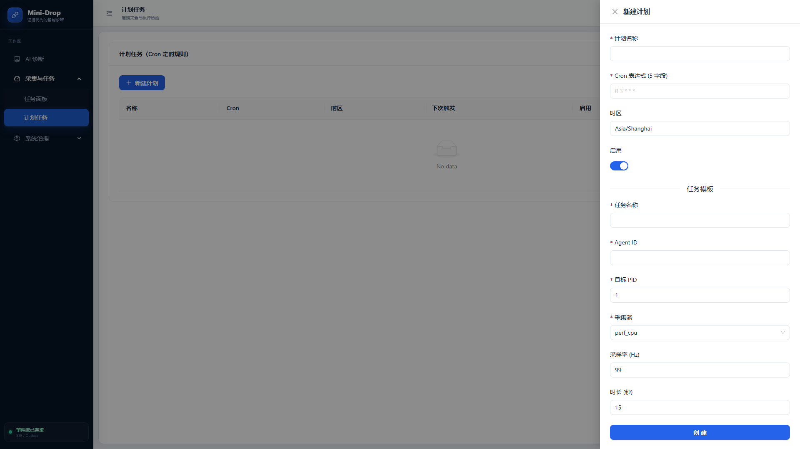](assets/learning-guide/11b-schedule-form.png)

右侧抽屉分成“调度规则”和“任务模板”。调度规则决定什么时候运行，任务模板决定每次创建什么 Task。创建前要重点核对 Agent ID、PID、采集器和时长；长期计划绑定裸 PID 有复用风险，生产设计应改为服务身份加新鲜进程绑定。

| 控件 | 含义 |
|---|---|
| 新建计划 | 打开计划创建抽屉 |
| 计划名称 | 便于识别的名称 |
| Cron 表达式 | 5 字段分钟级规则，例如 `0 3 * * *` |
| 时区 | 解释 Cron 的时区，默认 `Asia/Shanghai` |
| 启用 | 创建后是否自动调度 |
| 任务名称 | 每次触发创建的 Task 名称 |
| Agent ID | 固定采集节点 |
| 目标 PID | 固定目标；生产中更推荐绑定新鲜进程身份而非长期裸 PID |
| 采集器 | 每次触发使用的 TaskKind |
| 采样率 | Hz，越高开销越大 |
| 时长 | 每次采集秒数 |
| 触发 | 立即执行一次，不等 Cron |
| 记录 | 查看历史触发时间、Task ID、状态和错误 |
| 删除 | 删除调度配置，不删除已经产生的任务证据 |

## 18. 审计日志页面

[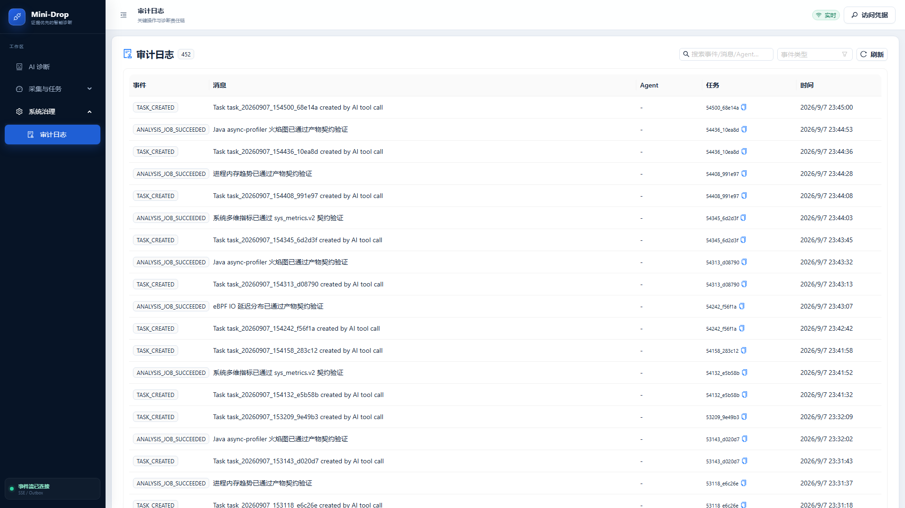](assets/learning-guide/12-audit-log.png)

右上搜索框可以按事件、消息或 Agent 过滤，事件类型下拉框用于只看稳定事件码，刷新按钮重新加载。每行的 Task ID 可以复制并与任务结果、Tool Call 和 Evidence 对照。截图里的英文事件码是跨服务稳定协议，旁边的人类消息优先使用中文。

| 控件 | 含义 |
|---|---|
| 搜索事件/消息/Agent | 按文本过滤审计记录 |
| 事件类型 | 只看某类稳定事件码 |
| 刷新 | 重新加载最新审计 |

审计日志回答“谁在什么时候做了什么”，诊断事件回答“这次调查如何演进”，Evidence 回答“什么事实支持或反驳结论”。三者不能混为一张日志表。

## 19. 端到端数据链

### 19.1 基础采集链

```text
React 创建 Task
  → Go API 鉴权和校验
  → C++ Control 入库、Outbox 通知
  → Agent 领取带租约的 Attempt
  → Collector 采集
  → Artifact 通过短时授权上传 MinIO
  → Agent 回报 manifest/hash
  → Analyzer 消费 AnalysisJob
  → 火焰图/TopN/调用图等结构化产物
  → Web 通过 API/SSE 展示
```

### 19.2 AI 诊断链

```text
用户问题
  → 在线 Agent/进程发现
  → opaque binding 签发
  → Scope Agent 选择安全目标
  → Knowledge RAG + Skill 路线检索
  → LATS 扩展/评估/选择假设
  → Tool Policy + Budget + Approval
  → 创建真实 Task
  → Artifact 分析
  → Evidence Gate
  → Report + Reflection + Backpropagation
  → 下一轮、跨域转向或结束
```

### 19.3 一次诊断会经过哪些 API

浏览器只访问 Go API，Go 再把 AI 领域调用转给内部 Python 服务。最常用的公开合同如下：

| API | 页面动作 | 结果 |
|---|---|---|
| `POST /api/v2/diagnoses` | 新建诊断或创建 A/B 两臂 | 新的 Diagnosis ID |
| `GET /api/v2/diagnoses/{id}/target-candidates` | 重新发现目标 | 服务端签发的安全候选 binding |
| `POST /api/v2/diagnoses/{id}/clarify` | 确认范围 | 锁定目标和时间窗 |
| `POST /api/v2/diagnoses/{id}/planner/run` | 生成第一轮计划 | 假设、路线和 Tool Call |
| `POST /api/v2/diagnoses/{id}/orchestrator/advance` | 继续推进或任务完成后处理 | Evidence、Report、反思和下一轮 |
| `GET /api/v2/diagnoses/{id}/exploration-tree` | 打开探索树 | 服务端真实树投影和 LATS 统计 |
| `GET /api/v2/diagnoses/{id}/events/stream?after=N` | 页面实时更新 | 可断点续传的 SSE 事件 |
| `POST /api/v2/diagnoses/{id}/tool-calls/{call_id}/decision` | 人工审批 | 批准或拒绝待执行工具 |
| `GET /api/v2/diagnoses/{id}/diagnostic-skill-activations` | 查看 Skill 路线 | 本会话激活、沿用、偏离和退出记录 |

完整路径和请求字段以 `docs/contracts/drop-insight-api.md` 与 `docs/contracts/openapi.v1.json` 为准。前端按钮只是这些合同的可视化入口，数据库事件才是刷新、重连和重启后的事实源。

### 19.4 为什么要有 Task、Attempt、Artifact 三层

- Task：用户想完成的一次采集；
- Attempt：某个 Agent 的一次真实执行，重试时新增；
- Artifact：某次 Attempt 产出的文件或结构化结果。

如果只保存一个 Task 状态，重试会覆盖第一次失败的原因，也无法证明报告引用了哪个文件。

## 20. 仓库目录导览

| 路径 | 作用 | 建议先看 |
|---|---|---|
| `web/` | React 页面、组件、样式和前端测试 | `src/router.jsx`、`src/pages/AIDiagnosis.jsx` |
| `apiserver/` | 唯一公开的 Go HTTP/SSE API | `cmd/`、`internal/httpapi/` |
| `server/` | Python Diagnosis Worker、LATS、Skill、Evidence 编排 | `app/drop_insight/service.py` |
| `analyzer/` | Profile、指标和调用图分析 | 各 TaskKind analyzer 与 worker 入口 |
| `native/` | C++ Control、Agent、Collector 与 gperftools bridge | `control/`、`agent/`、`gperftools_bridge/` |
| `proto/` | Control 与 Agent 的协议定义和生成代码 | `.proto` 源文件优先 |
| `demo/` | Python/Go/Java/C++ 受控故障目标 | 四运行时 fault lab |
| `skills/` | 内置 Skill 目录和 catalog | `catalog.json`、各 `SKILL.md` |
| `knowledge/` | Agentic RAG 的本地知识源 | `catalog.json` 与 Markdown 文档 |
| `benchmarks/` | 新评测输入、私有答案和结果合同 | `diagnosis-v2/`、`root-cause-v1/` |
| `tests/` | Python 单元、集成、合同与验收测试 | 按功能名搜索 |
| `scripts/` | 生成器、Benchmark、云验收和兼容检查 | `verify_interview_demo.py` 等 |
| `contracts/` | 共享数据合同 | JSON Schema/协议说明 |
| `docs/contracts/` | 对外 OpenAPI 和事件合同 | `openapi.v1.json` |
| `deploy/` | 环境模板、证书、Nginx、systemd 和发布配置 | `env/`、`nginx/`、`systemd/` |
| `design-system/` | 页面设计规范 | Token/布局说明 |
| `reports/` | 已运行验收/评测报告 | 只相信实际生成且有 hash 的报告 |
| `artifacts/` | 本地开发产物 | 不作为生产对象存储替代品 |
| `.github/` | CI 工作流 | 查看自动门禁 |

根目录文件：

| 文件 | 作用 |
|---|---|
| `AGENTS.md` | 跨会话工作规则和持久上下文入口 |
| `README.md` | 项目入口 |
| `pyproject.toml` | Python 包、依赖和测试配置 |
| `Makefile` | 常用开发命令 |
| `docker-compose.control.yml` | 云端 Control 全栈和 interview-demo profile |
| `docker-compose.worker.yml` | Worker 容器部署 |
| `docker-compose.yml` | 本地开发组合 |
| `.env.example` | 非密钥配置模板；真实 `.env` 不应提交/展示 |
| `alembic.ini` | PostgreSQL schema migration 配置 |

仓库文件很多，不建议按目录顺序从头读。最有效的方法是沿一条用户链反查：页面按钮 → API client → Go route → Python service → 数据模型/事件 → 测试。

## 21. 核心文件阅读路线

### 21.1 前端

| 文件 | 读什么 |
|---|---|
| `web/src/router.jsx` | URL 到页面组件的映射 |
| `web/src/components/AppLayout.jsx` | 导航、访问凭据、实时状态 |
| `web/src/pages/AIDiagnosis.jsx` | 单主视图、多轮输入、人工干预和资源加载 |
| `web/src/components/ChatThread.jsx` | 持久领域事件怎样投影为多轮对话 |
| `web/src/components/AgentCockpit.jsx` | 运行时、RAG、工具、记忆、评测和 LATS 指标 |
| `web/src/components/ActualExplorationTree.jsx` | 树拓扑、评分、缩放、全屏、语义去重 |
| `web/src/components/FaultPlazaPanel.jsx` | 受控故障卡和按钮状态 |
| `web/src/components/SkillABPanel.jsx` | 两臂创建、指标、Scope 对比和历史恢复 |
| `web/src/pages/Dashboard.jsx` | Task/Agent 总览 |
| `web/src/components/TaskCreatePanel.jsx` | 基础采集输入合同 |
| `web/src/pages/TaskResult.jsx` | 双状态、Artifact 和可视化 |
| `web/src/utils/diagnosisDisplay.js` | 内部状态/工具/门禁到中文的映射 |

### 21.2 AI 与领域服务

| 文件 | 读什么 |
|---|---|
| `server/app/drop_insight/service.py` | Diagnosis 状态机、范围、规划、工具、Evidence、报告、终止与人工干预 |
| `server/app/drop_insight/diagnosis_agent.py` | LangChain create_agent、LangGraph checkpoint、模型输出规范化 |
| `server/app/drop_insight/adaptive_planner.py` | 模型 Planner 与确定性兜底 |
| `server/app/drop_insight/lats.py` | UCT/PUCT、扩展、选择、回传、实时/冻结语义和预算 |
| `server/app/drop_insight/exploration_tree.py` | 持久记录如何投影成树 |
| `server/app/drop_insight/artifact_evidence.py` | Artifact 转 Evidence |
| `server/app/drop_insight/claim_verifier.py` | 报告主张与证据门禁 |
| `server/app/drop_insight/skill_evolution.py` | Skill 检索、激活、候选、反馈和可靠性 |
| `server/app/drop_insight/fault_plaza.py` | 21 个白名单故障和安全边界 |
| `server/app/drop_insight/root_cause_benchmark.py` | 540 条受控根因与 500 组同题 A/B 的评分合同 |
| `scripts/generate_root_cause_benchmark.py` | 从 21 个故障合同生成公开 Case 与私有真值 |
| `scripts/run_root_cause_benchmark.py` | 运行评测并生成页面 JSON 与 Markdown 报告 |
| `server/app/drop_insight/frozen_replay_showcase.py` | FULL_LATS 冻结回放 |

### 21.3 采集与分析

- Go API：先从 `apiserver` 的路由注册找 Task、Diagnosis、SSE 接口；
- C++ Control：看任务租约、心跳、Attempt、Outbox 和上传授权；
- C++ Agent：看进程快照、能力上报、TaskKind 分发和 Collector 启动；
- Analyzer：看 perf/py-spy/pprof/async-profiler 原始数据怎样变成统一火焰图、TopN 和调用图；
- Demo：看每种故障怎样被限制到固定端点、内存/文件/延迟上限和自动停止。

## 22. 数据库与对象存储

PostgreSQL 保存控制面事实：Agent、Task、Attempt、Diagnosis、Hypothesis、Tool Call、Evidence、Report、事件、审计、Skill activation 和 checkpoint 状态。MinIO 保存体积较大的原始/派生 Artifact。

为什么不把火焰图 JSON 全塞 PostgreSQL：

- Profile 和 SVG/JSON 可能很大；
- 对象存储适合不可变文件、hash 和生命周期管理；
- 数据库只保存索引、状态、来源和引用，更容易事务化；
- Report 引用 Artifact/Evidence ID，能追到原文件。

云服务器仍然可以使用 Docker。云主机解决“机器在哪里”，Docker Compose 解决“依赖怎样一致启动、升级和回滚”。不能因为上云就删除 Compose、PostgreSQL 卷或 MinIO 数据卷。

## 23. 可靠性设计

### 23.1 幂等

浏览器重试、SSE 重连和 Worker 重启都可能重复请求。服务端使用 idempotency key、effect key 和唯一约束，避免重复建 Task、节点或事件。相同时间窗的等价重试允许，真正移动已确认窗口会被拒绝。

### 23.2 租约与 Attempt

Agent 领取任务后获得租约。心跳丢失或超时后，服务端可以让新 Attempt 接管，而不是把同一执行永久卡在 RUNNING。

### 23.3 Outbox

状态写数据库和发布事件不能是两个无关操作。Outbox 先在同一事务保存待发送事件，再异步发送，避免“数据库成功但 SSE/消息丢失”。

### 23.4 CAS 与树版本

人工干预带 `expected_version`。若页面拿的是旧树版本，服务端拒绝覆盖，避免两个人同时干预时后写覆盖先写。

### 23.5 终态一致性

分支报告“证据不足”不等于整个 Diagnosis 终止。服务端只在证据、最少轮次、预算和搜索停止条件同时满足时原子写入终态，并保留最佳可信报告和限制，避免页面先闪现完成又重新打开。

## 24. 安全设计

### 24.1 目标身份不是裸 PID

Linux PID 会复用。安全 binding 至少关联 Agent、PID、进程启动时间、命名空间、服务提示和过期时间。模型只看到不透明 binding ID，不能编造 PID。

### 24.2 工具白名单

模型只能从服务端声明的 allowed tools 中选择。每个工具还受：

- Agent capability；
- 目标运行时；
- 时间/次数/文件大小预算；
- 人工审批策略；
- perf、ptrace、eBPF 等内核权限；
- Artifact 上传授权与 hash 校验。

### 24.3 mTLS 与短时上传

Control 与 Agent 使用双向 TLS 识别节点；Artifact 使用短时、限定对象的上传地址。Agent 不需要拿到长期对象存储管理员密钥。

## 25. 操作系统知识延伸

### 25.1 CPU 高不一定是代码慢

需要区分：

- 用户态计算热点；
- 内核态系统调用；
- run queue 过长；
- cgroup CPU throttling；
- 锁自旋；
- 同机噪声邻居；
- CPU 看起来不高但进程在 I/O wait。

`perf`按采样记录调用栈，火焰图宽度代表采样占比。99Hz 常用于降低与系统定时器频率的同步偏差，但频率越高开销越大。

### 25.2 内存：RSS、PSS、堆和页缓存

- RSS：进程当前映射的驻留页总量，共享页会被每个进程重复计算；
- PSS：共享页按共享者分摊，更适合多进程比较；
- Java heap 只是进程内存的一部分，DirectByteBuffer、线程栈、JIT、mmap 都在堆外；
- RSS 上升可能是匿名对象保留，也可能是文件页缓存；
- swap/page fault 会把“内存问题”表现成 I/O 延迟。

因此内存诊断至少需要趋势、映射分类和停止/回收后的恢复观察。

### 25.3 I/O：吞吐与延迟

IOPS 高不一定慢，吞吐低也不一定正常。要同时看：

- 请求大小；
- 队列深度；
- 平均与 P95/P99 延迟；
- fsync/fdatasync；
- writeback；
- page cache 命中；
- 进程 write_bytes 与块设备完成量。

eBPF 适合观察内核事件和延迟分布，但权限不足时只能降级，不能把“采不到”当成“没有 I/O 问题”。

### 25.4 锁竞争

锁问题常见信号：futex/park、上下文切换、线程阻塞、吞吐下降而 CPU 未必满。Java 可看 `ReentrantLock/park`，C++ 可看 pthread mutex/futex 路径，Go 可看 goroutine block profile。计算热点和锁自旋要分开判断。

### 25.5 调度与容器

容器里的 CPU 百分比要结合 cgroup quota 解释：一个容器被限成 0.5 核时，主机总 CPU 不高也可能被 throttling。`pid: host`、PID namespace、capability 与 seccomp 会直接影响 Agent 能否观察目标。

## 26. 计算机网络知识延伸

### 26.1 延迟分层

端到端延迟大致由：

```text
客户端排队
+ DNS/连接建立
+ 网络传输与重传
+ 服务端排队
+ 应用计算/锁/I/O
+ 下游依赖等待
+ 响应返回
```

组成。单看一个 P99 无法定位层次。

### 26.2 TCP 重要信号

- RTT：往返时间；
- retransmission：重传，可能来自丢包、拥塞或接收端压力；
- connect timeout：连接建立失败；
- read timeout：连接存在但响应未按时返回；
- backlog：监听或应用队列堆积；
- ephemeral port/FD：连接数量过多可能耗尽本地端口或文件描述符。

### 26.3 下游慢与本地慢怎么区分

本地 CPU 低、线程大量等待 socket、下游延迟与本服务同步升高、停止注入后恢复，组合起来才能支持下游慢。若本地 perf 同时出现稳定热点，则需要继续比较贡献度，不能只凭一次 timeout 下结论。

### 26.4 SSE 为什么会“兜底”

EventSource 是单向长连接。反向代理缓冲、空闲超时、会话过期或网络切换会断开。页面应自动重连，并在断开时使用轮询；这比每次状态变化整页刷新更稳定。

## 27. 语言运行时知识

### Python

- GIL 让 CPU 密集型 Python 线程难以并行；
- py-spy 从进程外采样 Python 栈，适合定位用户态函数；
- 运行时容器帧不能被误当成业务热点；
- 单个热点与“热点或 GIL”是不同主张，需要对应证据。

### Go

- goroutine 由运行时调度到 OS 线程；
- pprof 包含 CPU、heap、goroutine、block 等视图；
- heap in-use 增长需要结合 GC 后存活量；
- 网络等待可能体现在 goroutine 阻塞而不是高 CPU。

### Java

- GC 频繁可能是分配率高，不一定内存泄漏；
- old gen 单调增长且 Full GC 后不回落更接近长期保留；
- DirectByteBuffer 让 RSS 上升但 heap 指标变化小；
- async-profiler 可看 CPU、allocation、lock 等事件。

### C++

- perf 依赖符号和内核权限；
- 无符号二进制会降低可解释性；
- mutex、futex、系统调用和 busy loop 需要用栈区分；
- gperftools bridge 只适用于显式接入 libprofiler 的进程，不能假装所有 C++ 进程都可无侵入使用。

## 28. 测试与评测体系

### 28.1 四层测试

| 层 | 证明什么 | 不证明什么 |
|---|---|---|
| 单元/合同 | 状态机、权限、解析、UI 交互和 OpenAPI 一致 | Linux 真机工具可用 |
| 路线选择 Benchmark | 新 query 上的 Skill 召回、路线选择和安全拒绝 | 真实根因准确率 |
| 受控根因回放 | 在固定工具预算下是否到达关键采集器并命中合同根因 | 540 次公网真机注入 |
| Linux live E2E | Agent、Task、Artifact、Evidence、报告和恢复 | 少量 demo 不能外推所有生产故障 |

仓库有两套都包含 540 条 Case、但回答不同问题的数据集，面试时不要把它们混在一起：

| 数据集 | 目录 | 测量对象 | 当前结果 |
|---|---|---|---|
| `diagnosis-v2` | `benchmarks/diagnosis-v2/` | Skill 是否召回正确路线、该拒绝时是否拒绝 | 用于检索与安全路由，不是根因准确率 |
| `root-cause-v1` | `benchmarks/root-cause-v1/` | 固定两次工具预算内，Evidence 合格后能否命中故障合同的根因 Top-1 | 关闭 Skill 42.78%，启用 Skill 70.37% |

### 28.2 540 条根因集是怎样构建的

根因集不是从旧页面记录复制出来的。生成器以故障广场的 21 个可执行白名单故障合同为母体，按固定随机种子 `20260907` 生成 540 个受控变体：

1. 每个合同先给出唯一 `root_cause_id`、目标运行时、关键采集器和可观察信号；
2. 生成器改变中英文描述、现象表达、噪声词、服务名和部分非决定性观察；
3. 540 条分布为 Python 182、Java 129、C++ 125、Go 104；每个故障合同有 25 或 26 个变体；
4. `public/cases.json` 只放问题、目标、预算与各采集器可返回的观察；
5. `private/oracles.json` 保存根因真值、关键采集器和期望 Skill，评测时才合并；
6. `manifest.json` 保存 Case 数、合同数以及公开集和私有真值集的 SHA-256，防止评测后改答案。

一个样本只有同时满足两件事才算 Top-1 正确：预测的根因 ID 与私有真值一致，并且这一组在两次工具预算内真的到达该合同的关键采集器。只靠问题文本“猜中”不计正确。这与项目“Evidence 优先”的设计一致。

### 28.3 500 组 Skill A/B 怎样保证可比

从同一份 540 条根因集中固定取 500 条，给每条 Case 建立两臂：

```text
关闭 Skill：基线 Planner 路线，最多使用 2 次工具
启用 Skill：混合检索 Skill 后重排路线，同样最多使用 2 次工具
```

两臂使用完全相同的 Case、观察合同、根因真值和工具预算。评测同时保留正确、改善、退化、不变以及关键采集器位置，不只挑对 Skill 有利的样本。当前机器报告为：

| 指标 | 关闭 Skill | 启用 Skill | 差值 |
|---|---:|---:|---:|
| 540 条根因代理 Top-1 | 231/540，42.78% | 382/540，70.74% | +27.96 个百分点 |
| 500 组同题代理 Top-1 | 206/500，41.20% | 342/500，68.40% | +27.20 个百分点 |
| 500 组关键采集器两轮内命中 | 206/500，41.20% | 342/500，68.40% | +27.20 个百分点 |
| 关键采集器平均位置 | 2.4502 | 1.9455 | 越小越早 |

500 组中改善 136、退化 0、不变 364，关键路线提前 187 组。页面 **验证与 A/B → Skill A/B** 会直接读取 `web/public/report-assets/evaluation/root-cause-skill-ab.json` 展示这些数字；报告缺失时只显示“尚未生成”，前端不会写死一个好看的结果。

这仍然是 21 个真实可执行故障合同的**确定性受控回放**，不是 540 次公网 Linux 故障注入。它适合测策略和回归；真实 Collector、Artifact、Evidence、火焰图与 Report 要看独立 live E2E 报告。两类证据一起使用，才不会把“算法离线有效”和“系统在线跑通”混为一谈。

### 28.4 怎样重新生成和复核

```bash
# 生成 Skill 路线检索数据集并运行
python scripts/generate_diagnosis_benchmark_v2.py
python scripts/run_diagnosis_benchmark_v2.py

# 生成 540 条受控根因集；公开输入与私有真值分开落盘
python scripts/generate_root_cause_benchmark.py

# 运行 540 条根因 Top-1 和其中 500 组同题同预算 A/B
python scripts/run_root_cause_benchmark.py

# 合同与确定性测试
python -m pytest tests/test_root_cause_benchmark.py -q

# 页面对应的真实故障与 Skill A/B 验收
python scripts/verify_interview_demo.py --help

# 四运行时故障广场 smoke
python scripts/verify_fault_plaza_runtime_smoke.py --help

# 持续 perf 和独立 eBPF 专项验收
python scripts/verify_priority_collectors.py --help

# Worker 权限和工具兼容矩阵
python scripts/check_worker_compatibility.py --help
```

权威产物：

- 数据合同：`benchmarks/root-cause-v1/manifest.json`；
- 页面机器报告：`web/public/report-assets/evaluation/root-cause-skill-ab.json`；
- 人类可读报告：`reports/ai-diagnosis/受控故障根因与Skill对比评测-20260907.md`；
- 报告 SHA-256：`e0b3938e56b74cc9a8ae305610a3492187f8bfc798ccd2eed90740e2af0913c3`。

### 28.5 怎样设计下一版测试集

扩充时优先增加“容易混淆但关键采集器不同”的对照，而不是只换服务名：

- 同样 CPU 高：业务计算、GC、锁自旋、同机噪声；
- 同样延迟高：本地 CPU、同步 I/O、锁等待、下游慢、网络丢包；
- 同样 RSS 上升：堆对象、堆外内存、匿名映射、页缓存；
- 负样本：没有故障、权限不足、目标已经重启、Profile 为空；
- 开放集：真值不在已知 21 类时，应弃权或转入 `OTHER/UNKNOWN`，不能硬猜。

每次发布同时记录 Case 版本、生成器 seed、代码版本、模型/策略版本、工具预算和 SHA-256。若使用大模型判分，还要保存温度、Prompt、重复次数、人工复核规则和置信区间。

### 28.6 当前真机验收覆盖

| 能力 | 状态 | 主要证明 |
|---|---|---|
| Python 源码热点 | 通过 | py-spy 产物、源码函数/行号、四轮诊断、AUTO/DISABLED 新证据链 |
| Go CPU 热点 | 通过 | Go pprof、四轮诊断、Skill 改变首工具、动态树和报告 |
| C++ CPU 热点 | 通过 | perf 真实采样、`cpp_cpu_hot_function`、四轮诊断和 Skill A/B |
| 持续 perf | 通过 | 60 秒任务形成 4 个窗口并生成真实分析结果 |
| 独立 eBPF Campaign | 通过 | 非零 I/O 样本、真实产物、停止后清理 |
| Java GC 压力 | 通过（带限制） | 自动绑定真实 JVM，allocation Profile 2,842 个样本并命中 `Hotspot`；有 SUPPORT Evidence，但缺少独立计数器交叉验证 |
| 其余故障广场场景 | 注入/合同已实现 | 能制造受控故障和创建目标合同，不代表每个场景的最终根因报告都已逐个验收 |

C++ 报告为 `reports/ai-diagnosis/cpp-cpu-hotspot-live-ab-20260907T104202Z.json`，SHA-256 为 `975D6DAB0532552BB2382137FC2D55D0C484EEB3F39E3038D35668371A63F303`。持续 perf/eBPF 报告为 `reports/ai-diagnosis/priority-collectors-live-20260907T0932Z.json`，SHA-256 为 `f14eb214ce86ca7b3f03bbd807383a059c8a5abcc52661def9fd58d1256bc559`。Java GC 报告为 `reports/ai-diagnosis/java-gc-pressure-live-ab-20260907T1535Z.json`，SHA-256 为 `7efeb124d295b112abe67abc759856d239b6c2dd41c0ddb15ac658e4df4fb63c`；AUTO 的 async-profiler allocation 产物包含 2,842 个样本并命中 `Hotspot`，形成 1 条可支撑结论的 Evidence，故障清理通过。

报告必须保存本次 ID 链、环境、限制和 hash。不要用“测试全过”替代报告内容，也不要把旧版本报告当成当前发布结果。

## 29. 常见问题与排查顺序

### 页面打不开

1. 检查 URL 与证书提示；
2. 检查 `/api/healthz`；
3. 检查 Nginx/Web；
4. 再检查 Go API 和依赖；
5. 不要先删除 Docker 数据卷。

### 页面老是刷新

看实时状态是 SSE 还是轮询；检查 EventSource、会话和代理 buffering。页面数据更新不应触发整页 loading。

### 上下文重启后丢失

先看驾驶舱 Checkpoint 的 actual backend。领域事件若仍在而模型短期消息丢失，通常是 PostgreSQL checkpoint 降级到内存；若连 Diagnosis/Evidence 都不见，才检查数据库或连接的环境是否变了。

### 证据不足

不等于没故障。按“故障仍在 → binding 新鲜 → Task 完成 → Analysis 成功 → Artifact 有样本 → Evidence 门禁 → 剩余预算”排查。

### 火焰图为空

先看 Profile 质量错误、目标进程活动、采样权限、符号和窗口，不要让前端用 0KB JSON 伪装成功。

### A/B 历史不见

同浏览器从 localStorage 中的两条 ID 恢复；换设备只会丢入口索引，服务端 Diagnosis 仍在案例列表。

### 为什么不能一直重启

重启会改变 PID、进程启动时间、故障状态和现场窗口，破坏诊断可比性。正确做法是先定位具体组件，使用版本化部署和容器级重建；PostgreSQL/MinIO 卷不得当缓存删除。

## 30. 七天学习计划

### 第 1 天：只学页面

- 跑一次 Python 源码热点；
- 建一个手工 sys_metrics Task；
- 能解释 Task、Attempt、Artifact、Evidence 的区别。

### 第 2 天：读基础采集链

- 从 `TaskCreatePanel.jsx` 跟到 Go API；
- 找到 Control 创建任务和 Agent 领取逻辑；
- 画出状态机。

### 第 3 天：读分析链

- 选一个 perf/py-spy Artifact；
- 跟踪 Analyzer 如何生成 folded stack、火焰图和 TopN；
- 理解空 Profile 为什么必须失败。

### 第 4 天：读 AI 诊断

- 从 `AIDiagnosis.jsx` 跟到 `service.py`；
- 找 Scope、Hypothesis、Tool Call、Evidence、Report；
- 解释为什么模型不能直接执行 shell。

### 第 5 天：读 LATS 与多轮

- 在冻结回放里看完整选择/回传；
- 在实时故障里看 BUDGETED_LATS；
- 人工寻找反证并观察跨域重规划。

### 第 6 天：读 Skill、RAG 与记忆

- 比较 AUTO/DISABLED；
- 打开 RAG 弹窗，确认来源 hash；
- 看 Skill 候选、评测、发布和回滚；
- 检查 Checkpoint actual backend。

### 第 7 天：面试排练

- 按 [`INTERVIEW_DEMO_GUIDE.md`](INTERVIEW_DEMO_GUIDE.md) 走 15 分钟脚本；
- 用 Java/Go/C++ 再跑一个不同故障族；
- 主动讲 A/B、LIVE LATS 和线上验收的限制；
- 准备网络、操作系统和可靠性追问。

## 31. 面试高频问答

### 为什么不用大模型直接 SSH？

因为目标、权限、预算和审计不可控。Mini-Drop 让模型只做规划，服务端把每个请求映射为白名单 Tool Call，再由 Agent 执行，并把结果变成可追溯 Evidence。

### Skill 和 RAG 有什么区别？

RAG 提供领域知识和证据要求；Skill 提供经过评测的调查路线先验。两者都不是本次 Evidence。

### 为什么既有 LangGraph 又有 LATS？

LangGraph 解决运行、工具循环和 checkpoint；LATS 解决多个假设之间的选择、探索、反思和价值回传；Mini-Drop 领域服务负责状态、安全和证据。

### 为什么实时路径不是完整 LATS？

真实环境不可回滚，兄弟分支不能保证相同起点。实时路径诚实标记为预算搜索；完整 LATS 放在可复位冻结环境验证。

### 如何防止 Agent 一轮猜答案？

故障广场设置最少报告轮次，支持证据仍需反证检查和交叉验证；分支失败会跨域扩展；最终终止由服务端证据与预算合同决定，而不是模型说“完成”。

### 如何评价 Agent 效果？

分三层：代码合同、静态路线 Benchmark、Linux live E2E。再看根因命中、首条有效证据时间、工具成功率、门禁分类、预算、人工介入和恢复验证，不能只看最终一句话。

### 云服务器为什么还用 Docker？

云服务器提供计算资源，Docker Compose 提供可重复环境、依赖隔离、健康检查、版本切换和回滚。性能 Worker 在需要更强宿主机权限时可以用 systemd；Control 面继续用 Compose 更易维护。

## 32. 最后画出自己的知识图

```text
用户层
├── AI 诊断：问题、多轮对话、树、人工干预、A/B
└── 基础采集：Task、任务详情、火焰图、计划任务

智能层
├── 意图/范围
├── Agentic RAG
├── Skill 路线记忆
├── LATS 选择/扩展/反思/回传
└── Evidence Gate 与报告

执行层
├── Go API
├── C++ Control
├── C++ Agent + 白名单 Collector
└── Python Analyzer

数据层
├── PostgreSQL：状态、事件、Evidence、记忆、审计
└── MinIO：原始与派生 Artifact

横切能力
├── 安全：mTLS、binding、能力、预算、审批
├── 可靠性：幂等、租约、Outbox、CAS、终态原子化
└── 评测：单元/合同、540-case 路线集、Linux live E2E
```

如果只记住一句话：**Mini-Drop 不是让 AI 替你猜根因，而是让 AI 在安全、可恢复、可审计的树搜索里选择下一项证据，再用真实采集和门禁决定结论。**

## 33. 继续阅读

- AI 流程与证据门禁：[`AI_DIAGNOSIS.md`](AI_DIAGNOSIS.md)
- Runtime、Harness、Theme 和记忆：[`AGENT_RUNTIME.md`](AGENT_RUNTIME.md)
- Skill 生命周期：[`SKILLS.md`](SKILLS.md)
- 部署与复刻：[`REPLICATION.md`](REPLICATION.md)
- 竞品设计依据：[`COMPETITOR_DESIGN_DECISIONS.md`](COMPETITOR_DESIGN_DECISIONS.md)
- 页面演示脚本：[`INTERVIEW_DEMO_GUIDE.md`](INTERVIEW_DEMO_GUIDE.md)
- 对外 API：[`contracts/openapi.v1.json`](contracts/openapi.v1.json)

### 33.1 页面变化后怎样更新截图

截图不是手工粘贴的孤立图片，源合同是 `scripts/capture_learning_guide_screenshots.py`。它使用临时 Chrome/Edge 用户目录，只执行打开页面、切换页签、展开抽屉和读取已有记录等只读动作，不会启动故障、创建诊断、审批 Tool Call、发布 Skill 或删除数据。

```powershell
# 凭据只放在当前进程环境变量，不写入脚本、图片或文档
$env:MINI_DROP_SCREENSHOT_API_KEY = '<访问凭据>'
python scripts/capture_learning_guide_screenshots.py --base-url https://120.24.187.205
Remove-Item Env:MINI_DROP_SCREENSHOT_API_KEY

# 仓库增加截图后，重新生成第 34 节逐文件字典
python scripts/generate_learning_guide_file_index.py
```

脚本依赖 Python 环境中的 `requests` 与 `websocket-client`，并需要本机 Chrome、Edge 或 Chromium。发布前至少检查三点：图片没有凭据/云账号等敏感信息；图中控件仍与正文一致；所有图片在 Markdown 中能打开原图。

<!-- FILE_INDEX:START -->

## 34. 当前仓库逐文件字典（自动生成）

本节由 `scripts/generate_learning_guide_file_index.py` 从当前工作树生成，共登记 **602 个实际存在的文件**。它解决“看到文件名却不知道先读什么”的问题；`node_modules/`、`.git/`、缓存、数据库卷和 MinIO 对象不属于源码，因此不会列入。自动生成文件、测试、报告和样式也会逐项出现，但同类职责用统一口径描述。

阅读原则：先看第 19 节的数据链和第 21 节的核心路线，再到本节查文件；不要按 500 多个文件从头顺序读。修改协议生成物时回到 `proto/` 或 `contracts/`，修改 Benchmark 数据时回到生成器，修改报告时重新运行验收，不能直接编造结果。

### 34.1 根目录：工程入口与组合配置

| 文件 | 用途 |
|---|---|
| `.dockerignore` | 构建镜像时排除无关或敏感文件。 |
| `.env.example` | 环境变量示例；只说明字段，不保存真实密钥。 |
| `.gitattributes` | 项目配置、源码或派生材料；从所在目录和引用关系理解其职责。 |
| `.gitignore` | Git 忽略规则。 |
| `_trace` | 项目配置、源码或派生材料；从所在目录和引用关系理解其职责。 |
| `AGENTS.md` | 仓库协作规则；规定重启后先读哪些权威文档以及禁止破坏的数据。 |
| `alembic.ini` | Alembic 数据库迁移入口配置。 |
| `docker-compose.control.yml` | 云端控制面、数据层、Web 和演示实验室的主编排。 |
| `docker-compose.worker.yml` | 独立采集 Worker 的容器编排。 |
| `docker-compose.yml` | 本地开发用的组合服务定义。 |
| `Makefile` | 开发、测试、生成合同和容器操作的快捷命令。 |
| `pyproject.toml` | Python 依赖、打包、pytest 与开发工具配置。 |
| `README.md` | 项目首页，给出能力概览、快速启动和权威文档入口。 |

### 34.2 web：React 页面与交互

| 文件 | 用途 |
|---|---|
| `web/index.html` | 项目配置、源码或派生材料；从所在目录和引用关系理解其职责。 |
| `web/package-lock.json` | 项目配置、源码或派生材料；从所在目录和引用关系理解其职责。 |
| `web/package.json` | 项目配置、源码或派生材料；从所在目录和引用关系理解其职责。 |
| `web/public/favicon.svg` | 项目配置、源码或派生材料；从所在目录和引用关系理解其职责。 |
| `web/public/report-assets/complex-showcase-capture.html` | 项目配置、源码或派生材料；从所在目录和引用关系理解其职责。 |
| `web/public/report-assets/complex-showcase.png` | 项目配置、源码或派生材料；从所在目录和引用关系理解其职责。 |
| `web/public/report-assets/evaluation/root-cause-skill-ab.json` | 项目配置、源码或派生材料；从所在目录和引用关系理解其职责。 |
| `web/public/report-assets/profiling/aggregation-report.json` | 项目配置、源码或派生材料；从所在目录和引用关系理解其职责。 |
| `web/public/report-assets/report-check-1.png` | 项目配置、源码或派生材料；从所在目录和引用关系理解其职责。 |
| `web/public/report-assets/report-check-2.png` | 项目配置、源码或派生材料；从所在目录和引用关系理解其职责。 |
| `web/public/report-assets/report-check-3.png` | 项目配置、源码或派生材料；从所在目录和引用关系理解其职责。 |
| `web/public/report-assets/report-check-4.png` | 项目配置、源码或派生材料；从所在目录和引用关系理解其职责。 |
| `web/public/report-assets/report-check-5.png` | 项目配置、源码或派生材料；从所在目录和引用关系理解其职责。 |
| `web/public/report-assets/skill-evolution/benchmark-report.json` | 项目配置、源码或派生材料；从所在目录和引用关系理解其职责。 |
| `web/src/api/client.js` | 浏览器唯一 API 客户端；处理会话、错误翻译和全部业务请求。 |
| `web/src/components/ActualExplorationTree.css` | 同名页面或组件的布局、响应式和视觉样式。 |
| `web/src/components/ActualExplorationTree.jsx` | 真实 LATS 父子树、评分、剪枝、回溯、缩放与全屏交互。 |
| `web/src/components/ActualExplorationTree.test.jsx` | 前端自动化测试，验证同名模块的对应模块行为。 |
| `web/src/components/AgentCockpit.css` | 同名页面或组件的布局、响应式和视觉样式。 |
| `web/src/components/AgentCockpit.jsx` | 阶段、计划、RAG、工具、Evidence、记忆、评测和 LATS 指标驾驶舱。 |
| `web/src/components/AgentCockpit.test.jsx` | 前端自动化测试，验证同名模块的Agent 注册、状态或能力。 |
| `web/src/components/AppLayout.jsx` | 全局导航、页面标题、访问凭据和 SSE 状态。 |
| `web/src/components/AppLayout.module.css` | 同名页面或组件的布局、响应式和视觉样式。 |
| `web/src/components/CallGraphViewer.jsx` | Caller/Callee 调用关系图。 |
| `web/src/components/ChatMessage.jsx` | React 前端模块，负责对应模块行为的展示或交互。 |
| `web/src/components/ChatThread.jsx` | 把持久化领域事件按轮次投影成多轮诊断对话。 |
| `web/src/components/ChatThread.test.jsx` | 前端自动化测试，验证同名模块的对应模块行为。 |
| `web/src/components/ConclusionCard.jsx` | 根因、置信度、门禁状态、限制和建议展示。 |
| `web/src/components/ConclusionCard.test.jsx` | 前端自动化测试，验证同名模块的对应模块行为。 |
| `web/src/components/DiagnosisCaseList.jsx` | React 前端模块，负责AI 诊断状态与流程的展示或交互。 |
| `web/src/components/DiagnosisCaseList.test.jsx` | 前端自动化测试，验证同名模块的AI 诊断状态与流程。 |
| `web/src/components/DiagnosisFeedbackCard.jsx` | React 前端模块，负责AI 诊断状态与流程的展示或交互。 |
| `web/src/components/DiagnosisPathPanel.jsx` | React 前端模块，负责AI 诊断状态与流程的展示或交互。 |
| `web/src/components/DiagnosisPathPanel.test.jsx` | 前端自动化测试，验证同名模块的AI 诊断状态与流程。 |
| `web/src/components/DiagnosisShowcase.css` | 同名页面或组件的布局、响应式和视觉样式。 |
| `web/src/components/DiagnosisSkillOutcomeCard.jsx` | React 前端模块，负责AI 诊断状态与流程的展示或交互。 |
| `web/src/components/DiagnosisSkillOutcomeCard.test.jsx` | 前端自动化测试，验证同名模块的AI 诊断状态与流程。 |
| `web/src/components/EBPFHistogram.jsx` | eBPF I/O 延迟直方图。 |
| `web/src/components/ErrorAlert.jsx` | React 前端模块，负责对应模块行为的展示或交互。 |
| `web/src/components/ErrorBoundary.jsx` | React 前端模块，负责对应模块行为的展示或交互。 |
| `web/src/components/EvalPanel.css` | 同名页面或组件的布局、响应式和视觉样式。 |
| `web/src/components/EvalPanel.jsx` | 评测总览、故障广场、A/B 与 Skill 示例入口。 |
| `web/src/components/EvalPanel.test.jsx` | 前端自动化测试，验证同名模块的对应模块行为。 |
| `web/src/components/EvidenceCard.jsx` | Evidence 来源、角色、质量和引用展示。 |
| `web/src/components/EvidenceCard.test.jsx` | 前端自动化测试，验证同名模块的Evidence 分类与门禁。 |
| `web/src/components/FaultPlazaPanel.jsx` | 故障广场；管理 21 个白名单场景、状态、时长和启动/停止。 |
| `web/src/components/FaultPlazaPanel.test.jsx` | 前端自动化测试，验证同名模块的故障广场及受控故障。 |
| `web/src/components/FixVerificationPanel.jsx` | React 前端模块，负责对应模块行为的展示或交互。 |
| `web/src/components/FixVerificationPanel.test.jsx` | 前端自动化测试，验证同名模块的对应模块行为。 |
| `web/src/components/FlamegraphViewer.jsx` | 交互式火焰图。 |
| `web/src/components/FlamegraphViewer.module.css` | 同名页面或组件的布局、响应式和视觉样式。 |
| `web/src/components/FlamegraphViewer.test.jsx` | 前端自动化测试，验证同名模块的对应模块行为。 |
| `web/src/components/LatsReplayPanel.css` | 同名页面或组件的布局、响应式和视觉样式。 |
| `web/src/components/LatsReplayPanel.jsx` | 创建并查看 FULL_LATS 冻结回放。 |
| `web/src/components/LatsReplayPanel.test.jsx` | 前端自动化测试，验证同名模块的LATS 搜索与回放。 |
| `web/src/components/MentorComplexShowcase.css` | 同名页面或组件的布局、响应式和视觉样式。 |
| `web/src/components/MentorComplexShowcase.jsx` | React 前端模块，负责对应模块行为的展示或交互。 |
| `web/src/components/MentorComplexShowcase.test.jsx` | 前端自动化测试，验证同名模块的对应模块行为。 |
| `web/src/components/PlannerBlock.jsx` | React 前端模块，负责对应模块行为的展示或交互。 |
| `web/src/components/PlannerBlock.test.jsx` | 前端自动化测试，验证同名模块的对应模块行为。 |
| `web/src/components/SafeMarkdown.jsx` | React 前端模块，负责对应模块行为的展示或交互。 |
| `web/src/components/SafeMarkdown.test.jsx` | 前端自动化测试，验证同名模块的对应模块行为。 |
| `web/src/components/ScopeCard.jsx` | 目标发现、服务/环境/安全 binding 和时间窗确认。 |
| `web/src/components/ScopeCard.test.jsx` | 前端自动化测试，验证同名模块的目标发现与安全范围。 |
| `web/src/components/SessionList.jsx` | React 前端模块，负责对应模块行为的展示或交互。 |
| `web/src/components/SkillABPanel.jsx` | 创建并比较 Skill AUTO/DISABLED 两臂，恢复浏览器 A/B 历史。 |
| `web/src/components/SkillABPanel.test.jsx` | 前端自动化测试，验证同名模块的Skill 检索、策略与演进。 |
| `web/src/components/SkillEvolutionPanel.css` | 同名页面或组件的布局、响应式和视觉样式。 |
| `web/src/components/SkillEvolutionPanel.jsx` | 查看 Skill 候选、评测、发布、隔离、回滚和沉淀。 |
| `web/src/components/SkillExperimentPanel.jsx` | React 前端模块，负责Skill 检索、策略与演进的展示或交互。 |
| `web/src/components/SkillExperimentPanel.test.jsx` | 前端自动化测试，验证同名模块的Skill 检索、策略与演进。 |
| `web/src/components/StatusTag.jsx` | React 前端模块，负责对应模块行为的展示或交互。 |
| `web/src/components/StatusTag.test.jsx` | 前端自动化测试，验证同名模块的对应模块行为。 |
| `web/src/components/TaskCreatePanel.jsx` | 基础采集表单，根据 Agent 能力生成采集参数。 |
| `web/src/components/TaskVisualizationPreview.jsx` | React 前端模块，负责对应模块行为的展示或交互。 |
| `web/src/components/TechnicalDetailDrawer.jsx` | React 前端模块，负责对应模块行为的展示或交互。 |
| `web/src/components/ToolCallCard.jsx` | 工具计划、参数、门禁和人工批准/拒绝交互。 |
| `web/src/components/ToolCallCard.test.jsx` | 前端自动化测试，验证同名模块的对应模块行为。 |
| `web/src/components/TopNChart.jsx` | 热点函数 TopN 图。 |
| `web/src/components/TopNChart.module.css` | 同名页面或组件的布局、响应式和视觉样式。 |
| `web/src/generated/errorCodes.js` | 由协议或 JSON 合同自动生成的代码；应修改源合同后重新生成，不要手改。 |
| `web/src/generated/taskKinds.js` | 由协议或 JSON 合同自动生成的代码；应修改源合同后重新生成，不要手改。 |
| `web/src/generated/taskStatuses.js` | 由协议或 JSON 合同自动生成的代码；应修改源合同后重新生成，不要手改。 |
| `web/src/global.module.css` | 同名页面或组件的布局、响应式和视觉样式。 |
| `web/src/hooks/usePolling.js` | React 前端模块，负责对应模块行为的展示或交互。 |
| `web/src/hooks/usePolling.test.jsx` | 前端自动化测试，验证同名模块的对应模块行为。 |
| `web/src/hooks/useSSE.js` | React 前端模块，负责对应模块行为的展示或交互。 |
| `web/src/hooks/useSSE.test.jsx` | 前端自动化测试，验证同名模块的对应模块行为。 |
| `web/src/lib/echarts.js` | React 前端模块，负责对应模块行为的展示或交互。 |
| `web/src/main.jsx` | React 启动入口，挂载路由、主题和错误边界。 |
| `web/src/pages/AgentDetail.jsx` | Agent 心跳、能力、开销、趋势和历史任务详情。 |
| `web/src/pages/AIDiagnosis.css` | 同名页面或组件的布局、响应式和视觉样式。 |
| `web/src/pages/AIDiagnosis.jsx` | AI 诊断主工作台；组织案例、对话、树、人工干预和验证中心。 |
| `web/src/pages/AIDiagnosis.test.jsx` | 前端自动化测试，验证同名模块的AI 诊断状态与流程。 |
| `web/src/pages/AuditLogs.jsx` | 审计事件查询页面。 |
| `web/src/pages/Dashboard.jsx` | 任务面板；展示 Task、Agent、筛选、排序和新建采集。 |
| `web/src/pages/Dashboard.module.css` | 同名页面或组件的布局、响应式和视觉样式。 |
| `web/src/pages/Schedules.jsx` | 计划任务的创建、触发、历史和删除页面。 |
| `web/src/pages/Schedules.test.jsx` | 前端自动化测试，验证同名模块的计划任务。 |
| `web/src/pages/TaskResult.jsx` | 任务详情；区分采集/分析状态并展示 Artifact 与可视化。 |
| `web/src/pages/TaskResult.module.css` | 同名页面或组件的布局、响应式和视觉样式。 |
| `web/src/pages/TaskResult.test.jsx` | 前端自动化测试，验证同名模块的对应模块行为。 |
| `web/src/router.jsx` | URL 到任务、Agent、诊断、计划任务和审计页面的映射。 |
| `web/src/setupTests.js` | React 前端模块，负责对应模块行为的展示或交互。 |
| `web/src/theme.js` | 前端颜色、间距、字号等设计 Token。 |
| `web/src/utils/collectors.js` | React 前端模块，负责采集器的展示或交互。 |
| `web/src/utils/diagnosisDisplay.js` | React 前端模块，负责AI 诊断状态与流程的展示或交互。 |
| `web/src/utils/diagnosisDisplay.test.js` | 前端自动化测试，验证同名模块的AI 诊断状态与流程。 |
| `web/src/utils/html.js` | React 前端模块，负责对应模块行为的展示或交互。 |
| `web/src/utils/hypothesisSemantics.js` | React 前端模块，负责对应模块行为的展示或交互。 |
| `web/src/utils/latsReplay.js` | React 前端模块，负责LATS 搜索与回放的展示或交互。 |
| `web/src/utils/latsReplay.test.js` | 前端自动化测试，验证同名模块的LATS 搜索与回放。 |
| `web/src/utils/latsSearch.js` | React 前端模块，负责LATS 搜索与回放的展示或交互。 |
| `web/src/utils/latsSearch.test.js` | 前端自动化测试，验证同名模块的LATS 搜索与回放。 |
| `web/src/utils/parseJson.worker.js` | React 前端模块，负责对应模块行为的展示或交互。 |
| `web/src/utils/parseJsonOffMainThread.js` | React 前端模块，负责对应模块行为的展示或交互。 |
| `web/src/utils/parseJsonOffMainThread.test.js` | 前端自动化测试，验证同名模块的对应模块行为。 |
| `web/src/utils/parseJsonPayload.js` | React 前端模块，负责对应模块行为的展示或交互。 |
| `web/src/utils/parseJsonPayload.test.js` | 前端自动化测试，验证同名模块的对应模块行为。 |
| `web/src/utils/reportPresentation.js` | React 前端模块，负责对应模块行为的展示或交互。 |
| `web/src/utils/status.js` | React 前端模块，负责对应模块行为的展示或交互。 |
| `web/src/utils/sysMetrics.js` | React 前端模块，负责对应模块行为的展示或交互。 |
| `web/src/utils/sysMetrics.test.js` | 前端自动化测试，验证同名模块的对应模块行为。 |
| `web/vite.config.js` | 项目配置、源码或派生材料；从所在目录和引用关系理解其职责。 |

### 34.3 apiserver：Go HTTP/SSE 入口

| 文件 | 用途 |
|---|---|
| `apiserver/cmd/apiserver/main.go` | Go API 进程入口，装配配置、数据库、Control、诊断服务和路由。 |
| `apiserver/go.mod` | Go API 模块，负责对应模块行为。 |
| `apiserver/go.sum` | Go API 模块，负责对应模块行为。 |
| `apiserver/internal/config/config.go` | Go API 模块，负责对应模块行为。 |
| `apiserver/internal/config/config_test.go` | Go 单元测试，验证对应模块行为。 |
| `apiserver/internal/cron/cron.go` | 五字段 Cron 解析和下一次触发时间计算。 |
| `apiserver/internal/cron/cron_test.go` | Go 单元测试，验证对应模块行为。 |
| `apiserver/internal/errorcode/codes.go` | Go API 模块，负责对应模块行为。 |
| `apiserver/internal/gen/mini_drop/common.pb.go` | 由协议或 JSON 合同自动生成的代码；应修改源合同后重新生成，不要手改。 |
| `apiserver/internal/gen/mini_drop/control.pb.go` | 由协议或 JSON 合同自动生成的代码；应修改源合同后重新生成，不要手改。 |
| `apiserver/internal/gen/mini_drop/control_grpc.pb.go` | 由协议或 JSON 合同自动生成的代码；应修改源合同后重新生成，不要手改。 |
| `apiserver/internal/gen/mini_drop/diagnostic_ai.pb.go` | 由协议或 JSON 合同自动生成的代码；应修改源合同后重新生成，不要手改。 |
| `apiserver/internal/gen/mini_drop/diagnostic_ai_grpc.pb.go` | 由协议或 JSON 合同自动生成的代码；应修改源合同后重新生成，不要手改。 |
| `apiserver/internal/gen/mini_drop/errorcode.pb.go` | 由协议或 JSON 合同自动生成的代码；应修改源合同后重新生成，不要手改。 |
| `apiserver/internal/gen/mini_drop/healthcheck.pb.go` | 由协议或 JSON 合同自动生成的代码；应修改源合同后重新生成，不要手改。 |
| `apiserver/internal/gen/mini_drop/healthcheck_grpc.pb.go` | 由协议或 JSON 合同自动生成的代码；应修改源合同后重新生成，不要手改。 |
| `apiserver/internal/gen/mini_drop/hotmethod.pb.go` | 由协议或 JSON 合同自动生成的代码；应修改源合同后重新生成，不要手改。 |
| `apiserver/internal/gen/mini_drop/hotmethod_grpc.pb.go` | 由协议或 JSON 合同自动生成的代码；应修改源合同后重新生成，不要手改。 |
| `apiserver/internal/gen/mini_drop/init.pb.go` | 由协议或 JSON 合同自动生成的代码；应修改源合同后重新生成，不要手改。 |
| `apiserver/internal/gen/mini_drop/init_grpc.pb.go` | 由协议或 JSON 合同自动生成的代码；应修改源合同后重新生成，不要手改。 |
| `apiserver/internal/gen/mini_drop/taskkind.pb.go` | 由协议或 JSON 合同自动生成的代码；应修改源合同后重新生成，不要手改。 |
| `apiserver/internal/httpapi/schedules.go` | Go API 模块，负责计划任务。 |
| `apiserver/internal/httpapi/schedules_test.go` | Go 单元测试，验证计划任务。 |
| `apiserver/internal/httpapi/server.go` | 公开 HTTP/SSE 路由、鉴权、代理、幂等与响应合同。 |
| `apiserver/internal/httpapi/server_test.go` | Go 单元测试，验证对应模块行为。 |
| `apiserver/internal/objectstore/minio.go` | MinIO 对象索引、下载和短时上传授权。 |
| `apiserver/internal/objectstore/minio_test.go` | Go 单元测试，验证对应模块行为。 |
| `apiserver/internal/repository/postgres.go` | Go 控制面使用的 PostgreSQL 查询与事务实现。 |
| `apiserver/internal/repository/postgres_test.go` | Go 单元测试，验证对应模块行为。 |
| `apiserver/internal/repository/schedule.go` | Go API 模块，负责计划任务。 |
| `apiserver/internal/scheduler/runner.go` | 计划任务扫描、抢占与 Task 创建循环。 |
| `apiserver/internal/scheduler/runner_test.go` | Go 单元测试，验证计划任务。 |
| `apiserver/internal/taskkind/catalog.go` | 由合同生成的采集器目录与参数规则。 |
| `apiserver/internal/taskkind/catalog_test.go` | Go 单元测试，验证对应模块行为。 |
| `apiserver/internal/taskkind/validation.go` | TaskKind 参数校验。 |
| `apiserver/internal/taskstatus/statuses.go` | Go API 模块，负责对应模块行为。 |
| `apiserver/README.md` | Go API 模块，负责对应模块行为。 |

### 34.4 server：Python 诊断、编排与持久化

| 文件 | 用途 |
|---|---|
| `server/__init__.py` | Python 服务模块，负责对应模块行为。 |
| `server/app/__init__.py` | Python 服务模块，负责对应模块行为。 |
| `server/app/_env.py` | Python 服务模块，负责对应模块行为。 |
| `server/app/agent_runtime/__init__.py` | Python 服务模块，负责Agent Runtime。 |
| `server/app/agent_runtime/context.py` | 可信上下文组装、裁剪和确定性序列化。 |
| `server/app/agent_runtime/harness.py` | 模型输入输出授权边界；阻止模型伪造目标和工具。 |
| `server/app/agent_runtime/memory.py` | 短期 Checkpoint 与上下文窗口策略。 |
| `server/app/agent_runtime/retrieval.py` | Knowledge 目录的本地 BM25/词法混合检索。 |
| `server/app/agent_runtime/runtime.py` | 框架、模型和 Checkpoint 后端身份描述。 |
| `server/app/agent_runtime/themes.py` | 版本化诊断行为主题和系统提示。 |
| `server/app/ai_provider.py` | Python 服务模块，负责对应模块行为。 |
| `server/app/analysis_jobs.py` | 持久化 AnalysisJob 的领取、运行、重试和终态编排。 |
| `server/app/analyzer_runner.py` | 统一调用 perf、py-spy、pprof、async-profiler 等解析器并执行质量门禁。 |
| `server/app/artifact_contracts.py` | Python 服务模块，负责采集产物、完整性和生命周期。 |
| `server/app/artifact_integrity.py` | Python 服务模块，负责采集产物、完整性和生命周期。 |
| `server/app/artifact_lifecycle.py` | Python 服务模块，负责采集产物、完整性和生命周期。 |
| `server/app/common_utils.py` | Python 服务模块，负责对应模块行为。 |
| `server/app/database.py` | 数据库 Engine、Session 和 schema 版本检查。 |
| `server/app/diagnosis_worker.py` | 后台推进待处理诊断和工具完成后的下一轮。 |
| `server/app/diagnostic_ai_rpc.py` | Go API 到 Python 诊断领域的内部 gRPC 适配层。 |
| `server/app/drop_insight/__init__.py` | Python 服务模块，负责对应模块行为。 |
| `server/app/drop_insight/adaptive_planner.py` | 模型辅助假设规划和中文确定性兜底。 |
| `server/app/drop_insight/artifact_evidence.py` | 把 Artifact 质量保守转换为 Evidence 分类。 |
| `server/app/drop_insight/benchmark_v2.py` | Python 服务模块，负责评测数据与指标。 |
| `server/app/drop_insight/builtin_skills.py` | 把仓库 Skill catalog 同步到运行时数据库。 |
| `server/app/drop_insight/campaign_matrix.py` | Python 服务模块，负责对应模块行为。 |
| `server/app/drop_insight/claim_verifier.py` | 检查报告主张是否被当前 Evidence 引用和支持。 |
| `server/app/drop_insight/diagnosis_agent.py` | LangChain create_agent 与 LangGraph Checkpoint 适配。 |
| `server/app/drop_insight/evidence.py` | Python 服务模块，负责Evidence 分类与门禁。 |
| `server/app/drop_insight/exploration_tree.py` | 从领域记录重建可恢复的探索树快照。 |
| `server/app/drop_insight/fault_plaza.py` | 四运行时 21 个故障场景的服务端白名单。 |
| `server/app/drop_insight/frozen_replay_showcase.py` | 冻结 fixture 到持久化 FULL_LATS 会话的桥。 |
| `server/app/drop_insight/lats.py` | UCT/PUCT、Selection、Expansion、Simulation、Reflection 和价值回传原语。 |
| `server/app/drop_insight/operator_memory.py` | Python 服务模块，负责上下文与记忆。 |
| `server/app/drop_insight/policy.py` | 风险、预算、能力、目标和审批门禁。 |
| `server/app/drop_insight/rcaeval_benchmark.py` | Python 服务模块，负责评测数据与指标。 |
| `server/app/drop_insight/retrieval_benchmark.py` | Python 服务模块，负责评测数据与指标。 |
| `server/app/drop_insight/root_cause_benchmark.py` | 540 条根因回放与 500 组 Skill A/B 的评分实现。 |
| `server/app/drop_insight/rounds.py` | Python 服务模块，负责对应模块行为。 |
| `server/app/drop_insight/scaled_skill_ab.py` | Python 服务模块，负责Skill 检索、策略与演进。 |
| `server/app/drop_insight/schemas.py` | Python 服务模块，负责对应模块行为。 |
| `server/app/drop_insight/service.py` | AI 诊断领域总编排：范围、轮次、工具、证据、报告、树和干预。 |
| `server/app/drop_insight/showcase.py` | Python 服务模块，负责对应模块行为。 |
| `server/app/drop_insight/skill_benchmark.py` | Python 服务模块，负责Skill 检索、策略与演进。 |
| `server/app/drop_insight/skill_evolution.py` | Skill 混合检索、激活、跨轮沿用、候选演进和发布门禁。 |
| `server/app/drop_insight/skill_experiments.py` | Python 服务模块，负责Skill 检索、策略与演进。 |
| `server/app/drop_insight/source_mapper.py` | Python 服务模块，负责源码定位。 |
| `server/app/drop_insight/tools.py` | 模型可见工具白名单及 Task 参数映射。 |
| `server/app/generated/.gitignore` | 由协议或 JSON 合同自动生成的代码；应修改源合同后重新生成，不要手改。 |
| `server/app/generated/__init__.py` | 由协议或 JSON 合同自动生成的代码；应修改源合同后重新生成，不要手改。 |
| `server/app/generated/diagnostic_ai_pb2.py` | 由协议或 JSON 合同自动生成的代码；应修改源合同后重新生成，不要手改。 |
| `server/app/generated/diagnostic_ai_pb2_grpc.py` | 由协议或 JSON 合同自动生成的代码；应修改源合同后重新生成，不要手改。 |
| `server/app/generated/error_code_contract.py` | 由协议或 JSON 合同自动生成的代码；应修改源合同后重新生成，不要手改。 |
| `server/app/generated/status_contract.py` | 由协议或 JSON 合同自动生成的代码；应修改源合同后重新生成，不要手改。 |
| `server/app/generated/taskkind_contract.py` | 由协议或 JSON 合同自动生成的代码；应修改源合同后重新生成，不要手改。 |
| `server/app/kernel_compatibility.py` | Python 服务模块，负责Linux 内核兼容性。 |
| `server/app/logging_utils.py` | Python 服务模块，负责日志和 Trace。 |
| `server/app/metric_analyzers.py` | Python 服务模块，负责对应模块行为。 |
| `server/app/models.py` | SQLAlchemy 领域表模型。 |
| `server/app/outbox_dispatcher.py` | 事务 Outbox 的带租约派发器。 |
| `server/app/process_attestation.py` | 进程快照规范化与不可变 Agent/PID/启动时间 binding。 |
| `server/app/repositories/agent_repo.py` | Python 服务模块，负责Agent 注册、状态或能力。 |
| `server/app/repositories/analysis_job_repo.py` | Python 服务模块，负责分析任务与质量状态。 |
| `server/app/repositories/artifact_repo.py` | Python 服务模块，负责采集产物、完整性和生命周期。 |
| `server/app/repositories/outbox_repo.py` | Python 服务模块，负责Outbox 可靠投递。 |
| `server/app/repositories/task_repo.py` | Python 服务模块，负责对应模块行为。 |
| `server/app/schemas.py` | Python 服务模块，负责对应模块行为。 |
| `server/app/sql_repository.py` | 组合各领域 Repository mixin 的数据库入口。 |
| `server/app/state_machine.py` | Python 服务模块，负责状态机。 |
| `server/app/storage.py` | MinIO 客户端、对象上传下载和预签名地址。 |
| `server/app/task_attempt_authority.py` | Task Attempt 执行权、租约和回报授权。 |
| `server/migrations/env.py` | Python 服务模块，负责对应模块行为。 |
| `server/migrations/script.py.mako` | Python 服务模块，负责对应模块行为。 |
| `server/migrations/versions/20260813_0012_legacy_adoption_marker.py` | Alembic 迁移：20260813 0012 legacy adoption marker。 |
| `server/migrations/versions/20260901_0001_current_baseline.py` | Alembic 迁移：20260901 0001 current baseline。 |
| `server/migrations/versions/20260901_0002_legacy_runtime_columns.py` | Alembic 迁移：20260901 0002 legacy runtime columns。 |
| `server/migrations/versions/20260901_0003_tool_call_terminal_timestamp.py` | Alembic 迁移：20260901 0003 tool call terminal timestamp。 |
| `server/migrations/versions/20260901_0004_legacy_runtime_constraints.py` | Alembic 迁移：20260901 0004 legacy runtime constraints。 |
| `server/migrations/versions/20260901_0005_task_updated_at.py` | Alembic 迁移：20260901 0005 task updated at。 |
| `server/migrations/versions/20260901_0006_diagnosis_skill_policy.py` | Alembic 迁移：20260901 0006 diagnosis skill policy。 |
| `server/migrations/versions/20260908_0007_experiments_and_operator_memory.py` | Alembic 迁移：20260908 0007 experiments and operator memory。 |
| `server/README.md` | Python 服务模块，负责对应模块行为。 |

### 34.5 analyzer：采集物分析

| 文件 | 用途 |
|---|---|
| `analyzer/__init__.py` | Analyzer 文件，负责对应模块行为或第三方格式兼容。 |
| `analyzer/config.example.toml` | Analyzer 文件，负责对应模块行为或第三方格式兼容。 |
| `analyzer/mini_drop_analyzer/__init__.py` | Analyzer 文件，负责对应模块行为或第三方格式兼容。 |
| `analyzer/mini_drop_analyzer/hotmethod_analyzer.py` | Analyzer 命令入口和统一热点产物生成。 |
| `analyzer/mini_drop_analyzer/pprof_analyzer.py` | 解析 Go pprof protobuf。 |
| `analyzer/mini_drop_analyzer/profile.proto` | Analyzer 文件，负责性能 Profile或第三方格式兼容。 |
| `analyzer/mini_drop_analyzer/profile_pb2.py` | 由协议或 JSON 合同自动生成的代码；应修改源合同后重新生成，不要手改。 |
| `analyzer/mini_drop_analyzer/pyspy_analyzer.py` | 解析 py-spy speedscope。 |
| `analyzer/README.md` | Analyzer 文件，负责对应模块行为或第三方格式兼容。 |
| `analyzer/scripts/cddl1.txt` | Analyzer 文件，负责对应模块行为或第三方格式兼容。 |
| `analyzer/scripts/flamegraph.pl` | Analyzer 文件，负责对应模块行为或第三方格式兼容。 |
| `analyzer/scripts/README.md` | Analyzer 文件，负责对应模块行为或第三方格式兼容。 |
| `analyzer/scripts/stackcollapse-perf.pl` | Analyzer 文件，负责对应模块行为或第三方格式兼容。 |

### 34.6 native：C++ Control、Agent 与 Collector

| 文件 | 用途 |
|---|---|
| `native/agent/bpftrace_compat.h` | 原生 C++ 模块，负责Agent 注册、状态或能力。 |
| `native/agent/CMakeLists.txt` | 原生 C++ 模块，负责Agent 注册、状态或能力。 |
| `native/agent/include/artifact_uploader.h` | 原生 C++ 模块，负责采集产物、完整性和生命周期。 |
| `native/agent/include/collector.h` | 原生 C++ 模块，负责采集器。 |
| `native/agent/include/collector_registry.h` | 原生 C++ 模块，负责采集器。 |
| `native/agent/include/config.h` | 原生 C++ 模块，负责Agent 注册、状态或能力。 |
| `native/agent/include/process_runner.h` | 原生 C++ 模块，负责Agent 注册、状态或能力。 |
| `native/agent/include/process_snapshot.h` | 原生 C++ 模块，负责Agent 注册、状态或能力。 |
| `native/agent/include/result_outbox.h` | 原生 C++ 模块，负责Outbox 可靠投递。 |
| `native/agent/include/task.h` | 原生 C++ 模块，负责Agent 注册、状态或能力。 |
| `native/agent/io_latency.bt` | 原生 C++ 模块，负责Agent 注册、状态或能力。 |
| `native/agent/src/artifact_uploader.cpp` | 使用短时授权上传 Artifact 与 manifest。 |
| `native/agent/src/collector_registry.cpp` | 原生 C++ 模块，负责采集器。 |
| `native/agent/src/config.cpp` | 原生 C++ 模块，负责Agent 注册、状态或能力。 |
| `native/agent/src/ebpf_io_collector.cpp` | 白名单 eBPF/bpftrace I/O 延迟采集。 |
| `native/agent/src/language_collectors.cpp` | py-spy、Go pprof、async-profiler 等运行时采集器。 |
| `native/agent/src/main.cpp` | C++ Agent 主循环；注册、心跳、领取任务并调度 Collector。 |
| `native/agent/src/perf_collector.cpp` | perf 与持续 perf 采集。 |
| `native/agent/src/proc_collectors.cpp` | procfs 系统指标和 smaps 内存采集。 |
| `native/agent/src/process_runner.cpp` | 原生 C++ 模块，负责Agent 注册、状态或能力。 |
| `native/agent/src/process_snapshot.cpp` | 发现进程并上报 PID、启动时间、命名空间和运行时。 |
| `native/agent/src/result_outbox.cpp` | Agent 本地结果 Outbox，网络恢复后重放。 |
| `native/agent/tests/process_snapshot_test.cpp` | C++ 单元测试，验证Agent 注册、状态或能力。 |
| `native/agent/tests/result_outbox_test.cpp` | C++ 单元测试，验证Outbox 可靠投递。 |
| `native/control/CMakeLists.txt` | 原生 C++ 模块，负责对应模块行为。 |
| `native/control/src/main.cpp` | C++ Control gRPC 服务；处理 Agent 注册、任务租约、状态和上传授权。 |
| `native/generated/error_code_contract.h` | 由协议或 JSON 合同自动生成的代码；应修改源合同后重新生成，不要手改。 |
| `native/generated/status_contract.h` | 由协议或 JSON 合同自动生成的代码；应修改源合同后重新生成，不要手改。 |
| `native/generated/taskkind_contract.h` | 由协议或 JSON 合同自动生成的代码；应修改源合同后重新生成，不要手改。 |
| `native/gperftools_bridge/CMakeLists.txt` | 原生 C++ 模块，负责对应模块行为。 |
| `native/gperftools_bridge/README.md` | 原生 C++ 模块，负责对应模块行为。 |
| `native/gperftools_bridge/src/main.cpp` | 原生 C++ 模块，负责对应模块行为。 |
| `native/README.md` | 原生 C++ 模块，负责对应模块行为。 |

### 34.7 proto：跨语言协议源文件

| 文件 | 用途 |
|---|---|
| `proto/common.proto` | common gRPC/消息协议源文件。 |
| `proto/compile.py` | 项目配置、源码或派生材料；从所在目录和引用关系理解其职责。 |
| `proto/compile.sh` | 项目配置、源码或派生材料；从所在目录和引用关系理解其职责。 |
| `proto/control.proto` | control gRPC/消息协议源文件。 |
| `proto/diagnostic_ai.proto` | diagnostic_ai gRPC/消息协议源文件。 |
| `proto/errorcode.proto` | errorcode gRPC/消息协议源文件。 |
| `proto/healthcheck.proto` | healthcheck gRPC/消息协议源文件。 |
| `proto/hotmethod.proto` | hotmethod gRPC/消息协议源文件。 |
| `proto/init.proto` | init gRPC/消息协议源文件。 |
| `proto/README.md` | 当前目录的用途、运行方式和边界说明。 |
| `proto/taskkind.proto` | taskkind gRPC/消息协议源文件。 |

### 34.8 contracts：共享稳定合同

| 文件 | 用途 |
|---|---|
| `contracts/error-codes.json` | 跨语言合同的机器可读或人类可读稳定合同。 |
| `contracts/task-statuses.json` | 跨语言合同的机器可读或人类可读稳定合同。 |
| `contracts/taskkinds.json` | 跨语言合同的机器可读或人类可读稳定合同。 |

### 34.9 demo：四种运行时的受控故障实验室

| 文件 | 用途 |
|---|---|
| `demo/cpp-hotspot/build.sh` | cpp-hotspot 受控故障实验室的源码、依赖或镜像构建文件。 |
| `demo/cpp-hotspot/Dockerfile` | 对应服务的可复现容器镜像构建配方。 |
| `demo/cpp-hotspot/main.cpp` | cpp-hotspot 受控故障实验室的源码、依赖或镜像构建文件。 |
| `demo/go-hotspot/Dockerfile` | 对应服务的可复现容器镜像构建配方。 |
| `demo/go-hotspot/go.mod` | go-hotspot 受控故障实验室的源码、依赖或镜像构建文件。 |
| `demo/go-hotspot/main.go` | go-hotspot 受控故障实验室的源码、依赖或镜像构建文件。 |
| `demo/java-hotspot/Dockerfile` | 对应服务的可复现容器镜像构建配方。 |
| `demo/java-hotspot/Hotspot.java` | java-hotspot 受控故障实验室的源码、依赖或镜像构建文件。 |
| `demo/python-hotspot/app.py` | python-hotspot 受控故障实验室的源码、依赖或镜像构建文件。 |
| `demo/python-hotspot/Dockerfile` | 对应服务的可复现容器镜像构建配方。 |

### 34.10 skills：可复用诊断路线

| 文件 | 用途 |
|---|---|
| `skills/catalog.json` | 项目配置、源码或派生材料；从所在目录和引用关系理解其职责。 |
| `skills/cpp-runtime-diagnosis/SKILL.md` | cpp-runtime-diagnosis 的可审计诊断路线正文。 |
| `skills/cpu-hotspot-diagnosis/SKILL.md` | cpu-hotspot-diagnosis 的可审计诊断路线正文。 |
| `skills/dependency-latency-diagnosis/SKILL.md` | dependency-latency-diagnosis 的可审计诊断路线正文。 |
| `skills/fd-leak-diagnosis/SKILL.md` | fd-leak-diagnosis 的可审计诊断路线正文。 |
| `skills/gc-pressure-diagnosis/SKILL.md` | gc-pressure-diagnosis 的可审计诊断路线正文。 |
| `skills/go-runtime-diagnosis/SKILL.md` | go-runtime-diagnosis 的可审计诊断路线正文。 |
| `skills/io-latency-diagnosis/SKILL.md` | io-latency-diagnosis 的可审计诊断路线正文。 |
| `skills/lock-contention-diagnosis/SKILL.md` | lock-contention-diagnosis 的可审计诊断路线正文。 |
| `skills/memory-growth-diagnosis/SKILL.md` | memory-growth-diagnosis 的可审计诊断路线正文。 |
| `skills/network-degradation-diagnosis/SKILL.md` | network-degradation-diagnosis 的可审计诊断路线正文。 |
| `skills/python-runtime-diagnosis/SKILL.md` | python-runtime-diagnosis 的可审计诊断路线正文。 |
| `skills/queue-backlog-diagnosis/SKILL.md` | queue-backlog-diagnosis 的可审计诊断路线正文。 |
| `skills/same-host-contention-diagnosis/SKILL.md` | same-host-contention-diagnosis 的可审计诊断路线正文。 |

### 34.11 knowledge：Agentic RAG 知识先验

| 文件 | 用途 |
|---|---|
| `knowledge/catalog.json` | 项目配置、源码或派生材料；从所在目录和引用关系理解其职责。 |
| `knowledge/distributed_attribution.md` | Agentic RAG 知识条目：distributed attribution；只作先验，不作 Evidence。 |
| `knowledge/jvm_gc.md` | Agentic RAG 知识条目：jvm gc；只作先验，不作 Evidence。 |
| `knowledge/linux_cpu.md` | Agentic RAG 知识条目：linux cpu；只作先验，不作 Evidence。 |
| `knowledge/linux_iowait.md` | Agentic RAG 知识条目：linux iowait；只作先验，不作 Evidence。 |
| `knowledge/linux_memory.md` | Agentic RAG 知识条目：linux memory；只作先验，不作 Evidence。 |
| `knowledge/mysql_lock_wait.md` | Agentic RAG 知识条目：mysql lock wait；只作先验，不作 Evidence。 |
| `knowledge/tcp_retransmit.md` | Agentic RAG 知识条目：tcp retransmit；只作先验，不作 Evidence。 |

### 34.12 benchmarks：公开题目与私有真值

| 文件 | 用途 |
|---|---|
| `benchmarks/diagnosis-v2/manifest.json` | 数据集数量、版本、随机种子和文件 SHA-256 清单。 |
| `benchmarks/diagnosis-v2/private/oracles.json` | 私有根因/Skill 真值，评测时才与公开输入合并。 |
| `benchmarks/diagnosis-v2/public/cases.json` | 公开评测输入，不包含根因答案。 |
| `benchmarks/diagnosis-v2/sources.json` | 评测来源或数据合同。 |
| `benchmarks/root-cause-v1/manifest.json` | 数据集数量、版本、随机种子和文件 SHA-256 清单。 |
| `benchmarks/root-cause-v1/private/oracles.json` | 私有根因/Skill 真值，评测时才与公开输入合并。 |
| `benchmarks/root-cause-v1/public/cases.json` | 公开评测输入，不包含根因答案。 |

### 34.13 tests：Python 自动化验证

| 文件 | 用途 |
|---|---|
| `tests/__init__.py` | 项目配置、源码或派生材料；从所在目录和引用关系理解其职责。 |
| `tests/test_agentic_rag.py` | Python 自动化测试，验证Agent 注册、状态或能力的成功、失败与边界条件。 |
| `tests/test_ai_provider.py` | Python 自动化测试，验证对应模块行为的成功、失败与边界条件。 |
| `tests/test_analysis_jobs.py` | Python 自动化测试，验证分析任务与质量状态的成功、失败与边界条件。 |
| `tests/test_analyzer.py` | Python 自动化测试，验证对应模块行为的成功、失败与边界条件。 |
| `tests/test_analyzer_runner.py` | Python 自动化测试，验证对应模块行为的成功、失败与边界条件。 |
| `tests/test_analyzer_runner_quality.py` | Python 自动化测试，验证对应模块行为的成功、失败与边界条件。 |
| `tests/test_artifact_integrity.py` | Python 自动化测试，验证采集产物、完整性和生命周期的成功、失败与边界条件。 |
| `tests/test_artifact_lifecycle.py` | Python 自动化测试，验证采集产物、完整性和生命周期的成功、失败与边界条件。 |
| `tests/test_auto_scope_selection.py` | Python 自动化测试，验证目标发现与安全范围的成功、失败与边界条件。 |
| `tests/test_builtin_skills.py` | Python 自动化测试，验证Skill 检索、策略与演进的成功、失败与边界条件。 |
| `tests/test_continuous_bundle_analyzer.py` | Python 自动化测试，验证对应模块行为的成功、失败与边界条件。 |
| `tests/test_contracts.py` | Python 自动化测试，验证跨语言合同的成功、失败与边界条件。 |
| `tests/test_current_architecture.py` | Python 自动化测试，验证对应模块行为的成功、失败与边界条件。 |
| `tests/test_database.py` | Python 自动化测试，验证数据库与迁移的成功、失败与边界条件。 |
| `tests/test_deployment_image_contract.py` | Python 自动化测试，验证跨语言合同的成功、失败与边界条件。 |
| `tests/test_diagnosis_agent.py` | Python 自动化测试，验证AI 诊断状态与流程的成功、失败与边界条件。 |
| `tests/test_diagnosis_benchmark_v2.py` | Python 自动化测试，验证AI 诊断状态与流程的成功、失败与边界条件。 |
| `tests/test_diagnosis_event_deduplication.py` | Python 自动化测试，验证AI 诊断状态与流程的成功、失败与边界条件。 |
| `tests/test_diagnosis_interventions.py` | Python 自动化测试，验证AI 诊断状态与流程的成功、失败与边界条件。 |
| `tests/test_diagnosis_min_round_progression.py` | Python 自动化测试，验证AI 诊断状态与流程的成功、失败与边界条件。 |
| `tests/test_diagnosis_rounds.py` | Python 自动化测试，验证AI 诊断状态与流程的成功、失败与边界条件。 |
| `tests/test_diagnosis_session_expiry.py` | Python 自动化测试，验证AI 诊断状态与流程的成功、失败与边界条件。 |
| `tests/test_diagnosis_terminal_finalization.py` | Python 自动化测试，验证AI 诊断状态与流程的成功、失败与边界条件。 |
| `tests/test_diagnosis_worker.py` | Python 自动化测试，验证AI 诊断状态与流程的成功、失败与边界条件。 |
| `tests/test_diagnostic_ai_rpc.py` | Python 自动化测试，验证对应模块行为的成功、失败与边界条件。 |
| `tests/test_diagnostic_skill_evolution.py` | Python 自动化测试，验证Skill 检索、策略与演进的成功、失败与边界条件。 |
| `tests/test_drop_insight_budget.py` | Python 自动化测试，验证对应模块行为的成功、失败与边界条件。 |
| `tests/test_drop_insight_policy_evidence.py` | Python 自动化测试，验证Evidence 分类与门禁的成功、失败与边界条件。 |
| `tests/test_drop_insight_report_effects_postgres.py` | Python 自动化测试，验证对应模块行为的成功、失败与边界条件。 |
| `tests/test_drop_insight_session_cas.py` | Python 自动化测试，验证对应模块行为的成功、失败与边界条件。 |
| `tests/test_drop_insight_showcase.py` | Python 自动化测试，验证对应模块行为的成功、失败与边界条件。 |
| `tests/test_drop_insight_task_authority.py` | Python 自动化测试，验证对应模块行为的成功、失败与边界条件。 |
| `tests/test_exploration_tree.py` | Python 自动化测试，验证对应模块行为的成功、失败与边界条件。 |
| `tests/test_fault_plaza.py` | Python 自动化测试，验证故障广场及受控故障的成功、失败与边界条件。 |
| `tests/test_fault_plaza_closure_campaign.py` | Python 自动化测试，验证故障广场及受控故障的成功、失败与边界条件。 |
| `tests/test_frozen_replay_showcase.py` | Python 自动化测试，验证对应模块行为的成功、失败与边界条件。 |
| `tests/test_hypothesis_predicate.py` | Python 自动化测试，验证对应模块行为的成功、失败与边界条件。 |
| `tests/test_interview_demo_acceptance.py` | Python 自动化测试，验证对应模块行为的成功、失败与边界条件。 |
| `tests/test_jvm_profile_planning.py` | Python 自动化测试，验证性能 Profile的成功、失败与边界条件。 |
| `tests/test_k8s_manifests.py` | Python 自动化测试，验证对应模块行为的成功、失败与边界条件。 |
| `tests/test_kernel_compatibility.py` | Python 自动化测试，验证Linux 内核兼容性的成功、失败与边界条件。 |
| `tests/test_lats_replay_acceptance_script.py` | Python 自动化测试，验证LATS 搜索与回放的成功、失败与边界条件。 |
| `tests/test_lats_search.py` | Python 自动化测试，验证LATS 搜索与回放的成功、失败与边界条件。 |
| `tests/test_lats_service_acceptance.py` | Python 自动化测试，验证LATS 搜索与回放的成功、失败与边界条件。 |
| `tests/test_logging_utils.py` | Python 自动化测试，验证日志和 Trace的成功、失败与边界条件。 |
| `tests/test_metric_analyzers.py` | Python 自动化测试，验证对应模块行为的成功、失败与边界条件。 |
| `tests/test_migrations.py` | Python 自动化测试，验证对应模块行为的成功、失败与边界条件。 |
| `tests/test_multi_cloud_acceptance.py` | Python 自动化测试，验证对应模块行为的成功、失败与边界条件。 |
| `tests/test_multilanguage_fault_demos.py` | Python 自动化测试，验证故障广场及受控故障的成功、失败与边界条件。 |
| `tests/test_outbox_dispatcher.py` | Python 自动化测试，验证Outbox 可靠投递的成功、失败与边界条件。 |
| `tests/test_perf_callgraph.py` | Python 自动化测试，验证对应模块行为的成功、失败与边界条件。 |
| `tests/test_pprof_analyzer.py` | Python 自动化测试，验证对应模块行为的成功、失败与边界条件。 |
| `tests/test_profile_aggregation_benchmark.py` | Python 自动化测试，验证性能 Profile的成功、失败与边界条件。 |
| `tests/test_pyspy_analyzer.py` | Python 自动化测试，验证对应模块行为的成功、失败与边界条件。 |
| `tests/test_python_hotspot_memory_cleanup.py` | Python 自动化测试，验证上下文与记忆的成功、失败与边界条件。 |
| `tests/test_report_conclusion.py` | Python 自动化测试，验证对应模块行为的成功、失败与边界条件。 |
| `tests/test_root_cause_benchmark.py` | Python 自动化测试，验证评测数据与指标的成功、失败与边界条件。 |
| `tests/test_skill_experiments.py` | Python 自动化测试，验证Skill 检索、策略与演进的成功、失败与边界条件。 |
| `tests/test_skill_policy.py` | Python 自动化测试，验证Skill 检索、策略与演进的成功、失败与边界条件。 |
| `tests/test_source_mapper.py` | Python 自动化测试，验证源码定位的成功、失败与边界条件。 |
| `tests/test_sql_repository.py` | Python 自动化测试，验证对应模块行为的成功、失败与边界条件。 |
| `tests/test_state_machine.py` | Python 自动化测试，验证状态机的成功、失败与边界条件。 |
| `tests/test_storage.py` | Python 自动化测试，验证对象存储的成功、失败与边界条件。 |
| `tests/test_taskkind_contract_generation.py` | Python 自动化测试，验证跨语言合同的成功、失败与边界条件。 |

### 34.14 scripts：生成、检查和云端验收入口

| 文件 | 用途 |
|---|---|
| `scripts/benchmark_profile_aggregation.py` | 工程脚本，负责性能 Profile的生成、检查或验收。 |
| `scripts/bootstrap_object_store.py` | 工程脚本，负责对应模块行为的生成、检查或验收。 |
| `scripts/build_ai_diagnosis_test_report_docx.py` | 工程脚本，负责AI 诊断状态与流程的生成、检查或验收。 |
| `scripts/capture_learning_guide_screenshots.py` | 通过临时无头浏览器抓取当前云端只读页面，生成总教材使用的可复现截图。 |
| `scripts/check_openapi_routes.py` | 工程脚本，负责对应模块行为的生成、检查或验收。 |
| `scripts/check_web_bundle.mjs` | 工程脚本，负责对应模块行为的生成、检查或验收。 |
| `scripts/check_worker_compatibility.py` | 工程脚本，负责对应模块行为的生成、检查或验收。 |
| `scripts/generate_diagnosis_benchmark_v2.py` | 生成 540 条 Skill 检索与拒绝测试集。 |
| `scripts/generate_error_code_contracts.py` | 工程脚本，负责跨语言合同的生成、检查或验收。 |
| `scripts/generate_learning_guide_file_index.py` | 生成本节文件字典；修改仓库结构后重新运行。 |
| `scripts/generate_root_cause_benchmark.py` | 从故障合同生成 540 条公开 Case 与私有 Oracle。 |
| `scripts/generate_status_contracts.py` | 工程脚本，负责跨语言合同的生成、检查或验收。 |
| `scripts/generate_taskkind_contracts.py` | 工程脚本，负责跨语言合同的生成、检查或验收。 |
| `scripts/package_skill_evolution_delivery.py` | 工程脚本，负责Skill 检索、策略与演进的生成、检查或验收。 |
| `scripts/prepare-control-ssh.ps1` | 工程脚本，负责对应模块行为的生成、检查或验收。 |
| `scripts/run_diagnosis_benchmark_v2.py` | 运行生产 Skill 选择器 Benchmark。 |
| `scripts/run_fault_plaza_closure_campaign.py` | 工程脚本，负责故障广场及受控故障的生成、检查或验收。 |
| `scripts/run_live_skill_ab_campaign.py` | 工程脚本，负责Skill 检索、策略与演进的生成、检查或验收。 |
| `scripts/run_multi_cloud_acceptance.py` | 工程脚本，负责对应模块行为的生成、检查或验收。 |
| `scripts/run_root_cause_benchmark.py` | 运行根因 Top-1 与 500 组 Skill A/B 并输出报告。 |
| `scripts/run_scaled_skill_ab.py` | 工程脚本，负责Skill 检索、策略与演进的生成、检查或验收。 |
| `scripts/start_demo_wsl.ps1` | 工程脚本，负责对应模块行为的生成、检查或验收。 |
| `scripts/verify_backup_restore.sh` | 工程脚本，负责对应模块行为的生成、检查或验收。 |
| `scripts/verify_external_acceptance.sh` | 工程脚本，负责对应模块行为的生成、检查或验收。 |
| `scripts/verify_fault_plaza_runtime_smoke.py` | 工程脚本，负责故障广场及受控故障的生成、检查或验收。 |
| `scripts/verify_final_ui_acceptance.mjs` | 工程脚本，负责对应模块行为的生成、检查或验收。 |
| `scripts/verify_interview_demo.py` | 用页面同款 API 验收真实故障、A/B、Artifact、Evidence、报告和清理。 |
| `scripts/verify_lats_replay_showcase.py` | 验收冻结 FULL_LATS 双会话、重置证明和命名空间隔离。 |
| `scripts/verify_multi_replica.sh` | 工程脚本，负责对应模块行为的生成、检查或验收。 |
| `scripts/verify_native_ebpf.sh` | 工程脚本，负责对应模块行为的生成、检查或验收。 |
| `scripts/verify_priority_collectors.py` | 验收持续 perf 与独立 eBPF Campaign。 |
| `scripts/verify_report_presentation_ui.mjs` | 工程脚本，负责对应模块行为的生成、检查或验收。 |

### 34.15 deploy：镜像、环境、证书与编排

| 文件 | 用途 |
|---|---|
| `deploy/certs/.gitkeep` | 项目配置、源码或派生材料；从所在目录和引用关系理解其职责。 |
| `deploy/dockerfiles/apiserver.Dockerfile` | 对应服务的可复现容器镜像构建配方。 |
| `deploy/dockerfiles/native-agent.Dockerfile` | 对应服务的可复现容器镜像构建配方。 |
| `deploy/dockerfiles/native-control.Dockerfile` | 对应服务的可复现容器镜像构建配方。 |
| `deploy/dockerfiles/python-worker-source-overlay.Dockerfile` | 对应服务的可复现容器镜像构建配方。 |
| `deploy/dockerfiles/python-worker.Dockerfile` | 对应服务的可复现容器镜像构建配方。 |
| `deploy/dockerfiles/web.Dockerfile` | 对应服务的可复现容器镜像构建配方。 |
| `deploy/env/control.env.example` | 部署环境变量模板或面试实验室配置；真实密钥不得写入教材。 |
| `deploy/env/interview-demo.env` | 部署环境变量模板或面试实验室配置；真实密钥不得写入教材。 |
| `deploy/env/worker.env.example` | 部署环境变量模板或面试实验室配置；真实密钥不得写入教材。 |
| `deploy/k8s/base/analyzer.yaml` | Kubernetes analyzer 资源定义。 |
| `deploy/k8s/base/apiserver.yaml` | Kubernetes apiserver 资源定义。 |
| `deploy/k8s/base/autoscaling.yaml` | Kubernetes autoscaling 资源定义。 |
| `deploy/k8s/base/configmap.yaml` | Kubernetes configmap 资源定义。 |
| `deploy/k8s/base/control-plane.yaml` | Kubernetes control-plane 资源定义。 |
| `deploy/k8s/base/diagnosis-worker.yaml` | Kubernetes diagnosis-worker 资源定义。 |
| `deploy/k8s/base/disruption-budgets.yaml` | Kubernetes disruption-budgets 资源定义。 |
| `deploy/k8s/base/kustomization.yaml` | Kubernetes kustomization 资源定义。 |
| `deploy/k8s/base/migrate-job.yaml` | Kubernetes migrate-job 资源定义。 |
| `deploy/k8s/base/namespace.yaml` | Kubernetes namespace 资源定义。 |
| `deploy/k8s/base/native-agent.yaml` | Kubernetes native-agent 资源定义。 |
| `deploy/k8s/base/secret.example.yaml` | Kubernetes secret.example 资源定义。 |
| `deploy/k8s/base/web.yaml` | Kubernetes web 资源定义。 |
| `deploy/k8s/README.md` | 当前目录的用途、运行方式和边界说明。 |
| `deploy/nginx/control-tls.conf` | 项目配置、源码或派生材料；从所在目录和引用关系理解其职责。 |
| `deploy/nginx/default.conf` | 项目配置、源码或派生材料；从所在目录和引用关系理解其职责。 |
| `deploy/scripts/configure_ai_provider.py` | 部署辅助脚本，负责对应模块行为或服务初始化。 |
| `deploy/scripts/configure_control_ai.ps1` | 部署辅助脚本，负责对应模块行为或服务初始化。 |
| `deploy/scripts/generate-dev-certs.sh` | 部署辅助脚本，负责对应模块行为或服务初始化。 |
| `deploy/scripts/init-control-pki.sh` | 部署辅助脚本，负责对应模块行为或服务初始化。 |
| `deploy/scripts/install-worker.sh` | 部署辅助脚本，负责对应模块行为或服务初始化。 |
| `deploy/scripts/issue-agent-cert.sh` | 部署辅助脚本，负责Agent 注册、状态或能力或服务初始化。 |
| `deploy/scripts/python-worker-entrypoint.sh` | 部署辅助脚本，负责对应模块行为或服务初始化。 |
| `deploy/scripts/verify-multi-node.sh` | 部署辅助脚本，负责对应模块行为或服务初始化。 |
| `deploy/systemd/mini-drop-agent.service` | 项目配置、源码或派生材料；从所在目录和引用关系理解其职责。 |
| `deploy/vendor/async-profiler-4.4-linux-x64.tar.gz` | 项目配置、源码或派生材料；从所在目录和引用关系理解其职责。 |

### 34.16 docs：权威设计与接口文档

| 文件 | 用途 |
|---|---|
| `docs/AGENT_RUNTIME.md` | Runtime、Harness、Theme、上下文、记忆和框架边界。 |
| `docs/AI_DIAGNOSIS.md` | AI 范围、规划、Evidence Gate、LATS 和页面语义。 |
| `docs/assets/learning-guide/01-ai-diagnosis-workbench.png` | 总教材图 1：AI 诊断空白工作台和全局导航。 |
| `docs/assets/learning-guide/02-diagnosis-case-drawer.png` | 总教材图 2：诊断历史抽屉、筛选和新建入口。 |
| `docs/assets/learning-guide/02b-new-diagnosis-composer.png` | 总教材图 3：新诊断自然语言输入框和开始按钮。 |
| `docs/assets/learning-guide/03-selected-diagnosis.png` | 总教材图 4：四轮 Java 会话、阶段条和 Agent 驾驶舱。 |
| `docs/assets/learning-guide/03b-cockpit-metric-dialog.png` | 总教材图 5：逐轮规划假设指标弹窗。 |
| `docs/assets/learning-guide/04-dynamic-exploration-tree.png` | 总教材图 6：实时 LATS 动态探索树、预算和路径控制。 |
| `docs/assets/learning-guide/05-evaluation-overview.png` | 总教材图 7：诊断验证中心四个入口。 |
| `docs/assets/learning-guide/06-fault-plaza.png` | 总教材图 8：21 个受控故障的运行时筛选和状态区。 |
| `docs/assets/learning-guide/07-skill-ab.png` | 总教材图 9：540/500 量化指标与同题 Skill A/B 输入区。 |
| `docs/assets/learning-guide/08-skill-plaza.png` | 总教材图 10：Skill 指标、生命周期和参考路线。 |
| `docs/assets/learning-guide/09-task-dashboard.png` | 总教材图 11：基础采集表单、运行指标和任务列表。 |
| `docs/assets/learning-guide/10-task-result.png` | 总教材图 12：Java 任务状态、Artifact 和火焰图结果。 |
| `docs/assets/learning-guide/11-schedules.png` | 总教材图 13：计划任务列表和新建入口。 |
| `docs/assets/learning-guide/11b-schedule-form.png` | 总教材图 14：Cron 调度规则与任务模板表单。 |
| `docs/assets/learning-guide/12-audit-log.png` | 总教材图 15：审计搜索、事件筛选和记录列表。 |
| `docs/COMPETITOR_DESIGN_DECISIONS.md` | 开源/商业竞品机制到本项目设计决策的证据链。 |
| `docs/COMPLETION_AUDIT_20260908.md` | 项目设计、使用、部署、接口或验收说明。 |
| `docs/contracts/attempt-manifest.schema.json` | 跨语言合同的机器可读或人类可读稳定合同。 |
| `docs/contracts/collector-evidence.md` | Evidence 分类与门禁的机器可读或人类可读稳定合同。 |
| `docs/contracts/drop-insight-api.md` | 跨语言合同的机器可读或人类可读稳定合同。 |
| `docs/contracts/error-code.schema.json` | 跨语言合同的机器可读或人类可读稳定合同。 |
| `docs/contracts/go-diagnosis-query.md` | AI 诊断状态与流程的机器可读或人类可读稳定合同。 |
| `docs/contracts/openapi.v1.json` | 跨语言合同的机器可读或人类可读稳定合同。 |
| `docs/contracts/task-parameters/continuous_perf.schema.json` | 跨语言合同的机器可读或人类可读稳定合同。 |
| `docs/contracts/task-parameters/ebpf_io.schema.json` | 跨语言合同的机器可读或人类可读稳定合同。 |
| `docs/contracts/task-parameters/go_pprof.schema.json` | 跨语言合同的机器可读或人类可读稳定合同。 |
| `docs/contracts/task-parameters/java_async.schema.json` | 跨语言合同的机器可读或人类可读稳定合同。 |
| `docs/contracts/task-parameters/memory_smaps.schema.json` | 上下文与记忆的机器可读或人类可读稳定合同。 |
| `docs/contracts/task-parameters/perf_cpu.schema.json` | 跨语言合同的机器可读或人类可读稳定合同。 |
| `docs/contracts/task-parameters/pyspy.schema.json` | 跨语言合同的机器可读或人类可读稳定合同。 |
| `docs/contracts/task-parameters/sys_metrics.schema.json` | 跨语言合同的机器可读或人类可读稳定合同。 |
| `docs/contracts/taskkind.schema.json` | 跨语言合同的机器可读或人类可读稳定合同。 |
| `docs/INTERVIEW_DEMO_GUIDE.md` | 面试现场逐步点击、讲解、预期结果和排障脚本。 |
| `docs/PROJECT_CONTEXT.md` | 跨会话架构和当前事实总锚点。 |
| `docs/PROJECT_LEARNING_GUIDE.md` | 当前这份从页面到源码、测试和面试的唯一总教材。 |
| `docs/README.md` | 项目设计、使用、部署、接口或验收说明。 |
| `docs/REPLICATION.md` | 本地、云端和多 Worker 的复刻部署。 |
| `docs/RESTART_HANDOFF.md` | 电脑或会话重启后的精确恢复入口。 |
| `docs/SKILL_AB_INSUFFICIENT_EVIDENCE_POSTMORTEM_20260908.md` | 项目设计、使用、部署、接口或验收说明。 |
| `docs/SKILLS.md` | Skill 格式、检索、渐进披露、评测、发布与回滚。 |

### 34.17 reports：已经运行后产生的证据报告

| 文件 | 用途 |
|---|---|
| `reports/ai-diagnosis/.qa-report-20260906-2248/Mini-Drop-AI诊断与Skill复用测试报告-20260906.pdf` | 已运行后生成的验收/评测产物；结合时间、ID 链和 SHA-256 使用。 |
| `reports/ai-diagnosis/.qa-report-20260906-2248/page-1.png` | 已运行后生成的验收/评测产物；结合时间、ID 链和 SHA-256 使用。 |
| `reports/ai-diagnosis/.qa-report-20260906-2248/page-2.png` | 已运行后生成的验收/评测产物；结合时间、ID 链和 SHA-256 使用。 |
| `reports/ai-diagnosis/.qa-report-20260906-2248/page-3.png` | 已运行后生成的验收/评测产物；结合时间、ID 链和 SHA-256 使用。 |
| `reports/ai-diagnosis/.qa-report-20260906-2248/page-4.png` | 已运行后生成的验收/评测产物；结合时间、ID 链和 SHA-256 使用。 |
| `reports/ai-diagnosis/.qa-report-20260906-2248/page-5.png` | 已运行后生成的验收/评测产物；结合时间、ID 链和 SHA-256 使用。 |
| `reports/ai-diagnosis/.qa-report-20260906-2248/page-6.png` | 已运行后生成的验收/评测产物；结合时间、ID 链和 SHA-256 使用。 |
| `reports/ai-diagnosis/.qa-report-20260906-2248/page-7.png` | 已运行后生成的验收/评测产物；结合时间、ID 链和 SHA-256 使用。 |
| `reports/ai-diagnosis/.qa-report-20260906-2248/word-export.pdf` | 已运行后生成的验收/评测产物；结合时间、ID 链和 SHA-256 使用。 |
| `reports/ai-diagnosis/.qa-report-20260906-final/Mini-Drop-AI诊断与Skill复用测试报告-20260906.pdf` | 已运行后生成的验收/评测产物；结合时间、ID 链和 SHA-256 使用。 |
| `reports/ai-diagnosis/.qa-report-20260906-final/page-1.png` | 已运行后生成的验收/评测产物；结合时间、ID 链和 SHA-256 使用。 |
| `reports/ai-diagnosis/.qa-report-20260906-final/page-2.png` | 已运行后生成的验收/评测产物；结合时间、ID 链和 SHA-256 使用。 |
| `reports/ai-diagnosis/.qa-report-20260906-final/page-3.png` | 已运行后生成的验收/评测产物；结合时间、ID 链和 SHA-256 使用。 |
| `reports/ai-diagnosis/.qa-report-20260906-final/page-4.png` | 已运行后生成的验收/评测产物；结合时间、ID 链和 SHA-256 使用。 |
| `reports/ai-diagnosis/.qa-report-20260906-final/page-5.png` | 已运行后生成的验收/评测产物；结合时间、ID 链和 SHA-256 使用。 |
| `reports/ai-diagnosis/.qa-report-20260906-final/page-6.png` | 已运行后生成的验收/评测产物；结合时间、ID 链和 SHA-256 使用。 |
| `reports/ai-diagnosis/.qa-report-20260906-final/page-7.png` | 已运行后生成的验收/评测产物；结合时间、ID 链和 SHA-256 使用。 |
| `reports/ai-diagnosis/.qa-report-20260906-final/word-export.pdf` | 已运行后生成的验收/评测产物；结合时间、ID 链和 SHA-256 使用。 |
| `reports/ai-diagnosis/.qa-report-20260906-final2/page-1.png` | 已运行后生成的验收/评测产物；结合时间、ID 链和 SHA-256 使用。 |
| `reports/ai-diagnosis/.qa-report-20260906-final2/page-2.png` | 已运行后生成的验收/评测产物；结合时间、ID 链和 SHA-256 使用。 |
| `reports/ai-diagnosis/.qa-report-20260906-final2/page-3.png` | 已运行后生成的验收/评测产物；结合时间、ID 链和 SHA-256 使用。 |
| `reports/ai-diagnosis/.qa-report-20260906-final2/page-4.png` | 已运行后生成的验收/评测产物；结合时间、ID 链和 SHA-256 使用。 |
| `reports/ai-diagnosis/.qa-report-20260906-final2/page-5.png` | 已运行后生成的验收/评测产物；结合时间、ID 链和 SHA-256 使用。 |
| `reports/ai-diagnosis/.qa-report-20260906-final2/page-6.png` | 已运行后生成的验收/评测产物；结合时间、ID 链和 SHA-256 使用。 |
| `reports/ai-diagnosis/.qa-report-20260906-final2/page-7.png` | 已运行后生成的验收/评测产物；结合时间、ID 链和 SHA-256 使用。 |
| `reports/ai-diagnosis/.qa-report-20260906-final2/word-export.pdf` | 已运行后生成的验收/评测产物；结合时间、ID 链和 SHA-256 使用。 |
| `reports/ai-diagnosis/21场景云端真机闭环报告-20260908.md` | 已运行后生成的验收/评测产物；结合时间、ID 链和 SHA-256 使用。 |
| `reports/ai-diagnosis/AI诊断与Skill复用测试报告-20260905.md` | 已运行后生成的验收/评测产物；结合时间、ID 链和 SHA-256 使用。 |
| `reports/ai-diagnosis/AI诊断与Skill复用测试报告-20260906.md` | 已运行后生成的验收/评测产物；结合时间、ID 链和 SHA-256 使用。 |
| `reports/ai-diagnosis/Mini-Drop-AI诊断与Skill复用测试报告-20260905.docx` | 已运行后生成的验收/评测产物；结合时间、ID 链和 SHA-256 使用。 |
| `reports/ai-diagnosis/Mini-Drop-AI诊断与Skill复用测试报告-20260906.docx` | 已运行后生成的验收/评测产物；结合时间、ID 链和 SHA-256 使用。 |
| `reports/ai-diagnosis/rendered-v2/Mini-Drop-AI诊断与Skill复用测试报告-20260905.pdf` | 已运行后生成的验收/评测产物；结合时间、ID 链和 SHA-256 使用。 |
| `reports/ai-diagnosis/rendered-v2/page-1.png` | 已运行后生成的验收/评测产物；结合时间、ID 链和 SHA-256 使用。 |
| `reports/ai-diagnosis/rendered-v2/page-2.png` | 已运行后生成的验收/评测产物；结合时间、ID 链和 SHA-256 使用。 |
| `reports/ai-diagnosis/rendered-v2/page-3.png` | 已运行后生成的验收/评测产物；结合时间、ID 链和 SHA-256 使用。 |
| `reports/ai-diagnosis/rendered-v2/page-4.png` | 已运行后生成的验收/评测产物；结合时间、ID 链和 SHA-256 使用。 |
| `reports/ai-diagnosis/rendered-v2/page-5.png` | 已运行后生成的验收/评测产物；结合时间、ID 链和 SHA-256 使用。 |
| `reports/ai-diagnosis/rendered-v2/page-6.png` | 已运行后生成的验收/评测产物；结合时间、ID 链和 SHA-256 使用。 |
| `reports/ai-diagnosis/rendered-v2/page-7.png` | 已运行后生成的验收/评测产物；结合时间、ID 链和 SHA-256 使用。 |
| `reports/ai-diagnosis/rendered-v3/Mini-Drop-AI诊断与Skill复用测试报告-20260905.pdf` | 已运行后生成的验收/评测产物；结合时间、ID 链和 SHA-256 使用。 |
| `reports/ai-diagnosis/rendered-v3/page-1.png` | 已运行后生成的验收/评测产物；结合时间、ID 链和 SHA-256 使用。 |
| `reports/ai-diagnosis/rendered-v3/page-2.png` | 已运行后生成的验收/评测产物；结合时间、ID 链和 SHA-256 使用。 |
| `reports/ai-diagnosis/rendered-v3/page-3.png` | 已运行后生成的验收/评测产物；结合时间、ID 链和 SHA-256 使用。 |
| `reports/ai-diagnosis/rendered-v3/page-4.png` | 已运行后生成的验收/评测产物；结合时间、ID 链和 SHA-256 使用。 |
| `reports/ai-diagnosis/rendered-v3/page-5.png` | 已运行后生成的验收/评测产物；结合时间、ID 链和 SHA-256 使用。 |
| `reports/ai-diagnosis/rendered-v3/page-6.png` | 已运行后生成的验收/评测产物；结合时间、ID 链和 SHA-256 使用。 |
| `reports/ai-diagnosis/rendered-v3/page-7.png` | 已运行后生成的验收/评测产物；结合时间、ID 链和 SHA-256 使用。 |
| `reports/ai-diagnosis/rendered/Mini-Drop-AI诊断与Skill复用测试报告-20260905.pdf` | 已运行后生成的验收/评测产物；结合时间、ID 链和 SHA-256 使用。 |
| `reports/ai-diagnosis/rendered/page-1.png` | 已运行后生成的验收/评测产物；结合时间、ID 链和 SHA-256 使用。 |
| `reports/ai-diagnosis/rendered/page-2.png` | 已运行后生成的验收/评测产物；结合时间、ID 链和 SHA-256 使用。 |
| `reports/ai-diagnosis/rendered/page-3.png` | 已运行后生成的验收/评测产物；结合时间、ID 链和 SHA-256 使用。 |
| `reports/ai-diagnosis/rendered/page-4.png` | 已运行后生成的验收/评测产物；结合时间、ID 链和 SHA-256 使用。 |
| `reports/ai-diagnosis/rendered/page-5.png` | 已运行后生成的验收/评测产物；结合时间、ID 链和 SHA-256 使用。 |
| `reports/ai-diagnosis/rendered/page-6.png` | 已运行后生成的验收/评测产物；结合时间、ID 链和 SHA-256 使用。 |
| `reports/ai-diagnosis/rendered/page-7.png` | 已运行后生成的验收/评测产物；结合时间、ID 链和 SHA-256 使用。 |
| `reports/ai-diagnosis/rendered/page-8.png` | 已运行后生成的验收/评测产物；结合时间、ID 链和 SHA-256 使用。 |
| `reports/ai-diagnosis/受控故障根因与Skill对比评测-20260907.md` | 已运行后生成的验收/评测产物；结合时间、ID 链和 SHA-256 使用。 |

### 34.18 design-system：页面设计基线

| 文件 | 用途 |
|---|---|
| `design-system/mini-drop-agent-workbench/MASTER.md` | 项目配置、源码或派生材料；从所在目录和引用关系理解其职责。 |

### 34.19 output：交付型派生材料

| 文件 | 用途 |
|---|---|
| `output/acceptance/20260907T180810Z/qualified-java-root-cause.png` | 项目配置、源码或派生材料；从所在目录和引用关系理解其职责。 |
| `output/acceptance/20260907T180810Z/sys-metrics-v1-compatible.png` | 项目配置、源码或派生材料；从所在目录和引用关系理解其职责。 |
| `output/acceptance/20260907T181512Z/qualified-java-root-cause.png` | 项目配置、源码或派生材料；从所在目录和引用关系理解其职责。 |
| `output/acceptance/20260907T181512Z/sys-metrics-v1-compatible.png` | 项目配置、源码或派生材料；从所在目录和引用关系理解其职责。 |
| `output/acceptance/20260908T033851Z/diagnosis-memory.png` | 项目配置、源码或派生材料；从所在目录和引用关系理解其职责。 |
| `output/acceptance/20260908T033851Z/fault-plaza-and-lats.png` | 项目配置、源码或派生材料；从所在目录和引用关系理解其职责。 |
| `output/acceptance/20260908T033851Z/skill-experiment.png` | 项目配置、源码或派生材料；从所在目录和引用关系理解其职责。 |
| `output/acceptance/20260908T033851Z/validation-center.png` | 项目配置、源码或派生材料；从所在目录和引用关系理解其职责。 |
| `output/Agent开发一面问题逐题回答.md` | 项目配置、源码或派生材料；从所在目录和引用关系理解其职责。 |
| `output/Agent开发一面问题通用回答.md` | 项目配置、源码或派生材料；从所在目录和引用关系理解其职责。 |
| `output/fault-plaza-closure-source-predeploy.json` | 项目配置、源码或派生材料；从所在目录和引用关系理解其职责。 |
| `output/pdf/双项目面试深挖报告.pdf` | 项目配置、源码或派生材料；从所在目录和引用关系理解其职责。 |
| `output/双项目面试问答.md` | 项目配置、源码或派生材料；从所在目录和引用关系理解其职责。 |

### 34.20 .github：持续集成

| 文件 | 用途 |
|---|---|
| `.github/workflows/ci.yml` | 项目配置、源码或派生材料；从所在目录和引用关系理解其职责。 |

<!-- FILE_INDEX:END -->
