# Mini-Drop 从 0 到 1 学习手册

## 2026-09-23 服务体检页面更新

后续公网验收发现通用“检查当前状态”曾被故障规划器要求补充异常症状，导致真实会话超时且无采集。现由服务入口显式声明健康检查，后端只做一次系统指标基线；这条路径无需先指定故障。异常诊断仍需真实症状和多轮取证，健康检查结果不能代替根因验证。修复和真机结果见 [服务体检改版记录](../reports/architecture/service-exam-release-20260923.md)。

普通用户从“选择服务”进入，可直接检查当前状态，或关联一次真实业务请求并描述异常。体检报告先呈现窗口判断、目标进程 CPU/RSS/线程/FD 和三步进度，再以排查树为主视图展示持久化的假设、采集、证据与报告。调查记录、Agent 状态、评分、Skill 路线和完整报告是按需展开的辅助层。正常窗口只表示本次未确认故障；`INSUFFICIENT_EVIDENCE` 不会因为页面友好而变为 `VERIFIED`。

## 2026-09-19 诊断 Agent 定位补充

项目是在采集分析基础链路上增加 SRE 诊断助手：性能假设树组织解释，ReAct 式循环驱动观察行动，LATS 是可选分支调度；结论受证据门禁约束。三路 RAG 与 SQL 工作记忆已发布。模块实况、开源参考和未实现边界见 [诊断 Agent 设计](../reports/architecture/sre-diagnosis-agent-design-20260919.md)。

## 2026-09-19 云端 v5 发布补充

当前已发布到原云端入口，包含主动检索、Chroma 混合召回、历史报告记忆与 ReAct 选项。两条实际 ReAct/LATS 诊断链路通过，但未完成 VERIFIED 根因和修复复测。当前版本、证据与回滚见 [云端发布记录](../reports/architecture/cloud-release-20260919.md)；下方“本地、未发布”是之前的交接状态。

## 2026-09-19 本地 Agent 改造交接

当前新增能力与限制见 [Agent Runtime](AGENT_RUNTIME.md) 和 [实施报告](../reports/architecture/performance-sre-agent-implementation-20260919.md)。本轮没有发布云端；不要把本地测试当成线上验收。Embedding/Reranker 的真实合成查询已通过，事故准确率及 ReAct/LATS 同负载对照尚未评估。旧 95.2% 草稿撤回为无证据结论，历史原始报告保持不变。

## 2026-09-10 验收口径更正：21 条链路不等于 21 个根因已验证

对 9 月 8 日原始 21 条诊断逐条读取现存 Report：只有 2 个会话至少含一份 `VERIFIED` 报告，另外 19 个没有；这只是存储的报告门禁状态，不能直接称为真实根因准确率。旧 Campaign 的 `lineage_only` 验证只要求指定采集器产物、支持证据、报告引用、会话完成和注入清理，没有强制检查根因报告 VERIFIED，也没有要求修复前后验证。此前“21/21 全链路已验收”的表述不应继续用于表示根因定位及修复闭环全部成功。

C++ 锁竞争的旧验收 perf 失败，支持报告为 PARTIAL_WITHOUT_COUNTER；9 月 10 日新运行虽工具执行完成，perf 样本低于门槛，I/O 仅属主机背景，锁假设缺独立对照，最终 INSUFFICIENT_EVIDENCE。详见 [验收口径复核](../reports/ai-diagnosis/21场景验收口径更正-20260910.md)。旧原始机器报告保留，页面历史标签尚需按新的分层标准调整，不能把本次只读复核写成重新验收通过。

## 2026-09-10 阅读补充：评测范围与 Agent 趋势

Skill 页“本离线路由报告不统计”表示这份路线选择测试不测根因准确率/诊断耗时，不表示项目未验收。“查看真机故障与验收证据”进入故障广场。已有受控案例记录与尚未完成的大样本效果评估需要分别阅读。

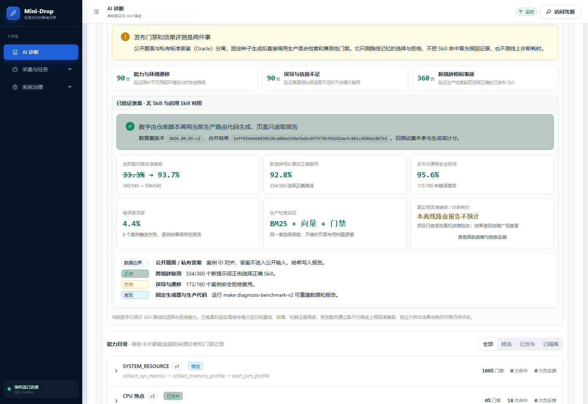

Agent 详情趋势只累计打开页面期间收到的不同采样时间，最多 60 点，刷新同一心跳不会增加一个点；切换 Agent 清空历史，多核进程 CPU 可超过 100%，离线机器也继续轮询以显示恢复。初始请求失败会显示原因与重试入口；未上报的版本不再默认写成 0.1.0。

当前 AI V2 的受限资源账号返回 403；需要端到端资源隔离的多租户场景尚未支持。完整检查见 [项目全面检查与修复](../reports/ai-diagnosis/项目全面检查与修复-20260910.md)。

> 读者不需要先懂性能分析或 Agent。本文先教你在网页上完成一次演示，再解释数据链、代码、LATS、Skill、记忆、操作系统和网络知识。
>
> 当前页面入口：`https://120.24.187.205/ai-diagnosis`。线上版本、健康状态和最新验收报告以 [`PROJECT_CONTEXT.md`](PROJECT_CONTEXT.md) 与 [`RESTART_HANDOFF.md`](RESTART_HANDOFF.md) 为准。

> 2026-09-08 基线：Python 501 项通过、3 项跳过，Web 32 个测试文件、133 项通过，Go 两个模块与 OpenAPI 80 组路由检查通过，Web 生产构建和 bundle 检查通过。线上版本和当前发布状态以 `RESTART_HANDOFF.md` 为准。同一发布版本的历史 Linux 链路 Campaign 得到 21/21（未强制根因 VERIFIED 和恢复测量），机器报告为 `reports/ai-diagnosis/fault-plaza-full-21-final-v2-20260908.json`；该结果不能外推为生产准确率。

> 2026-09-09 后续完善已发布 `20260909T153610Z`：Java 火焰图恢复，perf 按实际样本判定，模型非法反证最多一次纠正；Java/Python/Go/C++ 四条新链路 4/4，初始规划均为 LANGGRAPH_AGENT，16 次工具全部完成。随机 A/B 六条、偏好跨会话、独立 PostgreSQL 三项并发及 39 表/2,830 对象恢复通过；十分钟 1,200 次读取无失败。详情见 [后续完善与验收](../reports/ai-diagnosis/后续完善与验收-20260909.md)。

### 2026-09-10 页面读法与证据边界修正

- 工具节点使用真实工具 ID 显示中文名，另列执行状态。“策略检查通过”仅表示允许采集，不表示假设正确。
- 探索树记录问题 → 假设 → 工具 → 证据 → 报告。蓝色表示经过，红色表示反证，橙色表示失败/证据不足，绿色表示报告采用路径。绿色不代表故障修复；紫色 Skill 路线只提供先验。
- 结论必须区分“调查结束、根因定位、修复验证”。阶段性报告显示“阶段性发现（待验证）”；没有具体定位显示“尚未定位根因”。证据评分是规则分，不是正确概率。
- 历史案例 `insight_9700c04def7c434d83dd65ed9bc6a432` 的 147 个 I/O 样本只来自宿主机块设备，记录延迟指标 2000 微秒，没有目标进程归属。不能由此确认 python-hotspot 队列积压原因；其修复记录为空。页面解释旧记录，保留原始审计字段；新规则限制主机背景观测参与进程归因。
- “目标进程（Agent 实时发现）”来自机器快照。可信指来源和身份可校验，不表示该进程存在故障。采 CPU 前核对进程名、业务与负载；没有样本时不能生成火焰图，也不能据此断言没有故障。
- Agent CPU/RSS/读写速率描述采集 Agent 自身，不是整机或被诊断进程。RSS 是驻留内存，读写速率单位 KB/s。缺失值显示“未上报”，实测零保留 0；新版原生 Agent 按相邻心跳的计数差上报，首个窗口或读取失败不伪造数据。
- 修复复测区始终展示读取状态：无记录是“未验证”；读取失败是“状态未确认”；已有记录须看对比结果与适用范围。当前自动对比基于 TopN 变化，不等于完成全部业务指标验收。
- 540/500 指标是已知 21 类合同的确定性离线回放，观察预设，不逐条调用模型或 Linux 采集器。模板变体不等于独立事故，不能外推生产准确率。真机故障清理不等于 AI 自动修复代码。

### 修复后截图（2026-09-10 云端实拍）

本次已发布 `20260909T170846Z`，三个 Agent 都已升级。下面五张是新版实际页面；正文中的旧版截图保留便于对照。逐项解释、部署故障与恢复、验收范围见 [截图问题修复与验收](../reports/ai-diagnosis/截图问题修复与验收-20260910.md)。

**报告怎么看：** 先看“尚未定位根因”和结论正文，再看缺失的证据与下一步。下面这份只有主机 I/O 观察，不能归因到 python-hotspot；橙色表示调查仍有缺口。


**故障是否修好：** 看独立的修复前后验证。这里无复测记录，只能说尚未验证解决。


**树怎么读：** 沿问题、假设、工具与证据的父子关系看取证过程；结合图例区分已调查、反证、证据不足和报告采用路径。


**为什么失败：** CPU 没有有效样本时显示具体解释。重新采集前先核对 PID、业务负载与工具类型。


**指标是谁的：** 三行都是采集 Agent 自身的资源开销。RSS 约 16 MB，CPU 可因相邻窗口取样为 0 或约 0.2%，空闲磁盘速率为 0 是有效观测；没有数据才显示“未上报”。


### 这份文档怎么读

**2026-09-09 前端更新（已发布 `20260909T111410Z`）：** 新会话输入框与示例已移到首屏，原三张架构卡改由“诊断说明”打开；报告摘要前置，驾驶舱压缩但保留所有详情入口；树视图先展示拓扑，搜索预算可展开，Skill 路线与轮次位于树下方。刷新失败保留本会话最近成功数据并提示更新状态。正文已更新为 `docs/assets/learning-guide/20260909/` 的实拍截图；旧截图原样保留在父目录，发布验收截图另存于 `output/acceptance/20260909T111410Z/`。布局与交互的合成数据回归可运行 `node scripts/verify_frontend_workbench.mjs`，它与云端取证是两套独立验证。

这是一份项目总教程，不是接口字典。第一次接触时按下面顺序读，面试前则直接走演示路线：

| 你的目标 | 建议阅读 |
|---|---|
| 十分钟先把页面跑起来 | 第 1～5 节 |
| 理解 AI 为什么不是“一问一答” | 第 6～13 节 |
| 学会基础采集和每个页面控件 | 第 14～18 节 |
| 从前端一路跟到 Agent、存储和报告 | 第 19～24 节 |
| 准备操作系统、网络和运行时面试题 | 第 25～27、31 节 |
| 讲清 540/500 测试集 | 第 28 节 |
| 面试现场照着操作 | [`INTERVIEW_DEMO_GUIDE.md`](INTERVIEW_DEMO_GUIDE.md) |
| 查某个目录或文件负责什么 | 第 20～21 节先理解主干，第 34 节查逐文件字典 |

文中有三种状态口径：**已实现**表示代码和合同存在；**本地回归通过**表示自动化测试通过；**真机验收通过**表示云端产生了新的 Task、Artifact、Evidence 与 Report。三者不能互相替代。

正文页面截图更新于 2026-09-09（UTC+8），来自云端演示环境；单独标记的冻结案例示意保留其原始出处。Diagnosis 数量、树版本、PID、Task ID、状态和时间会继续变化，学习时看区域和按钮位置，不要背截图里的编号。所有缩略图都可以点击打开原尺寸图片。

## 0. 开始前：你需要懂什么，怎样使用这本教材

这份教材对应 **Mini-Drop 的实际实现**，不是任意性能平台的通用设计稿。阅读对象是第一次接手项目、需要讲清设计并能独立排障的人。你提供的《Drop 性能诊断系统架构与复刻指南》用于补充模块拆解和学习顺序；其中的建议架构、旧模块名和接口示例不自动视为本项目已实现功能。

### 0.1 先分清两个 Agent、两条链路

**采集 Agent** 是部署在 Linux 节点上的 C++ 程序，负责心跳、进程快照、领取 Task 和执行白名单 Collector。**诊断 Agent** 是 Python 服务中的模型与调查编排，负责提出假设、选择工具、理解证据并决定下一轮。前者在目标机器旁边采事实，后者在控制面组织调查；它们不是同一个进程。

**基础采集链**由人决定“采什么、采谁、采多久”，输出 Task 和可视化；**AI 诊断链**由人描述“哪里异常”，系统在预算内多轮调用基础采集能力，最终形成带引用和限制的报告。先学基础链，再学 AI，能避免把模型当成整个系统。

### 0.2 前置知识清单与达标动作

| 前置知识 | 先理解到什么程度 | 本项目在哪里用 | 自测 |
|---|---|---|---|
| Linux 进程、线程、PID | 知道进程会退出、PID 会复用、线程共享地址空间 | Scope、可信快照、Collector | 为什么仅凭 PID=1234 不能永久认定目标？ |
| 文件、权限、procfs | 会读 `/proc`，区分普通文件和内核暴露的状态 | 系统指标、smaps、命名空间 | 为什么 `/proc/<pid>/status` 随时间改变？ |
| CPU、内存、磁盘、网络 | 区分资源使用率、等待、容量和延迟 | 诊断类别与证据域 | CPU 不高时，请求为什么仍能很慢？ |
| HTTP、JSON、状态码 | 能在浏览器 Network 找请求、响应和失败原因 | Web → Go API | 页面 200 是否等于业务接口成功？ |
| SQL、事务、唯一约束 | 理解提交/回滚、并发冲突和索引 | Task、Attempt、Evidence、Outbox | 两个 Worker 同时拿到一条工作怎么办？ |
| RPC 与异步任务 | 区分“创建请求返回”和“任务已经完成” | Go → C++/Python gRPC | 为什么需要查状态和 SSE？ |
| Docker 与网络 | 区分镜像、容器、卷、宿主机和容器回环地址 | Control Compose、Worker、MinIO | 容器里的 `127.0.0.1` 指向谁？ |
| Git 与测试 | 会看 diff、找到测试、运行特定测试 | 修复与回归 | 改生成代码前应该找哪个源合同？ |
| React 基础 | 理解组件、props、state、effect、事件回调 | AIDiagnosis、TaskResult | 按钮怎样触发一次 API 请求？ |
| Go 基础 | 会读 handler、struct、error、context | HTTP 编排与 repository | 超时怎样沿调用链传播？ |
| Python 基础 | 会读函数、类型、异常、上下文管理器 | Planner、Analyzer、SQLAlchemy | 事务在哪里开始、哪里提交？ |
| C++ 基础 | 理解对象生命周期、线程、锁、RAII、子进程 | Control 与 Collector | 采集超时后如何保证子进程被回收？ |
| LLM 与结构化输出 | 知道 token、上下文窗口、工具调用和不确定性 | 诊断 Agent | 模型说“采集成功”为什么不算证据？ |

不必先精通四门语言。第一轮只追踪一条 Task 的输入、状态和输出；第二轮再研究锁、租约、证据门禁等实现细节。第 25～27 节补基础概念，第 31 节把它们转成面试回答，第 34 节查目录与文件。

### 0.3 截图与控件说明怎样对应

本次新增截图来自 2026-09-09 的云端 `20260909T111410Z`，每张图旁边有对应的文字和操作解释；点击图片可放大。截图目录中的同名 JSON 保存当时可见文字、控件标签、页面路径、时间和图片 SHA-256，方便以后确认“文档上的按钮是否仍然存在”。截图只打开已有记录和表单，不会为了凑图启动故障、发布 Skill 或创建任务。

页面有三种信息：**静态文案**解释功能；**动态字段**显示这次诊断的 ID、时间、数量和结果；**条件控件**只在审批、失败、已验证等状态出现。本教材解释它们的语义，不要求背诵某条历史诊断的每个函数名或编号。未在本次只读截图中出现的审批、修复验证、发布动作，会明确按源码说明，不能当作本次已经执行成功。

### 0.4 从复刻指南迁移到当前项目

| 参考指南中的概念 | 本项目实际落点 | 阅读时要修正的认识 |
|---|---|---|
| `drop_server` / `drop_agent` | `native/control/` / `native/agent/` | 用当前目录和 Compose 服务名定位，不照搬旧可执行文件名 |
| 四个核心运行模块 | Web、Go API、C++ Control/Agent、Python Analyzer，另有 Diagnosis Worker | AI 多轮诊断有独立服务和领域对象 |
| COS/MinIO | 当前部署使用 MinIO | 支持某种设计不等于云端同时部署两套对象存储 |
| 通用 AI 建议 | Diagnosis → Hypothesis → ToolCall → Evidence → Report | 本项目必须重新取证与验证引用 |
| 通用 API 示例 | `docs/contracts/openapi.v1.json` 和 `web/src/api/client.js` | 路径、字段、状态以可执行合同为准 |
| Kubernetes / 多副本建议 | 仓库保留部署材料，当前 Control 使用 Compose | 不把设计材料当成当前已上线的高可用集群 |

## 1. 一句话认识这个项目

Mini-Drop 是一套面向 Linux 服务器的“证据驱动性能诊断系统”。用户描述现象，AI 决定下一项值得采集的证据，但 AI 不能直接执行任意命令；真正的采集由受控 Agent 和白名单 Collector 完成，结论必须引用当前诊断中新采集、通过门禁的 Evidence。

最小心智模型：

```text
用户描述问题
  → 服务端确定安全目标和时间窗
  → Agent 生成多个可证伪假设
  → LATS 选择下一条调查分支
  → 受控工具创建采集任务
  → Worker 上传原始产物
  → Analyzer 生成火焰图/指标/调用图
  → Evidence Gate 判断支持、反证、中性或受限
  → Agent 反思、回传价值、继续或跨域转向
  → 报告引用 Evidence，给出置信度和限制
```

项目最重要的设计不是“AI 会聊天”，而是“AI 的每个判断都落到可审计的状态、工具、产物和证据上”。

## 2. 先跑通一次：新手十分钟路线

### 2.1 保存访问凭据

打开页面后点击右上角 **访问凭据**：

- 输入框：填写部署端签发的 API Key；
- **保存凭据**：先建立同源的 HttpOnly 会话，再由页面访问 API；
- 不要把 Key 放进 URL、截图、Markdown 或前端源码。

页头的 **实时事件已连接**表示 SSE 正常；**轮询兜底中**表示 SSE 暂时断开，页面退回低频轮询。它不是要求重启服务器的提示。

### 2.2 从页面制造故障

1. 打开 **AI 诊断**。
2. 切换到 **验证与 A/B**。
3. 进入 **故障广场**。
4. 保持“推荐”筛选，先选择“Go 服务 CPU 热点”；默认推荐区按 Go、Java、C++、Python 各展示一个案例，也可用运行时筛选查看全部 21 个场景。
5. 持续时间选 `120 秒`。
6. 点击 **启动并诊断**；持续时间只控制故障窗口，诊断后续轮次可能读到恢复阶段，要结合事件时间解释。
7. 页面会创建新的 Diagnosis，并自动发现目标、规划、取证和更新探索树。

Go 路径适合比较完整调查路线：部分已验收案例中 AUTO 先选 Go pprof、DISABLED 先选系统指标；也有两组首工具相同但后续路线不同的记录。应看实际 Tool Call 顺序，不预先承诺一定产生首工具差异；两条路线都必须重新采集当前证据。若要重点演示源码文件、Python 函数与行号，再选择“Python 源码热点”，其 py-spy 火焰图和 TopN 更直观。

### 2.3 人工推动下一轮

在对话底部选择 **寻找反证**，输入：

```text
验证这个热点是否足以解释 CPU，并排除 I/O 等待和同机争抢。
```

点击 **发送并继续诊断**。你应该看到新一轮假设、Tool Call、Evidence 或转向，而不是旧答案被覆盖。

### 2.4 打开探索树

切换到 **探索树**：

- 看真实父子分支，而不是一列流程卡；
- 点击 **查看评分**，区分访问次数、Q、UCT/PUCT 和报告置信度；
- 对未证实节点点击 **优先调查**或 **寻找反证**；
- 节点多时使用全屏、缩放、拖动和复位。

### 2.5 看真实采集物

打开本次 Tool Call 关联的任务，进入任务结果：

- 先看采集状态和分析状态；
- 再看 Attempt 和 Artifact；
- 最后看火焰图、TopN、调用关系图或系统指标。

到这里你已经完成了“页面制造故障 → AI 多轮调查 → 真实采集 → Evidence → 树和报告”的完整入门。

## 3. 页面地图

左侧导航有三组：

```text
AI 诊断
采集与任务
├── 任务面板
└── 计划任务
系统治理
└── 审计日志
```

全局按钮：

| 按钮 | 作用 |
|---|---|
| 左上角菜单图标 | 收起或展开导航，给工作台更多横向空间 |
| 访问凭据 | 保存 API Key；不展示业务数据 |
| 实时事件已连接 / 轮询兜底中 | 当前事件更新方式，不是业务状态 |

#### 图 1：第一次打开 AI 诊断页

[](assets/learning-guide/20260909/01-ai-diagnosis-workbench.png)

从左到右、从上到下看：

| 位置 | 你看到的内容 | 演示时怎么说 |
|---|---|---|
| 左侧深色导航 | AI 诊断、采集与任务、系统治理 | “AI 是重点，但采集、计划任务和审计仍是完整产品的一部分。” |
| 页面右上角 | 实时/轮询状态、访问凭据 | “事件流负责刷新进度；凭据只用于 API 鉴权。” |
| 深色横幅 | 当前轮次、树版本、职责说明 | “Drop 采事实，Agent 决策，Skill 复用路线。” |
| 诊断说明按钮 | 打开 Drop、诊断 Agent、Skill 的职责说明 | “模型不能直接把猜测写成 Evidence。” |
| 诊断案例 | 打开历史会话抽屉 | “历史记录在服务端，抽屉只负责选择。” |
| Agent 工作台 / 验证与 A/B | 在真实诊断和评测演示之间切换 | “两种视图不会清空当前会话。” |
| 页面底部事件状态 | SSE 或 Outbox 是否连接 | “断开时可以轮询兜底，不等于诊断任务失败。” |

## 4. AI 诊断页面：每个区域怎么用

### 4.1 页面顶部

顶部“诊断说明”按钮打开职责说明弹窗：

- Drop/Agent 负责采集事实和产出 Artifact；
- Diagnosis Agent 负责范围、假设、工具路线和调查；
- Skill Memory 只复用经过验证的路线，不复用旧 Evidence。

右侧的树版本和轮次来自当前诊断事件。数字变化代表服务端状态变化，不是浏览器动画。

### 4.2 诊断案例抽屉

点击 **诊断案例**打开历史抽屉。选择案例后抽屉自动收起，避免历史列表长期挤占宽度。

[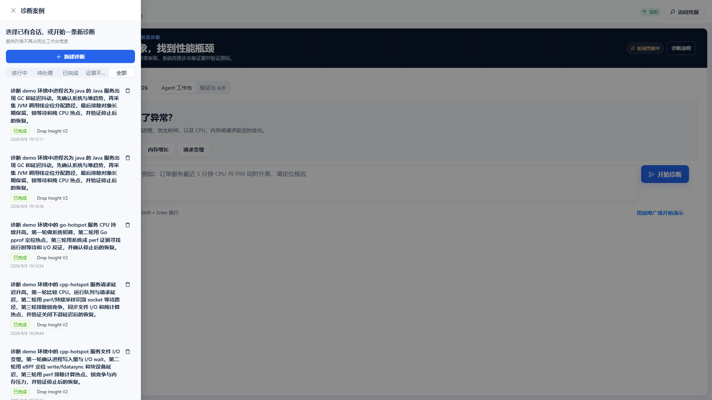](assets/learning-guide/20260909/02-diagnosis-case-drawer.png)

图中左侧抽屉的使用顺序：先点击“新建诊断”开始空白会话；需要查看旧链路时用“进行中/待处理/已完成/证据不足/全部”筛选；点击整张案例卡加载会话；右侧垃圾桶图标只做归档入口，不会把 Evidence、审计记录或对象存储一起抹掉。

- 状态筛选：按进行中、等待、完成、证据不足等状态过滤；
- 删除图标：归档/隐藏入口，不应删除 Evidence、审计或对象存储；
- 选择案例：加载该 Diagnosis 的范围、轮次、树、Evidence 和报告；
- 列表只负责找入口，权威数据仍从服务端读取。

### 4.3 Agent 工作台与验证中心

| 切换项 | 作用 |
|---|---|
| **Agent 工作台** | 当前 Diagnosis 的多轮调查、对话、树和报告 |
| **验证与 A/B** | 评测总览、故障广场、Skill A/B、Skill 示例与沉淀 |

切换不会删除当前诊断。A/B 页面还会从浏览器保存的两条 Diagnosis ID 恢复最近对照。

[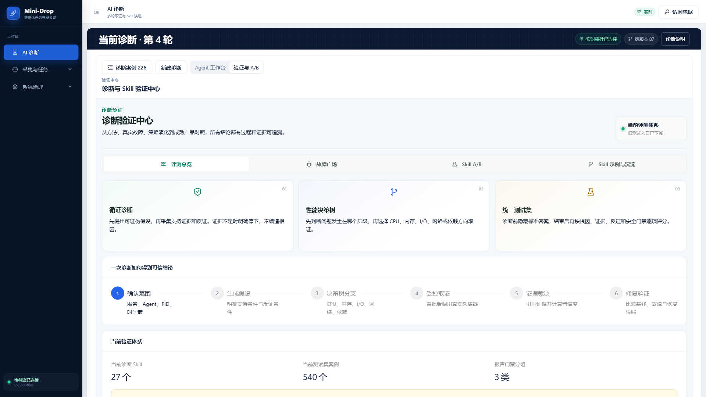](assets/learning-guide/20260909/05-evaluation-overview.png)

图中的四个横向入口分别回答四个问题：评测总览说明“怎样算可信”；故障广场回答“怎样现场制造故障”；Skill A/B 回答“复用路线到底有没有量化提升”；Skill 示例与沉淀回答“经验怎样经过门禁后进入策略库”。

### 4.4 自主与人工审批

| 模式 | 行为 |
|---|---|
| **自主** | 低风险只读工具可在白名单、预算、目标 binding 和门禁内自动推进 |
| **人工审批** | 每次需要审批的 Tool Call 先暂停；人可调整允许参数或拒绝 |

人工审批不是“给 AI root 权限”。Agent、PID、启动时间、命名空间和服务端签发的 binding 不可在审批弹窗中改写。

### 4.5 对话、探索树和分屏

| 显示方式 | 适用场景 |
|---|---|
| **对话** | 默认全宽，阅读多轮问题、假设、工具、证据和结论 |
| **探索树** | 全宽查看真实分支、剪枝、回溯、最佳路径和评分 |
| **分屏** | 人工干预时对照对话与树；屏幕较小时不推荐 |
| **全屏查看探索树** | 节点很多或面试讲解评分时使用 |

### 4.6 新建诊断与确认范围

点击 **新建诊断** 后，先用一句自然语言描述现象。系统会理解意图并自动发现目标，不要求用户一开始就知道 PID。进入“确认范围”后，页面中的字段含义如下：

[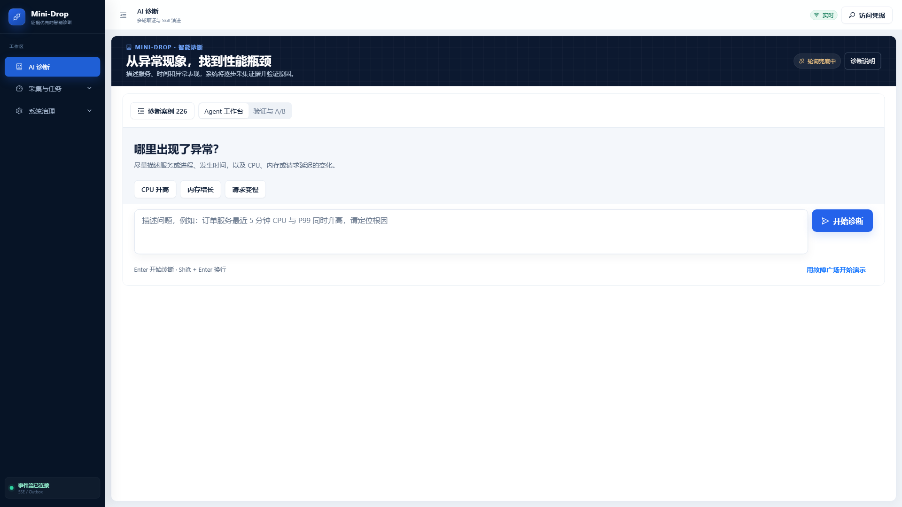](assets/learning-guide/20260909/02b-new-diagnosis-composer.png)

图中最下方长输入框是问题描述，右侧蓝色“开始诊断”才会向服务端创建 Diagnosis。建议按“现象 + 对象 + 时间 + 希望排除的方向”输入，例如：`订单服务最近 5 分钟 CPU 与 P99 同时升高，请定位根因并排除 I/O 等待。` Enter 发送，Shift+Enter 换行。不要在这里直接写“根因一定是数据库”，否则会给规划器不必要的锚定。

| 控件 | 作用 | 为什么需要 |
|---|---|---|
| 问题描述 | 写现象、对象、时间和希望排除的方向 | 这是 Agent 的任务目标，不是预设根因 |
| 重新发现目标 | 重新请求服务端进程发现 | 进程可能重启，旧 PID 不能长期复用 |
| 服务 | 业务服务名，例如 `order-service`；故障广场会自动带入 | 用于业务归属和候选过滤，不直接作为系统权限 |
| 环境 | `development`、`staging`、`production` 或 `demo` | 防止把演示目标误当生产目标 |
| 诊断目标 | 从服务端签发的候选中选一个安全 binding | binding 内含 Agent、PID、启动时间等只读身份，浏览器不能自己编造 |
| 开始时间 / 结束时间 | 故障证据窗口 | 一旦确认便不可随意平移，避免先看证据再改窗口 |
| 确认范围并开始取证 | 锁定范围，进入假设生成和工具规划 | 之后改变方向应通过多轮干预，而不是偷偷换目标 |

若服务端发现唯一且安全的目标，Agent 可以自主确认；若出现多个候选、目标过期或权限不足，页面会要求人工选择。故障广场创建的会话会带入服务端白名单目标，但最终 binding 仍由本次进程发现产生。

### 4.7 多轮输入框

| 意图按钮 | 输入示例 | Agent 的处理 |
|---|---|---|
| 补充 / 追问 | `故障只在发布后出现。` | 补充会话上下文，并继续调查 |
| 继续取证 | `继续采集独立证据。` | 在预算内选择下一项允许工具 |
| 调整方向 | `先看内存与 swap。` | 降低旧路线优先级，扩展新域 |
| 寻找反证 | `验证 CPU 热点能否被 I/O 证据推翻。` | 建立证伪条件和交叉验证路线 |

输入框中的话不会直接变成 Evidence。服务端先保存 intervention，再规划新假设和工具；旧轮次保持只读。

[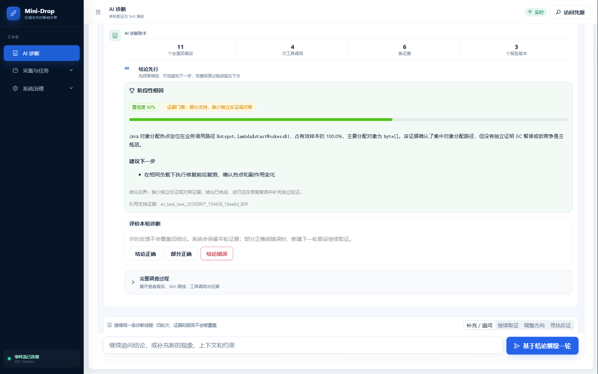](assets/learning-guide/20260909/20-multiturn-composer.png)

上图底部输入框继续当前线程；“基于结论继续一轮”是终态后追加调查的动作。上方“结论正确/部分正确/结论错误”是人工反馈入口，完整调查过程折叠后仍可展开。

### 4.8 其他按钮

| 按钮 | 含义 |
|---|---|
| **复杂案例回放** | 只读查看当前案例的树、Evidence 和报告，不切换案例 |
| **审计细节** | 展开 Tool Call、Evidence、Report 和事件的技术详情 |
| **继续推进** | 请求未终止诊断继续一步；不要连续重复点击 |
| **优先调查** | 从某个假设节点开启下一轮，并提高这条方向优先级 |
| **寻找反证** | 从节点开启证伪调查，不把人工质疑当成科学反证 |

### 4.9 探索树里的 Skill 路线怎么看

切到 **探索树** 后，真正的 LATS 父子树仍是主图。若本次会话启用了并命中 Skill，拓扑下方会出现 **Skill 调查路线**，图中以独立虚线标识非证据路线：

```text
召回候选 → 激活路线 → 第 2/3/4 轮沿用 → 偏离或退出
                 ↓
          推荐探针 1 → 2 → 3
```

- “完整 `SKILL.md` 已加载”表示服务端已经校验来源、hash 和章节，并把完整路线合同交给 Agent；不表示根因已成立。
- “路由已纠偏”表示规则分类先猜错了域，但 Skill 的强文本信号通过门禁后选中了更匹配的类别。
- “当前步骤”表示本轮优先使用哪一个仍可用的白名单工具。
- 工具节点的“Skill 路线第 N 步 · 已采用”表示真实 Tool Call 与路线对上了。
- “偏离/退出/耗尽”说明证据、人工方向或可用能力已不再支持继续沿旧路线。

点击任一阶段或探针步骤，会弹出命中依据、检索分数、来源文件、正文 SHA-256、已加载章节和逐轮记录。虚线和“非证据先验”是刻意设计：Skill 负责告诉 Agent **优先查什么**，LATS 和 Evidence 负责说明 **这次机器实际上发生了什么**。

### 4.10 验证与 A/B 的四个入口

| 入口/按钮 | 含义 |
|---|---|
| **评测总览** | 展示循证诊断、性能决策树、统一测试集，以及 Skill/Case/门禁的实际报告统计；缺失时显示“-” |
| **查看示例与运行实例** | 切换至“Skill 示例与沉淀”页签，查看内置参考路线和数据库运行实例 |
| **故障广场** | 同时包含完整 LATS 冻结回放和 21 个实时白名单故障 |
| **刷新场景** | 只刷新冻结回放 catalog，不启动回放 |
| **新建回放会话** | 创建一条新的冻结回放 Diagnosis |
| **刷新状态** | 重新查询四种运行时实验室状态 |
| **故障持续时间** | 选择 30、60 或 120 秒；服务端上限为 300 秒 |
| **启动故障** | 只注入故障，适合之后手工创建基础采集任务 |
| **启动并诊断** | 注入故障并创建真实多轮 Diagnosis |
| **Skill A/B** | 注入故障后，把同一问题带到 AUTO/DISABLED 对比 |
| **停止** | 主动停止当前卡片的故障 |
| **Skill A/B 页** | 输入两组共用问题、启动真实对比、刷新两组和恢复历史 |
| **Skill 示例与沉淀** | 切换到页面内容区，查看候选、已发布、已隔离 Skill 及评测/发布/回滚操作 |

### 4.11 工具审批、反馈与修复验证

这些控件只会在相应状态出现；看不到某个按钮，通常表示当前诊断还没有走到该阶段。

| 区域/控件 | 作用 | 使用注意 |
|---|---|---|
| 工具卡片 → 修改参数 | 在执行前调整本次采集时长或采样率 | 安全目标、Agent、PID 和进程启动时间不可修改 |
| 时长（秒） | 调整一次只读探针持续时间 | 页面和服务端都有限制，不能借此创建无限任务 |
| 采样率（Hz） | 调整支持该参数的采集器频率 | 采样越密，开销通常越高 |
| 通过 | 批准当前 Tool Call，服务端随后创建真实 Task | 只有 `PENDING_APPROVAL` 状态出现 |
| 拒绝 | 拒绝当前 Tool Call，并把结果记入审计和下一轮规划 | 拒绝不是删除节点，Agent 可以换路线 |
| 正确 / 部分正确 / 错误 | 给最终结论提供人工标签 | “部分正确”和“错误”会要求补充可执行的纠正信息 |
| 纠正后的根因 | 告诉 Agent 哪个根因被遗漏或判断错误 | 它是人工反馈，不会直接伪造成机器 Evidence |
| 补充说明 | 写入发布、变更、负载等背景 | 后续轮次会读取，会话外是否沉淀仍受记忆策略控制 |
| 提交反馈并开始下一轮取证 | 保存反馈并从当前状态继续规划、调用工具和更新树 | 适合结论证据不足或方向判断错误时使用 |
| 修复前任务 | 填入根因确认阶段的 Task ID | 必须已经完成分析并有可比较产物 |
| 修复后任务 | 用相同目标、采集器和负载复采后的 Task ID | 不要拿不同服务或不同负载直接比较 |
| 修复说明 | 记录本次代码或配置修改，例如“缓存序列化结果” | 用于报告解释，不参与伪造指标 |
| 对比验证 | 比较修复前后 TopN 和关键指标并形成验证结论 | 证明“改完是否真的变好”，不是重新猜一次根因 |

### 4.12 Skill 管理与 A/B 页全部操作

| 控件 | 作用 |
|---|---|
| 打开完整评测中心 | 从驾驶舱跳到验证中心，查看数据集、回归和 Skill 指标 |
| 两组共用问题 | 为启用 Skill 与关闭 Skill 两臂提供完全相同的问题文本 |
| 启动真实对比 | 分别创建 `AUTO` 和 `DISABLED` 两条真实诊断；两组独立发现目标，不能共享 Evidence |
| 刷新两组 | 从服务端重读两条诊断的轮次、工具、Evidence、门禁和报告，不重建会话 |
| 打开该诊断 | 回到该臂的 Agent 工作台，检查具体树和证据 |
| 查看机器报告 | 打开 540 条根因集和 500 组同题 A/B 的机器可读报告 |
| A/B 历史中的恢复 | 用浏览器保存的 Diagnosis ID 恢复一组对照；真正指标仍从服务端读取 |
| 刷新 / 重新读取 | 重新读取 Skill 运行实例；后者常在加载失败提示中出现 |
| 全部 / 候选 / 已发布 / 已隔离 | 按 Skill 生命周期筛选，不会修改状态 |
| 生成候选 Skill | 从结论已验证且引用可信 Evidence 的轨迹提取路线合同 |
| 运行三类门禁 / 运行三类门禁评测 | 执行相似正例、误导反例、环境迁移测试 |
| 发布技能 | 门禁通过后人工投入复用；不是 Agent 自动改生产策略 |
| 隔离 | 人工发现负迁移时停止继续召回该版本 |
| 回滚上一版 | 当前版本有父版本时恢复上一份已验证路线 |
| 打开 Skill 广场 | 查看示例路线、数据库实例、来源诊断和真实复用次数 |
| 查看 Skill 详情 | 从探索树打开命中依据、BM25/规则分数、正文 hash、加载章节和逐轮轨迹 |
| 关闭回放 / 关闭 | 关闭只读案例或详情弹窗，不停止真实诊断 |

### 4.13 新首屏、说明弹窗与刷新提示

[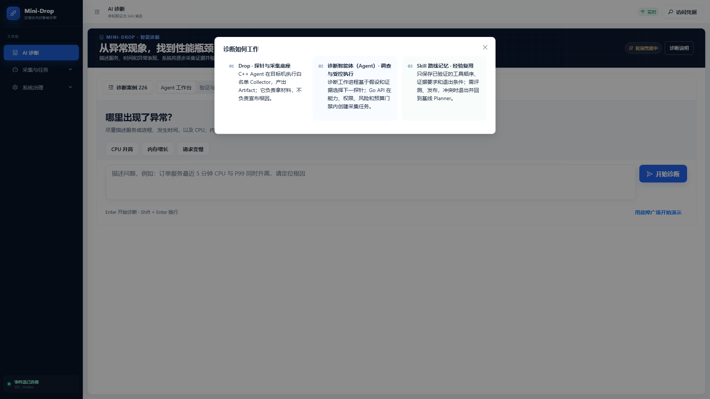](assets/learning-guide/20260909/13-diagnosis-help.png)

| 文字或控件 | 实际含义 | 是否改变服务端 |
|---|---|---|
| 从异常现象，找到性能瓶颈 | 工作台用途说明；不是承诺每次一定定位根因 | 否 |
| 哪里出现了异常？ | 引导填写服务、进程、时间和现象 | 否 |
| CPU 升高 / 内存增长 / 请求变慢 | 将一条可编辑示例填入输入框；不会直接开始采集 | 否 |
| 开始诊断 | 用当前问题创建 Diagnosis；问题不够明确时先澄清或发现目标 | 是 |
| 用故障广场开始演示 | 切到验证中心的故障广场 | 切换本身不造故障 |
| 诊断说明 | 打开三类职责和使用边界的说明 | 否 |
| 本会话报告摘要 | 展示当前最佳持久化 Report；下面的限制和下一步属于同一报告 | 否 |
| 引用支持证据 / 引用反证 | 报告引用的 Evidence 数量；不是全部采集文件数量 | 否 |
| 尚未确认 | 当前报告仍缺的独立证据或对照 | 否；不要忽略这段文字 |
| 更新失败 / 最近成功更新时间 | 保留的是本会话旧数据，界面没有确认它仍是最新状态 | 否 |
| 重试 | 重读失败资源；不会创建新诊断或重新采样 | 读取 |

[](assets/learning-guide/20260909/14-mobile-workbench.png)

手机上导航折叠，输入和开始按钮纵向排列。Enter 发送、Shift+Enter 换行；中文输入法候选确认不会立即提交。桌面与手机连接同一组服务端 API，布局改变不改变权限和诊断语义。

### 4.14 页面数字、缩写与状态字典

| 文字 | 解释与正确读法 |
|---|---|
| Diagnosis / 诊断案例 | 一次围绕特定问题和目标的调查，会包含多个采集 Task |
| 第 N 轮 | 实际调查轮次，不能直接用假设节点树深度代替 |
| 树版本 / revision | 树投影的更新标记，不是产品版本或模型版本 |
| Hypothesis / 规划假设 | 可以被后续证据支持或推翻的候选解释 |
| Tool Call / 工具调用 | Agent 对一个受控工具的申请；并非一定已经采集成功 |
| Task / 任务 | 执行一次具体采集的业务记录 |
| Attempt / 尝试 | 某次实际执行的身份和结果；重试不应抹掉旧记录 |
| Artifact / 产物 | 文件与元数据，例如 Profile、指标 JSON、火焰图 |
| Evidence / 证据 | 对材料做目标、时间、质量和假设关联检查后的记录 |
| SUPPORT | 当前材料支持该假设；最终结论仍需看反证和门禁 |
| COUNTER | 对该假设构成反证，不等于这份材料采集失败 |
| NEUTRAL | 材料有效，但不足以支持或反驳当前假设 |
| ACCEPT_LIMITED | 材料有可用部分，但质量、可观测性或适用范围受限 |
| REJECT | 不符合证据要求；保留原因，不能进入可信根因引用 |
| VERIFIED | 报告通过相应验证合同；只在该目标与证据窗口内成立 |
| PARTIAL_WITHOUT_COUNTER / 阶段性根因 | 找到支持材料，但独立反证或对照不足 |
| INSUFFICIENT_EVIDENCE / 证据不足 | 当前预算与材料下无法形成足够可信的根因 |
| COMPLETED / 已完成 | 状态机已经结束；还要看报告属于完整验证还是带限制完成 |
| CANCELLED / 已取消 | 人工取消或预算截止等终止，查看事件原因 |
| PENDING_APPROVAL / 待审批 | 等待人批准或拒绝本次工具申请 |
| BLOCKED / 被阻止 | 策略、能力、预算或身份门禁未放行 |
| ONLINE / 在线 | Agent 最近心跳可达，不保证所有采集器都可执行 |
| HEALTHY / 健康 | 被检查依赖符合健康条件，不等于业务准确率 100% |
| DEGRADED / 降级 | 部分能力退化，例如请求持久化但实际回退到内存 |
| CPU % | 某个统计范围内 CPU 利用程度；先确认是整机、进程还是单核口径 |
| RSS / PSS | 驻留物理页大小 / 共享页按比例分摊后的内存大小 |
| FD / 文件描述符 | 进程打开资源的句柄数量，不只代表磁盘文件 |
| P99 | 99% 观测请求的延迟不超过该值；不等于最大延迟 |
| Hz | 每秒采样次数或目标频率；增加频率可能增加开销 |
| samples / 样本 | 实际采到的观察，不是实际执行次数或请求次数 |
| inclusive / self | 包含子调用的累计样本 / 当前帧自身的样本 |
| Q / UCT / PUCT | 搜索收益估计与选分支分数；不等于根因置信度 |
| Prior / 先验 | 规划或 Skill 对候选路线的偏好；仍需现场验证 |
| BM25 / 相关分 | 文本检索匹配程度，不是故障发生概率 |
| SHA-256 / digest | 内容指纹，用于追溯同一份文档或快照；本身不证明内容正确 |
| binding / 目标绑定 | 服务端签发并校验的目标身份，包含进程与环境信息 |
| pp / 百分点 | 两个比例的直接差，例如 68.4%−41.2%=27.2 pp |
| p 值 / 95% CI | 在统计假设下的检验量与置信区间；样本少或实验不公平时不能滥用 |
| “-” / 未采集 / 暂无 | 当前没有对应数据；不能读成数值为零 |

完整中文映射可查 `web/src/utils/diagnosisDisplay.js`、`status.js`、`generated/taskStatuses.js`；表格是阅读解释，实际状态迁移由后端合同约束。

## 5. Agent 运行驾驶舱怎么看

驾驶舱把当前会话压缩成可点击指标：

[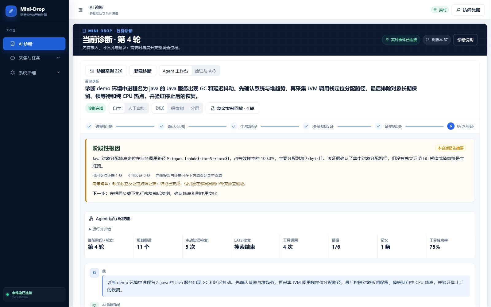](assets/learning-guide/20260909/03-selected-diagnosis.png)

这张图适合面试时讲“它不是一次问答”：顶部显示第 4 轮和树版本 87；阶段条已经经过理解问题、确认范围、生成假设、决策树取证、证据裁决和结论验证；驾驶舱同时显示假设、知识检索、工具、Evidence、记忆和评测。右上角可以在自主/人工审批以及对话/探索树/分屏之间切换。

| 指标 | 表示什么 | 点击后看什么 |
|---|---|---|
| 当前阶段 / 轮次 | 理解问题、规划、取证、裁决或验证 | 该阶段来自哪些服务端事件 |
| 规划假设 | 当前去重后的候选数 | 主假设、备选、证伪条件和工具计划 |
| Agentic RAG | 本轮知识检索次数 | query、知识源、文件 hash、匹配词、证据要求和限制 |
| 工具调用 | 已创建的 Tool Call 数 | 工具、参数、策略结果、Task/Attempt 状态 |
| 证据 | 可支撑结论的材料数/全部 Evidence 数，按服务端分类与兼容映射计算 | 支持、反证、中性、受限与拒绝原因 |
| 记忆 | 会话上下文和路线记忆 | 短期对话、领域事实、Skill 路线，不与 Evidence 混用 |
| 工具成功率 | 已结束 Tool Call 的成功比例 | 报告状态、限制、门禁与评测入口；不等于根因准确率 |
| LATS 搜索 | 选择、路径和预算 | 当前节点、最佳/最近路径、UCT/PUCT、停止原因 |

RAG 命中的文档是知识先验，不是这次机器的 Evidence。一个“CPU 热点诊断指南”即使完全匹配，也不能证明当前 PID 确实有 CPU 热点。

点击驾驶舱中的任一指标会打开详情，而不是跳到另一个黑盒页面。例如点击“规划假设”：

[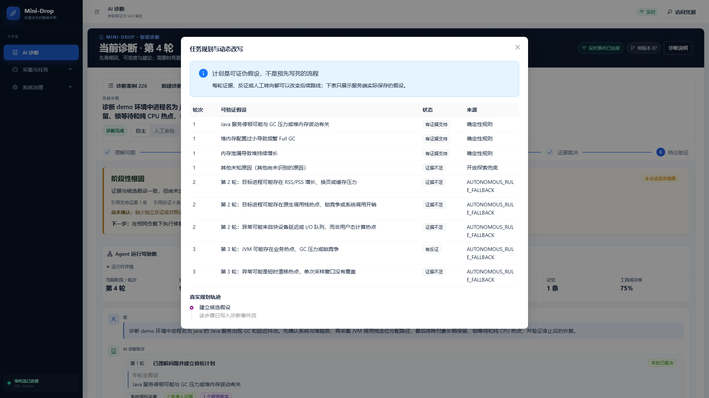](assets/learning-guide/20260909/03b-cockpit-metric-dialog.png)

弹窗逐轮列出假设、状态和来源。“AI 生成”是模型首轮候选，“AI 重新规划”是后续轮次根据 Evidence 改写，“开放探索兜底”保证既有假设都不成立时仍可探索其他原因。状态为“有证据支持”也不等于最终根因，还要经过反证、报告和修复验证。

### 5.1 结论卡到底在说什么

结论卡不是火焰图，也不是下载文档。它是结构化 Report 的页面投影，正文必须回答“当前证据具体定位到了什么”，同时保留置信度、证据门禁、下一步、限制和 Evidence ID。火焰图、TopN、系统指标等是 Report 引用的 Artifact/Evidence，可以从完整调查过程或任务结果页打开。

| 卡片标题 | 严格含义 |
|---|---|
| 根因结论 | 支持、反证/对照和覆盖门禁已经满足，可以作为当前时间窗内的最终判断 |
| 阶段性根因 | 已定位到具体函数、资源或依赖，但缺独立反证/对照；可以指导下一步，不能说因果完全闭环 |
| 本轮判断 | 当前分支未建立根因，可能有反证或证据不足 |

以 Java allocation 为例，合格正文会写出 `Hotspot.lambda$startWorkers$1`、100% 有效样本和主要分配对象 `byte[]`；同时明确“没有独立证明 GC 暂停或锁竞争是主瓶颈”。“JVM 可能存在业务热点、GC 压力或锁竞争”只是待检验假设，不能当作根因结论。

历史 Report 是审计记录，不能回写篡改。页面遇到旧版 `SUPPORTED：支持假设……` 时，会从该 Report 已保存且校验通过的 `HYPOTHESIS_PREDICATE` 与 TopN claims 恢复具体中文阶段性根因；这只是确定性展示兼容，不创造新 Evidence。

### 5.2 八个详情入口的截图与阅读顺序

点击数字卡会打开弹窗；弹窗右上角 × 只关闭显示，不终止任务。图里“暂无”表示当前案例缺少这一类记录，不应补造记录让页面显得丰富。

| 入口 | 在图中先看 | 然后验证什么 |
|---|---|---|
| 当前阶段 / 轮次 | 诊断状态、框架、模型来源和实际会话保存方式 | 是否存在 requested/actual 不一致或降级 |
| 规划假设 | 每轮 statement、状态和生成来源 | 假设有没有在新证据出现后变化 |
| 主动知识检索 | 查询、来源文档、hash、匹配词 | 它只是知识先验，是否明确列出仍需现场证据 |
| 工具调用 | 工具名、执行状态、风险、参数、Task | 申请是否真正进入执行并产生采集物 |
| 证据 | 角色、质量、接受/拒绝原因、引用 | 报告是否引用本次同目标材料 |
| 记忆 | 当前会话、跨诊断偏好、长期 Skill 路线 | 哪些是事实，哪些只是提示上下文 |
| 工具成功率 | 已结束调用成功比例、报告状态、限制 | 工具成功与根因正确不是一件事 |
| LATS 搜索 | 当前阶段、选择依据、Q、预算、停止原因 | 分数和实际分支选择能否对上持久化事件 |

[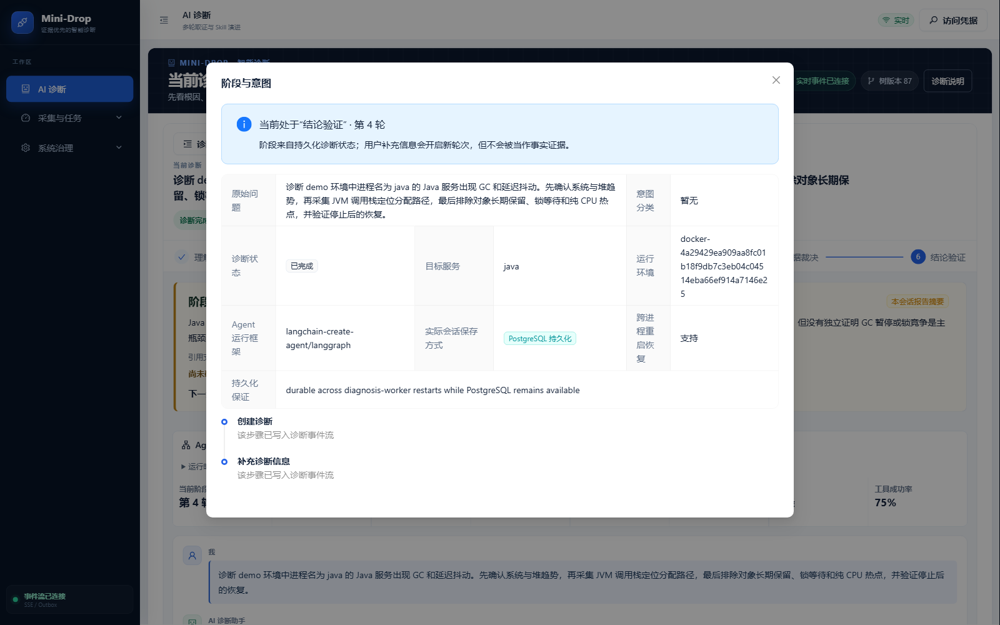](assets/learning-guide/20260909/15-cockpit-stage.png)

[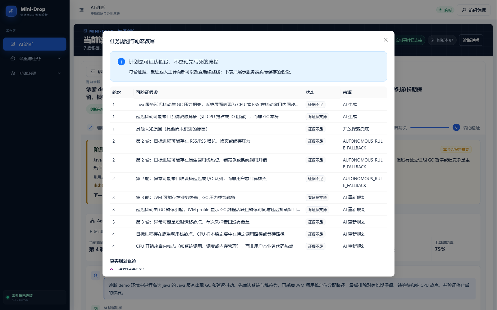](assets/learning-guide/20260909/15-cockpit-plan.png)

[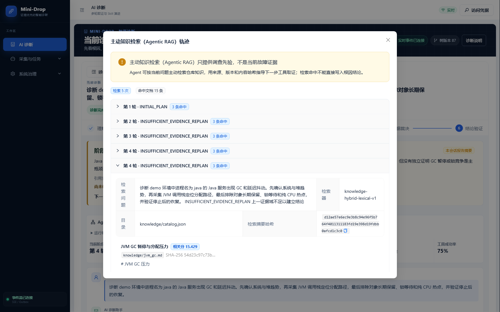](assets/learning-guide/20260909/15-cockpit-rag.png)

[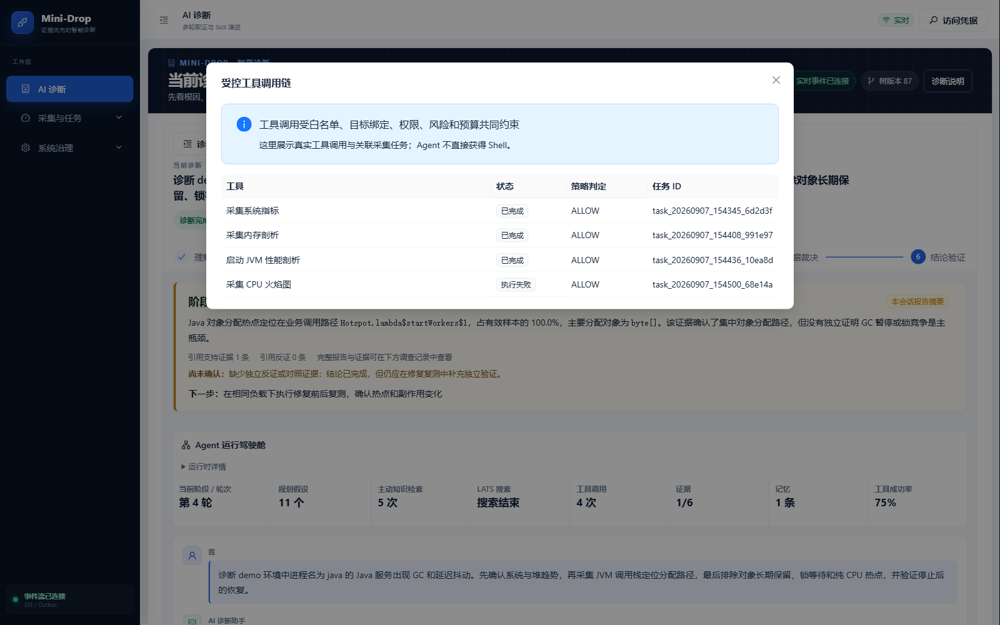](assets/learning-guide/20260909/15-cockpit-tools.png)

[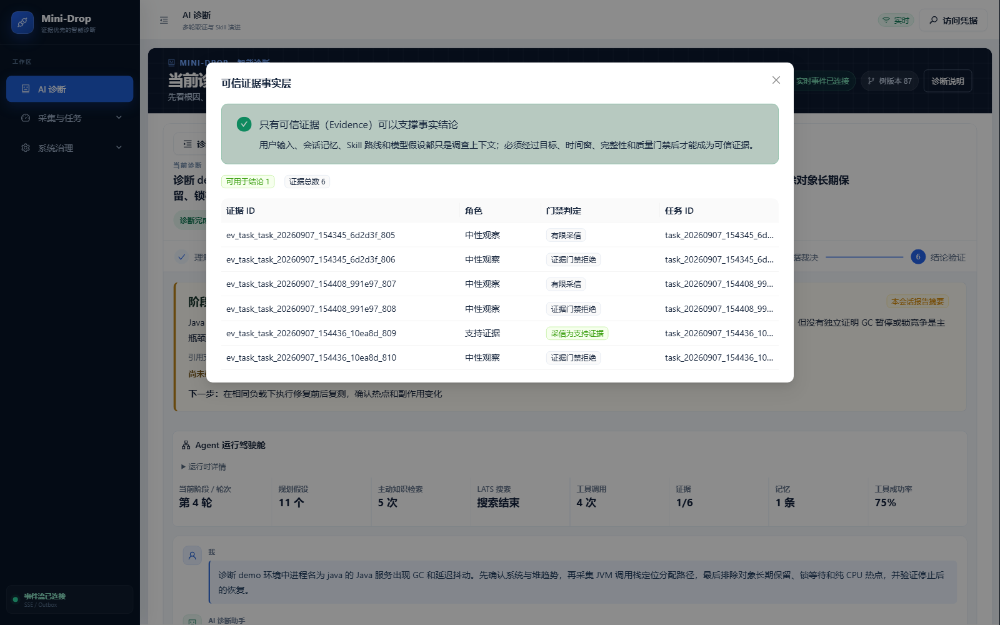](assets/learning-guide/20260909/15-cockpit-evidence.png)

[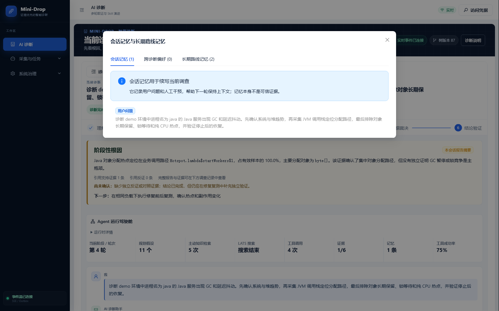](assets/learning-guide/20260909/15-cockpit-memory.png)

[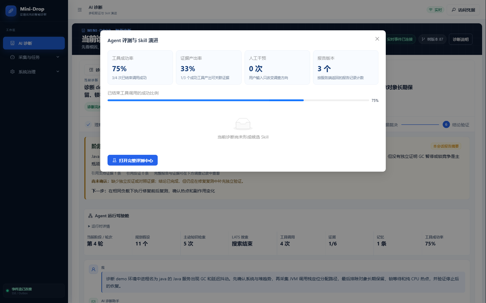](assets/learning-guide/20260909/15-cockpit-evaluation.png)

[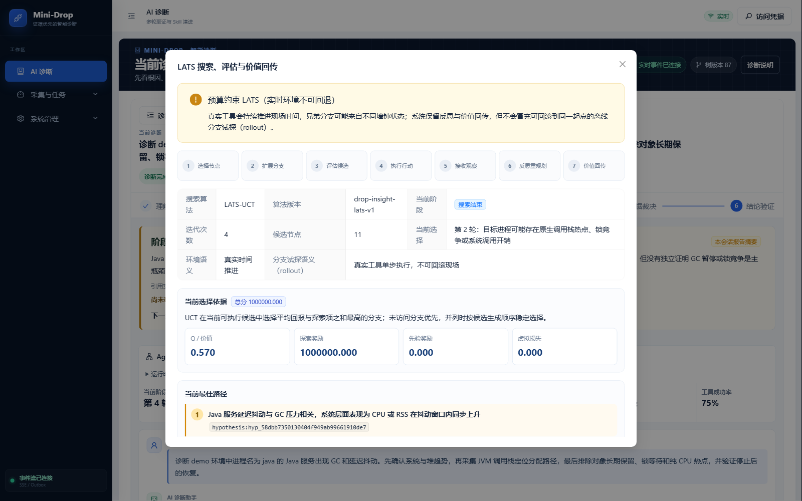](assets/learning-guide/20260909/15-cockpit-lats.png)

## 6. 探索树：从图形读懂 LATS

### 6.1 为什么是树，不是一条链

传统单链 Agent 可能先猜 CPU，工具失败后仍沿 CPU 路线反复尝试。LATS 同时保存多个候选：CPU、内存、I/O、网络、运行时、依赖和开放世界未知原因。一个分支被反证后，系统把结果回传到树上，再选择更值得探索的分支。

页面把论文六阶段中的 Simulation 拆成“行动”和“观察”，因此你可能看到七个可读步骤：

```text
选择 → 扩展 → 评估 → 行动 → 观察 → 反思 → 价值回传
```

### 6.2 UCT 与 PUCT

默认 UCT 的直觉：

```text
分数 = 已知平均回报 + 对访问较少分支的探索奖励
```

已访问节点的近似公式：

```text
Q(s) = value_sum(s) / visits(s)
UCT(s) = Q(s) + c * sqrt(ln(parent_visits) / visits(s))
```

PUCT 是可选扩展，会加入候选先验 `prior`。无论 UCT 还是 PUCT，选择分数只决定“下一步先查谁”，不是根因置信度。

### 6.3 评分弹窗

| 字段 | 含义 |
|---|---|
| 访问次数 | 该节点实际参与回传的次数 |
| 累计奖励 | 历次有界 reward 的总和 |
| 平均回报 Q | 累计奖励除以访问次数 |
| 先验 | 候选初始倾向，只有 PUCT 直接参与先验奖励 |
| UCT/PUCT | 当前选择时的排序分 |
| 本轮奖励 | 本轮 Observation 经评估后的反馈 |

“查看评分”与画布拖动是两种交互：短按按钮打开弹窗，按住空白处拖动画布。没有服务端值就显示“未记录”，不应补零。

### 6.4 树状结构与轮次路径

- **树状结构**：回答“节点怎样分叉、剪枝、回溯，最佳路径在哪里”；
- **轮次路径**：回答“第几轮为什么转向，用了什么工具，得到什么证据”；
- 两者是同一份服务端事件的不同投影，不是两棵树。

一个容易混淆的细节是：节点的出生深度不等于执行轮次。初次 Expansion 可能一次生成三个同层 sibling，它们的 `tree_depth` 都是 1；LATS 随后在第 1、2、3 次迭代依次选择它们时，页面应分别显示第 1、2、3 轮。服务端用 `lats.node_selected.iteration` 统计真正产生 Report 的轮次，用 `Hypothesis.round_index` 保留原始父子层级。这样既不会把回溯画成一条假链，也不会把三次真实采集误算成一轮。

[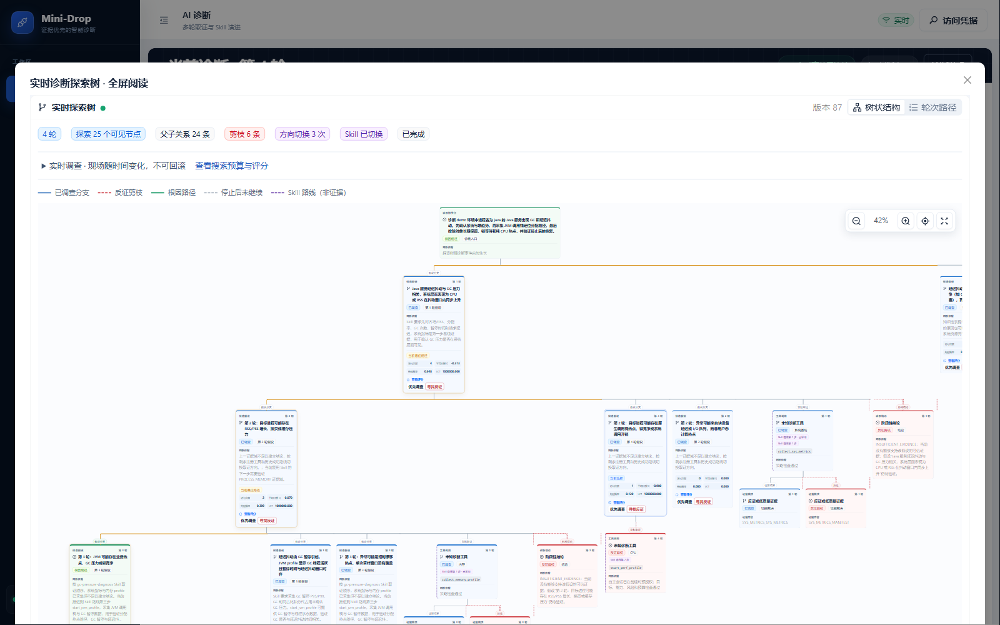](assets/learning-guide/20260909/18-tree-fullscreen.png)

全屏弹窗保留真实节点；上方“查看搜索预算与评分”按需展开，右上缩放与复位仅改变视图。

[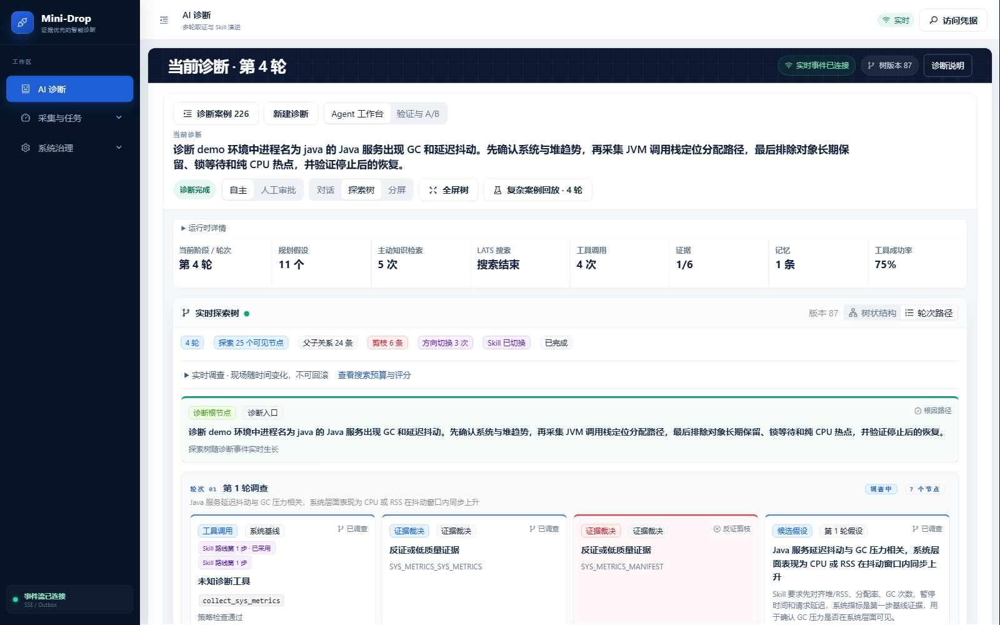](assets/learning-guide/20260909/19-tree-rounds.png)

轮次路径适合顺序讲述，树状结构适合解释兄弟分支与回溯。切换不改变已持久化的调查。

### 6.5 为什么事件会重复

不同搜索迭代都需要选择、观察、反思和回传，所以相同类型事件在不同轮出现是算法必需。系统只去除同一轮、同一对象、相同语义的真正重复；数值更新和跨轮事件必须保留。

### 6.6 探索树画布上的按钮

| 控件 | 作用 |
|---|---|
| 树状结构 / 轮次路径 | 在真实父子树与按执行轮次阅读的路径板之间切换 |
| 查看评分 | 打开当前节点的访问次数、价值、先验、UCT/PUCT 和奖励历史 |
| 查看 Skill 详情 | 打开 Skill 召回、激活、沿用、偏离或退出的逐轮解释 |
| 优先调查 | 以当前假设为下一轮人工优先方向，服务端会新增事件和节点 |
| 寻找反证 | 要求 Agent 主动寻找能推翻当前假设的独立证据 |
| 缩小 / 放大 | 只改变画布视图，不改变服务端树 |
| 复位 | 恢复默认缩放和位移，不回滚诊断 |
| 全屏 | 用大弹窗显示同一棵树，适合节点多时讲解 |
| 关闭 | 关闭评分、Skill 详情或全屏弹窗 |

树的更新来自服务端事件流：新假设、Tool Call、Evidence、剪枝、方向切换和价值回传都会形成新版本。人工介入不是在浏览器里拖节点改 JSON，而是点击“优先调查”“寻找反证”或提交多轮输入；服务端据此追加新轮次，旧节点和旧证据保持可审计。

[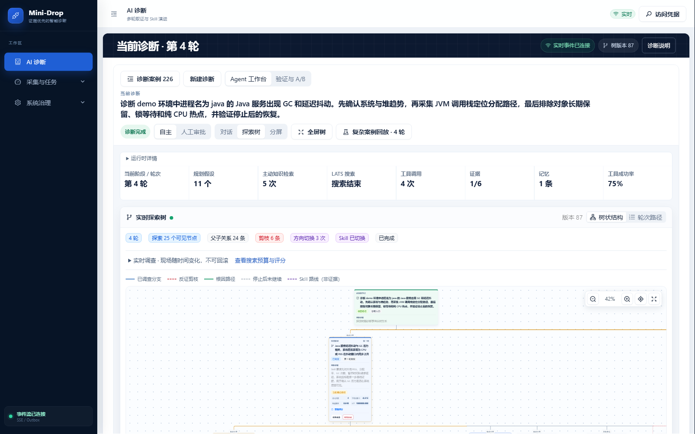](assets/learning-guide/20260909/04-dynamic-exploration-tree.png)

看这张图时按五步讲：

1. 左上角“4 轮、探索 25 个可见节点、剪枝 6 条、方向切换 3 次”是服务端真实统计；
2. `LATS-UCT` 表示选择策略，“预算约束 LATS”说明真实机器不能回滚；
3. “搜索预算 4/4、工具预算 4/12”说明停止不是页面卡死，而是搜索预算已经耗尽；
4. “当前最佳路径”只是搜索排序结果，仍需回到 Evidence 和 Report 验证；
5. 右上角“树状结构/轮次路径”和“全屏树”负责换读法，不修改诊断数据。

冻结回放则可以展示一棵更适合讲解剪枝、跨域转向和恢复验证的树：

[](../web/public/report-assets/complex-showcase.png)

这张内置图的观察是固定快照，适合解释算法，但不能冒充当前服务器实时 Evidence。面试时应先用它讲完整 LATS，再用上一张实时树证明真实 Task 和 Evidence 链路。

## 7. 实时 LATS 与完整 LATS 的边界

### 7.1 实时诊断：BUDGETED_LATS

真实 CPU、队列和网络状态随墙钟时间变化。Tool Call 一旦执行就改变观察窗口，无法把整台生产机器倒回几秒前。因此实时诊断是预算约束的渐进搜索：只对被选分支调用一次真实工具，记录观察后继续或转向。

### 7.2 冻结回放：FULL_LATS

验证中心的冻结回放使用固定 fixture：

- 快照有稳定摘要；
- 每个兄弟 rollout 前恢复相同快照；
- Simulation 返回可重复 Observation；
- 树节点、选择、反思和回传都持久化；
- 真实 Tool Call、Task、Artifact、Evidence 和 Report 为 0。

它证明算法完整性，不证明机器故障。

### 7.3 受控复现

只有编排器能证明故障、负载、目标和初始状态在每次 rollout 前都一致，才能接近完整复现。仅把会话 mode 命名为 `REPLAY` 或 `REPRODUCTION` 不够，缺少 reset proof 时必须降级为 BUDGETED_LATS。

## 8. 证据不支持假设时，Agent 怎样自由探索

一次分支可能得到四类有效准入：

| 门禁结果 | 含义 | 后续 |
|---|---|---|
| 支持 | Evidence 支持假设 | 仍需检查反证与最少轮次 |
| 反证 | Evidence 明确推翻假设 | 降低奖励、剪枝或转向 |
| 中性 | Evidence 有效，但暂不支持也不反驳 | 选择更有信息量的工具/分支 |
| 受限 | Evidence 有效但存在质量或覆盖限制 | 保留限制并补充交叉证据 |

以下不是科学反证：Agent 离线、权限不足、采集器不兼容、Tool Call 失败、审批拒绝。这些只能标记为不可观测。

服务端记录已尝试工具、已覆盖证据域、观察和反思。只要预算还在，当前分支不成立就从未覆盖的 CPU、内存、I/O、网络、运行时或依赖域扩展；如果已经有可信支持报告但尚未满足最少轮次，也会继续交叉验证。只有达到预算、没有合格工具或覆盖耗尽后，才以“证据不足”或带限制的最好报告结束。

## 9. 故障广场：为什么能体现 Agent 能力

当前代码提供 21 个白名单场景：Python 7、Go 4、Java 5、C++ 5。

2026-09-09 已重新验收此前只标“故障注入已验收”的其余 17 个场景：17/17 通过、17 次清理通过，产生 174 条 Evidence 和 56 份 Report。当时云端 21 张卡片显示“全链路已验收”，该标签现在已认定会误导根因验收结论；12 次 perf 无样本记录仍保留。2026-09-10 改用 [严格复验](../reports/ai-diagnosis/21场景严格复验-20260910.md)，独立检查根因门禁与撤销注入的指标回落。已有四项保留历史验收时间。逐项入口、机器报告与截图见 [故障广场其余17场景全链路复验-20260909.md](../reports/ai-diagnosis/故障广场其余17场景全链路复验-20260909.md)。

[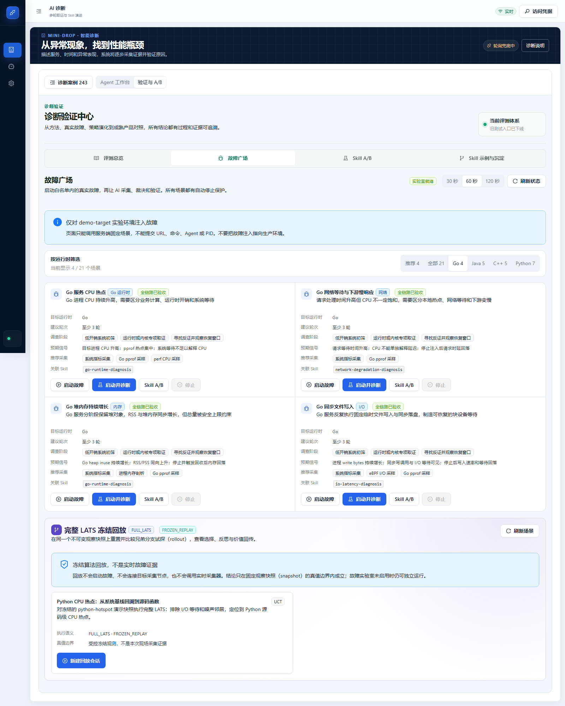](assets/learning-guide/20260909-acceptance/go.png)

图中右上角 30/60/120 秒是故障持续时间，刷新状态只查询实验室状态；“推荐/全部/Go/Java/C++/Python”只筛选卡片。向下滚动每张卡会看到“启动故障”“启动并诊断”“Skill A/B”“停止”。现场优先点“启动并诊断”，系统会创建新故障实例和新 Diagnosis；只点“启动故障”时，需要再去任务面板手工采集。演示完成要确认卡片恢复为“实验室就绪”。

| 运行时 | CPU | 内存 | I/O | 锁 | 网络/依赖 | 其他 |
|---|---:|---:|---:|---:|---:|---|
| Python/基础 | 2 | 1 | 1 | 0 | 0 | 噪声邻居、负载饱和、队列堆积 |
| Go | 1 | 1 | 1 | 0 | 1 | — |
| Java | 0 | 1（堆外） | 1 | 1 | 1 | GC 压力 |
| C++ | 1 | 1 | 1 | 1 | 1 | — |

完整名称、取证建议和面试脚本见 [`INTERVIEW_DEMO_GUIDE.md`](INTERVIEW_DEMO_GUIDE.md)。

难度来自“相似症状需要不同证据”，而不是把第一轮答案藏起来。例如延迟升高可能来自 CPU 饱和、锁等待、同步 I/O 或下游变慢；RSS 上升可能来自堆对象、堆外内存、匿名映射或页缓存。服务端要求故障广场诊断至少经过 3 个有报告轮次，防止 Agent 看到场景名就一轮结束。

## 10. Skill：复用路线，不复用答案

### 10.1 Skill 是什么

Skill 保存经过验证的调查路线，例如：

```text
触发词/适用类别
  → 候选假设先验
  → 推荐探针顺序
  → 必须满足的证据条件
  → 冲突退出与安全限制
```

仓库 `skills/catalog.json` 当前登记 13 个内置 Skill，覆盖 CPU、C++ 运行时、依赖、FD、JVM GC、Go 运行时、I/O、锁、内存、网络、Python、队列和同机竞争。

### 10.2 AUTO 与 DISABLED

- `AUTO`：检索已发布 Skill，命中后调整 Prior 和探针顺序；
- `DISABLED`：完全绕过 Skill 检索，使用基线 Planner；
- 两组都要为当前 Diagnosis 重新创建 Tool Call、Task、Artifact 和 Evidence；
- DISABLED 组不能事后补写一个 Skill activation。

### 10.3 Skill 到底怎么检索

不是 Elasticsearch，也不是关键词 `contains`，当前也没有向量数据库。因为只有 13 个 Skill，服务端直接在 Python 进程内完成：

```text
结构门禁（环境/运行时/能力）
  → BM25（中英文 token + 中文二元词）
  → 512 维哈希 n-gram/领域概念特征相似度
  → 类别 Prior 与歧义拒绝
  → 命中后读取完整 SKILL.md
```

本地“特征向量”不是神经 embedding：它由可重复的 token、ASCII 3/4-gram 和有限领域同义概念哈希得到，不需要训练和外部服务。类别只加权，不再硬过滤；例如初始误判为 I/O，但问题明确写了 Python GIL，Python Skill 仍可在强信号和运行时门禁下纠偏。最高分不够或两个候选太接近时会弃权，让基线 Planner 继续。

这就是渐进式披露：先读所有 Skill 的目录卡片，确定命中后才读那一份完整正文。完整正文以后每个重规划轮都会保留，直到 Skill 被切换、偏离或耗尽。

### 10.4 A/B 页面上的指标

[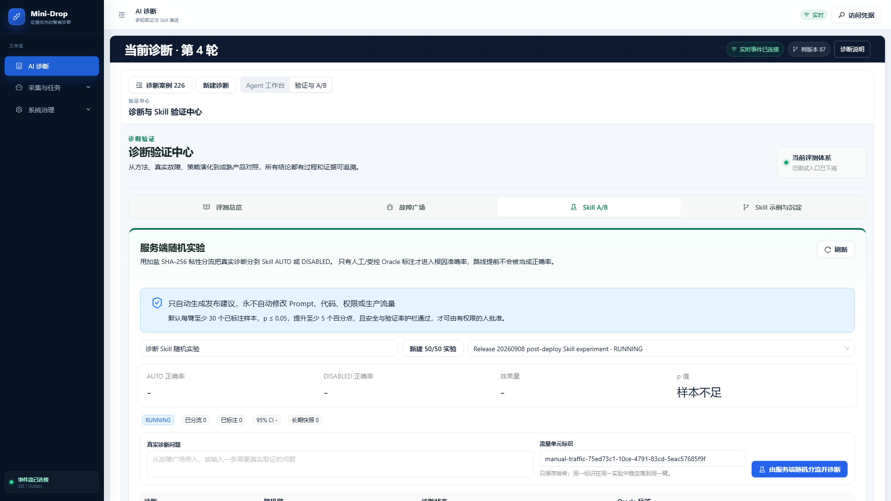](assets/learning-guide/20260909/07-skill-ab.png)

图中上半部分是已经生成的 540/500 机器报告：68.4% 是启用 Skill 的 500 组代理 Top-1，41.2% 是同题关闭 Skill 基线，差值为 27.2 个百分点；改善 136、退化 0。“查看机器报告”打开原始 JSON。下方“两组共用问题”输入框和“启动真实对比”用于页面现场 A/B；它与上面的离线大样本评测是两种证据，不要混讲。

| 指标 | 说明 |
|---|---|
| Skill 激活 | 当前会话真实 activation 条数 |
| 工具调用 | Tool Call 条数，不等同成功数 |
| 证据总数 | 当前会话全部 Evidence |
| 门禁接受 | 支持、反证、中性、受限四类合计 |
| 诊断轮次 | 服务端树统计的轮次 |
| 首份门禁结果 / 首条支持证据 / 总探索耗时 | 分别是任意材料首次被评估、首次有 SUPPORT、整条诊断所用时间 |
| 真实路线 | 按实际 Tool Call 去重后的顺序 |
| 报告 | 按 VERIFIED、PARTIAL、INSUFFICIENT 优先级选择的最佳 Report；不盲取最后一份 |

### 10.5 历史恢复

页面把最近 12 组 AUTO/DISABLED Diagnosis ID 保存在浏览器 `localStorage`，键为 `mini-drop:skill-ab-history:v1`。返回验证中心或刷新后，用 ID 从服务端重新读取所有指标。

它不是账号级实验档案：换浏览器、无痕窗口或清站点数据会丢入口索引，但不会删除服务端 Diagnosis。

### 10.6 双会话路线对照与服务端随机实验的区别

公共 API 允许两组独立自动发现目标和时间窗。Scope 不一致时页面明确提示“当前不是严格同范围实验”。即使 Scope 相同，单次顺序运行也不能证明普遍提速或准确率提升。严格 A/B 还需要故障重置、相同负载、随机化、足够样本、统计检验和异常样本剔除。

### 10.7 服务端随机实验：每一个字段和按钮

本轮已实际验收六条随机流量：AUTO 2 条、DISABLED 4 条，均重新采集并标注，评估返回 NOT_READY；未达到每臂至少 30 个样本，不做发布批准。刷新/服务滚动更新后，六次分配、六个标签与统计快照仍可读取。

[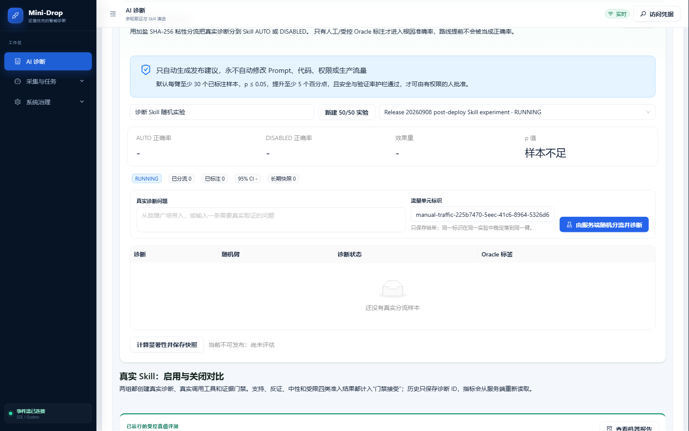](assets/learning-guide/20260909/21-random-experiment.png)

这里与“双会话真实对比”是两种实验形式。双会话按钮为一次问题创建两条路线，便于直观检查；服务端随机实验为每次流量单元稳定分配一个实验臂，累计多次诊断和人工标签后做统计。两者都不能把演示样本外推为生产准确率。

| 控件/指标 | 怎么操作与解释 | 生效范围 |
|---|---|---|
| 随机实验名称 | 为实验起名，建议写清故障域与策略版本 | 创建时保存到服务端 |
| 新建 50/50 实验 | 建立实验定义；不立即造故障或获得样本 | 创建 Experiment |
| 选择已持久化实验 | 切换已有实验，查看其状态与样本 | 读取 |
| 真实诊断问题 | 描述本次需要真实取证的问题，不能写预先猜定的答案 | 新诊断输入 |
| 流量单元标识 | 同一实验中同一标识稳定分到同一臂；只保存哈希 | 分流单位，不能把反复提交同一单位当独立样本 |
| 由服务端随机分流并诊断 | 先确定 AUTO/DISABLED，再创建对应诊断 | 会启动真实调查 |
| AUTO / DISABLED 正确率 | 各臂被标注样本中的根因正确比例 | 无标签显示缺失，不能补成 0% |
| 效果量 | 两臂正确率差，单位 pp | 不等于采样速度提升 |
| p 值 / 95% CI | 统计检验量和比例差区间 | 不能替代随机化、样本独立性和领域合理性 |
| 已分流 / 已标注 | 创建分流记录的数量 / 已有人或受控 Oracle 判定的数量 | 两者一般不同 |
| Oracle 标签 → 正确 / 错误 | 人核对事实后提供标签，写入来源与审计 | 会影响后续准确率，不能按期待收益随意点 |
| 诊断 ID | 打开对应真实调查，检查证据和报告 | 读取 |
| 计算显著性并保存快照 | 汇总当前已标注样本，保存一份追加式统计快照 | 不自动产生新标签 |
| 当前不可发布 | 显示样本量、效果或安全护栏未满足的原因 | 原因应逐项处理 |
| 人工批准发布建议 | 仅在建议满足门禁、状态允许且人员有权限时出现 | 保存批准；不是任意改代码或生产流量的按钮 |

默认门禁由页面和服务端共同解释：每臂至少 30 个已标注样本、p≤0.05、提升至少 5 pp，并满足安全与验证率护栏。它们是当前实验合同，不是适用于所有科学实验的通用规则。源码入口：`SkillExperimentPanel.jsx`、`drop_insight/skill_experiments.py`；持久表为 `diagnostic_experiments`、`diagnostic_experiment_assignments`、`diagnostic_experiment_observations`、`diagnostic_experiment_metrics`。

## 11. Skill 怎样沉淀与“自进化”

[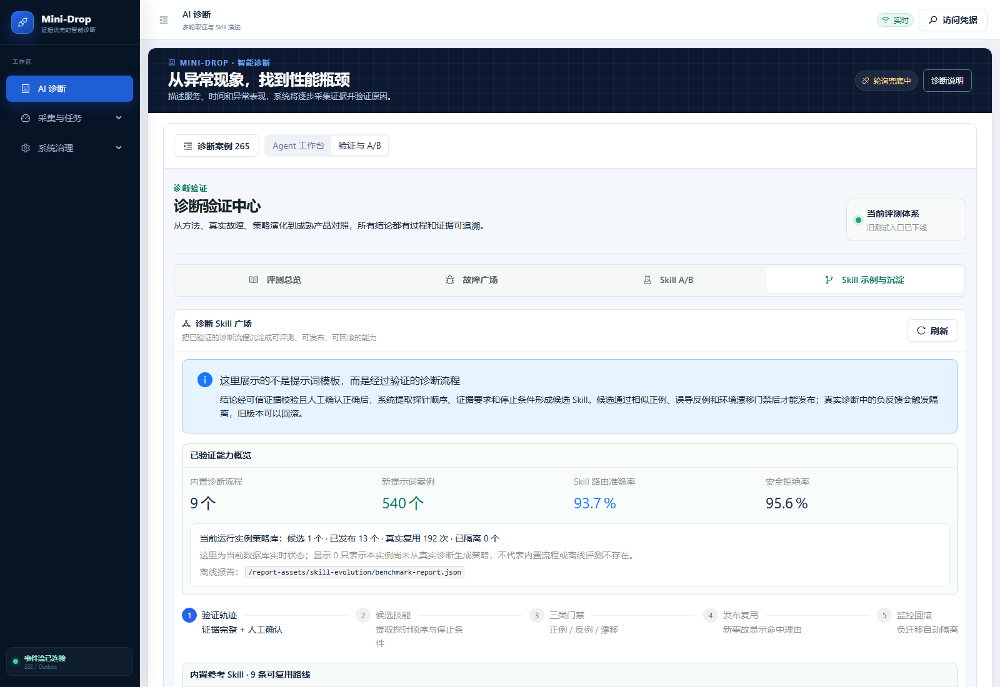](assets/learning-guide/20260910-skill-inline/desktop.png)

图中顶部四个数字来自评测报告和数据库实例：内置路线数量、新提示词 Case、路线准确率、安全拒绝率。中间五步是 Skill 生命周期。下方“内置参考 Skill”只用于展示合同结构；继续向下滚动才是数据库中的候选、已发布、已隔离实例，以及“运行三类门禁、发布技能、隔离、回滚上一版”等真实操作。发布和回滚都是人工动作。

当前自进化是受控工程流程，不是模型在线改代码：

```text
成功报告与用户反馈
  → 生成候选 Skill
  → 静态校验和冲突检测
  → 新测试集离线评测
  → 人工审批发布
  → 小范围激活
  → 负反馈累计
  → 隔离或回滚
```

页面 **验证与 A/B → Skill 示例与沉淀**展示内置参考路线与运行实例。示例卡用于教学；数据库 activation、版本、评测和报告才是运行事实。

当前已有服务端随机实验平台，可保存分流、标签和指标并计算发布建议；自动修改 Prompt、代码、权限并直接切换生产流量仍不允许。2026-09-09 只读核对时有 1 个实验、0 个分流和标注样本，因此不能声称已用真实随机流量证明收益。

## 12. Agentic RAG、上下文和记忆

### 12.1 Agentic RAG

当前 Knowledge RAG 对仓库 `knowledge/` 做确定性混合词法检索。每轮保存：

- 查询；
- 命中文档；
- 源文件 hash；
- 匹配词；
- 证据要求；
- 路线限制。

它帮助 Planner 知道“该查什么”，不会自行访问互联网，也不是向量数据库。检索结果固定标记 `is_evidence=false`。

### 12.2 四类需要区分的记忆

| 类型 | 保存内容 | 权威存储 | 能否作证据 |
|---|---|---|---|
| 会话短期记忆 | 模型消息、最近几轮上下文 | LangGraph Checkpoint | 不能 |
| 领域事实记忆 | Scope、Hypothesis、Tool Call、Evidence、Report、事件 | PostgreSQL | Evidence 本身可以，其余按角色使用 |
| 路线记忆 | Skill、成功探针顺序、可靠性反馈 | Skill 数据与数据库 | 不能直接证明本次根因 |
| 显式用户偏好 | 语言、解释详略、时区、低风险优先 | 按 principal 隔离的 PostgreSQL 表 | 不能；也不能授予工具权限 |

### 12.3 为什么重启后不应丢上下文

领域事实、树和报告以 PostgreSQL 为权威；刷新页面会重新读取。LangGraph Checkpoint 请求 PostgreSQL 时，页面会同时显示 requested backend 与 actual backend。如果初始化失败并降级为内存，状态必须显示 `DEGRADED`；此时短期模型消息可能在 Worker 重启后丢失，但已经持久化的领域事件和 Evidence 仍在。

### 12.4 跨诊断偏好：页面控件与保存行为

[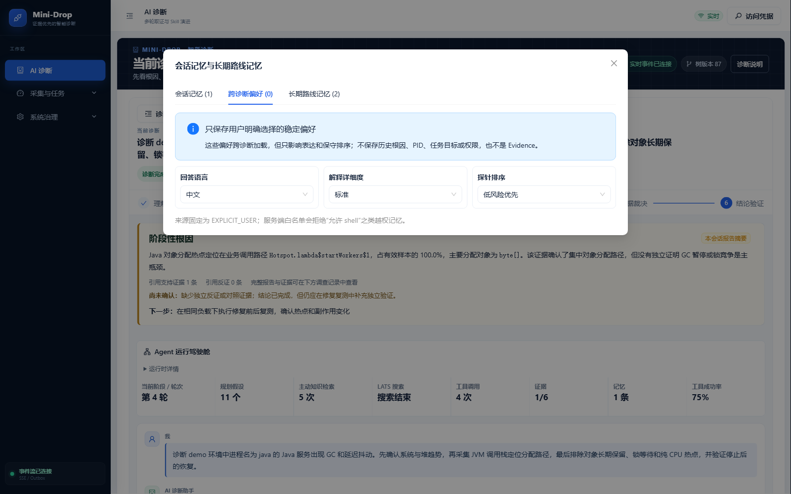](assets/learning-guide/20260909/16-operator-memory.png)

在驾驶舱点 **记忆 → 跨诊断偏好**。当前前端实际提供三个下拉框，**选择变化就提交保存**，没有另外一个“保存”按钮：

| 字段 | 选项 | 会改变什么 |
|---|---|---|
| 回答语言 | 中文 / English | 可选的表达语言偏好；仍受诊断中文输出合同约束 |
| 解释详细度 | 简短 / 标准 / 详细 | 解释篇幅偏好，不改变 Evidence 数量 |
| 探针排序 | 低风险优先 / 使用默认排序 | 提示性的保守排序，不解除风险门禁 |

服务端白名单还定义了时区字段，但当前这块 UI 没有时区输入框，也没有偏好删除按钮；不要把服务端 API 能力写成页面上存在的按钮。需要删除时应使用相应授权 API，具体路径查 `client.js` 与 OpenAPI。本次只读截图没有更改偏好；截至 2026-09-09 的检查，线上偏好表为 0 条，不能用默认下拉值证明已经保存成功。

LangGraph 的 Checkpoint 持久化线程状态；本项目的用户偏好由自己的 SQL 表实现，不因框架支持 Store 就自动变成框架 Store。概念对照见 [LangGraph persistence 官方文档](https://docs.langchain.com/oss/python/langgraph/persistence)，具体实现仍读 `operator_memory.py`。

## 13. Harness、Theme 与框架选择

### 13.1 为什么选择 LangChain + LangGraph

项目使用 LangChain `create_agent` 负责模型/工具循环，LangGraph 负责 thread、checkpoint 和可恢复执行；Mini-Drop 自己负责领域状态、权限、工具白名单、预算、Evidence Gate 和 LATS 搜索。

当前云端 `MINI_DROP_AI_MODEL` 为 `deepseek-chat`，通过 OpenAI 兼容接口接入；模型名、Base URL 和密钥都来自部署环境，不写死在前端或领域代码里。换模型不会改变 Task、Evidence、权限和状态机合同。模型超时、返回非法结构或不可用时，服务端会记录原因并使用中文确定性规则兜底，因此“模型在线”与“诊断系统可审计”是两层能力。

这样分工的原因：

- 不把业务真相塞进通用 Agent 内存；
- 可以替换模型或 Agent 框架，不破坏证据链；
- 工具权限和状态机由服务端控制，不靠 Prompt 约束；
- LangGraph 适合多轮和 checkpoint，LATS 则作为领域搜索层叠加。

Pi Agent、其他轻量 Agent SDK 也能做模型循环，但本项目需要成熟的 checkpoint、工具中间件和图式恢复，因此选择 LangGraph 更合适。框架不是卖点，真实的安全边界和 Evidence 合同才是。

### 13.2 Harness 是什么

Harness 是 Agent 的运行护栏：

- 注入只读上下文；
- 裁剪消息和 token；
- 校验结构化模型输出；
- 拒绝模型创造目标或工具；
- 在超时、非法 JSON、模型不可用时使用确定性兜底；
- 将 Tool Call 转交领域服务，而不是本地执行 shell；
- 记录 checkpoint、trace、模型版本与结果来源。

### 13.3 Theme 是什么

Theme 是不同诊断域的策略配置，不是前端颜色主题。CPU、内存、I/O、网络、JVM、Go、Python、C++ 可以有不同候选假设、证据门禁和探针偏好，但都必须复用同一套安全执行与证据合同。

## 14. 基础采集页面：每个输入框和按钮

进入 **采集与任务 → 任务面板**。

[](assets/learning-guide/20260909/09-task-dashboard.png)

图中最上方是新建性能采集表单；中间“最近可视化结果”用于快速回看；四张数字卡是服务状态；底部才是可搜索、排序、停止和归档的 Task 列表。它只创建采集任务，不负责直接宣判根因。

### 14.1 新建性能采集

| 控件 | 含义 |
|---|---|
| 目标 Agent | 运行采集器的节点；离线节点不可选 |
| 可信进程快照 | Agent 最近上报的进程；选择时关联新鲜 PID/启动时间信息 |
| 采集器 | 只列当前 Agent 能力允许的 TaskKind |
| 时长（秒） | 本次采样持续时间，受采集器上限约束 |
| 开始采集 | 创建 Task，并跳到新任务结果页 |

选择持续 perf 后：

| 控件 | 含义 |
|---|---|
| 窗口（秒） | 按窗口轮转原始 Profile，单窗最多 900 秒 |
| CPU 触发阈值 | 0 为立即开始；大于 0 时等待目标达到阈值 |
| 连续命中次数 | 连续达到阈值才触发，过滤瞬时尖峰 |
| 等待上限 | 等待触发的最长时间；0 表示任务期内持续等待 |
| 保留层级 | 短期、标准或延长的对象存储策略 |

### 14.2 任务面板其他区域

| 区域/按钮 | 作用 |
|---|---|
| 刷新 | 立即重新拉取任务和 Agent，不等下一次自动刷新 |
| 最近可视化结果 | 快速打开最近火焰图、I/O 图或系统指标 |
| 服务版本 | 当前 Go API 版本 |
| Agent 在线 | 在线数/总数 |
| 进行中 | 排队、运行、上传、分析中的任务数 |
| 成功率 | 已结束任务中的成功比例，不能代替诊断准确率 |
| 搜索任务名 | 本地筛选当前任务列表 |
| 排序字段/升降序 | 按时间、名称、状态、Agent、采集器或 PID 排序 |
| 查看进度/原因/火焰图/图表 | 按任务状态进入详情 |
| 停止图标 | 取消排队或运行中的 Task |
| 删除图标 | 归档已结束任务；Evidence 和审计仍保留 |
| Agent 列表 | 查看节点、主机、CPU、RSS、I/O 与在线状态 |

## 15. 任务结果页面

### 15.1 双状态

采集状态和分析状态必须分开读：

```text
采集：PENDING → RUNNING → UPLOADING → COLLECTED
分析：PENDING → ANALYZING → SUCCESS / FAILED
```

`COLLECTED`只表示材料上传完成；只有 Analysis 成功，火焰图/TopN 等结构化产物才可信。空 Profile 会产生 `NO_PERF_SAMPLES`、`NO_FOLDED_STACKS` 或 `NO_PROFILE_SAMPLES`，不渲染假火焰图。

[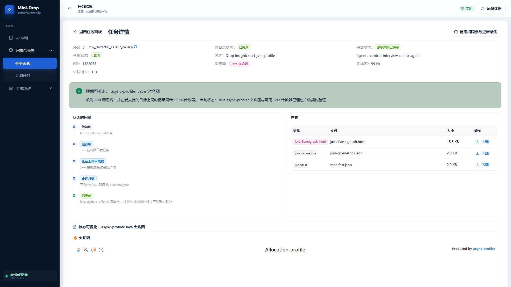](assets/learning-guide/20260909/10-task-result.png)

从上到下读：任务身份和采集参数 → 采集/分析双状态 → 状态时间线 → Artifact 下载列表 → 核心可视化。图中是 Java async-profiler 结果；不同采集器会替换成 CPU 火焰图、TopN、内存趋势、eBPF I/O 或系统多维指标。右上“使用相同参数重新采集”一定创建新 Task，不覆盖本次结果。

### 15.2 页面按钮

| 按钮 | 作用 |
|---|---|
| 返回任务面板 | 回到任务列表 |
| 使用相同参数重新采集 | 创建新 Task，不覆盖旧 Attempt/Artifact |
| 选择持续窗口 | 切换某个 Profile 窗口的分析结果 |
| 下载 | 下载对应 Artifact |
| 进入 AI 诊断 | 导航到 AI 工作台；不会把原始 Artifact 自动伪装成 Evidence |
| 重新采集有效样本 | 当 Profile 为空或样本无效时，用相同目标和参数创建新任务；不覆盖失败记录 |
| 打开完整结果 | 从 AI 工具卡的内联预览进入任务结果页 |

### 15.3 可视化怎么读

- 火焰图：横向宽度是样本占比，纵向是调用栈深度；
- TopN：热点函数排序，可与火焰图联动；
- 调用关系图：边表示 Caller → Callee，节点显示 self/inclusive samples；
- eBPF I/O：看延迟分布、调用路径和块设备等待；
- 内存分析：看 RSS/PSS、匿名内存、映射与趋势；
- 系统多维指标：CPU、内存、I/O、网络和进程维度；
- Go pprof/Java 火焰图：运行时专项产物，必须匹配目标运行时。

[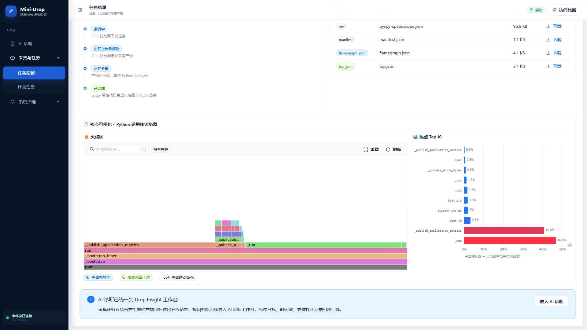](assets/learning-guide/20260909/25-python-flamegraph.png)

这是一条历史 Python Task 的实际图表：左边看栈结构，右边看 TopN。图里的 `_run`、`_publish_application_metrics` 是这次材料中的符号，不代表每次故障都会命中它们。读函数时应结合源文件、采样事件和这条 Task 的目标，而不是仅凭名字认定根因。

### 15.4 火焰图内部交互

| 控件/动作 | 作用 |
|---|---|
| 搜索函数名 | 高亮匹配栈帧，适合快速定位业务包、类或方法 |
| 点击栈帧 | 下钻并把该帧作为当前可视范围的根 |
| 右键返回上层 | 恢复到上一级栈视图 |
| 搜索高亮 | 提交函数名查找并突出匹配帧 |
| TopN 条形图 | 点击函数条形，在火焰图高亮对应符号 |
| 悬停栈帧 | 查看函数名、样本数和占比 |
| 重置 | 回到完整火焰图视图，清除下钻缩放 |
| 刷新 | 重新读取当前 Artifact；不会重新采集 |
| 选择持续窗口 | 在持续采集产生的多个窗口之间切换，不能把不同窗口数据拼成一个假火焰图 |

若页面显示 `NO_PROFILE_SAMPLES` 等原因码，应点击“重新采集有效样本”或调整目标/权限，而不是期待“刷新”生成不存在的数据。

系统指标还要注意契约版本：`sys_metrics.v1` 只含逐秒 RSS、线程和文件描述符，任务详情会显示“已恢复历史系统指标”以及完整采样表；CPU、负载、I/O 和网络明确写成“未采集”。`sys_metrics.v2` 才有汇总面板。旧页面出现空白不是“没有故障”，而是前端曾只识别 v2 `summary`；当前兼容层已修复这项数据结构错位。

## 16. Agent 详情页面

[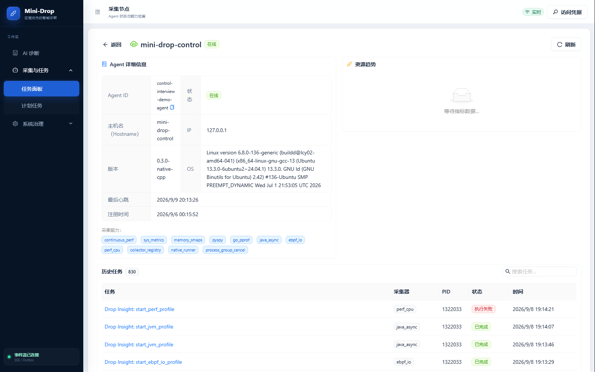](assets/learning-guide/20260909/22-agent-detail.png)

本次截图中资源趋势显示“等待指标数据”，表示该视图尚未取得可绘制序列，不表示 Agent 已离线。看左侧心跳和能力，再检查指标来源。

从任务面板点击 Agent ID：

| 区域/按钮 | 含义 |
|---|---|
| 返回 | 回到任务面板 |
| 刷新 | 拉取最新心跳、指标和历史任务 |
| Agent 详细信息 | ID、状态、主机名、IP、版本、OS、最后心跳、注册时间 |
| 采集能力 | 当前 Agent 声明的 Collector capability |
| 实时开销 | Agent 自身 CPU、RSS、读写速率和子进程数 |
| 资源趋势 | 近期采样点形成的趋势图，不是长期监控数据库 |
| 搜索任务 | 过滤该 Agent 的历史任务 |

Agent 显示在线只证明心跳可达，不证明每种 Collector 权限都可用。真正能力还要看 capability 和某次 Task 的 Attempt 结果。

## 17. 计划任务页面

[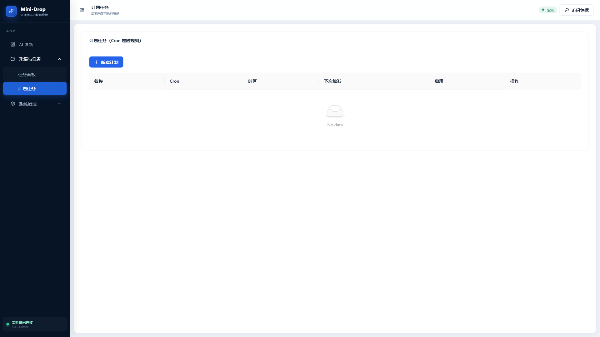](assets/learning-guide/20260909/11-schedules.png)

列表为空时不是功能损坏，只表示还没有保存 Cron 计划。点击左上“新建计划”打开表单：

[](assets/learning-guide/20260909/11b-schedule-form.png)

右侧抽屉分成“调度规则”和“任务模板”。调度规则决定什么时候运行，任务模板决定每次创建什么 Task。创建前要重点核对 Agent ID、PID、采集器和时长；长期计划绑定裸 PID 有复用风险，生产设计应改为服务身份加新鲜进程绑定。

| 控件 | 含义 |
|---|---|
| 新建计划 | 打开计划创建抽屉 |
| 计划名称 | 便于识别的名称 |
| Cron 表达式 | 5 字段分钟级规则，例如 `0 3 * * *` |
| 时区 | 解释 Cron 的时区，默认 `Asia/Shanghai` |
| 启用 | 创建后是否自动调度 |
| 任务名称 | 每次触发创建的 Task 名称 |
| Agent ID | 固定采集节点 |
| 目标 PID | 固定目标；生产中更推荐绑定新鲜进程身份而非长期裸 PID |
| 采集器 | 每次触发使用的 TaskKind |
| 采样率 | Hz，越高开销越大 |
| 时长 | 每次采集秒数 |
| 触发 | 立即执行一次，不等 Cron |
| 记录 | 查看历史触发时间、Task ID、状态和错误 |
| 删除 | 删除调度配置，不删除已经产生的任务证据 |

## 18. 审计日志页面

[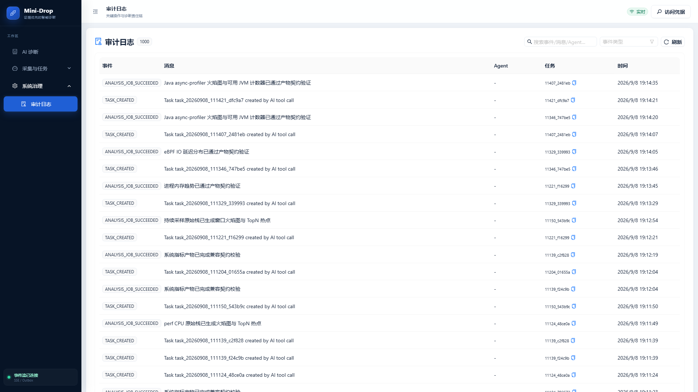](assets/learning-guide/20260909/12-audit-log.png)

右上搜索框可以按事件、消息或 Agent 过滤，事件类型下拉框用于只看稳定事件码，刷新按钮重新加载。每行的 Task ID 可以复制并与任务结果、Tool Call 和 Evidence 对照。截图里的英文事件码是跨服务稳定协议，旁边的人类消息优先使用中文。

| 控件 | 含义 |
|---|---|
| 搜索事件/消息/Agent | 按文本过滤审计记录 |
| 事件类型 | 只看某类稳定事件码 |
| 刷新 | 重新加载最新审计 |

审计日志回答“谁在什么时候做了什么”，诊断事件回答“这次调查如何演进”，Evidence 回答“什么事实支持或反驳结论”。三者不能混为一张日志表。

## 19. 端到端数据链

### 19.1 基础采集链

```text
React 创建 Task
  → Go API 鉴权和校验
  → C++ Control 入库、Outbox 通知
  → Agent 领取带租约的 Attempt
  → Collector 采集
  → Artifact 通过短时授权上传 MinIO
  → Agent 回报 manifest/hash
  → Analyzer 消费 AnalysisJob
  → 火焰图/TopN/调用图等结构化产物
  → Web 通过 API/SSE 展示
```

### 19.2 AI 诊断链

```text
用户问题
  → 在线 Agent/进程发现
  → opaque binding 签发
  → Scope Agent 选择安全目标
  → Knowledge RAG + Skill 路线检索
  → LATS 扩展/评估/选择假设
  → Tool Policy + Budget + Approval
  → 创建真实 Task
  → Artifact 分析
  → Evidence Gate
  → Report + Reflection + Backpropagation
  → 下一轮、跨域转向或结束
```

### 19.3 一次诊断会经过哪些 API

浏览器只访问 Go API，Go 再把 AI 领域调用转给内部 Python 服务。最常用的公开合同如下：

| API | 页面动作 | 结果 |
|---|---|---|
| `POST /api/v2/diagnoses` | 新建诊断或创建 A/B 两臂 | 新的 Diagnosis ID |
| `GET /api/v2/diagnoses/{id}/target-candidates` | 重新发现目标 | 服务端签发的安全候选 binding |
| `POST /api/v2/diagnoses/{id}/clarify` | 确认范围 | 锁定目标和时间窗 |
| `POST /api/v2/diagnoses/{id}/planner/run` | 生成第一轮计划 | 假设、路线和 Tool Call |
| `POST /api/v2/diagnoses/{id}/orchestrator/advance` | 继续推进或任务完成后处理 | Evidence、Report、反思和下一轮 |
| `GET /api/v2/diagnoses/{id}/exploration-tree` | 打开探索树 | 服务端真实树投影和 LATS 统计 |
| `GET /api/v2/diagnoses/{id}/events/stream?after=N` | 页面实时更新 | 可断点续传的 SSE 事件 |
| `POST /api/v2/diagnoses/{id}/tool-calls/{call_id}/decision` | 人工审批 | 批准或拒绝待执行工具 |
| `GET /api/v2/diagnoses/{id}/diagnostic-skill-activations` | 查看 Skill 路线 | 本会话激活、沿用、偏离和退出记录 |

完整路径和请求字段以 `docs/contracts/drop-insight-api.md` 与 `docs/contracts/openapi.v1.json` 为准。前端按钮只是这些合同的可视化入口，数据库事件才是刷新、重连和重启后的事实源。

### 19.4 为什么要有 Task、Attempt、Artifact 三层

- Task：用户想完成的一次采集；
- Attempt：某个 Agent 的一次真实执行，重试时新增；
- Artifact：某次 Attempt 产出的文件或结构化结果。

如果只保存一个 Task 状态，重试会覆盖第一次失败的原因，也无法证明报告引用了哪个文件。

### 19.5 从一个“开始采集”按钮追到最终火焰图

把这条链当作第一次源码阅读练习。先在已有成功任务里观察，理解后才在受控实验室创建新任务。不要直接对生产进程试采样。

| 步骤 | 真实执行者 | 关键输入与输出 | 源码入口与要找的内容 |
|---|---|---|---|
| 1. 选择目标 | React 表单 | Agent、可信进程、Collector、时长 | `TaskCreatePanel.jsx` 的 `submit`；看哪些字段来自快照，哪些由用户填写 |
| 2. 发送请求 | Web API client | 经过前端整理的 JSON → HTTP 响应 | `web/src/api/client.js`；浏览器 Network 对照实际路径和 body |
| 3. 鉴权与建模 | Go HTTP handler | principal、任务参数 → Task/Attempt 与调度请求 | `apiserver/internal/httpapi/server.go` 的 `createTask`；看校验、repository、Control 调用和出错分支 |
| 4. 调度与领取 | C++ Control/Agent | TaskDesc → 当前被授予执行权的尝试 | `native/control/src/main.cpp`、`native/agent/src/main.cpp`；看租约、心跳、领取与回报 |
| 5. 执行采集 | 对应 Collector | 被批准的 PID/参数 → 原始 Profile | `perf_collector.cpp`、`language_collectors.cpp` 等；看实际 argv、超时和清理 |
| 6. 上传并回报 | Agent uploader/outbox | 原始文件、manifest → Artifact 元数据与上传完成事件 | `artifact_uploader.cpp`、`result_outbox.cpp`；区分上传成功和状态回报成功 |
| 7. 异步分析 | Python Analyzer Worker | Artifact → 统一图表结构、分析状态 | `server/app/analysis_jobs.py`、`analyzer/mini_drop_analyzer/`；找注册表、校验和具体格式解析 |
| 8. 读取展示 | Go API 与 React | Task、Artifact、状态 → 火焰图/TopN/指标 | `TaskResult.jsx`、`FlamegraphViewer.jsx`、`TopNChart.jsx`；检查空样本分支 |

跟踪时在笔记里记录四列：`task_id → attempt_id → artifact_id → analysis_status`。它们把服务之间的异步交接串起来。日志时间只帮助定位，不能替代身份关联。

例如一次 Java 任务已经 `COLLECTED`，但页面仍没有图：先看 `analysis_status`。若分析失败，检查该 Artifact 是否是受支持的 async-profiler 产物、manifest 是否完整、样本是否为空；若分析成功，才检查前端下载、iframe 或格式兼容。直接重启全部服务会丢失排查现场，也不能修复一个无效 Profile。

### 19.6 AI 诊断在哪些地方增加了决策

AI 诊断重用上一节的采集链，在它外面增加调查状态机：

1. **接收问题**：`create_diagnosis` 建立会话，保存查询和预算。用户说“慢”只是任务输入，不是根因。
2. **确定范围**：`discover_target_candidates` / `resolve_diagnosis_scope_autonomously` 结合显式进程名、服务环境与新鲜快照，确定本次目标。歧义留给澄清，不凭空猜 PID。
3. **形成候选**：Planner 结合当前事实、Skill 和 RAG 提出可证伪假设，并保留生成来源。模型输出不合法时记录兜底来源。
4. **选择下一分支**：LATS 用访问量、累计回报、探索奖励和预算选候选；业务 Policy 再检查推荐工具是否仍能执行。评分高不代表跳过权限。
5. **执行 Tool Call**：通过审批或低风险自动门禁后，调用基础采集链产生新的 Task/Attempt/Artifact。
6. **材料变成证据**：检查身份、时间、完整性、样本质量和假设关联。有效材料可能是 SUPPORT、COUNTER、NEUTRAL 或受限；不能把采样成功强行解释为支持。
7. **反思并推进**：写 Observation、Reflection、奖励回传与转向事件。某分支失败不自动结束整个 Diagnosis；预算和可用域允许时继续。
8. **形成报告**：`generate_report` 与主张验证逻辑引用现有 Evidence，标明验证状态、限制和下一步。没有独立对照就保留阶段性结论。

这条链主要读 `drop_insight/service.py`。第一次不必把整份大文件逐行读完：从函数名进入，画出“读取哪些对象 → 检查哪些条件 → 写哪些对象/事件 → 调谁”的四栏笔记，再顺着调用进入小模块。

### 19.7 失败链与责任边界

| 观察到的现象 | 首先检查 | 为什么不能直接归因给模型 |
|---|---|---|
| 创建请求超时 | 请求是否已经落库；客户端重试键与服务端幂等 | 响应丢失不等于请求没执行 |
| 目标发现为空 | 服务/进程过滤、新鲜快照、Agent 在线与权限 | 根本没有安全目标时不能采样 |
| Task 长时间排队 | Agent 领取、并发占用、租约、旧诊断墙钟预算 | 故障窗口可能在等待中结束 |
| Collector 失败 | capability、内核权限、进程退出、超时、样本数 | 工具环境失败不是根因反证 |
| 上传成功但状态未更新 | Agent 结果 Outbox、回报重试、Attempt 是否仍有权 | 文件与控制消息是两条传输路径 |
| 已有文件却分析失败 | 格式、校验、manifest、分析器错误码 | 随便生成空图会掩盖真实失败 |
| 有图却证据不足 | 本次窗口、目标绑定、假设与工具是否匹配 | 图中有样本不代表支持当前命题 |
| 浏览器断线 | 全局/会话 SSE、游标、轮询兜底、最新读取时间 | 页面断线不自动终止后台诊断 |
| 进程重启后收到旧结果 | Attempt 身份、租约代次、CAS 与终态门禁 | 旧执行者不能覆盖新执行者的权威结果 |

### 19.8 演示时按这条顺序讲，而不是把按钮全部点一遍

| 用时 | 页面动作 | 讲述重点 | 交给面试官看的证据 |
|---|---|---|---|
| 0～2 分钟 | 新首页 → 诊断说明 | 两个 Agent、基础链与 AI 链 | 职责边界与问题输入 |
| 2～5 分钟 | 故障广场 → 受控场景 → 启动并诊断 | 创建的是这次的新会话；目标由服务端发现 | 新 Diagnosis ID、状态、工具节点 |
| 5～8 分钟 | 工作台 → 规划/RAG/工具 | 模型决定调查方向，系统约束执行 | 假设、知识 hash、Task 与状态 |
| 8～11 分钟 | 探索树 → 全屏 → 评分/轮次路径 | 真实取证、反证、回传与停止 | 有来源的父子节点和预算 |
| 11～14 分钟 | 工具任务 → Artifact → 图表 → 报告 | 原始材料如何变成支持结论的 Evidence | Task/Artifact/Evidence/Report 的关联 |
| 14～16 分钟 | Skill A/B 或随机实验 | 路线差异和统计实验的区别 | 已有结果与尚缺样本都如实展示 |
| 收尾 | 故障广场 → 停止并刷新状态 | 演示应清理受控故障 | 实验室已恢复空闲 |

调查等待时讲解基础链和已经完成的历史案例；不要反复提交同一故障或缩短故障窗口后等待很久。页面提供的 30/60/120 秒是故障持续时间；需要更长 Campaign 时由受控脚本在服务端上限内设置预算。本次教材截图主要使用已有记录，**不代表本次编写过程又执行了上述新故障演示**。

## 20. 仓库目录导览

| 路径 | 作用 | 建议先看 |
|---|---|---|
| `web/` | React 页面、组件、样式和前端测试 | `src/router.jsx`、`src/pages/AIDiagnosis.jsx` |
| `apiserver/` | 唯一公开的 Go HTTP/SSE API | `cmd/`、`internal/httpapi/` |
| `server/` | Python Diagnosis Worker、LATS、Skill、Evidence 编排 | `app/drop_insight/service.py` |
| `analyzer/` | Profile、指标和调用图分析 | 各 TaskKind analyzer 与 worker 入口 |
| `native/` | C++ Control、Agent、Collector 与 gperftools bridge | `control/`、`agent/`、`gperftools_bridge/` |
| `proto/` | Control 与 Agent 的协议定义和生成代码 | `.proto` 源文件优先 |
| `demo/` | Python/Go/Java/C++ 受控故障目标 | 四运行时 fault lab |
| `skills/` | 内置 Skill 目录和 catalog | `catalog.json`、各 `SKILL.md` |
| `knowledge/` | Agentic RAG 的本地知识源 | `catalog.json` 与 Markdown 文档 |
| `benchmarks/` | 新评测输入、私有答案和结果合同 | `diagnosis-v2/`、`root-cause-v1/` |
| `tests/` | Python 单元、集成、合同与验收测试 | 按功能名搜索 |
| `scripts/` | 生成器、Benchmark、云验收和兼容检查 | `verify_interview_demo.py` 等 |
| `contracts/` | 共享数据合同 | JSON Schema/协议说明 |
| `docs/contracts/` | 对外 OpenAPI 和事件合同 | `openapi.v1.json` |
| `deploy/` | 环境模板、证书、Nginx、systemd 和发布配置 | `env/`、`nginx/`、`systemd/` |
| `web/src/theme.js` 与组件 CSS | 当前页面设计实现 | 颜色、间距与响应式布局 |
| `reports/` | 已运行验收/评测报告 | 只相信实际生成且有 hash 的报告 |
| `artifacts/` | 本地开发产物 | 不作为生产对象存储替代品 |
| `.github/` | CI 工作流 | 查看自动门禁 |

根目录文件：

| 文件 | 作用 |
|---|---|
| `AGENTS.md` | 跨会话工作规则和持久上下文入口 |
| `README.md` | 项目入口 |
| `pyproject.toml` | Python 包、依赖和测试配置 |
| `Makefile` | 常用开发命令 |
| `docker-compose.control.yml` | 云端 Control 全栈和 interview-demo profile |
| `docker-compose.worker.yml` | Worker 容器部署 |
| `docker-compose.yml` | 本地开发组合 |
| `.env.example` | 非密钥配置模板；真实 `.env` 不应提交/展示 |
| `alembic.ini` | PostgreSQL schema migration 配置 |

仓库文件很多，不建议按目录顺序从头读。最有效的方法是沿一条用户链反查：页面按钮 → API client → Go route → Python service → 数据模型/事件 → 测试。

## 21. 核心文件阅读路线

### 21.1 前端

| 文件 | 读什么 |
|---|---|
| `web/src/router.jsx` | URL 到页面组件的映射 |
| `web/src/components/AppLayout.jsx` | 导航、访问凭据、实时状态 |
| `web/src/pages/AIDiagnosis.jsx` | 单主视图、多轮输入、人工干预和资源加载 |
| `web/src/components/ChatThread.jsx` | 持久领域事件怎样投影为多轮对话 |
| `web/src/components/AgentCockpit.jsx` | 运行时、RAG、工具、记忆、评测和 LATS 指标 |
| `web/src/components/ActualExplorationTree.jsx` | 树拓扑、评分、缩放、全屏、语义去重 |
| `web/src/components/FaultPlazaPanel.jsx` | 受控故障卡和按钮状态 |
| `web/src/components/SkillABPanel.jsx` | 两臂创建、指标、Scope 对比和历史恢复 |
| `web/src/pages/Dashboard.jsx` | Task/Agent 总览 |
| `web/src/components/TaskCreatePanel.jsx` | 基础采集输入合同 |
| `web/src/pages/TaskResult.jsx` | 双状态、Artifact 和可视化 |
| `web/src/utils/diagnosisDisplay.js` | 内部状态/工具/门禁到中文的映射 |

### 21.2 AI 与领域服务

| 文件 | 读什么 |
|---|---|
| `server/app/drop_insight/service.py` | Diagnosis 状态机、范围、规划、工具、Evidence、报告、终止与人工干预 |
| `server/app/drop_insight/diagnosis_agent.py` | LangChain create_agent、LangGraph checkpoint、模型输出规范化 |
| `server/app/drop_insight/adaptive_planner.py` | 模型 Planner 与确定性兜底 |
| `server/app/drop_insight/lats.py` | UCT/PUCT、扩展、选择、回传、实时/冻结语义和预算 |
| `server/app/drop_insight/exploration_tree.py` | 持久记录如何投影成树 |
| `server/app/drop_insight/artifact_evidence.py` | Artifact 转 Evidence |
| `server/app/drop_insight/claim_verifier.py` | 报告主张与证据门禁 |
| `server/app/drop_insight/skill_evolution.py` | Skill 检索、激活、候选、反馈和可靠性 |
| `server/app/drop_insight/fault_plaza.py` | 21 个白名单故障和安全边界 |
| `server/app/drop_insight/root_cause_benchmark.py` | 540 条受控根因与 500 组同题 A/B 的评分合同 |
| `scripts/generate_root_cause_benchmark.py` | 从 21 个故障合同生成公开 Case 与私有真值 |
| `scripts/run_root_cause_benchmark.py` | 运行评测并生成页面 JSON 与 Markdown 报告 |
| `server/app/drop_insight/frozen_replay_showcase.py` | FULL_LATS 冻结回放 |

### 21.3 采集与分析

- Go API：先从 `apiserver` 的路由注册找 Task、Diagnosis、SSE 接口；
- C++ Control：看任务租约、心跳、Attempt、Outbox 和上传授权；
- C++ Agent：看进程快照、能力上报、TaskKind 分发和 Collector 启动；
- Analyzer：看 perf/py-spy/pprof/async-profiler 原始数据怎样变成统一火焰图、TopN 和调用图；
- Demo：看每种故障怎样被限制到固定端点、内存/文件/延迟上限和自动停止。

### 21.4 用五个小练习真正读进去

| 练习 | 阅读/操作 | 应交出的成果 | 不应做什么 |
|---|---|---|---|
| 找到一个按钮的后端 | 在 `client.js` 找请求，再在 Go 路由和 Python 方法中反查 | 一张带文件名的调用图 | 不按猜测修改接口路径 |
| 解释一条失败 Task | 打开任务双状态、Attempt、Artifact 与审计 | 一段“失败在哪一层”的证据说明 | 不删失败记录、不能只写“模型不行” |
| 还原一次四轮调查 | 按事件序列列出每轮假设、工具、证据和转向 | 四行对照表，标出支持/反证与停止原因 | 不用树深度硬凑轮次 |
| 增加一条知识说明 | 在本地分支改一条 `knowledge/` 文档，检查 catalog/检索测试 | 能解释 hash 变化与非 Evidence 边界 | 不将知识条目当作新的机器证据 |
| 设计一个受控测试 | 从历史失败复盘提炼输入、预期事件和不变量 | 能阻止同类回归的测试说明 | 不为测试通过降低 Evidence 阈值 |

读一个文件时回答六个问题：谁调用它、输入是什么、输出是什么、读写哪些状态、失败怎么传播、由哪个测试保护。第 34 节的“源码定位”只列本文件真实声明的部分符号；要判断调用关系还需全局查引用，不把符号表当成架构图。

## 22. 数据库与对象存储

PostgreSQL 保存控制面事实：Agent、Task、Attempt、Diagnosis、Hypothesis、Tool Call、Evidence、Report、事件、审计、Skill activation 和 checkpoint 状态。MinIO 保存体积较大的原始/派生 Artifact。

为什么不把火焰图 JSON 全塞 PostgreSQL：

- Profile 和 SVG/JSON 可能很大；
- 对象存储适合不可变文件、hash 和生命周期管理；
- 数据库只保存索引、状态、来源和引用，更容易事务化；
- Report 引用 Artifact/Evidence ID，能追到原文件。

云服务器仍然可以使用 Docker。云主机解决“机器在哪里”，Docker Compose 解决“依赖怎样一致启动、升级和回滚”。不能因为上云就删除 Compose、PostgreSQL 卷或 MinIO 数据卷。

## 23. 可靠性设计

### 23.1 幂等

浏览器重试、SSE 重连和 Worker 重启都可能重复请求。服务端使用 idempotency key、effect key 和唯一约束，避免重复建 Task、节点或事件。相同时间窗的等价重试允许，真正移动已确认窗口会被拒绝。

### 23.2 租约与 Attempt

Agent 领取任务后获得租约。心跳丢失或超时后，服务端可以让新 Attempt 接管，而不是把同一执行永久卡在 RUNNING。

### 23.3 Outbox

状态写数据库和发布事件不能是两个无关操作。Outbox 先在同一事务保存待发送事件，再异步发送，避免“数据库成功但 SSE/消息丢失”。

### 23.4 CAS 与树版本

人工干预带 `expected_version`。若页面拿的是旧树版本，服务端拒绝覆盖，避免两个人同时干预时后写覆盖先写。

### 23.5 终态一致性

分支报告“证据不足”不等于整个 Diagnosis 终止。服务端只在证据、最少轮次、预算和搜索停止条件同时满足时原子写入终态，并保留最佳可信报告和限制，避免页面先闪现完成又重新打开。

## 24. 安全设计

### 24.1 目标身份不是裸 PID

Linux PID 会复用。安全 binding 至少关联 Agent、PID、进程启动时间、命名空间、服务提示和过期时间。模型只看到不透明 binding ID，不能编造 PID。

### 24.2 工具白名单

模型只能从服务端声明的 allowed tools 中选择。每个工具还受：

- Agent capability；
- 目标运行时；
- 时间/次数/文件大小预算；
- 人工审批策略；
- perf、ptrace、eBPF 等内核权限；
- Artifact 上传授权与 hash 校验。

### 24.3 mTLS 与短时上传

Control 与 Agent 使用双向 TLS 识别节点；Artifact 使用短时、限定对象的上传地址。Agent 不需要拿到长期对象存储管理员密钥。

## 25. 操作系统知识延伸

### 25.1 CPU 高不一定是代码慢

需要区分：

- 用户态计算热点；
- 内核态系统调用；
- run queue 过长；
- cgroup CPU throttling；
- 锁自旋；
- 同机噪声邻居；
- CPU 看起来不高但进程在 I/O wait。

`perf`按采样记录调用栈，火焰图宽度代表采样占比。99Hz 常用于降低与系统定时器频率的同步偏差，但频率越高开销越大。

### 25.2 内存：RSS、PSS、堆和页缓存

- RSS：进程当前映射的驻留页总量，共享页会被每个进程重复计算；
- PSS：共享页按共享者分摊，更适合多进程比较；
- Java heap 只是进程内存的一部分，DirectByteBuffer、线程栈、JIT、mmap 都在堆外；
- RSS 上升可能是匿名对象保留，也可能是文件页缓存；
- swap/page fault 会把“内存问题”表现成 I/O 延迟。

因此内存诊断至少需要趋势、映射分类和停止/回收后的恢复观察。

### 25.3 I/O：吞吐与延迟

IOPS 高不一定慢，吞吐低也不一定正常。要同时看：

- 请求大小；
- 队列深度；
- 平均与 P95/P99 延迟；
- fsync/fdatasync；
- writeback；
- page cache 命中；
- 进程 write_bytes 与块设备完成量。

eBPF 适合观察内核事件和延迟分布，但权限不足时只能降级，不能把“采不到”当成“没有 I/O 问题”。

### 25.4 锁竞争

锁问题常见信号：futex/park、上下文切换、线程阻塞、吞吐下降而 CPU 未必满。Java 可看 `ReentrantLock/park`，C++ 可看 pthread mutex/futex 路径，Go 可看 goroutine block profile。计算热点和锁自旋要分开判断。

### 25.5 调度与容器

容器里的 CPU 百分比要结合 cgroup quota 解释：一个容器被限成 0.5 核时，主机总 CPU 不高也可能被 throttling。`pid: host`、PID namespace、capability 与 seccomp 会直接影响 Agent 能否观察目标。

## 26. 计算机网络知识延伸

### 26.1 延迟分层

端到端延迟大致由：

```text
客户端排队
+ DNS/连接建立
+ 网络传输与重传
+ 服务端排队
+ 应用计算/锁/I/O
+ 下游依赖等待
+ 响应返回
```

组成。单看一个 P99 无法定位层次。

### 26.2 TCP 重要信号

- RTT：往返时间；
- retransmission：重传，可能来自丢包、拥塞或接收端压力；
- connect timeout：连接建立失败；
- read timeout：连接存在但响应未按时返回；
- backlog：监听或应用队列堆积；
- ephemeral port/FD：连接数量过多可能耗尽本地端口或文件描述符。

### 26.3 下游慢与本地慢怎么区分

本地 CPU 低、线程大量等待 socket、下游延迟与本服务同步升高、停止注入后恢复，组合起来才能支持下游慢。若本地 perf 同时出现稳定热点，则需要继续比较贡献度，不能只凭一次 timeout 下结论。

### 26.4 SSE 为什么会“兜底”

EventSource 是单向长连接。反向代理缓冲、空闲超时、会话过期或网络切换会断开。页面应自动重连，并在断开时使用轮询；这比每次状态变化整页刷新更稳定。

## 27. 语言运行时知识

### Python

- GIL 让 CPU 密集型 Python 线程难以并行；
- py-spy 从进程外采样 Python 栈，适合定位用户态函数；
- 运行时容器帧不能被误当成业务热点；
- 单个热点与“热点或 GIL”是不同主张，需要对应证据。

### Go

- goroutine 由运行时调度到 OS 线程；
- pprof 包含 CPU、heap、goroutine、block 等视图；
- heap in-use 增长需要结合 GC 后存活量；
- 网络等待可能体现在 goroutine 阻塞而不是高 CPU。

### Java

- GC 频繁可能是分配率高，不一定内存泄漏；
- old gen 单调增长且 Full GC 后不回落更接近长期保留；
- DirectByteBuffer 让 RSS 上升但 heap 指标变化小；
- async-profiler 可看 CPU、allocation、lock 等事件。

### C++

- perf 依赖符号和内核权限；
- 无符号二进制会降低可解释性；
- mutex、futex、系统调用和 busy loop 需要用栈区分；
- gperftools bridge 只适用于显式接入 libprofiler 的进程，不能假装所有 C++ 进程都可无侵入使用。

## 28. 测试与评测体系

### 28.1 四层测试

| 层 | 证明什么 | 不证明什么 |
|---|---|---|
| 单元/合同 | 状态机、权限、解析、UI 交互和 OpenAPI 一致 | Linux 真机工具可用 |
| 路线选择 Benchmark | 新 query 上的 Skill 召回、路线选择和安全拒绝 | 真实根因准确率 |
| 受控根因回放 | 在固定工具预算下是否到达关键采集器并命中合同根因 | 540 次公网真机注入 |
| Linux live E2E | Agent、Task、Artifact、Evidence、报告和恢复 | 少量 demo 不能外推所有生产故障 |

仓库有两套都包含 540 条 Case、但回答不同问题的数据集，面试时不要把它们混在一起：

| 数据集 | 目录 | 测量对象 | 当前结果 |
|---|---|---|---|
| `diagnosis-v2` | `benchmarks/diagnosis-v2/` | Skill 是否召回正确路线、该拒绝时是否拒绝 | 用于检索与安全路由，不是根因准确率 |
| `root-cause-v1` | `benchmarks/root-cause-v1/` | 固定两次工具预算内，Evidence 合格后能否命中故障合同的根因 Top-1 | 关闭 Skill 42.78%，启用 Skill 70.74% |

### 28.2 540 条根因集是怎样构建的

根因集不是从旧页面记录复制出来的。生成器以故障广场的 21 个可执行白名单故障合同为母体，按固定随机种子 `20260907` 生成 540 个受控变体：

1. 每个合同先给出唯一 `root_cause_id`、目标运行时、关键采集器和可观察信号；
2. 生成器改变中英文描述、现象表达、噪声词、服务名和部分非决定性观察；
3. 540 条分布为 Python 182、Java 129、C++ 125、Go 104；每个故障合同有 25 或 26 个变体；
4. `public/cases.json` 只放问题、目标、预算与各采集器可返回的观察；
5. `private/oracles.json` 保存根因真值、关键采集器和期望 Skill，评测时才合并；
6. `manifest.json` 保存 Case 数、合同数以及公开集和私有真值集的 SHA-256，防止评测后改答案。

一个样本只有同时满足两件事才算 Top-1 正确：预测的根因 ID 与私有真值一致，并且这一组在两次工具预算内真的到达该合同的关键采集器。只靠问题文本“猜中”不计正确。这与项目“Evidence 优先”的设计一致。2026-09-20 起观测语料为逐用例确定性抖动的采集器度量形态（不再复制 `expected_signals`），评分画像只用场景标题与家族；文本预测在闭集上仍接近满分是 query 模板嵌入症状的固有性质，Top-1 的实质是关键采集器两步内到达率。

### 28.3 500 组 Skill A/B 怎样保证可比

从同一份 540 条根因集中固定取 500 条，给每条 Case 建立两臂：

```text
关闭 Skill：基线 Planner 路线，最多使用 2 次工具
启用 Skill：混合检索 Skill 后重排路线，同样最多使用 2 次工具
```

两臂使用完全相同的 Case、观察合同、根因真值和工具预算。评测同时保留正确、改善、退化、不变以及关键采集器位置，不只挑对 Skill 有利的样本。当前机器报告为：

| 指标 | 关闭 Skill | 启用 Skill | 差值 |
|---|---:|---:|---:|
| 540 条根因代理 Top-1 | 231/540，42.78% | 382/540，70.74% | +27.96 个百分点 |
| 500 组同题代理 Top-1 | 206/500，41.20% | 342/500，68.40% | +27.20 个百分点 |
| 500 组关键采集器两轮内命中 | 206/500，41.20% | 342/500，68.40% | +27.20 个百分点 |
| 关键采集器平均位置 | 2.4502 | 1.9455 | 越小越早 |

500 组中改善 136、退化 0、不变 364，关键路线提前 187 组。页面 **验证与 A/B → Skill A/B** 会直接读取 `web/public/report-assets/evaluation/root-cause-skill-ab.json` 展示这些数字；报告缺失时只显示“尚未生成”，前端不会写死一个好看的结果。

这仍然是 21 个真实可执行故障合同的**确定性受控回放**，不是 540 次公网 Linux 故障注入。它适合测策略和回归；真实 Collector、Artifact、Evidence、火焰图与 Report 要看独立 live E2E 报告。两类证据一起使用，才不会把“算法离线有效”和“系统在线跑通”混为一谈。

### 28.4 怎样重新生成和复核

```bash
# 生成 Skill 路线检索数据集并运行
python scripts/generate_diagnosis_benchmark_v2.py
python scripts/run_diagnosis_benchmark_v2.py

# 生成 540 条受控根因集；公开输入与私有真值分开落盘
python scripts/generate_root_cause_benchmark.py

# 运行 540 条根因 Top-1 和其中 500 组同题同预算 A/B
python scripts/run_root_cause_benchmark.py

# 合同与确定性测试
python -m pytest tests/test_root_cause_benchmark.py -q

# 页面对应的真实故障与 Skill A/B 验收
python scripts/verify_interview_demo.py --help

# 四运行时故障广场 smoke
python scripts/verify_fault_plaza_runtime_smoke.py --help

# 持续 perf 和独立 eBPF 专项验收
python scripts/verify_priority_collectors.py --help

# Worker 权限和工具兼容矩阵
python scripts/check_worker_compatibility.py --help
```

权威产物：

- 数据合同：`benchmarks/root-cause-v1/manifest.json`；
- 页面机器报告：`web/public/report-assets/evaluation/root-cause-skill-ab.json`；
- 人类可读报告：`reports/ai-diagnosis/受控故障根因与Skill对比评测-20260907.md`；
- 报告 SHA-256：`e0b3938e56b74cc9a8ae305610a3492187f8bfc798ccd2eed90740e2af0913c3`。

### 28.5 怎样设计下一版测试集

扩充时优先增加“容易混淆但关键采集器不同”的对照，而不是只换服务名：

- 同样 CPU 高：业务计算、GC、锁自旋、同机噪声；
- 同样延迟高：本地 CPU、同步 I/O、锁等待、下游慢、网络丢包；
- 同样 RSS 上升：堆对象、堆外内存、匿名映射、页缓存；
- 负样本：没有故障、权限不足、目标已经重启、Profile 为空；
- 开放集：真值不在已知 21 类时，应弃权或转入 `OTHER/UNKNOWN`，不能硬猜。

每次发布同时记录 Case 版本、生成器 seed、代码版本、模型/策略版本、工具预算和 SHA-256。若使用大模型判分，还要保存温度、Prompt、重复次数、人工复核规则和置信区间。

### 28.6 当前真机验收覆盖

| 能力 | 状态 | 主要证明 |
|---|---|---|
| Python 源码热点 | 通过 | py-spy 产物、源码函数/行号、四轮诊断、AUTO/DISABLED 新证据链 |
| Go CPU 热点 | 通过 | Go pprof、四轮诊断、Skill 改变首工具、动态树和报告 |
| C++ CPU 热点 | 通过 | perf 真实采样、`cpp_cpu_hot_function`、四轮诊断和 Skill A/B |
| 持续 perf | 通过 | 60 秒任务形成 4 个窗口并生成真实分析结果 |
| 独立 eBPF Campaign | 通过 | 非零 I/O 样本、真实产物、停止后清理 |
| Java GC 压力 | 通过（带限制） | 自动绑定真实 JVM，allocation Profile 2,842 个样本并命中 `Hotspot`；有 SUPPORT Evidence，但缺少独立计数器交叉验证 |
| 其余故障广场场景 | 注入/合同已实现 | 能制造受控故障和创建目标合同，不代表每个场景的最终根因报告都已逐个验收 |

C++ 报告为 `reports/ai-diagnosis/cpp-cpu-hotspot-live-ab-20260907T104202Z.json`，SHA-256 为 `975D6DAB0532552BB2382137FC2D55D0C484EEB3F39E3038D35668371A63F303`。持续 perf/eBPF 报告为 `reports/ai-diagnosis/priority-collectors-live-20260907T0932Z.json`，SHA-256 为 `f14eb214ce86ca7b3f03bbd807383a059c8a5abcc52661def9fd58d1256bc559`。Java GC 报告为 `reports/ai-diagnosis/java-gc-pressure-live-ab-20260907T1535Z.json`，SHA-256 为 `7efeb124d295b112abe67abc759856d239b6c2dd41c0ddb15ac658e4df4fb63c`；AUTO 的 async-profiler allocation 产物包含 2,842 个样本并命中 `Hotspot`，形成 1 条可支撑结论的 Evidence，故障清理通过。

报告必须保存本次 ID 链、环境、限制和 hash。不要用“测试全过”替代报告内容，也不要把旧版本报告当成当前发布结果。

## 29. 常见问题与排查顺序

### 页面打不开

1. 检查 URL 与证书提示；
2. 检查 `/api/healthz`；
3. 检查 Nginx/Web；
4. 再检查 Go API 和依赖；
5. 不要先删除 Docker 数据卷。

### 页面老是刷新

看实时状态是 SSE 还是轮询；检查 EventSource、会话和代理 buffering。页面数据更新不应触发整页 loading。

### 上下文重启后丢失

先看驾驶舱 Checkpoint 的 actual backend。领域事件若仍在而模型短期消息丢失，通常是 PostgreSQL checkpoint 降级到内存；若连 Diagnosis/Evidence 都不见，才检查数据库或连接的环境是否变了。

### 证据不足

不等于没故障。按“故障仍在 → binding 新鲜 → Task 完成 → Analysis 成功 → Artifact 有样本 → Evidence 门禁 → 剩余预算”排查。

### 火焰图为空

先看 Profile 质量错误、目标进程活动、采样权限、符号和窗口，不要让前端用 0KB JSON 伪装成功。

### 有产物、分析成功，但 Java HTML 火焰图仍为空

初次截图中 Java 图体为空，现已确认是 HTML 产物依赖脚本而嵌入沙箱不允许执行。前端改为只解析 async-profiler 的函数名和采样坐标，再用 D3 绘图。下面是同一历史产物修复后的云端实拍：5 个样本、38 个调用帧，只显示一张图。搜索函数名后点“搜索高亮”；点帧放大、右键回到上层、“重置”恢复视图、“刷新”重新读取产物。该历史产物用于证明图表修复，新版 Java 锁竞争诊断另有完整取证。

[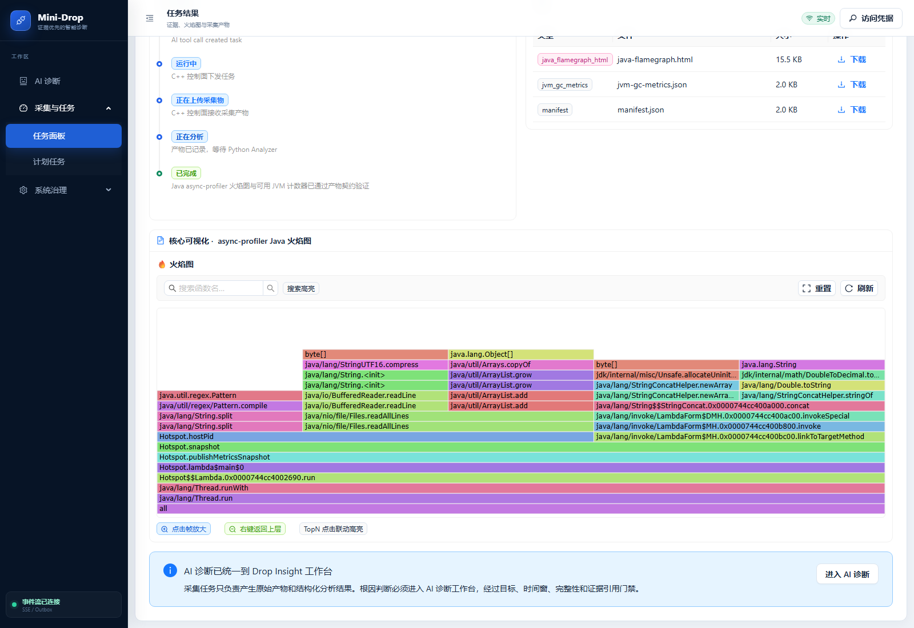](assets/learning-guide/20260909-hardening-final/java-flamegraph-restored.png)

不执行产物自带脚本；格式不支持、超限或无样本会明确报错并保留下载入口。`analysis_status=SUCCESS` 和浏览器正确渲染仍是两项独立检查。

### A/B 历史不见

同浏览器从 localStorage 中的两条 ID 恢复；换设备只会丢入口索引，服务端 Diagnosis 仍在案例列表。

### 为什么不能一直重启

重启会改变 PID、进程启动时间、故障状态和现场窗口，破坏诊断可比性。正确做法是先定位具体组件，使用版本化部署和容器级重建；PostgreSQL/MinIO 卷不得当缓存删除。

## 30. 七天学习计划

### 第 1 天：只学页面

- 跑一次 Python 源码热点；
- 建一个手工 sys_metrics Task；
- 能解释 Task、Attempt、Artifact、Evidence 的区别。

### 第 2 天：读基础采集链

- 从 `TaskCreatePanel.jsx` 跟到 Go API；
- 找到 Control 创建任务和 Agent 领取逻辑；
- 画出状态机。

### 第 3 天：读分析链

- 选一个 perf/py-spy Artifact；
- 跟踪 Analyzer 如何生成 folded stack、火焰图和 TopN；
- 理解空 Profile 为什么必须失败。

### 第 4 天：读 AI 诊断

- 从 `AIDiagnosis.jsx` 跟到 `service.py`；
- 找 Scope、Hypothesis、Tool Call、Evidence、Report；
- 解释为什么模型不能直接执行 shell。

### 第 5 天：读 LATS 与多轮

- 在冻结回放里看完整选择/回传；
- 在实时故障里看 BUDGETED_LATS；
- 人工寻找反证并观察跨域重规划。

### 第 6 天：读 Skill、RAG 与记忆

- 比较 AUTO/DISABLED；
- 打开 RAG 弹窗，确认来源 hash；
- 看 Skill 候选、评测、发布和回滚；
- 检查 Checkpoint actual backend。

### 第 7 天：面试排练

- 按 [`INTERVIEW_DEMO_GUIDE.md`](INTERVIEW_DEMO_GUIDE.md) 走 15 分钟脚本；
- 用 Java/Go/C++ 再跑一个不同故障族；
- 主动讲 A/B、LIVE LATS 和线上验收的限制；
- 准备网络、操作系统和可靠性追问。

## 31. 面试高频问答

### 为什么不用大模型直接 SSH？

因为目标、权限、预算和审计不可控。Mini-Drop 让模型只做规划，服务端把每个请求映射为白名单 Tool Call，再由 Agent 执行，并把结果变成可追溯 Evidence。

### Skill 和 RAG 有什么区别？

RAG 提供领域知识和证据要求；Skill 提供经过评测的调查路线先验。两者都不是本次 Evidence。

### 为什么既有 LangGraph 又有 LATS？

LangGraph 解决运行、工具循环和 checkpoint；LATS 解决多个假设之间的选择、探索、反思和价值回传；Mini-Drop 领域服务负责状态、安全和证据。

### 为什么实时路径不是完整 LATS？

真实环境不可回滚，兄弟分支不能保证相同起点。实时路径诚实标记为预算搜索；完整 LATS 放在可复位冻结环境验证。

### 如何防止 Agent 一轮猜答案？

故障广场设置最少报告轮次，支持证据仍需反证检查和交叉验证；分支失败会跨域扩展；最终终止由服务端证据与预算合同决定，而不是模型说“完成”。

### 如何评价 Agent 效果？

分三层：代码合同、静态路线 Benchmark、Linux live E2E。再看根因命中、首条有效证据时间、工具成功率、门禁分类、预算、人工介入和恢复验证，不能只看最终一句话。

### 云服务器为什么还用 Docker？

云服务器提供计算资源，Docker Compose 提供可重复环境、依赖隔离、健康检查、版本切换和回滚。性能 Worker 在需要更强宿主机权限时可以用 systemd；Control 面继续用 Compose 更易维护。

### 31.1 操作系统与性能分析：从现象回答到证据

**1. CPU 100% 就能断定有死循环吗？**

不能。先确认统计口径和时间窗口，再区分业务计算、GC、内核执行、锁自旋或同机争抢。CPU 火焰图帮助找 on-CPU 栈；队列、上下文切换和调度指标说明是否资源竞争。项目对应系统指标与 perf/pprof/py-spy 工具的组合。追问“怎么证伪”时，应提出同负载复采、独立指标或停止受控故障后的对照。

**2. CPU 不高，但 P99 很高，怎么查？**

先把请求延迟拆成排队、锁等待、I/O、网络与真正执行时间。CPU 采样可能看不到睡眠中的线程，需要 wall/off-CPU 信息或 I/O、网络证据补充。项目里网络等待和 CPU 热点是不同证据域；不能因为 perf 图不热就说服务正常。

**3. RSS 增长是否就是内存泄漏？**

不是。堆保留、allocator 缓存、页缓存、共享映射、线程栈和 direct buffer 都可能影响驻留内存。结合 smaps/PSS、对象存活与分配信息、负载变化和恢复阶段判断。一次 allocation 热点只说明分配集中，不证明对象永久无法释放。项目的 Java 堆外、分配热点和内存趋势应分开讲。

**4. 缺页中断和磁盘 I/O 有什么关系？**

缺页指虚拟地址需要建立或恢复页映射；minor fault 通常不需要从磁盘加载页，major fault 可能需要阻塞 I/O。缺页次数上升要结合匿名/文件映射、内存压力和实际 I/O 观察，不能把每次缺页都说成磁盘读取。对应 `/proc` 指标、smaps 与 eBPF I/O 的联合解释。

**5. Load Average 与 CPU 使用率有什么区别？**

Linux load 反映一段时间内可运行及某些不可中断等待任务的数量，CPU 使用率反映处理器忙碌程度。高 load、低 CPU 可能与 I/O 等待有关；还要考虑核数和容器配额。不能直接拿整机 load 与某进程 CPU% 做相同量纲比较。

**6. 火焰图横轴是不是时间轴？为什么父子帧都接近 100%？**

通常的聚合火焰图横向宽度表示样本占比，纵向表示调用栈关系；左右位置不表示按时间先后执行。父子帧的 inclusive 样本包含关系可能使多层同时接近 100%，定位真正计算落点要看 self。项目的 C++ 热点复盘正修过把包含样本当独立热点的问题。图形语义可对照 [火焰图作者的说明](https://www.brendangregg.com/flamegraphs.html)。

**7. 99 Hz 是什么？为什么不能无限提高采样率？**

99 Hz 是目标采样频率，不保证每秒一定获得 99 个有效样本。被调度时间、采样模式和权限都会影响实际数量。提高频率可能增加中断、栈展开、缓冲和写文件开销，也可能扰动被测程序。采样时长、频率、丢样本与观察稳定性应一起评价。

**8. on-CPU、wall-clock、allocation Profile 分别回答什么？**

on-CPU 看线程在处理器上执行时的栈；wall-clock 关注经过的时间，可能揭示等待；allocation 关注对象分配的路径与数量/字节。不同采样事件的分母不同，不能把 allocation 的 100% 读成占用了 100% CPU。本项目的 Java 任务必须先看采样类型再解释图。

**9. eBPF 是否代表零开销、任何机器都能运行？**

不是。采集点、事件频率、过滤方式、内核版本、权限和 map 开销都会影响成本与可用性。本项目通过 capability 和白名单限制工具，采集失败要明确说明不可观测原因。面试应讲“在被验证内核和权限范围内可用”，不承诺全平台通吃。

**10. 容器 PID 与宿主机 PID 为什么可能不同？**

PID namespace 提供不同编号视图，同一个进程可能在容器内外拥有不同 PID；进程重启后编号也会变化。项目使用进程快照、启动时间等组合信息验证目标，不能把截图里的 PID 抄到另一环境长期使用。`pid: host` 让演示 Agent 看见宿主机进程，同时也扩大了它的可见范围，所以仍需服务端门禁。

### 31.2 网络、数据库与分布式可靠性

**11. 为什么用 HTTP、gRPC、SSE 三种协议？**

HTTP/JSON 便于浏览器调用和调试；gRPC/Protobuf 定义内部跨语言控制合同；SSE 让服务端持续向浏览器推送进度。它们承担不同方向的数据流。采集大文件交给对象存储，避免把控制 RPC 变成大文件管道。

**12. SSE 为什么不用 WebSocket？断线怎么办？**

当前需求主要是服务器单向推送状态，用户动作仍走普通 HTTP，SSE 足够直接。断线重连要带事件游标、允许去重，并在缺失或不可达时重新读取权威快照；页面还有轮询兜底。换成 WebSocket 也不会自动解决丢事件、鉴权或幂等。

**13. HTTP 请求返回超时，服务端到底执行了吗？**

两种情况都有可能：请求未到达，或者已提交但响应丢失。因此客户端重试不能仅依赖按钮禁用，要有服务端幂等语义、稳定请求身份或已有记录查询。对于真实采样和故障注入，重复执行会改变现场，代价比多写一条日志更大。

**14. 至少一次投递与“只生效一次”如何兼容？**

通过允许消息重发，同时在消费者侧按稳定身份和唯一约束去重，并验证当前执行权。Outbox 保证可恢复地继续投递，去重与状态门禁限制重复副作用。不要宣称网络层绝不会重复；本项目更关心重复消息不覆盖新 Attempt、不追加重复效果。

**15. 为什么只有租约超时还不够，要检查执行代次？**

旧执行者可能只是暂停或断网，并没有真正停止；租约过期后新执行者接管，两者都可能回报。需要根据 Attempt/代次或等价权威标识拒绝旧回报，避免旧结果覆盖新状态。这就是 fencing 思想。项目的 PostgreSQL 测试包含租约接管与 fencing 场景。

**16. 事务 Outbox 解决什么？与 Agent 本地 Outbox 相同吗？**

事务 Outbox 把业务状态变化和待发事件写在同一数据库事务中，避免“提交状态后进程崩溃，事件没发”。Agent 本地结果 Outbox 保存尚未成功回报的执行结果，应对节点网络中断。两者位置、权威对象不同，但都需要重试、上限和幂等消费。

**17. 为什么不用一个数据库字段表示所有任务状态？**

采集、上传、分析和诊断报告属于不同阶段。`COLLECTED` 时文件已经存在，但 Analyzer 可能仍在运行或失败；单一“成功”会误导页面。项目保留采集/分析双状态、Attempt 与事件，兼容总状态只用于汇总展示。

**18. 乐观锁 CAS、悲观锁和唯一约束分别负责什么？**

CAS 通常以 version 检查“我更新的还是刚才读到的版本”；行锁使冲突事务在关键区串行；唯一约束从数据库层拒绝重复身份。它们可以组合使用，不能靠前端先查询再插入防并发竞争。本项目的事件效果身份与报告副作用应看专门的 PostgreSQL 集成测试。锁语义参考 [PostgreSQL 官方文档](https://www.postgresql.org/docs/current/explicit-locking.html)。

**19. 数据库与 MinIO 怎么保证一致？是否跨服务开启一个大事务？**

对象上传与 SQL 提交通常不是同一个本地事务。通过 Artifact manifest、校验、生命周期和状态机逐步确认材料可用；处理失败时保留可恢复状态或按明确策略补偿。不要把长时间上传包在数据库长事务里，也不要只看到一个对象就宣布任务全部成功。

**20. 索引越多越好吗？**

不是。索引降低某些查询成本，但增加写入和维护成本。先看实际查询条件、排序、选择性和执行计划，再决定复合索引顺序。项目常用 task_id、diagnosis_id、状态、时间和去重键；应基于查询和唯一性要求设计，而不是把每个 JSON 字段都建索引。

**21. 心跳在线能证明服务正常吗？健康检查与业务验收有什么区别？**

在线只说明最近心跳符合阈值；健康检查只验证预设依赖或自检。业务验收要真的建立 Diagnosis/Task、执行采集、上传、分析、证据门禁和报告。当前 `/api/healthz` 健康不等于每个 Collector 都有权限，更不等于诊断准确率。

**22. 为什么发布采用版本目录、镜像标签和软链接？**

版本目录保留可审查的源码与配置基线，镜像固定运行内容，软链接表示当前发布入口。切换软链接不自动替换已经运行的容器；回滚还要恢复镜像并只重建受影响服务。数据库卷是持久数据，不能当作旧版本缓存删除。

### 31.3 AI、LATS、RAG、Skill 与评测

**23. Agent 与普通聊天接口的区别是什么？**

普通聊天主要生成文本；这个诊断 Agent 还要维护任务目标和状态、选择工具、接收结果、判断是否继续或需要人、持久化过程。自主不等于无限权限，模型提出的行动仍由业务代码校验和执行。

**24. 为什么 LATS 不直接取代 LangGraph？**

LangGraph 解决图执行、线程与 Checkpoint；LATS 提供如何在候选分支之间选择、反思、回传的搜索策略。Mini-Drop 的领域状态机继续决定合法工具、目标、预算和 Evidence。三者不是重复框架，也不应该互相绕过。

**25. UCT 中探索项有什么意义？Q 越大就一定正确吗？**

Q 是当前奖励定义下的经验平均值；探索项鼓励访问样本少的分支，避免过早只押一条路线。它决定“接下来查哪条”，不能直接推出“根因概率”。奖励若混入模型自说自话，会放大错误，所以项目把奖励与真实工具结果、门禁和可追溯事件绑定。

**26. 为什么现场环境不能当成可随意 reset 的搜索模拟器？**

真实时间在推进，负载和进程可能改变，一次采样也可能改变缓存或资源状态。兄弟分支无法保证观察同一现场。项目因此区分 `LIVE_PROGRESSIVE` 与有快照、命名空间和 reset proof 的冻结回放。原始研究背景可看 [LATS 论文](https://arxiv.org/abs/2310.04406)；工程标签应按本项目实际语义解释。

**27. RAG 命中一个文档，为什么不能直接确认根因？**

文档讲的是一般知识，不是这次目标在本次窗口发生的事实。RAG 帮助决定取什么证据，Artifact/Evidence 才验证假设。项目保留知识来源 hash 并明确 `is_evidence=false`，避免把检索相关性包装成现场证明。

**28. Skill 与 RAG 有何区别？Skill 是不是缓存答案？**

RAG 取知识上下文；Skill 提供结构化调查路线、适用前提、推荐探针、证伪与停止条件。Skill 会影响优先查什么，但必须重新采本次 Evidence。缓存旧根因无法保证目标、时间、版本和负载一致，不能代替诊断。

**29. 为什么要先读 catalog，再加载完整 Skill？**

先用轻量元数据筛选，减少无关内容与上下文成本；候选通过环境/能力门禁后再加载正文，校验路径、大小、编码、章节和 hash。这样能够解释是哪版知识影响了决策，也避免把整个仓库都塞进 Prompt。

**30. BM25、哈希特征与向量数据库有什么区别？**

BM25 重在词项匹配与统计权重；本项目的固定维哈希 n-gram/概念特征提供确定性补充信号，它不是自动等同于大模型 embedding。向量数据库是检索存储基础设施，当前实现没有依赖它。是否升级应根据语义召回、成本和评测误激活来决定。

**31. Prompt 写“禁止越权”够不够？怎样对抗提示注入？**

不够。查询、知识文本、工具输出都不能自行授予权限。工具注册表、参数 schema、服务端目标绑定、风险预算和审批应由确定性代码执行；模型输出里的额外目标或 shell 命令要拒绝。Prompt 是行为提示，Policy/Harness 才是执行边界。

**32. 模型超时或输出不合法时怎么办？**

区分模型可用性与业务事实。记录错误/兜底来源，在允许范围内使用保守的确定性规划或终止；已经落库的 Task、Evidence 和历史报告保留。不能假装模型已经完成推理，也不能把失败文本写成可信根因。

**33. 记忆是否越多越好？怎么避免旧结论污染新会话？**

过量历史会挤占上下文并引入错误锚定。项目区分短期线程、领域事实、已发布路线和显式偏好；新会话应重新绑定目标与采 Evidence。用户偏好仅允许白名单表达或保守排序信息，不保存越权能力，不把旧 PID 当新目标。

**34. 怎么证明 Agent 的效果，而不是只展示一张漂亮树？**

分开测工具执行率、证据合格率、带独立标签的根因正确率、耗时、工具成本和安全事件。树只展示调查过程；有效性需要新场景、负例、预算对齐及可信标签。历史 21/21 只验证受控真机链路和清理，不要求根因 VERIFIED；540/500 属于确定性评测。当前根因验收结果见 2026-09-10 严格复验，不能将这些数字当成生产准确率。

**35. 为什么不能看到一个正向 p 值结果就自动上线？**

先检查随机分流、样本量、独立性、标签质量、效果量和置信区间，再看安全与验证率护栏。反复查看结果、选择性排除失败样本或只保留好看的实验会扭曲结论。项目只生成发布建议并保留人工门禁；没有样本时应显示不足。

### 31.4 面试追问：讲清取舍与未完成部分

**36. 这个项目有什么真实难点？**

可以讲一个完整复盘：曾经有效 Profile 因工具与假设证据域错配而只能得到中性证据；修复时保留假设的推荐工具，不能临时换另一个域凑执行。随后保留失败报告并做定向和完整 live 回归。重点是发现依据、修改的不变量和验证结果，而不是罗列框架名。

**37. 现在能承诺高并发、高可用和长期运行吗？**

不能仅凭演示成功承诺。需要并发/长稳、数据库真实并发测试、容量与资源限额、备份恢复和故障演练。当前部署有单机 Control 依赖；多副本还需确认调度执行权、租约、共享状态与负载分配。把这些作为工程收尾计划，比声称“架构天然可扩展”更可信。

**38. 三个 PostgreSQL 测试为什么不能用 SQLite 代替？**

锁、隔离、并发唯一约束与 SQL 方言并不完全相同。租约接管、会话锁串行化、并发重复效果需要专用 PostgreSQL 测试库验证。本轮本地全量为 `506 passed / 3 skipped`，三项 PostgreSQL 测试另在独立 test 数据库全部通过；测试仅在自己创建的独立 schema 内操作，不能在演示数据库运行。初次实跑暴露的 fixture 写入顺序和锁等待信号问题也已经修正。

**39. 新增一个 Collector 要改哪里？**

从 TaskKind/参数/产物合同开始，添加 Agent capability 与受控执行，再添加 Analyzer 解析、质量门禁和页面展示，最后做合同、失败、权限与 Linux live 验收。若还要让 AI 调用，需要工具注册、风险预算、假设证据域和 Skill 路线适配。只加一条 shell 命令并不等于完成一个采集器。

**40. 如何在一分钟内介绍项目？**

“这是一个面向 Linux 多节点的性能诊断系统。人可以直接创建采集任务，也可以描述异常，由 Python 诊断 Agent 在服务端权限和预算内多轮选择工具。Go API 负责公开入口，C++ Control/Agent 执行采集，MinIO 保存材料，Analyzer 生成图表，Evidence Gate 验证材料能否支撑报告。LangGraph 负责可恢复运行，LATS 选择调查分支，Skill 复用路线但不复用旧证据。已有 21 个受控真机场景闭环，生产随机实验和容量验证仍需继续积累。”

### 31.5 自测评分：能不能不用背稿解释

每项给自己 0～2 分：0 分只能背概念；1 分能指到页面或文件；2 分能给出真实记录、失败反例和边界。检查十项：两个 Agent、基础链、Task/Attempt/Artifact、Evidence Gate、LATS、Skill/RAG、记忆、幂等恢复、评测口径、当前不足。达到 16 分后再做录屏排练；这只是个人学习标准，不是项目 Benchmark。

## 32. 最后画出自己的知识图

```text
用户层
├── AI 诊断：问题、多轮对话、树、人工干预、A/B
└── 基础采集：Task、任务详情、火焰图、计划任务

智能层
├── 意图/范围
├── Agentic RAG
├── Skill 路线记忆
├── LATS 选择/扩展/反思/回传
└── Evidence Gate 与报告

执行层
├── Go API
├── C++ Control
├── C++ Agent + 白名单 Collector
└── Python Analyzer

数据层
├── PostgreSQL：状态、事件、Evidence、记忆、审计
└── MinIO：原始与派生 Artifact

横切能力
├── 安全：mTLS、binding、能力、预算、审批
├── 可靠性：幂等、租约、Outbox、CAS、终态原子化
└── 评测：单元/合同、540-case 路线集、Linux live E2E
```

如果只记住一句话：**Mini-Drop 不是让 AI 替你猜根因，而是让 AI 在安全、可恢复、可审计的树搜索里选择下一项证据，再用真实采集和门禁决定结论。**

## 33. 继续阅读

- AI 流程与证据门禁：[`AI_DIAGNOSIS.md`](AI_DIAGNOSIS.md)
- Runtime、Harness、Theme 和记忆：[`AGENT_RUNTIME.md`](AGENT_RUNTIME.md)
- Skill 生命周期：[`SKILLS.md`](SKILLS.md)
- 部署与复刻：[`REPLICATION.md`](REPLICATION.md)
- 竞品设计依据：[`COMPETITOR_DESIGN_DECISIONS.md`](COMPETITOR_DESIGN_DECISIONS.md)
- 页面演示脚本：[`INTERVIEW_DEMO_GUIDE.md`](INTERVIEW_DEMO_GUIDE.md)
- 对外 API：[`contracts/openapi.v1.json`](contracts/openapi.v1.json)

### 33.1 页面变化后怎样更新截图

截图不是手工粘贴的孤立图片，源合同是 `scripts/capture_learning_guide_screenshots.py`。它使用临时 Chrome/Edge 用户目录，只执行打开页面、切换页签、展开抽屉和读取已有记录等只读动作，不会启动故障、创建诊断、审批 Tool Call、发布 Skill 或删除数据。

```powershell
# 凭据只放在当前进程环境变量，不写入脚本、图片或文档
$env:MINI_DROP_SCREENSHOT_API_KEY = '<访问凭据>'
python scripts/capture_learning_guide_screenshots.py --base-url https://120.24.187.205
Remove-Item Env:MINI_DROP_SCREENSHOT_API_KEY

# 仓库增加截图后，重新生成第 34 节逐文件字典
python scripts/generate_learning_guide_file_index.py
```

脚本依赖 Python 环境中的 `requests` 与 `websocket-client`，并需要本机 Chrome、Edge 或 Chromium。发布前至少检查三点：图片没有凭据/云账号等敏感信息；图中控件仍与正文一致；所有图片在 Markdown 中能打开原图。

### 33.2 导出离线阅读版

主教材只有这份 Markdown；HTML 是同源生成的阅读副本。图片内嵌、目录与全文搜索、放大和打印均可离线使用。源码链接指向本机工作区，转发给别人后需要对方拥有对应仓库。

```bash
python scripts/generate_learning_guide_file_index.py
python scripts/render_learning_guide.py
```

输出：`output/learning-guide/Mini-Drop深入学习与演示手册.html`。生成器校验图片、文档链接与源文件，并写出 `.build.json`；不要直接修改 HTML 来维护另一套事实。

### 33.3 本次学习材料的证据边界

- 页面功能与字段：当前 `web/src`、API 合同和云端只读截图。
- 当前发布：`20260909T153610Z`；Web 修复来自 `20260909T152520Z`，原生演示 Agent 修复来自 `20260909T151902Z`。
- 真机效果：历史 21 场与其余 17 场复验保留；后续修复又通过四运行时的新链路 4/4，16 次工具全部完成。不是生产准确率。
- 新随机实验与偏好：迁移 `20260908_0007`；新实验已持久化六次分流、六个标签和指标快照，偏好保存/两个会话加载/删除恢复通过。NOT_READY 表示统计样本不足；功能闭环不等于长期收益。
- 前置原理：操作系统、网络和分布式基础解释用于理解实现；正文所附官方资料帮助深入阅读，不意味着仓库采用了外部文档中的每项能力。
- 原始参考：《Drop 性能诊断系统架构与复刻指南》由用户提供，只作为参考材料；当前实现差异见第 0.4 节。

<!-- FILE_INDEX:START -->

## 34. 当前仓库逐文件字典（自动生成）

本节由 `scripts/generate_learning_guide_file_index.py` 从 Git 已登记文件和未被忽略的新增文件生成，共登记 **1430 个实际存在的文件**。`node_modules/`、`.git/`、缓存、密钥、数据库卷、MinIO 对象、临时发布包和本教材导出副本不列入；它不是递归泄露本机所有文件的清单。生成物、测试、报告和样式仍逐项说明，同类职责使用统一口径。源码定位列自动提取部分真实声明，不等于调用链，也不代表每个函数都在运行时被调用。

阅读原则：先看第 19 节的数据链和第 21 节的核心路线，再到本节查文件；不要按数百个文件从头顺序读。修改协议生成物时回到 `proto/` 或 `contracts/`，修改 Benchmark 数据时回到生成器，修改报告时重新运行验收，不能直接编造结果。

### 34.0 每个目录负责什么

共 438 个包含上述文件的目录；更深的目录继承模块职责，并结合后面的逐文件说明阅读。

| 目录 | 职责 |
|---|---|
| `.github/` | 仓库平台协作和 CI 配置。 |
| `.github/workflows/` | 持续集成工作流与自动门禁。 |
| `analyzer/` | 独立分析包、格式处理与测试材料。 |
| `analyzer/mini_drop_analyzer/` | 各类 Profile、指标和内存产物的解析与统一输出。 |
| `analyzer/scripts/` | scripts 子目录；独立分析包、格式处理与测试材料。 |
| `apiserver/` | Go 公开 API 模块，独立 go.mod 与测试。 |
| `apiserver/cmd/` | Go 服务启动程序与命令入口。 |
| `apiserver/cmd/apiserver/` | apiserver 子目录；Go 服务启动程序与命令入口。 |
| `apiserver/internal/` | internal 子目录；Go 公开 API 模块，独立 go.mod 与测试。 |
| `apiserver/internal/config/` | 环境配置解析、默认值和启动校验。 |
| `apiserver/internal/cron/` | Cron 表达式解析及下一次触发计算。 |
| `apiserver/internal/errorcode/` | errorcode 子目录；Go 公开 API 模块，独立 go.mod 与测试。 |
| `apiserver/internal/gen/` | Protobuf/gRPC 生成代码；源头在 proto。 |
| `apiserver/internal/gen/mini_drop/` | mini_drop 子目录；Protobuf/gRPC 生成代码；源头在 proto。 |
| `apiserver/internal/httpapi/` | HTTP 路由、鉴权、输入校验与内部调用。 |
| `apiserver/internal/objectstore/` | MinIO 对象元数据与短时访问授权。 |
| `apiserver/internal/repository/` | PostgreSQL 查询、写入和事务边界。 |
| `apiserver/internal/scheduler/` | 定时扫描到期计划并触发任务。 |
| `apiserver/internal/taskkind/` | taskkind 子目录；Go 公开 API 模块，独立 go.mod 与测试。 |
| `apiserver/internal/taskstatus/` | taskstatus 子目录；Go 公开 API 模块，独立 go.mod 与测试。 |
| `benchmarks/` | 评测输入、真值与生成合同；不得将私有答案喂给被测规划器。 |
| `benchmarks/diagnosis-v2/` | diagnosis-v2 子目录；评测输入、真值与生成合同；不得将私有答案喂给被测规划器。 |
| `benchmarks/diagnosis-v2/private/` | private 子目录；评测输入、真值与生成合同；不得将私有答案喂给被测规划器。 |
| `benchmarks/diagnosis-v2/public/` | public 子目录；评测输入、真值与生成合同；不得将私有答案喂给被测规划器。 |
| `benchmarks/evaluation-suite/` | evaluation-suite 子目录；评测输入、真值与生成合同；不得将私有答案喂给被测规划器。 |
| `benchmarks/retrieval/` | retrieval 子目录；评测输入、真值与生成合同；不得将私有答案喂给被测规划器。 |
| `benchmarks/root-cause-v1/` | root-cause-v1 子目录；评测输入、真值与生成合同；不得将私有答案喂给被测规划器。 |
| `benchmarks/root-cause-v1/private/` | private 子目录；评测输入、真值与生成合同；不得将私有答案喂给被测规划器。 |
| `benchmarks/root-cause-v1/public/` | public 子目录；评测输入、真值与生成合同；不得将私有答案喂给被测规划器。 |
| `contracts/` | 机器可读的共享枚举、参数、状态和产物合同。 |
| `demo/` | 隔离的受控故障实验室；按运行时设置固定动作与自动停止。 |
| `demo/cpp-hotspot/` | cpp-hotspot 子目录；隔离的受控故障实验室；按运行时设置固定动作与自动停止。 |
| `demo/go-hotspot/` | go-hotspot 子目录；隔离的受控故障实验室；按运行时设置固定动作与自动停止。 |
| `demo/java-hotspot/` | java-hotspot 子目录；隔离的受控故障实验室；按运行时设置固定动作与自动停止。 |
| `demo/python-hotspot/` | python-hotspot 子目录；隔离的受控故障实验室；按运行时设置固定动作与自动停止。 |
| `demo/rag_service/` | rag_service 子目录；隔离的受控故障实验室；按运行时设置固定动作与自动停止。 |
| `deploy/` | 部署、镜像、网络与环境配置。 |
| `deploy/certs/` | certs 子目录；部署、镜像、网络与环境配置。 |
| `deploy/dockerfiles/` | 各服务容器镜像的构建配方。 |
| `deploy/env/` | 部署变量模板与受控实验配置；真实密钥文件不进教材。 |
| `deploy/k8s/` | Kubernetes 部署材料，不代表当前云端已用 Kubernetes。 |
| `deploy/k8s/base/` | base 子目录；Kubernetes 部署材料，不代表当前云端已用 Kubernetes。 |
| `deploy/nginx/` | HTTPS、代理、静态资源、SSE 与请求限制配置。 |
| `deploy/scripts/` | 证书、初始化与配置辅助脚本。 |
| `deploy/systemd/` | 宿主机 Agent 等服务的生命周期管理。 |
| `deploy/vendor/` | vendor 子目录；部署、镜像、网络与环境配置。 |
| `docs/` | 当前权威文档、教程、接口与复盘。 |
| `docs/assets/` | assets 子目录；当前权威文档、教程、接口与复盘。 |
| `docs/assets/learning-guide/` | 保留拍摄时间的教材截图与历史证据。 |
| `docs/assets/learning-guide/20260909/` | 本次真实云端截图、可见文字/控件清单与图片 hash。 |
| `docs/assets/learning-guide/20260909-acceptance/` | 20260909-acceptance 子目录；保留拍摄时间的教材截图与历史证据。 |
| `docs/assets/learning-guide/20260909-hardening/` | 20260909-hardening 子目录；保留拍摄时间的教材截图与历史证据。 |
| `docs/assets/learning-guide/20260909-hardening-final/` | 20260909-hardening-final 子目录；保留拍摄时间的教材截图与历史证据。 |
| `docs/assets/learning-guide/20260910-project-review/` | 20260910-project-review 子目录；保留拍摄时间的教材截图与历史证据。 |
| `docs/assets/learning-guide/20260910-skill-inline/` | 20260910-skill-inline 子目录；保留拍摄时间的教材截图与历史证据。 |
| `docs/assets/learning-guide/20260910-strict-acceptance/` | 20260910-strict-acceptance 子目录；保留拍摄时间的教材截图与历史证据。 |
| `docs/assets/learning-guide/20260910-usability/` | 20260910-usability 子目录；保留拍摄时间的教材截图与历史证据。 |
| `docs/assets/learning-guide/20260913-actual-rag/` | 20260913-actual-rag 子目录；保留拍摄时间的教材截图与历史证据。 |
| `docs/assets/learning-guide/20260913-business-acceptance/` | 20260913-business-acceptance 子目录；保留拍摄时间的教材截图与历史证据。 |
| `docs/assets/learning-guide/20260913-service-integration/` | 20260913-service-integration 子目录；保留拍摄时间的教材截图与历史证据。 |
| `docs/assets/learning-guide/20260914-lightweight-business/` | 20260914-lightweight-business 子目录；保留拍摄时间的教材截图与历史证据。 |
| `docs/contracts/` | 公开 API、事件与跨服务语义文档。 |
| `docs/contracts/task-parameters/` | task-parameters 子目录；公开 API、事件与跨服务语义文档。 |
| `integrations/` | integrations 子目录；归属该顶层模块，按下方文件职责定位。 |
| `integrations/agi_saber/` | agi_saber 子目录；归属该顶层模块，按下方文件职责定位。 |
| `integrations/agi_saber/patches/` | patches 子目录；归属该顶层模块，按下方文件职责定位。 |
| `integrations/lightweight/` | lightweight 子目录；归属该顶层模块，按下方文件职责定位。 |
| `knowledge/` | 可检索的诊断知识文档与来源目录。 |
| `native/` | 原生 C++ 工程及公共工具。 |
| `native/agent/` | 原生采集节点程序及其构建配置。 |
| `native/agent/include/` | include 子目录；原生采集节点程序及其构建配置。 |
| `native/agent/src/` | 采集 Agent 主循环、进程快照、采集器、上传与本地结果 Outbox。 |
| `native/agent/tests/` | tests 子目录；原生采集节点程序及其构建配置。 |
| `native/control/` | 原生控制面程序及其构建配置。 |
| `native/control/src/` | C++ Control 调度、注册、租约和结果回报实现。 |
| `native/generated/` | generated 子目录；原生 C++ 工程及公共工具。 |
| `native/gperftools_bridge/` | gperftools 兼容桥与原生产物接入。 |
| `native/gperftools_bridge/src/` | src 子目录；gperftools 兼容桥与原生产物接入。 |
| `output/` | 交付或审阅材料；不作为业务源码和数据库事实。 |
| `output/cloud-sre-20260919/` | cloud-sre-20260919 子目录；交付或审阅材料；不作为业务源码和数据库事实。 |
| `output/cloud-sre-20260919/tests-r2/` | tests-r2 子目录；交付或审阅材料；不作为业务源码和数据库事实。 |
| `output/cloud-sre-20260919/tests-r2/test_failed_index_is_not_publi0/` | test_failed_index_is_not_publi0 子目录；交付或审阅材料；不作为业务源码和数据库事实。 |
| `output/cloud-sre-20260919/tests-r2/test_index_is_immutable_reusab0/` | test_index_is_immutable_reusab0 子目录；交付或审阅材料；不作为业务源码和数据库事实。 |
| `output/cloud-sre-20260919/tests-r2/test_lexical_chunk_can_be_read0/` | test_lexical_chunk_can_be_read0 子目录；交付或审阅材料；不作为业务源码和数据库事实。 |
| `output/cloud-sre-20260919/tests-r2/test_missing_index_does_not_ca0/` | test_missing_index_does_not_ca0 子目录；交付或审阅材料；不作为业务源码和数据库事实。 |
| `output/cloud-sre-20260919/tests-r2/test_model_or_dimensions_chang0/` | test_model_or_dimensions_chang0 子目录；交付或审阅材料；不作为业务源码和数据库事实。 |
| `output/cloud-sre-20260919/tests-r2/test_private_and_path_escape_d0/` | test_private_and_path_escape_d0 子目录；交付或审阅材料；不作为业务源码和数据库事实。 |
| `output/cloud-sre-20260919/tests-r2/test_real_chroma_snapshot_and_0/` | test_real_chroma_snapshot_and_0 子目录；交付或审阅材料；不作为业务源码和数据库事实。 |
| `output/cloud-sre-20260919/wheels/` | wheels 子目录；交付或审阅材料；不作为业务源码和数据库事实。 |
| `output/frontend-review-20260909/` | frontend-review-20260909 子目录；交付或审阅材料；不作为业务源码和数据库事实。 |
| `output/interview-guide/` | interview-guide 子目录；交付或审阅材料；不作为业务源码和数据库事实。 |
| `output/local-sre-20260919/` | local-sre-20260919 子目录；交付或审阅材料；不作为业务源码和数据库事实。 |
| `output/local-sre-20260919/browser/` | browser 子目录；交付或审阅材料；不作为业务源码和数据库事实。 |
| `output/local-sre-20260919/browser-1789819540315/` | browser-1789819540315 子目录；交付或审阅材料；不作为业务源码和数据库事实。 |
| `output/local-sre-20260919/browser-1789819631631/` | browser-1789819631631 子目录；交付或审阅材料；不作为业务源码和数据库事实。 |
| `output/local-sre-20260919/browser-1789822478251/` | browser-1789822478251 子目录；交付或审阅材料；不作为业务源码和数据库事实。 |
| `output/local-sre-20260919/browser-1789822690756/` | browser-1789822690756 子目录；交付或审阅材料；不作为业务源码和数据库事实。 |
| `output/local-sre-20260919/tests-r3/` | tests-r3 子目录；交付或审阅材料；不作为业务源码和数据库事实。 |
| `output/local-sre-20260919/tests-r3/test_failed_index_is_not_publi0/` | test_failed_index_is_not_publi0 子目录；交付或审阅材料；不作为业务源码和数据库事实。 |
| `output/local-sre-20260919/tests-r3/test_index_is_immutable_reusab0/` | test_index_is_immutable_reusab0 子目录；交付或审阅材料；不作为业务源码和数据库事实。 |
| `output/local-sre-20260919/tests-r3/test_lexical_chunk_can_be_read0/` | test_lexical_chunk_can_be_read0 子目录；交付或审阅材料；不作为业务源码和数据库事实。 |
| `output/local-sre-20260919/tests-r3/test_missing_index_does_not_ca0/` | test_missing_index_does_not_ca0 子目录；交付或审阅材料；不作为业务源码和数据库事实。 |
| `output/local-sre-20260919/tests-r3/test_model_or_dimensions_chang0/` | test_model_or_dimensions_chang0 子目录；交付或审阅材料；不作为业务源码和数据库事实。 |
| `output/local-sre-20260919/tests-r3/test_private_and_path_escape_d0/` | test_private_and_path_escape_d0 子目录；交付或审阅材料；不作为业务源码和数据库事实。 |
| `output/local-sre-20260919/tests-r3/test_real_chroma_snapshot_and_0/` | test_real_chroma_snapshot_and_0 子目录；交付或审阅材料；不作为业务源码和数据库事实。 |
| `output/local-sre-api/` | local-sre-api 子目录；交付或审阅材料；不作为业务源码和数据库事实。 |
| `output/pdf/` | pdf 子目录；交付或审阅材料；不作为业务源码和数据库事实。 |
| `output/review-pytest-20260919/` | review-pytest-20260919 子目录；交付或审阅材料；不作为业务源码和数据库事实。 |
| `output/review-pytest-20260919/test_analyzer_upload_binds_tem0/` | test_analyzer_upload_binds_tem0 子目录；交付或审阅材料；不作为业务源码和数据库事实。 |
| `output/review-pytest-20260919/test_prepare_and_verify_local_0/` | test_prepare_and_verify_local_0 子目录；交付或审阅材料；不作为业务源码和数据库事实。 |
| `output/review-pytest-20260919/test_prepare_rejects_declared_0/` | test_prepare_rejects_declared_0 子目录；交付或审阅材料；不作为业务源码和数据库事实。 |
| `output/review-pytest-20260919/test_verify_rejects_tampered_l0/` | test_verify_rejects_tampered_l0 子目录；交付或审阅材料；不作为业务源码和数据库事实。 |
| `output/sre-agent-chroma-tests/` | sre-agent-chroma-tests 子目录；交付或审阅材料；不作为业务源码和数据库事实。 |
| `output/sre-agent-chroma-tests-r2/` | sre-agent-chroma-tests-r2 子目录；交付或审阅材料；不作为业务源码和数据库事实。 |
| `output/sre-agent-chroma-tests-r2/test_failed_index_is_not_publi0/` | test_failed_index_is_not_publi0 子目录；交付或审阅材料；不作为业务源码和数据库事实。 |
| `output/sre-agent-chroma-tests-r2/test_index_is_immutable_reusab0/` | test_index_is_immutable_reusab0 子目录；交付或审阅材料；不作为业务源码和数据库事实。 |
| `output/sre-agent-chroma-tests-r2/test_lexical_chunk_can_be_read0/` | test_lexical_chunk_can_be_read0 子目录；交付或审阅材料；不作为业务源码和数据库事实。 |
| `output/sre-agent-chroma-tests-r2/test_missing_index_does_not_ca0/` | test_missing_index_does_not_ca0 子目录；交付或审阅材料；不作为业务源码和数据库事实。 |
| `output/sre-agent-chroma-tests-r2/test_model_or_dimensions_chang0/` | test_model_or_dimensions_chang0 子目录；交付或审阅材料；不作为业务源码和数据库事实。 |
| `output/sre-agent-chroma-tests-r2/test_private_and_path_escape_d0/` | test_private_and_path_escape_d0 子目录；交付或审阅材料；不作为业务源码和数据库事实。 |
| `output/sre-agent-chroma-tests-r2/test_real_chroma_snapshot_and_0/` | test_real_chroma_snapshot_and_0 子目录；交付或审阅材料；不作为业务源码和数据库事实。 |
| `output/sre-agent-chroma-tests-r2/test_real_chroma_snapshot_and_0/index/` | index 子目录；交付或审阅材料；不作为业务源码和数据库事实。 |
| `output/sre-agent-chroma-tests-r2/test_real_chroma_snapshot_and_0/index/fe18f4f3-28f9-46ac-9a01-b7c708ade75e/` | fe18f4f3-28f9-46ac-9a01-b7c708ade75e 子目录；交付或审阅材料；不作为业务源码和数据库事实。 |
| `output/sre-agent-chroma-tests/test_failed_index_is_not_publi0/` | test_failed_index_is_not_publi0 子目录；交付或审阅材料；不作为业务源码和数据库事实。 |
| `output/sre-agent-chroma-tests/test_index_is_immutable_reusab0/` | test_index_is_immutable_reusab0 子目录；交付或审阅材料；不作为业务源码和数据库事实。 |
| `output/sre-agent-chroma-tests/test_lexical_chunk_can_be_read0/` | test_lexical_chunk_can_be_read0 子目录；交付或审阅材料；不作为业务源码和数据库事实。 |
| `output/sre-agent-chroma-tests/test_missing_index_does_not_ca0/` | test_missing_index_does_not_ca0 子目录；交付或审阅材料；不作为业务源码和数据库事实。 |
| `output/sre-agent-chroma-tests/test_model_or_dimensions_chang0/` | test_model_or_dimensions_chang0 子目录；交付或审阅材料；不作为业务源码和数据库事实。 |
| `output/sre-agent-chroma-tests/test_private_and_path_escape_d0/` | test_private_and_path_escape_d0 子目录；交付或审阅材料；不作为业务源码和数据库事实。 |
| `output/sre-agent-chroma-tests/test_real_chroma_snapshot_and_0/` | test_real_chroma_snapshot_and_0 子目录；交付或审阅材料；不作为业务源码和数据库事实。 |
| `output/sre-agent-chroma-tests/test_real_chroma_snapshot_and_0/index/` | index 子目录；交付或审阅材料；不作为业务源码和数据库事实。 |
| `output/sre-agent-chroma-tests/test_real_chroma_snapshot_and_0/index/3e989ace-7973-4b4f-a699-7317991c334f/` | 3e989ace-7973-4b4f-a699-7317991c334f 子目录；交付或审阅材料；不作为业务源码和数据库事实。 |
| `output/sre-agent-final-validation/` | sre-agent-final-validation 子目录；交付或审阅材料；不作为业务源码和数据库事实。 |
| `output/sre-agent-final-validation/test_failed_index_is_not_publi0/` | test_failed_index_is_not_publi0 子目录；交付或审阅材料；不作为业务源码和数据库事实。 |
| `output/sre-agent-final-validation/test_hybrid_retrieval_returns_0/` | test_hybrid_retrieval_returns_0 子目录；交付或审阅材料；不作为业务源码和数据库事实。 |
| `output/sre-agent-final-validation/test_hybrid_retrieval_returns_0/knowledge/` | knowledge 子目录；交付或审阅材料；不作为业务源码和数据库事实。 |
| `output/sre-agent-final-validation/test_index_is_immutable_reusab0/` | test_index_is_immutable_reusab0 子目录；交付或审阅材料；不作为业务源码和数据库事实。 |
| `output/sre-agent-final-validation/test_lexical_chunk_can_be_read0/` | test_lexical_chunk_can_be_read0 子目录；交付或审阅材料；不作为业务源码和数据库事实。 |
| `output/sre-agent-final-validation/test_missing_index_does_not_ca0/` | test_missing_index_does_not_ca0 子目录；交付或审阅材料；不作为业务源码和数据库事实。 |
| `output/sre-agent-final-validation/test_model_or_dimensions_chang0/` | test_model_or_dimensions_chang0 子目录；交付或审阅材料；不作为业务源码和数据库事实。 |
| `output/sre-agent-final-validation/test_private_and_path_escape_d0/` | test_private_and_path_escape_d0 子目录；交付或审阅材料；不作为业务源码和数据库事实。 |
| `output/sre-agent-final-validation/test_real_chroma_snapshot_and_0/` | test_real_chroma_snapshot_and_0 子目录；交付或审阅材料；不作为业务源码和数据库事实。 |
| `output/sre-agent-final-validation/test_real_chroma_snapshot_and_0/index/` | index 子目录；交付或审阅材料；不作为业务源码和数据库事实。 |
| `output/sre-agent-final-validation/test_real_chroma_snapshot_and_0/index/e0f92868-65ae-46a7-a6b6-150c7606f45a/` | e0f92868-65ae-46a7-a6b6-150c7606f45a 子目录；交付或审阅材料；不作为业务源码和数据库事实。 |
| `output/sre-agent-final-validation/test_retrieval_returns_empty_f0/` | test_retrieval_returns_empty_f0 子目录；交付或审阅材料；不作为业务源码和数据库事实。 |
| `output/sre-agent-final-validation/test_retrieval_returns_empty_f0/knowledge/` | knowledge 子目录；交付或审阅材料；不作为业务源码和数据库事实。 |
| `output/sre-agent-final-validation/test_retrieval_trace_explicitl0/` | test_retrieval_trace_explicitl0 子目录；交付或审阅材料；不作为业务源码和数据库事实。 |
| `output/sre-agent-final-validation/test_retrieval_trace_explicitl0/knowledge/` | knowledge 子目录；交付或审阅材料；不作为业务源码和数据库事实。 |
| `output/sre-agent-tests-core/` | sre-agent-tests-core 子目录；交付或审阅材料；不作为业务源码和数据库事实。 |
| `output/sre-agent-tests-core/test_hybrid_retrieval_returns_0/` | test_hybrid_retrieval_returns_0 子目录；交付或审阅材料；不作为业务源码和数据库事实。 |
| `output/sre-agent-tests-core/test_hybrid_retrieval_returns_0/knowledge/` | knowledge 子目录；交付或审阅材料；不作为业务源码和数据库事实。 |
| `output/sre-agent-tests-core/test_index_is_immutable_reusab0/` | test_index_is_immutable_reusab0 子目录；交付或审阅材料；不作为业务源码和数据库事实。 |
| `output/sre-agent-tests-core/test_missing_index_does_not_ca0/` | test_missing_index_does_not_ca0 子目录；交付或审阅材料；不作为业务源码和数据库事实。 |
| `output/sre-agent-tests-core/test_model_or_dimensions_chang0/` | test_model_or_dimensions_chang0 子目录；交付或审阅材料；不作为业务源码和数据库事实。 |
| `output/sre-agent-tests-core/test_private_and_path_escape_d0/` | test_private_and_path_escape_d0 子目录；交付或审阅材料；不作为业务源码和数据库事实。 |
| `output/sre-agent-tests-core/test_retrieval_returns_empty_f0/` | test_retrieval_returns_empty_f0 子目录；交付或审阅材料；不作为业务源码和数据库事实。 |
| `output/sre-agent-tests-core/test_retrieval_returns_empty_f0/knowledge/` | knowledge 子目录；交付或审阅材料；不作为业务源码和数据库事实。 |
| `output/sre-agent-tests-core/test_retrieval_trace_explicitl0/` | test_retrieval_trace_explicitl0 子目录；交付或审阅材料；不作为业务源码和数据库事实。 |
| `output/sre-agent-tests-core/test_retrieval_trace_explicitl0/knowledge/` | knowledge 子目录；交付或审阅材料；不作为业务源码和数据库事实。 |
| `output/sre-agent-tests-final/` | sre-agent-tests-final 子目录；交付或审阅材料；不作为业务源码和数据库事实。 |
| `output/sre-agent-tests-final/test_failed_index_is_not_publi0/` | test_failed_index_is_not_publi0 子目录；交付或审阅材料；不作为业务源码和数据库事实。 |
| `output/sre-agent-tests-final/test_index_is_immutable_reusab0/` | test_index_is_immutable_reusab0 子目录；交付或审阅材料；不作为业务源码和数据库事实。 |
| `output/sre-agent-tests-final/test_lexical_chunk_can_be_read0/` | test_lexical_chunk_can_be_read0 子目录；交付或审阅材料；不作为业务源码和数据库事实。 |
| `output/sre-agent-tests-final/test_missing_index_does_not_ca0/` | test_missing_index_does_not_ca0 子目录；交付或审阅材料；不作为业务源码和数据库事实。 |
| `output/sre-agent-tests-final/test_model_or_dimensions_chang0/` | test_model_or_dimensions_chang0 子目录；交付或审阅材料；不作为业务源码和数据库事实。 |
| `output/sre-agent-tests-final/test_private_and_path_escape_d0/` | test_private_and_path_escape_d0 子目录；交付或审阅材料；不作为业务源码和数据库事实。 |
| `output/sre-agent-tests-final/test_real_chroma_snapshot_and_0/` | test_real_chroma_snapshot_and_0 子目录；交付或审阅材料；不作为业务源码和数据库事实。 |
| `output/sre-agent-tests-full/` | sre-agent-tests-full 子目录；交付或审阅材料；不作为业务源码和数据库事实。 |
| `output/sre-agent-tests-full-r2/` | sre-agent-tests-full-r2 子目录；交付或审阅材料；不作为业务源码和数据库事实。 |
| `output/sre-agent-tests-full-r2/test_actual_source_projection_0/` | test_actual_source_projection_0 子目录；交付或审阅材料；不作为业务源码和数据库事实。 |
| `output/sre-agent-tests-full-r2/test_analyzer_runner_pprof_int0/` | test_analyzer_runner_pprof_int0 子目录；交付或审阅材料；不作为业务源码和数据库事实。 |
| `output/sre-agent-tests-full-r2/test_analyzer_runner_pprof_int0/task-pprof/` | task-pprof 子目录；交付或审阅材料；不作为业务源码和数据库事实。 |
| `output/sre-agent-tests-full-r2/test_analyzer_runner_speedscop0/` | test_analyzer_runner_speedscop0 子目录；交付或审阅材料；不作为业务源码和数据库事实。 |
| `output/sre-agent-tests-full-r2/test_analyzer_runner_speedscop0/task-pyspy/` | task-pyspy 子目录；交付或审阅材料；不作为业务源码和数据库事实。 |
| `output/sre-agent-tests-full-r2/test_analyzer_upload_binds_tem0/` | test_analyzer_upload_binds_tem0 子目录；交付或审阅材料；不作为业务源码和数据库事实。 |
| `output/sre-agent-tests-full-r2/test_async_profiler_event_is_r0/` | test_async_profiler_event_is_r0 子目录；交付或审阅材料；不作为业务源码和数据库事实。 |
| `output/sre-agent-tests-full-r2/test_async_profiler_html_is_de0/` | test_async_profiler_html_is_de0 子目录；交付或审阅材料；不作为业务源码和数据库事实。 |
| `output/sre-agent-tests-full-r2/test_bounded_tail_reads_comple0/` | test_bounded_tail_reads_comple0 子目录；交付或审阅材料；不作为业务源码和数据库事实。 |
| `output/sre-agent-tests-full-r2/test_build_call_graph_has_dire0/` | test_build_call_graph_has_dire0 子目录；交付或审阅材料；不作为业务源码和数据库事实。 |
| `output/sre-agent-tests-full-r2/test_build_call_graph_is_bound0/` | test_build_call_graph_is_bound0 子目录；交付或审阅材料；不作为业务源码和数据库事实。 |
| `output/sre-agent-tests-full-r2/test_campaign_persists_an_atom0/` | test_campaign_persists_an_atom0 子目录；交付或审阅材料；不作为业务源码和数据库事实。 |
| `output/sre-agent-tests-full-r2/test_changed_raw_evidence_is_r0/` | test_changed_raw_evidence_is_r0 子目录；交付或审阅材料；不作为业务源码和数据库事实。 |
| `output/sre-agent-tests-full-r2/test_cli_rejects_events_withou0/` | test_cli_rejects_events_withou0 子目录；交付或审阅材料；不作为业务源码和数据库事实。 |
| `output/sre-agent-tests-full-r2/test_cli_rejects_events_withou0/out/` | out 子目录；交付或审阅材料；不作为业务源码和数据库事实。 |
| `output/sre-agent-tests-full-r2/test_cli_rejects_events_withou0/out/task-no-stacks/` | task-no-stacks 子目录；交付或审阅材料；不作为业务源码和数据库事实。 |
| `output/sre-agent-tests-full-r2/test_cli_rejects_header_only_p0/` | test_cli_rejects_header_only_p0 子目录；交付或审阅材料；不作为业务源码和数据库事实。 |
| `output/sre-agent-tests-full-r2/test_cli_rejects_header_only_p0/out/` | out 子目录；交付或审阅材料；不作为业务源码和数据库事实。 |
| `output/sre-agent-tests-full-r2/test_cli_rejects_header_only_p0/out/task-empty/` | task-empty 子目录；交付或审阅材料；不作为业务源码和数据库事实。 |
| `output/sre-agent-tests-full-r2/test_conflicting_request_ids_f0/` | test_conflicting_request_ids_f0 子目录；交付或审阅材料；不作为业务源码和数据库事实。 |
| `output/sre-agent-tests-full-r2/test_continuous_bundle_maps_ea0/` | test_continuous_bundle_maps_ea0 子目录；交付或审阅材料；不作为业务源码和数据库事实。 |
| `output/sre-agent-tests-full-r2/test_continuous_bundle_maps_ea0/task-1-window-0/` | task-1-window-0 子目录；交付或审阅材料；不作为业务源码和数据库事实。 |
| `output/sre-agent-tests-full-r2/test_continuous_bundle_rejects0/` | test_continuous_bundle_rejects0 子目录；交付或审阅材料；不作为业务源码和数据库事实。 |
| `output/sre-agent-tests-full-r2/test_ebpf_latency_is_explicitl0/` | test_ebpf_latency_is_explicitl0 子目录；交付或审阅材料；不作为业务源码和数据库事实。 |
| `output/sre-agent-tests-full-r2/test_empty_collapsed_file0/` | test_empty_collapsed_file0 子目录；交付或审阅材料；不作为业务源码和数据库事实。 |
| `output/sre-agent-tests-full-r2/test_empty_input0/` | test_empty_input0 子目录；交付或审阅材料；不作为业务源码和数据库事实。 |
| `output/sre-agent-tests-full-r2/test_failed_index_is_not_publi0/` | test_failed_index_is_not_publi0 子目录；交付或审阅材料；不作为业务源码和数据库事实。 |
| `output/sre-agent-tests-full-r2/test_hybrid_retrieval_returns_0/` | test_hybrid_retrieval_returns_0 子目录；交付或审阅材料；不作为业务源码和数据库事实。 |
| `output/sre-agent-tests-full-r2/test_hybrid_retrieval_returns_0/knowledge/` | knowledge 子目录；交付或审阅材料；不作为业务源码和数据库事实。 |
| `output/sre-agent-tests-full-r2/test_index_is_immutable_reusab0/` | test_index_is_immutable_reusab0 子目录；交付或审阅材料；不作为业务源码和数据库事实。 |
| `output/sre-agent-tests-full-r2/test_java_flamegraph_merges_sa0/` | test_java_flamegraph_merges_sa0 子目录；交付或审阅材料；不作为业务源码和数据库事实。 |
| `output/sre-agent-tests-full-r2/test_java_runtime_symbol_canno0/` | test_java_runtime_symbol_canno0 子目录；交付或审阅材料；不作为业务源码和数据库事实。 |
| `output/sre-agent-tests-full-r2/test_lexical_chunk_can_be_read0/` | test_lexical_chunk_can_be_read0 子目录；交付或审阅材料；不作为业务源码和数据库事实。 |
| `output/sre-agent-tests-full-r2/test_load_output_dir_from_conf0/` | test_load_output_dir_from_conf0 子目录；交付或审阅材料；不作为业务源码和数据库事实。 |
| `output/sre-agent-tests-full-r2/test_local_artifact_persists_v0/` | test_local_artifact_persists_v0 子目录；交付或审阅材料；不作为业务源码和数据库事实。 |
| `output/sre-agent-tests-full-r2/test_malformed_lines_skipped0/` | test_malformed_lines_skipped0 子目录；交付或审阅材料；不作为业务源码和数据库事实。 |
| `output/sre-agent-tests-full-r2/test_maps_cpp_qualified_functi0/` | test_maps_cpp_qualified_functi0 子目录；交付或审阅材料；不作为业务源码和数据库事实。 |
| `output/sre-agent-tests-full-r2/test_maps_go_method_and_report0/` | test_maps_go_method_and_report0 子目录；交付或审阅材料；不作为业务源码和数据库事实。 |
| `output/sre-agent-tests-full-r2/test_maps_java_nested_class_sy0/` | test_maps_java_nested_class_sy0 子目录；交付或审阅材料；不作为业务源码和数据库事实。 |
| `output/sre-agent-tests-full-r2/test_maps_python_hot_symbol_to0/` | test_maps_python_hot_symbol_to0 子目录；交付或审阅材料；不作为业务源码和数据库事实。 |
| `output/sre-agent-tests-full-r2/test_maps_ruby_method_extent0/` | test_maps_ruby_method_extent0 子目录；交付或审阅材料；不作为业务源码和数据库事实。 |
| `output/sre-agent-tests-full-r2/test_memory_v2_derives_memory_0/` | test_memory_v2_derives_memory_0 子目录；交付或审阅材料；不作为业务源码和数据库事实。 |
| `output/sre-agent-tests-full-r2/test_missing_index_does_not_ca0/` | test_missing_index_does_not_ca0 子目录；交付或审阅材料；不作为业务源码和数据库事实。 |
| `output/sre-agent-tests-full-r2/test_model_or_dimensions_chang0/` | test_model_or_dimensions_chang0 子目录；交付或审阅材料；不作为业务源码和数据库事实。 |
| `output/sre-agent-tests-full-r2/test_new_benchmark_is_large_bl0/` | test_new_benchmark_is_large_bl0 子目录；交付或审阅材料；不作为业务源码和数据库事实。 |
| `output/sre-agent-tests-full-r2/test_new_benchmark_is_large_bl0/private/` | private 子目录；交付或审阅材料；不作为业务源码和数据库事实。 |
| `output/sre-agent-tests-full-r2/test_new_benchmark_is_large_bl0/public/` | public 子目录；交付或审阅材料；不作为业务源码和数据库事实。 |
| `output/sre-agent-tests-full-r2/test_non_positive_or_frameless0/` | test_non_positive_or_frameless0 子目录；交付或审阅材料；不作为业务源码和数据库事实。 |
| `output/sre-agent-tests-full-r2/test_observation_timing_is_not0/` | test_observation_timing_is_not0 子目录；交付或审阅材料；不作为业务源码和数据库事实。 |
| `output/sre-agent-tests-full-r2/test_output_collector_marks_va0/` | test_output_collector_marks_va0 子目录；交付或审阅材料；不作为业务源码和数据库事实。 |
| `output/sre-agent-tests-full-r2/test_output_collector_marks_va0/task-valid/` | task-valid 子目录；交付或审阅材料；不作为业务源码和数据库事实。 |
| `output/sre-agent-tests-full-r2/test_output_collector_rejects_0/` | test_output_collector_rejects_0 子目录；交付或审阅材料；不作为业务源码和数据库事实。 |
| `output/sre-agent-tests-full-r2/test_output_collector_rejects_0/task-empty/` | task-empty 子目录；交付或审阅材料；不作为业务源码和数据库事实。 |
| `output/sre-agent-tests-full-r2/test_partial_lines_and_old_rec0/` | test_partial_lines_and_old_rec0 子目录；交付或审阅材料；不作为业务源码和数据库事实。 |
| `output/sre-agent-tests-full-r2/test_perf_script_omits_event_p0/` | test_perf_script_omits_event_p0 子目录；交付或审阅材料；不作为业务源码和数据库事实。 |
| `output/sre-agent-tests-full-r2/test_pprof_cli_rejects_corrupt0/` | test_pprof_cli_rejects_corrupt0 子目录；交付或审阅材料；不作为业务源码和数据库事实。 |
| `output/sre-agent-tests-full-r2/test_pprof_cli_writes_outputs0/` | test_pprof_cli_writes_outputs0 子目录；交付或审阅材料；不作为业务源码和数据库事实。 |
| `output/sre-agent-tests-full-r2/test_pprof_cli_writes_outputs0/out/` | out 子目录；交付或审阅材料；不作为业务源码和数据库事实。 |
| `output/sre-agent-tests-full-r2/test_pprof_cli_writes_outputs0/out/task-pprof/` | task-pprof 子目录；交付或审阅材料；不作为业务源码和数据库事实。 |
| `output/sre-agent-tests-full-r2/test_prepare_and_verify_local_0/` | test_prepare_and_verify_local_0 子目录；交付或审阅材料；不作为业务源码和数据库事实。 |
| `output/sre-agent-tests-full-r2/test_prepare_rejects_declared_0/` | test_prepare_rejects_declared_0 子目录；交付或审阅材料；不作为业务源码和数据库事实。 |
| `output/sre-agent-tests-full-r2/test_private_and_path_escape_d0/` | test_private_and_path_escape_d0 子目录；交付或审阅材料；不作为业务源码和数据库事实。 |
| `output/sre-agent-tests-full-r2/test_pyspy_cli_rejects_invalid0/` | test_pyspy_cli_rejects_invalid0 子目录；交付或审阅材料；不作为业务源码和数据库事实。 |
| `output/sre-agent-tests-full-r2/test_pyspy_cli_writes_outputs0/` | test_pyspy_cli_writes_outputs0 子目录；交付或审阅材料；不作为业务源码和数据库事实。 |
| `output/sre-agent-tests-full-r2/test_pyspy_cli_writes_outputs0/out/` | out 子目录；交付或审阅材料；不作为业务源码和数据库事实。 |
| `output/sre-agent-tests-full-r2/test_pyspy_cli_writes_outputs0/out/task-pyspy/` | task-pyspy 子目录；交付或审阅材料；不作为业务源码和数据库事实。 |
| `output/sre-agent-tests-full-r2/test_readonly_report_hash_and_0/` | test_readonly_report_hash_and_0 子目录；交付或审阅材料；不作为业务源码和数据库事实。 |
| `output/sre-agent-tests-full-r2/test_real_chroma_snapshot_and_0/` | test_real_chroma_snapshot_and_0 子目录；交付或审阅材料；不作为业务源码和数据库事实。 |
| `output/sre-agent-tests-full-r2/test_reject_wrong_scope_nonfin0/` | test_reject_wrong_scope_nonfin0 子目录；交付或审阅材料；不作为业务源码和数据库事实。 |
| `output/sre-agent-tests-full-r2/test_reject_wrong_scope_nonfin1/` | test_reject_wrong_scope_nonfin1 子目录；交付或审阅材料；不作为业务源码和数据库事实。 |
| `output/sre-agent-tests-full-r2/test_reject_wrong_scope_nonfin2/` | test_reject_wrong_scope_nonfin2 子目录；交付或审阅材料；不作为业务源码和数据库事实。 |
| `output/sre-agent-tests-full-r2/test_reject_wrong_scope_nonfin3/` | test_reject_wrong_scope_nonfin3 子目录；交付或审阅材料；不作为业务源码和数据库事实。 |
| `output/sre-agent-tests-full-r2/test_reject_wrong_scope_nonfin4/` | test_reject_wrong_scope_nonfin4 子目录；交付或审阅材料；不作为业务源码和数据库事实。 |
| `output/sre-agent-tests-full-r2/test_reject_wrong_scope_nonfin5/` | test_reject_wrong_scope_nonfin5 子目录；交付或审阅材料；不作为业务源码和数据库事实。 |
| `output/sre-agent-tests-full-r2/test_repository_skill_instruct0/` | test_repository_skill_instruct0 子目录；交付或审阅材料；不作为业务源码和数据库事实。 |
| `output/sre-agent-tests-full-r2/test_repository_skill_instruct0/skills/` | skills 子目录；交付或审阅材料；不作为业务源码和数据库事实。 |
| `output/sre-agent-tests-full-r2/test_repository_skill_instruct0/skills/python-runtime-diagnosis/` | python-runtime-diagnosis 子目录；交付或审阅材料；不作为业务源码和数据库事实。 |
| `output/sre-agent-tests-full-r2/test_resolve_under_root_reject0/` | test_resolve_under_root_reject0 子目录；交付或审阅材料；不作为业务源码和数据库事实。 |
| `output/sre-agent-tests-full-r2/test_retrieval_returns_empty_f0/` | test_retrieval_returns_empty_f0 子目录；交付或审阅材料；不作为业务源码和数据库事实。 |
| `output/sre-agent-tests-full-r2/test_retrieval_returns_empty_f0/knowledge/` | knowledge 子目录；交付或审阅材料；不作为业务源码和数据库事实。 |
| `output/sre-agent-tests-full-r2/test_retrieval_trace_explicitl0/` | test_retrieval_trace_explicitl0 子目录；交付或审阅材料；不作为业务源码和数据库事实。 |
| `output/sre-agent-tests-full-r2/test_retrieval_trace_explicitl0/knowledge/` | knowledge 子目录；交付或审阅材料；不作为业务源码和数据库事实。 |
| `output/sre-agent-tests-full-r2/test_root_cause_dataset_has_540/` | test_root_cause_dataset_has_540 子目录；交付或审阅材料；不作为业务源码和数据库事实。 |
| `output/sre-agent-tests-full-r2/test_root_cause_dataset_has_540/private/` | private 子目录；交付或审阅材料；不作为业务源码和数据库事实。 |
| `output/sre-agent-tests-full-r2/test_root_cause_dataset_has_540/public/` | public 子目录；交付或审阅材料；不作为业务源码和数据库事实。 |
| `output/sre-agent-tests-full-r2/test_root_cause_evaluator_runs0/` | test_root_cause_evaluator_runs0 子目录；交付或审阅材料；不作为业务源码和数据库事实。 |
| `output/sre-agent-tests-full-r2/test_root_cause_evaluator_runs0/private/` | private 子目录；交付或审阅材料；不作为业务源码和数据库事实。 |
| `output/sre-agent-tests-full-r2/test_root_cause_evaluator_runs0/public/` | public 子目录；交付或审阅材料；不作为业务源码和数据库事实。 |
| `output/sre-agent-tests-full-r2/test_root_cause_markdown_repor0/` | test_root_cause_markdown_repor0 子目录；交付或审阅材料；不作为业务源码和数据库事实。 |
| `output/sre-agent-tests-full-r2/test_root_cause_markdown_repor0/private/` | private 子目录；交付或审阅材料；不作为业务源码和数据库事实。 |
| `output/sre-agent-tests-full-r2/test_root_cause_markdown_repor0/public/` | public 子目录；交付或审阅材料；不作为业务源码和数据库事实。 |
| `output/sre-agent-tests-full-r2/test_root_cause_replay_is_dete0/` | test_root_cause_replay_is_dete0 子目录；交付或审阅材料；不作为业务源码和数据库事实。 |
| `output/sre-agent-tests-full-r2/test_root_cause_replay_is_dete0/private/` | private 子目录；交付或审阅材料；不作为业务源码和数据库事实。 |
| `output/sre-agent-tests-full-r2/test_root_cause_replay_is_dete0/public/` | public 子目录；交付或审阅材料；不作为业务源码和数据库事实。 |
| `output/sre-agent-tests-full-r2/test_ruby_postfix_modifier_doe0/` | test_ruby_postfix_modifier_doe0 子目录；交付或审阅材料；不作为业务源码和数据库事实。 |
| `output/sre-agent-tests-full-r2/test_sys_metrics_correlates_co0/` | test_sys_metrics_correlates_co0 子目录；交付或审阅材料；不作为业务源码和数据库事实。 |
| `output/sre-agent-tests-full-r2/test_sys_metrics_v2_derives_me0/` | test_sys_metrics_v2_derives_me0 子目录；交付或审阅材料；不作为业务源码和数据库事实。 |
| `output/sre-agent-tests-full-r2/test_sys_metrics_v2_rejects_pi0/` | test_sys_metrics_v2_rejects_pi0 子目录；交付或审阅材料；不作为业务源码和数据库事实。 |
| `output/sre-agent-tests-full-r2/test_top_functions_sorted0/` | test_top_functions_sorted0 子目录；交付或审阅材料；不作为业务源码和数据库事实。 |
| `output/sre-agent-tests-full-r2/test_top_percent_sum0/` | test_top_percent_sum0 子目录；交付或审阅材料；不作为业务源码和数据库事实。 |
| `output/sre-agent-tests-full-r2/test_tree_depth_truncation0/` | test_tree_depth_truncation0 子目录；交付或审阅材料；不作为业务源码和数据库事实。 |
| `output/sre-agent-tests-full-r2/test_tree_has_root_structure0/` | test_tree_has_root_structure0 子目录；交付或审阅材料；不作为业务源码和数据库事实。 |
| `output/sre-agent-tests-full-r2/test_upload_returns_size0/` | test_upload_returns_size0 子目录；交付或审阅材料；不作为业务源码和数据库事实。 |
| `output/sre-agent-tests-full-r2/test_v2_evaluator_calls_produc0/` | test_v2_evaluator_calls_produc0 子目录；交付或审阅材料；不作为业务源码和数据库事实。 |
| `output/sre-agent-tests-full-r2/test_v2_evaluator_calls_produc0/private/` | private 子目录；交付或审阅材料；不作为业务源码和数据库事实。 |
| `output/sre-agent-tests-full-r2/test_v2_evaluator_calls_produc0/public/` | public 子目录；交付或审阅材料；不作为业务源码和数据库事实。 |
| `output/sre-agent-tests-full-r2/test_verify_rejects_tampered_l0/` | test_verify_rejects_tampered_l0 子目录；交付或审阅材料；不作为业务源码和数据库事实。 |
| `output/sre-agent-tests-full/test_actual_source_projection_0/` | test_actual_source_projection_0 子目录；交付或审阅材料；不作为业务源码和数据库事实。 |
| `output/sre-agent-tests-full/test_analyzer_runner_pprof_int0/` | test_analyzer_runner_pprof_int0 子目录；交付或审阅材料；不作为业务源码和数据库事实。 |
| `output/sre-agent-tests-full/test_analyzer_runner_pprof_int0/task-pprof/` | task-pprof 子目录；交付或审阅材料；不作为业务源码和数据库事实。 |
| `output/sre-agent-tests-full/test_analyzer_runner_speedscop0/` | test_analyzer_runner_speedscop0 子目录；交付或审阅材料；不作为业务源码和数据库事实。 |
| `output/sre-agent-tests-full/test_analyzer_runner_speedscop0/task-pyspy/` | task-pyspy 子目录；交付或审阅材料；不作为业务源码和数据库事实。 |
| `output/sre-agent-tests-full/test_analyzer_upload_binds_tem0/` | test_analyzer_upload_binds_tem0 子目录；交付或审阅材料；不作为业务源码和数据库事实。 |
| `output/sre-agent-tests-full/test_async_profiler_event_is_r0/` | test_async_profiler_event_is_r0 子目录；交付或审阅材料；不作为业务源码和数据库事实。 |
| `output/sre-agent-tests-full/test_async_profiler_html_is_de0/` | test_async_profiler_html_is_de0 子目录；交付或审阅材料；不作为业务源码和数据库事实。 |
| `output/sre-agent-tests-full/test_bounded_tail_reads_comple0/` | test_bounded_tail_reads_comple0 子目录；交付或审阅材料；不作为业务源码和数据库事实。 |
| `output/sre-agent-tests-full/test_build_call_graph_has_dire0/` | test_build_call_graph_has_dire0 子目录；交付或审阅材料；不作为业务源码和数据库事实。 |
| `output/sre-agent-tests-full/test_build_call_graph_is_bound0/` | test_build_call_graph_is_bound0 子目录；交付或审阅材料；不作为业务源码和数据库事实。 |
| `output/sre-agent-tests-full/test_campaign_persists_an_atom0/` | test_campaign_persists_an_atom0 子目录；交付或审阅材料；不作为业务源码和数据库事实。 |
| `output/sre-agent-tests-full/test_changed_raw_evidence_is_r0/` | test_changed_raw_evidence_is_r0 子目录；交付或审阅材料；不作为业务源码和数据库事实。 |
| `output/sre-agent-tests-full/test_cli_rejects_events_withou0/` | test_cli_rejects_events_withou0 子目录；交付或审阅材料；不作为业务源码和数据库事实。 |
| `output/sre-agent-tests-full/test_cli_rejects_events_withou0/out/` | out 子目录；交付或审阅材料；不作为业务源码和数据库事实。 |
| `output/sre-agent-tests-full/test_cli_rejects_events_withou0/out/task-no-stacks/` | task-no-stacks 子目录；交付或审阅材料；不作为业务源码和数据库事实。 |
| `output/sre-agent-tests-full/test_cli_rejects_header_only_p0/` | test_cli_rejects_header_only_p0 子目录；交付或审阅材料；不作为业务源码和数据库事实。 |
| `output/sre-agent-tests-full/test_cli_rejects_header_only_p0/out/` | out 子目录；交付或审阅材料；不作为业务源码和数据库事实。 |
| `output/sre-agent-tests-full/test_cli_rejects_header_only_p0/out/task-empty/` | task-empty 子目录；交付或审阅材料；不作为业务源码和数据库事实。 |
| `output/sre-agent-tests-full/test_conflicting_request_ids_f0/` | test_conflicting_request_ids_f0 子目录；交付或审阅材料；不作为业务源码和数据库事实。 |
| `output/sre-agent-tests-full/test_continuous_bundle_maps_ea0/` | test_continuous_bundle_maps_ea0 子目录；交付或审阅材料；不作为业务源码和数据库事实。 |
| `output/sre-agent-tests-full/test_continuous_bundle_maps_ea0/task-1-window-0/` | task-1-window-0 子目录；交付或审阅材料；不作为业务源码和数据库事实。 |
| `output/sre-agent-tests-full/test_continuous_bundle_rejects0/` | test_continuous_bundle_rejects0 子目录；交付或审阅材料；不作为业务源码和数据库事实。 |
| `output/sre-agent-tests-full/test_ebpf_latency_is_explicitl0/` | test_ebpf_latency_is_explicitl0 子目录；交付或审阅材料；不作为业务源码和数据库事实。 |
| `output/sre-agent-tests-full/test_empty_collapsed_file0/` | test_empty_collapsed_file0 子目录；交付或审阅材料；不作为业务源码和数据库事实。 |
| `output/sre-agent-tests-full/test_empty_input0/` | test_empty_input0 子目录；交付或审阅材料；不作为业务源码和数据库事实。 |
| `output/sre-agent-tests-full/test_fresh_run_has_disjoint_pe0/` | test_fresh_run_has_disjoint_pe0 子目录；交付或审阅材料；不作为业务源码和数据库事实。 |
| `output/sre-agent-tests-full/test_hybrid_retrieval_returns_0/` | test_hybrid_retrieval_returns_0 子目录；交付或审阅材料；不作为业务源码和数据库事实。 |
| `output/sre-agent-tests-full/test_hybrid_retrieval_returns_0/knowledge/` | knowledge 子目录；交付或审阅材料；不作为业务源码和数据库事实。 |
| `output/sre-agent-tests-full/test_index_is_immutable_reusab0/` | test_index_is_immutable_reusab0 子目录；交付或审阅材料；不作为业务源码和数据库事实。 |
| `output/sre-agent-tests-full/test_java_flamegraph_merges_sa0/` | test_java_flamegraph_merges_sa0 子目录；交付或审阅材料；不作为业务源码和数据库事实。 |
| `output/sre-agent-tests-full/test_java_runtime_symbol_canno0/` | test_java_runtime_symbol_canno0 子目录；交付或审阅材料；不作为业务源码和数据库事实。 |
| `output/sre-agent-tests-full/test_load_output_dir_from_conf0/` | test_load_output_dir_from_conf0 子目录；交付或审阅材料；不作为业务源码和数据库事实。 |
| `output/sre-agent-tests-full/test_local_artifact_persists_v0/` | test_local_artifact_persists_v0 子目录；交付或审阅材料；不作为业务源码和数据库事实。 |
| `output/sre-agent-tests-full/test_malformed_lines_skipped0/` | test_malformed_lines_skipped0 子目录；交付或审阅材料；不作为业务源码和数据库事实。 |
| `output/sre-agent-tests-full/test_maps_cpp_qualified_functi0/` | test_maps_cpp_qualified_functi0 子目录；交付或审阅材料；不作为业务源码和数据库事实。 |
| `output/sre-agent-tests-full/test_maps_go_method_and_report0/` | test_maps_go_method_and_report0 子目录；交付或审阅材料；不作为业务源码和数据库事实。 |
| `output/sre-agent-tests-full/test_maps_java_nested_class_sy0/` | test_maps_java_nested_class_sy0 子目录；交付或审阅材料；不作为业务源码和数据库事实。 |
| `output/sre-agent-tests-full/test_maps_python_hot_symbol_to0/` | test_maps_python_hot_symbol_to0 子目录；交付或审阅材料；不作为业务源码和数据库事实。 |
| `output/sre-agent-tests-full/test_maps_ruby_method_extent0/` | test_maps_ruby_method_extent0 子目录；交付或审阅材料；不作为业务源码和数据库事实。 |
| `output/sre-agent-tests-full/test_memory_v2_derives_memory_0/` | test_memory_v2_derives_memory_0 子目录；交付或审阅材料；不作为业务源码和数据库事实。 |
| `output/sre-agent-tests-full/test_missing_index_does_not_ca0/` | test_missing_index_does_not_ca0 子目录；交付或审阅材料；不作为业务源码和数据库事实。 |
| `output/sre-agent-tests-full/test_model_or_dimensions_chang0/` | test_model_or_dimensions_chang0 子目录；交付或审阅材料；不作为业务源码和数据库事实。 |
| `output/sre-agent-tests-full/test_new_benchmark_is_large_bl0/` | test_new_benchmark_is_large_bl0 子目录；交付或审阅材料；不作为业务源码和数据库事实。 |
| `output/sre-agent-tests-full/test_new_benchmark_is_large_bl0/private/` | private 子目录；交付或审阅材料；不作为业务源码和数据库事实。 |
| `output/sre-agent-tests-full/test_new_benchmark_is_large_bl0/public/` | public 子目录；交付或审阅材料；不作为业务源码和数据库事实。 |
| `output/sre-agent-tests-full/test_non_positive_or_frameless0/` | test_non_positive_or_frameless0 子目录；交付或审阅材料；不作为业务源码和数据库事实。 |
| `output/sre-agent-tests-full/test_observation_timing_is_not0/` | test_observation_timing_is_not0 子目录；交付或审阅材料；不作为业务源码和数据库事实。 |
| `output/sre-agent-tests-full/test_output_collector_marks_va0/` | test_output_collector_marks_va0 子目录；交付或审阅材料；不作为业务源码和数据库事实。 |
| `output/sre-agent-tests-full/test_output_collector_marks_va0/task-valid/` | task-valid 子目录；交付或审阅材料；不作为业务源码和数据库事实。 |
| `output/sre-agent-tests-full/test_output_collector_rejects_0/` | test_output_collector_rejects_0 子目录；交付或审阅材料；不作为业务源码和数据库事实。 |
| `output/sre-agent-tests-full/test_output_collector_rejects_0/task-empty/` | task-empty 子目录；交付或审阅材料；不作为业务源码和数据库事实。 |
| `output/sre-agent-tests-full/test_partial_lines_and_old_rec0/` | test_partial_lines_and_old_rec0 子目录；交付或审阅材料；不作为业务源码和数据库事实。 |
| `output/sre-agent-tests-full/test_perf_script_omits_event_p0/` | test_perf_script_omits_event_p0 子目录；交付或审阅材料；不作为业务源码和数据库事实。 |
| `output/sre-agent-tests-full/test_pprof_cli_rejects_corrupt0/` | test_pprof_cli_rejects_corrupt0 子目录；交付或审阅材料；不作为业务源码和数据库事实。 |
| `output/sre-agent-tests-full/test_pprof_cli_writes_outputs0/` | test_pprof_cli_writes_outputs0 子目录；交付或审阅材料；不作为业务源码和数据库事实。 |
| `output/sre-agent-tests-full/test_pprof_cli_writes_outputs0/out/` | out 子目录；交付或审阅材料；不作为业务源码和数据库事实。 |
| `output/sre-agent-tests-full/test_pprof_cli_writes_outputs0/out/task-pprof/` | task-pprof 子目录；交付或审阅材料；不作为业务源码和数据库事实。 |
| `output/sre-agent-tests-full/test_prepare_and_verify_local_0/` | test_prepare_and_verify_local_0 子目录；交付或审阅材料；不作为业务源码和数据库事实。 |
| `output/sre-agent-tests-full/test_prepare_rejects_declared_0/` | test_prepare_rejects_declared_0 子目录；交付或审阅材料；不作为业务源码和数据库事实。 |
| `output/sre-agent-tests-full/test_private_and_path_escape_d0/` | test_private_and_path_escape_d0 子目录；交付或审阅材料；不作为业务源码和数据库事实。 |
| `output/sre-agent-tests-full/test_pyspy_cli_rejects_invalid0/` | test_pyspy_cli_rejects_invalid0 子目录；交付或审阅材料；不作为业务源码和数据库事实。 |
| `output/sre-agent-tests-full/test_pyspy_cli_writes_outputs0/` | test_pyspy_cli_writes_outputs0 子目录；交付或审阅材料；不作为业务源码和数据库事实。 |
| `output/sre-agent-tests-full/test_pyspy_cli_writes_outputs0/out/` | out 子目录；交付或审阅材料；不作为业务源码和数据库事实。 |
| `output/sre-agent-tests-full/test_pyspy_cli_writes_outputs0/out/task-pyspy/` | task-pyspy 子目录；交付或审阅材料；不作为业务源码和数据库事实。 |
| `output/sre-agent-tests-full/test_readonly_report_hash_and_0/` | test_readonly_report_hash_and_0 子目录；交付或审阅材料；不作为业务源码和数据库事实。 |
| `output/sre-agent-tests-full/test_reject_wrong_scope_nonfin0/` | test_reject_wrong_scope_nonfin0 子目录；交付或审阅材料；不作为业务源码和数据库事实。 |
| `output/sre-agent-tests-full/test_reject_wrong_scope_nonfin1/` | test_reject_wrong_scope_nonfin1 子目录；交付或审阅材料；不作为业务源码和数据库事实。 |
| `output/sre-agent-tests-full/test_reject_wrong_scope_nonfin2/` | test_reject_wrong_scope_nonfin2 子目录；交付或审阅材料；不作为业务源码和数据库事实。 |
| `output/sre-agent-tests-full/test_reject_wrong_scope_nonfin3/` | test_reject_wrong_scope_nonfin3 子目录；交付或审阅材料；不作为业务源码和数据库事实。 |
| `output/sre-agent-tests-full/test_reject_wrong_scope_nonfin4/` | test_reject_wrong_scope_nonfin4 子目录；交付或审阅材料；不作为业务源码和数据库事实。 |
| `output/sre-agent-tests-full/test_reject_wrong_scope_nonfin5/` | test_reject_wrong_scope_nonfin5 子目录；交付或审阅材料；不作为业务源码和数据库事实。 |
| `output/sre-agent-tests-full/test_repository_skill_instruct0/` | test_repository_skill_instruct0 子目录；交付或审阅材料；不作为业务源码和数据库事实。 |
| `output/sre-agent-tests-full/test_repository_skill_instruct0/skills/` | skills 子目录；交付或审阅材料；不作为业务源码和数据库事实。 |
| `output/sre-agent-tests-full/test_repository_skill_instruct0/skills/python-runtime-diagnosis/` | python-runtime-diagnosis 子目录；交付或审阅材料；不作为业务源码和数据库事实。 |
| `output/sre-agent-tests-full/test_resolve_under_root_reject0/` | test_resolve_under_root_reject0 子目录；交付或审阅材料；不作为业务源码和数据库事实。 |
| `output/sre-agent-tests-full/test_retrieval_returns_empty_f0/` | test_retrieval_returns_empty_f0 子目录；交付或审阅材料；不作为业务源码和数据库事实。 |
| `output/sre-agent-tests-full/test_retrieval_returns_empty_f0/knowledge/` | knowledge 子目录；交付或审阅材料；不作为业务源码和数据库事实。 |
| `output/sre-agent-tests-full/test_retrieval_trace_explicitl0/` | test_retrieval_trace_explicitl0 子目录；交付或审阅材料；不作为业务源码和数据库事实。 |
| `output/sre-agent-tests-full/test_retrieval_trace_explicitl0/knowledge/` | knowledge 子目录；交付或审阅材料；不作为业务源码和数据库事实。 |
| `output/sre-agent-tests-full/test_root_cause_dataset_has_540/` | test_root_cause_dataset_has_540 子目录；交付或审阅材料；不作为业务源码和数据库事实。 |
| `output/sre-agent-tests-full/test_root_cause_dataset_has_540/private/` | private 子目录；交付或审阅材料；不作为业务源码和数据库事实。 |
| `output/sre-agent-tests-full/test_root_cause_dataset_has_540/public/` | public 子目录；交付或审阅材料；不作为业务源码和数据库事实。 |
| `output/sre-agent-tests-full/test_root_cause_evaluator_runs0/` | test_root_cause_evaluator_runs0 子目录；交付或审阅材料；不作为业务源码和数据库事实。 |
| `output/sre-agent-tests-full/test_root_cause_evaluator_runs0/private/` | private 子目录；交付或审阅材料；不作为业务源码和数据库事实。 |
| `output/sre-agent-tests-full/test_root_cause_evaluator_runs0/public/` | public 子目录；交付或审阅材料；不作为业务源码和数据库事实。 |
| `output/sre-agent-tests-full/test_root_cause_markdown_repor0/` | test_root_cause_markdown_repor0 子目录；交付或审阅材料；不作为业务源码和数据库事实。 |
| `output/sre-agent-tests-full/test_root_cause_markdown_repor0/private/` | private 子目录；交付或审阅材料；不作为业务源码和数据库事实。 |
| `output/sre-agent-tests-full/test_root_cause_markdown_repor0/public/` | public 子目录；交付或审阅材料；不作为业务源码和数据库事实。 |
| `output/sre-agent-tests-full/test_root_cause_replay_is_dete0/` | test_root_cause_replay_is_dete0 子目录；交付或审阅材料；不作为业务源码和数据库事实。 |
| `output/sre-agent-tests-full/test_root_cause_replay_is_dete0/private/` | private 子目录；交付或审阅材料；不作为业务源码和数据库事实。 |
| `output/sre-agent-tests-full/test_root_cause_replay_is_dete0/public/` | public 子目录；交付或审阅材料；不作为业务源码和数据库事实。 |
| `output/sre-agent-tests-full/test_ruby_postfix_modifier_doe0/` | test_ruby_postfix_modifier_doe0 子目录；交付或审阅材料；不作为业务源码和数据库事实。 |
| `output/sre-agent-tests-full/test_sys_metrics_correlates_co0/` | test_sys_metrics_correlates_co0 子目录；交付或审阅材料；不作为业务源码和数据库事实。 |
| `output/sre-agent-tests-full/test_sys_metrics_v2_derives_me0/` | test_sys_metrics_v2_derives_me0 子目录；交付或审阅材料；不作为业务源码和数据库事实。 |
| `output/sre-agent-tests-full/test_sys_metrics_v2_rejects_pi0/` | test_sys_metrics_v2_rejects_pi0 子目录；交付或审阅材料；不作为业务源码和数据库事实。 |
| `output/sre-agent-tests-full/test_top_functions_sorted0/` | test_top_functions_sorted0 子目录；交付或审阅材料；不作为业务源码和数据库事实。 |
| `output/sre-agent-tests-full/test_top_percent_sum0/` | test_top_percent_sum0 子目录；交付或审阅材料；不作为业务源码和数据库事实。 |
| `output/sre-agent-tests-full/test_tree_depth_truncation0/` | test_tree_depth_truncation0 子目录；交付或审阅材料；不作为业务源码和数据库事实。 |
| `output/sre-agent-tests-full/test_tree_has_root_structure0/` | test_tree_has_root_structure0 子目录；交付或审阅材料；不作为业务源码和数据库事实。 |
| `output/sre-agent-tests-full/test_upload_returns_size0/` | test_upload_returns_size0 子目录；交付或审阅材料；不作为业务源码和数据库事实。 |
| `output/sre-agent-tests-full/test_v2_evaluator_calls_produc0/` | test_v2_evaluator_calls_produc0 子目录；交付或审阅材料；不作为业务源码和数据库事实。 |
| `output/sre-agent-tests-full/test_v2_evaluator_calls_produc0/private/` | private 子目录；交付或审阅材料；不作为业务源码和数据库事实。 |
| `output/sre-agent-tests-full/test_v2_evaluator_calls_produc0/public/` | public 子目录；交付或审阅材料；不作为业务源码和数据库事实。 |
| `output/sre-agent-tests-full/test_verify_rejects_tampered_l0/` | test_verify_rejects_tampered_l0 子目录；交付或审阅材料；不作为业务源码和数据库事实。 |
| `output/sre-agent-tests-initial/` | sre-agent-tests-initial 子目录；交付或审阅材料；不作为业务源码和数据库事实。 |
| `output/sre-agent-tests-initial/test_hybrid_retrieval_returns_0/` | test_hybrid_retrieval_returns_0 子目录；交付或审阅材料；不作为业务源码和数据库事实。 |
| `output/sre-agent-tests-initial/test_hybrid_retrieval_returns_0/knowledge/` | knowledge 子目录；交付或审阅材料；不作为业务源码和数据库事实。 |
| `output/sre-agent-tests-initial/test_retrieval_returns_empty_f0/` | test_retrieval_returns_empty_f0 子目录；交付或审阅材料；不作为业务源码和数据库事实。 |
| `output/sre-agent-tests-initial/test_retrieval_returns_empty_f0/knowledge/` | knowledge 子目录；交付或审阅材料；不作为业务源码和数据库事实。 |
| `output/sre-agent-tests-initial/test_retrieval_trace_explicitl0/` | test_retrieval_trace_explicitl0 子目录；交付或审阅材料；不作为业务源码和数据库事实。 |
| `output/sre-agent-tests-initial/test_retrieval_trace_explicitl0/knowledge/` | knowledge 子目录；交付或审阅材料；不作为业务源码和数据库事实。 |
| `proto/` | 跨语言消息和 gRPC 协议源头及生成物。 |
| `reports/` | 已执行后产生的历史验收证据；日期与场景边界不可抹除。 |
| `reports/ai-diagnosis/` | ai-diagnosis 子目录；已执行后产生的历史验收证据；日期与场景边界不可抹除。 |
| `reports/ai-diagnosis/.qa-report-20260906-2248/` | .qa-report-20260906-2248 子目录；已执行后产生的历史验收证据；日期与场景边界不可抹除。 |
| `reports/ai-diagnosis/.qa-report-20260906-final/` | .qa-report-20260906-final 子目录；已执行后产生的历史验收证据；日期与场景边界不可抹除。 |
| `reports/ai-diagnosis/.qa-report-20260906-final2/` | .qa-report-20260906-final2 子目录；已执行后产生的历史验收证据；日期与场景边界不可抹除。 |
| `reports/ai-diagnosis/rendered/` | rendered 子目录；已执行后产生的历史验收证据；日期与场景边界不可抹除。 |
| `reports/ai-diagnosis/rendered-v2/` | rendered-v2 子目录；已执行后产生的历史验收证据；日期与场景边界不可抹除。 |
| `reports/ai-diagnosis/rendered-v3/` | rendered-v3 子目录；已执行后产生的历史验收证据；日期与场景边界不可抹除。 |
| `reports/architecture/` | architecture 子目录；已执行后产生的历史验收证据；日期与场景边界不可抹除。 |
| `reports/business-acceptance/` | business-acceptance 子目录；已执行后产生的历史验收证据；日期与场景边界不可抹除。 |
| `reports/evaluation/` | evaluation 子目录；已执行后产生的历史验收证据；日期与场景边界不可抹除。 |
| `scripts/` | 可重复运行的生成、检验、截图、评测与运维辅助入口。 |
| `server/` | Python 服务包。 |
| `server/app/` | Python 服务基础能力、数据模型、Worker 和分析调度。 |
| `server/app/agent_runtime/` | 框架适配、上下文、Checkpoint、Harness 与知识检索。 |
| `server/app/drop_insight/` | AI 诊断领域：目标、假设、工具、Evidence、Report、LATS 与 Skill。 |
| `server/app/generated/` | Python 协议生成物。 |
| `server/app/repositories/` | repositories 子目录；Python 服务基础能力、数据模型、Worker 和分析调度。 |
| `server/migrations/` | Alembic 迁移环境、模板和版本链。 |
| `server/migrations/versions/` | 按 revision 排序的数据库 schema 迁移。 |
| `skills/` | 可复用调查路线正文和轻量 catalog，不保存当前事故 Evidence。 |
| `skills/cpp-runtime-diagnosis/` | cpp-runtime-diagnosis 子目录；可复用调查路线正文和轻量 catalog，不保存当前事故 Evidence。 |
| `skills/cpu-hotspot-diagnosis/` | cpu-hotspot-diagnosis 子目录；可复用调查路线正文和轻量 catalog，不保存当前事故 Evidence。 |
| `skills/dependency-latency-diagnosis/` | dependency-latency-diagnosis 子目录；可复用调查路线正文和轻量 catalog，不保存当前事故 Evidence。 |
| `skills/fd-leak-diagnosis/` | fd-leak-diagnosis 子目录；可复用调查路线正文和轻量 catalog，不保存当前事故 Evidence。 |
| `skills/gc-pressure-diagnosis/` | gc-pressure-diagnosis 子目录；可复用调查路线正文和轻量 catalog，不保存当前事故 Evidence。 |
| `skills/go-runtime-diagnosis/` | go-runtime-diagnosis 子目录；可复用调查路线正文和轻量 catalog，不保存当前事故 Evidence。 |
| `skills/io-latency-diagnosis/` | io-latency-diagnosis 子目录；可复用调查路线正文和轻量 catalog，不保存当前事故 Evidence。 |
| `skills/lock-contention-diagnosis/` | lock-contention-diagnosis 子目录；可复用调查路线正文和轻量 catalog，不保存当前事故 Evidence。 |
| `skills/memory-growth-diagnosis/` | memory-growth-diagnosis 子目录；可复用调查路线正文和轻量 catalog，不保存当前事故 Evidence。 |
| `skills/network-degradation-diagnosis/` | network-degradation-diagnosis 子目录；可复用调查路线正文和轻量 catalog，不保存当前事故 Evidence。 |
| `skills/python-runtime-diagnosis/` | python-runtime-diagnosis 子目录；可复用调查路线正文和轻量 catalog，不保存当前事故 Evidence。 |
| `skills/queue-backlog-diagnosis/` | queue-backlog-diagnosis 子目录；可复用调查路线正文和轻量 catalog，不保存当前事故 Evidence。 |
| `skills/same-host-contention-diagnosis/` | same-host-contention-diagnosis 子目录；可复用调查路线正文和轻量 catalog，不保存当前事故 Evidence。 |
| `tests/` | Python 行为、合同、可靠性与失败边界验证。 |
| `web/` | React 前端工程，含依赖、构建配置、页面与测试。 |
| `web/public/` | 随 Web 发布的公开静态资源；不能放密钥或私有真值。 |
| `web/public/report-assets/` | report-assets 子目录；随 Web 发布的公开静态资源；不能放密钥或私有真值。 |
| `web/public/report-assets/evaluation/` | evaluation 子目录；随 Web 发布的公开静态资源；不能放密钥或私有真值。 |
| `web/public/report-assets/profiling/` | profiling 子目录；随 Web 发布的公开静态资源；不能放密钥或私有真值。 |
| `web/public/report-assets/skill-evolution/` | skill-evolution 子目录；随 Web 发布的公开静态资源；不能放密钥或私有真值。 |
| `web/src/` | src 子目录；React 前端工程，含依赖、构建配置、页面与测试。 |
| `web/src/api/` | 统一 HTTP 客户端、鉴权和业务请求封装。 |
| `web/src/components/` | 可复用或领域专用组件：对话、树、图表、工具与证据卡。 |
| `web/src/generated/` | 由源合同生成的前端枚举；不要手改。 |
| `web/src/hooks/` | 轮询与 SSE 等跨页面状态逻辑。 |
| `web/src/lib/` | 第三方库的项目内统一入口。 |
| `web/src/pages/` | 路由页面：组织数据加载、表单和页面级状态。 |
| `web/src/utils/` | 状态/证据展示、格式兼容和数据转换纯函数。 |

### 34.1 根目录：工程入口与组合配置

| 文件 | 用途 | 源码定位（部分声明） |
|---|---|---|
| `.dockerignore` | 构建镜像时排除无关或敏感文件。 | — |
| `.env.example` | 环境变量示例；只说明字段，不保存真实密钥。 | — |
| `.gitattributes` | 项目配置、源码或派生材料；从所在目录和引用关系理解其职责。 | — |
| `.gitignore` | Git 忽略规则。 | — |
| `AGENTS.md` | 仓库协作规则；规定重启后先读哪些权威文档以及禁止破坏的数据。 | — |
| `alembic.ini` | Alembic 数据库迁移入口配置。 | — |
| `docker-compose.control.yml` | 云端控制面、数据层、Web 和演示实验室的主编排。 | — |
| `docker-compose.local-sre.yml` | 项目配置、源码或派生材料；从所在目录和引用关系理解其职责。 | — |
| `docker-compose.retrieval.yml` | 项目配置、源码或派生材料；从所在目录和引用关系理解其职责。 | — |
| `docker-compose.worker.yml` | 独立采集 Worker 的容器编排。 | — |
| `docker-compose.yml` | 本地开发用的组合服务定义。 | — |
| `Makefile` | 开发、测试、生成合同和容器操作的快捷命令。 | — |
| `pyproject.toml` | Python 依赖、打包、pytest 与开发工具配置。 | — |
| `README.md` | 项目首页，给出能力概览、快速启动和权威文档入口。 | — |

### 34.2 web：React 页面与交互

| 文件 | 用途 | 源码定位（部分声明） |
|---|---|---|
| `web/index.html` | 项目配置、源码或派生材料；从所在目录和引用关系理解其职责。 | — |
| `web/package-lock.json` | npm 精确依赖版本与完整性锁文件，供 npm ci 重现。 | — |
| `web/package.json` | Node 工程依赖和 build/test 等脚本入口。 | — |
| `web/public/favicon.svg` | 可视化/截图静态资源；结合引用位置与拍摄日期解释，不是可执行业务代码。 | — |
| `web/public/report-assets/complex-showcase-capture.html` | 随页面发布的评测/演示静态材料；不能当成当前会话的现场 Evidence。 | — |
| `web/public/report-assets/complex-showcase.png` | 可视化/截图静态资源；结合引用位置与拍摄日期解释，不是可执行业务代码。 | — |
| `web/public/report-assets/evaluation/root-cause-skill-ab.json` | 随页面发布的评测/演示静态材料；不能当成当前会话的现场 Evidence。 | — |
| `web/public/report-assets/profiling/aggregation-report.json` | 随页面发布的评测/演示静态材料；不能当成当前会话的现场 Evidence。 | — |
| `web/public/report-assets/report-check-1.png` | 可视化/截图静态资源；结合引用位置与拍摄日期解释，不是可执行业务代码。 | — |
| `web/public/report-assets/report-check-2.png` | 可视化/截图静态资源；结合引用位置与拍摄日期解释，不是可执行业务代码。 | — |
| `web/public/report-assets/report-check-3.png` | 可视化/截图静态资源；结合引用位置与拍摄日期解释，不是可执行业务代码。 | — |
| `web/public/report-assets/report-check-4.png` | 可视化/截图静态资源；结合引用位置与拍摄日期解释，不是可执行业务代码。 | — |
| `web/public/report-assets/report-check-5.png` | 可视化/截图静态资源；结合引用位置与拍摄日期解释，不是可执行业务代码。 | — |
| `web/public/report-assets/skill-evolution/benchmark-report.json` | 随页面发布的评测/演示静态材料；不能当成当前会话的现场 Evidence。 | — |
| `web/src/api/client.js` | 浏览器唯一 API 客户端；处理会话、错误翻译和全部业务请求。 | `listManagedServices`、`startManagedServiceDiagnosis`、`getBusinessAcceptance`、`translateError`、`getStoredApiKey` 等 89 个声明 |
| `web/src/components/ActualExplorationTree.css` | 同名页面或组件的布局、响应式和视觉样式。 | — |
| `web/src/components/ActualExplorationTree.jsx` | 真实 LATS 父子树、评分、剪枝、回溯、缩放与全屏交互。 | `inferCategory`、`countText`、`buildFallbackTree`、`firstPresent`、`firstArray` 等 35 个声明 |
| `web/src/components/ActualExplorationTree.test.jsx` | 前端自动化测试，验证同名模块的对应模块行为。 | — |
| `web/src/components/AgentCockpit.css` | 同名页面或组件的布局、响应式和视觉样式。 | — |
| `web/src/components/AgentCockpit.jsx` | 阶段、计划、RAG、工具、Evidence、记忆、评测和 LATS 指标驾驶舱。 | `rows`、`eventPayload`、`printable`、`percent`、`evidenceDecision` 等 30 个声明 |
| `web/src/components/AgentCockpit.test.jsx` | 前端自动化测试，验证同名模块的Agent 注册、状态或能力。 | — |
| `web/src/components/AppLayout.jsx` | 全局导航、页面标题、访问凭据和 SSE 状态。 | `menuSelection`、`pageMeta`、`AppLayout`、`AppLayoutShell` |
| `web/src/components/AppLayout.module.css` | 同名页面或组件的布局、响应式和视觉样式。 | — |
| `web/src/components/AppLayout.test.jsx` | 前端自动化测试，验证同名模块的对应模块行为。 | `makeFakeES`、`renderLayout` |
| `web/src/components/BusinessAcceptancePanel.jsx` | React 前端模块，负责对应模块行为的展示或交互。 | `BusinessAcceptancePanel` |
| `web/src/components/BusinessAcceptancePanel.test.jsx` | 前端自动化测试，验证同名模块的对应模块行为。 | — |
| `web/src/components/CallGraphViewer.jsx` | Caller/Callee 调用关系图。 | `unwrap`、`CallGraphViewer` |
| `web/src/components/ChatMessage.jsx` | React 前端模块，负责对应模块行为的展示或交互。 | `ChatMessage` |
| `web/src/components/ChatThread.jsx` | 把持久化领域事件按轮次投影成多轮诊断对话。 | `readableToolName`、`percentText`、`buildConversationRounds`、`ConversationRound`、`ChatThread` |
| `web/src/components/ChatThread.test.jsx` | 前端自动化测试，验证同名模块的对应模块行为。 | — |
| `web/src/components/ConclusionCard.jsx` | 根因、置信度、门禁状态、限制和建议展示。 | `ConclusionCard` |
| `web/src/components/ConclusionCard.test.jsx` | 前端自动化测试，验证同名模块的对应模块行为。 | — |
| `web/src/components/DiagnosisCaseList.jsx` | React 前端模块，负责AI 诊断状态与流程的展示或交互。 | `caseMatchesFilter`、`displayTime`、`DiagnosisCaseList`、`CASE_FILTERS` |
| `web/src/components/DiagnosisCaseList.test.jsx` | 前端自动化测试，验证同名模块的AI 诊断状态与流程。 | — |
| `web/src/components/DiagnosisFeedbackCard.jsx` | React 前端模块，负责AI 诊断状态与流程的展示或交互。 | `DiagnosisFeedbackCard` |
| `web/src/components/DiagnosisFinding.jsx` | 从本会话既有报告提取首屏摘要，保留证据引用、限制与下一步。 | `DiagnosisFinding` |
| `web/src/components/DiagnosisFinding.test.jsx` | 前端自动化测试，验证同名模块的AI 诊断状态与流程。 | — |
| `web/src/components/DiagnosisPathPanel.jsx` | React 前端模块，负责AI 诊断状态与流程的展示或交互。 | `describe`、`eventIteration`、`eventSemanticKey`、`groupDiagnosisEvents`、`EventTimeline` 等 6 个声明 |
| `web/src/components/DiagnosisPathPanel.test.jsx` | 前端自动化测试，验证同名模块的AI 诊断状态与流程。 | — |
| `web/src/components/DiagnosisShowcase.css` | 同名页面或组件的布局、响应式和视觉样式。 | — |
| `web/src/components/DiagnosisSkillOutcomeCard.jsx` | React 前端模块，负责AI 诊断状态与流程的展示或交互。 | `routeText`、`DiagnosisSkillOutcomeCard` |
| `web/src/components/DiagnosisSkillOutcomeCard.test.jsx` | 前端自动化测试，验证同名模块的AI 诊断状态与流程。 | `candidate` |
| `web/src/components/EBPFHistogram.jsx` | eBPF I/O 延迟直方图。 | `parseRangeMidpoint`、`EBPFHistogram` |
| `web/src/components/ErrorAlert.jsx` | React 前端模块，负责对应模块行为的展示或交互。 | `ErrorAlert` |
| `web/src/components/ErrorBoundary.jsx` | React 前端模块，负责对应模块行为的展示或交互。 | — |
| `web/src/components/EvalPanel.css` | 同名页面或组件的布局、响应式和视觉样式。 | — |
| `web/src/components/EvalPanel.jsx` | 评测总览、故障广场、A/B 与 Skill 示例入口。 | `skillABEvaluationContext`、`OverviewPanel`、`EvalPanel` |
| `web/src/components/EvalPanel.test.jsx` | 前端自动化测试，验证同名模块的对应模块行为。 | — |
| `web/src/components/EvidenceCard.jsx` | Evidence 来源、角色、质量和引用展示。 | `EvidenceCard` |
| `web/src/components/EvidenceCard.test.jsx` | 前端自动化测试，验证同名模块的Evidence 分类与门禁。 | — |
| `web/src/components/FaultPlazaPanel.jsx` | 故障广场；管理 21 个白名单场景、状态、时长和启动/停止。 | `runtimeKey`、`maturityMeta`、`recommendedScenarios`、`withActiveScenarios`、`statusMeta` 等 8 个声明 |
| `web/src/components/FaultPlazaPanel.test.jsx` | 前端自动化测试，验证同名模块的故障广场及受控故障。 | — |
| `web/src/components/FixVerificationPanel.jsx` | React 前端模块，负责对应模块行为的展示或交互。 | `fixOutcomeLabel`、`FixVerificationPanel` |
| `web/src/components/FixVerificationPanel.test.jsx` | 前端自动化测试，验证同名模块的对应模块行为。 | — |
| `web/src/components/FlamegraphViewer.jsx` | 交互式火焰图。 | `nameColor`、`tooltipContent`、`nodeName`、`hasRenderableFlamegraph`、`normalizeFlamegraphPayload` |
| `web/src/components/FlamegraphViewer.module.css` | 同名页面或组件的布局、响应式和视觉样式。 | — |
| `web/src/components/FlamegraphViewer.test.jsx` | 前端自动化测试，验证同名模块的对应模块行为。 | `buildLargeTree` |
| `web/src/components/LatsReplayPanel.css` | 同名页面或组件的布局、响应式和视觉样式。 | — |
| `web/src/components/LatsReplayPanel.jsx` | 创建并查看 FULL_LATS 冻结回放。 | `scenariosOf`、`newClientRunId`、`boundaryText`、`LatsReplayPanel` |
| `web/src/components/LatsReplayPanel.test.jsx` | 前端自动化测试，验证同名模块的LATS 搜索与回放。 | — |
| `web/src/components/ManagedServicesPanel.jsx` | React 前端模块，负责对应模块行为的展示或交互。 | `businessLink`、`ManagedServicesPanel` |
| `web/src/components/ManagedServicesPanel.test.jsx` | 前端自动化测试，验证同名模块的对应模块行为。 | — |
| `web/src/components/MentorComplexShowcase.css` | 同名页面或组件的布局、响应式和视觉样式。 | — |
| `web/src/components/MentorComplexShowcase.jsx` | React 前端模块，负责对应模块行为的展示或交互。 | `reportConfidence`、`targetText`、`SkillDecision`、`MentorComplexShowcase` |
| `web/src/components/MentorComplexShowcase.test.jsx` | 前端自动化测试，验证同名模块的对应模块行为。 | — |
| `web/src/components/PlannerBlock.jsx` | React 前端模块，负责对应模块行为的展示或交互。 | `PlannerBlock` |
| `web/src/components/PlannerBlock.test.jsx` | 前端自动化测试，验证同名模块的对应模块行为。 | — |
| `web/src/components/SafeMarkdown.jsx` | React 前端模块，负责对应模块行为的展示或交互。 | `SafeMarkdown` |
| `web/src/components/SafeMarkdown.test.jsx` | 前端自动化测试，验证同名模块的对应模块行为。 | — |
| `web/src/components/ScopeCard.jsx` | 目标发现、服务/环境/安全 binding 和时间窗确认。 | `localDateTime`、`defaultWindow`、`candidateLabel`、`ScopeCard` |
| `web/src/components/ScopeCard.test.jsx` | 前端自动化测试，验证同名模块的目标发现与安全范围。 | `candidate`、`discovery`、`deferred`、`renderCard`、`chooseTarget` 等 6 个声明 |
| `web/src/components/SkillABPanel.jsx` | 创建并比较 Skill AUTO/DISABLED 两臂，恢复浏览器 A/B 历史。 | `readSkillABHistory`、`writeSkillABHistory`、`historyRecordToPair`、`emptyArm`、`scopeKey` 等 26 个声明 |
| `web/src/components/SkillABPanel.test.jsx` | 前端自动化测试，验证同名模块的Skill 检索、策略与演进。 | — |
| `web/src/components/SkillEvolutionPanel.css` | 同名页面或组件的布局、响应式和视觉样式。 | — |
| `web/src/components/SkillEvolutionPanel.jsx` | 查看 Skill 候选、评测、发布、隔离、回滚和沉淀。 | `percent`、`SkillEvolutionPanel` |
| `web/src/components/SkillExperimentPanel.jsx` | 随机实验创建、流量分配、标签、统计结果与人工批准入口。 | `percent`、`pValue`、`newUnitKey`、`SkillExperimentPanel` |
| `web/src/components/SkillExperimentPanel.test.jsx` | 前端自动化测试，验证同名模块的Skill 检索、策略与演进。 | — |
| `web/src/components/StatusTag.jsx` | React 前端模块，负责对应模块行为的展示或交互。 | `StatusTag` |
| `web/src/components/StatusTag.test.jsx` | 前端自动化测试，验证同名模块的对应模块行为。 | — |
| `web/src/components/TaskCreatePanel.jsx` | 基础采集表单，根据 Agent 能力生成采集参数。 | `TaskCreatePanel` |
| `web/src/components/TaskVisualizationPreview.jsx` | React 前端模块，负责对应模块行为的展示或交互。 | `artifactIndex`、`TaskVisualizationPreview` |
| `web/src/components/TechnicalDetailDrawer.jsx` | React 前端模块，负责对应模块行为的展示或交互。 | `TechnicalDetailDrawer` |
| `web/src/components/ToolCallCard.jsx` | 工具计划、参数、门禁和人工批准/拒绝交互。 | `humanReadableArgs`、`ToolCallCard` |
| `web/src/components/ToolCallCard.test.jsx` | 前端自动化测试，验证同名模块的对应模块行为。 | — |
| `web/src/components/TopNChart.jsx` | 热点函数 TopN 图。 | `heatColor`、`TopNChart` |
| `web/src/components/TopNChart.module.css` | 同名页面或组件的布局、响应式和视觉样式。 | — |
| `web/src/generated/errorCodes.js` | 由协议或 JSON 合同自动生成的代码；应修改源合同后重新生成，不要手改。 | — |
| `web/src/generated/taskKinds.js` | 由协议或 JSON 合同自动生成的代码；应修改源合同后重新生成，不要手改。 | — |
| `web/src/generated/taskStatuses.js` | 由协议或 JSON 合同自动生成的代码；应修改源合同后重新生成，不要手改。 | — |
| `web/src/global.module.css` | 同名页面或组件的布局、响应式和视觉样式。 | — |
| `web/src/hooks/SSEContext.jsx` | React 前端模块，负责对应模块行为的展示或交互。 | `SSEProvider`、`useControlSSE`、`useControlEvents` |
| `web/src/hooks/SSEContext.test.jsx` | 前端自动化测试，验证同名模块的对应模块行为。 | `makeFakeES`、`Probe`、`ConnectedProbe` |
| `web/src/hooks/usePolling.js` | React 前端模块，负责对应模块行为的展示或交互。 | `usePolling` |
| `web/src/hooks/usePolling.test.jsx` | 前端自动化测试，验证同名模块的对应模块行为。 | `PollingHarness`、`setVisibility` |
| `web/src/hooks/useSSE.js` | React 前端模块，负责对应模块行为的展示或交互。 | `useSSE` |
| `web/src/hooks/useSSE.test.jsx` | 前端自动化测试，验证同名模块的对应模块行为。 | `makeFakeES` |
| `web/src/lib/echarts.js` | React 前端模块，负责对应模块行为的展示或交互。 | — |
| `web/src/main.jsx` | React 启动入口，挂载路由、主题和错误边界。 | — |
| `web/src/pages/AgentDetail.jsx` | Agent 心跳、能力、开销、趋势和历史任务详情。 | `AgentDetail` |
| `web/src/pages/AgentDetail.test.jsx` | 前端自动化测试，验证同名模块的Agent 注册、状态或能力。 | — |
| `web/src/pages/AIDiagnosis.css` | 同名页面或组件的布局、响应式和视觉样式。 | — |
| `web/src/pages/AIDiagnosis.jsx` | AI 诊断主工作台；组织案例、对话、树、人工干预和验证中心。 | `canonicalStatus`、`nativeId`、`selectionKey`、`normalizeCase`、`isVerifiedReport` 等 7 个声明 |
| `web/src/pages/AIDiagnosis.test.jsx` | 前端自动化测试，验证同名模块的AI 诊断状态与流程。 | — |
| `web/src/pages/AuditLogs.jsx` | 审计事件查询页面。 | `AuditLogs` |
| `web/src/pages/Dashboard.jsx` | 任务面板；展示 Task、Agent、筛选、排序和新建采集。 | `showEventNotification`、`Dashboard` |
| `web/src/pages/Dashboard.module.css` | 同名页面或组件的布局、响应式和视觉样式。 | — |
| `web/src/pages/Schedules.jsx` | 计划任务的创建、触发、历史和删除页面。 | `Schedules` |
| `web/src/pages/Schedules.test.jsx` | 前端自动化测试，验证同名模块的计划任务。 | — |
| `web/src/pages/TaskResult.jsx` | 任务详情；区分采集/分析状态并展示 Artifact 与可视化。 | `parseObject`、`detectProfileQualityIssue`、`readableTaskEventReason`、`TaskResult`、`SysMetricsView` 等 7 个声明 |
| `web/src/pages/TaskResult.module.css` | 同名页面或组件的布局、响应式和视觉样式。 | — |
| `web/src/pages/TaskResult.test.jsx` | 前端自动化测试，验证同名模块的对应模块行为。 | `renderTask` |
| `web/src/router.jsx` | URL 到任务、Agent、诊断、计划任务和审计页面的映射。 | `Router` |
| `web/src/setupTests.js` | React 前端模块，负责对应模块行为的展示或交互。 | — |
| `web/src/theme.js` | 前端颜色、间距、字号等设计 Token。 | `COLORS`、`SPACING`、`FONT_SIZES`、`LAYOUT`、`ANIMATION` 等 6 个声明 |
| `web/src/utils/agentMetrics.js` | 格式化 Agent 自身指标与单位，区分未上报、非法值和实测零。 | `agentMetric`、`appendMetricSample` |
| `web/src/utils/agentMetrics.test.js` | 前端自动化测试，验证同名模块的Agent 注册、状态或能力。 | — |
| `web/src/utils/asyncProfiler.js` | React 前端模块，负责性能 Profile的展示或交互。 | `decodeString`、`parseAsyncProfilerHtml` |
| `web/src/utils/asyncProfiler.test.js` | 前端自动化测试，验证同名模块的性能 Profile。 | — |
| `web/src/utils/collectors.js` | React 前端模块，负责采集器的展示或交互。 | `collectorMeta`、`COLLECTOR_META`、`COLLECTOR_OPTIONS` |
| `web/src/utils/diagnosisDisplay.js` | React 前端模块，负责AI 诊断状态与流程的展示或交互。 | `normalizedCode`、`isProtocolLike`、`readableOrFallback`、`isKnownDiagnosticStatus`、`isKnownEvidenceRole` 等 26 个声明 |
| `web/src/utils/diagnosisDisplay.test.js` | 前端自动化测试，验证同名模块的AI 诊断状态与流程。 | — |
| `web/src/utils/html.js` | React 前端模块，负责对应模块行为的展示或交互。 | `escapeHtml` |
| `web/src/utils/hypothesisSemantics.js` | React 前端模块，负责对应模块行为的展示或交互。 | `normalizedText`、`stableUnique`、`hypothesisSemanticKey`、`timestampOf`、`roundOf` 等 8 个声明 |
| `web/src/utils/latsReplay.js` | React 前端模块，负责LATS 搜索与回放的展示或交互。 | `firstValue`、`upper`、`getFrozenReplayMeta` |
| `web/src/utils/latsReplay.test.js` | 前端自动化测试，验证同名模块的LATS 搜索与回放。 | — |
| `web/src/utils/latsSearch.js` | React 前端模块，负责LATS 搜索与回放的展示或交互。 | `isRecord`、`hasOwn`、`optionalNumber`、`optionalBoolean`、`optionalString` 等 17 个声明 |
| `web/src/utils/latsSearch.test.js` | 前端自动化测试，验证同名模块的LATS 搜索与回放。 | — |
| `web/src/utils/parseJson.worker.js` | React 前端模块，负责对应模块行为的展示或交互。 | — |
| `web/src/utils/parseJsonOffMainThread.js` | React 前端模块，负责对应模块行为的展示或交互。 | `parseJsonOffMainThread` |
| `web/src/utils/parseJsonOffMainThread.test.js` | 前端自动化测试，验证同名模块的对应模块行为。 | — |
| `web/src/utils/parseJsonPayload.js` | React 前端模块，负责对应模块行为的展示或交互。 | `limitTree`、`parseJsonPayload` |
| `web/src/utils/parseJsonPayload.test.js` | 前端自动化测试，验证同名模块的对应模块行为。 | — |
| `web/src/utils/reportPresentation.js` | 构造报告结论标题、证据边界和下一步，限制旧主机 I/O 观察被误读为进程根因。 | `verificationStatus`、`reportConclusionTitle`、`hasUnattributedHostIO`、`reportLimitations`、`reportNextActions` 等 12 个声明 |
| `web/src/utils/skillBenchmark.js` | React 前端模块，负责Skill 检索、策略与演进的展示或交互。 | `validateSkillBenchmark` |
| `web/src/utils/skillBenchmark.test.js` | 前端自动化测试，验证同名模块的Skill 检索、策略与演进。 | — |
| `web/src/utils/status.js` | React 前端模块，负责对应模块行为的展示或交互。 | `statusColor`、`isTaskActive`、`ACTIVE_TASK_STATUSES` |
| `web/src/utils/sysMetrics.js` | React 前端模块，负责对应模块行为的展示或交互。 | `finiteNumber`、`lastKnown`、`trend`、`rounded`、`normalizeSysMetrics` 等 6 个声明 |
| `web/src/utils/sysMetrics.test.js` | 前端自动化测试，验证同名模块的对应模块行为。 | — |
| `web/vite.config.js` | 项目配置、源码或派生材料；从所在目录和引用关系理解其职责。 | — |

### 34.3 apiserver：Go HTTP/SSE 入口

| 文件 | 用途 | 源码定位（部分声明） |
|---|---|---|
| `apiserver/cmd/apiserver/main.go` | Go API 进程入口，装配配置、数据库、Control、诊断服务和路由。 | `main` |
| `apiserver/go.mod` | Go 模块依赖与版本声明。 | — |
| `apiserver/go.sum` | Go 依赖内容校验记录，随依赖工具更新。 | — |
| `apiserver/internal/config/config.go` | Go API 模块，负责对应模块行为。 | `Load`、`validateProduction`、`loadPrincipals`、`normalizeDatabaseURL`、`env` 等 8 个声明 |
| `apiserver/internal/config/config_test.go` | Go 单元测试，验证对应模块行为。 | `TestValidateProductionAllowsDevelopmentEnv`、`TestValidateProductionRequiresAuth`、`TestValidateProductionForbidsDefaultMinIO`、`TestValidateProductionAcceptsSecureConfig`、`TestValidateProductionRequiresAgentReachableStorageEndpoint` 等 6 个声明 |
| `apiserver/internal/cron/cron.go` | 五字段 Cron 解析和下一次触发时间计算。 | `parseField`、`Parse`、`minValue`、`nextInSet`、`jumpDay` 等 8 个声明 |
| `apiserver/internal/cron/cron_test.go` | Go 单元测试，验证对应模块行为。 | `TestNextScheduleFire`、`TestNextScheduleFireNeverValidExpression` |
| `apiserver/internal/errorcode/codes.go` | Go API 模块，负责对应模块行为。 | — |
| `apiserver/internal/gen/mini_drop/common.pb.go` | 由协议或 JSON 合同自动生成的代码；应修改源合同后重新生成，不要手改。 | — |
| `apiserver/internal/gen/mini_drop/control.pb.go` | 由协议或 JSON 合同自动生成的代码；应修改源合同后重新生成，不要手改。 | — |
| `apiserver/internal/gen/mini_drop/control_grpc.pb.go` | 由协议或 JSON 合同自动生成的代码；应修改源合同后重新生成，不要手改。 | — |
| `apiserver/internal/gen/mini_drop/diagnostic_ai.pb.go` | 由协议或 JSON 合同自动生成的代码；应修改源合同后重新生成，不要手改。 | — |
| `apiserver/internal/gen/mini_drop/diagnostic_ai_grpc.pb.go` | 由协议或 JSON 合同自动生成的代码；应修改源合同后重新生成，不要手改。 | — |
| `apiserver/internal/gen/mini_drop/errorcode.pb.go` | 由协议或 JSON 合同自动生成的代码；应修改源合同后重新生成，不要手改。 | — |
| `apiserver/internal/gen/mini_drop/healthcheck.pb.go` | 由协议或 JSON 合同自动生成的代码；应修改源合同后重新生成，不要手改。 | — |
| `apiserver/internal/gen/mini_drop/healthcheck_grpc.pb.go` | 由协议或 JSON 合同自动生成的代码；应修改源合同后重新生成，不要手改。 | — |
| `apiserver/internal/gen/mini_drop/hotmethod.pb.go` | 由协议或 JSON 合同自动生成的代码；应修改源合同后重新生成，不要手改。 | — |
| `apiserver/internal/gen/mini_drop/hotmethod_grpc.pb.go` | 由协议或 JSON 合同自动生成的代码；应修改源合同后重新生成，不要手改。 | — |
| `apiserver/internal/gen/mini_drop/init.pb.go` | 由协议或 JSON 合同自动生成的代码；应修改源合同后重新生成，不要手改。 | — |
| `apiserver/internal/gen/mini_drop/init_grpc.pb.go` | 由协议或 JSON 合同自动生成的代码；应修改源合同后重新生成，不要手改。 | — |
| `apiserver/internal/gen/mini_drop/taskkind.pb.go` | 由协议或 JSON 合同自动生成的代码；应修改源合同后重新生成，不要手改。 | — |
| `apiserver/internal/httpapi/schedules.go` | Go API 模块，负责计划任务。 | `register`、`decodeSchedulePayload`、`list`、`create`、`update` 等 9 个声明 |
| `apiserver/internal/httpapi/schedules_test.go` | Go 单元测试，验证计划任务。 | `newFakeScheduleStore`、`CreateSchedule`、`UpdateSchedule`、`DeleteSchedule`、`ListSchedules` 等 14 个声明 |
| `apiserver/internal/httpapi/server.go` | 公开 HTTP/SSE 路由、鉴权、代理、幂等与响应合同。 | `grpcTransportCredentials`、`New`、`browserSessionCookie`、`createBrowserSession`、`deleteBrowserSession` 等 68 个声明 |
| `apiserver/internal/httpapi/server_test.go` | Go 单元测试，验证对应模块行为。 | `TestValidateIdempotencyKey`、`TestRequestTraceRetainsTraceIDAndCreatesChildSpan`、`TestRequestTraceReplacesInvalidAllZeroContext`、`TestReadIdempotencyKeyNormalizesWhitespace`、`TestNormalizeTaskResourceBudget` 等 21 个声明 |
| `apiserver/internal/objectstore/minio.go` | MinIO 对象索引、下载和短时上传授权。 | `PresignPut`、`New`、`NewWithSignerEndpoint`、`Open` |
| `apiserver/internal/objectstore/minio_test.go` | Go 单元测试，验证对应模块行为。 | `TestPresignPutScopesAuthorizationToExactObject`、`TestPresignPutUsesAgentReachableEndpoint` |
| `apiserver/internal/repository/idempotency_postgres_test.go` | Go 单元测试，验证对应模块行为。 | `TraceQueryStart`、`TraceQueryEnd`、`TestPostgresIdempotencyRaceWithOneConnection` |
| `apiserver/internal/repository/postgres.go` | Go 控制面使用的 PostgreSQL 查询与事务实现。 | `ReplaceTaskUploadAuthorizations`、`RecordControlCommand`、`Open`、`Close`、`Ping` 等 36 个声明 |
| `apiserver/internal/repository/postgres_test.go` | Go 单元测试，验证对应模块行为。 | `TestSameTaskRequestCanonicalizesJSON`、`TestSameTaskRequestIgnoresPerRequestTraceContext` |
| `apiserver/internal/repository/schedule.go` | Go API 模块，负责计划任务。 | `newScheduleID`、`CreateSchedule`、`UpdateSchedule`、`DeleteSchedule`、`ListSchedules` 等 10 个声明 |
| `apiserver/internal/scheduler/runner.go` | 计划任务扫描、抢占与 Task 创建循环。 | `New`、`Run`、`runOnce` |
| `apiserver/internal/scheduler/runner_test.go` | Go 单元测试，验证计划任务。 | `ListDueSchedules`、`FireSchedule`、`TestRunOnceFiresEveryDueSlot` |
| `apiserver/internal/taskkind/catalog.go` | 由合同生成的采集器目录与参数规则。 | `List`、`Lookup` |
| `apiserver/internal/taskkind/catalog_test.go` | Go 单元测试，验证对应模块行为。 | `TestCatalogHasUniqueValidKinds`、`TestGeneratedOptionRulesRejectInvalidKnownOptions` |
| `apiserver/internal/taskkind/validation.go` | TaskKind 参数校验。 | `ValidateOptions` |
| `apiserver/internal/taskstatus/statuses.go` | Go API 模块，负责对应模块行为。 | — |
| `apiserver/README.md` | 当前目录的用途、运行方式、依赖与边界说明。 | — |

### 34.4 server：Python 诊断、编排与持久化

| 文件 | 用途 | 源码定位（部分声明） |
|---|---|---|
| `server/__init__.py` | Python 包入口；声明包边界并按需导出公共对象，不是常驻服务启动器。 | — |
| `server/app/__init__.py` | Python 包入口；声明包边界并按需导出公共对象，不是常驻服务启动器。 | — |
| `server/app/_env.py` | Python 服务模块，负责对应模块行为。 | `_find_env_file`、`_is_docker`、`_load_dotenv` |
| `server/app/agent_runtime/__init__.py` | Python 包入口；声明包边界并按需导出公共对象，不是常驻服务启动器。 | — |
| `server/app/agent_runtime/chroma_http.py` | Python 服务模块，负责Agent Runtime。 | `BoundedClient`、`bounded_http_client` |
| `server/app/agent_runtime/context.py` | 可信上下文组装、裁剪和确定性序列化。 | `trusted_json_default`、`trusted_context_json`、`normalize_trusted_context`、`bounded_tail` |
| `server/app/agent_runtime/deadlines.py` | Python 服务模块，负责Agent Runtime。 | `remaining_seconds`、`probe_deadline_check`、`planning_seconds` |
| `server/app/agent_runtime/grafana_observations.py` | Python 服务模块，负责Agent Runtime。 | `query_service_observations` |
| `server/app/agent_runtime/harness.py` | 模型输入输出授权边界；阻止模型伪造目标和工具。 | `safe_scope_candidates`、`selected_authorized_candidate` |
| `server/app/agent_runtime/incident_memory.py` | Python 服务模块，负责上下文与记忆。 | `recall_incidents` |
| `server/app/agent_runtime/investigation_strategy.py` | Python 服务模块，负责Agent Runtime。 | `select_react_candidate` |
| `server/app/agent_runtime/memory.py` | 短期 Checkpoint 与上下文窗口策略。 | `project_investigation_memory`、`load_investigation_memory`、`AgentMemoryPolicy` |
| `server/app/agent_runtime/model_factory.py` | Python 服务模块，负责Agent Runtime。 | `create_chat_model` |
| `server/app/agent_runtime/retrieval.py` | Knowledge 目录的本地 BM25/词法混合检索。 | `retrieve_knowledge`、`build_retrieval_trace` 等 10 个声明 |
| `server/app/agent_runtime/runtime.py` | 框架、模型和 Checkpoint 后端身份描述。 | `RuntimeDescriptor` |
| `server/app/agent_runtime/semantic_retrieval.py` | Python 服务模块，负责Agent Runtime。 | `RetrievalUnavailable`、`RetrievalSettings`、`SemanticProvider`、`corpus`、`snapshot_name` 等 11 个声明 |
| `server/app/agent_runtime/themes.py` | 版本化诊断行为主题和系统提示。 | `diagnosis_system_prompt`、`scope_system_prompt` |
| `server/app/ai_provider.py` | Python 服务模块，负责对应模块行为。 | `ModelBoundaryError`、`AISettings`、`get_ai_settings`、`is_feature_enabled`、`chat_completions` 等 17 个声明 |
| `server/app/analysis_jobs.py` | 持久化 AnalysisJob 的领取、运行、重试和终态编排。 | `analysis_error_code`、`artifact_input_checksum`、`enqueue_artifact_analysis`、`ProcessResult`、`AnalyzerOutput` 等 16 个声明 |
| `server/app/analyzer_runner.py` | 统一调用 perf、py-spy、pprof、async-profiler 等解析器并执行质量门禁。 | `AnalyzerQualityError`、`analyze_raw_perf_artifacts`、`analyze_continuous_perf_bundle`、`analyze_pprof_artifacts`、`analyze_speedscope_artifacts` 等 26 个声明 |
| `server/app/artifact_contracts.py` | Python 服务模块，负责采集产物、完整性和生命周期。 | `CollectorArtifactContract`、`ArtifactContractError`、`ArtifactQualityError`、`get_collector_contract` 等 6 个声明 |
| `server/app/artifact_integrity.py` | Python 服务模块，负责采集产物、完整性和生命周期。 | `ArtifactIntegrityError`、`hash_chunks`、`hash_file`、`normalize_sha256`、`prepare_artifact` 等 6 个声明 |
| `server/app/artifact_lifecycle.py` | Python 服务模块，负责采集产物、完整性和生命周期。 | `classify_family`、`retention_days`、`ArtifactReconciliation`、`reconcile_artifacts`、`list_expired_artifacts` 等 7 个声明 |
| `server/app/common_utils.py` | Python 服务模块，负责对应模块行为。 | `env_bool`、`status_value` |
| `server/app/database.py` | 数据库 Engine、Session 和 schema 版本检查。 | `init_db`、`new_session`、`reset_engine` 等 9 个声明 |
| `server/app/diagnosis_worker.py` | 后台推进待处理诊断和工具完成后的下一轮。 | `DiagnosisWorker`、`main` 等 10 个声明 |
| `server/app/diagnostic_ai_rpc.py` | Go API 到 Python 诊断领域的内部 gRPC 适配层。 | `dispatch`、`DiagnosticAIService`、`add_diagnostic_ai_service`、`start_diagnostic_ai_server` 等 11 个声明 |
| `server/app/drop_insight/__init__.py` | Python 包入口；声明包边界并按需导出公共对象，不是常驻服务启动器。 | — |
| `server/app/drop_insight/adaptive_planner.py` | 模型辅助假设规划和中文确定性兜底。 | `propose_hypothesis_plan` |
| `server/app/drop_insight/artifact_evidence.py` | 把 Artifact 质量保守转换为 Evidence 分类。 | `ArtifactEvidenceAssessment`、`assess_artifact_evidence`、`extract_sample_count` |
| `server/app/drop_insight/benchmark_v2.py` | Python 服务模块，负责评测数据与指标。 | `canonical_sha256`、`load_json`、`evaluate_skill_reuse` |
| `server/app/drop_insight/builtin_skills.py` | 把仓库 Skill catalog 同步到运行时数据库。 | `load_repository_skill_instructions`、`load_repository_skill_definitions`、`seed_repository_skills` 等 6 个声明 |
| `server/app/drop_insight/business_acceptance.py` | 业务测量源合同与可比性、延迟、成功率、质量、降级门禁。 | `Contract`、`Workload`、`RequestOutcome`、`MeasurementWindow`、`AcceptancePolicy` 等 8 个声明 |
| `server/app/drop_insight/business_observations.py` | Python 服务模块，负责对应模块行为。 | `GatewayObservation`、`recent_observations`、`resolve_observation`、`diagnosis_context` |
| `server/app/drop_insight/business_showcase.py` | 读取服务端固定且哈希校验的业务结果，仅提供只读展示。 | `get_business_acceptance` |
| `server/app/drop_insight/campaign_matrix.py` | Python 服务模块，负责对应模块行为。 | `validate_collector_reports`、`build_campaign_admission` |
| `server/app/drop_insight/claim_verifier.py` | 检查报告主张是否被当前 Evidence 引用和支持。 | `resolve_json_pointer`、`evidence_ref_to_json_pointer`、`verify_report_claims`、`verify_legacy_report_claims`、`generate_sre_remediation_advice` 等 13 个声明 |
| `server/app/drop_insight/diagnosis_agent.py` | LangChain create_agent 与 LangGraph Checkpoint 适配。 | `DiagnosisAgentContext`、`search_knowledge`、`read_knowledge_chunk`、`search_incident_memory`、`query_service_observations` 等 39 个声明 |
| `server/app/drop_insight/event_store.py` | Python 服务模块，负责对应模块行为。 | `_append_event`、`_event_semantic_scope`、`_freeze_event_value`、`_latest_semantic_event_has_payload`、`_enqueue_diagnosis_event` 等 7 个声明 |
| `server/app/drop_insight/evidence.py` | Python 服务模块，负责Evidence 分类与门禁。 | `StrictModel`、`EvidenceSource`、`EvidenceScope`、`EvidenceTimeRange`、`EvidenceQuality` 等 8 个声明 |
| `server/app/drop_insight/exploration_tree.py` | 从领域记录重建可恢复的探索树快照。 | `get_live_exploration_tree` 等 11 个声明 |
| `server/app/drop_insight/fault_acceptance.py` | 读取并校验只读挂载的验收索引，为故障广场提供真实最近验收结果。 | `latest_acceptance` |
| `server/app/drop_insight/fault_plaza.py` | 四运行时 21 个故障场景的服务端白名单。 | `FaultScenario`、`FaultPlazaError`、`get_fault_plaza`、`start_fault_scenario`、`stop_fault_scenario` 等 7 个声明 |
| `server/app/drop_insight/fix_verification.py` | Python 服务模块，负责对应模块行为。 | `compare_before_after`、`verify_diagnosis_fix`、`list_fix_verifications` 等 8 个声明 |
| `server/app/drop_insight/frozen_replay_showcase.py` | 冻结 fixture 到持久化 FULL_LATS 会话的桥。 | `FrozenReplayShowcaseNotFound`、`FrozenReplayManifestError`、`get_frozen_replay_catalog`、`start_frozen_replay_run`、`advance_frozen_replay_showcases` 等 19 个声明 |
| `server/app/drop_insight/hypothesis_predicate.py` | Python 服务模块，负责对应模块行为。 | `_structured_signal_predicate`、`_criterion_text_indexes`、`_compute_hypothesis_predicate`、`_derive_imported_evidence_role`、`_safe_percent` |
| `server/app/drop_insight/lats.py` | UCT/PUCT、Selection、Expansion、Simulation、Reflection 和价值回传原语。 | `LATSConfig`、`FrozenReplayObservationProvider`、`execution_semantics`、`stable_candidate_key`、`prepare_candidates` 等 24 个声明 |
| `server/app/drop_insight/managed_services.json` | Python 服务模块，负责对应模块行为。 | — |
| `server/app/drop_insight/managed_services.py` | Python 服务模块，负责对应模块行为。 | `StartServiceDiagnosis`、`catalog`、`list_managed_services`、`start_service_diagnosis` |
| `server/app/drop_insight/operator_memory.py` | 按 principal 隔离的显式偏好读写与删除，拒绝目标或权限等越界记忆。 | `list_operator_preferences`、`put_operator_preference`、`delete_operator_preference`、`load_safe_agent_preferences` 等 6 个声明 |
| `server/app/drop_insight/policy.py` | 风险、预算、能力、目标和审批门禁。 | `PolicyContext`、`evaluate_tool_call` |
| `server/app/drop_insight/rcaeval_benchmark.py` | Python 服务模块，负责评测数据与指标。 | `PrivateCase`、`TelemetrySignature`、`RouteSkill`、`Prediction`、`SkillGate` 等 28 个声明 |
| `server/app/drop_insight/report_conclusion.py` | Python 服务模块，负责对应模块行为。 | `_derive_report_conclusion`、`_concrete_report_finding`、`_derive_next_actions` |
| `server/app/drop_insight/retrieval_benchmark.py` | Python 服务模块，负责评测数据与指标。 | `load_benchmark`、`run_benchmark` |
| `server/app/drop_insight/root_cause_benchmark.py` | 540 条根因回放与 500 组 Skill A/B 的评分实现。 | `evaluate_controlled_root_causes`、`report_sha256` 等 16 个声明 |
| `server/app/drop_insight/rounds.py` | Python 服务模块，负责对应模块行为。 | `selection_iteration_by_hypothesis`、`effective_round_by_hypothesis`、`report_execution_rounds` |
| `server/app/drop_insight/scaled_skill_ab.py` | Python 服务模块，负责Skill 检索、策略与演进。 | `ScaledCase`、`assign_ab_arm`、`expand_catalog`、`evaluate_scaled_ab`、`calibrate_retrieval_gates` 等 12 个声明 |
| `server/app/drop_insight/schemas.py` | Python 服务模块，负责对应模块行为。 | `StrictModel`、`DiagnosticTarget`、`DiagnosticTimeRange`、`DiagnosisBudget`、`StartFrozenReplayRequest` 等 29 个声明 |
| `server/app/drop_insight/service.py` | AI 诊断领域总编排：范围、轮次、工具、证据、报告、树和干预。 | `discover_target_candidates`、`resolve_diagnosis_scope_autonomously`、`create_diagnosis`、`open_effective_time_range`、`finalize_effective_time_range` 等 129 个声明 |
| `server/app/drop_insight/showcase.py` | Python 服务模块，负责对应模块行为。 | `get_mentor_complex_showcase`、`list_showcase_diagnostic_cases`、`get_showcase_diagnostic_case` 等 8 个声明 |
| `server/app/drop_insight/skill_benchmark.py` | Python 服务模块，负责Skill 检索、策略与演进。 | `BenchmarkObservation`、`validate_benchmark_dataset`、`compare_benchmark_runs` 等 12 个声明 |
| `server/app/drop_insight/skill_evolution.py` | Skill 混合检索、激活、跨轮沿用、候选演进和发布门禁。 | `list_skills`、`get_skill`、`create_candidate_from_diagnosis`、`evaluate_skill`、`record_campaign_validation` 等 35 个声明 |
| `server/app/drop_insight/skill_experiments.py` | 服务端粘性随机分流、人工/Oracle 标签、统计快照、护栏和发布建议。 | `create_experiment`、`list_experiments`、`get_experiment`、`assign_experiment_diagnosis`、`record_experiment_outcome` 等 13 个声明 |
| `server/app/drop_insight/source_mapper.py` | Python 服务模块，负责源码定位。 | `configured_source_roots`、`map_hot_functions` 等 19 个声明 |
| `server/app/drop_insight/tools.py` | 模型可见工具白名单及 Task 参数映射。 | — |
| `server/app/generated/.gitignore` | 由协议或 JSON 合同自动生成的代码；应修改源合同后重新生成，不要手改。 | — |
| `server/app/generated/__init__.py` | Python 包入口；声明包边界并按需导出公共对象，不是常驻服务启动器。 | — |
| `server/app/generated/diagnostic_ai_pb2.py` | 由协议或 JSON 合同自动生成的代码；应修改源合同后重新生成，不要手改。 | — |
| `server/app/generated/diagnostic_ai_pb2_grpc.py` | 由协议或 JSON 合同自动生成的代码；应修改源合同后重新生成，不要手改。 | — |
| `server/app/generated/error_code_contract.py` | 由协议或 JSON 合同自动生成的代码；应修改源合同后重新生成，不要手改。 | — |
| `server/app/generated/status_contract.py` | 由协议或 JSON 合同自动生成的代码；应修改源合同后重新生成，不要手改。 | — |
| `server/app/generated/taskkind_contract.py` | 由协议或 JSON 合同自动生成的代码；应修改源合同后重新生成，不要手改。 | — |
| `server/app/kernel_compatibility.py` | Python 服务模块，负责Linux 内核兼容性。 | `CollectorSupport`、`kernel_tuple`、`evaluate_kernel_support` |
| `server/app/logging_utils.py` | Python 服务模块，负责日志和 Trace。 | `bind_traceparent`、`reset_traceparent`、`current_traceparent`、`current_trace_id`、`log_event` 等 6 个声明 |
| `server/app/metric_analyzers.py` | Python 服务模块，负责对应模块行为。 | `analyze_sys_metrics_artifacts`、`analyze_memory_artifacts`、`analyze_ebpf_io_artifacts`、`summarize_application_metric_window` 等 24 个声明 |
| `server/app/models.py` | SQLAlchemy 领域表模型。 | `Base`、`AgentModel`、`ProcessCandidateSnapshotModel`、`ProcessCandidateModel`、`TaskModel` 等 35 个声明 |
| `server/app/outbox_dispatcher.py` | 事务 Outbox 的带租约派发器。 | `OutboxDispatcher` |
| `server/app/process_attestation.py` | 进程快照规范化与不可变 Agent/PID/启动时间 binding。 | `ProcessSnapshotState`、`ProcessCandidateInput`、`ProcessCandidateSnapshotInput`、`ProcessIdentityBinding`、`ResolvedProcessCandidate` 等 16 个声明 |
| `server/app/repositories/agent_repo.py` | Python 服务模块，负责Agent 注册、状态或能力。 | `AgentMixin` |
| `server/app/repositories/analysis_job_repo.py` | Python 服务模块，负责分析任务与质量状态。 | `AnalysisJobMixin` |
| `server/app/repositories/artifact_repo.py` | Python 服务模块，负责采集产物、完整性和生命周期。 | `ArtifactMixin` |
| `server/app/repositories/outbox_repo.py` | Python 服务模块，负责Outbox 可靠投递。 | `OutboxMixin` |
| `server/app/repositories/task_repo.py` | Python 服务模块，负责对应模块行为。 | `TaskMixin` |
| `server/app/schemas.py` | Python 服务模块，负责对应模块行为。 | `APIResponse`、`AgentRegistration`、`AgentMetrics`、`ProcessIdentityBindingRequest`、`CreateTaskRequest` 等 9 个声明 |
| `server/app/sql_repository.py` | 组合各领域 Repository mixin 的数据库入口。 | `SqlRepository` |
| `server/app/state_machine.py` | Python 服务模块，负责状态机。 | `TaskStatus`、`Actor`、`StatusEvent`、`now_utc`、`validate_transition` 等 7 个声明 |
| `server/app/storage.py` | MinIO 客户端、对象上传下载和预签名地址。 | `ensure_bucket`、`bucket_available`、`upload_file`、`read_object_bytes`、`stream_object` 等 11 个声明 |
| `server/app/task_attempt_authority.py` | Task Attempt 执行权、租约和回报授权。 | `TaskDispatch`、`AuthorizedTaskAttempt`、`generate_task_attempt_authority`、`task_attempt_authority_sha256`、`verify_task_attempt_authority` |
| `server/migrations/env.py` | Python 服务模块，负责对应模块行为。 | `run_migrations_offline`、`run_migrations_online` |
| `server/migrations/script.py.mako` | Python 服务模块，负责对应模块行为。 | — |
| `server/migrations/versions/20260813_0012_legacy_adoption_marker.py` | Alembic 迁移：20260813 0012 legacy adoption marker。 | `upgrade`、`downgrade` |
| `server/migrations/versions/20260901_0001_current_baseline.py` | Alembic 迁移：20260901 0001 current baseline。 | `upgrade`、`downgrade` 等 6 个声明 |
| `server/migrations/versions/20260901_0002_legacy_runtime_columns.py` | Alembic 迁移：20260901 0002 legacy runtime columns。 | `upgrade`、`downgrade` 等 7 个声明 |
| `server/migrations/versions/20260901_0003_tool_call_terminal_timestamp.py` | Alembic 迁移：20260901 0003 tool call terminal timestamp。 | `upgrade`、`downgrade` |
| `server/migrations/versions/20260901_0004_legacy_runtime_constraints.py` | Alembic 迁移：20260901 0004 legacy runtime constraints。 | `upgrade`、`downgrade` |
| `server/migrations/versions/20260901_0005_task_updated_at.py` | Alembic 迁移：20260901 0005 task updated at。 | `upgrade`、`downgrade` |
| `server/migrations/versions/20260901_0006_diagnosis_skill_policy.py` | Alembic 迁移：20260901 0006 diagnosis skill policy。 | `upgrade`、`downgrade` |
| `server/migrations/versions/20260908_0007_experiments_and_operator_memory.py` | Alembic 迁移：20260908 0007 experiments and operator memory。 | `upgrade`、`downgrade` |
| `server/migrations/versions/20260910_0008_agent_latest_metrics.py` | 为 Agent 增加可空 JSON 指标字段，保留旧行与缺失值语义，并兼容基线建表。 | `upgrade`、`downgrade` |
| `server/README.md` | 当前目录的用途、运行方式、依赖与边界说明。 | — |

### 34.5 analyzer：采集物分析

| 文件 | 用途 | 源码定位（部分声明） |
|---|---|---|
| `analyzer/__init__.py` | Python 包入口；声明包边界并按需导出公共对象，不是常驻服务启动器。 | — |
| `analyzer/config.example.toml` | Analyzer 文件，负责对应模块行为或第三方格式兼容。 | — |
| `analyzer/mini_drop_analyzer/__init__.py` | Python 包入口；声明包边界并按需导出公共对象，不是常驻服务启动器。 | — |
| `analyzer/mini_drop_analyzer/hotmethod_analyzer.py` | Analyzer 命令入口和统一热点产物生成。 | `main` 等 14 个声明 |
| `analyzer/mini_drop_analyzer/pprof_analyzer.py` | 解析 Go pprof protobuf。 | `load_profile`、`stack_frames`、`analyze_profile`、`main` |
| `analyzer/mini_drop_analyzer/profile.proto` | Analyzer 文件，负责性能 Profile或第三方格式兼容。 | `Profile`、`ValueType`、`Sample`、`Label`、`Mapping` 等 8 个声明 |
| `analyzer/mini_drop_analyzer/profile_pb2.py` | 由协议或 JSON 合同自动生成的代码；应修改源合同后重新生成，不要手改。 | — |
| `analyzer/mini_drop_analyzer/pyspy_analyzer.py` | 解析 py-spy speedscope。 | `load_speedscope`、`analyze_speedscope`、`main` |
| `analyzer/README.md` | 当前目录的用途、运行方式、依赖与边界说明。 | — |
| `analyzer/scripts/cddl1.txt` | Analyzer 文件，负责对应模块行为或第三方格式兼容。 | — |
| `analyzer/scripts/flamegraph.pl` | Analyzer 文件，负责对应模块行为或第三方格式兼容。 | — |
| `analyzer/scripts/README.md` | 当前目录的用途、运行方式、依赖与边界说明。 | — |
| `analyzer/scripts/stackcollapse-perf.pl` | Analyzer 文件，负责对应模块行为或第三方格式兼容。 | — |

### 34.6 native：C++ Control、Agent 与 Collector

| 文件 | 用途 | 源码定位（部分声明） |
|---|---|---|
| `native/agent/bpftrace_compat.h` | 原生 C++ 模块，负责Agent 注册、状态或能力。 | — |
| `native/agent/CMakeLists.txt` | CMake 原生构建目标、源文件、编译选项和链接依赖。 | — |
| `native/agent/include/artifact_uploader.h` | 原生 C++ 模块，负责采集产物、完整性和生命周期。 | — |
| `native/agent/include/collector.h` | 原生 C++ 模块，负责采集器。 | — |
| `native/agent/include/collector_registry.h` | 原生 C++ 模块，负责采集器。 | — |
| `native/agent/include/config.h` | 原生 C++ 模块，负责Agent 注册、状态或能力。 | — |
| `native/agent/include/perf_samples.h` | 原生 C++ 模块，负责Agent 注册、状态或能力。 | — |
| `native/agent/include/process_runner.h` | 原生 C++ 模块，负责Agent 注册、状态或能力。 | — |
| `native/agent/include/process_snapshot.h` | 原生 C++ 模块，负责Agent 注册、状态或能力。 | — |
| `native/agent/include/result_outbox.h` | 原生 C++ 模块，负责Outbox 可靠投递。 | — |
| `native/agent/include/runtime_guard.h` | 原生 C++ 模块，负责Agent Runtime。 | — |
| `native/agent/include/self_metrics.h` | 读取 Agent 自身 /proc 计数，按相邻时间窗计算 CPU、RSS 与磁盘读写速率；无有效窗口不填零。 | — |
| `native/agent/include/task.h` | 原生 C++ 模块，负责Agent 注册、状态或能力。 | — |
| `native/agent/io_latency.bt` | 原生 C++ 模块，负责Agent 注册、状态或能力。 | — |
| `native/agent/src/artifact_uploader.cpp` | 使用短时授权上传 Artifact 与 manifest。 | — |
| `native/agent/src/collector_registry.cpp` | 原生 C++ 模块，负责采集器。 | — |
| `native/agent/src/config.cpp` | 原生 C++ 模块，负责Agent 注册、状态或能力。 | — |
| `native/agent/src/ebpf_io_collector.cpp` | 白名单 eBPF/bpftrace I/O 延迟采集。 | — |
| `native/agent/src/language_collectors.cpp` | py-spy、Go pprof、async-profiler 等运行时采集器。 | — |
| `native/agent/src/main.cpp` | C++ Agent 主循环；注册、心跳、领取任务并调度 Collector。 | — |
| `native/agent/src/perf_collector.cpp` | perf 与持续 perf 采集。 | — |
| `native/agent/src/proc_collectors.cpp` | procfs 系统指标和 smaps 内存采集。 | — |
| `native/agent/src/process_runner.cpp` | 原生 C++ 模块，负责Agent 注册、状态或能力。 | — |
| `native/agent/src/process_snapshot.cpp` | 发现进程并上报 PID、启动时间、命名空间和运行时。 | — |
| `native/agent/src/result_outbox.cpp` | Agent 本地结果 Outbox，网络恢复后重放。 | — |
| `native/agent/tests/perf_samples_test.cpp` | C++ 单元测试，验证Agent 注册、状态或能力。 | — |
| `native/agent/tests/process_snapshot_test.cpp` | C++ 单元测试，验证Agent 注册、状态或能力。 | — |
| `native/agent/tests/result_outbox_test.cpp` | C++ 单元测试，验证Outbox 可靠投递。 | — |
| `native/agent/tests/runtime_guard_test.cpp` | C++ 单元测试，验证Agent Runtime。 | — |
| `native/agent/tests/self_metrics_test.cpp` | 验证自身指标的有效窗口、计数回退、缺失来源和真实 RSS。 | — |
| `native/control/CMakeLists.txt` | CMake 原生构建目标、源文件、编译选项和链接依赖。 | — |
| `native/control/src/main.cpp` | C++ Control gRPC 服务；处理 Agent 注册、任务租约、状态和上传授权。 | — |
| `native/generated/error_code_contract.h` | 由协议或 JSON 合同自动生成的代码；应修改源合同后重新生成，不要手改。 | — |
| `native/generated/status_contract.h` | 由协议或 JSON 合同自动生成的代码；应修改源合同后重新生成，不要手改。 | — |
| `native/generated/taskkind_contract.h` | 由协议或 JSON 合同自动生成的代码；应修改源合同后重新生成，不要手改。 | — |
| `native/gperftools_bridge/CMakeLists.txt` | CMake 原生构建目标、源文件、编译选项和链接依赖。 | — |
| `native/gperftools_bridge/README.md` | 当前目录的用途、运行方式、依赖与边界说明。 | — |
| `native/gperftools_bridge/src/main.cpp` | 原生 C++ 模块，负责对应模块行为。 | — |
| `native/README.md` | 当前目录的用途、运行方式、依赖与边界说明。 | — |

### 34.7 proto：跨语言协议源文件

| 文件 | 用途 | 源码定位（部分声明） |
|---|---|---|
| `proto/common.proto` | common gRPC/消息协议源文件。 | `PidStats`、`CosConfig`、`UploadTarget`、`File` |
| `proto/compile.py` | 项目配置、源码或派生材料；从所在目录和引用关系理解其职责。 | `main` |
| `proto/compile.sh` | 项目配置、源码或派生材料；从所在目录和引用关系理解其职责。 | — |
| `proto/control.proto` | control gRPC/消息协议源文件。 | `Control`、`CreateTaskRequest`、`CreateTaskResponse`、`StatAgentRequest`、`StatAgentResponse` |
| `proto/diagnostic_ai.proto` | diagnostic_ai gRPC/消息协议源文件。 | `DiagnosticAI`、`DiagnosticAIRequest`、`DiagnosticAIResponse` |
| `proto/errorcode.proto` | errorcode gRPC/消息协议源文件。 | `ErrorCode` |
| `proto/healthcheck.proto` | healthcheck gRPC/消息协议源文件。 | `HealthCheck`、`HealthCheckRequest`、`ProcessCandidate`、`ProcessCandidateSnapshot`、`HealthCheckResponse` 等 6 个声明 |
| `proto/hotmethod.proto` | hotmethod gRPC/消息协议源文件。 | `Hotmethod`、`TaskDesc`、`ResourceBudget`、`PerfTask`、`AsyncProfilerTask` 等 13 个声明 |
| `proto/init.proto` | init gRPC/消息协议源文件。 | `InitAgent`、`RegisterAgentRequest`、`RegisterAgentResponse`、`FetchConfigRequest`、`FetchConfigResponse` |
| `proto/README.md` | 当前目录的用途、运行方式、依赖与边界说明。 | — |
| `proto/taskkind.proto` | taskkind gRPC/消息协议源文件。 | `TaskKindProfiler` |

### 34.8 contracts：共享稳定合同

| 文件 | 用途 | 源码定位（部分声明） |
|---|---|---|
| `contracts/business_test_plan.json` | 跨语言合同的机器可读或人类可读稳定合同。 | — |
| `contracts/error-codes.json` | 跨语言合同的机器可读或人类可读稳定合同。 | — |
| `contracts/task-statuses.json` | 跨语言合同的机器可读或人类可读稳定合同。 | — |
| `contracts/taskkinds.json` | 跨语言合同的机器可读或人类可读稳定合同。 | — |

### 34.9 demo：四种运行时的受控故障实验室

| 文件 | 用途 | 源码定位（部分声明） |
|---|---|---|
| `demo/cpp-hotspot/build.sh` | cpp-hotspot 受控故障实验室的源码、依赖或镜像构建文件。 | — |
| `demo/cpp-hotspot/Dockerfile` | 对应服务的可复现容器镜像构建配方。 | — |
| `demo/cpp-hotspot/main.cpp` | cpp-hotspot 受控故障实验室的源码、依赖或镜像构建文件。 | — |
| `demo/go-hotspot/Dockerfile` | 对应服务的可复现容器镜像构建配方。 | — |
| `demo/go-hotspot/go.mod` | Go 模块依赖与版本声明。 | — |
| `demo/go-hotspot/main.go` | go-hotspot 受控故障实验室的源码、依赖或镜像构建文件。 | `start`、`stop`、`snapshot`、`hostPID`、`writeJSON` 等 18 个声明 |
| `demo/java-hotspot/Dockerfile` | 对应服务的可复现容器镜像构建配方。 | — |
| `demo/java-hotspot/Hotspot.java` | java-hotspot 受控故障实验室的源码、依赖或镜像构建文件。 | — |
| `demo/python-hotspot/app.py` | python-hotspot 受控故障实验室的源码、依赖或镜像构建文件。 | `CpuFault`、`source_hot_function`、`SourceHotspotFault`、`MemoryFault`、`IoFault` 等 21 个声明 |
| `demo/python-hotspot/Dockerfile` | 对应服务的可复现容器镜像构建配方。 | — |
| `demo/rag_service/__init__.py` | Python 包入口；声明包边界并按需导出公共对象，不是常驻服务启动器。 | — |
| `demo/rag_service/app.py` | rag_service 受控故障实验室的源码、依赖或镜像构建文件。 | `Settings`、`KnowledgeService`、`serve` |

### 34.10 integrations：真实业务源码接入与独立验收适配器

| 文件 | 用途 | 源码定位（部分声明） |
|---|---|---|
| `integrations/agi_saber/agi-office-backend.service` | 项目配置、源码或派生材料；从所在目录和引用关系理解其职责。 | — |
| `integrations/agi_saber/backend-config.yaml` | 项目配置、源码或派生材料；从所在目录和引用关系理解其职责。 | — |
| `integrations/agi_saber/backend-requirements.txt` | 项目配置、源码或派生材料；从所在目录和引用关系理解其职责。 | — |
| `integrations/agi_saber/backend_entry.py` | 项目配置、源码或派生材料；从所在目录和引用关系理解其职责。 | — |
| `integrations/agi_saber/patches/local-search-text-only.patch` | 项目配置、源码或派生材料；从所在目录和引用关系理解其职责。 | — |
| `integrations/agi_saber/service.py` | 独立测试库调用实际 AGI-saber 检索引擎，提供本机 HTTP 与有界脱敏请求观测。 | `trace_identity`、`corpus`、`source_fingerprint`、`ActualRagService`、`serve` |
| `integrations/agi_saber/traffic.py` | 项目配置、源码或派生材料；从所在目录和引用关系理解其职责。 | `main` |
| `integrations/lightweight/artifact-lock.json` | 项目配置、源码或派生材料；从所在目录和引用关系理解其职责。 | — |
| `integrations/lightweight/catalog.json` | 项目配置、源码或派生材料；从所在目录和引用关系理解其职责。 | — |
| `integrations/lightweight/fetch_upstreams.py` | 项目配置、源码或派生材料；从所在目录和引用关系理解其职责。 | `fetch` |
| `integrations/lightweight/generate_gateway.py` | 项目配置、源码或派生材料；从所在目录和引用关系理解其职责。 | `generate` |
| `integrations/lightweight/install_apps.py` | 项目配置、源码或派生材料；从所在目录和引用关系理解其职责。 | `remote`、`deploy` |
| `integrations/lightweight/install_log_rotation.py` | 项目配置、源码或派生材料；从所在目录和引用关系理解其职责。 | `install` |
| `integrations/lightweight/reload_gateway.py` | 项目配置、源码或派生材料；从所在目录和引用关系理解其职责。 | `reload` |
| `integrations/lightweight/website_fixture.py` | 项目配置、源码或派生材料；从所在目录和引用关系理解其职责。 | `Handler` |

### 34.11 skills：可复用诊断路线

| 文件 | 用途 | 源码定位（部分声明） |
|---|---|---|
| `skills/catalog.json` | 项目配置、源码或派生材料；从所在目录和引用关系理解其职责。 | — |
| `skills/cpp-runtime-diagnosis/SKILL.md` | cpp-runtime-diagnosis 的可审计诊断路线正文。 | — |
| `skills/cpu-hotspot-diagnosis/SKILL.md` | cpu-hotspot-diagnosis 的可审计诊断路线正文。 | — |
| `skills/dependency-latency-diagnosis/SKILL.md` | dependency-latency-diagnosis 的可审计诊断路线正文。 | — |
| `skills/fd-leak-diagnosis/SKILL.md` | fd-leak-diagnosis 的可审计诊断路线正文。 | — |
| `skills/gc-pressure-diagnosis/SKILL.md` | gc-pressure-diagnosis 的可审计诊断路线正文。 | — |
| `skills/go-runtime-diagnosis/SKILL.md` | go-runtime-diagnosis 的可审计诊断路线正文。 | — |
| `skills/io-latency-diagnosis/SKILL.md` | io-latency-diagnosis 的可审计诊断路线正文。 | — |
| `skills/lock-contention-diagnosis/SKILL.md` | lock-contention-diagnosis 的可审计诊断路线正文。 | — |
| `skills/memory-growth-diagnosis/SKILL.md` | memory-growth-diagnosis 的可审计诊断路线正文。 | — |
| `skills/network-degradation-diagnosis/SKILL.md` | network-degradation-diagnosis 的可审计诊断路线正文。 | — |
| `skills/python-runtime-diagnosis/SKILL.md` | python-runtime-diagnosis 的可审计诊断路线正文。 | — |
| `skills/queue-backlog-diagnosis/SKILL.md` | queue-backlog-diagnosis 的可审计诊断路线正文。 | — |
| `skills/same-host-contention-diagnosis/SKILL.md` | same-host-contention-diagnosis 的可审计诊断路线正文。 | — |

### 34.12 knowledge：Agentic RAG 知识先验

| 文件 | 用途 | 源码定位（部分声明） |
|---|---|---|
| `knowledge/agent_experiments.md` | Agentic RAG 知识条目：agent experiments；只作先验，不作 Evidence。 | — |
| `knowledge/agent_tool_governance.md` | Agentic RAG 知识条目：agent tool governance；只作先验，不作 Evidence。 | — |
| `knowledge/catalog.json` | 项目配置、源码或派生材料；从所在目录和引用关系理解其职责。 | — |
| `knowledge/cgroup_cpu.md` | Agentic RAG 知识条目：cgroup cpu；只作先验，不作 Evidence。 | — |
| `knowledge/distributed_attribution.md` | Agentic RAG 知识条目：distributed attribution；只作先验，不作 Evidence。 | — |
| `knowledge/go_profiles.md` | Agentic RAG 知识条目：go profiles；只作先验，不作 Evidence。 | — |
| `knowledge/jvm_gc.md` | Agentic RAG 知识条目：jvm gc；只作先验，不作 Evidence。 | — |
| `knowledge/latency_measurement.md` | Agentic RAG 知识条目：latency measurement；只作先验，不作 Evidence。 | — |
| `knowledge/linux_cpu.md` | Agentic RAG 知识条目：linux cpu；只作先验，不作 Evidence。 | — |
| `knowledge/linux_iowait.md` | Agentic RAG 知识条目：linux iowait；只作先验，不作 Evidence。 | — |
| `knowledge/linux_memory.md` | Agentic RAG 知识条目：linux memory；只作先验，不作 Evidence。 | — |
| `knowledge/memory_pressure.md` | Agentic RAG 知识条目：memory pressure；只作先验，不作 Evidence。 | — |
| `knowledge/mysql_lock_wait.md` | Agentic RAG 知识条目：mysql lock wait；只作先验，不作 Evidence。 | — |
| `knowledge/postgres_waits.md` | Agentic RAG 知识条目：postgres waits；只作先验，不作 Evidence。 | — |
| `knowledge/python_sampling.md` | Agentic RAG 知识条目：python sampling；只作先验，不作 Evidence。 | — |
| `knowledge/rag_quality.md` | Agentic RAG 知识条目：rag quality；只作先验，不作 Evidence。 | — |
| `knowledge/sre_recovery.md` | Agentic RAG 知识条目：sre recovery；只作先验，不作 Evidence。 | — |
| `knowledge/tcp_retransmit.md` | Agentic RAG 知识条目：tcp retransmit；只作先验，不作 Evidence。 | — |

### 34.13 benchmarks：公开题目与私有真值

| 文件 | 用途 | 源码定位（部分声明） |
|---|---|---|
| `benchmarks/diagnosis-v2/manifest.json` | 数据集数量、版本、随机种子和文件 SHA-256 清单。 | — |
| `benchmarks/diagnosis-v2/private/oracles.json` | 私有根因/Skill 真值，评测时才与公开输入合并。 | — |
| `benchmarks/diagnosis-v2/public/cases.json` | 公开评测输入，不包含根因答案。 | — |
| `benchmarks/diagnosis-v2/sources.json` | 评测来源或数据合同。 | — |
| `benchmarks/evaluation-suite/dataset.json` | 评测来源或数据合同。 | — |
| `benchmarks/evaluation-suite/dataset.xlsx` | 评测来源或数据合同。 | — |
| `benchmarks/retrieval/sre_queries.json` | 评测来源或数据合同。 | — |
| `benchmarks/root-cause-v1/manifest.json` | 数据集数量、版本、随机种子和文件 SHA-256 清单。 | — |
| `benchmarks/root-cause-v1/private/oracles.json` | 私有根因/Skill 真值，评测时才与公开输入合并。 | — |
| `benchmarks/root-cause-v1/public/cases.json` | 公开评测输入，不包含根因答案。 | — |

### 34.14 tests：Python 自动化验证

| 文件 | 用途 | 源码定位（部分声明） |
|---|---|---|
| `tests/__init__.py` | Python 包入口；声明包边界并按需导出公共对象，不是常驻服务启动器。 | — |
| `tests/test_actual_rag_adapter.py` | Python 自动化测试，验证对应模块行为的成功、失败与边界条件。 | `isolated_service`、`test_trace_context_rejects_zero_or_malformed_ids_and_isolates_requests`、`test_failure_observations_and_bounded_retention_are_truthful`、`test_http_only_exposes_bounded_query_and_redacted_observations` |
| `tests/test_agent_deadlines.py` | Python 自动化测试，验证Agent 注册、状态或能力的成功、失败与边界条件。 | `diagnosis`、`test_wall_clock_includes_planning_and_reserves_finalization`、`test_verifier_exposes_gaps_without_upgrading_partial_report`、`test_model_calls_share_deadline_and_override_provider_timeout`、`test_summarization_uses_bounded_copy` 等 7 个声明 |
| `tests/test_agent_metrics_migration.py` | 验证指标迁移保留旧数据、默认缺失以及重复升级兼容性。 | `test_metrics_migration_preserves_existing_agent_and_null_is_not_zero` |
| `tests/test_agent_model_options.py` | Python 自动化测试，验证Agent 注册、状态或能力的成功、失败与边界条件。 | `test_provider_options_stay_scoped` |
| `tests/test_agentic_rag.py` | Python 自动化测试，验证Agent 注册、状态或能力的成功、失败与边界条件。 | `isolated_database`、`test_hybrid_retrieval_returns_auditable_source_and_best_markdown_chunk`、`test_retrieval_returns_empty_for_unrelated_query`、`test_retrieval_trace_explicitly_refuses_to_be_incident_evidence`、`test_langgraph_planner_receives_and_returns_the_same_retrieval_trace` 等 9 个声明 |
| `tests/test_ai_provider.py` | Python 自动化测试，验证对应模块行为的成功、失败与边界条件。 | `test_ai_defaults_use_official_deepseek_chat`、`test_ai_mode_none_disables_all`、`test_ai_mode_nlp_only`、`test_ai_custom_provider_env`、`test_ai_http_client_reuses_thread_local_connection_pool` 等 10 个声明 |
| `tests/test_analysis_jobs.py` | Python 自动化测试，验证分析任务与质量状态的成功、失败与边界条件。 | `repo`、`test_enqueue_is_idempotent_for_same_input`、`test_analyzer_registry_is_version_aware`、`test_each_collector_contract_has_a_versioned_analyzer`、`test_analysis_job_can_enrich_existing_output_metadata` 等 24 个声明 |
| `tests/test_analyzer.py` | Python 自动化测试，验证对应模块行为的成功、失败与边界条件。 | `TestParseTop`、`test_perf_script_omits_event_period_so_sample_count_is_observation_count`、`TestFlameTree`、`TestRules`、`TestAnalyzerConfig` 等 7 个声明 |
| `tests/test_analyzer_runner.py` | Python 自动化测试，验证对应模块行为的成功、失败与边界条件。 | `test_resolve_under_root_allows_artifact_root`、`test_resolve_under_root_rejects_outside_path` |
| `tests/test_analyzer_runner_quality.py` | Python 自动化测试，验证对应模块行为的成功、失败与边界条件。 | `test_raw_perf_runner_preserves_structured_empty_sample_failure`、`test_output_collector_rejects_zero_sample_flamegraph`、`test_output_collector_marks_valid_profile_as_usable`、`test_async_profiler_html_is_decoded_without_executing_javascript`、`test_async_profiler_event_is_read_from_the_real_h1_heading` 等 7 个声明 |
| `tests/test_artifact_integrity.py` | Python 自动化测试，验证采集产物、完整性和生命周期的成功、失败与边界条件。 | `test_prepare_and_verify_local_artifact`、`test_prepare_rejects_declared_hash_mismatch`、`test_verify_rejects_tampered_local_artifact`、`test_legacy_artifact_is_explicitly_unverified`、`test_analyzer_upload_binds_temporary_output_to_verified_digest` |
| `tests/test_artifact_lifecycle.py` | Python 自动化测试，验证采集产物、完整性和生命周期的成功、失败与边界条件。 | `test_classify_family_and_retention`、`test_reconcile_detects_missing_artifacts`、`test_reconcile_detects_orphan_objects`、`test_reconcile_flags_hash_mismatch`、`test_reconcile_flags_expired_objects_by_retention` 等 7 个声明 |
| `tests/test_auto_scope_selection.py` | Python 自动化测试，验证目标发现与安全范围的成功、失败与边界条件。 | `isolated_database`、`test_background_scope_respects_explicit_manual_selection`、`test_background_scope_retries_when_user_enabled_discovery`、`test_ambiguous_autonomous_scope_uses_capability_aware_safe_fallback`、`test_autonomous_scope_never_selects_an_ineligible_candidate` 等 22 个声明 |
| `tests/test_builtin_skills.py` | Python 自动化测试，验证Skill 检索、策略与演进的成功、失败与边界条件。 | `test_repository_skill_catalog_is_executable`、`test_repository_skills_seed_idempotently`、`test_repository_skill_instruction_loader_rejects_tampered_source` |
| `tests/test_business_acceptance.py` | Python 自动化测试，验证对应模块行为的成功、失败与边界条件。 | `window`、`test_same_load_improvement_requires_quality_and_non_degraded_results`、`test_reduced_load_and_changed_scope_cannot_pass`、`test_missing_requests_nan_and_reused_evidence_are_rejected`、`test_slow_or_unhealthy_baseline_and_load_generator_lag_do_not_pass` 等 9 个声明 |
| `tests/test_business_observations.py` | Python 自动化测试，验证对应模块行为的成功、失败与边界条件。 | `source`、`record`、`write`、`test_observation_timing_is_not_business_success_or_process_identity`、`test_reject_wrong_scope_nonfinite_future_and_sensitive_extra_fields` 等 9 个声明 |
| `tests/test_continuous_bundle_analyzer.py` | Python 自动化测试，验证对应模块行为的成功、失败与边界条件。 | `test_continuous_bundle_maps_each_window_and_keeps_local_outputs`、`test_continuous_bundle_rejects_matching_symlink` |
| `tests/test_contracts.py` | Python 自动化测试，验证跨语言合同的成功、失败与边界条件。 | `test_openapi_spec_exists_and_is_valid`、`test_openapi_routes_match_public_implementations`、`test_openapi_covers_new_feature_endpoints`、`test_openapi_create_diagnosis_exposes_autonomous_and_assisted_modes`、`test_openapi_exposes_strict_lats_budget_and_frozen_replay_contract` 等 11 个声明 |
| `tests/test_current_architecture.py` | Python 自动化测试，验证对应模块行为的成功、失败与边界条件。 | `test_removed_implementations_do_not_return`、`test_replication_topology_has_one_public_control_plane`、`test_ai_worker_contract_and_skill_pipeline_are_present` |
| `tests/test_database.py` | Python 自动化测试，验证数据库与迁移的成功、失败与边界条件。 | `test_fresh_session_initialization_does_not_deadlock`、`test_init_db_upgrades_legacy_drop_insight_contract`、`test_init_db_preserves_established_requested_scope`、`test_init_db_rejects_duplicate_drop_insight_reports`、`test_managed_schema_rejects_missing_drop_insight_column` 等 24 个声明 |
| `tests/test_deployment_image_contract.py` | Python 自动化测试，验证跨语言合同的成功、失败与边界条件。 | `test_python_worker_image_contains_runtime_import_roots`、`test_compose_migration_bootstraps_object_store_after_minio_is_healthy`、`test_multi_node_control_compose_exposes_only_required_host_ports`、`test_control_interview_demo_is_opt_in_bounded_and_uses_a_distinct_mtls_agent`、`test_multi_node_worker_is_one_secure_host_pid_agent` 等 9 个声明 |
| `tests/test_diagnosis_agent.py` | Python 自动化测试，验证AI 诊断状态与流程的成功、失败与边界条件。 | `test_nonretryable_provider_error_opens_fast_fallback_circuit`、`test_probe_tool_accepts_only_server_allowlisted_tools`、`test_probe_rejects_collection_failure_as_counter_evidence_before_acceptance`、`test_semantic_rejection_gets_at_most_one_corrective_turn`、`test_agent_result_is_read_from_validated_tool_call` 等 23 个声明 |
| `tests/test_diagnosis_benchmark_v2.py` | Python 自动化测试，验证AI 诊断状态与流程的成功、失败与边界条件。 | `test_new_benchmark_is_large_blinded_and_does_not_read_legacy_cases`、`test_v2_evaluator_calls_production_skill_selector`、`test_cpp_runtime_route_requires_an_explicit_runtime_anchor` |
| `tests/test_diagnosis_event_deduplication.py` | Python 自动化测试，验证AI 诊断状态与流程的成功、失败与边界条件。 | `isolated_database`、`test_append_event_deduplicates_same_iteration_payload_but_keeps_changes`、`test_candidate_scoring_is_noop_until_status_really_changes` |
| `tests/test_diagnosis_interventions.py` | Python 自动化测试，验证AI 诊断状态与流程的成功、失败与边界条件。 | `isolated_database`、`test_repeated_minute_precision_time_range_is_idempotent_but_a_real_move_is_rejected`、`test_time_range_equivalence_compares_instants_across_offsets`、`test_user_intervention_reopens_insufficient_evidence_and_grows_tree_idempotently`、`test_rpc_dispatch_validates_and_forwards_intervention` 等 8 个声明 |
| `tests/test_diagnosis_min_round_progression.py` | Python 自动化测试，验证AI 诊断状态与流程的成功、失败与边界条件。 | `isolated_database`、`test_minimum_report_rounds_advance_to_round_three_despite_semantic_sibling`、`test_reused_skill_tool_is_attached_to_its_matching_lats_hypothesis` 等 7 个声明 |
| `tests/test_diagnosis_rounds.py` | Python 自动化测试，验证AI 诊断状态与流程的成功、失败与边界条件。 | `test_selection_iteration_is_the_real_round_after_backtracking`、`test_legacy_diagnosis_falls_back_to_hypothesis_birth_round` |
| `tests/test_diagnosis_session_expiry.py` | Python 自动化测试，验证AI 诊断状态与流程的成功、失败与边界条件。 | `isolated_database`、`test_expired_autonomous_session_is_cancelled_with_a_durable_reason` |
| `tests/test_diagnosis_terminal_finalization.py` | Python 自动化测试，验证AI 诊断状态与流程的成功、失败与边界条件。 | `isolated_database`、`test_deadline_stops_expansion_and_finalizes_without_claiming_root_cause`、`test_unverified_report_never_commits_a_transient_terminal_state`、`test_search_exhaustion_without_support_finalizes_as_insufficient_once`、`test_search_exhaustion_uses_best_supported_report_instead_of_overwriting_it` 等 12 个声明 |
| `tests/test_diagnosis_worker.py` | Python 自动化测试，验证AI 诊断状态与流程的成功、失败与边界条件。 | `test_process_binding_authority_rejects_legacy_target`、`test_process_binding_authority_accepts_attested_target`、`test_worker_starts_and_advances_autonomous_sessions` |
| `tests/test_diagnostic_ai_rpc.py` | Python 自动化测试，验证对应模块行为的成功、失败与边界条件。 | `AbortedRPC`、`FakeContext`、`test_private_diagnostic_rpc_rejects_invalid_token`、`test_private_diagnostic_rpc_binds_and_resets_trace_context`、`test_agent_runtime_status_internal_route_is_secret_free` 等 9 个声明 |
| `tests/test_diagnostic_skill_evolution.py` | Python 自动化测试，验证Skill 检索、策略与演进的成功、失败与边界条件。 | `isolated_database`、`test_latest_verified_report_can_generate_candidate_before_human_publish_approval`、`test_verified_trajectory_becomes_versioned_active_skill_once`、`test_failed_cross_environment_campaign_blocks_publish`、`test_verified_campaign_trust_chain_can_become_candidate_without_tool_call` 等 21 个声明 |
| `tests/test_drop_insight_budget.py` | Python 自动化测试，验证对应模块行为的成功、失败与边界条件。 | `test_budget_denies_when_artifact_bytes_exceed_limit`、`test_settle_uses_actual_artifact_bytes`、`test_release_frees_reservation_on_failure` 等 6 个声明 |
| `tests/test_drop_insight_policy_evidence.py` | Python 自动化测试，验证Evidence 分类与门禁的成功、失败与边界条件。 | `policy_context`、`test_policy_requires_human_approval_for_perf`、`test_autonomous_session_pre_authorizes_registered_perf_only`、`test_policy_denies_unknown_argument_and_out_of_scope_agent`、`test_host_io_cannot_support_target_process_even_with_legacy_support_predicate` 等 15 个声明 |
| `tests/test_drop_insight_report_effects_postgres.py` | Python 自动化测试，验证对应模块行为的成功、失败与边界条件。 | `postgres_sessions`、`test_postgres_claim_lease_takeover_and_fencing`、`test_postgres_session_lock_serializes_event_effect_identity`、`test_postgres_report_and_event_constraints_reject_concurrent_duplicates` 等 7 个声明 |
| `tests/test_drop_insight_session_cas.py` | Python 自动化测试，验证对应模块行为的成功、失败与边界条件。 | `isolated_database`、`test_illegal_status_transition_is_rejected_by_table`、`test_valid_transition_increments_version_via_cas`、`test_stale_version_conflicts_under_optimistic_lock` |
| `tests/test_drop_insight_showcase.py` | Python 自动化测试，验证对应模块行为的成功、失败与边界条件。 | `test_complex_showcase_preserves_real_exploration_before_skill_generation`、`test_complex_showcase_proves_reuse_and_rejects_false_transfer`、`test_showcase_library_contains_multiple_synchronised_multi_round_trees`、`test_complex_showcase_is_projected_as_a_multi_round_diagnosis_record` |
| `tests/test_drop_insight_task_authority.py` | Python 自动化测试，验证对应模块行为的成功、失败与边界条件。 | `test_pyspy_upload_authority_is_attempt_scoped`、`test_ebpf_upload_authority_covers_the_generated_contract` |
| `tests/test_exploration_tree.py` | Python 自动化测试，验证对应模块行为的成功、失败与边界条件。 | `isolated_database`、`test_live_tree_revision_grows_when_evidence_replans_a_new_round`、`test_live_tree_projects_backtracked_sibling_into_actual_lats_iteration`、`test_live_tree_projects_skill_trace_and_route_overlay` 等 6 个声明 |
| `tests/test_fault_acceptance_index.py` | Python 自动化测试，验证故障广场及受控故障的成功、失败与边界条件。 | `test_projection_does_not_promote_partial_or_malformed_results`、`test_changed_raw_evidence_is_rejected` |
| `tests/test_fault_plaza.py` | Python 自动化测试，验证故障广场及受控故障的成功、失败与边界条件。 | `test_fault_plaza_is_explicitly_disabled_without_server_url`、`test_fault_plaza_marks_only_published_skill_routes_as_ab_supported`、`test_fault_plaza_exposes_multilanguage_routes_and_multiround_contract`、`test_fault_plaza_reports_availability_per_runtime`、`test_start_fault_uses_only_allow_listed_endpoint_and_bounded_duration` 等 10 个声明 |
| `tests/test_fault_plaza_closure_campaign.py` | Python 自动化测试，验证故障广场及受控故障的成功、失败与边界条件。 | `test_decisive_collector_is_scenario_evidence_contract_not_list_position`、`test_scenario_pass_requires_diagnosis_chain_and_cleanup`、`test_scenario_keeps_diagnosis_failure_and_still_cleans_up`、`test_scenario_caps_diagnosis_before_the_fault_lab_dead_man_switch`、`test_campaign_persists_an_atomic_running_checkpoint` 等 6 个声明 |
| `tests/test_fault_plaza_strict_acceptance.py` | Python 自动化测试，验证故障广场及受控故障的成功、失败与边界条件。 | `test_all_21_have_strict_contract`、`test_partial_hypothesis_and_verified_wrong_cause_never_pass`、`test_recovery_uses_deltas_not_historical_counter_totals`、`test_missing_measurements_or_counter_reset_fail_closed` |
| `tests/test_frozen_replay_showcase.py` | Python 自动化测试，验证对应模块行为的成功、失败与边界条件。 | `isolated_database`、`test_catalog_is_allowlisted_static_and_truthfully_non_live`、`test_budget_schema_exposes_lats_controls_and_null_inherits_round_budget`、`test_create_is_idempotent_and_snapshot_manifest_is_self_contained`、`test_worker_persists_one_frame_per_tick_and_resumes_after_engine_restart` 等 7 个声明 |
| `tests/test_hypothesis_predicate.py` | Python 自动化测试，验证对应模块行为的成功、失败与边界条件。 | `test_native_wrapper_cannot_counter_lock_or_match_generic_criteria`、`test_native_inclusive_parent_is_not_a_dominant_lock_counter`、`test_predicate_support_when_top_function_matches_expected`、`test_predicate_counter_when_top_function_matches_falsification`、`test_predicate_none_without_claimable_signal` 等 34 个声明 |
| `tests/test_interview_demo_acceptance.py` | Python 自动化测试，验证对应模块行为的成功、失败与边界条件。 | `test_acceptance_terminal_semantics`、`test_artifact_sample_count_accepts_collector_contract_fields`、`test_java_profile_validator_decodes_standard_content_envelope`、`test_java_gc_validator_requires_independent_counter_window`、`test_generic_decisive_collector_requires_verified_non_empty_artifact` 等 15 个声明 |
| `tests/test_investigation_memory.py` | Python 自动化测试，验证上下文与记忆的成功、失败与边界条件。 | `test_working_notebook_preserves_rejection_and_truncation`、`test_working_memory_reads_only_current_investigation` |
| `tests/test_jvm_profile_planning.py` | Python 自动化测试，验证性能 Profile的成功、失败与边界条件。 | `test_jvm_profile_event_follows_diagnosis_intent`、`test_lock_probe_follows_bound_runtime_identity`、`test_later_gc_counterexample_does_not_turn_lock_capture_into_allocation`、`test_unknown_business_executable_cannot_fall_back_to_jvm_attach`、`test_uwsgi_has_python_profiler_but_no_jvm_attach` 等 6 个声明 |
| `tests/test_k8s_manifests.py` | Python 自动化测试，验证对应模块行为的成功、失败与边界条件。 | `test_k8s_base_has_unique_resources_and_does_not_embed_example_secret`、`test_k8s_control_services_are_replicated_and_disruption_bounded`、`test_k8s_agent_is_one_host_pid_collector_per_node` |
| `tests/test_kernel_compatibility.py` | Python 自动化测试，验证Linux 内核兼容性的成功、失败与边界条件。 | `test_modern_cap_perfmon_supports_perf_without_sys_admin`、`test_restricted_host_falls_back_without_claiming_a_profile`、`test_gperftools_requires_explicit_app_opt_in`、`test_pyspy_does_not_ignore_a_restrictive_ptrace_policy` |
| `tests/test_lats_replay_acceptance_script.py` | Python 自动化测试，验证LATS 搜索与回放的成功、失败与边界条件。 | `test_acceptance_reads_snapshot_proof_from_folded_search_projection` |
| `tests/test_lats_search.py` | Python 自动化测试，验证LATS 搜索与回放的成功、失败与边界条件。 | `test_mode_string_does_not_self_certify_full_lats`、`test_top_k_expansion_keeps_open_world_sentinel_and_honest_values`、`test_server_computed_self_consistency_uses_documented_value_blend`、`test_deduplication_does_not_invent_self_consistency_from_duplicate_text`、`test_candidate_deduplication_ignores_round_label_and_unknown_aliases` 等 26 个声明 |
| `tests/test_lats_service_acceptance.py` | Python 自动化测试，验证LATS 搜索与回放的成功、失败与边界条件。 | `isolated_database`、`test_pending_approval_is_a_proposal_not_a_simulated_or_dispatched_action`、`test_approved_action_only_enters_simulation_after_a_task_exists`、`test_policy_rejection_backpropagates_and_switches_instead_of_stopping`、`test_rule_fallback_expands_fresh_chinese_candidates_across_evidence_domains` 等 17 个声明 |
| `tests/test_logging_utils.py` | Python 自动化测试，验证日志和 Trace的成功、失败与边界条件。 | `test_log_event_redacts_nested_secrets`、`test_log_event_redacts_secrets_embedded_in_text`、`test_log_event_includes_bound_trace_id_and_resets_context` |
| `tests/test_managed_services.py` | Python 自动化测试，验证对应模块行为的成功、失败与边界条件。 | `isolated`、`snapshot`、`start`、`test_service_entry_is_not_proof_of_running_process`、`test_current_snapshot_controls_availability` 等 10 个声明 |
| `tests/test_metric_analyzers.py` | Python 自动化测试，验证对应模块行为的成功、失败与边界条件。 | `test_sys_metrics_v2_derives_measured_signals_without_oracle_fields`、`test_sys_metrics_v2_rejects_pid_reuse`、`test_sys_metrics_correlates_container_namespace_pid`、`test_memory_v2_derives_memory_growth_from_same_target`、`test_ebpf_latency_is_explicitly_host_scoped` 等 8 个声明 |
| `tests/test_migrations.py` | Python 自动化测试，验证对应模块行为的成功、失败与边界条件。 | `test_current_baseline_creates_only_runtime_models`、`test_current_baseline_downgrade_is_clean`、`test_current_baseline_adopts_legacy_revision` |
| `tests/test_multi_cloud_acceptance.py` | Python 自动化测试，验证对应模块行为的成功、失败与边界条件。 | `FakeClient`、`test_select_process_avoids_pid_one_when_possible`、`test_run_agent_requires_real_task_lineage` |
| `tests/test_multilanguage_fault_demos.py` | Python 自动化测试，验证故障广场及受控故障的成功、失败与边界条件。 | `test_go_fault_lab_is_idle_bounded_and_allow_listed`、`test_go_pprof_is_reachable_from_the_host_network_interview_agent`、`test_java_fault_lab_is_idle_bounded_and_has_runtime_faults`、`test_cpp_fault_lab_is_idle_bounded_and_caps_memory`、`test_python_fault_lab_defaults_to_idle` 等 6 个声明 |
| `tests/test_outbox_dispatcher.py` | Python 自动化测试，验证Outbox 可靠投递的成功、失败与边界条件。 | `test_dispatcher_publishes_and_acknowledges` |
| `tests/test_outbox_postgres.py` | Python 自动化测试，验证Outbox 可靠投递的成功、失败与边界条件。 | `test_outbox_finalize_locks_out_expired_lease_takeover` |
| `tests/test_perf_callgraph.py` | Python 自动化测试，验证对应模块行为的成功、失败与边界条件。 | `test_build_call_graph_has_direction_self_and_inclusive_samples`、`test_build_call_graph_is_bounded`、`test_native_perf_collector_recovers_header_only_vm_capture_with_cpu_clock` |
| `tests/test_pprof_analyzer.py` | Python 自动化测试，验证对应模块行为的成功、失败与边界条件。 | `test_load_profile_handles_gzip_and_raw`、`test_analyze_profile_rebuilds_top_and_flame_tree`、`test_pprof_cli_writes_outputs`、`test_pprof_cli_rejects_corrupt_input`、`test_analyzer_runner_pprof_integration` 等 6 个声明 |
| `tests/test_profile_aggregation_benchmark.py` | Python 自动化测试，验证性能 Profile的成功、失败与边界条件。 | `test_lossless_preaggregation_preserves_counts_and_reduces_transport_size` |
| `tests/test_pyspy_analyzer.py` | Python 自动化测试，验证对应模块行为的成功、失败与边界条件。 | `test_load_speedscope_accepts_bytes`、`test_analyze_speedscope_rebuilds_top_and_flame_tree`、`test_analyze_speedscope_counts_fractional_sampling_intervals`、`test_analyze_speedscope_aggregates_all_thread_profiles`、`test_pyspy_cli_writes_outputs` 等 8 个声明 |
| `tests/test_python_hotspot_memory_cleanup.py` | Python 自动化测试，验证上下文与记忆的成功、失败与边界条件。 | `test_memory_stop_releases_buffers_and_trims_linux_heap`、`test_demo_sets_a_stable_linux_process_name_for_agent_discovery` |
| `tests/test_report_conclusion.py` | Python 自动化测试，验证对应模块行为的成功、失败与边界条件。 | `test_java_alloc_report_names_observed_function_and_boundary`、`test_java_alloc_report_renders_independent_gc_counter_window`、`test_verified_profile_uses_final_root_cause_title`、`test_support_without_specific_finding_is_not_promoted_to_root_cause` |
| `tests/test_root_cause_benchmark.py` | Python 自动化测试，验证评测数据与指标的成功、失败与边界条件。 | `test_root_cause_dataset_has_540_ground_truth_cases_and_500_pair_capacity`、`test_root_cause_evaluator_runs_540_cases_and_exactly_500_paired_arms`、`test_root_cause_observations_do_not_leak_expected_signals`、`test_root_cause_replay_is_deterministic`、`test_root_cause_markdown_reports_method_results_regressions_and_boundaries` |
| `tests/test_skill_experiments.py` | Python 自动化测试，验证Skill 检索、策略与演进的成功、失败与边界条件。 | `test_randomized_experiment_persists_significance_and_human_gate`、`test_operator_memory_is_explicit_scoped_and_non_authoritative`、`test_background_monitor_snapshots_only_after_new_labels` |
| `tests/test_skill_policy.py` | Python 自动化测试，验证Skill 检索、策略与演进的成功、失败与边界条件。 | `isolated_database`、`test_skill_policy_defaults_to_auto_and_is_persisted`、`test_disabled_skill_policy_is_persisted`、`test_disabled_policy_bypasses_skill_retrieval`、`test_skill_round_metadata_and_full_instructions_are_forwarded` 等 9 个声明 |
| `tests/test_source_mapper.py` | Python 自动化测试，验证源码定位的成功、失败与边界条件。 | `test_maps_python_hot_symbol_to_ast_location`、`test_unknown_and_unconfigured_sources_are_explicit`、`test_maps_go_method_and_reports_concurrency_signals`、`test_maps_cpp_qualified_function`、`test_maps_java_nested_class_symbol` 等 8 个声明 |
| `tests/test_sql_repository.py` | Python 自动化测试，验证对应模块行为的成功、失败与边界条件。 | `repo_fixture`、`TestAgentPersistence`、`TestTaskPersistence`、`TestProcessAttestation`、`TestArtifactPersistence` 等 11 个声明 |
| `tests/test_sre_agent_upgrade.py` | Python 自动化测试，验证Agent 注册、状态或能力的成功、失败与边界条件。 | `knowledge`、`Collection`、`Client`、`Provider`、`test_real_chroma_snapshot_and_retrieval` 等 23 个声明 |
| `tests/test_sre_collection_acceptance.py` | Python 自动化测试，验证对应模块行为的成功、失败与边界条件。 | `test_partial_tool_success_does_not_pass_chain`、`test_empty_or_rejected_evidence_does_not_pass_chain`、`test_complete_chain_passes_without_claiming_root_cause` |
| `tests/test_state_machine.py` | Python 自动化测试，验证状态机的成功、失败与边界条件。 | `TestValidateTransition`、`TestBuildStatusEvent`、`TestAllowedTransitions`、`TestTerminalCheck`、`TestCancellationTransitions` |
| `tests/test_storage.py` | Python 自动化测试，验证对象存储的成功、失败与边界条件。 | `TestEnsureBucket`、`TestBucketAvailable`、`TestUploadFile`、`TestReadObjectBytes`、`TestPresignedUrl` |
| `tests/test_taskkind_contract_generation.py` | Python 自动化测试，验证跨语言合同的成功、失败与边界条件。 | `test_taskkind_contract_is_valid_and_generated_bindings_are_fresh`、`test_dual_status_contract_is_closed_and_generated_bindings_are_fresh`、`test_error_code_contract_is_unique_and_generated_bindings_are_fresh` |
| `tests/test_three_route_retrieval.py` | Python 自动化测试，验证对应模块行为的成功、失败与边界条件。 | `make_knowledge`、`test_exact_entity_recall_has_token_boundaries`、`test_three_routes_are_independently_auditable`、`test_vector_failure_keeps_two_local_routes_and_marks_degradation`、`test_changed_entity_contract_requires_new_snapshot` 等 6 个声明 |

### 34.15 scripts：生成、检查和云端验收入口

| 文件 | 用途 | 源码定位（部分声明） |
|---|---|---|
| `scripts/benchmark_profile_aggregation.py` | 工程脚本，负责性能 Profile的生成、检查或验收。 | `run`、`main` |
| `scripts/bootstrap_object_store.py` | 工程脚本，负责对应模块行为的生成、检查或验收。 | `main` |
| `scripts/build_ai_diagnosis_test_report_docx.py` | 工程脚本，负责AI 诊断状态与流程的生成、检查或验收。 | `set_cell_shading`、`set_cell_margins`、`set_repeat_table_header`、`prevent_row_split`、`set_repeat_header_text` 等 16 个声明 |
| `scripts/build_business_acceptance_view.py` | 从完成且哈希一致的业务报告生成页面投影。 | `verified`、`build` |
| `scripts/build_fault_plaza_acceptance_index.py` | 校验完成的 Campaign 和逐场证据哈希，生成页面最近验收结果索引。 | `verified_json`、`build` |
| `scripts/build_knowledge_index.py` | 工程脚本，负责对应模块行为的生成、检查或验收。 | `main` |
| `scripts/capture_learning_guide_screenshots.py` | 通过临时无头浏览器抓取当前云端只读页面，生成总教材使用的可复现截图。 | `find_browser`、`Cdp`、`wait_for_devtools`、`wait_for_page`、`click_text` 等 10 个声明 |
| `scripts/check_business_test_plan.py` | 校验需求与执行案例一致、引用有效，并生成保守的变更影响清单。 | `validate`、`affected` |
| `scripts/check_openapi_routes.py` | 工程脚本，负责对应模块行为的生成、检查或验收。 | `main` 等 8 个声明 |
| `scripts/check_web_bundle.mjs` | 工程脚本，负责对应模块行为的生成、检查或验收。 | — |
| `scripts/check_worker_compatibility.py` | 工程脚本，负责对应模块行为的生成、检查或验收。 | `main` |
| `scripts/evaluate_sre_retrieval.py` | 工程脚本，负责对应模块行为的生成、检查或验收。 | `main` |
| `scripts/generate_business_contracts.py` | 从 Pydantic 源合同生成业务测量与验收策略 JSON Schema。 | — |
| `scripts/generate_diagnosis_benchmark_v2.py` | 生成 540 条 Skill 检索与拒绝测试集。 | `build`、`main` |
| `scripts/generate_error_code_contracts.py` | 工程脚本，负责跨语言合同的生成、检查或验收。 | `main` 等 7 个声明 |
| `scripts/generate_learning_guide_file_index.py` | 生成本节文件字典；修改仓库结构后重新运行。 | `topic_for`、`describe`、`current_files`、`directory_description`、`symbols` 等 7 个声明 |
| `scripts/generate_root_cause_benchmark.py` | 从故障合同生成 540 条公开 Case 与私有 Oracle。 | `build`、`main` 等 7 个声明 |
| `scripts/generate_service_request_contract.py` | 工程脚本，负责跨语言合同的生成、检查或验收。 | — |
| `scripts/generate_status_contracts.py` | 工程脚本，负责跨语言合同的生成、检查或验收。 | `main` 等 6 个声明 |
| `scripts/generate_taskkind_contracts.py` | 工程脚本，负责跨语言合同的生成、检查或验收。 | `main` 等 10 个声明 |
| `scripts/inspect_cloud_python_sampling.py` | 工程脚本，负责对应模块行为的生成、检查或验收。 | `inspect`、`main` |
| `scripts/local_sre.ps1` | 工程脚本，负责对应模块行为的生成、检查或验收。 | — |
| `scripts/package_skill_evolution_delivery.py` | 工程脚本，负责Skill 检索、策略与演进的生成、检查或验收。 | `build`、`main` 等 9 个声明 |
| `scripts/package_sre_release.py` | 工程脚本，负责对应模块行为的生成、检查或验收。 | `main` |
| `scripts/prepare-control-ssh.ps1` | 工程脚本，负责对应模块行为的生成、检查或验收。 | — |
| `scripts/release_knowledge_cloud.py` | 工程脚本，负责对应模块行为的生成、检查或验收。 | `main` |
| `scripts/release_sre_cloud.py` | 工程脚本，负责对应模块行为的生成、检查或验收。 | `run`、`inspect`、`save`、`compose`、`healthy` 等 10 个声明 |
| `scripts/render_actual_rag_acceptance.py` | 合并实际业务测量与独立 AI 诊断结果生成可追溯复盘文档。 | — |
| `scripts/render_business_acceptance.py` | 从业务原始报告生成 Markdown 对比结果。 | `render` |
| `scripts/render_fault_plaza_acceptance.py` | 从严格验收原始 JSON 生成逐场 Markdown 报告，保留失败与根因缺口。 | `render` |
| `scripts/render_learning_guide.py` | 把唯一 Markdown 教材生成离线 HTML 阅读版，内嵌截图、目录搜索和图片放大，并校验链接。 | `build` |
| `scripts/run_actual_rag_acceptance.py` | 冻结原 RAG 修复前后源码，按相同语料和流量执行真实 HTTP 三窗对照。 | `get`、`measure`、`run` |
| `scripts/run_business_acceptance.py` | 真实本地 HTTP 查询、并发导入和三个测量窗口的可重复业务验收。 | `write_json`、`measure`、`run` |
| `scripts/run_diagnosis_benchmark_v2.py` | 运行生产 Skill 选择器 Benchmark。 | `main` |
| `scripts/run_dual_format_benchmark.py` | 工程脚本，负责评测数据与指标的生成、检查或验收。 | `generate_dataset_files`、`generate_evaluation_reports`、`main` |
| `scripts/run_fault_plaza_closure_campaign.py` | 工程脚本，负责故障广场及受控故障的生成、检查或验收。 | `run_scenario`、`run_campaign`、`main` 等 7 个声明 |
| `scripts/run_fault_plaza_strict_acceptance.py` | 21 场景真机严格验收：独立记录采集链路、根因门禁、注入指标、撤销恢复与清理，逐场保存原始证据。 | `now`、`RecordingClient`、`measure`、`evaluate_intervention`、`evaluate_reports` 等 8 个声明 |
| `scripts/run_live_skill_ab_campaign.py` | 工程脚本，负责Skill 检索、策略与演进的生成、检查或验收。 | `Client`、`run_one`、`main` |
| `scripts/run_multi_cloud_acceptance.py` | 工程脚本，负责对应模块行为的生成、检查或验收。 | `Client`、`items_of`、`compact`、`select_process`、`run_agent` 等 6 个声明 |
| `scripts/run_root_cause_benchmark.py` | 运行根因 Top-1 与 500 组 Skill A/B 并输出报告。 | `main` |
| `scripts/run_scaled_skill_ab.py` | 工程脚本，负责Skill 检索、策略与演进的生成、检查或验收。 | `main` |
| `scripts/setup_local_sre.py` | 工程脚本，负责对应模块行为的生成、检查或验收。 | `main` |
| `scripts/start_demo_wsl.ps1` | 工程脚本，负责对应模块行为的生成、检查或验收。 | — |
| `scripts/verify_backup_restore.py` | 工程脚本，负责对应模块行为的生成、检查或验收。 | `run`、`main` |
| `scripts/verify_backup_restore.sh` | 工程脚本，负责对应模块行为的生成、检查或验收。 | — |
| `scripts/verify_cloud_sre.py` | 工程脚本，负责对应模块行为的生成、检查或验收。 | — |
| `scripts/verify_cloud_sre_browser.py` | 工程脚本，负责对应模块行为的生成、检查或验收。 | — |
| `scripts/verify_external_acceptance.sh` | 工程脚本，负责对应模块行为的生成、检查或验收。 | — |
| `scripts/verify_fault_plaza_runtime_smoke.py` | 工程脚本，负责故障广场及受控故障的生成、检查或验收。 | `run_smoke`、`main` |
| `scripts/verify_final_ui_acceptance.mjs` | 通过公网只读验证首屏、移动布局、已有报告、探索树、验证中心和记忆，阻止业务写请求。 | — |
| `scripts/verify_frontend_workbench.mjs` | 使用本地合成 API 与 Chromium 验证首屏、响应式、树和失败刷新；不连接云端。 | — |
| `scripts/verify_interview_demo.py` | 用页面同款 API 验收真实故障、A/B、Artifact、Evidence、报告和清理。 | `AcceptanceError`、`Client`、`items_of`、`run_acceptance`、`main` 等 24 个声明 |
| `scripts/verify_lats_replay_showcase.py` | 验收冻结 FULL_LATS 双会话、重置证明和命名空间隔离。 | `AcceptanceError`、`Client`、`main` 等 9 个声明 |
| `scripts/verify_local_sre.py` | 工程脚本，负责对应模块行为的生成、检查或验收。 | `collection_chain_checks`、`main` |
| `scripts/verify_local_sre_browser.mjs` | 工程脚本，负责对应模块行为的生成、检查或验收。 | — |
| `scripts/verify_multi_replica.sh` | 工程脚本，负责对应模块行为的生成、检查或验收。 | — |
| `scripts/verify_native_ebpf.sh` | 工程脚本，负责对应模块行为的生成、检查或验收。 | — |
| `scripts/verify_priority_collectors.py` | 验收持续 perf 与独立 eBPF Campaign。 | `run_acceptance`、`main` 等 7 个声明 |
| `scripts/verify_report_presentation_ui.mjs` | 工程脚本，负责对应模块行为的生成、检查或验收。 | — |
| `scripts/verify_semantic_retrieval.py` | 工程脚本，负责对应模块行为的生成、检查或验收。 | `main` |

### 34.16 deploy：镜像、环境、证书与编排

| 文件 | 用途 | 源码定位（部分声明） |
|---|---|---|
| `deploy/certs/.gitkeep` | 项目配置、源码或派生材料；从所在目录和引用关系理解其职责。 | — |
| `deploy/dockerfiles/apiserver.Dockerfile` | 对应服务的可复现容器镜像构建配方。 | — |
| `deploy/dockerfiles/local-sre-api.Dockerfile` | 对应服务的可复现容器镜像构建配方。 | — |
| `deploy/dockerfiles/local-sre-python.Dockerfile` | 对应服务的可复现容器镜像构建配方。 | — |
| `deploy/dockerfiles/native-agent-source-overlay.Dockerfile` | 对应服务的可复现容器镜像构建配方。 | — |
| `deploy/dockerfiles/native-agent.Dockerfile` | 对应服务的可复现容器镜像构建配方。 | — |
| `deploy/dockerfiles/native-control.Dockerfile` | 对应服务的可复现容器镜像构建配方。 | — |
| `deploy/dockerfiles/python-worker-source-overlay.Dockerfile` | 对应服务的可复现容器镜像构建配方。 | — |
| `deploy/dockerfiles/python-worker.Dockerfile` | 对应服务的可复现容器镜像构建配方。 | — |
| `deploy/dockerfiles/sre-release-python.Dockerfile` | 对应服务的可复现容器镜像构建配方。 | — |
| `deploy/dockerfiles/web-prebuilt.Dockerfile` | 将已测试的 web/dist 叠加到指定 Web 运行镜像，保留旧哈希资产供已打开页面继续加载。 | — |
| `deploy/dockerfiles/web.Dockerfile` | 对应服务的可复现容器镜像构建配方。 | — |
| `deploy/env/control.env.example` | 部署环境变量模板或面试实验室配置；真实密钥不得写入教材。 | — |
| `deploy/env/interview-demo.env` | 部署环境变量模板或面试实验室配置；真实密钥不得写入教材。 | — |
| `deploy/env/retrieval.env.example` | 部署环境变量模板或面试实验室配置；真实密钥不得写入教材。 | — |
| `deploy/env/worker.env.example` | 部署环境变量模板或面试实验室配置；真实密钥不得写入教材。 | — |
| `deploy/k8s/base/analyzer.yaml` | Kubernetes analyzer 资源定义。 | — |
| `deploy/k8s/base/apiserver.yaml` | Kubernetes apiserver 资源定义。 | — |
| `deploy/k8s/base/autoscaling.yaml` | Kubernetes autoscaling 资源定义。 | — |
| `deploy/k8s/base/configmap.yaml` | Kubernetes configmap 资源定义。 | — |
| `deploy/k8s/base/control-plane.yaml` | Kubernetes control-plane 资源定义。 | — |
| `deploy/k8s/base/diagnosis-worker.yaml` | Kubernetes diagnosis-worker 资源定义。 | — |
| `deploy/k8s/base/disruption-budgets.yaml` | Kubernetes disruption-budgets 资源定义。 | — |
| `deploy/k8s/base/kustomization.yaml` | Kubernetes kustomization 资源定义。 | — |
| `deploy/k8s/base/migrate-job.yaml` | Kubernetes migrate-job 资源定义。 | — |
| `deploy/k8s/base/namespace.yaml` | Kubernetes namespace 资源定义。 | — |
| `deploy/k8s/base/native-agent.yaml` | Kubernetes native-agent 资源定义。 | — |
| `deploy/k8s/base/secret.example.yaml` | Kubernetes secret.example 资源定义。 | — |
| `deploy/k8s/base/web.yaml` | Kubernetes web 资源定义。 | — |
| `deploy/k8s/README.md` | 当前目录的用途、运行方式、依赖与边界说明。 | — |
| `deploy/nginx/business-apps.conf` | 项目配置、源码或派生材料；从所在目录和引用关系理解其职责。 | — |
| `deploy/nginx/control-tls.conf` | 项目配置、源码或派生材料；从所在目录和引用关系理解其职责。 | — |
| `deploy/nginx/default.conf` | 项目配置、源码或派生材料；从所在目录和引用关系理解其职责。 | — |
| `deploy/scripts/configure_ai_provider.py` | 部署辅助脚本，负责对应模块行为或服务初始化。 | `parse_env`、`resolve_api_key`、`normalize_model`、`chat_url`、`models_url` 等 9 个声明 |
| `deploy/scripts/configure_control_ai.ps1` | 部署辅助脚本，负责对应模块行为或服务初始化。 | — |
| `deploy/scripts/generate-dev-certs.sh` | 部署辅助脚本，负责对应模块行为或服务初始化。 | — |
| `deploy/scripts/init-control-pki.sh` | 部署辅助脚本，负责对应模块行为或服务初始化。 | — |
| `deploy/scripts/install-worker.sh` | 部署辅助脚本，负责对应模块行为或服务初始化。 | — |
| `deploy/scripts/issue-agent-cert.sh` | 部署辅助脚本，负责Agent 注册、状态或能力或服务初始化。 | — |
| `deploy/scripts/python-worker-entrypoint.sh` | 部署辅助脚本，负责对应模块行为或服务初始化。 | — |
| `deploy/scripts/verify-multi-node.sh` | 部署辅助脚本，负责对应模块行为或服务初始化。 | — |
| `deploy/systemd/mini-drop-agent.service` | 项目配置、源码或派生材料；从所在目录和引用关系理解其职责。 | — |
| `deploy/vendor/async-profiler-4.4-linux-x64.tar.gz` | 项目配置、源码或派生材料；从所在目录和引用关系理解其职责。 | — |

### 34.17 docs：权威设计与接口文档

| 文件 | 用途 | 源码定位（部分声明） |
|---|---|---|
| `docs/AGENT_RUNTIME.md` | Runtime、Harness、Theme、上下文、记忆和框架边界。 | — |
| `docs/AI_DIAGNOSIS.md` | AI 范围、规划、Evidence Gate、LATS 和页面语义。 | — |
| `docs/assets/architecture.svg` | README 静态架构图的可编辑源文件，展示平台、采集 Agent、业务进程与存储职责。 | — |
| `docs/assets/learning-guide/01-ai-diagnosis-workbench.png` | 总教材图 1：AI 诊断空白工作台和全局导航。 | — |
| `docs/assets/learning-guide/02-diagnosis-case-drawer.png` | 总教材图 2：诊断历史抽屉、筛选和新建入口。 | — |
| `docs/assets/learning-guide/02b-new-diagnosis-composer.png` | 总教材图 3：新诊断自然语言输入框和开始按钮。 | — |
| `docs/assets/learning-guide/03-selected-diagnosis.png` | 总教材图 4：四轮 Java 会话、阶段条和 Agent 驾驶舱。 | — |
| `docs/assets/learning-guide/03b-cockpit-metric-dialog.png` | 总教材图 5：逐轮规划假设指标弹窗。 | — |
| `docs/assets/learning-guide/04-dynamic-exploration-tree.png` | 总教材图 6：实时 LATS 动态探索树、预算和路径控制。 | — |
| `docs/assets/learning-guide/05-evaluation-overview.png` | 总教材图 7：诊断验证中心四个入口。 | — |
| `docs/assets/learning-guide/06-fault-plaza.png` | 总教材图 8：21 个受控故障的运行时筛选和状态区。 | — |
| `docs/assets/learning-guide/07-skill-ab.png` | 总教材图 9：540/500 量化指标与同题 Skill A/B 输入区。 | — |
| `docs/assets/learning-guide/08-skill-plaza.png` | 总教材图 10：Skill 指标、生命周期和参考路线。 | — |
| `docs/assets/learning-guide/09-task-dashboard.png` | 总教材图 11：基础采集表单、运行指标和任务列表。 | — |
| `docs/assets/learning-guide/10-task-result.png` | 总教材图 12：Java 任务状态、Artifact 和火焰图结果。 | — |
| `docs/assets/learning-guide/11-schedules.png` | 总教材图 13：计划任务列表和新建入口。 | — |
| `docs/assets/learning-guide/11b-schedule-form.png` | 总教材图 14：Cron 调度规则与任务模板表单。 | — |
| `docs/assets/learning-guide/12-audit-log.png` | 总教材图 15：审计搜索、事件筛选和记录列表。 | — |
| `docs/assets/learning-guide/20260909-acceptance/cpp.png` | 可视化/截图静态资源；结合引用位置与拍摄日期解释，不是可执行业务代码。 | — |
| `docs/assets/learning-guide/20260909-acceptance/go.png` | 可视化/截图静态资源；结合引用位置与拍摄日期解释，不是可执行业务代码。 | — |
| `docs/assets/learning-guide/20260909-acceptance/java.png` | 可视化/截图静态资源；结合引用位置与拍摄日期解释，不是可执行业务代码。 | — |
| `docs/assets/learning-guide/20260909-acceptance/manifest.json` | 截图取证元数据：页面文字、控件、路径、时间、图片 hash 或批次清单。 | — |
| `docs/assets/learning-guide/20260909-acceptance/python.png` | 可视化/截图静态资源；结合引用位置与拍摄日期解释，不是可执行业务代码。 | — |
| `docs/assets/learning-guide/20260909-hardening-final/java-flamegraph-restored.png` | 可视化/截图静态资源；结合引用位置与拍摄日期解释，不是可执行业务代码。 | — |
| `docs/assets/learning-guide/20260909-hardening-final/java-flamegraph-search.png` | 可视化/截图静态资源；结合引用位置与拍摄日期解释，不是可执行业务代码。 | — |
| `docs/assets/learning-guide/20260909-hardening-final/manifest.json` | 截图取证元数据：页面文字、控件、路径、时间、图片 hash 或批次清单。 | — |
| `docs/assets/learning-guide/20260909-hardening-final/validation-center.png` | 可视化/截图静态资源；结合引用位置与拍摄日期解释，不是可执行业务代码。 | — |
| `docs/assets/learning-guide/20260909-hardening/java-flamegraph-restored.png` | 可视化/截图静态资源；结合引用位置与拍摄日期解释，不是可执行业务代码。 | — |
| `docs/assets/learning-guide/20260909-hardening/java-flamegraph-search.png` | 可视化/截图静态资源；结合引用位置与拍摄日期解释，不是可执行业务代码。 | — |
| `docs/assets/learning-guide/20260909-hardening/manifest.json` | 截图取证元数据：页面文字、控件、路径、时间、图片 hash 或批次清单。 | — |
| `docs/assets/learning-guide/20260909-hardening/validation-center.png` | 可视化/截图静态资源；结合引用位置与拍摄日期解释，不是可执行业务代码。 | — |
| `docs/assets/learning-guide/20260909/01-ai-diagnosis-workbench.json` | 截图取证元数据：页面文字、控件、路径、时间、图片 hash 或批次清单。 | — |
| `docs/assets/learning-guide/20260909/01-ai-diagnosis-workbench.png` | 可视化/截图静态资源；结合引用位置与拍摄日期解释，不是可执行业务代码。 | — |
| `docs/assets/learning-guide/20260909/02-diagnosis-case-drawer.json` | 截图取证元数据：页面文字、控件、路径、时间、图片 hash 或批次清单。 | — |
| `docs/assets/learning-guide/20260909/02-diagnosis-case-drawer.png` | 可视化/截图静态资源；结合引用位置与拍摄日期解释，不是可执行业务代码。 | — |
| `docs/assets/learning-guide/20260909/02b-new-diagnosis-composer.json` | 截图取证元数据：页面文字、控件、路径、时间、图片 hash 或批次清单。 | — |
| `docs/assets/learning-guide/20260909/02b-new-diagnosis-composer.png` | 可视化/截图静态资源；结合引用位置与拍摄日期解释，不是可执行业务代码。 | — |
| `docs/assets/learning-guide/20260909/03-selected-diagnosis.json` | 截图取证元数据：页面文字、控件、路径、时间、图片 hash 或批次清单。 | — |
| `docs/assets/learning-guide/20260909/03-selected-diagnosis.png` | 可视化/截图静态资源；结合引用位置与拍摄日期解释，不是可执行业务代码。 | — |
| `docs/assets/learning-guide/20260909/03b-cockpit-metric-dialog.json` | 截图取证元数据：页面文字、控件、路径、时间、图片 hash 或批次清单。 | — |
| `docs/assets/learning-guide/20260909/03b-cockpit-metric-dialog.png` | 可视化/截图静态资源；结合引用位置与拍摄日期解释，不是可执行业务代码。 | — |
| `docs/assets/learning-guide/20260909/04-dynamic-exploration-tree.json` | 截图取证元数据：页面文字、控件、路径、时间、图片 hash 或批次清单。 | — |
| `docs/assets/learning-guide/20260909/04-dynamic-exploration-tree.png` | 可视化/截图静态资源；结合引用位置与拍摄日期解释，不是可执行业务代码。 | — |
| `docs/assets/learning-guide/20260909/05-evaluation-overview.json` | 截图取证元数据：页面文字、控件、路径、时间、图片 hash 或批次清单。 | — |
| `docs/assets/learning-guide/20260909/05-evaluation-overview.png` | 可视化/截图静态资源；结合引用位置与拍摄日期解释，不是可执行业务代码。 | — |
| `docs/assets/learning-guide/20260909/06-fault-plaza.json` | 截图取证元数据：页面文字、控件、路径、时间、图片 hash 或批次清单。 | — |
| `docs/assets/learning-guide/20260909/06-fault-plaza.png` | 可视化/截图静态资源；结合引用位置与拍摄日期解释，不是可执行业务代码。 | — |
| `docs/assets/learning-guide/20260909/07-skill-ab.json` | 截图取证元数据：页面文字、控件、路径、时间、图片 hash 或批次清单。 | — |
| `docs/assets/learning-guide/20260909/07-skill-ab.png` | 可视化/截图静态资源；结合引用位置与拍摄日期解释，不是可执行业务代码。 | — |
| `docs/assets/learning-guide/20260909/08-skill-plaza.json` | 截图取证元数据：页面文字、控件、路径、时间、图片 hash 或批次清单。 | — |
| `docs/assets/learning-guide/20260909/08-skill-plaza.png` | 可视化/截图静态资源；结合引用位置与拍摄日期解释，不是可执行业务代码。 | — |
| `docs/assets/learning-guide/20260909/09-task-dashboard.json` | 截图取证元数据：页面文字、控件、路径、时间、图片 hash 或批次清单。 | — |
| `docs/assets/learning-guide/20260909/09-task-dashboard.png` | 可视化/截图静态资源；结合引用位置与拍摄日期解释，不是可执行业务代码。 | — |
| `docs/assets/learning-guide/20260909/10-task-result.json` | 截图取证元数据：页面文字、控件、路径、时间、图片 hash 或批次清单。 | — |
| `docs/assets/learning-guide/20260909/10-task-result.png` | 可视化/截图静态资源；结合引用位置与拍摄日期解释，不是可执行业务代码。 | — |
| `docs/assets/learning-guide/20260909/11-schedules.json` | 截图取证元数据：页面文字、控件、路径、时间、图片 hash 或批次清单。 | — |
| `docs/assets/learning-guide/20260909/11-schedules.png` | 可视化/截图静态资源；结合引用位置与拍摄日期解释，不是可执行业务代码。 | — |
| `docs/assets/learning-guide/20260909/11b-schedule-form.json` | 截图取证元数据：页面文字、控件、路径、时间、图片 hash 或批次清单。 | — |
| `docs/assets/learning-guide/20260909/11b-schedule-form.png` | 可视化/截图静态资源；结合引用位置与拍摄日期解释，不是可执行业务代码。 | — |
| `docs/assets/learning-guide/20260909/12-audit-log.json` | 截图取证元数据：页面文字、控件、路径、时间、图片 hash 或批次清单。 | — |
| `docs/assets/learning-guide/20260909/12-audit-log.png` | 可视化/截图静态资源；结合引用位置与拍摄日期解释，不是可执行业务代码。 | — |
| `docs/assets/learning-guide/20260909/13-diagnosis-help.json` | 截图取证元数据：页面文字、控件、路径、时间、图片 hash 或批次清单。 | — |
| `docs/assets/learning-guide/20260909/13-diagnosis-help.png` | 可视化/截图静态资源；结合引用位置与拍摄日期解释，不是可执行业务代码。 | — |
| `docs/assets/learning-guide/20260909/14-mobile-workbench.json` | 截图取证元数据：页面文字、控件、路径、时间、图片 hash 或批次清单。 | — |
| `docs/assets/learning-guide/20260909/14-mobile-workbench.png` | 可视化/截图静态资源；结合引用位置与拍摄日期解释，不是可执行业务代码。 | — |
| `docs/assets/learning-guide/20260909/15-cockpit-evaluation.json` | 截图取证元数据：页面文字、控件、路径、时间、图片 hash 或批次清单。 | — |
| `docs/assets/learning-guide/20260909/15-cockpit-evaluation.png` | 可视化/截图静态资源；结合引用位置与拍摄日期解释，不是可执行业务代码。 | — |
| `docs/assets/learning-guide/20260909/15-cockpit-evidence.json` | 截图取证元数据：页面文字、控件、路径、时间、图片 hash 或批次清单。 | — |
| `docs/assets/learning-guide/20260909/15-cockpit-evidence.png` | 可视化/截图静态资源；结合引用位置与拍摄日期解释，不是可执行业务代码。 | — |
| `docs/assets/learning-guide/20260909/15-cockpit-lats.json` | 截图取证元数据：页面文字、控件、路径、时间、图片 hash 或批次清单。 | — |
| `docs/assets/learning-guide/20260909/15-cockpit-lats.png` | 可视化/截图静态资源；结合引用位置与拍摄日期解释，不是可执行业务代码。 | — |
| `docs/assets/learning-guide/20260909/15-cockpit-memory.json` | 截图取证元数据：页面文字、控件、路径、时间、图片 hash 或批次清单。 | — |
| `docs/assets/learning-guide/20260909/15-cockpit-memory.png` | 可视化/截图静态资源；结合引用位置与拍摄日期解释，不是可执行业务代码。 | — |
| `docs/assets/learning-guide/20260909/15-cockpit-plan.json` | 截图取证元数据：页面文字、控件、路径、时间、图片 hash 或批次清单。 | — |
| `docs/assets/learning-guide/20260909/15-cockpit-plan.png` | 可视化/截图静态资源；结合引用位置与拍摄日期解释，不是可执行业务代码。 | — |
| `docs/assets/learning-guide/20260909/15-cockpit-rag.json` | 截图取证元数据：页面文字、控件、路径、时间、图片 hash 或批次清单。 | — |
| `docs/assets/learning-guide/20260909/15-cockpit-rag.png` | 可视化/截图静态资源；结合引用位置与拍摄日期解释，不是可执行业务代码。 | — |
| `docs/assets/learning-guide/20260909/15-cockpit-stage.json` | 截图取证元数据：页面文字、控件、路径、时间、图片 hash 或批次清单。 | — |
| `docs/assets/learning-guide/20260909/15-cockpit-stage.png` | 可视化/截图静态资源；结合引用位置与拍摄日期解释，不是可执行业务代码。 | — |
| `docs/assets/learning-guide/20260909/15-cockpit-tools.json` | 截图取证元数据：页面文字、控件、路径、时间、图片 hash 或批次清单。 | — |
| `docs/assets/learning-guide/20260909/15-cockpit-tools.png` | 可视化/截图静态资源；结合引用位置与拍摄日期解释，不是可执行业务代码。 | — |
| `docs/assets/learning-guide/20260909/16-operator-memory.json` | 截图取证元数据：页面文字、控件、路径、时间、图片 hash 或批次清单。 | — |
| `docs/assets/learning-guide/20260909/16-operator-memory.png` | 可视化/截图静态资源；结合引用位置与拍摄日期解释，不是可执行业务代码。 | — |
| `docs/assets/learning-guide/20260909/18-tree-fullscreen.json` | 截图取证元数据：页面文字、控件、路径、时间、图片 hash 或批次清单。 | — |
| `docs/assets/learning-guide/20260909/18-tree-fullscreen.png` | 可视化/截图静态资源；结合引用位置与拍摄日期解释，不是可执行业务代码。 | — |
| `docs/assets/learning-guide/20260909/19-tree-rounds.json` | 截图取证元数据：页面文字、控件、路径、时间、图片 hash 或批次清单。 | — |
| `docs/assets/learning-guide/20260909/19-tree-rounds.png` | 可视化/截图静态资源；结合引用位置与拍摄日期解释，不是可执行业务代码。 | — |
| `docs/assets/learning-guide/20260909/20-multiturn-composer.json` | 截图取证元数据：页面文字、控件、路径、时间、图片 hash 或批次清单。 | — |
| `docs/assets/learning-guide/20260909/20-multiturn-composer.png` | 可视化/截图静态资源；结合引用位置与拍摄日期解释，不是可执行业务代码。 | — |
| `docs/assets/learning-guide/20260909/21-random-experiment.json` | 截图取证元数据：页面文字、控件、路径、时间、图片 hash 或批次清单。 | — |
| `docs/assets/learning-guide/20260909/21-random-experiment.png` | 可视化/截图静态资源；结合引用位置与拍摄日期解释，不是可执行业务代码。 | — |
| `docs/assets/learning-guide/20260909/22-agent-detail.json` | 截图取证元数据：页面文字、控件、路径、时间、图片 hash 或批次清单。 | — |
| `docs/assets/learning-guide/20260909/22-agent-detail.png` | 可视化/截图静态资源；结合引用位置与拍摄日期解释，不是可执行业务代码。 | — |
| `docs/assets/learning-guide/20260909/23-task-visualization.json` | 截图取证元数据：页面文字、控件、路径、时间、图片 hash 或批次清单。 | — |
| `docs/assets/learning-guide/20260909/23-task-visualization.png` | 可视化/截图静态资源；结合引用位置与拍摄日期解释，不是可执行业务代码。 | — |
| `docs/assets/learning-guide/20260909/24-python-task-summary.json` | 截图取证元数据：页面文字、控件、路径、时间、图片 hash 或批次清单。 | — |
| `docs/assets/learning-guide/20260909/24-python-task-summary.png` | 可视化/截图静态资源；结合引用位置与拍摄日期解释，不是可执行业务代码。 | — |
| `docs/assets/learning-guide/20260909/25-python-flamegraph.json` | 截图取证元数据：页面文字、控件、路径、时间、图片 hash 或批次清单。 | — |
| `docs/assets/learning-guide/20260909/25-python-flamegraph.png` | 可视化/截图静态资源；结合引用位置与拍摄日期解释，不是可执行业务代码。 | — |
| `docs/assets/learning-guide/20260909/manifest.json` | 截图取证元数据：页面文字、控件、路径、时间、图片 hash 或批次清单。 | — |
| `docs/assets/learning-guide/20260910-project-review/agent-trend.png` | 可视化/截图静态资源；结合引用位置与拍摄日期解释，不是可执行业务代码。 | — |
| `docs/assets/learning-guide/20260910-project-review/benchmark-scope.png` | 可视化/截图静态资源；结合引用位置与拍摄日期解释，不是可执行业务代码。 | — |
| `docs/assets/learning-guide/20260910-project-review/desktop.png` | 可视化/截图静态资源；结合引用位置与拍摄日期解释，不是可执行业务代码。 | — |
| `docs/assets/learning-guide/20260910-project-review/landscape.png` | 可视化/截图静态资源；结合引用位置与拍摄日期解释，不是可执行业务代码。 | — |
| `docs/assets/learning-guide/20260910-project-review/manifest.json` | 截图取证元数据：页面文字、控件、路径、时间、图片 hash 或批次清单。 | — |
| `docs/assets/learning-guide/20260910-project-review/mobile.png` | 可视化/截图静态资源；结合引用位置与拍摄日期解释，不是可执行业务代码。 | — |
| `docs/assets/learning-guide/20260910-project-review/report-boundary.png` | 可视化/截图静态资源；结合引用位置与拍摄日期解释，不是可执行业务代码。 | — |
| `docs/assets/learning-guide/20260910-skill-inline/desktop.png` | 可视化/截图静态资源；结合引用位置与拍摄日期解释，不是可执行业务代码。 | — |
| `docs/assets/learning-guide/20260910-skill-inline/landscape.png` | 可视化/截图静态资源；结合引用位置与拍摄日期解释，不是可执行业务代码。 | — |
| `docs/assets/learning-guide/20260910-skill-inline/manifest.json` | 截图取证元数据：页面文字、控件、路径、时间、图片 hash 或批次清单。 | — |
| `docs/assets/learning-guide/20260910-skill-inline/mobile.png` | 可视化/截图静态资源；结合引用位置与拍摄日期解释，不是可执行业务代码。 | — |
| `docs/assets/learning-guide/20260910-strict-acceptance/fresh-cpu-report.png` | 可视化/截图静态资源；结合引用位置与拍摄日期解释，不是可执行业务代码。 | — |
| `docs/assets/learning-guide/20260910-strict-acceptance/latest-acceptance-gates.png` | 可视化/截图静态资源；结合引用位置与拍摄日期解释，不是可执行业务代码。 | — |
| `docs/assets/learning-guide/20260910-strict-acceptance/manifest.json` | 截图取证元数据：页面文字、控件、路径、时间、图片 hash 或批次清单。 | — |
| `docs/assets/learning-guide/20260910-usability/agent-metrics.png` | 可视化/截图静态资源；结合引用位置与拍摄日期解释，不是可执行业务代码。 | — |
| `docs/assets/learning-guide/20260910-usability/exploration-tree.png` | 可视化/截图静态资源；结合引用位置与拍摄日期解释，不是可执行业务代码。 | — |
| `docs/assets/learning-guide/20260910-usability/failure.png` | 可视化/截图静态资源；结合引用位置与拍摄日期解释，不是可执行业务代码。 | — |
| `docs/assets/learning-guide/20260910-usability/manifest.json` | 截图取证元数据：页面文字、控件、路径、时间、图片 hash 或批次清单。 | — |
| `docs/assets/learning-guide/20260910-usability/no-perf-samples.png` | 可视化/截图静态资源；结合引用位置与拍摄日期解释，不是可执行业务代码。 | — |
| `docs/assets/learning-guide/20260910-usability/repair-status.png` | 可视化/截图静态资源；结合引用位置与拍摄日期解释，不是可执行业务代码。 | — |
| `docs/assets/learning-guide/20260910-usability/report-boundary.png` | 可视化/截图静态资源；结合引用位置与拍摄日期解释，不是可执行业务代码。 | — |
| `docs/assets/learning-guide/20260913-actual-rag/actual-rag-profile.png` | 可视化/截图静态资源；结合引用位置与拍摄日期解释，不是可执行业务代码。 | — |
| `docs/assets/learning-guide/20260913-actual-rag/business-results-desktop.png` | 可视化/截图静态资源；结合引用位置与拍摄日期解释，不是可执行业务代码。 | — |
| `docs/assets/learning-guide/20260913-actual-rag/business-results-mobile.png` | 可视化/截图静态资源；结合引用位置与拍摄日期解释，不是可执行业务代码。 | — |
| `docs/assets/learning-guide/20260913-actual-rag/manifest.json` | 截图取证元数据：页面文字、控件、路径、时间、图片 hash 或批次清单。 | — |
| `docs/assets/learning-guide/20260913-business-acceptance/business-results-desktop.png` | 可视化/截图静态资源；结合引用位置与拍摄日期解释，不是可执行业务代码。 | — |
| `docs/assets/learning-guide/20260913-business-acceptance/business-results-mobile.png` | 可视化/截图静态资源；结合引用位置与拍摄日期解释，不是可执行业务代码。 | — |
| `docs/assets/learning-guide/20260913-business-acceptance/manifest.json` | 截图取证元数据：页面文字、控件、路径、时间、图片 hash 或批次清单。 | — |
| `docs/assets/learning-guide/20260913-service-integration/connected-service-desktop.png` | 可视化/截图静态资源；结合引用位置与拍摄日期解释，不是可执行业务代码。 | — |
| `docs/assets/learning-guide/20260913-service-integration/connected-service-mobile.png` | 可视化/截图静态资源；结合引用位置与拍摄日期解释，不是可执行业务代码。 | — |
| `docs/assets/learning-guide/20260913-service-integration/manifest.json` | 截图取证元数据：页面文字、控件、路径、时间、图片 hash 或批次清单。 | — |
| `docs/assets/learning-guide/20260913-service-integration/office-backend-python-profile.png` | 可视化/截图静态资源；结合引用位置与拍摄日期解释，不是可执行业务代码。 | — |
| `docs/assets/learning-guide/20260913-service-integration/office-real-chat.png` | 可视化/截图静态资源；结合引用位置与拍摄日期解释，不是可执行业务代码。 | — |
| `docs/assets/learning-guide/20260913-service-integration/service-diagnosis-started.png` | 可视化/截图静态资源；结合引用位置与拍摄日期解释，不是可执行业务代码。 | — |
| `docs/assets/learning-guide/20260914-lightweight-business/business-request-mobile.png` | 可视化/截图静态资源；结合引用位置与拍摄日期解释，不是可执行业务代码。 | — |
| `docs/assets/learning-guide/20260914-lightweight-business/business-request-selection.png` | 可视化/截图静态资源；结合引用位置与拍摄日期解释，不是可执行业务代码。 | — |
| `docs/assets/learning-guide/20260914-lightweight-business/files-original-business.png` | 可视化/截图静态资源；结合引用位置与拍摄日期解释，不是可执行业务代码。 | — |
| `docs/assets/learning-guide/20260914-lightweight-business/linkding-original-business.png` | 可视化/截图静态资源；结合引用位置与拍摄日期解释，不是可执行业务代码。 | — |
| `docs/assets/learning-guide/20260914-lightweight-business/manifest.json` | 截图取证元数据：页面文字、控件、路径、时间、图片 hash 或批次清单。 | — |
| `docs/assets/learning-guide/20260914-lightweight-business/memos-original-business.png` | 可视化/截图静态资源；结合引用位置与拍摄日期解释，不是可执行业务代码。 | — |
| `docs/assets/learning-guide/20260914-lightweight-business/ntfy-original-business.png` | 可视化/截图静态资源；结合引用位置与拍摄日期解释，不是可执行业务代码。 | — |
| `docs/BUSINESS_ACCEPTANCE.md` | 业务测量、同负载修复比较、知识库样例、CI 计划及本地/AI 验收边界。 | — |
| `docs/BUSINESS_ONBOARDING_DESIGN.md` | 业务接入设计与首批轻量业务进展，区分已实现请求关联与待实现阶段观测。 | — |
| `docs/COMPETITOR_DESIGN_DECISIONS.md` | 开源/商业竞品机制到本项目设计决策的证据链。 | — |
| `docs/COMPLETION_AUDIT_20260908.md` | 项目设计、使用、部署、接口或验收说明。 | — |
| `docs/contracts/attempt-manifest.schema.json` | 跨语言合同的机器可读或人类可读稳定合同。 | — |
| `docs/contracts/business-acceptance-policy.schema.json` | 跨语言合同的机器可读或人类可读稳定合同。 | — |
| `docs/contracts/business-measurement.schema.json` | 跨语言合同的机器可读或人类可读稳定合同。 | — |
| `docs/contracts/collector-evidence.md` | Evidence 分类与门禁的机器可读或人类可读稳定合同。 | — |
| `docs/contracts/drop-insight-api.md` | 跨语言合同的机器可读或人类可读稳定合同。 | — |
| `docs/contracts/error-code.schema.json` | 跨语言合同的机器可读或人类可读稳定合同。 | — |
| `docs/contracts/go-diagnosis-query.md` | AI 诊断状态与流程的机器可读或人类可读稳定合同。 | — |
| `docs/contracts/openapi.v1.json` | 跨语言合同的机器可读或人类可读稳定合同。 | — |
| `docs/contracts/task-parameters/continuous_perf.schema.json` | 跨语言合同的机器可读或人类可读稳定合同。 | — |
| `docs/contracts/task-parameters/ebpf_io.schema.json` | 跨语言合同的机器可读或人类可读稳定合同。 | — |
| `docs/contracts/task-parameters/go_pprof.schema.json` | 跨语言合同的机器可读或人类可读稳定合同。 | — |
| `docs/contracts/task-parameters/java_async.schema.json` | 跨语言合同的机器可读或人类可读稳定合同。 | — |
| `docs/contracts/task-parameters/memory_smaps.schema.json` | 上下文与记忆的机器可读或人类可读稳定合同。 | — |
| `docs/contracts/task-parameters/perf_cpu.schema.json` | 跨语言合同的机器可读或人类可读稳定合同。 | — |
| `docs/contracts/task-parameters/pyspy.schema.json` | 跨语言合同的机器可读或人类可读稳定合同。 | — |
| `docs/contracts/task-parameters/sys_metrics.schema.json` | 跨语言合同的机器可读或人类可读稳定合同。 | — |
| `docs/contracts/taskkind.schema.json` | 跨语言合同的机器可读或人类可读稳定合同。 | — |
| `docs/FAULT_PLAZA_21_BENCHMARK_REPORT.md` | 项目设计、使用、部署、接口或验收说明。 | — |
| `docs/FAULT_PLAZA_ACCEPTANCE.md` | 严格验收协议、通过标准、历史链路边界、发布修复与页面截图。 | — |
| `docs/INTERVIEW_DEEP_DIVE.md` | 项目设计、使用、部署、接口或验收说明。 | — |
| `docs/INTERVIEW_DEMO_GUIDE.md` | 面试现场逐步点击、讲解、预期结果和排障脚本。 | — |
| `docs/PROJECT_CONTEXT.md` | 跨会话架构和当前事实总锚点。 | — |
| `docs/PROJECT_LEARNING_GUIDE.md` | 当前这份从页面到源码、测试和面试的唯一总教材。 | — |
| `docs/README.md` | 当前目录的用途、运行方式、依赖与边界说明。 | — |
| `docs/REPLICATION.md` | 本地、云端和多 Worker 的复刻部署。 | — |
| `docs/RESTART_HANDOFF.md` | 电脑或会话重启后的精确恢复入口。 | — |
| `docs/SERVICE_INTEGRATION.md` | 项目设计、使用、部署、接口或验收说明。 | — |
| `docs/SKILL_AB_INSUFFICIENT_EVIDENCE_POSTMORTEM_20260908.md` | 项目设计、使用、部署、接口或验收说明。 | — |
| `docs/SKILLS.md` | Skill 格式、检索、渐进披露、评测、发布与回滚。 | — |

### 34.18 reports：已经运行后产生的证据报告

| 文件 | 用途 | 源码定位（部分声明） |
|---|---|---|
| `reports/ai-diagnosis/.qa-report-20260906-2248/Mini-Drop-AI诊断与Skill复用测试报告-20260906.pdf` | 已运行后生成的验收/评测产物；结合时间、ID 链和 SHA-256 使用。 | — |
| `reports/ai-diagnosis/.qa-report-20260906-2248/page-1.png` | 可视化/截图静态资源；结合引用位置与拍摄日期解释，不是可执行业务代码。 | — |
| `reports/ai-diagnosis/.qa-report-20260906-2248/page-2.png` | 可视化/截图静态资源；结合引用位置与拍摄日期解释，不是可执行业务代码。 | — |
| `reports/ai-diagnosis/.qa-report-20260906-2248/page-3.png` | 可视化/截图静态资源；结合引用位置与拍摄日期解释，不是可执行业务代码。 | — |
| `reports/ai-diagnosis/.qa-report-20260906-2248/page-4.png` | 可视化/截图静态资源；结合引用位置与拍摄日期解释，不是可执行业务代码。 | — |
| `reports/ai-diagnosis/.qa-report-20260906-2248/page-5.png` | 可视化/截图静态资源；结合引用位置与拍摄日期解释，不是可执行业务代码。 | — |
| `reports/ai-diagnosis/.qa-report-20260906-2248/page-6.png` | 可视化/截图静态资源；结合引用位置与拍摄日期解释，不是可执行业务代码。 | — |
| `reports/ai-diagnosis/.qa-report-20260906-2248/page-7.png` | 可视化/截图静态资源；结合引用位置与拍摄日期解释，不是可执行业务代码。 | — |
| `reports/ai-diagnosis/.qa-report-20260906-2248/word-export.pdf` | 已运行后生成的验收/评测产物；结合时间、ID 链和 SHA-256 使用。 | — |
| `reports/ai-diagnosis/.qa-report-20260906-final/Mini-Drop-AI诊断与Skill复用测试报告-20260906.pdf` | 已运行后生成的验收/评测产物；结合时间、ID 链和 SHA-256 使用。 | — |
| `reports/ai-diagnosis/.qa-report-20260906-final/page-1.png` | 可视化/截图静态资源；结合引用位置与拍摄日期解释，不是可执行业务代码。 | — |
| `reports/ai-diagnosis/.qa-report-20260906-final/page-2.png` | 可视化/截图静态资源；结合引用位置与拍摄日期解释，不是可执行业务代码。 | — |
| `reports/ai-diagnosis/.qa-report-20260906-final/page-3.png` | 可视化/截图静态资源；结合引用位置与拍摄日期解释，不是可执行业务代码。 | — |
| `reports/ai-diagnosis/.qa-report-20260906-final/page-4.png` | 可视化/截图静态资源；结合引用位置与拍摄日期解释，不是可执行业务代码。 | — |
| `reports/ai-diagnosis/.qa-report-20260906-final/page-5.png` | 可视化/截图静态资源；结合引用位置与拍摄日期解释，不是可执行业务代码。 | — |
| `reports/ai-diagnosis/.qa-report-20260906-final/page-6.png` | 可视化/截图静态资源；结合引用位置与拍摄日期解释，不是可执行业务代码。 | — |
| `reports/ai-diagnosis/.qa-report-20260906-final/page-7.png` | 可视化/截图静态资源；结合引用位置与拍摄日期解释，不是可执行业务代码。 | — |
| `reports/ai-diagnosis/.qa-report-20260906-final/word-export.pdf` | 已运行后生成的验收/评测产物；结合时间、ID 链和 SHA-256 使用。 | — |
| `reports/ai-diagnosis/.qa-report-20260906-final2/page-1.png` | 可视化/截图静态资源；结合引用位置与拍摄日期解释，不是可执行业务代码。 | — |
| `reports/ai-diagnosis/.qa-report-20260906-final2/page-2.png` | 可视化/截图静态资源；结合引用位置与拍摄日期解释，不是可执行业务代码。 | — |
| `reports/ai-diagnosis/.qa-report-20260906-final2/page-3.png` | 可视化/截图静态资源；结合引用位置与拍摄日期解释，不是可执行业务代码。 | — |
| `reports/ai-diagnosis/.qa-report-20260906-final2/page-4.png` | 可视化/截图静态资源；结合引用位置与拍摄日期解释，不是可执行业务代码。 | — |
| `reports/ai-diagnosis/.qa-report-20260906-final2/page-5.png` | 可视化/截图静态资源；结合引用位置与拍摄日期解释，不是可执行业务代码。 | — |
| `reports/ai-diagnosis/.qa-report-20260906-final2/page-6.png` | 可视化/截图静态资源；结合引用位置与拍摄日期解释，不是可执行业务代码。 | — |
| `reports/ai-diagnosis/.qa-report-20260906-final2/page-7.png` | 可视化/截图静态资源；结合引用位置与拍摄日期解释，不是可执行业务代码。 | — |
| `reports/ai-diagnosis/.qa-report-20260906-final2/word-export.pdf` | 已运行后生成的验收/评测产物；结合时间、ID 链和 SHA-256 使用。 | — |
| `reports/ai-diagnosis/21场景严格复验-20260910.md` | 已运行后生成的验收/评测产物；结合时间、ID 链和 SHA-256 使用。 | — |
| `reports/ai-diagnosis/21场景云端真机闭环报告-20260908.md` | 已运行后生成的验收/评测产物；结合时间、ID 链和 SHA-256 使用。 | — |
| `reports/ai-diagnosis/21场景验收口径更正-20260910.md` | 已运行后生成的验收/评测产物；结合时间、ID 链和 SHA-256 使用。 | — |
| `reports/ai-diagnosis/21场景验收结论-20260910.md` | 已运行后生成的验收/评测产物；结合时间、ID 链和 SHA-256 使用。 | — |
| `reports/ai-diagnosis/4项修复复测-20260910.md` | 已运行后生成的验收/评测产物；结合时间、ID 链和 SHA-256 使用。 | — |
| `reports/ai-diagnosis/AI诊断与Skill复用测试报告-20260905.md` | 已运行后生成的验收/评测产物；结合时间、ID 链和 SHA-256 使用。 | — |
| `reports/ai-diagnosis/AI诊断与Skill复用测试报告-20260906.md` | 已运行后生成的验收/评测产物；结合时间、ID 链和 SHA-256 使用。 | — |
| `reports/ai-diagnosis/backup-restore-run-20260909.txt` | 已运行后生成的验收/评测产物；结合时间、ID 链和 SHA-256 使用。 | — |
| `reports/ai-diagnosis/Mini-Drop-AI诊断与Skill复用测试报告-20260905.docx` | 已运行后生成的验收/评测产物；结合时间、ID 链和 SHA-256 使用。 | — |
| `reports/ai-diagnosis/Mini-Drop-AI诊断与Skill复用测试报告-20260906.docx` | 已运行后生成的验收/评测产物；结合时间、ID 链和 SHA-256 使用。 | — |
| `reports/ai-diagnosis/postgres-concurrency-20260909.txt` | 已运行后生成的验收/评测产物；结合时间、ID 链和 SHA-256 使用。 | — |
| `reports/ai-diagnosis/postgres-concurrency-final-20260909.txt` | 已运行后生成的验收/评测产物；结合时间、ID 链和 SHA-256 使用。 | — |
| `reports/ai-diagnosis/postgres-concurrency-fixed-20260909.txt` | 已运行后生成的验收/评测产物；结合时间、ID 链和 SHA-256 使用。 | — |
| `reports/ai-diagnosis/rendered-v2/Mini-Drop-AI诊断与Skill复用测试报告-20260905.pdf` | 已运行后生成的验收/评测产物；结合时间、ID 链和 SHA-256 使用。 | — |
| `reports/ai-diagnosis/rendered-v2/page-1.png` | 可视化/截图静态资源；结合引用位置与拍摄日期解释，不是可执行业务代码。 | — |
| `reports/ai-diagnosis/rendered-v2/page-2.png` | 可视化/截图静态资源；结合引用位置与拍摄日期解释，不是可执行业务代码。 | — |
| `reports/ai-diagnosis/rendered-v2/page-3.png` | 可视化/截图静态资源；结合引用位置与拍摄日期解释，不是可执行业务代码。 | — |
| `reports/ai-diagnosis/rendered-v2/page-4.png` | 可视化/截图静态资源；结合引用位置与拍摄日期解释，不是可执行业务代码。 | — |
| `reports/ai-diagnosis/rendered-v2/page-5.png` | 可视化/截图静态资源；结合引用位置与拍摄日期解释，不是可执行业务代码。 | — |
| `reports/ai-diagnosis/rendered-v2/page-6.png` | 可视化/截图静态资源；结合引用位置与拍摄日期解释，不是可执行业务代码。 | — |
| `reports/ai-diagnosis/rendered-v2/page-7.png` | 可视化/截图静态资源；结合引用位置与拍摄日期解释，不是可执行业务代码。 | — |
| `reports/ai-diagnosis/rendered-v3/Mini-Drop-AI诊断与Skill复用测试报告-20260905.pdf` | 已运行后生成的验收/评测产物；结合时间、ID 链和 SHA-256 使用。 | — |
| `reports/ai-diagnosis/rendered-v3/page-1.png` | 可视化/截图静态资源；结合引用位置与拍摄日期解释，不是可执行业务代码。 | — |
| `reports/ai-diagnosis/rendered-v3/page-2.png` | 可视化/截图静态资源；结合引用位置与拍摄日期解释，不是可执行业务代码。 | — |
| `reports/ai-diagnosis/rendered-v3/page-3.png` | 可视化/截图静态资源；结合引用位置与拍摄日期解释，不是可执行业务代码。 | — |
| `reports/ai-diagnosis/rendered-v3/page-4.png` | 可视化/截图静态资源；结合引用位置与拍摄日期解释，不是可执行业务代码。 | — |
| `reports/ai-diagnosis/rendered-v3/page-5.png` | 可视化/截图静态资源；结合引用位置与拍摄日期解释，不是可执行业务代码。 | — |
| `reports/ai-diagnosis/rendered-v3/page-6.png` | 可视化/截图静态资源；结合引用位置与拍摄日期解释，不是可执行业务代码。 | — |
| `reports/ai-diagnosis/rendered-v3/page-7.png` | 可视化/截图静态资源；结合引用位置与拍摄日期解释，不是可执行业务代码。 | — |
| `reports/ai-diagnosis/rendered/Mini-Drop-AI诊断与Skill复用测试报告-20260905.pdf` | 已运行后生成的验收/评测产物；结合时间、ID 链和 SHA-256 使用。 | — |
| `reports/ai-diagnosis/rendered/page-1.png` | 可视化/截图静态资源；结合引用位置与拍摄日期解释，不是可执行业务代码。 | — |
| `reports/ai-diagnosis/rendered/page-2.png` | 可视化/截图静态资源；结合引用位置与拍摄日期解释，不是可执行业务代码。 | — |
| `reports/ai-diagnosis/rendered/page-3.png` | 可视化/截图静态资源；结合引用位置与拍摄日期解释，不是可执行业务代码。 | — |
| `reports/ai-diagnosis/rendered/page-4.png` | 可视化/截图静态资源；结合引用位置与拍摄日期解释，不是可执行业务代码。 | — |
| `reports/ai-diagnosis/rendered/page-5.png` | 可视化/截图静态资源；结合引用位置与拍摄日期解释，不是可执行业务代码。 | — |
| `reports/ai-diagnosis/rendered/page-6.png` | 可视化/截图静态资源；结合引用位置与拍摄日期解释，不是可执行业务代码。 | — |
| `reports/ai-diagnosis/rendered/page-7.png` | 可视化/截图静态资源；结合引用位置与拍摄日期解释，不是可执行业务代码。 | — |
| `reports/ai-diagnosis/rendered/page-8.png` | 可视化/截图静态资源；结合引用位置与拍摄日期解释，不是可执行业务代码。 | — |
| `reports/ai-diagnosis/原生热点补充复测-20260910.md` | 已运行后生成的验收/评测产物；结合时间、ID 链和 SHA-256 使用。 | — |
| `reports/ai-diagnosis/受控故障根因与Skill对比评测-20260907.md` | 已运行后生成的验收/评测产物；结合时间、ID 链和 SHA-256 使用。 | — |
| `reports/ai-diagnosis/后续完善与验收-20260909.md` | 已运行后生成的验收/评测产物；结合时间、ID 链和 SHA-256 使用。 | — |
| `reports/ai-diagnosis/截图问题修复与验收-20260910.md` | 已运行后生成的验收/评测产物；结合时间、ID 链和 SHA-256 使用。 | — |
| `reports/ai-diagnosis/故障广场其余17场景全链路复验-20260909.md` | 已运行后生成的验收/评测产物；结合时间、ID 链和 SHA-256 使用。 | — |
| `reports/ai-diagnosis/项目全面检查与修复-20260910.md` | 已运行后生成的验收/评测产物；结合时间、ID 链和 SHA-256 使用。 | — |
| `reports/architecture/agent-deadline-20260919.md` | 已运行后生成的验收/评测产物；结合时间、ID 链和 SHA-256 使用。 | — |
| `reports/architecture/cloud-recovery-20260919.md` | 已运行后生成的验收/评测产物；结合时间、ID 链和 SHA-256 使用。 | — |
| `reports/architecture/cloud-release-20260919.md` | 已运行后生成的验收/评测产物；结合时间、ID 链和 SHA-256 使用。 | — |
| `reports/architecture/local-sre-run-20260919.md` | 已运行后生成的验收/评测产物；结合时间、ID 链和 SHA-256 使用。 | — |
| `reports/architecture/performance-sre-agent-implementation-20260919.md` | 已运行后生成的验收/评测产物；结合时间、ID 链和 SHA-256 使用。 | — |
| `reports/architecture/performance-sre-agent-research-20260919.md` | 已运行后生成的验收/评测产物；结合时间、ID 链和 SHA-256 使用。 | — |
| `reports/architecture/sre-agent-chroma-20260919-r2.xml` | 已运行后生成的验收/评测产物；结合时间、ID 链和 SHA-256 使用。 | — |
| `reports/architecture/sre-agent-chroma-20260919.xml` | 已运行后生成的验收/评测产物；结合时间、ID 链和 SHA-256 使用。 | — |
| `reports/architecture/sre-agent-final-validation-20260919.xml` | 已运行后生成的验收/评测产物；结合时间、ID 链和 SHA-256 使用。 | — |
| `reports/architecture/sre-agent-python-20260919-r2.xml` | 已运行后生成的验收/评测产物；结合时间、ID 链和 SHA-256 使用。 | — |
| `reports/architecture/sre-agent-python-20260919.xml` | 已运行后生成的验收/评测产物；结合时间、ID 链和 SHA-256 使用。 | — |
| `reports/architecture/sre-agent-targeted-final-20260919.xml` | 已运行后生成的验收/评测产物；结合时间、ID 链和 SHA-256 使用。 | — |
| `reports/architecture/sre-diagnosis-agent-design-20260919.md` | 已运行后生成的验收/评测产物；结合时间、ID 链和 SHA-256 使用。 | — |
| `reports/architecture/sre-quality-roadmap-20260919.md` | 已运行后生成的验收/评测产物；结合时间、ID 链和 SHA-256 使用。 | — |
| `reports/business-acceptance/实际RAG优化与AI联调-20260913.md` | 已运行后生成的验收/评测产物；结合时间、ID 链和 SHA-256 使用。 | — |
| `reports/business-acceptance/真实后台服务接入-20260913.md` | 已运行后生成的验收/评测产物；结合时间、ID 链和 SHA-256 使用。 | — |
| `reports/business-acceptance/轻量业务接入与验收-20260914.md` | 已运行后生成的验收/评测产物；结合时间、ID 链和 SHA-256 使用。 | — |
| `reports/business-acceptance/首轮业务验收-20260913.md` | 已运行后生成的验收/评测产物；结合时间、ID 链和 SHA-256 使用。 | — |
| `reports/cleanup-release-20260914.json` | 已运行后生成的验收/评测产物；结合时间、ID 链和 SHA-256 使用。 | — |
| `reports/evaluation/evaluation_report.xlsx` | 已运行后生成的验收/评测产物；结合时间、ID 链和 SHA-256 使用。 | — |
| `reports/面试反馈与项目优化方案-20260913.md` | 已运行后生成的验收/评测产物；结合时间、ID 链和 SHA-256 使用。 | — |

### 34.19 output：交付型派生材料

| 文件 | 用途 | 源码定位（部分声明） |
|---|---|---|
| `output/Agent开发一面问题逐题回答.md` | 项目配置、源码或派生材料；从所在目录和引用关系理解其职责。 | — |
| `output/Agent开发一面问题通用回答.md` | 项目配置、源码或派生材料；从所在目录和引用关系理解其职责。 | — |
| `output/cloud-sre-20260919/agent-modules-smoke.json` | 项目配置、源码或派生材料；从所在目录和引用关系理解其职责。 | — |
| `output/cloud-sre-20260919/agent-runtime-release.json` | 项目配置、源码或派生材料；从所在目录和引用关系理解其职责。 | — |
| `output/cloud-sre-20260919/agent-runtime-source.tgz` | 项目配置、源码或派生材料；从所在目录和引用关系理解其职责。 | — |
| `output/cloud-sre-20260919/expanded-rag-hybrid.json` | 项目配置、源码或派生材料；从所在目录和引用关系理解其职责。 | — |
| `output/cloud-sre-20260919/expanded-rag-lexical.json` | 项目配置、源码或派生材料；从所在目录和引用关系理解其职责。 | — |
| `output/cloud-sre-20260919/final-health.json` | 项目配置、源码或派生材料；从所在目录和引用关系理解其职责。 | — |
| `output/cloud-sre-20260919/knowledge-delta.tgz` | 项目配置、源码或派生材料；从所在目录和引用关系理解其职责。 | — |
| `output/cloud-sre-20260919/knowledge-health.json` | 项目配置、源码或派生材料；从所在目录和引用关系理解其职责。 | — |
| `output/cloud-sre-20260919/knowledge-release.json` | 项目配置、源码或派生材料；从所在目录和引用关系理解其职责。 | — |
| `output/cloud-sre-20260919/knowledge-source-final.tgz` | 项目配置、源码或派生材料；从所在目录和引用关系理解其职责。 | — |
| `output/cloud-sre-20260919/lats-agent.json` | 项目配置、源码或派生材料；从所在目录和引用关系理解其职责。 | — |
| `output/cloud-sre-20260919/lats-deadline-r2.json` | 项目配置、源码或派生材料；从所在目录和引用关系理解其职责。 | — |
| `output/cloud-sre-20260919/lats-deadline.json` | 项目配置、源码或派生材料；从所在目录和引用关系理解其职责。 | — |
| `output/cloud-sre-20260919/react-expanded.json` | 项目配置、源码或派生材料；从所在目录和引用关系理解其职责。 | — |
| `output/cloud-sre-20260919/release-summary.json` | 项目配置、源码或派生材料；从所在目录和引用关系理解其职责。 | — |
| `output/cloud-sre-20260919/release-wheels.tgz` | 项目配置、源码或派生材料；从所在目录和引用关系理解其职责。 | — |
| `output/cloud-sre-20260919/sampling-mode-experiment.json` | 项目配置、源码或派生材料；从所在目录和引用关系理解其职责。 | — |
| `output/cloud-sre-20260919/security-boundary-check.json` | 项目配置、源码或派生材料；从所在目录和引用关系理解其职责。 | — |
| `output/cloud-sre-20260919/source-check-final.json` | 项目配置、源码或派生材料；从所在目录和引用关系理解其职责。 | — |
| `output/cloud-sre-20260919/source-deadlines-r2.tgz` | 项目配置、源码或派生材料；从所在目录和引用关系理解其职责。 | — |
| `output/cloud-sre-20260919/source-deadlines.tgz` | 项目配置、源码或派生材料；从所在目录和引用关系理解其职责。 | — |
| `output/cloud-sre-20260919/source-final.tgz` | 项目配置、源码或派生材料；从所在目录和引用关系理解其职责。 | — |
| `output/cloud-sre-20260919/source.tgz` | 项目配置、源码或派生材料；从所在目录和引用关系理解其职责。 | — |
| `output/cloud-sre-20260919/tests-r2/test_failed_index_is_not_publi0/catalog.json` | 项目配置、源码或派生材料；从所在目录和引用关系理解其职责。 | — |
| `output/cloud-sre-20260919/tests-r2/test_failed_index_is_not_publi0/cpu.md` | 项目配置、源码或派生材料；从所在目录和引用关系理解其职责。 | — |
| `output/cloud-sre-20260919/tests-r2/test_failed_index_is_not_publi0/io.md` | 项目配置、源码或派生材料；从所在目录和引用关系理解其职责。 | — |
| `output/cloud-sre-20260919/tests-r2/test_index_is_immutable_reusab0/catalog.json` | 项目配置、源码或派生材料；从所在目录和引用关系理解其职责。 | — |
| `output/cloud-sre-20260919/tests-r2/test_index_is_immutable_reusab0/cpu.md` | 项目配置、源码或派生材料；从所在目录和引用关系理解其职责。 | — |
| `output/cloud-sre-20260919/tests-r2/test_index_is_immutable_reusab0/io.md` | 项目配置、源码或派生材料；从所在目录和引用关系理解其职责。 | — |
| `output/cloud-sre-20260919/tests-r2/test_lexical_chunk_can_be_read0/catalog.json` | 项目配置、源码或派生材料；从所在目录和引用关系理解其职责。 | — |
| `output/cloud-sre-20260919/tests-r2/test_lexical_chunk_can_be_read0/cpu.md` | 项目配置、源码或派生材料；从所在目录和引用关系理解其职责。 | — |
| `output/cloud-sre-20260919/tests-r2/test_lexical_chunk_can_be_read0/io.md` | 项目配置、源码或派生材料；从所在目录和引用关系理解其职责。 | — |
| `output/cloud-sre-20260919/tests-r2/test_missing_index_does_not_ca0/catalog.json` | 项目配置、源码或派生材料；从所在目录和引用关系理解其职责。 | — |
| `output/cloud-sre-20260919/tests-r2/test_missing_index_does_not_ca0/cpu.md` | 项目配置、源码或派生材料；从所在目录和引用关系理解其职责。 | — |
| `output/cloud-sre-20260919/tests-r2/test_missing_index_does_not_ca0/io.md` | 项目配置、源码或派生材料；从所在目录和引用关系理解其职责。 | — |
| `output/cloud-sre-20260919/tests-r2/test_model_or_dimensions_chang0/catalog.json` | 项目配置、源码或派生材料；从所在目录和引用关系理解其职责。 | — |
| `output/cloud-sre-20260919/tests-r2/test_model_or_dimensions_chang0/cpu.md` | 项目配置、源码或派生材料；从所在目录和引用关系理解其职责。 | — |
| `output/cloud-sre-20260919/tests-r2/test_model_or_dimensions_chang0/io.md` | 项目配置、源码或派生材料；从所在目录和引用关系理解其职责。 | — |
| `output/cloud-sre-20260919/tests-r2/test_private_and_path_escape_d0/catalog.json` | 项目配置、源码或派生材料；从所在目录和引用关系理解其职责。 | — |
| `output/cloud-sre-20260919/tests-r2/test_private_and_path_escape_d0/cpu.md` | 项目配置、源码或派生材料；从所在目录和引用关系理解其职责。 | — |
| `output/cloud-sre-20260919/tests-r2/test_private_and_path_escape_d0/io.md` | 项目配置、源码或派生材料；从所在目录和引用关系理解其职责。 | — |
| `output/cloud-sre-20260919/tests-r2/test_real_chroma_snapshot_and_0/catalog.json` | 项目配置、源码或派生材料；从所在目录和引用关系理解其职责。 | — |
| `output/cloud-sre-20260919/tests-r2/test_real_chroma_snapshot_and_0/cpu.md` | 项目配置、源码或派生材料；从所在目录和引用关系理解其职责。 | — |
| `output/cloud-sre-20260919/tests-r2/test_real_chroma_snapshot_and_0/io.md` | 项目配置、源码或派生材料；从所在目录和引用关系理解其职责。 | — |
| `output/cloud-sre-20260919/thread-namespaces.json` | 项目配置、源码或派生材料；从所在目录和引用关系理解其职责。 | — |
| `output/cloud-sre-20260919/three-route-hybrid.json` | 项目配置、源码或派生材料；从所在目录和引用关系理解其职责。 | — |
| `output/cloud-sre-20260919/verification-lats.json` | 项目配置、源码或派生材料；从所在目录和引用关系理解其职责。 | — |
| `output/cloud-sre-20260919/verification-react.json` | 项目配置、源码或派生材料；从所在目录和引用关系理解其职责。 | — |
| `output/cloud-sre-20260919/web-assets.json` | 项目配置、源码或派生材料；从所在目录和引用关系理解其职责。 | — |
| `output/cloud-sre-20260919/wheels/aiohappyeyeballs-2.7.1-py3-none-any.whl` | 项目配置、源码或派生材料；从所在目录和引用关系理解其职责。 | — |
| `output/cloud-sre-20260919/wheels/aiohttp-3.14.3-cp311-cp311-manylinux2014_x86_64.manylinux_2_17_x86_64.manylinux_2_28_x86_64.whl` | 项目配置、源码或派生材料；从所在目录和引用关系理解其职责。 | — |
| `output/cloud-sre-20260919/wheels/aiosignal-1.4.0-py3-none-any.whl` | 项目配置、源码或派生材料；从所在目录和引用关系理解其职责。 | — |
| `output/cloud-sre-20260919/wheels/annotated_doc-0.0.5-py3-none-any.whl` | 项目配置、源码或派生材料；从所在目录和引用关系理解其职责。 | — |
| `output/cloud-sre-20260919/wheels/annotated_types-0.8.0-py3-none-any.whl` | 项目配置、源码或派生材料；从所在目录和引用关系理解其职责。 | — |
| `output/cloud-sre-20260919/wheels/anyio-4.15.1-py3-none-any.whl` | 项目配置、源码或派生材料；从所在目录和引用关系理解其职责。 | — |
| `output/cloud-sre-20260919/wheels/attrs-26.1.0-py3-none-any.whl` | 项目配置、源码或派生材料；从所在目录和引用关系理解其职责。 | — |
| `output/cloud-sre-20260919/wheels/bcrypt-5.0.0-cp39-abi3-manylinux2014_x86_64.manylinux_2_17_x86_64.whl` | 项目配置、源码或派生材料；从所在目录和引用关系理解其职责。 | — |
| `output/cloud-sre-20260919/wheels/build-1.6.1-py3-none-any.whl` | 项目配置、源码或派生材料；从所在目录和引用关系理解其职责。 | — |
| `output/cloud-sre-20260919/wheels/certifi-2026.7.22-py3-none-any.whl` | 项目配置、源码或派生材料；从所在目录和引用关系理解其职责。 | — |
| `output/cloud-sre-20260919/wheels/charset_normalizer-3.5.1-cp311-cp311-manylinux2014_x86_64.manylinux_2_17_x86_64.manylinux_2_28_x86_64.whl` | 项目配置、源码或派生材料；从所在目录和引用关系理解其职责。 | — |
| `output/cloud-sre-20260919/wheels/chromadb-1.5.9-cp39-abi3-manylinux_2_17_x86_64.manylinux2014_x86_64.whl` | 项目配置、源码或派生材料；从所在目录和引用关系理解其职责。 | — |
| `output/cloud-sre-20260919/wheels/click-8.5.0-py3-none-any.whl` | 项目配置、源码或派生材料；从所在目录和引用关系理解其职责。 | — |
| `output/cloud-sre-20260919/wheels/colorama-0.4.6-py2.py3-none-any.whl` | 项目配置、源码或派生材料；从所在目录和引用关系理解其职责。 | — |
| `output/cloud-sre-20260919/wheels/durationpy-0.11-py3-none-any.whl` | 项目配置、源码或派生材料；从所在目录和引用关系理解其职责。 | — |
| `output/cloud-sre-20260919/wheels/filelock-4.0.1-py3-none-any.whl` | 项目配置、源码或派生材料；从所在目录和引用关系理解其职责。 | — |
| `output/cloud-sre-20260919/wheels/flatbuffers-25.12.19-py2.py3-none-any.whl` | 项目配置、源码或派生材料；从所在目录和引用关系理解其职责。 | — |
| `output/cloud-sre-20260919/wheels/frozenlist-1.8.0-cp311-cp311-manylinux1_x86_64.manylinux_2_28_x86_64.manylinux_2_5_x86_64.whl` | 项目配置、源码或派生材料；从所在目录和引用关系理解其职责。 | — |
| `output/cloud-sre-20260919/wheels/fsspec-2026.9.0-py3-none-any.whl` | 项目配置、源码或派生材料；从所在目录和引用关系理解其职责。 | — |
| `output/cloud-sre-20260919/wheels/googleapis_common_protos-1.75.3-py3-none-any.whl` | 项目配置、源码或派生材料；从所在目录和引用关系理解其职责。 | — |
| `output/cloud-sre-20260919/wheels/grpcio-1.80.0-cp311-cp311-manylinux2014_x86_64.manylinux_2_17_x86_64.whl` | 项目配置、源码或派生材料；从所在目录和引用关系理解其职责。 | — |
| `output/cloud-sre-20260919/wheels/h11-0.16.0-py3-none-any.whl` | 项目配置、源码或派生材料；从所在目录和引用关系理解其职责。 | — |
| `output/cloud-sre-20260919/wheels/hf_xet-1.6.0-cp38-abi3-manylinux2014_x86_64.manylinux_2_17_x86_64.whl` | 项目配置、源码或派生材料；从所在目录和引用关系理解其职责。 | — |
| `output/cloud-sre-20260919/wheels/httpcore-1.0.9-py3-none-any.whl` | 项目配置、源码或派生材料；从所在目录和引用关系理解其职责。 | — |
| `output/cloud-sre-20260919/wheels/httptools-0.8.0-cp311-cp311-manylinux1_x86_64.manylinux_2_28_x86_64.manylinux_2_5_x86_64.whl` | 项目配置、源码或派生材料；从所在目录和引用关系理解其职责。 | — |
| `output/cloud-sre-20260919/wheels/httpx-0.28.1-py3-none-any.whl` | 项目配置、源码或派生材料；从所在目录和引用关系理解其职责。 | — |
| `output/cloud-sre-20260919/wheels/huggingface_hub-1.32.0-py3-none-any.whl` | 项目配置、源码或派生材料；从所在目录和引用关系理解其职责。 | — |
| `output/cloud-sre-20260919/wheels/idna-3.20-py3-none-any.whl` | 项目配置、源码或派生材料；从所在目录和引用关系理解其职责。 | — |
| `output/cloud-sre-20260919/wheels/importlib_resources-7.1.0-py3-none-any.whl` | 项目配置、源码或派生材料；从所在目录和引用关系理解其职责。 | — |
| `output/cloud-sre-20260919/wheels/jsonschema-4.26.0-py3-none-any.whl` | 项目配置、源码或派生材料；从所在目录和引用关系理解其职责。 | — |
| `output/cloud-sre-20260919/wheels/jsonschema_specifications-2025.9.1-py3-none-any.whl` | 项目配置、源码或派生材料；从所在目录和引用关系理解其职责。 | — |
| `output/cloud-sre-20260919/wheels/kubernetes-36.0.3-py2.py3-none-any.whl` | 项目配置、源码或派生材料；从所在目录和引用关系理解其职责。 | — |
| `output/cloud-sre-20260919/wheels/markdown_it_py-4.2.0-py3-none-any.whl` | 项目配置、源码或派生材料；从所在目录和引用关系理解其职责。 | — |
| `output/cloud-sre-20260919/wheels/mdurl-0.1.2-py3-none-any.whl` | 项目配置、源码或派生材料；从所在目录和引用关系理解其职责。 | — |
| `output/cloud-sre-20260919/wheels/mmh3-5.3.0-cp311-cp311-manylinux1_x86_64.manylinux_2_28_x86_64.manylinux_2_5_x86_64.whl` | 项目配置、源码或派生材料；从所在目录和引用关系理解其职责。 | — |
| `output/cloud-sre-20260919/wheels/multidict-6.9.0-cp311-cp311-manylinux2014_x86_64.manylinux_2_17_x86_64.manylinux_2_28_x86_64.whl` | 项目配置、源码或派生材料；从所在目录和引用关系理解其职责。 | — |
| `output/cloud-sre-20260919/wheels/numpy-2.4.6-cp311-cp311-manylinux_2_27_x86_64.manylinux_2_28_x86_64.whl` | 项目配置、源码或派生材料；从所在目录和引用关系理解其职责。 | — |
| `output/cloud-sre-20260919/wheels/oauthlib-3.3.1-py3-none-any.whl` | 项目配置、源码或派生材料；从所在目录和引用关系理解其职责。 | — |
| `output/cloud-sre-20260919/wheels/onnxruntime-1.30.0-cp311-cp311-manylinux_2_28_x86_64.whl` | 项目配置、源码或派生材料；从所在目录和引用关系理解其职责。 | — |
| `output/cloud-sre-20260919/wheels/opentelemetry_api-1.44.0-py3-none-any.whl` | 项目配置、源码或派生材料；从所在目录和引用关系理解其职责。 | — |
| `output/cloud-sre-20260919/wheels/opentelemetry_exporter_otlp_proto_common-1.44.0-py3-none-any.whl` | 项目配置、源码或派生材料；从所在目录和引用关系理解其职责。 | — |
| `output/cloud-sre-20260919/wheels/opentelemetry_exporter_otlp_proto_grpc-1.44.0-py3-none-any.whl` | 项目配置、源码或派生材料；从所在目录和引用关系理解其职责。 | — |
| `output/cloud-sre-20260919/wheels/opentelemetry_proto-1.44.0-py3-none-any.whl` | 项目配置、源码或派生材料；从所在目录和引用关系理解其职责。 | — |
| `output/cloud-sre-20260919/wheels/opentelemetry_sdk-1.44.0-py3-none-any.whl` | 项目配置、源码或派生材料；从所在目录和引用关系理解其职责。 | — |
| `output/cloud-sre-20260919/wheels/opentelemetry_semantic_conventions-0.65b0-py3-none-any.whl` | 项目配置、源码或派生材料；从所在目录和引用关系理解其职责。 | — |
| `output/cloud-sre-20260919/wheels/orjson-3.12.0-cp311-cp311-manylinux_2_17_x86_64.manylinux2014_x86_64.whl` | 项目配置、源码或派生材料；从所在目录和引用关系理解其职责。 | — |
| `output/cloud-sre-20260919/wheels/overrides-7.7.0-py3-none-any.whl` | 项目配置、源码或派生材料；从所在目录和引用关系理解其职责。 | — |
| `output/cloud-sre-20260919/wheels/packaging-26.3-py3-none-any.whl` | 项目配置、源码或派生材料；从所在目录和引用关系理解其职责。 | — |
| `output/cloud-sre-20260919/wheels/propcache-0.5.4-cp311-cp311-manylinux2014_x86_64.manylinux_2_17_x86_64.manylinux_2_28_x86_64.whl` | 项目配置、源码或派生材料；从所在目录和引用关系理解其职责。 | — |
| `output/cloud-sre-20260919/wheels/protobuf-6.33.6-cp39-abi3-manylinux2014_x86_64.whl` | 项目配置、源码或派生材料；从所在目录和引用关系理解其职责。 | — |
| `output/cloud-sre-20260919/wheels/pybase64-1.5.0-cp311-cp311-manylinux1_x86_64.manylinux2014_x86_64.manylinux_2_17_x86_64.manylinux_2_5_x86_64.whl` | 项目配置、源码或派生材料；从所在目录和引用关系理解其职责。 | — |
| `output/cloud-sre-20260919/wheels/pydantic-2.13.5-py3-none-any.whl` | 项目配置、源码或派生材料；从所在目录和引用关系理解其职责。 | — |
| `output/cloud-sre-20260919/wheels/pydantic_core-2.46.5-cp311-cp311-manylinux_2_17_x86_64.manylinux2014_x86_64.whl` | 项目配置、源码或派生材料；从所在目录和引用关系理解其职责。 | — |
| `output/cloud-sre-20260919/wheels/pydantic_settings-2.15.0-py3-none-any.whl` | 项目配置、源码或派生材料；从所在目录和引用关系理解其职责。 | — |
| `output/cloud-sre-20260919/wheels/pygments-2.21.0-py3-none-any.whl` | 项目配置、源码或派生材料；从所在目录和引用关系理解其职责。 | — |
| `output/cloud-sre-20260919/wheels/pypika-0.51.1-py2.py3-none-any.whl` | 项目配置、源码或派生材料；从所在目录和引用关系理解其职责。 | — |
| `output/cloud-sre-20260919/wheels/pyproject_hooks-1.3.3-py3-none-any.whl` | 项目配置、源码或派生材料；从所在目录和引用关系理解其职责。 | — |
| `output/cloud-sre-20260919/wheels/python_dateutil-2.9.0.post0-py2.py3-none-any.whl` | 项目配置、源码或派生材料；从所在目录和引用关系理解其职责。 | — |
| `output/cloud-sre-20260919/wheels/python_dotenv-1.2.3-py3-none-any.whl` | 项目配置、源码或派生材料；从所在目录和引用关系理解其职责。 | — |
| `output/cloud-sre-20260919/wheels/pyyaml-6.0.3-cp311-cp311-manylinux2014_x86_64.manylinux_2_17_x86_64.manylinux_2_28_x86_64.whl` | 项目配置、源码或派生材料；从所在目录和引用关系理解其职责。 | — |
| `output/cloud-sre-20260919/wheels/referencing-0.37.0-py3-none-any.whl` | 项目配置、源码或派生材料；从所在目录和引用关系理解其职责。 | — |
| `output/cloud-sre-20260919/wheels/requests-2.34.2-py3-none-any.whl` | 项目配置、源码或派生材料；从所在目录和引用关系理解其职责。 | — |
| `output/cloud-sre-20260919/wheels/requests_oauthlib-2.0.0-py2.py3-none-any.whl` | 项目配置、源码或派生材料；从所在目录和引用关系理解其职责。 | — |
| `output/cloud-sre-20260919/wheels/rich-15.0.0-py3-none-any.whl` | 项目配置、源码或派生材料；从所在目录和引用关系理解其职责。 | — |
| `output/cloud-sre-20260919/wheels/rpds_py-2026.6.3-cp311-cp311-manylinux_2_17_x86_64.manylinux2014_x86_64.whl` | 项目配置、源码或派生材料；从所在目录和引用关系理解其职责。 | — |
| `output/cloud-sre-20260919/wheels/sha256.json` | 项目配置、源码或派生材料；从所在目录和引用关系理解其职责。 | — |
| `output/cloud-sre-20260919/wheels/shellingham-1.5.4-py2.py3-none-any.whl` | 项目配置、源码或派生材料；从所在目录和引用关系理解其职责。 | — |
| `output/cloud-sre-20260919/wheels/six-1.17.0-py2.py3-none-any.whl` | 项目配置、源码或派生材料；从所在目录和引用关系理解其职责。 | — |
| `output/cloud-sre-20260919/wheels/tenacity-9.1.4-py3-none-any.whl` | 项目配置、源码或派生材料；从所在目录和引用关系理解其职责。 | — |
| `output/cloud-sre-20260919/wheels/tokenizers-0.23.2-cp310-abi3-manylinux_2_17_x86_64.manylinux2014_x86_64.whl` | 项目配置、源码或派生材料；从所在目录和引用关系理解其职责。 | — |
| `output/cloud-sre-20260919/wheels/tqdm-4.70.1-py3-none-any.whl` | 项目配置、源码或派生材料；从所在目录和引用关系理解其职责。 | — |
| `output/cloud-sre-20260919/wheels/typer-0.27.2-py3-none-any.whl` | 项目配置、源码或派生材料；从所在目录和引用关系理解其职责。 | — |
| `output/cloud-sre-20260919/wheels/typing_extensions-4.16.0-py3-none-any.whl` | 项目配置、源码或派生材料；从所在目录和引用关系理解其职责。 | — |
| `output/cloud-sre-20260919/wheels/typing_inspection-0.4.4-py3-none-any.whl` | 项目配置、源码或派生材料；从所在目录和引用关系理解其职责。 | — |
| `output/cloud-sre-20260919/wheels/urllib3-2.8.0-py3-none-any.whl` | 项目配置、源码或派生材料；从所在目录和引用关系理解其职责。 | — |
| `output/cloud-sre-20260919/wheels/uvicorn-0.53.0-py3-none-any.whl` | 项目配置、源码或派生材料；从所在目录和引用关系理解其职责。 | — |
| `output/cloud-sre-20260919/wheels/uvloop-0.22.1-cp311-cp311-manylinux2014_x86_64.manylinux_2_17_x86_64.manylinux_2_28_x86_64.whl` | 项目配置、源码或派生材料；从所在目录和引用关系理解其职责。 | — |
| `output/cloud-sre-20260919/wheels/watchfiles-1.2.0-cp311-cp311-manylinux_2_17_x86_64.manylinux2014_x86_64.whl` | 项目配置、源码或派生材料；从所在目录和引用关系理解其职责。 | — |
| `output/cloud-sre-20260919/wheels/websocket_client-1.9.2-py3-none-any.whl` | 项目配置、源码或派生材料；从所在目录和引用关系理解其职责。 | — |
| `output/cloud-sre-20260919/wheels/websockets-17.1-cp311-cp311-manylinux1_x86_64.manylinux_2_28_x86_64.manylinux_2_5_x86_64.whl` | 项目配置、源码或派生材料；从所在目录和引用关系理解其职责。 | — |
| `output/cloud-sre-20260919/wheels/yarl-1.25.1-cp311-cp311-manylinux2014_x86_64.manylinux_2_17_x86_64.manylinux_2_28_x86_64.whl` | 项目配置、源码或派生材料；从所在目录和引用关系理解其职责。 | — |
| `output/fault-plaza-closure-source-predeploy.json` | 项目配置、源码或派生材料；从所在目录和引用关系理解其职责。 | — |
| `output/frontend-review-20260909/01-start-desktop.png` | 可视化/截图静态资源；结合引用位置与拍摄日期解释，不是可执行业务代码。 | — |
| `output/frontend-review-20260909/02-start-mobile.png` | 可视化/截图静态资源；结合引用位置与拍摄日期解释，不是可执行业务代码。 | — |
| `output/frontend-review-20260909/03-finding-desktop.png` | 可视化/截图静态资源；结合引用位置与拍摄日期解释，不是可执行业务代码。 | — |
| `output/frontend-review-20260909/04-tree-desktop.png` | 可视化/截图静态资源；结合引用位置与拍摄日期解释，不是可执行业务代码。 | — |
| `output/frontend-review-20260909/05-tree-fullscreen.png` | 可视化/截图静态资源；结合引用位置与拍摄日期解释，不是可执行业务代码。 | — |
| `output/frontend-review-20260909/06-stale-data.png` | 可视化/截图静态资源；结合引用位置与拍摄日期解释，不是可执行业务代码。 | — |
| `output/frontend-review-20260909/07-finding-narrow.png` | 可视化/截图静态资源；结合引用位置与拍摄日期解释，不是可执行业务代码。 | — |
| `output/frontend-review-20260909/08-finding-mobile.png` | 可视化/截图静态资源；结合引用位置与拍摄日期解释，不是可执行业务代码。 | — |
| `output/frontend-review-20260909/result.json` | 项目配置、源码或派生材料；从所在目录和引用关系理解其职责。 | — |
| `output/interview-guide/validation.json` | 项目配置、源码或派生材料；从所在目录和引用关系理解其职责。 | — |
| `output/local-sre-20260919/browser-1789819540315/real-local.png` | 可视化/截图静态资源；结合引用位置与拍摄日期解释，不是可执行业务代码。 | — |
| `output/local-sre-20260919/browser-1789819540315/result.json` | 项目配置、源码或派生材料；从所在目录和引用关系理解其职责。 | — |
| `output/local-sre-20260919/browser-1789819631631/real-local.png` | 可视化/截图静态资源；结合引用位置与拍摄日期解释，不是可执行业务代码。 | — |
| `output/local-sre-20260919/browser-1789819631631/result.json` | 项目配置、源码或派生材料；从所在目录和引用关系理解其职责。 | — |
| `output/local-sre-20260919/browser-1789822478251/real-local.png` | 可视化/截图静态资源；结合引用位置与拍摄日期解释，不是可执行业务代码。 | — |
| `output/local-sre-20260919/browser-1789822478251/result.json` | 项目配置、源码或派生材料；从所在目录和引用关系理解其职责。 | — |
| `output/local-sre-20260919/browser-1789822690756/real-local.png` | 可视化/截图静态资源；结合引用位置与拍摄日期解释，不是可执行业务代码。 | — |
| `output/local-sre-20260919/browser-1789822690756/result.json` | 项目配置、源码或派生材料；从所在目录和引用关系理解其职责。 | — |
| `output/local-sre-20260919/browser/real-local.png` | 可视化/截图静态资源；结合引用位置与拍摄日期解释，不是可执行业务代码。 | — |
| `output/local-sre-20260919/browser/result.json` | 项目配置、源码或派生材料；从所在目录和引用关系理解其职责。 | — |
| `output/local-sre-20260919/tests-r3/test_failed_index_is_not_publi0/catalog.json` | 项目配置、源码或派生材料；从所在目录和引用关系理解其职责。 | — |
| `output/local-sre-20260919/tests-r3/test_failed_index_is_not_publi0/cpu.md` | 项目配置、源码或派生材料；从所在目录和引用关系理解其职责。 | — |
| `output/local-sre-20260919/tests-r3/test_failed_index_is_not_publi0/io.md` | 项目配置、源码或派生材料；从所在目录和引用关系理解其职责。 | — |
| `output/local-sre-20260919/tests-r3/test_index_is_immutable_reusab0/catalog.json` | 项目配置、源码或派生材料；从所在目录和引用关系理解其职责。 | — |
| `output/local-sre-20260919/tests-r3/test_index_is_immutable_reusab0/cpu.md` | 项目配置、源码或派生材料；从所在目录和引用关系理解其职责。 | — |
| `output/local-sre-20260919/tests-r3/test_index_is_immutable_reusab0/io.md` | 项目配置、源码或派生材料；从所在目录和引用关系理解其职责。 | — |
| `output/local-sre-20260919/tests-r3/test_lexical_chunk_can_be_read0/catalog.json` | 项目配置、源码或派生材料；从所在目录和引用关系理解其职责。 | — |
| `output/local-sre-20260919/tests-r3/test_lexical_chunk_can_be_read0/cpu.md` | 项目配置、源码或派生材料；从所在目录和引用关系理解其职责。 | — |
| `output/local-sre-20260919/tests-r3/test_lexical_chunk_can_be_read0/io.md` | 项目配置、源码或派生材料；从所在目录和引用关系理解其职责。 | — |
| `output/local-sre-20260919/tests-r3/test_missing_index_does_not_ca0/catalog.json` | 项目配置、源码或派生材料；从所在目录和引用关系理解其职责。 | — |
| `output/local-sre-20260919/tests-r3/test_missing_index_does_not_ca0/cpu.md` | 项目配置、源码或派生材料；从所在目录和引用关系理解其职责。 | — |
| `output/local-sre-20260919/tests-r3/test_missing_index_does_not_ca0/io.md` | 项目配置、源码或派生材料；从所在目录和引用关系理解其职责。 | — |
| `output/local-sre-20260919/tests-r3/test_model_or_dimensions_chang0/catalog.json` | 项目配置、源码或派生材料；从所在目录和引用关系理解其职责。 | — |
| `output/local-sre-20260919/tests-r3/test_model_or_dimensions_chang0/cpu.md` | 项目配置、源码或派生材料；从所在目录和引用关系理解其职责。 | — |
| `output/local-sre-20260919/tests-r3/test_model_or_dimensions_chang0/io.md` | 项目配置、源码或派生材料；从所在目录和引用关系理解其职责。 | — |
| `output/local-sre-20260919/tests-r3/test_private_and_path_escape_d0/catalog.json` | 项目配置、源码或派生材料；从所在目录和引用关系理解其职责。 | — |
| `output/local-sre-20260919/tests-r3/test_private_and_path_escape_d0/cpu.md` | 项目配置、源码或派生材料；从所在目录和引用关系理解其职责。 | — |
| `output/local-sre-20260919/tests-r3/test_private_and_path_escape_d0/io.md` | 项目配置、源码或派生材料；从所在目录和引用关系理解其职责。 | — |
| `output/local-sre-20260919/tests-r3/test_real_chroma_snapshot_and_0/catalog.json` | 项目配置、源码或派生材料；从所在目录和引用关系理解其职责。 | — |
| `output/local-sre-20260919/tests-r3/test_real_chroma_snapshot_and_0/cpu.md` | 项目配置、源码或派生材料；从所在目录和引用关系理解其职责。 | — |
| `output/local-sre-20260919/tests-r3/test_real_chroma_snapshot_and_0/io.md` | 项目配置、源码或派生材料；从所在目录和引用关系理解其职责。 | — |
| `output/local-sre-api/mini-drop-apiserver` | 项目配置、源码或派生材料；从所在目录和引用关系理解其职责。 | — |
| `output/pdf/双项目面试深挖报告.pdf` | 项目配置、源码或派生材料；从所在目录和引用关系理解其职责。 | — |
| `output/review-pytest-20260919/test_analyzer_upload_binds_tem0/top.json` | 项目配置、源码或派生材料；从所在目录和引用关系理解其职责。 | — |
| `output/review-pytest-20260919/test_prepare_and_verify_local_0/artifact.bin` | 项目配置、源码或派生材料；从所在目录和引用关系理解其职责。 | — |
| `output/review-pytest-20260919/test_prepare_rejects_declared_0/artifact.bin` | 项目配置、源码或派生材料；从所在目录和引用关系理解其职责。 | — |
| `output/review-pytest-20260919/test_verify_rejects_tampered_l0/artifact.bin` | 项目配置、源码或派生材料；从所在目录和引用关系理解其职责。 | — |
| `output/sre-agent-chroma-tests-r2/test_failed_index_is_not_publi0/catalog.json` | 项目配置、源码或派生材料；从所在目录和引用关系理解其职责。 | — |
| `output/sre-agent-chroma-tests-r2/test_failed_index_is_not_publi0/cpu.md` | 项目配置、源码或派生材料；从所在目录和引用关系理解其职责。 | — |
| `output/sre-agent-chroma-tests-r2/test_failed_index_is_not_publi0/io.md` | 项目配置、源码或派生材料；从所在目录和引用关系理解其职责。 | — |
| `output/sre-agent-chroma-tests-r2/test_index_is_immutable_reusab0/catalog.json` | 项目配置、源码或派生材料；从所在目录和引用关系理解其职责。 | — |
| `output/sre-agent-chroma-tests-r2/test_index_is_immutable_reusab0/cpu.md` | 项目配置、源码或派生材料；从所在目录和引用关系理解其职责。 | — |
| `output/sre-agent-chroma-tests-r2/test_index_is_immutable_reusab0/io.md` | 项目配置、源码或派生材料；从所在目录和引用关系理解其职责。 | — |
| `output/sre-agent-chroma-tests-r2/test_lexical_chunk_can_be_read0/catalog.json` | 项目配置、源码或派生材料；从所在目录和引用关系理解其职责。 | — |
| `output/sre-agent-chroma-tests-r2/test_lexical_chunk_can_be_read0/cpu.md` | 项目配置、源码或派生材料；从所在目录和引用关系理解其职责。 | — |
| `output/sre-agent-chroma-tests-r2/test_lexical_chunk_can_be_read0/io.md` | 项目配置、源码或派生材料；从所在目录和引用关系理解其职责。 | — |
| `output/sre-agent-chroma-tests-r2/test_missing_index_does_not_ca0/catalog.json` | 项目配置、源码或派生材料；从所在目录和引用关系理解其职责。 | — |
| `output/sre-agent-chroma-tests-r2/test_missing_index_does_not_ca0/cpu.md` | 项目配置、源码或派生材料；从所在目录和引用关系理解其职责。 | — |
| `output/sre-agent-chroma-tests-r2/test_missing_index_does_not_ca0/io.md` | 项目配置、源码或派生材料；从所在目录和引用关系理解其职责。 | — |
| `output/sre-agent-chroma-tests-r2/test_model_or_dimensions_chang0/catalog.json` | 项目配置、源码或派生材料；从所在目录和引用关系理解其职责。 | — |
| `output/sre-agent-chroma-tests-r2/test_model_or_dimensions_chang0/cpu.md` | 项目配置、源码或派生材料；从所在目录和引用关系理解其职责。 | — |
| `output/sre-agent-chroma-tests-r2/test_model_or_dimensions_chang0/io.md` | 项目配置、源码或派生材料；从所在目录和引用关系理解其职责。 | — |
| `output/sre-agent-chroma-tests-r2/test_private_and_path_escape_d0/catalog.json` | 项目配置、源码或派生材料；从所在目录和引用关系理解其职责。 | — |
| `output/sre-agent-chroma-tests-r2/test_private_and_path_escape_d0/cpu.md` | 项目配置、源码或派生材料；从所在目录和引用关系理解其职责。 | — |
| `output/sre-agent-chroma-tests-r2/test_private_and_path_escape_d0/io.md` | 项目配置、源码或派生材料；从所在目录和引用关系理解其职责。 | — |
| `output/sre-agent-chroma-tests-r2/test_real_chroma_snapshot_and_0/catalog.json` | 项目配置、源码或派生材料；从所在目录和引用关系理解其职责。 | — |
| `output/sre-agent-chroma-tests-r2/test_real_chroma_snapshot_and_0/cpu.md` | 项目配置、源码或派生材料；从所在目录和引用关系理解其职责。 | — |
| `output/sre-agent-chroma-tests-r2/test_real_chroma_snapshot_and_0/index/fe18f4f3-28f9-46ac-9a01-b7c708ade75e/data_level0.bin` | 项目配置、源码或派生材料；从所在目录和引用关系理解其职责。 | — |
| `output/sre-agent-chroma-tests-r2/test_real_chroma_snapshot_and_0/index/fe18f4f3-28f9-46ac-9a01-b7c708ade75e/header.bin` | 项目配置、源码或派生材料；从所在目录和引用关系理解其职责。 | — |
| `output/sre-agent-chroma-tests-r2/test_real_chroma_snapshot_and_0/index/fe18f4f3-28f9-46ac-9a01-b7c708ade75e/length.bin` | 项目配置、源码或派生材料；从所在目录和引用关系理解其职责。 | — |
| `output/sre-agent-chroma-tests-r2/test_real_chroma_snapshot_and_0/index/fe18f4f3-28f9-46ac-9a01-b7c708ade75e/link_lists.bin` | 项目配置、源码或派生材料；从所在目录和引用关系理解其职责。 | — |
| `output/sre-agent-chroma-tests-r2/test_real_chroma_snapshot_and_0/io.md` | 项目配置、源码或派生材料；从所在目录和引用关系理解其职责。 | — |
| `output/sre-agent-chroma-tests/test_failed_index_is_not_publi0/catalog.json` | 项目配置、源码或派生材料；从所在目录和引用关系理解其职责。 | — |
| `output/sre-agent-chroma-tests/test_failed_index_is_not_publi0/cpu.md` | 项目配置、源码或派生材料；从所在目录和引用关系理解其职责。 | — |
| `output/sre-agent-chroma-tests/test_failed_index_is_not_publi0/io.md` | 项目配置、源码或派生材料；从所在目录和引用关系理解其职责。 | — |
| `output/sre-agent-chroma-tests/test_index_is_immutable_reusab0/catalog.json` | 项目配置、源码或派生材料；从所在目录和引用关系理解其职责。 | — |
| `output/sre-agent-chroma-tests/test_index_is_immutable_reusab0/cpu.md` | 项目配置、源码或派生材料；从所在目录和引用关系理解其职责。 | — |
| `output/sre-agent-chroma-tests/test_index_is_immutable_reusab0/io.md` | 项目配置、源码或派生材料；从所在目录和引用关系理解其职责。 | — |
| `output/sre-agent-chroma-tests/test_lexical_chunk_can_be_read0/catalog.json` | 项目配置、源码或派生材料；从所在目录和引用关系理解其职责。 | — |
| `output/sre-agent-chroma-tests/test_lexical_chunk_can_be_read0/cpu.md` | 项目配置、源码或派生材料；从所在目录和引用关系理解其职责。 | — |
| `output/sre-agent-chroma-tests/test_lexical_chunk_can_be_read0/io.md` | 项目配置、源码或派生材料；从所在目录和引用关系理解其职责。 | — |
| `output/sre-agent-chroma-tests/test_missing_index_does_not_ca0/catalog.json` | 项目配置、源码或派生材料；从所在目录和引用关系理解其职责。 | — |
| `output/sre-agent-chroma-tests/test_missing_index_does_not_ca0/cpu.md` | 项目配置、源码或派生材料；从所在目录和引用关系理解其职责。 | — |
| `output/sre-agent-chroma-tests/test_missing_index_does_not_ca0/io.md` | 项目配置、源码或派生材料；从所在目录和引用关系理解其职责。 | — |
| `output/sre-agent-chroma-tests/test_model_or_dimensions_chang0/catalog.json` | 项目配置、源码或派生材料；从所在目录和引用关系理解其职责。 | — |
| `output/sre-agent-chroma-tests/test_model_or_dimensions_chang0/cpu.md` | 项目配置、源码或派生材料；从所在目录和引用关系理解其职责。 | — |
| `output/sre-agent-chroma-tests/test_model_or_dimensions_chang0/io.md` | 项目配置、源码或派生材料；从所在目录和引用关系理解其职责。 | — |
| `output/sre-agent-chroma-tests/test_private_and_path_escape_d0/catalog.json` | 项目配置、源码或派生材料；从所在目录和引用关系理解其职责。 | — |
| `output/sre-agent-chroma-tests/test_private_and_path_escape_d0/cpu.md` | 项目配置、源码或派生材料；从所在目录和引用关系理解其职责。 | — |
| `output/sre-agent-chroma-tests/test_private_and_path_escape_d0/io.md` | 项目配置、源码或派生材料；从所在目录和引用关系理解其职责。 | — |
| `output/sre-agent-chroma-tests/test_real_chroma_snapshot_and_0/catalog.json` | 项目配置、源码或派生材料；从所在目录和引用关系理解其职责。 | — |
| `output/sre-agent-chroma-tests/test_real_chroma_snapshot_and_0/cpu.md` | 项目配置、源码或派生材料；从所在目录和引用关系理解其职责。 | — |
| `output/sre-agent-chroma-tests/test_real_chroma_snapshot_and_0/index/3e989ace-7973-4b4f-a699-7317991c334f/data_level0.bin` | 项目配置、源码或派生材料；从所在目录和引用关系理解其职责。 | — |
| `output/sre-agent-chroma-tests/test_real_chroma_snapshot_and_0/index/3e989ace-7973-4b4f-a699-7317991c334f/header.bin` | 项目配置、源码或派生材料；从所在目录和引用关系理解其职责。 | — |
| `output/sre-agent-chroma-tests/test_real_chroma_snapshot_and_0/index/3e989ace-7973-4b4f-a699-7317991c334f/length.bin` | 项目配置、源码或派生材料；从所在目录和引用关系理解其职责。 | — |
| `output/sre-agent-chroma-tests/test_real_chroma_snapshot_and_0/index/3e989ace-7973-4b4f-a699-7317991c334f/link_lists.bin` | 项目配置、源码或派生材料；从所在目录和引用关系理解其职责。 | — |
| `output/sre-agent-chroma-tests/test_real_chroma_snapshot_and_0/io.md` | 项目配置、源码或派生材料；从所在目录和引用关系理解其职责。 | — |
| `output/sre-agent-final-validation/test_failed_index_is_not_publi0/catalog.json` | 项目配置、源码或派生材料；从所在目录和引用关系理解其职责。 | — |
| `output/sre-agent-final-validation/test_failed_index_is_not_publi0/cpu.md` | 项目配置、源码或派生材料；从所在目录和引用关系理解其职责。 | — |
| `output/sre-agent-final-validation/test_failed_index_is_not_publi0/io.md` | 项目配置、源码或派生材料；从所在目录和引用关系理解其职责。 | — |
| `output/sre-agent-final-validation/test_hybrid_retrieval_returns_0/knowledge/catalog.json` | 项目配置、源码或派生材料；从所在目录和引用关系理解其职责。 | — |
| `output/sre-agent-final-validation/test_hybrid_retrieval_returns_0/knowledge/cpu.md` | 项目配置、源码或派生材料；从所在目录和引用关系理解其职责。 | — |
| `output/sre-agent-final-validation/test_index_is_immutable_reusab0/catalog.json` | 项目配置、源码或派生材料；从所在目录和引用关系理解其职责。 | — |
| `output/sre-agent-final-validation/test_index_is_immutable_reusab0/cpu.md` | 项目配置、源码或派生材料；从所在目录和引用关系理解其职责。 | — |
| `output/sre-agent-final-validation/test_index_is_immutable_reusab0/io.md` | 项目配置、源码或派生材料；从所在目录和引用关系理解其职责。 | — |
| `output/sre-agent-final-validation/test_lexical_chunk_can_be_read0/catalog.json` | 项目配置、源码或派生材料；从所在目录和引用关系理解其职责。 | — |
| `output/sre-agent-final-validation/test_lexical_chunk_can_be_read0/cpu.md` | 项目配置、源码或派生材料；从所在目录和引用关系理解其职责。 | — |
| `output/sre-agent-final-validation/test_lexical_chunk_can_be_read0/io.md` | 项目配置、源码或派生材料；从所在目录和引用关系理解其职责。 | — |
| `output/sre-agent-final-validation/test_missing_index_does_not_ca0/catalog.json` | 项目配置、源码或派生材料；从所在目录和引用关系理解其职责。 | — |
| `output/sre-agent-final-validation/test_missing_index_does_not_ca0/cpu.md` | 项目配置、源码或派生材料；从所在目录和引用关系理解其职责。 | — |
| `output/sre-agent-final-validation/test_missing_index_does_not_ca0/io.md` | 项目配置、源码或派生材料；从所在目录和引用关系理解其职责。 | — |
| `output/sre-agent-final-validation/test_model_or_dimensions_chang0/catalog.json` | 项目配置、源码或派生材料；从所在目录和引用关系理解其职责。 | — |
| `output/sre-agent-final-validation/test_model_or_dimensions_chang0/cpu.md` | 项目配置、源码或派生材料；从所在目录和引用关系理解其职责。 | — |
| `output/sre-agent-final-validation/test_model_or_dimensions_chang0/io.md` | 项目配置、源码或派生材料；从所在目录和引用关系理解其职责。 | — |
| `output/sre-agent-final-validation/test_private_and_path_escape_d0/catalog.json` | 项目配置、源码或派生材料；从所在目录和引用关系理解其职责。 | — |
| `output/sre-agent-final-validation/test_private_and_path_escape_d0/cpu.md` | 项目配置、源码或派生材料；从所在目录和引用关系理解其职责。 | — |
| `output/sre-agent-final-validation/test_private_and_path_escape_d0/io.md` | 项目配置、源码或派生材料；从所在目录和引用关系理解其职责。 | — |
| `output/sre-agent-final-validation/test_real_chroma_snapshot_and_0/catalog.json` | 项目配置、源码或派生材料；从所在目录和引用关系理解其职责。 | — |
| `output/sre-agent-final-validation/test_real_chroma_snapshot_and_0/cpu.md` | 项目配置、源码或派生材料；从所在目录和引用关系理解其职责。 | — |
| `output/sre-agent-final-validation/test_real_chroma_snapshot_and_0/index/e0f92868-65ae-46a7-a6b6-150c7606f45a/data_level0.bin` | 项目配置、源码或派生材料；从所在目录和引用关系理解其职责。 | — |
| `output/sre-agent-final-validation/test_real_chroma_snapshot_and_0/index/e0f92868-65ae-46a7-a6b6-150c7606f45a/header.bin` | 项目配置、源码或派生材料；从所在目录和引用关系理解其职责。 | — |
| `output/sre-agent-final-validation/test_real_chroma_snapshot_and_0/index/e0f92868-65ae-46a7-a6b6-150c7606f45a/length.bin` | 项目配置、源码或派生材料；从所在目录和引用关系理解其职责。 | — |
| `output/sre-agent-final-validation/test_real_chroma_snapshot_and_0/index/e0f92868-65ae-46a7-a6b6-150c7606f45a/link_lists.bin` | 项目配置、源码或派生材料；从所在目录和引用关系理解其职责。 | — |
| `output/sre-agent-final-validation/test_real_chroma_snapshot_and_0/io.md` | 项目配置、源码或派生材料；从所在目录和引用关系理解其职责。 | — |
| `output/sre-agent-final-validation/test_retrieval_returns_empty_f0/knowledge/catalog.json` | 项目配置、源码或派生材料；从所在目录和引用关系理解其职责。 | — |
| `output/sre-agent-final-validation/test_retrieval_returns_empty_f0/knowledge/cpu.md` | 项目配置、源码或派生材料；从所在目录和引用关系理解其职责。 | — |
| `output/sre-agent-final-validation/test_retrieval_trace_explicitl0/knowledge/catalog.json` | 项目配置、源码或派生材料；从所在目录和引用关系理解其职责。 | — |
| `output/sre-agent-final-validation/test_retrieval_trace_explicitl0/knowledge/cpu.md` | 项目配置、源码或派生材料；从所在目录和引用关系理解其职责。 | — |
| `output/sre-agent-tests-core/test_hybrid_retrieval_returns_0/knowledge/catalog.json` | 项目配置、源码或派生材料；从所在目录和引用关系理解其职责。 | — |
| `output/sre-agent-tests-core/test_hybrid_retrieval_returns_0/knowledge/cpu.md` | 项目配置、源码或派生材料；从所在目录和引用关系理解其职责。 | — |
| `output/sre-agent-tests-core/test_index_is_immutable_reusab0/catalog.json` | 项目配置、源码或派生材料；从所在目录和引用关系理解其职责。 | — |
| `output/sre-agent-tests-core/test_index_is_immutable_reusab0/cpu.md` | 项目配置、源码或派生材料；从所在目录和引用关系理解其职责。 | — |
| `output/sre-agent-tests-core/test_index_is_immutable_reusab0/io.md` | 项目配置、源码或派生材料；从所在目录和引用关系理解其职责。 | — |
| `output/sre-agent-tests-core/test_missing_index_does_not_ca0/catalog.json` | 项目配置、源码或派生材料；从所在目录和引用关系理解其职责。 | — |
| `output/sre-agent-tests-core/test_missing_index_does_not_ca0/cpu.md` | 项目配置、源码或派生材料；从所在目录和引用关系理解其职责。 | — |
| `output/sre-agent-tests-core/test_missing_index_does_not_ca0/io.md` | 项目配置、源码或派生材料；从所在目录和引用关系理解其职责。 | — |
| `output/sre-agent-tests-core/test_model_or_dimensions_chang0/catalog.json` | 项目配置、源码或派生材料；从所在目录和引用关系理解其职责。 | — |
| `output/sre-agent-tests-core/test_model_or_dimensions_chang0/cpu.md` | 项目配置、源码或派生材料；从所在目录和引用关系理解其职责。 | — |
| `output/sre-agent-tests-core/test_model_or_dimensions_chang0/io.md` | 项目配置、源码或派生材料；从所在目录和引用关系理解其职责。 | — |
| `output/sre-agent-tests-core/test_private_and_path_escape_d0/catalog.json` | 项目配置、源码或派生材料；从所在目录和引用关系理解其职责。 | — |
| `output/sre-agent-tests-core/test_private_and_path_escape_d0/cpu.md` | 项目配置、源码或派生材料；从所在目录和引用关系理解其职责。 | — |
| `output/sre-agent-tests-core/test_private_and_path_escape_d0/io.md` | 项目配置、源码或派生材料；从所在目录和引用关系理解其职责。 | — |
| `output/sre-agent-tests-core/test_retrieval_returns_empty_f0/knowledge/catalog.json` | 项目配置、源码或派生材料；从所在目录和引用关系理解其职责。 | — |
| `output/sre-agent-tests-core/test_retrieval_returns_empty_f0/knowledge/cpu.md` | 项目配置、源码或派生材料；从所在目录和引用关系理解其职责。 | — |
| `output/sre-agent-tests-core/test_retrieval_trace_explicitl0/knowledge/catalog.json` | 项目配置、源码或派生材料；从所在目录和引用关系理解其职责。 | — |
| `output/sre-agent-tests-core/test_retrieval_trace_explicitl0/knowledge/cpu.md` | 项目配置、源码或派生材料；从所在目录和引用关系理解其职责。 | — |
| `output/sre-agent-tests-final/test_failed_index_is_not_publi0/catalog.json` | 项目配置、源码或派生材料；从所在目录和引用关系理解其职责。 | — |
| `output/sre-agent-tests-final/test_failed_index_is_not_publi0/cpu.md` | 项目配置、源码或派生材料；从所在目录和引用关系理解其职责。 | — |
| `output/sre-agent-tests-final/test_failed_index_is_not_publi0/io.md` | 项目配置、源码或派生材料；从所在目录和引用关系理解其职责。 | — |
| `output/sre-agent-tests-final/test_index_is_immutable_reusab0/catalog.json` | 项目配置、源码或派生材料；从所在目录和引用关系理解其职责。 | — |
| `output/sre-agent-tests-final/test_index_is_immutable_reusab0/cpu.md` | 项目配置、源码或派生材料；从所在目录和引用关系理解其职责。 | — |
| `output/sre-agent-tests-final/test_index_is_immutable_reusab0/io.md` | 项目配置、源码或派生材料；从所在目录和引用关系理解其职责。 | — |
| `output/sre-agent-tests-final/test_lexical_chunk_can_be_read0/catalog.json` | 项目配置、源码或派生材料；从所在目录和引用关系理解其职责。 | — |
| `output/sre-agent-tests-final/test_lexical_chunk_can_be_read0/cpu.md` | 项目配置、源码或派生材料；从所在目录和引用关系理解其职责。 | — |
| `output/sre-agent-tests-final/test_lexical_chunk_can_be_read0/io.md` | 项目配置、源码或派生材料；从所在目录和引用关系理解其职责。 | — |
| `output/sre-agent-tests-final/test_missing_index_does_not_ca0/catalog.json` | 项目配置、源码或派生材料；从所在目录和引用关系理解其职责。 | — |
| `output/sre-agent-tests-final/test_missing_index_does_not_ca0/cpu.md` | 项目配置、源码或派生材料；从所在目录和引用关系理解其职责。 | — |
| `output/sre-agent-tests-final/test_missing_index_does_not_ca0/io.md` | 项目配置、源码或派生材料；从所在目录和引用关系理解其职责。 | — |
| `output/sre-agent-tests-final/test_model_or_dimensions_chang0/catalog.json` | 项目配置、源码或派生材料；从所在目录和引用关系理解其职责。 | — |
| `output/sre-agent-tests-final/test_model_or_dimensions_chang0/cpu.md` | 项目配置、源码或派生材料；从所在目录和引用关系理解其职责。 | — |
| `output/sre-agent-tests-final/test_model_or_dimensions_chang0/io.md` | 项目配置、源码或派生材料；从所在目录和引用关系理解其职责。 | — |
| `output/sre-agent-tests-final/test_private_and_path_escape_d0/catalog.json` | 项目配置、源码或派生材料；从所在目录和引用关系理解其职责。 | — |
| `output/sre-agent-tests-final/test_private_and_path_escape_d0/cpu.md` | 项目配置、源码或派生材料；从所在目录和引用关系理解其职责。 | — |
| `output/sre-agent-tests-final/test_private_and_path_escape_d0/io.md` | 项目配置、源码或派生材料；从所在目录和引用关系理解其职责。 | — |
| `output/sre-agent-tests-final/test_real_chroma_snapshot_and_0/catalog.json` | 项目配置、源码或派生材料；从所在目录和引用关系理解其职责。 | — |
| `output/sre-agent-tests-final/test_real_chroma_snapshot_and_0/cpu.md` | 项目配置、源码或派生材料；从所在目录和引用关系理解其职责。 | — |
| `output/sre-agent-tests-final/test_real_chroma_snapshot_and_0/io.md` | 项目配置、源码或派生材料；从所在目录和引用关系理解其职责。 | — |
| `output/sre-agent-tests-full-r2/test_actual_source_projection_0/actual.json` | 项目配置、源码或派生材料；从所在目录和引用关系理解其职责。 | — |
| `output/sre-agent-tests-full-r2/test_actual_source_projection_0/campaign.json` | 项目配置、源码或派生材料；从所在目录和引用关系理解其职责。 | — |
| `output/sre-agent-tests-full-r2/test_actual_source_projection_0/link.json` | 项目配置、源码或派生材料；从所在目录和引用关系理解其职责。 | — |
| `output/sre-agent-tests-full-r2/test_analyzer_runner_pprof_int0/profile.pb.gz` | 项目配置、源码或派生材料；从所在目录和引用关系理解其职责。 | — |
| `output/sre-agent-tests-full-r2/test_analyzer_runner_pprof_int0/task-pprof/flamegraph.json` | 项目配置、源码或派生材料；从所在目录和引用关系理解其职责。 | — |
| `output/sre-agent-tests-full-r2/test_analyzer_runner_pprof_int0/task-pprof/top.json` | 项目配置、源码或派生材料；从所在目录和引用关系理解其职责。 | — |
| `output/sre-agent-tests-full-r2/test_analyzer_runner_speedscop0/pyspy-speedscope.json` | 项目配置、源码或派生材料；从所在目录和引用关系理解其职责。 | — |
| `output/sre-agent-tests-full-r2/test_analyzer_runner_speedscop0/task-pyspy/flamegraph.json` | 项目配置、源码或派生材料；从所在目录和引用关系理解其职责。 | — |
| `output/sre-agent-tests-full-r2/test_analyzer_runner_speedscop0/task-pyspy/top.json` | 项目配置、源码或派生材料；从所在目录和引用关系理解其职责。 | — |
| `output/sre-agent-tests-full-r2/test_analyzer_upload_binds_tem0/top.json` | 项目配置、源码或派生材料；从所在目录和引用关系理解其职责。 | — |
| `output/sre-agent-tests-full-r2/test_async_profiler_event_is_r0/java-flamegraph.html` | 项目配置、源码或派生材料；从所在目录和引用关系理解其职责。 | — |
| `output/sre-agent-tests-full-r2/test_async_profiler_html_is_de0/java-flamegraph.html` | 项目配置、源码或派生材料；从所在目录和引用关系理解其职责。 | — |
| `output/sre-agent-tests-full-r2/test_bounded_tail_reads_comple0/memos.jsonl` | 项目配置、源码或派生材料；从所在目录和引用关系理解其职责。 | — |
| `output/sre-agent-tests-full-r2/test_build_call_graph_has_dire0/collapsed.txt` | 项目配置、源码或派生材料；从所在目录和引用关系理解其职责。 | — |
| `output/sre-agent-tests-full-r2/test_build_call_graph_is_bound0/collapsed.txt` | 项目配置、源码或派生材料；从所在目录和引用关系理解其职责。 | — |
| `output/sre-agent-tests-full-r2/test_campaign_persists_an_atom0/campaign.json` | 项目配置、源码或派生材料；从所在目录和引用关系理解其职责。 | — |
| `output/sre-agent-tests-full-r2/test_changed_raw_evidence_is_r0/case.json` | 项目配置、源码或派生材料；从所在目录和引用关系理解其职责。 | — |
| `output/sre-agent-tests-full-r2/test_cli_rejects_events_withou0/out/task-no-stacks/collapsed.txt` | 项目配置、源码或派生材料；从所在目录和引用关系理解其职责。 | — |
| `output/sre-agent-tests-full-r2/test_cli_rejects_events_withou0/out/task-no-stacks/perf.script.txt` | 项目配置、源码或派生材料；从所在目录和引用关系理解其职责。 | — |
| `output/sre-agent-tests-full-r2/test_cli_rejects_header_only_p0/out/task-empty/perf.script.txt` | 项目配置、源码或派生材料；从所在目录和引用关系理解其职责。 | — |
| `output/sre-agent-tests-full-r2/test_conflicting_request_ids_f0/memos.jsonl` | 项目配置、源码或派生材料；从所在目录和引用关系理解其职责。 | — |
| `output/sre-agent-tests-full-r2/test_continuous_bundle_maps_ea0/continuous-perf.tar` | 项目配置、源码或派生材料；从所在目录和引用关系理解其职责。 | — |
| `output/sre-agent-tests-full-r2/test_continuous_bundle_maps_ea0/task-1-window-0/callgraph.json` | 项目配置、源码或派生材料；从所在目录和引用关系理解其职责。 | — |
| `output/sre-agent-tests-full-r2/test_continuous_bundle_rejects0/continuous-perf.tar` | 项目配置、源码或派生材料；从所在目录和引用关系理解其职责。 | — |
| `output/sre-agent-tests-full-r2/test_ebpf_latency_is_explicitl0/ebpf.json` | 项目配置、源码或派生材料；从所在目录和引用关系理解其职责。 | — |
| `output/sre-agent-tests-full-r2/test_empty_collapsed_file0/collapsed.txt` | 项目配置、源码或派生材料；从所在目录和引用关系理解其职责。 | — |
| `output/sre-agent-tests-full-r2/test_empty_input0/collapsed.txt` | 项目配置、源码或派生材料；从所在目录和引用关系理解其职责。 | — |
| `output/sre-agent-tests-full-r2/test_failed_index_is_not_publi0/catalog.json` | 项目配置、源码或派生材料；从所在目录和引用关系理解其职责。 | — |
| `output/sre-agent-tests-full-r2/test_failed_index_is_not_publi0/cpu.md` | 项目配置、源码或派生材料；从所在目录和引用关系理解其职责。 | — |
| `output/sre-agent-tests-full-r2/test_failed_index_is_not_publi0/io.md` | 项目配置、源码或派生材料；从所在目录和引用关系理解其职责。 | — |
| `output/sre-agent-tests-full-r2/test_hybrid_retrieval_returns_0/knowledge/catalog.json` | 项目配置、源码或派生材料；从所在目录和引用关系理解其职责。 | — |
| `output/sre-agent-tests-full-r2/test_hybrid_retrieval_returns_0/knowledge/cpu.md` | 项目配置、源码或派生材料；从所在目录和引用关系理解其职责。 | — |
| `output/sre-agent-tests-full-r2/test_index_is_immutable_reusab0/catalog.json` | 项目配置、源码或派生材料；从所在目录和引用关系理解其职责。 | — |
| `output/sre-agent-tests-full-r2/test_index_is_immutable_reusab0/cpu.md` | 项目配置、源码或派生材料；从所在目录和引用关系理解其职责。 | — |
| `output/sre-agent-tests-full-r2/test_index_is_immutable_reusab0/io.md` | 项目配置、源码或派生材料；从所在目录和引用关系理解其职责。 | — |
| `output/sre-agent-tests-full-r2/test_java_flamegraph_merges_sa0/java-flamegraph.html` | 项目配置、源码或派生材料；从所在目录和引用关系理解其职责。 | — |
| `output/sre-agent-tests-full-r2/test_java_flamegraph_merges_sa0/jvm-gc-metrics.json` | 项目配置、源码或派生材料；从所在目录和引用关系理解其职责。 | — |
| `output/sre-agent-tests-full-r2/test_java_runtime_symbol_canno0/Hotspot.java` | 项目配置、源码或派生材料；从所在目录和引用关系理解其职责。 | — |
| `output/sre-agent-tests-full-r2/test_java_runtime_symbol_canno0/process_runner.cpp` | 项目配置、源码或派生材料；从所在目录和引用关系理解其职责。 | — |
| `output/sre-agent-tests-full-r2/test_lexical_chunk_can_be_read0/catalog.json` | 项目配置、源码或派生材料；从所在目录和引用关系理解其职责。 | — |
| `output/sre-agent-tests-full-r2/test_lexical_chunk_can_be_read0/cpu.md` | 项目配置、源码或派生材料；从所在目录和引用关系理解其职责。 | — |
| `output/sre-agent-tests-full-r2/test_lexical_chunk_can_be_read0/io.md` | 项目配置、源码或派生材料；从所在目录和引用关系理解其职责。 | — |
| `output/sre-agent-tests-full-r2/test_load_output_dir_from_conf0/config.toml` | 项目配置、源码或派生材料；从所在目录和引用关系理解其职责。 | — |
| `output/sre-agent-tests-full-r2/test_local_artifact_persists_v0/sample.json` | 项目配置、源码或派生材料；从所在目录和引用关系理解其职责。 | — |
| `output/sre-agent-tests-full-r2/test_malformed_lines_skipped0/collapsed.txt` | 项目配置、源码或派生材料；从所在目录和引用关系理解其职责。 | — |
| `output/sre-agent-tests-full-r2/test_maps_cpp_qualified_functi0/worker.cpp` | 项目配置、源码或派生材料；从所在目录和引用关系理解其职责。 | — |
| `output/sre-agent-tests-full-r2/test_maps_go_method_and_report0/worker.go` | 项目配置、源码或派生材料；从所在目录和引用关系理解其职责。 | `HotLoop` |
| `output/sre-agent-tests-full-r2/test_maps_java_nested_class_sy0/CPULoad.java` | 项目配置、源码或派生材料；从所在目录和引用关系理解其职责。 | — |
| `output/sre-agent-tests-full-r2/test_maps_python_hot_symbol_to0/service.py` | 项目配置、源码或派生材料；从所在目录和引用关系理解其职责。 | `Worker` |
| `output/sre-agent-tests-full-r2/test_maps_ruby_method_extent0/email_server.rb` | 项目配置、源码或派生材料；从所在目录和引用关系理解其职责。 | — |
| `output/sre-agent-tests-full-r2/test_memory_v2_derives_memory_0/memory.json` | 项目配置、源码或派生材料；从所在目录和引用关系理解其职责。 | — |
| `output/sre-agent-tests-full-r2/test_missing_index_does_not_ca0/catalog.json` | 项目配置、源码或派生材料；从所在目录和引用关系理解其职责。 | — |
| `output/sre-agent-tests-full-r2/test_missing_index_does_not_ca0/cpu.md` | 项目配置、源码或派生材料；从所在目录和引用关系理解其职责。 | — |
| `output/sre-agent-tests-full-r2/test_missing_index_does_not_ca0/io.md` | 项目配置、源码或派生材料；从所在目录和引用关系理解其职责。 | — |
| `output/sre-agent-tests-full-r2/test_model_or_dimensions_chang0/catalog.json` | 项目配置、源码或派生材料；从所在目录和引用关系理解其职责。 | — |
| `output/sre-agent-tests-full-r2/test_model_or_dimensions_chang0/cpu.md` | 项目配置、源码或派生材料；从所在目录和引用关系理解其职责。 | — |
| `output/sre-agent-tests-full-r2/test_model_or_dimensions_chang0/io.md` | 项目配置、源码或派生材料；从所在目录和引用关系理解其职责。 | — |
| `output/sre-agent-tests-full-r2/test_new_benchmark_is_large_bl0/manifest.json` | 项目配置、源码或派生材料；从所在目录和引用关系理解其职责。 | — |
| `output/sre-agent-tests-full-r2/test_new_benchmark_is_large_bl0/private/oracles.json` | 项目配置、源码或派生材料；从所在目录和引用关系理解其职责。 | — |
| `output/sre-agent-tests-full-r2/test_new_benchmark_is_large_bl0/public/cases.json` | 项目配置、源码或派生材料；从所在目录和引用关系理解其职责。 | — |
| `output/sre-agent-tests-full-r2/test_new_benchmark_is_large_bl0/sources.json` | 项目配置、源码或派生材料；从所在目录和引用关系理解其职责。 | — |
| `output/sre-agent-tests-full-r2/test_non_positive_or_frameless0/collapsed.txt` | 项目配置、源码或派生材料；从所在目录和引用关系理解其职责。 | — |
| `output/sre-agent-tests-full-r2/test_observation_timing_is_not0/memos.jsonl` | 项目配置、源码或派生材料；从所在目录和引用关系理解其职责。 | — |
| `output/sre-agent-tests-full-r2/test_output_collector_marks_va0/task-valid/callgraph.json` | 项目配置、源码或派生材料；从所在目录和引用关系理解其职责。 | — |
| `output/sre-agent-tests-full-r2/test_output_collector_marks_va0/task-valid/flamegraph.json` | 项目配置、源码或派生材料；从所在目录和引用关系理解其职责。 | — |
| `output/sre-agent-tests-full-r2/test_output_collector_marks_va0/task-valid/flamegraph.svg` | 可视化/截图静态资源；结合引用位置与拍摄日期解释，不是可执行业务代码。 | — |
| `output/sre-agent-tests-full-r2/test_output_collector_marks_va0/task-valid/suggestions.md` | 项目配置、源码或派生材料；从所在目录和引用关系理解其职责。 | — |
| `output/sre-agent-tests-full-r2/test_output_collector_marks_va0/task-valid/top.json` | 项目配置、源码或派生材料；从所在目录和引用关系理解其职责。 | — |
| `output/sre-agent-tests-full-r2/test_output_collector_rejects_0/task-empty/flamegraph.json` | 项目配置、源码或派生材料；从所在目录和引用关系理解其职责。 | — |
| `output/sre-agent-tests-full-r2/test_output_collector_rejects_0/task-empty/flamegraph.svg` | 可视化/截图静态资源；结合引用位置与拍摄日期解释，不是可执行业务代码。 | — |
| `output/sre-agent-tests-full-r2/test_output_collector_rejects_0/task-empty/top.json` | 项目配置、源码或派生材料；从所在目录和引用关系理解其职责。 | — |
| `output/sre-agent-tests-full-r2/test_partial_lines_and_old_rec0/memos.jsonl` | 项目配置、源码或派生材料；从所在目录和引用关系理解其职责。 | — |
| `output/sre-agent-tests-full-r2/test_perf_script_omits_event_p0/perf.script.txt` | 项目配置、源码或派生材料；从所在目录和引用关系理解其职责。 | — |
| `output/sre-agent-tests-full-r2/test_pprof_cli_rejects_corrupt0/profile.pb.gz` | 项目配置、源码或派生材料；从所在目录和引用关系理解其职责。 | — |
| `output/sre-agent-tests-full-r2/test_pprof_cli_writes_outputs0/out/task-pprof/flamegraph.json` | 项目配置、源码或派生材料；从所在目录和引用关系理解其职责。 | — |
| `output/sre-agent-tests-full-r2/test_pprof_cli_writes_outputs0/out/task-pprof/top.json` | 项目配置、源码或派生材料；从所在目录和引用关系理解其职责。 | — |
| `output/sre-agent-tests-full-r2/test_pprof_cli_writes_outputs0/profile.pb.gz` | 项目配置、源码或派生材料；从所在目录和引用关系理解其职责。 | — |
| `output/sre-agent-tests-full-r2/test_prepare_and_verify_local_0/artifact.bin` | 项目配置、源码或派生材料；从所在目录和引用关系理解其职责。 | — |
| `output/sre-agent-tests-full-r2/test_prepare_rejects_declared_0/artifact.bin` | 项目配置、源码或派生材料；从所在目录和引用关系理解其职责。 | — |
| `output/sre-agent-tests-full-r2/test_private_and_path_escape_d0/catalog.json` | 项目配置、源码或派生材料；从所在目录和引用关系理解其职责。 | — |
| `output/sre-agent-tests-full-r2/test_private_and_path_escape_d0/cpu.md` | 项目配置、源码或派生材料；从所在目录和引用关系理解其职责。 | — |
| `output/sre-agent-tests-full-r2/test_private_and_path_escape_d0/io.md` | 项目配置、源码或派生材料；从所在目录和引用关系理解其职责。 | — |
| `output/sre-agent-tests-full-r2/test_pyspy_cli_rejects_invalid0/pyspy-speedscope.json` | 项目配置、源码或派生材料；从所在目录和引用关系理解其职责。 | — |
| `output/sre-agent-tests-full-r2/test_pyspy_cli_writes_outputs0/out/task-pyspy/flamegraph.json` | 项目配置、源码或派生材料；从所在目录和引用关系理解其职责。 | — |
| `output/sre-agent-tests-full-r2/test_pyspy_cli_writes_outputs0/out/task-pyspy/top.json` | 项目配置、源码或派生材料；从所在目录和引用关系理解其职责。 | — |
| `output/sre-agent-tests-full-r2/test_pyspy_cli_writes_outputs0/pyspy-speedscope.json` | 项目配置、源码或派生材料；从所在目录和引用关系理解其职责。 | — |
| `output/sre-agent-tests-full-r2/test_readonly_report_hash_and_0/view.json` | 项目配置、源码或派生材料；从所在目录和引用关系理解其职责。 | — |
| `output/sre-agent-tests-full-r2/test_real_chroma_snapshot_and_0/catalog.json` | 项目配置、源码或派生材料；从所在目录和引用关系理解其职责。 | — |
| `output/sre-agent-tests-full-r2/test_real_chroma_snapshot_and_0/cpu.md` | 项目配置、源码或派生材料；从所在目录和引用关系理解其职责。 | — |
| `output/sre-agent-tests-full-r2/test_real_chroma_snapshot_and_0/io.md` | 项目配置、源码或派生材料；从所在目录和引用关系理解其职责。 | — |
| `output/sre-agent-tests-full-r2/test_reject_wrong_scope_nonfin0/memos.jsonl` | 项目配置、源码或派生材料；从所在目录和引用关系理解其职责。 | — |
| `output/sre-agent-tests-full-r2/test_reject_wrong_scope_nonfin1/memos.jsonl` | 项目配置、源码或派生材料；从所在目录和引用关系理解其职责。 | — |
| `output/sre-agent-tests-full-r2/test_reject_wrong_scope_nonfin2/memos.jsonl` | 项目配置、源码或派生材料；从所在目录和引用关系理解其职责。 | — |
| `output/sre-agent-tests-full-r2/test_reject_wrong_scope_nonfin3/memos.jsonl` | 项目配置、源码或派生材料；从所在目录和引用关系理解其职责。 | — |
| `output/sre-agent-tests-full-r2/test_reject_wrong_scope_nonfin4/memos.jsonl` | 项目配置、源码或派生材料；从所在目录和引用关系理解其职责。 | — |
| `output/sre-agent-tests-full-r2/test_reject_wrong_scope_nonfin5/memos.jsonl` | 项目配置、源码或派生材料；从所在目录和引用关系理解其职责。 | — |
| `output/sre-agent-tests-full-r2/test_repository_skill_instruct0/skills/python-runtime-diagnosis/SKILL.md` | python-runtime-diagnosis 的可审计诊断路线正文。 | — |
| `output/sre-agent-tests-full-r2/test_resolve_under_root_reject0/outside.perf` | 项目配置、源码或派生材料；从所在目录和引用关系理解其职责。 | — |
| `output/sre-agent-tests-full-r2/test_retrieval_returns_empty_f0/knowledge/catalog.json` | 项目配置、源码或派生材料；从所在目录和引用关系理解其职责。 | — |
| `output/sre-agent-tests-full-r2/test_retrieval_returns_empty_f0/knowledge/cpu.md` | 项目配置、源码或派生材料；从所在目录和引用关系理解其职责。 | — |
| `output/sre-agent-tests-full-r2/test_retrieval_trace_explicitl0/knowledge/catalog.json` | 项目配置、源码或派生材料；从所在目录和引用关系理解其职责。 | — |
| `output/sre-agent-tests-full-r2/test_retrieval_trace_explicitl0/knowledge/cpu.md` | 项目配置、源码或派生材料；从所在目录和引用关系理解其职责。 | — |
| `output/sre-agent-tests-full-r2/test_root_cause_dataset_has_540/manifest.json` | 项目配置、源码或派生材料；从所在目录和引用关系理解其职责。 | — |
| `output/sre-agent-tests-full-r2/test_root_cause_dataset_has_540/private/oracles.json` | 项目配置、源码或派生材料；从所在目录和引用关系理解其职责。 | — |
| `output/sre-agent-tests-full-r2/test_root_cause_dataset_has_540/public/cases.json` | 项目配置、源码或派生材料；从所在目录和引用关系理解其职责。 | — |
| `output/sre-agent-tests-full-r2/test_root_cause_evaluator_runs0/manifest.json` | 项目配置、源码或派生材料；从所在目录和引用关系理解其职责。 | — |
| `output/sre-agent-tests-full-r2/test_root_cause_evaluator_runs0/private/oracles.json` | 项目配置、源码或派生材料；从所在目录和引用关系理解其职责。 | — |
| `output/sre-agent-tests-full-r2/test_root_cause_evaluator_runs0/public/cases.json` | 项目配置、源码或派生材料；从所在目录和引用关系理解其职责。 | — |
| `output/sre-agent-tests-full-r2/test_root_cause_markdown_repor0/manifest.json` | 项目配置、源码或派生材料；从所在目录和引用关系理解其职责。 | — |
| `output/sre-agent-tests-full-r2/test_root_cause_markdown_repor0/private/oracles.json` | 项目配置、源码或派生材料；从所在目录和引用关系理解其职责。 | — |
| `output/sre-agent-tests-full-r2/test_root_cause_markdown_repor0/public/cases.json` | 项目配置、源码或派生材料；从所在目录和引用关系理解其职责。 | — |
| `output/sre-agent-tests-full-r2/test_root_cause_replay_is_dete0/manifest.json` | 项目配置、源码或派生材料；从所在目录和引用关系理解其职责。 | — |
| `output/sre-agent-tests-full-r2/test_root_cause_replay_is_dete0/private/oracles.json` | 项目配置、源码或派生材料；从所在目录和引用关系理解其职责。 | — |
| `output/sre-agent-tests-full-r2/test_root_cause_replay_is_dete0/public/cases.json` | 项目配置、源码或派生材料；从所在目录和引用关系理解其职责。 | — |
| `output/sre-agent-tests-full-r2/test_ruby_postfix_modifier_doe0/worker.rb` | 项目配置、源码或派生材料；从所在目录和引用关系理解其职责。 | — |
| `output/sre-agent-tests-full-r2/test_sys_metrics_correlates_co0/container-sys-metrics.json` | 项目配置、源码或派生材料；从所在目录和引用关系理解其职责。 | — |
| `output/sre-agent-tests-full-r2/test_sys_metrics_v2_derives_me0/sys_metrics.json` | 项目配置、源码或派生材料；从所在目录和引用关系理解其职责。 | — |
| `output/sre-agent-tests-full-r2/test_sys_metrics_v2_rejects_pi0/pid-reuse.json` | 项目配置、源码或派生材料；从所在目录和引用关系理解其职责。 | — |
| `output/sre-agent-tests-full-r2/test_top_functions_sorted0/collapsed.txt` | 项目配置、源码或派生材料；从所在目录和引用关系理解其职责。 | — |
| `output/sre-agent-tests-full-r2/test_top_percent_sum0/collapsed.txt` | 项目配置、源码或派生材料；从所在目录和引用关系理解其职责。 | — |
| `output/sre-agent-tests-full-r2/test_tree_depth_truncation0/collapsed.txt` | 项目配置、源码或派生材料；从所在目录和引用关系理解其职责。 | — |
| `output/sre-agent-tests-full-r2/test_tree_has_root_structure0/collapsed.txt` | 项目配置、源码或派生材料；从所在目录和引用关系理解其职责。 | — |
| `output/sre-agent-tests-full-r2/test_upload_returns_size0/test.dat` | 项目配置、源码或派生材料；从所在目录和引用关系理解其职责。 | — |
| `output/sre-agent-tests-full-r2/test_v2_evaluator_calls_produc0/manifest.json` | 项目配置、源码或派生材料；从所在目录和引用关系理解其职责。 | — |
| `output/sre-agent-tests-full-r2/test_v2_evaluator_calls_produc0/private/oracles.json` | 项目配置、源码或派生材料；从所在目录和引用关系理解其职责。 | — |
| `output/sre-agent-tests-full-r2/test_v2_evaluator_calls_produc0/public/cases.json` | 项目配置、源码或派生材料；从所在目录和引用关系理解其职责。 | — |
| `output/sre-agent-tests-full-r2/test_v2_evaluator_calls_produc0/sources.json` | 项目配置、源码或派生材料；从所在目录和引用关系理解其职责。 | — |
| `output/sre-agent-tests-full-r2/test_verify_rejects_tampered_l0/artifact.bin` | 项目配置、源码或派生材料；从所在目录和引用关系理解其职责。 | — |
| `output/sre-agent-tests-full/test_actual_source_projection_0/actual.json` | 项目配置、源码或派生材料；从所在目录和引用关系理解其职责。 | — |
| `output/sre-agent-tests-full/test_actual_source_projection_0/campaign.json` | 项目配置、源码或派生材料；从所在目录和引用关系理解其职责。 | — |
| `output/sre-agent-tests-full/test_actual_source_projection_0/link.json` | 项目配置、源码或派生材料；从所在目录和引用关系理解其职责。 | — |
| `output/sre-agent-tests-full/test_analyzer_runner_pprof_int0/profile.pb.gz` | 项目配置、源码或派生材料；从所在目录和引用关系理解其职责。 | — |
| `output/sre-agent-tests-full/test_analyzer_runner_pprof_int0/task-pprof/flamegraph.json` | 项目配置、源码或派生材料；从所在目录和引用关系理解其职责。 | — |
| `output/sre-agent-tests-full/test_analyzer_runner_pprof_int0/task-pprof/top.json` | 项目配置、源码或派生材料；从所在目录和引用关系理解其职责。 | — |
| `output/sre-agent-tests-full/test_analyzer_runner_speedscop0/pyspy-speedscope.json` | 项目配置、源码或派生材料；从所在目录和引用关系理解其职责。 | — |
| `output/sre-agent-tests-full/test_analyzer_runner_speedscop0/task-pyspy/flamegraph.json` | 项目配置、源码或派生材料；从所在目录和引用关系理解其职责。 | — |
| `output/sre-agent-tests-full/test_analyzer_runner_speedscop0/task-pyspy/top.json` | 项目配置、源码或派生材料；从所在目录和引用关系理解其职责。 | — |
| `output/sre-agent-tests-full/test_analyzer_upload_binds_tem0/top.json` | 项目配置、源码或派生材料；从所在目录和引用关系理解其职责。 | — |
| `output/sre-agent-tests-full/test_async_profiler_event_is_r0/java-flamegraph.html` | 项目配置、源码或派生材料；从所在目录和引用关系理解其职责。 | — |
| `output/sre-agent-tests-full/test_async_profiler_html_is_de0/java-flamegraph.html` | 项目配置、源码或派生材料；从所在目录和引用关系理解其职责。 | — |
| `output/sre-agent-tests-full/test_bounded_tail_reads_comple0/memos.jsonl` | 项目配置、源码或派生材料；从所在目录和引用关系理解其职责。 | — |
| `output/sre-agent-tests-full/test_build_call_graph_has_dire0/collapsed.txt` | 项目配置、源码或派生材料；从所在目录和引用关系理解其职责。 | — |
| `output/sre-agent-tests-full/test_build_call_graph_is_bound0/collapsed.txt` | 项目配置、源码或派生材料；从所在目录和引用关系理解其职责。 | — |
| `output/sre-agent-tests-full/test_campaign_persists_an_atom0/campaign.json` | 项目配置、源码或派生材料；从所在目录和引用关系理解其职责。 | — |
| `output/sre-agent-tests-full/test_changed_raw_evidence_is_r0/case.json` | 项目配置、源码或派生材料；从所在目录和引用关系理解其职责。 | — |
| `output/sre-agent-tests-full/test_cli_rejects_events_withou0/out/task-no-stacks/collapsed.txt` | 项目配置、源码或派生材料；从所在目录和引用关系理解其职责。 | — |
| `output/sre-agent-tests-full/test_cli_rejects_events_withou0/out/task-no-stacks/perf.script.txt` | 项目配置、源码或派生材料；从所在目录和引用关系理解其职责。 | — |
| `output/sre-agent-tests-full/test_cli_rejects_header_only_p0/out/task-empty/perf.script.txt` | 项目配置、源码或派生材料；从所在目录和引用关系理解其职责。 | — |
| `output/sre-agent-tests-full/test_conflicting_request_ids_f0/memos.jsonl` | 项目配置、源码或派生材料；从所在目录和引用关系理解其职责。 | — |
| `output/sre-agent-tests-full/test_continuous_bundle_maps_ea0/continuous-perf.tar` | 项目配置、源码或派生材料；从所在目录和引用关系理解其职责。 | — |
| `output/sre-agent-tests-full/test_continuous_bundle_maps_ea0/task-1-window-0/callgraph.json` | 项目配置、源码或派生材料；从所在目录和引用关系理解其职责。 | — |
| `output/sre-agent-tests-full/test_continuous_bundle_rejects0/continuous-perf.tar` | 项目配置、源码或派生材料；从所在目录和引用关系理解其职责。 | — |
| `output/sre-agent-tests-full/test_ebpf_latency_is_explicitl0/ebpf.json` | 项目配置、源码或派生材料；从所在目录和引用关系理解其职责。 | — |
| `output/sre-agent-tests-full/test_empty_collapsed_file0/collapsed.txt` | 项目配置、源码或派生材料；从所在目录和引用关系理解其职责。 | — |
| `output/sre-agent-tests-full/test_empty_input0/collapsed.txt` | 项目配置、源码或派生材料；从所在目录和引用关系理解其职责。 | — |
| `output/sre-agent-tests-full/test_fresh_run_has_disjoint_pe0/frozen-replay.db-journal` | 项目配置、源码或派生材料；从所在目录和引用关系理解其职责。 | — |
| `output/sre-agent-tests-full/test_hybrid_retrieval_returns_0/knowledge/catalog.json` | 项目配置、源码或派生材料；从所在目录和引用关系理解其职责。 | — |
| `output/sre-agent-tests-full/test_hybrid_retrieval_returns_0/knowledge/cpu.md` | 项目配置、源码或派生材料；从所在目录和引用关系理解其职责。 | — |
| `output/sre-agent-tests-full/test_index_is_immutable_reusab0/catalog.json` | 项目配置、源码或派生材料；从所在目录和引用关系理解其职责。 | — |
| `output/sre-agent-tests-full/test_index_is_immutable_reusab0/cpu.md` | 项目配置、源码或派生材料；从所在目录和引用关系理解其职责。 | — |
| `output/sre-agent-tests-full/test_index_is_immutable_reusab0/io.md` | 项目配置、源码或派生材料；从所在目录和引用关系理解其职责。 | — |
| `output/sre-agent-tests-full/test_java_flamegraph_merges_sa0/java-flamegraph.html` | 项目配置、源码或派生材料；从所在目录和引用关系理解其职责。 | — |
| `output/sre-agent-tests-full/test_java_flamegraph_merges_sa0/jvm-gc-metrics.json` | 项目配置、源码或派生材料；从所在目录和引用关系理解其职责。 | — |
| `output/sre-agent-tests-full/test_java_runtime_symbol_canno0/Hotspot.java` | 项目配置、源码或派生材料；从所在目录和引用关系理解其职责。 | — |
| `output/sre-agent-tests-full/test_java_runtime_symbol_canno0/process_runner.cpp` | 项目配置、源码或派生材料；从所在目录和引用关系理解其职责。 | — |
| `output/sre-agent-tests-full/test_load_output_dir_from_conf0/config.toml` | 项目配置、源码或派生材料；从所在目录和引用关系理解其职责。 | — |
| `output/sre-agent-tests-full/test_local_artifact_persists_v0/sample.json` | 项目配置、源码或派生材料；从所在目录和引用关系理解其职责。 | — |
| `output/sre-agent-tests-full/test_malformed_lines_skipped0/collapsed.txt` | 项目配置、源码或派生材料；从所在目录和引用关系理解其职责。 | — |
| `output/sre-agent-tests-full/test_maps_cpp_qualified_functi0/worker.cpp` | 项目配置、源码或派生材料；从所在目录和引用关系理解其职责。 | — |
| `output/sre-agent-tests-full/test_maps_go_method_and_report0/worker.go` | 项目配置、源码或派生材料；从所在目录和引用关系理解其职责。 | `HotLoop` |
| `output/sre-agent-tests-full/test_maps_java_nested_class_sy0/CPULoad.java` | 项目配置、源码或派生材料；从所在目录和引用关系理解其职责。 | — |
| `output/sre-agent-tests-full/test_maps_python_hot_symbol_to0/service.py` | 项目配置、源码或派生材料；从所在目录和引用关系理解其职责。 | `Worker` |
| `output/sre-agent-tests-full/test_maps_ruby_method_extent0/email_server.rb` | 项目配置、源码或派生材料；从所在目录和引用关系理解其职责。 | — |
| `output/sre-agent-tests-full/test_memory_v2_derives_memory_0/memory.json` | 项目配置、源码或派生材料；从所在目录和引用关系理解其职责。 | — |
| `output/sre-agent-tests-full/test_missing_index_does_not_ca0/catalog.json` | 项目配置、源码或派生材料；从所在目录和引用关系理解其职责。 | — |
| `output/sre-agent-tests-full/test_missing_index_does_not_ca0/cpu.md` | 项目配置、源码或派生材料；从所在目录和引用关系理解其职责。 | — |
| `output/sre-agent-tests-full/test_missing_index_does_not_ca0/io.md` | 项目配置、源码或派生材料；从所在目录和引用关系理解其职责。 | — |
| `output/sre-agent-tests-full/test_model_or_dimensions_chang0/catalog.json` | 项目配置、源码或派生材料；从所在目录和引用关系理解其职责。 | — |
| `output/sre-agent-tests-full/test_model_or_dimensions_chang0/cpu.md` | 项目配置、源码或派生材料；从所在目录和引用关系理解其职责。 | — |
| `output/sre-agent-tests-full/test_model_or_dimensions_chang0/io.md` | 项目配置、源码或派生材料；从所在目录和引用关系理解其职责。 | — |
| `output/sre-agent-tests-full/test_new_benchmark_is_large_bl0/manifest.json` | 项目配置、源码或派生材料；从所在目录和引用关系理解其职责。 | — |
| `output/sre-agent-tests-full/test_new_benchmark_is_large_bl0/private/oracles.json` | 项目配置、源码或派生材料；从所在目录和引用关系理解其职责。 | — |
| `output/sre-agent-tests-full/test_new_benchmark_is_large_bl0/public/cases.json` | 项目配置、源码或派生材料；从所在目录和引用关系理解其职责。 | — |
| `output/sre-agent-tests-full/test_new_benchmark_is_large_bl0/sources.json` | 项目配置、源码或派生材料；从所在目录和引用关系理解其职责。 | — |
| `output/sre-agent-tests-full/test_non_positive_or_frameless0/collapsed.txt` | 项目配置、源码或派生材料；从所在目录和引用关系理解其职责。 | — |
| `output/sre-agent-tests-full/test_observation_timing_is_not0/memos.jsonl` | 项目配置、源码或派生材料；从所在目录和引用关系理解其职责。 | — |
| `output/sre-agent-tests-full/test_output_collector_marks_va0/task-valid/callgraph.json` | 项目配置、源码或派生材料；从所在目录和引用关系理解其职责。 | — |
| `output/sre-agent-tests-full/test_output_collector_marks_va0/task-valid/flamegraph.json` | 项目配置、源码或派生材料；从所在目录和引用关系理解其职责。 | — |
| `output/sre-agent-tests-full/test_output_collector_marks_va0/task-valid/flamegraph.svg` | 可视化/截图静态资源；结合引用位置与拍摄日期解释，不是可执行业务代码。 | — |
| `output/sre-agent-tests-full/test_output_collector_marks_va0/task-valid/suggestions.md` | 项目配置、源码或派生材料；从所在目录和引用关系理解其职责。 | — |
| `output/sre-agent-tests-full/test_output_collector_marks_va0/task-valid/top.json` | 项目配置、源码或派生材料；从所在目录和引用关系理解其职责。 | — |
| `output/sre-agent-tests-full/test_output_collector_rejects_0/task-empty/flamegraph.json` | 项目配置、源码或派生材料；从所在目录和引用关系理解其职责。 | — |
| `output/sre-agent-tests-full/test_output_collector_rejects_0/task-empty/flamegraph.svg` | 可视化/截图静态资源；结合引用位置与拍摄日期解释，不是可执行业务代码。 | — |
| `output/sre-agent-tests-full/test_output_collector_rejects_0/task-empty/top.json` | 项目配置、源码或派生材料；从所在目录和引用关系理解其职责。 | — |
| `output/sre-agent-tests-full/test_partial_lines_and_old_rec0/memos.jsonl` | 项目配置、源码或派生材料；从所在目录和引用关系理解其职责。 | — |
| `output/sre-agent-tests-full/test_perf_script_omits_event_p0/perf.script.txt` | 项目配置、源码或派生材料；从所在目录和引用关系理解其职责。 | — |
| `output/sre-agent-tests-full/test_pprof_cli_rejects_corrupt0/profile.pb.gz` | 项目配置、源码或派生材料；从所在目录和引用关系理解其职责。 | — |
| `output/sre-agent-tests-full/test_pprof_cli_writes_outputs0/out/task-pprof/flamegraph.json` | 项目配置、源码或派生材料；从所在目录和引用关系理解其职责。 | — |
| `output/sre-agent-tests-full/test_pprof_cli_writes_outputs0/out/task-pprof/top.json` | 项目配置、源码或派生材料；从所在目录和引用关系理解其职责。 | — |
| `output/sre-agent-tests-full/test_pprof_cli_writes_outputs0/profile.pb.gz` | 项目配置、源码或派生材料；从所在目录和引用关系理解其职责。 | — |
| `output/sre-agent-tests-full/test_prepare_and_verify_local_0/artifact.bin` | 项目配置、源码或派生材料；从所在目录和引用关系理解其职责。 | — |
| `output/sre-agent-tests-full/test_prepare_rejects_declared_0/artifact.bin` | 项目配置、源码或派生材料；从所在目录和引用关系理解其职责。 | — |
| `output/sre-agent-tests-full/test_private_and_path_escape_d0/catalog.json` | 项目配置、源码或派生材料；从所在目录和引用关系理解其职责。 | — |
| `output/sre-agent-tests-full/test_private_and_path_escape_d0/cpu.md` | 项目配置、源码或派生材料；从所在目录和引用关系理解其职责。 | — |
| `output/sre-agent-tests-full/test_private_and_path_escape_d0/io.md` | 项目配置、源码或派生材料；从所在目录和引用关系理解其职责。 | — |
| `output/sre-agent-tests-full/test_pyspy_cli_rejects_invalid0/pyspy-speedscope.json` | 项目配置、源码或派生材料；从所在目录和引用关系理解其职责。 | — |
| `output/sre-agent-tests-full/test_pyspy_cli_writes_outputs0/out/task-pyspy/flamegraph.json` | 项目配置、源码或派生材料；从所在目录和引用关系理解其职责。 | — |
| `output/sre-agent-tests-full/test_pyspy_cli_writes_outputs0/out/task-pyspy/top.json` | 项目配置、源码或派生材料；从所在目录和引用关系理解其职责。 | — |
| `output/sre-agent-tests-full/test_pyspy_cli_writes_outputs0/pyspy-speedscope.json` | 项目配置、源码或派生材料；从所在目录和引用关系理解其职责。 | — |
| `output/sre-agent-tests-full/test_readonly_report_hash_and_0/view.json` | 项目配置、源码或派生材料；从所在目录和引用关系理解其职责。 | — |
| `output/sre-agent-tests-full/test_reject_wrong_scope_nonfin0/memos.jsonl` | 项目配置、源码或派生材料；从所在目录和引用关系理解其职责。 | — |
| `output/sre-agent-tests-full/test_reject_wrong_scope_nonfin1/memos.jsonl` | 项目配置、源码或派生材料；从所在目录和引用关系理解其职责。 | — |
| `output/sre-agent-tests-full/test_reject_wrong_scope_nonfin2/memos.jsonl` | 项目配置、源码或派生材料；从所在目录和引用关系理解其职责。 | — |
| `output/sre-agent-tests-full/test_reject_wrong_scope_nonfin3/memos.jsonl` | 项目配置、源码或派生材料；从所在目录和引用关系理解其职责。 | — |
| `output/sre-agent-tests-full/test_reject_wrong_scope_nonfin4/memos.jsonl` | 项目配置、源码或派生材料；从所在目录和引用关系理解其职责。 | — |
| `output/sre-agent-tests-full/test_reject_wrong_scope_nonfin5/memos.jsonl` | 项目配置、源码或派生材料；从所在目录和引用关系理解其职责。 | — |
| `output/sre-agent-tests-full/test_repository_skill_instruct0/skills/python-runtime-diagnosis/SKILL.md` | python-runtime-diagnosis 的可审计诊断路线正文。 | — |
| `output/sre-agent-tests-full/test_resolve_under_root_reject0/outside.perf` | 项目配置、源码或派生材料；从所在目录和引用关系理解其职责。 | — |
| `output/sre-agent-tests-full/test_retrieval_returns_empty_f0/knowledge/catalog.json` | 项目配置、源码或派生材料；从所在目录和引用关系理解其职责。 | — |
| `output/sre-agent-tests-full/test_retrieval_returns_empty_f0/knowledge/cpu.md` | 项目配置、源码或派生材料；从所在目录和引用关系理解其职责。 | — |
| `output/sre-agent-tests-full/test_retrieval_trace_explicitl0/knowledge/catalog.json` | 项目配置、源码或派生材料；从所在目录和引用关系理解其职责。 | — |
| `output/sre-agent-tests-full/test_retrieval_trace_explicitl0/knowledge/cpu.md` | 项目配置、源码或派生材料；从所在目录和引用关系理解其职责。 | — |
| `output/sre-agent-tests-full/test_root_cause_dataset_has_540/manifest.json` | 项目配置、源码或派生材料；从所在目录和引用关系理解其职责。 | — |
| `output/sre-agent-tests-full/test_root_cause_dataset_has_540/private/oracles.json` | 项目配置、源码或派生材料；从所在目录和引用关系理解其职责。 | — |
| `output/sre-agent-tests-full/test_root_cause_dataset_has_540/public/cases.json` | 项目配置、源码或派生材料；从所在目录和引用关系理解其职责。 | — |
| `output/sre-agent-tests-full/test_root_cause_evaluator_runs0/manifest.json` | 项目配置、源码或派生材料；从所在目录和引用关系理解其职责。 | — |
| `output/sre-agent-tests-full/test_root_cause_evaluator_runs0/private/oracles.json` | 项目配置、源码或派生材料；从所在目录和引用关系理解其职责。 | — |
| `output/sre-agent-tests-full/test_root_cause_evaluator_runs0/public/cases.json` | 项目配置、源码或派生材料；从所在目录和引用关系理解其职责。 | — |
| `output/sre-agent-tests-full/test_root_cause_markdown_repor0/manifest.json` | 项目配置、源码或派生材料；从所在目录和引用关系理解其职责。 | — |
| `output/sre-agent-tests-full/test_root_cause_markdown_repor0/private/oracles.json` | 项目配置、源码或派生材料；从所在目录和引用关系理解其职责。 | — |
| `output/sre-agent-tests-full/test_root_cause_markdown_repor0/public/cases.json` | 项目配置、源码或派生材料；从所在目录和引用关系理解其职责。 | — |
| `output/sre-agent-tests-full/test_root_cause_replay_is_dete0/manifest.json` | 项目配置、源码或派生材料；从所在目录和引用关系理解其职责。 | — |
| `output/sre-agent-tests-full/test_root_cause_replay_is_dete0/private/oracles.json` | 项目配置、源码或派生材料；从所在目录和引用关系理解其职责。 | — |
| `output/sre-agent-tests-full/test_root_cause_replay_is_dete0/public/cases.json` | 项目配置、源码或派生材料；从所在目录和引用关系理解其职责。 | — |
| `output/sre-agent-tests-full/test_ruby_postfix_modifier_doe0/worker.rb` | 项目配置、源码或派生材料；从所在目录和引用关系理解其职责。 | — |
| `output/sre-agent-tests-full/test_sys_metrics_correlates_co0/container-sys-metrics.json` | 项目配置、源码或派生材料；从所在目录和引用关系理解其职责。 | — |
| `output/sre-agent-tests-full/test_sys_metrics_v2_derives_me0/sys_metrics.json` | 项目配置、源码或派生材料；从所在目录和引用关系理解其职责。 | — |
| `output/sre-agent-tests-full/test_sys_metrics_v2_rejects_pi0/pid-reuse.json` | 项目配置、源码或派生材料；从所在目录和引用关系理解其职责。 | — |
| `output/sre-agent-tests-full/test_top_functions_sorted0/collapsed.txt` | 项目配置、源码或派生材料；从所在目录和引用关系理解其职责。 | — |
| `output/sre-agent-tests-full/test_top_percent_sum0/collapsed.txt` | 项目配置、源码或派生材料；从所在目录和引用关系理解其职责。 | — |
| `output/sre-agent-tests-full/test_tree_depth_truncation0/collapsed.txt` | 项目配置、源码或派生材料；从所在目录和引用关系理解其职责。 | — |
| `output/sre-agent-tests-full/test_tree_has_root_structure0/collapsed.txt` | 项目配置、源码或派生材料；从所在目录和引用关系理解其职责。 | — |
| `output/sre-agent-tests-full/test_upload_returns_size0/test.dat` | 项目配置、源码或派生材料；从所在目录和引用关系理解其职责。 | — |
| `output/sre-agent-tests-full/test_v2_evaluator_calls_produc0/manifest.json` | 项目配置、源码或派生材料；从所在目录和引用关系理解其职责。 | — |
| `output/sre-agent-tests-full/test_v2_evaluator_calls_produc0/private/oracles.json` | 项目配置、源码或派生材料；从所在目录和引用关系理解其职责。 | — |
| `output/sre-agent-tests-full/test_v2_evaluator_calls_produc0/public/cases.json` | 项目配置、源码或派生材料；从所在目录和引用关系理解其职责。 | — |
| `output/sre-agent-tests-full/test_v2_evaluator_calls_produc0/sources.json` | 项目配置、源码或派生材料；从所在目录和引用关系理解其职责。 | — |
| `output/sre-agent-tests-full/test_verify_rejects_tampered_l0/artifact.bin` | 项目配置、源码或派生材料；从所在目录和引用关系理解其职责。 | — |
| `output/sre-agent-tests-initial/test_hybrid_retrieval_returns_0/knowledge/catalog.json` | 项目配置、源码或派生材料；从所在目录和引用关系理解其职责。 | — |
| `output/sre-agent-tests-initial/test_hybrid_retrieval_returns_0/knowledge/cpu.md` | 项目配置、源码或派生材料；从所在目录和引用关系理解其职责。 | — |
| `output/sre-agent-tests-initial/test_retrieval_returns_empty_f0/knowledge/catalog.json` | 项目配置、源码或派生材料；从所在目录和引用关系理解其职责。 | — |
| `output/sre-agent-tests-initial/test_retrieval_returns_empty_f0/knowledge/cpu.md` | 项目配置、源码或派生材料；从所在目录和引用关系理解其职责。 | — |
| `output/sre-agent-tests-initial/test_retrieval_trace_explicitl0/knowledge/catalog.json` | 项目配置、源码或派生材料；从所在目录和引用关系理解其职责。 | — |
| `output/sre-agent-tests-initial/test_retrieval_trace_explicitl0/knowledge/cpu.md` | 项目配置、源码或派生材料；从所在目录和引用关系理解其职责。 | — |
| `output/双项目面试问答.md` | 项目配置、源码或派生材料；从所在目录和引用关系理解其职责。 | — |

### 34.20 .github：持续集成

| 文件 | 用途 | 源码定位（部分声明） |
|---|---|---|
| `.github/workflows/ci.yml` | CI 工作流：声明触发条件、运行环境、测试和构建检查步骤。 | — |

<!-- FILE_INDEX:END -->
