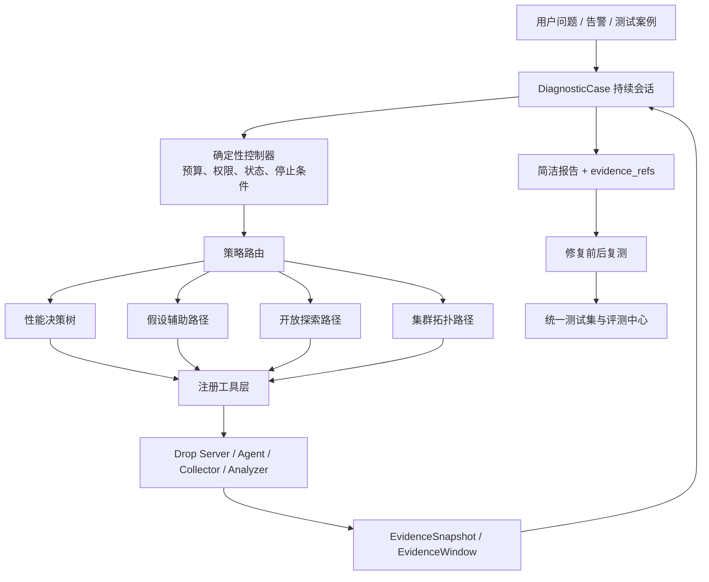

# 导师意见驱动的统一 AI 诊断与测试集方案

> 方案代号：EvidenceLoop Benchmark Edition  
> 工程边界：保留组长仓库和 Drop 全部复刻能力，只收敛 AI 编排、证据、快照、交互和评测。  
> 判断标准：导师明确认可的方向优先；存在争议的方案进入 A/B 测试；导师明确指出偏题或价值不足的内容不作为主线。

## 1. 从资料中提炼出的导师意见

### 1.1 明确认可，必须实现

| 导师意见 | 工程化落点 |
|---|---|
| 单次“快照式”诊断信息不足 | 一个 `DiagnosticCase` 内允许多轮采集、追问、验证和复测 |
| 应在单次会话内完成，不要复制命令到外部 | AI 生成计划，规则程序调用 Drop 工具，结果自动回流同一会话 |
| 报告过于繁琐 | 默认只展示根因、证据、影响、下一步；审批和工具细节放专家模式 |
| 需要源码级热点分析 | 从服务→实例→进程→线程→函数→文件/源码行逐层定位 |
| 使用包含标准答案的测试集 | 建立统一 Manifest，记录期望根因、位置、证据和修复 |
| 从互联网开源项目提取真实性能问题 | 使用 OpenTelemetry Demo、RCAEval，并引入真实 PR 性能修复子集 |
| 先准备 10 类典型问题 | 统一首批 10 案例，所有 AI 策略使用同一测试集 |
| 参考循证医学 | 所有结论必须有 `evidence_refs`；支持、证伪和未知分开记录 |
| 参考性能决策树 | 采用“应用指标→资源定界→Profiling→Tracing→源码”的渐进路径 |
| 固定阈值容易漏报 | 优先比较基线、同类实例和变化点，固定阈值只作兜底 |
| 规则程序 + AI 的 MVP 可行 | AI 理解、规划和解释；Drop 负责执行、权限、状态与追溯 |
| 要有可运行 Demo 和验证结果 | 方案发布必须同时附运行日志、评测报告和失败案例 |

### 1.2 有条件保留

| 内容 | 处理 |
|---|---|
| 假设驱动 | 保留为一种策略，但假设不是封闭答案；必须与无假设探索路径 A/B 对比 |
| 探针审批 | R0/R1 轻量只读探针自动执行；R2 及变更操作人工确认，避免默认页面过于繁琐 |
| 多机集群诊断 | 保留组长能力，放在真实服务拓扑案例中验证，不单独另起一套 AI |
| 持续监测 | 当前只做“事件触发后的持续诊断会话”，长期自治监控放后续 |
| 快照 | 保留不可变证据快照，但不再把“一张快照”当成整个诊断过程 |

### 1.3 不作为当前主线

- 将“Worker 到对象存储上传失败”包装成性能根因：它属于平台可靠性故障，应单独分类；
- 仅靠简单 CPU 阈值和几个规则宣称智能诊断；
- 只输出方案、模拟 JSON 或漂亮报告，不跑真实进程；
- 在没有业务基线时做全天候自治异常判断；
- 初期就建设重量级多 Agent 协商、投票或复杂自治系统；
- 让 AI 在完整原始遥测中自由搜索，导致上下文爆炸和无效试错。

## 2. 外部项目调研结论

### 2.1 统一测试集的主数据源

#### RCAEval：离线遥测基准

- 项目：<https://github.com/phamquiluan/RCAEval>
- 论文覆盖 ASE 2024、WWW 2025；
- 735 个微服务故障案例；
- 11 类故障；
- 包含 Online Boutique、Sock Shop、Train Ticket；
- 覆盖 metrics、logs、traces 和部分代码级故障；
- 自带 15 种 RCA baseline 和统一评测方法。

**采用方式：**作为离线大样本横向评测集，重点评价服务/指标定位，不要求 Mini-Drop 在本机重放全部 735 个案例。

#### OpenTelemetry Demo：可运行 Demo 主环境

- 项目：<https://github.com/open-telemetry/opentelemetry-demo>
- 多语言微服务系统；
- Docker/Kubernetes 可运行；
- 官方 Feature Flag 内置 CPU、内存泄漏、GC、队列积压、服务不可达、流量洪峰和延迟注入等场景；
- 同时产生 metrics、logs、traces，适合验证 Drop 的 profiling 证据。

**采用方式：**作为首批 10 个案例的主要可执行环境，录屏和端到端验收优先使用。

### 2.2 AI 诊断对照基准

#### OpenRCA

- 项目：<https://github.com/microsoft/OpenRCA>
- ICLR 2025；
- 面向 LLM 根因定位；
- 使用 KPI、依赖 Trace 图和日志；
- RCA-agent 通过 Python 工具检索数据，避免把全部遥测塞进上下文。

**采用方式：**借鉴“LLM 推理 + 受限数据检索工具”的结构和评价字段。其推荐资源约 32GB 内存、80GB 磁盘，不作为当前 16GB 本地环境的主执行集。

#### HolmesGPT

- 项目：<https://github.com/HolmesGPT/holmesgpt>
- CNCF Sandbox SRE Agent；
- 使用工具集查询实时可观测数据；
- 对大结果做服务端过滤、落盘和上下文预算控制；
- 默认只读并遵循 RBAC。

**采用方式：**借鉴 Toolset、上下文预算、只读默认值和连续调查循环，不引入其完整平台。

### 2.3 Profiling 与源码定位

#### Grafana Pyroscope

- 项目：<https://github.com/grafana/pyroscope>
- 持续 CPU、内存和 IO Profiling；
- 支持时间窗口回看和源码行级定位；
- 可关联服务标签和 Trace。

**采用方式：**借鉴 Profile Chunk、时间窗口、标签和差分火焰图的数据模型。Mini-Drop 仍使用现有 Agent/Collector，不替换成 Pyroscope。

### 2.4 真实修复代码数据

#### SWE-Perf / SWE-fficiency

- SWE-Perf：140 个来自真实 GitHub 性能优化 PR 的案例；
- SWE-fficiency：498 个真实仓库工作负载案例；
- 包含基准代码、专家补丁、测试和 before/after 性能。

**采用方式：**只选经过本机重复测量仍稳定的 Python 子集，用于“定位后如何修复”的 T3 评测。

**注意：**2026 年的跨机器复现实验指出部分性能优化基准对硬件和噪声敏感，因此不能直接把全部任务当可靠标准答案。进入 Mini-Drop 前必须执行预热、多次重复、置信区间和跨机器稳定性检查。

### 2.5 RCA 算法基线

#### PyRCA

- 项目文档：<https://opensource.salesforce.com/PyRCA/>
- 提供统计、因果图和领域知识结合的 RCA 方法；
- 有统一接口和 benchmark 支持。

**采用方式：**作为规则/统计基线，不让 LLM 与“零算法”对比；至少比较简单规则、PyRCA/RCAEval baseline 和 AI 策略。

## 3. 最终产品定位

Mini-Drop 的 AI 不是聊天客服，也不是自动执行任意命令的通用 Agent，而是：

> 一个建立在 Drop 真实采集链路上的循证性能诊断编排器。它把用户症状拆成渐进式检查，复用历史证据并按需采新数据，最终定位到服务、进程、函数或源码，并用标准答案测试集持续校准。

## 4. 总体架构



## 5. 快照重新设计

### 5.1 快照不是诊断

原问题是系统把一次采集结果直接当成最终上下文。新的定义是：

- `EvidenceSnapshot`：某一时刻的不可变证据；
- `EvidenceWindow`：一段时间内的 metrics/logs/traces/profiles 集合；
- `DiagnosticCase`：跨多个窗口、多个轮次的完整诊断过程。

### 5.2 EvidenceSnapshot 必须包含

```text
snapshot_id
case_id
round_index
captured_at
time_range
service / instance / agent / pid
workload_identity
deployment_version
host_fingerprint
collector / collector_version
task_id / attempt_id / artifact_ids
baseline_ref
profile_chunk_refs
metric_refs / log_refs / trace_refs
quality
sha256
```

### 5.3 快照使用原则

1. 快照只追加，不覆盖；
2. 新采集必须关联原 Case 和上一轮；
3. 支持 incident、baseline、peer、verification 四种证据角色；
4. AI 读取摘要，原始数据通过工具按需查询；
5. 报告引用快照和 Artifact，不能只引用 AI 生成文本。

## 6. 假设机制重新设计

### 6.1 保留假设，但取消封闭答案空间

状态：

```text
PROPOSED
SUPPORTED
WEAKENED
FALSIFIED
UNKNOWN
```

规则：

- 初始假设不能限制开放探索；
- 每条证据可以支持、削弱、证伪，也可以与所有假设无关；
- “未解释证据”必须保存，并可触发新假设；
- 没有足够证据时输出 `INSUFFICIENT_EVIDENCE`；
- 所有假设都被证伪后，转入开放探索，不在错误选项中强行选一个。

### 6.2 必须做 A/B 对比

- A：假设辅助 + 决策树；
- B：无初始假设 + 决策树开放探索；
- C：集群拓扑 + 决策树 + 假设的混合路径。

最终根据统一测试集选择默认值，而不是现在主观认定假设一定有用或一定有害。

## 7. 性能决策树

```text
症状确认
→ 区分性能问题、平台可靠性问题和信息不足
→ 确认影响范围：单实例 / 同宿主机 / 全服务 / 上下游
→ 应用层：吞吐、错误率、延迟
→ 资源层：CPU、内存、IO、网络、调度
→ Profiling：线程、调用栈、热点函数
→ Tracing：真正变慢的链路节点
→ 源码：文件、函数、行号
→ 修复建议
→ before/after 复测
```

每个节点都定义：

- 进入条件；
- 可调用工具；
- 需要的证据；
- 支持/证伪条件；
- 最大成本；
- 下一节点；
- 停止条件。

控制器执行决策树，LLM 只能在允许的分支内选择和解释，减少发散。

## 8. 统一测试集

### 8.1 四层结构

| 层级 | 数据源 | 用途 | 运行频率 |
|---|---|---|---|
| T0 | 现有 Mini-Drop Golden JSON | 状态、Schema、证据引用、安全回归 | 每次提交 |
| T1 | OpenTelemetry Demo + Mini-Drop 故障注入 | 10 类真实端到端案例 | 每日/发布前 |
| T2 | RCAEval | 735 个遥测 RCA 横向评测 | 周期性 |
| T3 | 稳定筛选后的 SWE-Perf/SWE-fficiency | 源码定位、补丁和复测 | 里程碑 |

### 8.2 首批统一 10 类

1. CPU 热点；
2. 内存泄漏；
3. GC 压力；
4. IO 争用；
5. 网络延迟/丢包；
6. 队列积压；
7. 下游不可达或超时；
8. 流量洪峰导致资源饱和；
9. 同宿主机噪声邻居；
10. 源码级低效函数。

另外保留“平台上传失败”作为**定界案例**，标准答案应为 `PLATFORM_RELIABILITY`，用于检查 AI 会不会把非性能问题误判成性能瓶颈。

### 8.3 每个案例的统一标准答案

```text
case_id
source_project / source_revision
fault_type
fault_trigger
workload
symptom
expected_scope
expected_root_cause
expected_service / instance / process
expected_function / file / line
required_evidence
forbidden_claims
gold_fix_ref
before_metrics / after_metrics
environment
stability_policy
```

## 9. 评价指标

不能只评“最终分类对不对”，需要同时评过程：

- Scope Accuracy：影响范围是否正确；
- RCA Top-1 / Top-3：根因排名；
- Function/File Hit：函数和文件命中；
- Evidence Precision：引用证据中真正相关的比例；
- Evidence Completeness：标准答案要求的证据覆盖率；
- Unsupported Claim Rate：无证据断言率；
- Unknown Calibration：证据不足时是否正确停下；
- Diagnostic Path Efficiency：工具调用数和耗时；
- User Adoption：建议是否清楚、可执行；
- Repair Validation：修复后是否确实改善且功能测试通过；
- Collection Overhead：采集对业务 CPU、内存和延迟的影响。

## 10. 页面收敛

默认页面只展示：

1. 问题；
2. 当前检查到哪一步；
3. 当前最可能根因；
4. 三条关键证据；
5. 还缺什么证据；
6. 下一步按钮；
7. 最终修复建议和复测结果。

专家模式再展示：

- 假设图；
- 决策树；
- 快照列表；
- SUPPORT/FALSIFY；
- 工具参数；
- 审批；
- 预算；
- 原始 Artifact。

这样既保留组长基底和完整工程能力，也符合导师“用户丢问题，系统给简洁结论”的要求。

## 11. 实施顺序

### P0：一周内

1. 固化统一测试集 Manifest 和 10 类案例；
2. 完成 `DiagnosticCase` 兼容聚合；
3. 增加 Snapshot/Window/Turn；
4. 单会话自动回流工具结果；
5. 跑通 OpenTelemetry Demo 的 CPU、内存、GC 三例；
6. 输出简洁报告；
7. 对假设路径和开放路径做第一次 A/B。

### P1

1. 补齐 10 个 T1 案例；
2. 接入 RCAEval 数据适配器；
3. 增加评测中心；
4. 加入同类实例与历史基线；
5. 定位到函数/文件；
6. 记录所有失败案例。

### P2

1. 筛选稳定的真实性能修复 PR；
2. 源码上传、符号和版本关联；
3. 自动生成补丁建议；
4. 人工确认后复测；
5. 两台 Worker、多服务和偶发故障时间窗口。

## 12. 验收标准

最终汇报不以“做了几个页面”为标准，而是展示：

1. 同一问题在一个会话内完成三轮以上取证；
2. 每轮都有真实 Task、Artifact 和 Snapshot；
3. AI 能证伪至少一个错误假设；
4. AI 能在证据不足时停止；
5. 10 个案例有标准答案和统一评分；
6. 对比有假设/无假设两种路径；
7. 至少三个真实案例定位到函数或文件；
8. 至少一个案例完成修复前后复测；
9. 原 Drop 复刻功能完整回归；
10. 报告简洁且每个结论可追溯。

