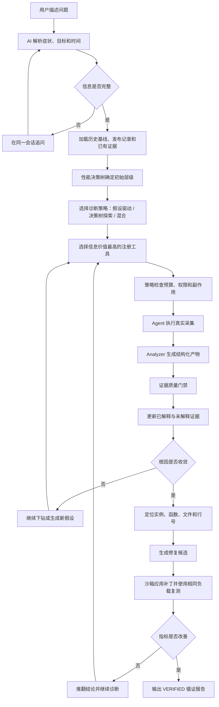

# 洛洛独立 AI 方案：循证开放式性能诊断

> 方案名称：EvidenceLoop（循证诊断闭环）  
> 核心定位：AI 不在预设答案中选一个，而是沿性能决策树主动取证，允许发现未知根因，并通过修复前后对照验证结论。  
> 方案来源：导师提出的“循证医学、性能决策树、测试集、开源项目真实性能问题”四个方向。

---

## 0. 实施边界：保留基底，只优化 AI

本方案不是重写组长仓库，也不是用新 AI 页面替代 Drop 复刻功能。实施时遵守以下边界：

- 组长仓库继续作为统一工程基底；
- 保留 Server、Agent、Analyzer、Web 四组件；
- 保留 Agent 注册、心跳、离线恢复、任务领取和能力上报；
- 保留 Task、TaskAttempt、TaskEvent、Artifact、AnalysisJob、状态机、重试和错误处理；
- 保留 perf、eBPF、py-spy 及当前所有采集器；
- 保留数据库、对象存储、HTTP/gRPC、审计、日志和部署能力；
- 保留任务面板、结果详情、历史、审计及集群拓扑诊断能力；
- 组长的多服务、多实例、拓扑关联方案作为 `cluster_topology_strategy`；
- EvidenceLoop 增加决策树、开放世界、测试集和修复验证，不覆盖原能力；
- 旧接口和历史数据通过 Adapter 兼容，回归通过前不直接删除旧代码。

更完整的实现状态与兼容边界见 [跨语言实现状态](../architecture/implementation-status.md) 和
[兼容路径下线台账](../architecture/兼容路径下线台账.md)。

---

## 1. 为什么要重新定义方案

项目早期同时存在：

- `Drop Insight`；
- `AI 集群诊断`。

两个页面都在做诊断会话、假设、探针、证据和报告，产品定位重叠。继续分别增加功能，会产生：

- 两套 API；
- 两套状态机；
- 两套诊断对象；
- 两套前端交互；
- 同一个问题得到不同结论；
- 用户不知道应该进入哪个页面。

AI 集群诊断主要来自组长提出的“多服务、多实例、拓扑关联”方向。这个方向有价值，但不是本方案的核心创新。

本方案选择另一条主线：

> 不要求用户先描述完整集群，也不把根因限制在预设假设中。系统从症状出发，沿性能决策树逐层取证；不知道时继续探索，找到函数和源码位置后，再通过修复前后对照验证结论。

---

## 2. 当前实现的主要缺点

## 2.1 两个 AI 页面重复

旧 `Drop Insight` 和旧 `AI 集群诊断` 页面都包含：

- 创建会话；
- 提出假设；
- 生成探针；
- 审批；
- 查看证据；
- 生成报告。

区别主要是输入字段和展示方式，而不是底层能力。产品交互可以逐步统一入口，但底层的集群拓扑、假设、工具、证据、审批和历史兼容能力必须保留。

## 2.2 假设可能形成封闭答案空间

当前编排器先生成若干假设，再给假设打分。风险是：

```text
正确根因不在初始假设中
→ 后续只为错误假设找证据
→ 证据被错误解释
→ 系统在错误选项里选出“最高分”
```

这就是聊天记录中提到的“被自己做出的假设误导”。

## 2.3 当前 Golden 评测容易高估效果

当前 7 类 Golden 场景主要使用结构化 JSON 数据，适合做规则回归，但存在几个问题：

- 不一定真实启动故障程序；
- 不一定真实执行采集器；
- 诊断规则可能已经知道场景结构；
- 没有验证函数和代码行；
- 没有验证修复后性能是否恢复；
- 7/7 通过不能代表对新问题的泛化能力。

## 2.4 诊断仍然偏一次性快照

虽然系统有多轮状态机，但用户仍缺少自然的持续交互：

- 补充上下文；
- 执行建议；
- 查看执行结果；
- 继续追问；
- 验证修复；
- 在同一会话关联历史证据。

## 2.5 结论没有完成修复验证

当前流程一般结束于“建议优化某函数”。但性能诊断的真正闭环应是：

```text
发现异常
→ 定位根因
→ 提出修复
→ 应用修复
→ 使用相同负载复测
→ 确认指标恢复
```

如果没有最后的对照实验，结论仍然只是推测。

## 2.6 函数和源码级证据不足

导师希望能定位到更具体的层级。当前火焰图可以显示函数，但还没有稳定连接：

```text
火焰图节点
→ 文件
→ 函数
→ 行号
→ 源码片段
→ 修复代码
→ 修复后结果
```

## 2.7 固定阈值容易漏报

仅使用“CPU > 80%”这类规则，会忽略：

- 平时 CPU 只有 5%，突然升到 40%；
- 某些服务长期稳定在 85%；
- 多实例中只有一个实例偏离；
- 故障只持续数秒；
- 延迟升高但 CPU 不高。

需要引入历史基线、同类实例对比和故障前后对比。

---

## 3. 独有方案的核心思想

## 3.1 循证医学式诊断

把性能诊断类比成医生诊断：

| 循证医学 | 性能诊断 |
|---|---|
| 症状 | 延迟升高、CPU 异常、OOM、IO 慢 |
| 病史 | 历史基线、版本变化、最近发布 |
| 初步检查 | 系统指标、进程指标 |
| 鉴别诊断 | 多个可能根因 |
| 检查项目 | perf、eBPF、py-spy、trace、数据库指标 |
| 阳性证据 | 支持某个根因的数据 |
| 阴性证据 | 与某个根因冲突的数据 |
| 排除诊断 | 被反证推翻的根因 |
| 治疗方案 | 代码、配置或容量优化 |
| 复诊 | 修复后使用同一负载复测 |

重点不是“AI 猜得像不像”，而是：

- 结论用了哪些证据；
- 哪些证据可以推翻结论；
- 是否还有未解释的信息；
- 修复后是否真的改善。

## 3.2 性能决策树

系统先沿稳定决策树确定问题层级，再让 AI 在该层级内规划工具。

```text
业务指标是否异常？
├─ 否：检查告警有效性或偶发窗口
└─ 是
   ├─ 资源是否饱和？
   │  ├─ CPU：进入 CPU profiling
   │  ├─ 内存：进入分配、RSS、GC 分析
   │  ├─ IO：进入磁盘延迟和阻塞分析
   │  └─ 网络：进入丢包、重传和连接分析
   ├─ 单实例异常还是同类实例共同异常？
   ├─ 应用内部还是等待下游？
   ├─ 是否与版本或配置变更相关？
   └─ 已有证据能否定位到函数或调用链？
```

决策树负责保持诊断方向，避免 AI 无限制发散。

AI 负责：

- 理解用户描述；
- 选择决策树分支需要的数据；
- 在证据冲突时调整路径；
- 解释结果；
- 提出下一项最有信息价值的检查。

## 3.3 开放世界诊断

系统必须承认：

> 正确根因可能不在当前假设中。

因此每次诊断都保留：

- `UNKNOWN` 未知根因；
- `UNEXPLAINED_EVIDENCE` 未解释证据；
- `NEW_HYPOTHESIS` 新假设入口；
- `INSUFFICIENT_EVIDENCE` 证据不足终态；
- `OUT_OF_DISTRIBUTION` 测试集外问题。

假设只是辅助结构，不是答案列表。

如果所有假设得分都低，系统不选择最高分，而是：

1. 汇总未解释证据；
2. 回到决策树上一级；
3. 扩大检查层级；
4. 生成新假设；
5. 或明确返回未知。

## 3.4 双路径诊断对照

根据聊天记录中“一个用假设、一个不用，在测试集里比较”的建议，系统实现两条可插拔策略。

### 路径 A：假设驱动

```text
症状
→ 生成候选假设
→ SUPPORT / FALSIFY 取证
→ 假设排序
→ 输出结论
```

适合常见、已有经验的问题。

### 路径 B：决策树探索

```text
症状
→ 判断问题层级
→ 选择信息增益最大的检查
→ 发现异常证据
→ 向函数、调用链或节点下钻
→ 根据证据形成结论
```

它不要求一开始就生成根因假设，更适合未知问题。

### 对照方式

两条路径共享同一证据仓库，但分别记录：

- 探针数量；
- 诊断耗时；
- 根因是否命中；
- 函数是否命中；
- 错误结论；
- 无效工具调用；
- 对生产的额外开销。

最终由测试集决定：

- 哪条路径整体更好；
- 哪类问题适合哪条路径；
- 是否需要混合策略。

不是由大模型自己评价自己。

## 3.5 修复前后对照验证

每个真实案例保存：

- 有问题的版本；
- 修复版本或补丁；
- 固定工作负载；
- 故障指标；
- 预期根因；
- 预期热点函数；
- 修复后指标。

诊断完成后，系统运行相同负载进行对照：

```text
before：p95 820ms，hot_function 68%
after： p95 130ms，hot_function 8%
```

只有修复后关键指标按预期改善，根因结论才标记为 `VERIFIED`。

这部分是本方案区别于普通 AI 分析报告的重要能力。

---

## 4. EvidenceLoop 完整流程



---

## 5. AI 在方案中的职责

AI 负责：

1. 将自然语言转换为结构化症状；
2. 在信息不足时追问；
3. 根据决策树状态选择下一项检查；
4. 生成和更新候选假设；
5. 识别尚未解释的证据；
6. 选择 SUPPORT 或 FALSIFY 工具；
7. 将性能数据解释成人话；
8. 将热点函数与源码上下文关联；
9. 生成修复候选；
10. 总结修复前后对照结果。

AI 不负责：

- 编造主机、PID 或时间；
- 直接执行任意 Shell；
- 自己生成证据 ID；
- 自己决定证据是否合格；
- 随意生成置信度；
- 自己判断修复是否成功；
- 在未知时强制选择一个根因。

---

## 6. 需要的新核心对象

## 6.1 DiagnosticCase

统一替代两套页面中的 Diagnosis Session。

```text
case_id
query
target_scope
time_range
strategy
status
current_decision_node
open_questions
unexplained_evidence
created_at
updated_at
```

## 6.2 DiagnosticTurn

记录持续对话：

```text
turn_id
case_id
actor
message
input_refs
output_refs
created_at
```

## 6.3 DecisionNode

记录性能决策树经过的节点：

```text
node_id
question
required_evidence
result
next_nodes
decision_reason
```

## 6.4 Finding

不是所有 Finding 都必须来自预设假设：

```text
finding_id
layer
statement
supporting_evidence
contradicting_evidence
unexplained_evidence
confidence
status
```

## 6.5 VerificationRun

记录修复验证：

```text
verification_id
case_id
patch_ref
workload_ref
before_metrics
after_metrics
acceptance_rules
status
```

---

## 7. 当前统一页面

## 7.1 合并产品入口，但保留底层能力

当前产品入口已经收敛为 `/ai-diagnosis`。这减少了两个相似入口带来的困惑，但没有删除组长的集群拓扑诊断能力或 Drop Insight 循证能力。Adapter 继续统一读取旧会话，旧 API 和历史数据只作为兼容层保留。

当前菜单为：

```text
AI 诊断
任务面板
诊断历史
评测中心
审计日志
系统设置
```

## 7.2 AI 诊断页面

默认只显示：

- 问题输入框；
- 自动发现的服务、Agent 和 PID；
- 当前诊断阶段；
- 对话时间线；
- AI 下一步建议；
- 一键执行；
- 当前结论；
- 证据摘要。

专家模式展开后显示：

- 性能决策树；
- 假设和 Finding；
- SUPPORT / FALSIFY；
- 未解释证据；
- 工具调用；
- 预算；
- 完整审计。

## 7.3 评测中心

新增独立页面：

- 选择测试集；
- 选择诊断策略；
- 批量运行；
- 对比假设路径和决策树路径；
- 查看根因、函数、证据和修复命中率；
- 查看失败案例；
- 对比版本回归。

---

## 8. 测试集设计

## 8.1 测试集来源

优先选择：

- 热门开源项目已合并的性能修复 PR；
- 有复现步骤；
- 有修复前后代码；
- 有明确性能指标；
- 能在本地或容器中稳定复现；
- 能定位到具体函数。

每个案例保存：

```text
repository
bug_commit
fix_commit
patch
workload
expected_root_cause
expected_layer
expected_function
expected_evidence
before_metrics
after_metrics
```

## 8.2 第一版十类场景

1. Python CPU 热点；
2. 锁竞争；
3. 内存泄漏；
4. 磁盘 I/O；
5. CPU + I/O 复合瓶颈；
6. 同机噪声邻居；
7. 下游慢调用；
8. 网络丢包或重传；
9. 数据库锁等待；
10. 测试集外未知问题。

第 10 类专门验证系统能否正确回答“不知道”，避免封闭假设空间。

## 8.3 评测指标

| 指标 | 说明 |
|---|---|
| Root Cause Top-1 | 第一结论是否正确 |
| Root Cause Top-3 | 正确根因是否进入前三 |
| Layer Accuracy | 应用、OS、网络、数据库层级是否正确 |
| Function Accuracy | 是否定位到正确函数 |
| Evidence Integrity | 引用证据是否真实存在 |
| Open-set Recall | 未知问题是否被识别为未知 |
| Probe Efficiency | 使用了多少探针 |
| Time to Diagnosis | 完成诊断需要多久 |
| Repair Verification | 修复后指标是否按预期改善 |
| Unsafe Actions | 是否出现不合规执行 |

---

## 9. 与组长 AI 集群诊断的区别

| 方向 | AI 集群诊断 | EvidenceLoop |
|---|---|---|
| 起点 | 用户描述服务拓扑和实例 | 用户描述症状，系统逐步发现范围 |
| 核心结构 | 多实例、依赖图和候选假设 | 循证决策树、开放探索和对照实验 |
| 假设 | 主要诊断组织方式 | 可选策略，不限制答案空间 |
| 未知问题 | 容易落入已有分类 | 有 UNKNOWN 和测试集外识别 |
| 结果 | 根因和优化建议 | 根因、函数、修复及修复后验证 |
| 评测 | Golden 分类和 Oracle | 开源故障、代码补丁和 before/after |
| 产品重点 | 集群根因定位 | 可验证的诊断与修复闭环 |

两者可以共享 Agent、Collector 和 Analyzer，但 AI 决策逻辑和产品目标不同。

---

## 10. 改造优先级

## P0：先完成

1. 建立原 Drop 复刻能力的零回退基线；
2. 增加 `DiagnosticCase + Adapter`，统一读取两类会话但不删除旧对象；
3. 增加同一会话持续交互；
4. 增加性能决策树状态；
5. 增加 UNKNOWN 和未解释证据；
6. 实现假设驱动与决策树探索两种策略；
7. 建立一个真实 Python 混合负载案例；
8. 跑通函数级定位；
9. 生成一页简洁报告；
10. 录制完整 Demo。

## P1：随后完成

1. 将测试集扩展到 10 个；
2. 增加评测中心；
3. 增加源码片段关联；
4. 保存修复补丁；
5. 实现修复前后复测；
6. 增加策略 A/B 对比；
7. 使用基线和同类实例比较代替固定阈值。

## P2：最后扩展

1. 两台 Worker；
2. 多服务调用链；
3. 偶发故障时间窗口；
4. Continuous Profiling 历史证据；
5. 版本发布与性能回归关联。

---

## 11. 下一次应该演示什么

建议使用一个 CPU + 锁竞争的复合案例：

1. 用户输入“接口变慢，帮我定位”；
2. 系统自动发现目标实例；
3. 决策树先判断应用层和资源层；
4. 假设路径生成 CPU 热点和锁竞争候选；
5. 决策树路径独立选择指标和 py-spy；
6. 系统找到真实热点函数；
7. 显示锁竞争是主因、CPU 是伴随现象；
8. 应用已知修复补丁；
9. 使用相同负载复测；
10. 显示 p95 和热点比例下降；
11. 评测中心对比两条诊断策略；
12. 报告标记根因为 `VERIFIED`。

这段演示能够同时覆盖导师要求的：

- 循证医学；
- 性能决策树；
- 测试集；
- 开源问题和修复代码；
- 多方案对比；
- 未知根因保护；
- 持续交互；
- 函数级定位；
- 修复验证。
