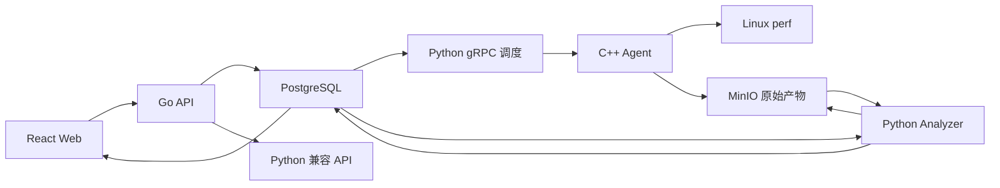

# Mini-Drop 跨语言架构重构实施记录

更新时间：2026-07-31

> **2026-08-06 状态更新**：本记录的历史章节保留作为审计基线。截至 2026-08-06，
> 项目已额外闭环：通用 Transactional Outbox（Go+Python 同事务 + SSE 下游）、
> Schedule/Cron、Composite Task/DAG、修复前后 VERIFIED 验证、CreateTask 幂等三入口一致、
> pprof/pyspy 分析器 + 源码级证据链、claim_verifier/反证门禁/hypothesis_predicate、
> Artifact 生命周期对账、OpenAPI + TaskKind JSON Schema 版本化契约、跨语言 CI 门禁、
> 兼容路径下线台账、Schedule/Composite/Fix 验证的 Web 页面。最新剩余项以
> [`remaining-work.md`](remaining-work.md) 为准；两份复刻指南以
> `architecture/replication-guide.md` 为唯一规范源。

## 1. 重构目标

按照 Drop 复刻指南，将系统职责落实到适合的语言，而不是把所有模块继续堆在 Python 中：

| 层 | 语言 | 当前职责 |
|---|---|---|
| 内核采集层 | C++17 | Agent 注册、心跳、任务领取、perf 采集、资源限制、超时/取消、MinIO 上传 |
| API 与控制入口 | Go 1.23 | Web 唯一 API 入口、鉴权、请求追踪、任务创建/查询、Agent 查询、兼容路由 |
| 分析与 AI | Python 3.11 | Analyzer Worker、火焰图、TopN、规则归因、DeepSeek、循证诊断 |
| Web | React 18 | 任务、Agent、火焰图、诊断会话、审计与系统设置 |

## 2. 当前真实调用链

## 3. 已经原生化的能力

### Go

- `POST /api/tasks`：参数约束、Agent 存在性检查、任务与首条状态事件事务落库。
- `GET /api/tasks`：分页、搜索、白名单排序。
- `GET /api/tasks/{task_id}`：任务详情。
- `GET /api/agents`：Agent 列表。
- `GET /api/healthz`、`GET /api/me`。
- API Key 鉴权、Request ID、结构化访问日志。
- 其余接口反向代理到 Python，SSE 保持流式刷新。

### C++

- gRPC 注册和 5 秒心跳。
- 指定 Agent 的任务领取与结果通知。
- `perf record` 真采集。
- 进程组隔离，支持超时、取消和 Agent 退出联动。
- `RLIMIT_CPU`、`RLIMIT_AS`、`RLIMIT_FSIZE` 资源上限。
- 目标 PID 与容器 PID namespace 证据记录。
- 原始 `perf.data` 上传 MinIO。
- 代码已拆分为配置、任务契约、进程执行器、产物上传器和主循环。

### Python

- 原始产物契约校验。
- AnalysisJob 租约、重试和状态回写。
- 火焰图、TopN 和可验证归因。
- DeepSeek 自然语言解析与循证诊断；密钥只存在本地 `.env`。

## 4. 已验证端到端

以下任务不是模拟数据：

| 任务 | 入口 | 采集 | 分析 | 结果 |
|---|---|---|---|---|
| `task_20260731_052050_6bd9ca` | Go 读取/兼容创建 | C++ perf | Python Analyzer | DONE |
| `task_20260731_052344_ed4f3237` | Go 原生创建 | C++ perf | Python Analyzer | DONE |

第二条链路完整经历：

`PENDING → RUNNING → UPLOADING → ANALYZING → DONE`

产物包含真实 `perf.data`，由 C++ Agent 上传，Python Analyzer 生成火焰图和 TopN。

## 5. 仍处于迁移期的边界

以下部分仍由 Python 承担，文档中不得描述成已经完成的 Go/C++ 能力：

1. 生产默认栈为 **C++ 原生 Agent（`native-agent`）**；Python 兼容 Agent 降级为本地开发/回滚路径（`docker compose --profile python-agent up -d agent`）。
2. 调度/Cron Worker（`schedule_worker.py`）、AI 诊断、Analyzer 与 NLP 领域编排仍由 Python 承担。
3. C++ 控制面已为默认 `control-plane`（50051）；Python gRPC 控制面经 `docker-compose.python-control.yml` 保留作回滚。
4. Go 已原生实现任务取消、删除、产物下载、诊断会话查询与 SSE；`/api/schedules` 与 `/api/composite-tasks` 仍经反向代理由 Python 承担（迁移中）。
5. `java_async`（async-profiler）仅在运行时实际存在时声明能力，不用虚假 capability 掩盖缺失依赖。

采用渐进迁移是为了保持现有 eBPF、持续采样、AI 诊断和 Web 演示不回退。下一阶段以接口契约和端到端测试为门禁逐项替换。

## 6. 下一阶段

1. Go 原生实现 `/api/schedules` 的 CRUD、触发与记录查询（cron 解析移植 + parity 测试）。
2. 将 `/api/composite-tasks` 迁移至 Go（N 子任务扇出与取消状态机）。
3. 三机 Worker 安装从 Python Agent 切换为 C++ native agent 二进制。
4. 增加 Go PostgreSQL 集成测试与 C++ Runner 单测。
5. 在 Ubuntu 22.04 真机复跑 perf/eBPF，不以 Docker Desktop 权限结果代替生产验收。

## 7. 2026-08-01 下一阶段结果

### C++ `drop_server` 灰度控制面

- 新增 `native/control`，使用 C++17、gRPC、libpqxx 和 PostgreSQL 共享状态机。
- 原生实现 Agent 注册、配置下发、5 秒心跳、任务抢占、取消通知和结果回调。
- 使用 `FOR UPDATE SKIP LOCKED` 领取任务，避免多个 Agent 重复领取。
- 每次迁移继续写入 `task_status_events`，并以 `served_by=cpp-control` 标记执行边界。
- 该灰度实例现为 `native-control-plane`（50052）；C++ 控制面已升为默认 `control-plane`（50051），Python gRPC 经 `docker-compose.python-control.yml` 保留作回滚。

灰度任务 `task_20260801_063504_6251443f` 完整经过：

`Go API 创建 → C++ 控制面下发 → C++ Agent perf 真采集 → MinIO → Python Analyzer → DONE`

### C++ Collector 插件注册表

- 新增 `Collector` 接口和 `CollectorRegistry`，主循环不再写死 perf 命令。
- `perf_cpu` 已迁入独立 C++ 插件，回归任务 `task_20260801_064657_bd783d0b` 为 DONE。
- `ebpf_io` 已迁入 C++ 插件，使用 bpftrace block tracepoint，生成 `ebpf_metrics` 与 `ebpf_raw` 契约产物。
- 插件在 tracefs 缺失、探针失败或零样本时均返回明确 FAILED，不把空结果包装成成功。

当前 Docker Desktop 环境的验证任务 `task_20260801_064604_9c90bafb` 明确返回：

`tracefs is unavailable; run on native Linux with BPF/PERFMON permissions`

这证明插件路由和失败状态机已经跑通，但不等价于 eBPF 生产验收。最终 eBPF DONE 仍需在 Ubuntu 22.04 原生 Linux 上制造真实 IO 后验证。

### 回归结果

- C++ Agent 镜像（含 perf、bpftrace 和插件注册表）编译成功。
- Python：`470 passed`。
- Go：`go test ./...` 通过。
- React：`npm ci && npm run build` 通过。

## 8. 2026-08-01 Go 控制 API 与持久化事件流

### 已迁移到 Go 的接口

- `POST /api/tasks/{task_id}/cancel`：在 PostgreSQL 事务中锁定任务、校验可取消状态、更新任务与最新执行尝试、写入状态事件和审计日志。
- `GET /api/tasks/{task_id}/events`：直接读取完整状态迁移历史。
- `GET /api/tasks/{task_id}/attempts`：读取执行尝试、租约、执行时间和 Analyzer 元数据。
- `GET /api/tasks/{task_id}/artifacts`：读取产物类型、MinIO 对象键、大小、内容类型和采集契约元数据。
- `GET /api/audit-logs`：提供分页审计查询。
- `GET /api/events/stream`：不再依赖 Python 进程内事件总线，改为轮询 PostgreSQL 持久化事件并分发 SSE。

SSE 目前统一分发三类事件：

1. `task_changed`：来自 `task_status_events`；
2. `agent_status`：来自 `audit_logs` 中的 `AGENT_ONLINE/AGENT_OFFLINE`；
3. `diagnosis_complete`：来自 `diagnosis_events` 中的 `diagnosis_completed`。

断线续传游标采用 `t:<task>;a:<audit>;d:<diagnosis>` 复合格式，同时兼容旧的纯数字任务游标。

### 真实验收结果

- 取消链路任务：`task_20260801_071045_64721a07`。
- 状态链路：`PENDING → RUNNING → CANCELLED`。
- 执行边界：Go 创建、C++ 控制面领取、Go 取消。
- 取消响应包含 `served_by=go-apiserver`，状态事件分别包含 `go-apiserver` 与 `cpp-control` 证据。
- 对同一终态任务再次取消返回 HTTP `409`，没有重复写入状态迁移。
- SSE 已现场收到任务取消、Agent 离线和诊断完成三类事件。
- Go 产物接口已读取任务 `task_20260801_064657_bd783d0b` 的真实 `perf.data`、火焰图、TopN 和建议产物；不存在任务返回 HTTP `404`。

### AI Worker 稳定性修复

发现旧诊断会话处于 `NEEDS_SCOPE_CONFIRMATION` 或 `WAITING_APPROVAL` 时，后台 Worker 仍会每两秒尝试推进，产生非法状态迁移并持续写入 `advance_failed`。现已把这两类状态定义为明确的人工门禁状态，只有范围确认或审批接口可以解除；Worker 扫描时直接跳过。

修复后连续观察，`advance_failed` 数量保持 `41138 → 41138`，不再增长。新增回归测试确保重复扫描人工门禁会话不会新增失败事件。

### 本阶段回归

- Python：`471 passed`；
- Go：`go test ./...` 通过；
- React：`npm run build` 通过；
- Compose：配置校验通过，Go API、Python Server、Diagnosis Worker 均健康。

### 尚未完成的生产验收

- eBPF 插件仍需在 Ubuntu 22.04 原生 Linux 上制造真实 IO 抖动并取得 `DONE` 结果；Windows Docker Desktop 的 tracefs 限制只用于验证明确失败路径。
- 产物内容流式下载、任务删除和 AI 会话等剩余 API 仍由 Go 反向代理到 Python，后续按接口契约逐项迁移。任务删除涉及 9 张带外键的执行与 AI 证据表，迁移前需先确定“保留诊断证据”还是“级联清理”的产品语义，不能直接照搬旧删除逻辑。

### 2026-08-06 安全与构建加固

- Go 到 Python 的兼容代理使用独立内部令牌，并由 Go 删除客户端伪造的可信网关头后重新注入 Principal、角色和资源范围。
- 删除接受任意 bucket/key 的公开预签名接口；浏览器通过任务归属校验后的 Artifact 内容或流式下载接口访问产物。
- 生产认证 Cookie 自动启用 `Secure`，C++ CI 同时构建 `native/control` 与 `native/agent`。
- C++ Agent 的 Result Outbox 已纳入主目标链接和 CTest，修复此前未被 CI 暴露的编译问题。

## 9. 2026-08-01 Go 产物内容与流式下载

### 已迁移接口

- `GET /api/tasks/{task_id}/artifacts/{artifact_type}/content`：Go 从 PostgreSQL 解析任务产物，再从 MinIO 读取 JSON、SVG、Markdown 等内容；JSON 由服务端校验并结构化返回。
- `GET /api/tasks/{task_id}/artifacts/{artifact_type}/download`：Go 直接流式转发 MinIO 对象，不把大文件一次性加载进内存。
- 支持持续采样产物的 `index` 窗口参数；非法索引返回 HTTP 400，不存在的任务或产物返回 HTTP 404。

### 安全边界

- bucket 只允许配置的 `MINIO_BUCKET`。
- object key 必须属于 `tasks/{task_id}/`，拒绝绝对路径、空路径段和 `..` 路径穿越。
- 下载文件名移除路径、控制字符、引号和分号，并设置 `Content-Disposition` 与 `X-Content-Type-Options: nosniff`。
- 在线内容预览限制为 16 MiB；更大的产物必须走流式下载。
- 只存在本地路径的历史产物继续回退到 Python 兼容接口，保留回滚能力。

### 真实验收

使用真实任务 `task_20260801_064657_bd783d0b` 验证：

- `top_json/content` 返回真实 perf TopN 数据；
- `flamegraph_svg/content` 返回 14,079 字节 SVG 文本；
- `flamegraph_svg/download` 返回 HTTP 200、`image/svg+xml`、长度 14,079；
- 下载 SHA-256：`82A24CACD7C356638758C61A40652D8B8EA9354FFF739A80D8C4BD0BF49D768F`；
- `index=abc` 返回 HTTP 400，缺失产物返回 HTTP 404；
- Go 单元测试与镜像内构建测试全部通过，Compose 配置有效，重建后的 `apiserver` 健康。

## 10. 2026-08-01 Go 任务归档与证据保留

- `DELETE /api/tasks/{task_id}` 已由 Go 原生实现，不再执行高风险级联硬删除。
- 仅 `DONE / FAILED / CANCELLED` 可归档；活动任务返回 HTTP 409。
- 归档在 PostgreSQL 事务内锁定任务并写入 `deleted_at / deleted_by / delete_reason` 和 `TASK_ARCHIVED` 审计。
- 默认任务列表、详情、产物和事件接口过滤已归档任务，但数据库状态事件、执行尝试、Artifact、MinIO 对象和 AI 诊断证据继续保留。
- Python SQLAlchemy 仓储已同步相同语义，Agent 不会领取已归档任务。
- Web 确认框已从“不可撤销的级联删除”调整为“归档并保留证据”。

真实集成测试验证：终态归档 HTTP 200、活动任务 HTTP 409、归档后详情 HTTP 404；数据库中 Artifact、DiagnosisRun、StatusEvent 和归档 Audit 各保留 1 条。测试夹具在验证后已清理。

详细策略见 [`../ai/task-archive-policy.md`](../ai/task-archive-policy.md)。

## 11. 2026-08-01 AI 诊断只读查询面迁移到 Go

### 迁移边界

本阶段没有把模型推理机械搬到 Go，而是按职责拆分：

- Go 原生读取 `GET /api/v1/diagnoses`、`GET /api/v1/continuous-diagnosis-triggers` 和 `GET /api/diagnostic-cases`；
- Python 继续负责创建诊断、生成假设、模型调用、探针审批、证据归一化和多轮编排；
- 诊断详情与所有写接口暂时通过 Go 反向代理到 Python，避免改变状态推进和人工门禁语义。

Go 直接合并 `diagnosis_sessions` 与 `drop_insight_sessions`，统一输出来源、策略、目标、时间窗、预算、假设数、证据数、报告版本数和关联任务。当前 `hypothesis_graph.hypotheses` 与早期 `nodes` 两种结构都能正确统计。

### 生产稳定性修复

人工门禁会话原先虽然不会新增 `advance_failed` 事件，但 Worker 每轮仍会申请并释放租约，造成 `row_version` 与 `updated_at` 每两秒增长。现在 `NEEDS_SCOPE_CONFIRMATION` 和 `WAITING_APPROVAL` 在扫描、GET 推进判断和编排内部三层均被识别为暂停状态；只有明确的范围确认或审批操作才能解除。

现场连续轮询并等待后台 Worker 后，样例会话保持：

`15923|2026-08-01 08:28:33.836456+00 → 15923|2026-08-01 08:28:33.836456+00`

即版本号和更新时间均不再发生无业务意义的变化。

### 验证结果

- 三个只读接口均返回 `served_by=go-apiserver`；
- 统一案例共读取 11 条，首批分页和排序正确；
- 现行假设结构由错误的 0 个修正为真实 3 个；
- Python 全量测试：`473 passed`；
- Go 全量测试与镜像内构建通过；
- Go API、Python Server、Diagnosis Worker、Web 均健康。

详细接口边界见 [`../contracts/go-diagnosis-query.md`](../contracts/go-diagnosis-query.md)。

## 12. 2026-08-01 AI 统一详情迁移到 Go

### 本阶段实现

- `GET /api/diagnostic-cases/{case_id}` 已改为 Go + PostgreSQL 原生只读查询；
- 集群诊断详情一次性组装事件、拓扑、探针、覆盖矩阵、证据、证据快照、流水线节点和最新结论；
- Drop Insight 详情继续遵守同一统一案例契约；
- 不存在的案例返回 HTTP 404，合法响应增加 `served_by=go-apiserver`；
- Go 仓储新增覆盖状态归一化、统一案例映射和最新结论选择的回归测试。

### 关键取舍

旧 Python 详情读取可能为了兼容历史数据而初始化流水线节点，导致 GET 请求改变数据库。新 Go 详情严格只读：历史数据缺少某部分时如实返回空集合，不在查询链路制造事实。状态推进、模型调用、审批和探针调度仍归 Python Worker 与编排器负责。

Go 同时兼容现行 `hypothesis_graph.hypotheses` 与历史 `nodes` 结构，因此样例会话的假设数从旧详情误报的 0 修正为真实 3。Go 与 Python 对时间值的 JSON 表示分别可能使用 `Z` 和 `+00:00`，语义均为 UTC；后续将统一契约级格式。

### 真实验收

- 集群诊断样例：8 个事件、1 个探针、1 条覆盖记录、2 条证据、12 个流水线节点；
- Drop Insight 样例可通过同一详情接口读取；
- 两类详情的顶层字段和嵌套字段集合与 Python 兼容接口一致；
- 对同一会话连续读取 5 次，数据库保持 `row_version=11` 且 `updated_at` 不变；
- 经 Web 入口访问返回 HTTP 200，`served_by=go-apiserver`、证据数 2、假设数 3；
- Go 全量测试和镜像内构建通过，重建后的 apiserver 健康。

## 13. 2026-08-01 P0 工程闭环

### C++ Agent 采集能力

Collector Registry 已扩展为以下原生插件：

| Collector | C++ 实现 | 能力声明规则 |
|---|---|---|
| `perf_cpu` | `perf record + perf script` | perf 可用时声明 |
| `ebpf_io` | bpftrace block tracepoint | tracefs/bpftrace 可用时声明 |
| `pyspy` | py-spy speedscope | py-spy 可用时声明 |
| `go_pprof` | Go pprof HTTP 拉取 | curl 可用时声明 |
| `memory_smaps` | `/proc/<pid>/smaps_rollup` 周期快照 | Linux procfs 可用时声明 |
| `sys_metrics` | RSS/线程/FD 周期指标 | Linux procfs 可用时声明 |
| `continuous_perf` | 有界窗口 perf 切片 | perf 可用时声明 |
| `java_async` | async-profiler JFR | 仅运行时存在时声明 |

真实 C++ `memory_smaps` 任务 `task_20260801_114517_d4aa823b` 已完成并上传 `memory_json` Artifact。原生 Ubuntu eBPF 的自动验收入口为 `scripts/verify_native_ebpf.sh`，现场结果仍应在目标内核保存。

### Go AI 写入口

Go 已原生接管以下写接口的入口治理：

- `POST /api/v1/diagnoses`；
- `POST /api/v1/diagnoses/{diagnosis_id}/approvals`。

Go 负责请求大小、未知字段、预算、模式、策略、审批范围与决策值校验，并把接受的控制命令写入审计日志。通过校验后再交给 Python 领域引擎执行推理、证据循环和状态推进。该边界是职责拆分，不把 Python 推理逻辑机械翻译为 Go。

### Alembic Schema 管理

- Compose 新增单实例 `migrate` 服务；
- 应用服务等待 migration 成功，并在 `MINI_DROP_SCHEMA_MANAGED=1` 下只校验 Schema；
- 已有数据库可由 baseline 接管，后续版本具备升级/回滚测试；
- 当前版本为 `20260801_0002 (head)`。

操作见 [`../guides/database-migrations.md`](../guides/database-migrations.md)。

### 诊断评测 Campaign

- Golden 确定性门禁：7/7 通过；
- 正式 Campaign：10 类用例 × 3 策略 × 3 重复 = 90 个唯一执行 ID；
- 完整性校验会拒绝缺失、重复或计划外 submission；
- `reports/benchmark/official-run-plan.json` 已物化运行计划。
- `T1-CPU-001` 已在固定 OpenTelemetry Demo 公开故障上完成 3 策略 × 3 次重复，正式进度为 9/90；三个同窗实验均保存真实故障开关、PID、负载和 CPU 快照。
- 当前 CPU 部分评测三策略根因位置/领域匹配率均为 100%。受约束混合策略已按目标 `runtime=java` 自动选择 `java_async`，真实生成 57 KB `java_flamegraph_html`；其第 1 次重复所需证据覆盖率达到 100%，该策略三次平均覆盖率为 66.67%，另外两种只读策略仍为 50%。完整报告见 `reports/benchmark/partial-evaluation.json`。

其余 81 份真实公开基准 submission 仍需连接 OpenTelemetry Demo/RCAEval 数据源执行，不能把 9 次部分结果作为正式策略排名。

## 14. 2026-08-02 CPU 正式 Campaign 与回归

- 修正 CPU 与内存压力同时出现时的领域选择：高特异性证据仍优先，通用 CPU/内存信号冲突时由已规范化症状做证据加权；
- 修复 Go 审批入口审计事件名超过 `audit_logs.event_type varchar(32)` 导致 HTTP 503 的契约缺陷，并增加长度回归门禁；
- CPU 用例 3 个正式同窗实验全部记录真实 PID、公开故障开关、负载进程和容器 CPU 快照；正式进度 9/90；
- Python 全量回归 `492 passed`；Go 全量测试通过；React/Vite 生产构建通过；
- 当前 Compose 服务保持运行，Go API、Python Server、Diagnosis Worker 与 Web 健康。

## 15. 2026-08-02 统一测试集与证据质量门禁

- 团队共享测试集升级为 `v1.1.2`，修复打包脚本和包内中文文档乱码；
- 包内保留 10 个实现无关用例、输入/输出 Schema、统一协议、公开资料索引和 SHA256，不包含成员代码路径或个人运行报告；
- Oracle 的 `expected_classification` 已统一为集群位置分类，不再把运行时/内存领域原因混入位置字段；
- 评分器新增必需证据语义覆盖率与完成状态校准率，任务生命周期事件本身不能代替采集数据；
- CPU 9 次记录重新评分后，受约束混合策略平均必需证据覆盖率提升到 66.67%，其中最新一轮同时取得 `cpu_metric_change` 与 `profile_hot_function`；另外两种策略及较早轮次仍缺热点证据。评分器继续把缺少 baseline/角色覆盖却返回 `COMPLETED` 标为状态未校准。

验证结果：测试集压缩包 19 个文件全部可解压并通过 UTF-8、路径泄漏、Oracle 口径和 SHA256 校验；Benchmark 定向测试 15 项通过。

## 16. 2026-08-02 Artifact 完整性与可追溯链路

- Python Agent 在上传每个采集产物前流式计算 SHA-256 与实际字节数；
- Artifact 使用 `mini-drop.artifact.v1` manifest 绑定任务、类型、对象键、内容类型、大小与摘要；
- PostgreSQL 新增 `sha256`、`manifest_json`、`integrity_status`、`integrity_reason`，并由 Alembic `20260802_0003` 管理升级和回滚；
- Analyzer Worker 在采用产物前从本地文件或 MinIO 重新读取字节，复算 SHA-256 和大小；摘要不一致会使分析任务失败并进入既有重试/死信机制；
- 历史数据不会伪装成已验证证据，统一标记为 `LEGACY_UNVERIFIED`；
- Go API 已原生查询并返回 manifest、SHA-256 和完整性状态，前后端读取契约保持一致。

真实容器任务 `task_20260802_071334_6e460ce7` 已完成 `sys_metrics` 采集，Artifact 107 的数据库状态为 `VERIFIED`，Analyzer 复算摘要和 6198 字节大小一致。全量 Python 回归为 `497 passed`，Go 全量测试与 React/Vite 生产构建均通过；数据库迁移版本为 `20260802_0003`。

## 17. 2026-08-02 Agent 结果回调持久化重放

- Agent 新增磁盘 outbox，使用临时文件、`fsync` 和原子替换持久化 `mini-drop.notify-result.v1` 回调；
- 每个任务只保留一份最新回调，损坏记录会隔离为 `.corrupt`，容量超限记录会隔离为 `.overflow`；
- 采集结束后先写 outbox，再调用 gRPC `NotifyResult`；仅成功回执会确认并删除记录；
- Agent 启动及每轮工作循环都会优先重放历史回调，避免控制面重启期间丢失已经完成的采集结果；
- Compose 使用命名卷 `agentoutbox` 持久化 `/var/lib/mini-drop-agent/outbox`，Agent 容器重建不会清空待回调记录；
- 服务端继续按任务状态幂等处理重复通知：已进入 `ANALYZING`、`DONE`、`FAILED` 或 `CANCELLED` 的任务收到重放时不会重复迁移或生成重复产物。

真实故障注入任务 `task_20260802_073133_29bf624d` 在 `RUNNING` 时停止 `control-plane`。采集结束后数据库仍保持 `RUNNING`，Agent 日志记录 `notify_result_deferred`，持久卷中出现 `d2ea19b103ad4f01.json`。恢复控制面后 Agent 自动重放，outbox 清空，任务完整经过 `RUNNING → UPLOADING → ANALYZING → DONE`；Artifact 109 为 31367 字节，SHA-256 前缀 `7e51b2ae681d40bc`，完整性状态 `VERIFIED`。

全量 Python 回归更新为 `503 passed`；Go 全量测试和 React/Vite 生产构建继续通过。

## 18. 2026-08-02 受控基线证据绑定

- `CreateDiagnosisRequest` 与 Go AI 写入口新增 `baseline_task_ids`，最多 20 条，Go 边界拒绝重复、空值、超长和路径式任务 ID；
- Python 编排器只接受同 Agent/PID、`DONE`、事故窗之前、未超过年龄上限且存在结构化产物的任务；模型文本不能自行把数据标成基线；
- 合法基线会以 `evidence_role=baseline` 写入证据，并冻结为 immutable evidence snapshot；会话的 `baseline_snapshot_id` 指向首个已验证基线；
- 基线任务不会作为事故探针参与候选根因生成，避免正常期指标污染事故期判断；后续比较器可通过 `baseline_ref` 进行同目标差异分析；
- CPU Campaign runner 已改为：关闭故障并保持负载 → 采集真实基线 → 开启故障 → 三策略共享同一 baseline/incident 窗口 → R2 反证/verification。

真实容器验收：基线任务 `task_20260802_075338_bbcbfd0e` 完成后，诊断 `diag_session_20260802_075742_f97b408e` 成功绑定 `snap_011d6cd4b07f1759b78a`，详情返回 1 个 baseline snapshot 和 2 条 baseline evidence；同一请求删除显式事故时间窗后返回 HTTP 400。基线结构化产物还必须是 `VERIFIED`，历史未校验文件不能进入基线链路。全量 Python 回归为 `508 passed`，Go 全量测试与 React/Vite 生产构建通过。

## 20. 2026-08-09 Web 真实故障 Campaign

- 统一 AI 页面加入可见的真实 Campaign 流程，不再把离线 Golden 评分包装成真实实验；
- CPU、内存和同步 I/O 三类故障可由 Web 白名单按钮启动，均记录基线、故障、恢复三段快照；
- 每次实验关联正常 Mini-Drop `sys_metrics` 任务，证据门禁进一步核验 TaskAttempt、`VERIFIED` Artifact 与 Analyzer Job；
- Oracle 在诊断结束前保持隐藏，最终比较根因、证据完整性和危险自动执行情况；
- `finally` 无条件停止全部故障开关，失败实验同样执行恢复检查；
- Docker 实测通过：内存 Campaign `campaign_20260809_145432_b02624` 关联 Artifact `401`；I/O Campaign `campaign_20260809_150310_a4528b` 关联 Artifact `402`，两者均为 `COMPLETED`、Oracle PASS、cleanup PASS。

## 19. 2026-08-02 LLM HTTP 连接治理

- OpenAI-compatible 调用从每次 `requests.post` 新建连接改为线程隔离的 `requests.Session` 连接池；
- 连接池大小与连接超时均使用有界环境变量，非法配置回退到安全默认值；
- HTTP 层明确不自动重试模型 POST，避免上游已接收请求后本地重试造成重复计费、重复输出和绕过 `max_model_calls` 预算；
- 模型级自修复与重试仍由诊断编排层统一记录和计费，网络层只负责连接复用和 connect/read 双超时。

AI/NLP/RCA 定向测试 69 项通过；最终全量 Python 回归更新为 `509 passed`。

## 21. 2026-08-09 跨服务下游变慢 Campaign

- 新增独立 `downstream-service` 容器，上游 `python-hotspot` 通过真实 HTTP 请求调用它；
- Web 白名单按钮可在下游注入有时限的 750ms 延迟，不开放任意命令执行；
- Campaign 记录依赖调用的基线、故障和恢复延迟，并在注入后关联真实 `sys_metrics` 任务；
- 诊断决策树会先排除上游 CPU、内存和 I/O 故障，再依据依赖边延迟与下游故障开关定位 `DOWNSTREAM_SERVICE_LATENCY`；
- Docker 实测 `campaign_20260809_153350_ae79e1`：延迟 `1.94ms → 752.12ms → 1.56ms`，任务 `task_20260809_153352_eadf59` 为 `DONE`，Artifact `403` 为 `VERIFIED`，Oracle、证据门禁和 cleanup 均为 PASS。

## 22. 2026-08-09 依赖边网络延迟 Campaign

- 新增独立 `network-proxy` 容器，请求路径变为 `python-hotspot → network-proxy → downstream-service`；
- 网络故障只改变代理通信路径，下游服务内部延迟开关保持关闭，从实验设计上区分“网络慢”和“下游处理慢”；
- Web 可一键注入 650ms 有时限延迟，页面显示端到端延迟、网络注入值、可信任务和恢复结果；
- Docker 实测 `campaign_20260809_154240_0c1f5d`：延迟 `14.78ms → 654.18ms → 3.64ms`，任务 `task_20260809_154242_9f513e` 为 `DONE`，Artifact `404` 为 `VERIFIED`，根因为 `DEPENDENCY_EDGE_NETWORK_LATENCY`，Oracle、证据门禁和 cleanup 均为 PASS。

## 23. 2026-08-10 Java Full GC 压力 Campaign

- 新增 `LIVE-GC-001`，严格绑定统一测试集 `T1-GC-001`，不再用测试集之外的锁等待场景替代正式编号；
- Java 目标提供白名单 GC 开关，真实执行有上限的短命对象分配与 `System.gc()`，并暴露 Host PID、堆占用、GC 次数、累计暂停和单次暂停；
- Campaign 记录基线、故障和恢复三段 JVM 快照，关联正常 `sys_metrics` 任务，并继续执行 TaskAttempt、`VERIFIED` Artifact、Analyzer Job 和隐藏 Oracle 门禁；
- Docker 实测 `campaign_20260809_161220_6e8d66`：故障窗口 GC 次数增加 `50`、累计暂停增加 `190ms`；任务 `task_20260809_161222_587a15` 为 `DONE`，Artifact `408` 为 `VERIFIED`，根因为 `MANUAL_FULL_GC_PRESSURE`，Oracle、证据门禁和 cleanup 均为 PASS；
- 统一 10 例的 Web 真实 Campaign 完成度由 `5/10` 提升至 `6/10`。

## 24. 2026-08-10 源码级热点 Campaign

- 新增 `LIVE-CODE-001` 并绑定 `T1-CODE-001`；受控目标运行有时限的纯 Python 热函数，独立采样线程通过当前线程帧读取真实调用栈；
- 故障快照包含主导函数、源码文件、代码行和命中样本数，避免只给出“CPU 高”而不能定位代码；
- Docker 实测 `campaign_20260809_162143_56122a`：定位 `app.py:120::source_hot_function`，主导样本 `188`；任务 `task_20260809_162145_b19aa2` 为 `DONE`，Artifact `409` 为 `VERIFIED`，根因为 `DOMINANT_SOURCE_HOT_FUNCTION`，Oracle、证据门禁和 cleanup 均为 PASS；
- 统一 10 例的 Web 真实 Campaign 完成度由 `6/10` 提升至 `7/10`。

## 25. 2026-08-10 统一测试集后三类 Campaign

- `LIVE-NOISY-001` 绑定 `T1-NOISY-001`：启动独立同宿主机 peer 进程，使用 peer PID、CPU ticks 与相同 Linux boot ID 证明共享宿主机资源争抢；最终实测 `campaign_20260809_165828_295d43` 中目标 CPU 仅 `0.54%`，peer PID `44168` 的 CPU ticks 增至 `80`，任务 `task_20260809_165829_b7408e`、Artifact `415`，Oracle 与 cleanup 均通过。
- `LIVE-LOAD-001` 绑定 `T1-LOAD-001`：有界请求模型记录到达率、完成率、队列深度、拒绝量和延迟；最终实测 `campaign_20260809_165439_a37869` 完成，恢复窗口拒绝量与队列深度均归零。
- `LIVE-QUEUE-001` 绑定 `T1-QUEUE-001`：受控生产速率高于消费速率，故障窗口产生真实 lag；最终实测 `campaign_20260809_165452_22ce51` 完成，恢复窗口 lag 归零。
- 三类实验均关联正常 `sys_metrics` 取证任务，执行 TaskAttempt、`VERIFIED` Artifact、Analyzer Job、隐藏 Oracle 和 finally 清理门禁。
- 至此统一测试集 Web 真实 Campaign 达到 `10/10`；90 次正式策略 Campaign 已于 2026-08-10 完成并归档，剩余 P0 只有原生 Ubuntu 最终验收。
