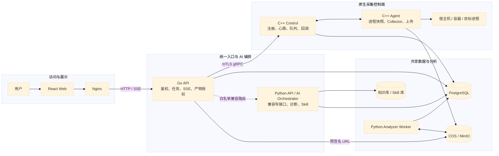
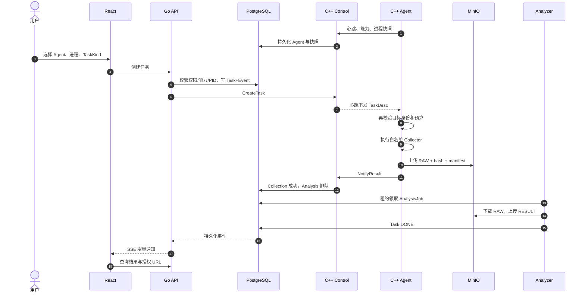
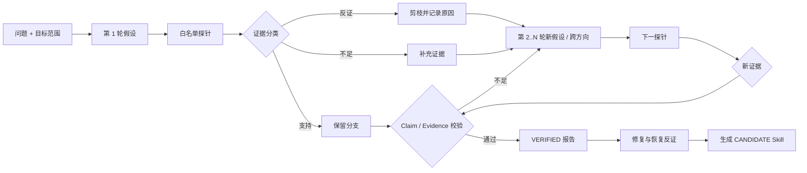
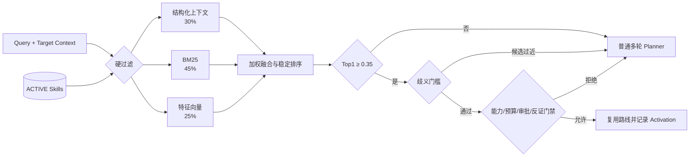
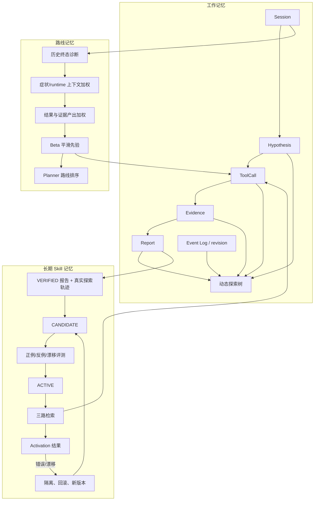
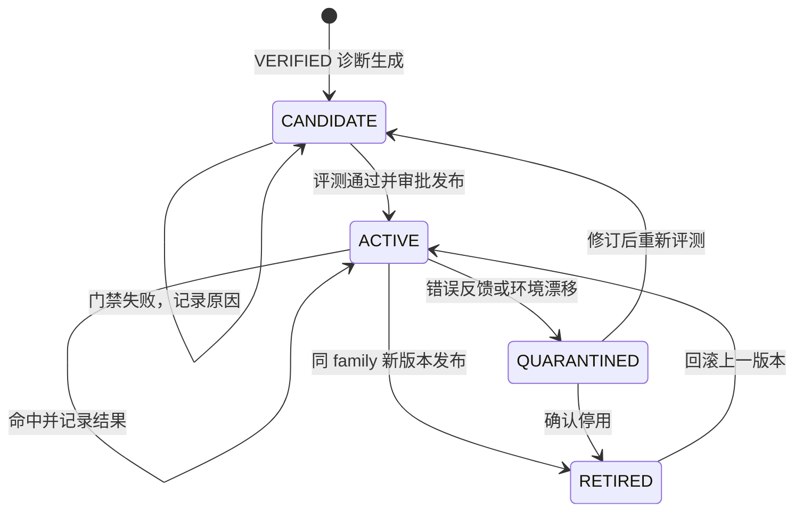
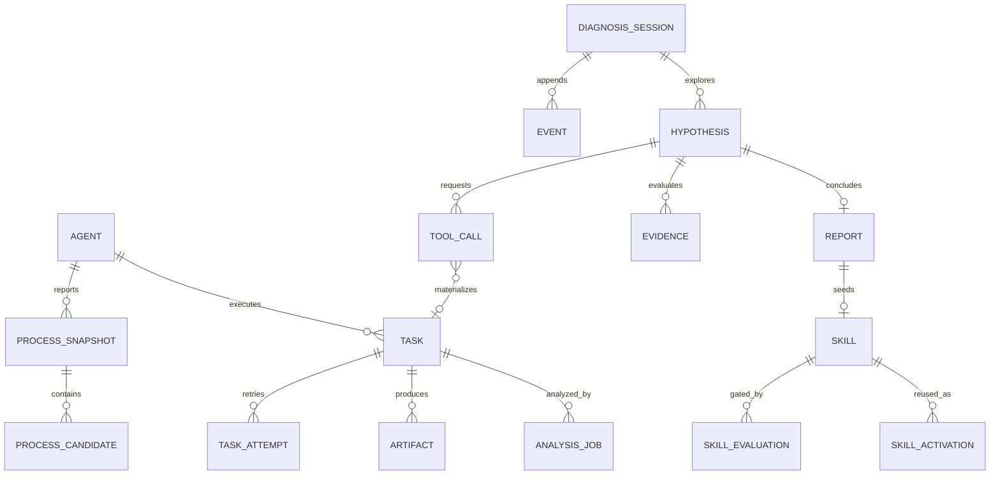
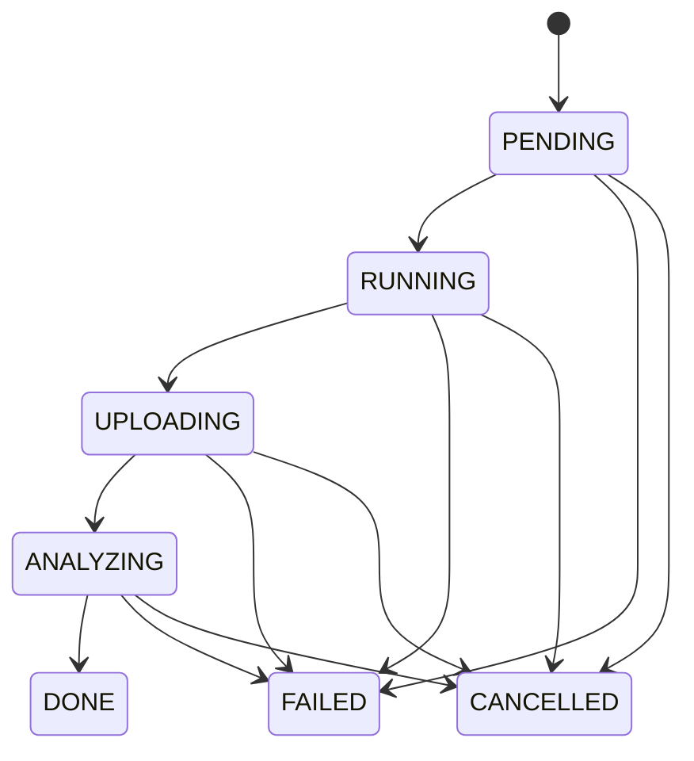

# Mini-Drop 架构图谱

> 版本：2026-08-29。本文按当前仓库实现绘制，不把复刻指南里的目标态当成已经完成的能力。云端实例已下线，`docker-compose.cloud-control.yml` 仅作为新的部署模板。

## 阅读说明

- **绿色**：默认主链，主要是 Go API 与 C++ 原生控制/采集模块；
- **橙色**：仍在运行的 Python 兼容与 AI 能力，不代表已废弃；
- **紫色**：数据库、对象存储、知识和 Skill；
- **虚线**：可选依赖或受限兼容路径；
- 图源位于 [`docs/architecture/diagrams/`](./diagrams/)，可以用 Mermaid CLI 导出 SVG/PNG。

### 图片下载

| 图 | PNG | SVG | Mermaid 源 |
|---|---|---|---|
| 整体架构 | [PNG](./diagrams/01-overall-architecture.png) | [SVG](./diagrams/01-overall-architecture.svg) | [MMD](./diagrams/01-overall-architecture.mmd) |
| 核心流程时序 | [PNG](./diagrams/02-core-sequence.png) | [SVG](./diagrams/02-core-sequence.svg) | [MMD](./diagrams/02-core-sequence.mmd) |
| 多轮诊断与动态树 | [PNG](./diagrams/03-dynamic-diagnosis-tree.png) | [SVG](./diagrams/03-dynamic-diagnosis-tree.svg) | [MMD](./diagrams/03-dynamic-diagnosis-tree.mmd) |
| Skill-RAG 三路检索 | [PNG](./diagrams/04-skill-rag-hybrid-retrieval.png) | [SVG](./diagrams/04-skill-rag-hybrid-retrieval.svg) | [MMD](./diagrams/04-skill-rag-hybrid-retrieval.mmd) |
| 三层记忆系统 | [PNG](./diagrams/05-memory-system.png) | [SVG](./diagrams/05-memory-system.svg) | [MMD](./diagrams/05-memory-system.mmd) |
| Skill 生命周期 | [PNG](./diagrams/06-skill-lifecycle.png) | [SVG](./diagrams/06-skill-lifecycle.svg) | [MMD](./diagrams/06-skill-lifecycle.mmd) |
| 核心数据关系 | [PNG](./diagrams/07-data-model.png) | [SVG](./diagrams/07-data-model.svg) | [MMD](./diagrams/07-data-model.mmd) |
| 任务状态机 | [PNG](./diagrams/08-task-state-machine.png) | [SVG](./diagrams/08-task-state-machine.svg) | [MMD](./diagrams/08-task-state-machine.mmd) |

## 1. 整体架构图



完整大图：[Mermaid 源文件](./diagrams/01-overall-architecture.mmd)。

### 权威边界

| 权威 | 当前所有者 | 说明 |
|---|---|---|
| HTTP 身份、TaskKind、任务入口 | Go API | Web 不直接调用采集模块 |
| Agent 在线状态、任务领取与结果回调 | C++ Control | 默认 Compose 主控制面 |
| 进程事实与采集执行 | C++ Agent | PID 必须绑定快照、启动时间和命名空间 |
| AI 诊断、证据门禁和 Skill | Python | 目前仍经 Go 白名单代理进入 |
| 状态、事件与证据 | PostgreSQL | 重启后可恢复，不能只放进程内存 |
| 文件正文 | COS / MinIO | 数据库只保存对象键和完整性元数据 |

## 2. 核心流程时序图



完整时序及失败分支：[Mermaid 源文件](./diagrams/02-core-sequence.mmd)。

## 3. 多轮诊断与动态探索树

探索树不是诊断结束后一次性画出来的。每次创建假设、调用工具、写入证据、剪枝、转向、生成报告，都会先写数据库事件；事件的递增 `sequence` 同时作为树的 `revision`。SSE 只通知“发生了变化”，前端随后拉取由持久化事实重建的新快照，因此服务重启后仍能恢复。



完整交互时序：[Mermaid 源文件](./diagrams/03-dynamic-diagnosis-tree.mmd)。

## 4. Skill-RAG 三路混合检索

这里检索的是**版本化诊断 Skill**，不是把文档切块后直接让模型作答。静态知识检索是另一条只读参考链，不能替代现场证据。



三路含义：

1. **结构化上下文**：类别、环境、服务和路线兼容性；
2. **BM25**：指标名、系统调用、函数名等精确词法证据；
3. **特征向量**：512 维有符号哈希字符 n-gram 与有限诊断概念，不是神经网络 Embedding。

完整门槛和反馈回路：[Mermaid 源文件](./diagrams/04-skill-rag-hybrid-retrieval.mmd)。实现说明见 [`skill-hybrid-retrieval-20260829.md`](../ai/skill-hybrid-retrieval-20260829.md)。

## 5. 记忆系统详细流程



关键区别：

- 工作记忆回答“这次诊断走到哪里”；
- 路线记忆回答“类似上下文中哪个探针更可能有效”；
- Skill 记忆保存经过证据和评测门禁的可复用策略；
- 静态知识只补充背景、必要证据和限制条件。

完整安全边界图：[Mermaid 源文件](./diagrams/05-memory-system.mmd)。

## 6. Skill 生命周期



详细图：[Mermaid 源文件](./diagrams/06-skill-lifecycle.mmd)。

## 7. 核心数据关系

数据被分成采集任务域与诊断学习域，两者通过 `DropInsightToolCall.task_id` 关联，而不是把工具结果复制成无来源文本。



完整关系图：[Mermaid 源文件](./diagrams/07-data-model.mmd)。

## 8. 任务状态机

主状态只有一条正常路径，取消和失败可以从各个非终态进入。重试创建新的 `TaskAttempt`，不会覆盖旧证据。



详细图：[Mermaid 源文件](./diagrams/08-task-state-machine.mmd)。

## 9. 文件目录结构

```text
mini-drop/
├── native/
│   ├── control/                 C++ Control：注册、心跳、队列、取消、结果回调
│   └── agent/                   C++ Agent：Collector Registry、进程快照、采集上传
├── apiserver/
│   ├── cmd/apiserver/           Go 服务入口
│   └── internal/
│       ├── httpapi/             REST/SSE handler 与 Python 白名单代理
│       ├── repository/          PostgreSQL 查询、事务与状态事件
│       ├── taskkind/            TaskKind 权威目录和参数限制
│       ├── config/              mTLS、数据库与生产配置校验
│       └── gen/                 由 Proto 生成的 Go gRPC 类型
├── server/
│   ├── app/diagnosis/           稳定诊断流水线、路线记忆、下一探针规划
│   ├── app/drop_insight/        多轮诊断、动态树、证据门禁、Skill 演进
│   ├── app/rca/                 兼容 RCA、候选根因与校准
│   ├── app/grpc_services/       Python 控制面回滚实现
│   ├── app/models.py            SQLAlchemy 权威数据模型
│   └── migrations/              Alembic 数据库迁移
├── agent/mini_drop_agent/       Python 兼容 Agent 与补充采集器
├── analyzer/                    离线解析、火焰图和 TopN 工具
├── web/src/
│   ├── pages/                   Dashboard、AI Diagnosis、Task Result 等页面
│   ├── components/              探索树、证据卡片、Skill、火焰图等组件
│   ├── hooks/                   SSE 与轮询恢复
│   └── api/                     Web API 客户端
├── proto/                       跨语言 gRPC 契约
├── knowledge/                   可审计静态诊断知识
├── skills/                      基础诊断 Skill 文档
├── tests/                       Python 契约、单元、集成与评测
├── deploy/                      Dockerfile、证书脚本、Nginx 与环境模板
├── scripts/                     评测、实验、运维和交付工具
└── docs/architecture/           架构、边界、复刻一致性与本图谱
```

### 不应提交

`node_modules/`、`dist/`、`.env`、私钥、临时 `artifacts/`、本地 `reports/`、课程材料、答辩截图和部署压缩包都不是产品源码。

## 10. 当前实现边界

- 默认主链已经是 React → Go → C++ Control ↔ C++ Agent；Python Agent/Control 是显式回滚路径。
- AI 写接口仍有 Go → Python HTTP 白名单代理，尚未全部迁为 Go 原生编排。
- Skill 向量项是确定性特征向量，不应对外宣称为通用语义 Embedding。
- C++ 原生镜像尚缺当前机器上的 Linux 编译与端到端运行证明。
- Java Heap Analyzer、完整 OIDC/用户组、证书轮换和生产容灾仍属于后续生产化工作。
