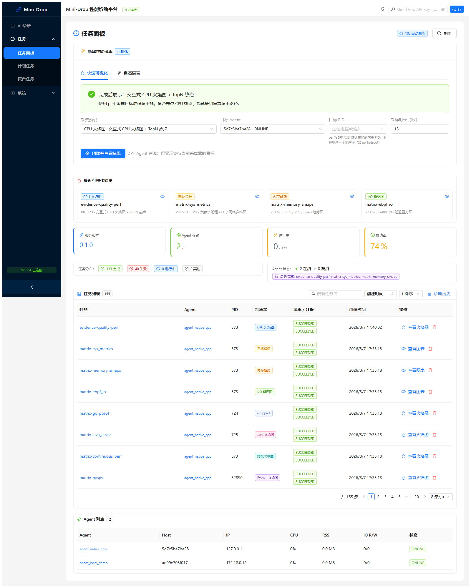
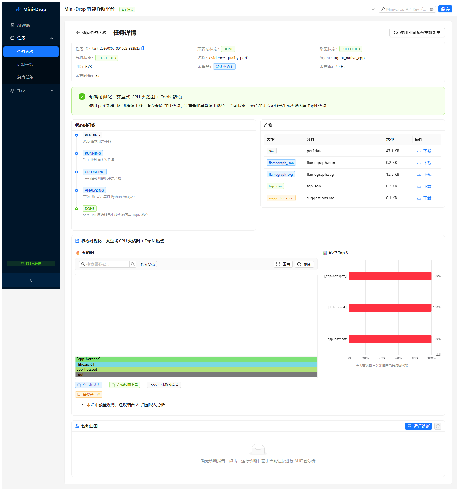
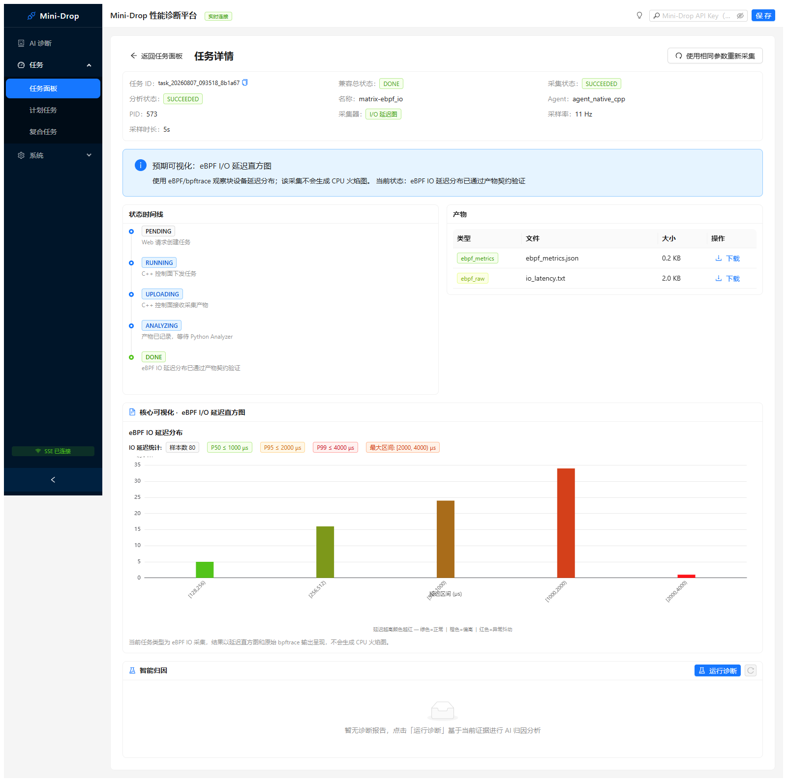
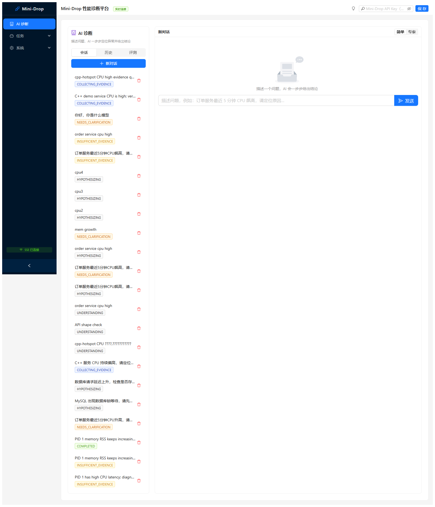

# Mini-Drop 全功能跑通手册：本地、云服务器、基础复刻与 AI 循证诊断

> 仓库：`D:\tx\mini-drop`  
> 云端部署目录：`/opt/mini-drop-li-mingyuan`  
> 更新日期：2026-08-19  
> 目标：让第一次接触项目的人知道“在哪个终端输入什么、点哪个按钮、系统内部经历了什么、看到什么才算通过”。

---

## 0. 先说结论：导师提出的重点做到哪里了

| 导师关注点 | 当前落地 | 页面如何看见 |
|---|---|---|
| 循证诊断 | 先提出可证伪假设，再采集支持证据和反证，证据不足就停止下结论 | `AI 诊断 → 诊断会话` 的六步诊断条、证据卡、结论卡 |
| 性能决策树 | 按 CPU、内存、I/O、网络、依赖、JVM 等故障域选择采集器 | 专家模式中的候选假设、工具调用和诊断路径 |
| 统一测试集 | 仓库内 10 类 Golden 用例；可挂载组内 `ai_ops_v2` 外部测试集 | `AI 诊断 → 方法与测试集` |
| 测试过程透明 | 显示载入测试集、执行策略、决策树、循证核验、质量门禁；不是只显示 100% | Golden 逐场执行记录、场景裁决、外部用例三次审计时间线 |
| 先制造故障再评测 | 白名单故障注入，采集基线/故障/恢复三段快照，诊断后才揭示 Oracle | `真实故障 Campaign` 的“一键制造故障并评测” |
| 多轮诊断 | 信息不足追问范围；证据不足、可信反证或人工纠错会开启下一轮 | `继续推进`、纠正卡、新一轮假设及父子关系 |
| 多机/多 Agent | control + worker1 + worker2；每台机器部署自己的 Agent | 任务面板 Agent 列表；云部署文档 |
| AI 不越权 | 工具注册表、参数白名单、预算、审批、审计；高风险操作需要确认 | 工具调用卡的批准/拒绝、审计日志 |
| 简化界面 | Drop Insight 与旧集群诊断已合并为一个 `AI 诊断` 页面；简单/专家双模式 | 左侧只有统一 AI 入口 |
| 开源真实问题评测 | 外部 `ai_ops_v2` 适配器将公开输入与 evaluator-only Oracle 隔离 | `组内统一测试集 ai_ops_v2` |
| OTel live subset | CPU/MEM 的 2 案例 × 3 策略 × 3 重复执行器和严格发布门禁已完成；正式 18-run 尚未云端验收 | `scripts/run_live_subset.py` 与独立报告目录 |
| 云端可体验 | 三节点 Ubuntu 环境已部署，真实 eBPF、Agent 心跳和旧 CPU Campaign 已验证 | `https://47.112.10.137/` |

当前边界也必须诚实说明：Windows Docker Desktop 适合开发和界面联调，但 perf/eBPF 受 WSL2 内核与 PID 命名空间影响；最终内核采集验收以云端原生 Linux 为准。

---

## 1. 项目到底在做什么

程序变慢时，Mini-Drop 把“登录机器、找进程、执行 perf/eBPF/py-spy、保存文件、分析火焰图、判断根因”变成一条可追溯流水线：

```text
用户在 Web 描述问题或创建任务
  ↓
Go API 认证、校验并转发
  ↓
Python Server 建任务和状态记录
  ↓
C++ Control Plane 把任务分给指定 Agent
  ↓
目标机器上的 Agent 对指定 PID 真实采集
  ↓
原始产物上传 MinIO，状态/索引写 PostgreSQL
  ↓
Python Analyzer 生成火焰图、TopN、趋势图或直方图
  ↓
AI 根据假设调用受控工具，引用已验证证据，输出置信度和结论
  ↓
修复后用相同窗口重新采集，比较前后变化
```

### 1.1 组件人话表

| 组件 | 人话解释 | 主要技术 |
|---|---|---|
| Web | 操作台和结果页面 | React |
| API Server | 对外入口、认证、协议边界 | Go |
| Server | 任务状态机、证据、AI 会话和审计 | FastAPI + SQLAlchemy |
| Control Plane | 调度 Agent、接收任务结果 | C++ |
| Agent | 安装在被观察机器上的采集程序；它不是“一个随便的 py 文件”，而是长期运行、心跳、领任务、执行采集器、上传产物的服务 | C++ Agent；兼容 Python Agent |
| Analyzer | 把原始采样文件变成可视化数据 | Python |
| PostgreSQL | 保存任务、状态、审计、证据元数据 | PostgreSQL |
| MinIO | 保存 perf.data、JSON、SVG 等大文件 | S3 兼容对象存储 |

---

## 2. 云服务器与本机 Docker 有什么区别

它们不是二选一。云服务器上同样使用 Docker Compose，区别在于 Docker 运行在哪种宿主机上。

| 对比 | Windows + Docker Desktop | 云端 Ubuntu 原生 Linux |
|---|---|---|
| 适合 | 写代码、快速构建、前端联调、普通 API/系统指标 | 最终演示、perf/eBPF、真实多机 Agent |
| 内核 | Docker 实际运行在 WSL2 Linux VM 中 | 直接使用服务器 Linux 6.8 内核 |
| PID | Windows、WSL2、容器 PID 容易混淆 | Agent 与目标进程可按宿主 PID 统一观察 |
| perf/eBPF | 权限、tracefs、PMU 经常受限 | 可授予 BPF/PERFMON/SYS_PTRACE 并挂载 tracefs |
| 多机 | 通常只有一台电脑 | control、worker1、worker2 三台独立机器 |
| 网络 | localhost 为主 | 有公网入口、节点间网络、安全组和 TLS |
| 成本/风险 | 占本机资源 | 消耗服务器 CPU、内存和公网流量；需要保护密钥 |

**结论：**页面和普通链路可先在本机验证；CPU perf、eBPF I/O、多 Agent 和真实 Campaign 优先在云端验证。

---

## 3. 两种 API Key 不要混淆

1. 页面右上角的 **Mini-Drop API Key**：访问平台 API 的认证凭证。
2. DeepSeek API Key：Server 调用大模型的密钥，只配置在服务端环境文件中。

DeepSeek Key 不填在浏览器、不写进 Markdown、不提交 Git。页面提示“访问认证失败”时要填的是 Mini-Drop API Key。

---

## 4. 本机完整启动

### 4.1 在哪个终端输入

打开 **VS Code → 终端 → 新建终端 → PowerShell**：

```powershell
cd D:\tx\mini-drop
if (!(Test-Path .env)) { Copy-Item .env.example .env }
docker compose config --quiet
docker compose --profile demo-targets up -d --build
```

等待完成后：

```powershell
docker compose ps
```

核心服务应为 `Up`，带健康检查的服务应为 `healthy`。`migrate` 运行成功后退出属于正常。

### 4.2 打开页面与认证

浏览器访问 <http://localhost/>。

若提示认证失败，在 PowerShell 查看本机 `.env` 中的平台认证值：

```powershell
Select-String -Path .env -Pattern '^MINI_DROP_API_KEY='
```

把等号后的值填到页面右上角 **Mini-Drop API Key**，点击 **保存**。不要把值放入截图。

### 4.3 三个健康检查

```powershell
Invoke-WebRequest -UseBasicParsing http://localhost/
Invoke-RestMethod http://localhost/api/healthz | ConvertTo-Json -Depth 8
Invoke-RestMethod http://localhost/api/agents | ConvertTo-Json -Depth 8
```

若开启认证，可在 PowerShell 临时读取而不打印：

```powershell
$apiKey = ((Select-String -Path .env -Pattern '^MINI_DROP_API_KEY=').Line -split '=',2)[1]
$headers = @{ 'X-API-Key' = $apiKey }
Invoke-RestMethod http://localhost/api/agents -Headers $headers | ConvertTo-Json -Depth 8
```

### 4.4 看日志

另开一个 PowerShell：

```powershell
cd D:\tx\mini-drop
docker compose logs -f --tail=100 web apiserver server control-plane native-agent analyzer diagnosis-worker
```

`Ctrl+C` 只停止看日志，不会关闭项目。

---

## 5. 云服务器怎么打开、怎么运行

### 5.1 浏览器使用

1. 打开 <https://47.112.10.137/>。
2. 实验环境使用自签名证书，确认地址后选择继续访问。
3. SSH 登录 control 节点，在服务器终端执行：

```bash
grep '^MINI_DROP_API_KEY=' /opt/mini-drop-li-mingyuan/deploy/env/cloud-control.env | cut -d= -f2-
```

4. 将输出填到页面右上角并点击 **保存**。不要在群聊或录屏中暴露。

### 5.2 control 节点启动

在 Windows PowerShell：

```powershell
ssh root@47.112.10.137
```

输入实验环境说明中的 control 密码。进入 Linux 终端后：

```bash
cd /opt/mini-drop-li-mingyuan
docker compose \
  --env-file deploy/env/cloud-control.env \
  -f docker-compose.cloud-control.yml \
  up -d

docker compose \
  --env-file deploy/env/cloud-control.env \
  -f docker-compose.cloud-control.yml \
  ps
```

### 5.3 worker 节点启动

分别 SSH 登录 worker1、worker2：

```bash
cd /opt/mini-drop-li-mingyuan
docker compose \
  --env-file deploy/env/cloud-worker.env \
  -f docker-compose.worker.yml \
  up -d
docker compose \
  --env-file deploy/env/cloud-worker.env \
  -f docker-compose.worker.yml \
  ps
```

### 5.4 云端日志

control：

```bash
cd /opt/mini-drop-li-mingyuan
docker compose --env-file deploy/env/cloud-control.env \
  -f docker-compose.cloud-control.yml \
  logs -f --tail=100 web apiserver server diagnosis-worker analyzer campaign-agent
```

---

## 6. 页面总览



| 页面/按钮 | 作用 | 不代表什么 |
|---|---|---|
| `AI 诊断` | 统一 AI 入口；范围确认、假设、决策树、取证、结论和修复验证 | 不是普通聊天机器人 |
| `任务面板` | 手工创建真实采集任务并看结果 | 点击创建不等于采集已成功 |
| `计划任务` | 周期性创建任务 | 不是 Continuous Profiling 本身 |
| `复合任务` | 把多个采集子任务编排为一组 | 不是多机根因自动成立 |
| `审计日志` | 查看谁在何时创建、批准、拒绝、删除了什么 | 不是普通应用日志全文 |
| `系统设置` | 查看环境和服务配置 | 不展示服务端敏感密钥 |
| `简单/专家` | 简单模式看结论；专家模式看假设、工具、证据和路径 | 不改变后端证据门禁 |
| `继续推进` | 让编排器推进下一步 | 不会绕过人工审批 |

---

## 7. 基础复刻功能：任务面板全链路

### 7.1 先选正确 PID

页面的 PID 必须是所选 Agent 能看到的 PID。云端 control-host Campaign 目标可在 control 上查看：

```bash
docker inspect -f '{{.State.Pid}}' mini-drop-cloud-control-python-hotspot-1
docker inspect -f '{{.State.Pid}}' mini-drop-cloud-control-java-hotspot-1
```

本地演示目标：

```powershell
$cppPid    = [int](docker inspect -f '{{.State.Pid}}' (docker compose ps -q cpp-hotspot))
$pythonPid = [int](docker inspect -f '{{.State.Pid}}' (docker compose ps -q python-hotspot))
$goPid     = [int](docker inspect -f '{{.State.Pid}}' (docker compose ps -q go-hotspot))
$javaPid   = [int](docker inspect -f '{{.State.Pid}}' (docker compose ps -q java-hotspot))
"C++=$cppPid Python=$pythonPid Go=$goPid Java=$javaPid"
```

### 7.2 点击顺序

1. 左侧点 **任务 → 任务面板**。
2. 选择 **快速可视化**。
3. 选择采集预设。
4. 选择支持该采集器且在线的 Agent。
5. 从候选进程选择 PID，或输入该 Agent 宿主机上的真实 PID。
6. 输入 10～15 秒。
7. 点击 **创建并查看结果**。
8. 在详情页观察状态时间线。

### 7.3 一条任务中间经历什么

```text
PENDING → RUNNING → UPLOADING → ANALYZING → DONE
                                        └→ FAILED
```

- `PENDING`：数据库已建任务。
- `RUNNING`：Control Plane 已下发，Agent 正在采集；建立 TaskAttempt。
- `UPLOADING`：原始产物上传对象存储。
- `ANALYZING`：Analyzer 解析产物。
- `DONE`：分析成功且 Artifact 完整性校验通过。
- `FAILED`：页面必须显示失败步骤与 reason；失败不是“系统全挂了”。

### 7.4 八类采集器验收

| 预设 | 推荐目标 | 预期产物/图 | 环境要求 |
|---|---|---|---|
| CPU 火焰图 | C/C++ 高 CPU 进程 | flamegraph + TopN | 原生 Linux perf 权限最佳 |
| Python 火焰图 | Python 进程 | py-spy speedscope/火焰图 | Agent 有 ptrace 权限 |
| 持续火焰图 | 长期运行进程 | 时间窗口切片与趋势 | 等待至少两个切片 |
| Java 火焰图 | JVM PID | async-profiler 火焰图 | event 选 `cpu`，不是 `cpu-cycles` |
| Go pprof | 开启 pprof HTTP 的 Go 服务 | pprof/火焰图 | 目标必须监听 `/debug/pprof` |
| I/O 延迟图 | 有 I/O 的进程/宿主 | eBPF I/O 延迟直方图 | 原生 Linux + tracefs/BPF/PERFMON |
| 内存趋势 | 任意稳定 PID | RSS/PSS/Swap 趋势 | `/proc/<pid>/smaps` 可读 |
| 系统指标 | 任意有效 PID | CPU/负载/线程/FD/网络 | 普通 Linux 即可 |





**通过标准：**采集状态 `SUCCEEDED`、分析状态 `SUCCEEDED`、总状态 `DONE`；产物非空、有 SHA-256、状态 `VERIFIED`；图表内容与预设一致。

---

## 8. AI 诊断：从一句话到可信结论



### 8.1 新建会话

1. 左侧点 **AI 诊断**。
2. 点 **新对话**。
3. 输入：`订单服务最近 5 分钟 CPU 飙高，请定位原因`。
4. 点 **发送**。

此时出现 `NEEDS_CLARIFICATION` 是正确行为：AI 没有猜服务、机器、PID 和时间。

### 8.2 “AI 需要确认范围”怎么填

1. **服务**：业务名称，如 `order-service`。
2. **环境**：选择 `demo`、`staging` 或实际环境。
3. **在线 Agent**：选择目标进程所在机器的 Agent。
4. **目标 PID**：选择候选或输入该 Agent 可见的 PID。
5. **开始/结束**：默认最近五分钟，可按告警时间调整。
6. 点 **确认范围并开始取证**。

`使用在线演示目标` 会优先选择 control-host Agent 和当前宿主机候选 PID。多机环境中，远程 worker 的 PID 必须在对应 worker 上查询后手工填写，不能把 control 的 PID 配给 worker Agent。

### 8.3 六步诊断条表示什么

1. **理解问题**：抽取服务、现象和时间窗。
2. **确认范围**：绑定 Agent/PID，避免跨机器采错。
3. **生成假设**：产生可支持、也可被推翻的候选根因。
4. **决策树取证**：根据故障域选择 sys_metrics、perf、eBPF、py-spy 等工具。
5. **证据裁决**：核验支持证据、反证、完整性和时间一致性。
6. **结论验证**：输出置信度、限制、evidence_refs，并允许修复后复测。

### 8.4 工具调用卡怎么用

- `REQUIRE_APPROVAL`：高风险或有开销的采集等待人工确认。
- **批准并执行**：按显示的 Agent、PID、时长和频率创建真实任务。
- **拒绝**：不执行；原因写入审计，AI 需选择其他路径。
- **编辑参数**：专家模式可在白名单范围调整时长、频率等，后端再次校验。

批准后去 **任务面板** 可看到对应 Task，完成后返回 AI 页面点 **继续推进**。系统只接受完成且有验证产物的 TaskAttempt 作为可信证据。

### 8.5 为什么会出现“证据不足”

`INSUFFICIENT_EVIDENCE` 不是根因结论，而是反幻觉门禁：当前证据不足以证明假设。常见原因：

- 任务失败或仍在运行；
- Task 没有成功 TaskAttempt；
- Artifact 未通过完整性校验；
- 采集时间不覆盖故障时间；
- 证据只支持现象，没有支持具体根因；
- 没有反证或替代解释比较。

处理方法：点 **继续推进**，按新一轮工具计划采集；或用下方纠正卡选择“确认属于证据不足”“已有证据被遗漏”“诊断方向错误”。后两项会保留旧证据并开启新一轮假设，不会篡改旧结论。

### 8.6 什么才是真正的诊断结论

必须同时满足：

1. 至少一项支持证据被接受；
2. 证据来自成功 TaskAttempt 和 VERIFIED Artifact；
3. evidence_refs 能回到原始数据；
4. 反证门禁通过；
5. 置信度达到阈值。

页面才会显示 `COMPLETED/VERIFIED`、非零置信度、具体根因、证据引用和限制。

### 8.7 修复前后验证

只有结论通过门禁后才显示修复验证模块：

1. 选择或记录修复前任务。
2. 人工实施修复；AI 不自动修改生产服务。
3. 用相同 Agent、PID、时长和采集器创建修复后任务。
4. 选择前后任务，点击比较。
5. 看 CPU/延迟/RSS/热点函数是否按预期改善。

---

## 9. 方法与测试集：怎么证明 AI 不是黑盒

进入 **AI 诊断 → 方法与测试集**。主工作区在右侧展开，不会把内容挤进左侧窄栏。

### 9.1 三项方法

- **循证诊断**：假设 → 支持证据/反证 → 结论；证据不足时主动停止。
- **性能决策树**：先判断影响范围和故障域，再选采集器，避免固定命令行。
- **统一测试集**：同一批输入、Oracle 和证据要求评测不同策略。

### 9.2 Golden 逐场质量门禁

点击 **执行 Golden 评测** 后页面依次展示：

1. 载入测试集；
2. 执行诊断策略；
3. 性能决策树裁决；
4. 循证核验；
5. 质量门禁汇总。

逐场展开可看“标准根因 Oracle、系统实际分类、预期/实际采集器、证据引用、反证计划和安全检查”。100% 只说明这个版本通过当前确定性回归集，不等于真实世界准确率 100%。

### 9.3 组内统一外部测试集 `ai_ops_v2`

页面显示：

- 压缩包名称、版本和 SHA-256；
- 用例数、有效运行数、严格根因命中率、证据合规率；
- 单故障、复合故障/多机、负例与鲁棒性三类轨道；
- 每个案例的三次运行；
- 每次运行的模型、规划器、实际根因、所需/实际采集器、证据数和完整诊断时间线；
- Oracle 只在诊断完成后由评测器揭示，不能喂给诊断模型。

本机安装测试集：

```powershell
New-Item -ItemType Directory -Force artifacts\benchmarks\external | Out-Null
Copy-Item 'ai_ops_v2-2.0.0-candidate.1-20260811.zip' benchmarks\external\
```

若页面显示“未安装”，确认压缩包路径或设置 `MINI_DROP_EXTERNAL_BENCHMARK_ARCHIVE` 后重启 Server。

### 9.4 真实故障 Campaign

1. 在场景卡中选择一个白名单场景。
2. 点击 **一键制造故障并评测**。
3. 观察八步：安全预检 → 基线快照 → 真实注入 → 异常确认 → 任务取证 → 循证诊断 → Oracle 对比 → 恢复验证。
4. 查看三段快照、真实任务关联、TaskAttempt、VERIFIED Artifact、Analyzer Job、AI 结论、Oracle 命中和最终清理。

页面按钮不会执行任意 shell，只调用注册的故障开关；中途失败也会在 `finally` 中关闭故障。

云端已验证示例：基线 CPU 约 0.24%，故障阶段约 99.85%，恢复约 0.26%；根因 `SELF_CODE_CPU_HOTSPOT`，置信度 0.92，Oracle 匹配、证据完整和恢复清理均通过。数值会随运行变化，不应硬编码。

---

## 10. 多机 Agent 怎么理解和验收

多机不是一台虚拟机开三个进程，而是：

```text
control: Web + API + Server + DB + MinIO + Analyzer
worker1: Agent + 被观察服务
worker2: Agent + 被观察服务
```

每个 Agent 只能采集自己宿主机能看到的 PID。Server 通过心跳知道 Agent 在线，通过任务中的 `agent_id + pid` 精确下发。

验收：

1. 任务面板能看到 worker1、worker2 `ONLINE`。
2. 在 worker1 查询目标 PID，用 worker1 Agent 创建系统指标任务并 DONE。
3. 在 worker2 查询另一个 PID，用 worker2 Agent 创建任务并 DONE。
4. 停止 worker1 Agent，30 秒后页面应离线且审计有记录。
5. 重启后恢复在线，审计再次记录。

---

## 11. 常见问题与对应处理

### 11.1 `AI 需要确认范围` 一直不消失

确认五项都完整：服务、环境、在线 Agent、正整数 PID、开始和结束时间，且结束晚于开始。刷新前先看浏览器 Network 中 `/api/v2/diagnoses/{id}/clarify` 是否 200。

### 11.2 `task has no completed TaskAttempt`

该任务没有成功采集尝试，不能导入证据。回任务详情看采集状态；选择 `DONE` 且 TaskAttempt 为 `SUCCEEDED` 的任务。

### 11.3 Campaign 提示 `python-hotspot` 无法解析

说明依赖目标没有启动或不在同一 Compose 网络。云端执行：

```bash
cd /opt/mini-drop-li-mingyuan
docker compose --env-file deploy/env/cloud-control.env \
  -f docker-compose.cloud-control.yml \
  up -d --build python-hotspot downstream-service network-proxy java-hotspot campaign-agent server web
```

### 11.4 Java 提示不支持 `cpu-cycles`

Java async-profiler 事件应选 `cpu`、`wall`、`alloc` 或 `lock`；不要把 perf 的 `cpu-cycles` 传给 Java 采集器。

### 11.5 Go pprof 连接 6060 被拒绝

目标不是 pprof 服务或未监听 6060。先确认 `/debug/pprof/profile` 可访问，再创建任务。

### 11.6 eBPF 提示 tracefs unavailable

Windows Docker Desktop 环境常见。改到原生 Linux，挂载 `/sys/kernel/tracing`，授予 `BPF/PERFMON/SYS_ADMIN` 后重试。

### 11.7 页面只看到一条很扁的火焰图

采样太短、目标太空闲、符号缺失或采集到包装进程。选择真正忙碌的业务 PID，延长到 15～30 秒，并确认符号可解析。

### 11.8 SSE 断开

实时推送断开不等于后端停止。页面仍可刷新/轮询；检查 Nginx、API、认证和浏览器 Network。

---

## 12. 最终验收清单

### 12.1 基础复刻

- [ ] `docker compose up` 后 Web/API/Server/DB/MinIO/Analyzer/Agent 正常。
- [ ] 至少两个 Agent 心跳在线；离线/恢复有审计。
- [ ] 任务完整经过 PENDING/RUNNING/UPLOADING/ANALYZING/DONE。
- [ ] perf 火焰图和 TopN 可交互。
- [ ] Python、Java、Go 按各自真实目标成功；失败时 reason 准确。
- [ ] eBPF 在原生 Linux 真实采集 I/O 变化。
- [ ] 内存和系统指标趋势成功。
- [ ] Continuous Profiling 有多个切片、可按时间窗回看和停止。
- [ ] 产物有 SHA-256，Artifact 为 VERIFIED。
- [ ] 计划任务、复合任务、取消、归档和审计可用。

### 12.2 AI 方案

- [ ] 模糊输入进入范围确认，不猜 Agent/PID。
- [ ] 五项范围补齐后进入假设和决策树。
- [ ] 工具调用显示参数、风险、预算，并可批准/拒绝。
- [ ] 证据只来自成功 TaskAttempt 与 VERIFIED Artifact。
- [ ] 证据不足时不编造结论，可继续新一轮。
- [ ] 真正结论含根因、置信度、evidence_refs、反证与限制。
- [ ] 人工纠正保留旧证据并开启可追溯新一轮。
- [ ] 修复前后使用同口径任务比较。
- [ ] Golden 评测显示逐场过程，不只显示最终百分比。
- [ ] 外部测试集显示版本、哈希、三次运行与诊断轨迹，Oracle 无泄漏。
- [ ] Campaign 真实制造故障、采集三段快照、诊断、Oracle 对比并清理恢复。
- [ ] OTel live subset 具有 18 个唯一 submission、6 个已发布 raw manifest、空 cleanup errors、Oracle 隔离和独立 JSON/HTML 报告。

当前 OTel live subset 仅完成实现和本地聚焦回归；本项必须以云端原生 Linux 的正式运行产物勾选，不能用本地单测或旧 `LIVE-CPU-001` 替代。

---

## 13. 停止项目

本机：

```powershell
cd D:\tx\mini-drop
docker compose down
```

云端 control：

```bash
cd /opt/mini-drop-li-mingyuan
docker compose --env-file deploy/env/cloud-control.env \
  -f docker-compose.cloud-control.yml down
```

不要加 `-v`，否则会删除数据库和 MinIO 数据卷；共享服务器上不要停止其他同学的 Compose 项目。

