# Mini-Drop 详细流程图与时序图

> 本文用于理解系统、设计评审和导师汇报。图中区分了“基础性能采集链路”“AI 循证诊断链路”“真实故障评测链路”和“多机诊断链路”。

---

## 1. 项目总体架构图

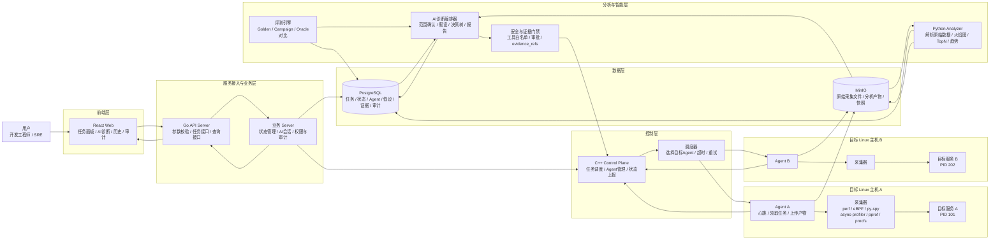

### 人话解释

- **Web**：用户填写任务、看进度和结果。
- **Go API / Server**：创建任务、保存信息、向前端提供接口。
- **Control Plane**：找到正确的 Agent 并下发任务。
- **Agent**：驻留在被检查机器上的执行程序，不只是一个脚本。
- **采集器**：Agent 调用的具体工具，例如 `perf`、`py-spy` 和 eBPF。
- **MinIO**：保存体积较大的原始文件和分析文件。
- **PostgreSQL**：保存任务状态、诊断假设、证据引用和审计记录。
- **Analyzer**：把原始数据加工成火焰图、TopN 和趋势图。
- **AI 编排器**：根据问题提出假设，决定下一步查什么，并生成可追溯结论。

---

## 2. 普通性能采集完整流程图

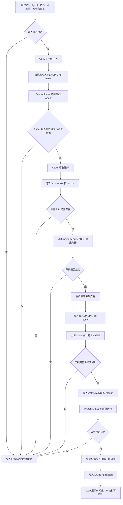

### 状态机

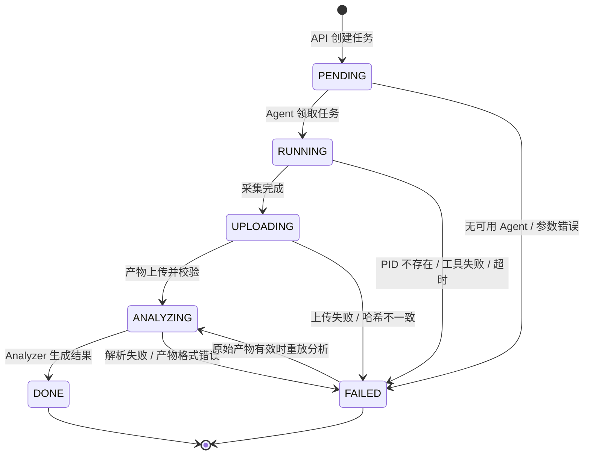

> 每次状态迁移都需要落库，并记录 `reason`、时间、执行者和对应的 `TaskAttempt`。

---

## 3. 普通采集任务时序图

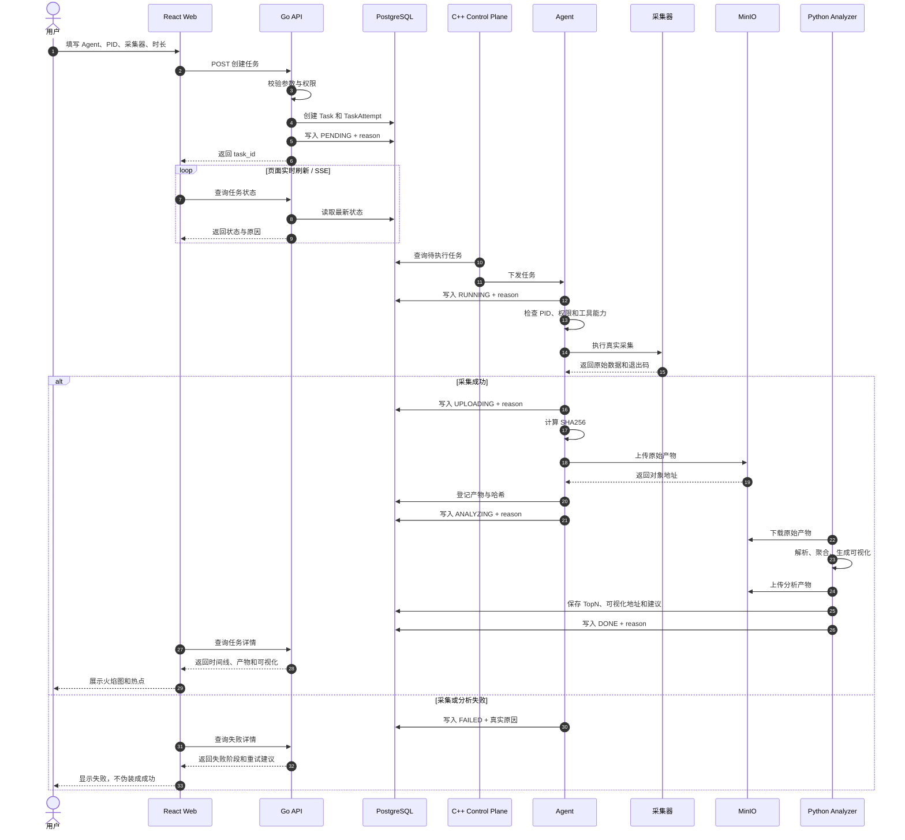

---

## 4. AI 循证诊断流程图

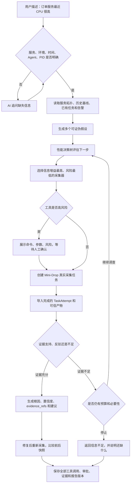

### 性能决策树示意

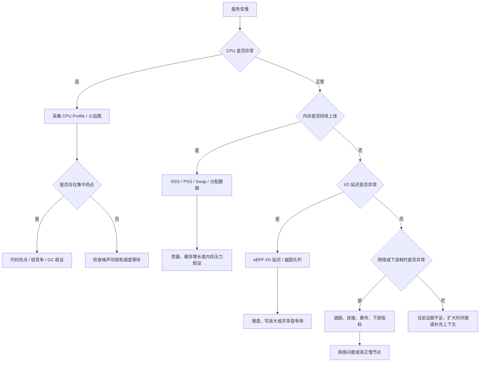

---

## 5. AI 诊断时序图

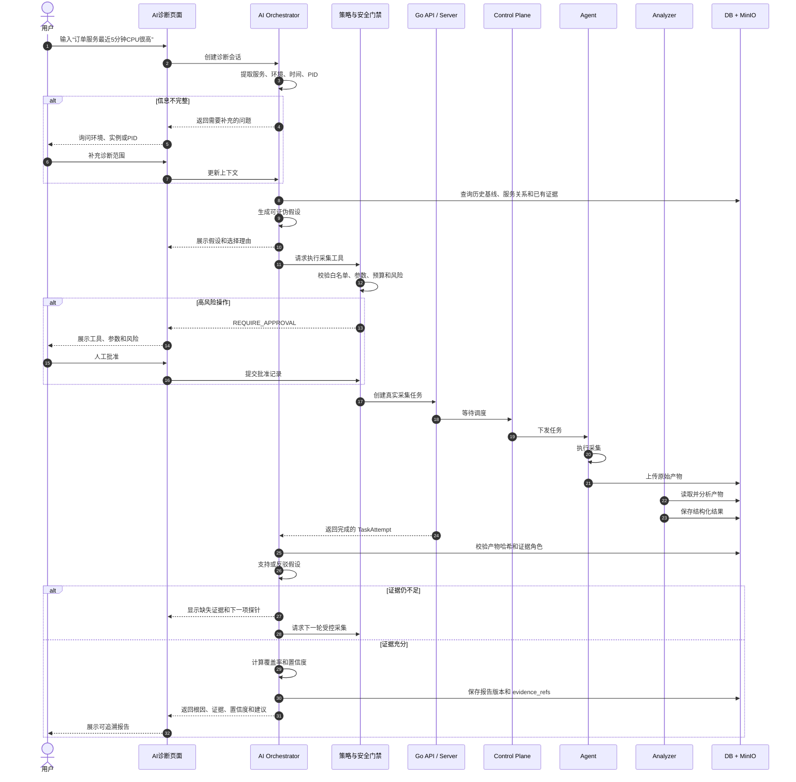

---

## 6. 一键真实故障 Campaign 流程图

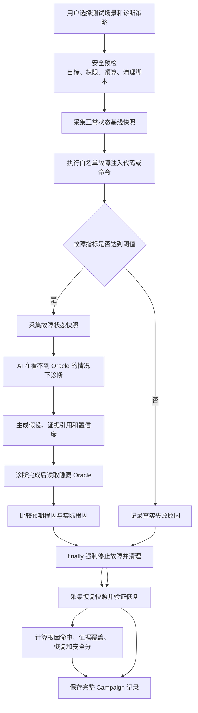

### 故障从哪里来

Web 按钮本身不会制造故障，它只是发起一个受控实验。真正的故障由目标主机上的 Agent 执行预先登记的代码或命令产生。

| 场景 | 典型实现 | 观察指标 |
|---|---|---|
| CPU 热点 | 运行计算密集循环或 `stress-ng --cpu` | CPU、火焰图热点 |
| 内存增长 | 持续申请并保留内存 | RSS/PSS/Swap |
| I/O 压力 | `fio` 或受控文件读写 | I/O 延迟、队列深度 |
| 网络延迟 | 网络代理或受控 `tc netem` | RTT、重传、请求耗时 |
| 下游变慢 | 下游接口延迟开关 | 上下游耗时分布 |
| 噪声邻居 | 同宿主机进程争抢 CPU/I/O | 目标与邻居资源对比 |

---

## 7. 真实故障 Campaign 时序图

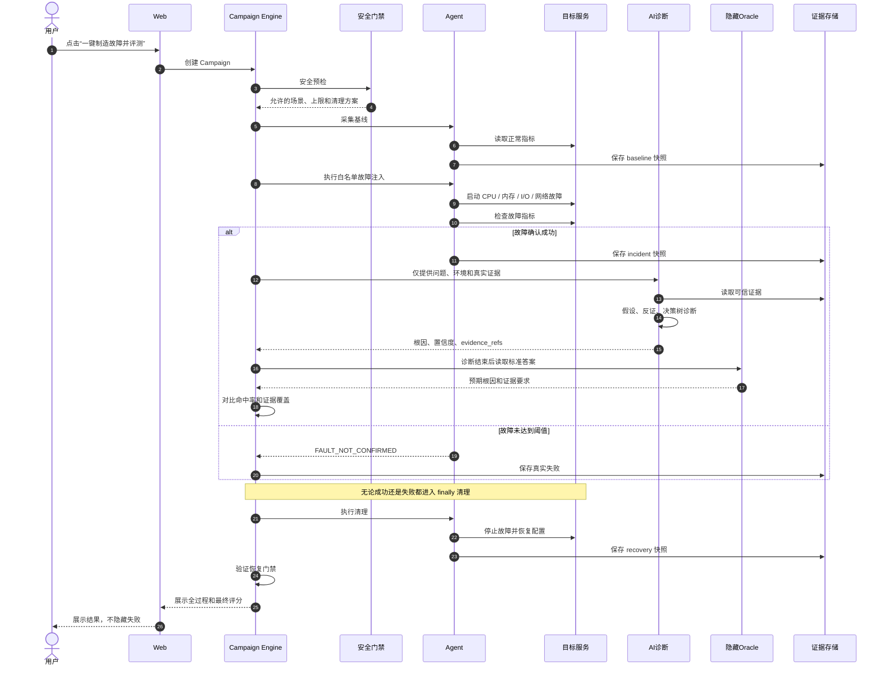

---

## 8. 多机、多 Agent 诊断架构图

> 多机指多台独立 Linux 主机或虚拟机，不一定是物理服务器。开发阶段也可用虚拟机模拟；Docker 多容器主要用于流程验证，不能完全替代原生多机环境。

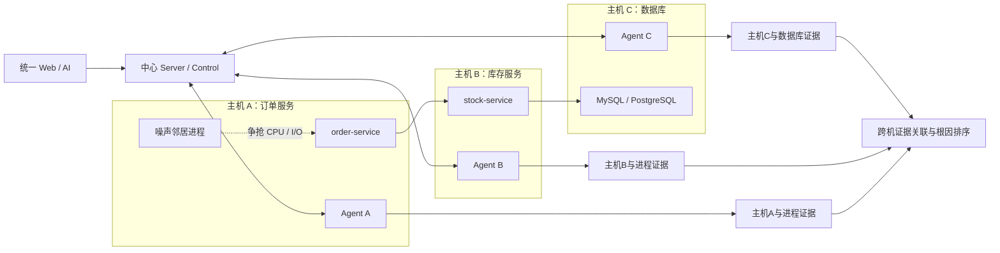

### 多机诊断需要回答的问题

1. 订单服务自己的代码是否出现 CPU 热点？
2. 同一主机的噪声邻居是否抢走资源？
3. 订单服务到库存服务之间是否出现网络异常？
4. 库存服务本身是否变慢？
5. 数据库是否存在锁等待、慢查询或连接池耗尽？

---

## 9. 多机诊断时序图

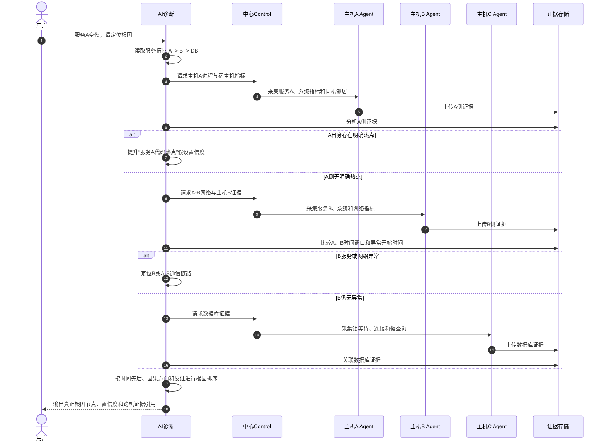

---

## 10. Agent 内部流程图

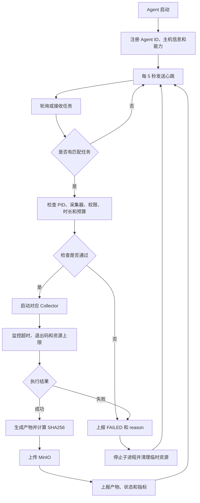

### Agent 是不是一个 Python 文件？

不是。Agent 是一个长期运行的系统组件，通常包含：

```text
Agent
├─ 注册与心跳
├─ 任务领取与状态上报
├─ Collector 插件管理
├─ 子进程与超时控制
├─ 产物上传与哈希校验
├─ 故障注入与 finally 清理
└─ 日志与审计
```

它可以用 C++、Go、Rust 或 Python 实现。本项目的重构方向是 C++ 核心 Agent，Python 主要负责 Analyzer 和 AI 诊断。

---

## 11. 汇报时建议展示的三张图

如果时间有限，按以下顺序展示：

1. **项目总体架构图**：说明各语言和组件的职责。
2. **AI 循证诊断流程图**：突出假设、决策树、真实证据和人工审批。
3. **真实故障 Campaign 时序图**：解释测试集不是直接给答案，而是先制造故障、再诊断、最后读取 Oracle 评分并清理。

### 一句话收尾

> Mini-Drop 的基础链路负责真实地采集和分析性能数据，AI 层负责决定下一步查什么并用证据验证假设，Campaign 则负责真实制造故障并检验 AI 是否真的找到了根因。

