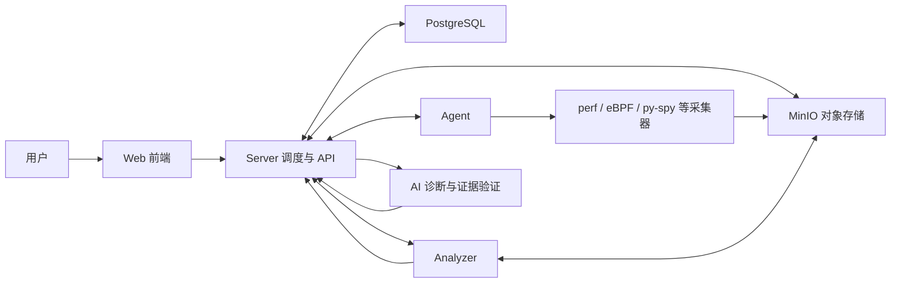
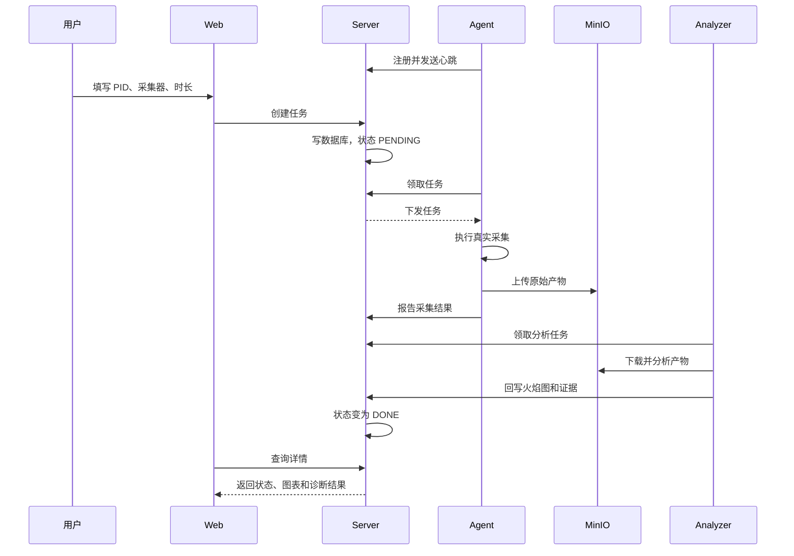

# Mini-Drop 零基础人话教程

> 适合第一次接触 Linux、性能分析、Agent、eBPF 和 AI 诊断的同学。  
> 这不是一份只给程序员看的接口文档。它先用生活例子解释“为什么”，再说明项目里的真实实现。

---

## 0. 怎么使用这份教程

第一次不要试图记住所有名词。按下面三遍阅读：

1. **第一遍只看第 1～4 章**：知道项目是什么，以及一次任务怎么跑完。
2. **第二遍看第 5～10 章**：理解采集器、火焰图、数据库和 AI。
3. **第三遍看第 11～15 章**：准备汇报、演示和导师提问。

碰到陌生词先去看最后的“术语表”。很多词只是一个普通概念的英文名字。

---

# 1. 这个项目到底是干什么的

## 1.1 先看一个真实问题

假设线上有一个短视频服务，用户突然反馈：

> 页面打开很慢，接口以前 100 毫秒返回，现在要 3 秒。

开发人员知道“服务变慢了”，但还不知道原因。可能性很多：

- 程序里某个函数一直做无用计算；
- 内存不断增长，垃圾回收变频繁；
- 磁盘读写太慢；
- 网络丢包；
- 数据库锁住了；
- 同一台机器上的另一个程序抢走了 CPU；
- 下游服务变慢，本服务只是被拖累。

传统排查方式通常是工程师登录服务器，手工执行 `top`、`perf`、`bpftrace`、
`py-spy` 等命令，再把不同工具的结果拼起来分析。问题是：

- 命令多，新人不知道选哪个；
- 采集结果散落在服务器上；
- 多台机器时很难统一查看；
- 人工分析速度慢；
- 同样的排查过程会被重复执行。

Mini-Drop 把这套过程做成一个平台。

## 1.2 一句话定义

**Mini-Drop 是一个远程性能体检系统。**

用户在网页上选择一台机器和一个进程，系统自动采集这个进程的运行数据，
生成火焰图、热点函数和诊断证据，再由规则或 AI 帮助判断变慢原因。

## 1.3 它不是什么

Mini-Drop 不是：

- 给普通用户加速手机的工具；
- 杀毒软件；
- 只会聊天的智能客服；
- 自动修改业务代码的机器人；
- 只显示 CPU 百分比的监控看板。

监控系统通常回答“现在有没有异常”。Mini-Drop 更关心：

> 异常发生后，究竟是哪段代码、哪种资源或哪个关联节点导致的？

## 1.4 用“医院体检”来理解

可以把整个系统想成医院：

| 医院里的角色 | Mini-Drop 中的角色 | 负责什么 |
|---|---|---|
| 患者 | 被诊断的程序 | 出现卡顿、CPU 高、IO 慢等问题 |
| 挂号台 | Web 前端 | 填写诊断目标并查看结果 |
| 医生工作站 | Server | 创建任务、保存状态、协调其他组件 |
| 检查设备 | Agent 和采集器 | 在目标机器上采集真实数据 |
| 检验科 | Analyzer | 把原始数据加工成火焰图和指标 |
| 病历系统 | PostgreSQL | 保存任务、状态、审计和诊断记录 |
| 影像存储 | MinIO | 保存体积较大的原始采集文件 |
| 会诊医生 | AI 诊断模块 | 根据证据提出原因和下一步检查 |

理解这张表，后面的架构就不会那么抽象。

---

# 2. 系统由哪些部分组成

## 2.1 Web：用户操作的网页

Web 是用户看到的前端页面，使用 React 开发。

它负责：

- 显示 Agent 是否在线；
- 创建性能采集任务；
- 展示任务从创建到完成的过程；
- 查看火焰图、热点函数和系统指标；
- 发起 AI 诊断；
- 审批 AI 建议的采集动作；
- 查看历史诊断和审计日志。

Web 本身不进入 Linux 内核采集数据。它只是操作入口和结果展示层。

## 2.2 Server：系统的总调度台

Server 使用 FastAPI、SQLAlchemy 和 PostgreSQL。

它负责：

- 接收 Web 请求；
- 校验任务参数；
- 把任务写入数据库；
- 等待 Agent 领取任务；
- 记录每次状态变化；
- 保存 Agent 心跳；
- 协调 Analyzer；
- 给 Web 返回任务和诊断结果；
- 管理 AI 诊断会话、证据和审批。

可以把 Server 理解成项目经理：它不亲自做所有工作，但知道工作交给谁、做到哪一步、失败原因是什么。

## 2.3 Agent：安装在被测机器上的采集程序

Agent 是一个常驻的小程序，运行在 Linux 主机或容器里。

它负责：

- 向 Server 注册自己；
- 每隔几秒发送心跳，说明“我还活着”；
- 告诉 Server 自己支持哪些采集器；
- 领取属于自己的任务；
- 启动 perf、eBPF、py-spy 等工具；
- 上传采集结果；
- 报告成功、失败或降级原因。

为什么需要 Agent？

因为真正的性能数据在目标机器上。Server 即使知道目标 PID，也不能隔着网络直接读取另一台机器的内核数据，所以需要 Agent 在当地执行采集。

## 2.4 Analyzer：把原始数据变成人能看的结果

采集工具产生的数据往往不适合直接展示。例如 perf 会产生调用栈样本，eBPF 会产生内核事件。

Analyzer 负责：

- 读取原始采集产物；
- 解析调用栈；
- 合并相同栈；
- 统计热点函数；
- 生成火焰图所需的树形数据；
- 整理可被 AI 引用的证据；
- 把分析结果写回系统。

它相当于检验科。Agent 负责“抽血”，Analyzer 负责“出化验单”。

## 2.5 PostgreSQL：保存结构化记录

PostgreSQL 是关系型数据库。

它保存：

- Agent 信息；
- 任务参数；
- 任务状态；
- 状态变化原因；
- 任务事件；
- 分析任务；
- AI 诊断会话；
- 假设、证据、审批和最终报告；
- 审计日志。

这些数据有固定字段，也需要查询、排序和关联，所以适合放数据库。

## 2.6 MinIO：保存大文件

MinIO 是对象存储，可以把它理解成系统内部的“文件仓库”。

它保存：

- perf 原始文件；
- 调用栈文本；
- eBPF 采集结果；
- 分析后的 JSON；
- 其他体积较大的采集产物。

为什么不全部塞进 PostgreSQL？

数据库适合保存任务编号、状态、时间等结构化信息。大文件全部放数据库会让备份和查询变重，因此文件交给 MinIO，数据库只保存文件地址和元数据。

## 2.7 整体关系



---

# 3. 一次完整任务是怎么跑的

这是整个项目最需要讲清楚的部分。

## 3.1 第一步：Agent 上线

Agent 启动后先向 Server 注册：

> 我叫 `agent_local_demo`，运行在 Linux 上，我支持 perf、eBPF、py-spy、系统指标等能力。

Server 把这些信息保存起来，Web 的“采集节点”页面就能看到这台 Agent。

## 3.2 第二步：Agent 持续发送心跳

心跳不是人的心跳，而是一条定期发送的小消息。

它表达：

> 我还在线，当前时间是……，我的版本是……，资源情况是……

如果 Server 长时间收不到心跳，就把 Agent 标记为离线。恢复收到心跳后再标记为在线，并写入审计日志。

## 3.3 第三步：用户创建任务

用户在 Web 填写：

- 目标 Agent；
- 目标进程 PID；
- 采集器类型；
- 采样时长；
- 采样频率；
- 是否持续采集。

点击创建后，Web 调用 Server 的 REST API。

## 3.4 第四步：Server 保存任务

Server 不会只把任务放在内存里，而是先写入 PostgreSQL。

任务初始状态通常是：

```text
PENDING（等待执行）
```

这样即使 Server 重启，任务记录仍然存在。

## 3.5 第五步：Agent 领取任务

Agent 定期向 Server 询问：

> 有分给我的任务吗？

Server 找到任务后交给 Agent。Agent 成功领取后，状态进入：

```text
RUNNING（正在采集）
```

## 3.6 第六步：采集器执行

Agent 根据任务类型选择对应采集器：

- CPU 调用栈：perf；
- 内核 IO：eBPF/bpftrace；
- Python：py-spy；
- Java：async-profiler；
- Go：pprof；
- 内存：`/proc` 和 smaps；
- 主机指标：sys metrics。

采集器不是模拟生成几行数据，而是执行真实工具读取目标进程或内核信息。

## 3.7 第七步：上传原始产物

采集完成后，Agent 把文件上传到 MinIO，并告诉 Server：

- 文件在哪里；
- 使用了什么采集器；
- 采集是否真实成功；
- 是否发生降级；
- 失败原因是什么。

任务进入上传或分析阶段。

## 3.8 第八步：Analyzer 处理

Analyzer 领取分析任务，下载原始产物，然后生成：

- 火焰图树；
- TopN 热点函数；
- 资源统计；
- AI 可使用的证据条目。

成功后任务变成：

```text
DONE（完成）
```

失败则变成：

```text
FAILED（失败）
```

## 3.9 第九步：Web 展示

Web 定期查询任务状态。任务完成后，用户可以打开详情页查看：

- 完整状态历史；
- 采集器和真实/降级标记；
- 火焰图；
- 热点函数；
- 原始证据；
- 规则归因或 AI 诊断结果。

## 3.10 一张图记住全流程



这就是导师所说的“端到端跑通”：不能只做一个网页，也不能只在终端执行 perf。必须从用户下发任务一直走到结果展示。

---

# 4. 状态机是什么

## 4.1 人话解释

状态机就是规定一件事情允许按照什么顺序变化。

快递有“已下单、运输中、派送中、已签收”。性能任务也有自己的状态：

```text
PENDING → RUNNING → UPLOADING → ANALYZING → DONE
                                      └────→ FAILED
```

当前实现会根据具体任务使用对应状态，但原则相同：每一步必须明确、可追踪。

## 4.2 为什么不能直接改成完成

如果任务从“等待”直接变成“完成”，排查问题时就不知道：

- Agent 有没有领取；
- 采集是否执行；
- 文件有没有上传；
- Analyzer 有没有处理；
- 到底在哪一步失败。

因此每次变化都要保存：

- 原状态；
- 新状态；
- 发生时间；
- `reason`，也就是变化原因。

## 4.3 reason 是什么

`reason` 不是错误码的装饰，而是给人看的解释。

例如：

```text
PENDING → RUNNING
reason: Agent 已领取任务
```

```text
RUNNING → FAILED
reason: 当前内核禁止 perf_event_open
```

这样 Web、日志和审计页面可以回答“为什么”。

## 4.4 原指南里的六个核心对象

原指南中的 Agent、Task、TaskAttempt、Artifact、AnalysisJob、TaskEvent 看起来像六套东西，
其实是在回答六个不同问题。

### Agent：谁来干活

Agent 代表一台可执行采集任务的节点。它记录：

- 自己是谁；
- 运行在哪台机器；
- 最后一次心跳时间；
- 当前在线还是离线；
- 支持哪些采集器；
- 当前版本和系统信息。

### Task：用户想做什么

Task 是用户提出的诊断需求，例如：

> 在 `agent-01` 上，对 PID 9425 使用 perf 采 30 秒。

Task 保存的是目标和要求。它是用户最关心的那条记录。

### TaskAttempt：这次具体执行得怎么样

同一个 Task 可能执行不止一次。

例如第一次因为 MinIO 暂时不可用而失败，系统稍后重试。用户需求还是同一个 Task，
但已经产生两次执行：

```text
Task: 采集 PID 9425
├── Attempt 1：上传失败
└── Attempt 2：执行成功
```

把 Task 和 TaskAttempt 分开，就能保留每次尝试的开始时间、结束时间、错误和执行节点。

当前 Mini-Drop 的部分简单任务会把执行信息直接体现在任务事件和状态记录里；
生产级扩展时，独立 Attempt 模型更适合复杂重试。

### Artifact：执行后产生了什么

Artifact 是采集或分析产生的文件、JSON 和其他数据。

它会记录：

- 属于哪个任务；
- 是原始采集还是分析结果；
- 存储地址；
- 文件大小和类型；
- 校验值；
- 由哪个采集器生成。

### AnalysisJob：哪份数据等待分析

Agent 上传原始数据后，并不代表用户已经能看懂。Server 会创建 AnalysisJob：

> 请 Analyzer 把 Artifact 123 解析成火焰图和热点函数。

它与 Task 分开，是因为采集和分析可能由不同组件、不同时间完成，也可以独立重试。

### TaskEvent：过程中发生过什么

TaskEvent 是任务的时间线：

```text
10:00:00 用户创建任务
10:00:02 Agent 领取任务
10:00:05 采集器启动
10:00:35 原始产物上传完成
10:00:37 Analyzer 开始处理
10:00:39 分析完成
```

Task 表只保存“现在是什么状态”，TaskEvent 保存“它是怎么走到这里的”。

## 4.5 队列、领取和租约

### 队列是什么

队列像食堂取餐号。任务先排队，空闲 Worker 再领取。

使用队列思想后，Server 不需要在创建任务的那个 HTTP 请求里等待采集 30 秒，
Web 也不会因为采集时间长一直卡住。

### Claim/领取是什么

Agent 或 Analyzer 向 Server 声明：

> 这条任务由我处理，其他 Worker 暂时不要再拿。

这一步叫 claim。

### Lease/租约是什么

如果 Worker 领取任务后直接崩溃，任务不能永远被它占着。

租约表示：

> 这条任务在未来 60 秒归我；我必须续租，否则系统可以重新分配。

它类似租用共享单车。超过有效期没有续约，资源会重新开放。

### 为什么不让 Server 直接把任务“推”给 Agent

Agent 主动拉取任务通常更容易穿过防火墙，也能由 Agent 控制自己的并发数量。
Server 只维护待领取任务，不必主动连接每一台内网机器。

## 4.6 TaskKind 和 Capability

### TaskKind

TaskKind 表示任务类型，例如：

- `perf_cpu`；
- `ebpf_io`；
- `pyspy`；
- `memory_smaps`；
- `continuous_perf`。

### Capability

Capability 表示某个 Agent 具备的能力。

Server 下发前要检查：

```text
任务要求 ebpf_io
Agent 是否声明支持 ebpf_io？
```

如果不支持，就不应把任务交给它。这比执行后才发现命令不存在更可靠。

---

# 5. PID、进程、调用栈和热点函数

## 5.1 进程是什么

程序文件放在硬盘上时只是文件。运行起来后，操作系统会给它分配 CPU、内存等资源，这个运行中的实例叫进程。

例如同时打开两个 Python 服务，它们可以使用同一份 Python 解释器，但属于两个不同进程。

## 5.2 PID 是什么

PID 是进程编号，相当于进程的临时身份证。

Mini-Drop 需要 PID，是为了告诉采集器：

> 不要采整台机器，重点观察编号为 9425 的进程。

PID 会随进程重启而变化，所以不能永远把某个服务写死为 PID 9425。

## 5.3 函数是什么

函数是一段可以反复调用的代码。例如：

- `parse_request()` 解析请求；
- `query_database()` 查询数据库；
- `encode_video()` 编码视频。

## 5.4 调用栈是什么

程序执行函数时经常一层调用一层：

```text
处理请求
└── 查询订单
    └── 访问数据库
        └── 等待网络返回
```

这条“谁调用了谁”的路径叫调用栈。

只知道某个函数很忙还不够。调用栈还能告诉我们它是从哪条业务路径进入的。

## 5.5 热点函数 TopN 是什么

采样过程中，如果某个函数频繁出现，说明程序大量时间花在这里。

TopN 就是按样本数量排序后，取最靠前的 N 个函数。例如 Top10 表示最热的 10 个函数。

热点不等于错误。一个视频编码服务里，编码函数本来就会很热。诊断时还要结合基线、业务类型和其他证据判断。

---

# 6. 采集器都是什么

采集器可以理解成不同科室的检查设备。没有一种工具能回答所有问题。

## 6.1 perf：看 CPU 时间花在哪里

perf 是 Linux 性能分析工具。

它会按照一定频率观察目标进程当时正在执行的调用栈。采样结束后统计：

- 哪些函数出现最多；
- 调用关系是什么；
- CPU 时间集中在哪条路径。

适合：

- CPU 使用率高；
- 程序计算慢；
- 想找热点函数。

限制：

- 需要 Linux 内核开放 perf 权限；
- 容器环境可能受安全策略限制；
- 没有调试符号时可能出现 `[unknown]`。

## 6.2 eBPF：观察内核里发生了什么

应用程序读文件、发网络包、切换线程时都要进入 Linux 内核。

eBPF 允许我们在内核事件上挂一个小型观察程序，在不修改业务程序的情况下记录事件。

本项目使用 bpftrace 作为 eBPF 的一种实现方式，重点观察 IO 或调度等内核行为。

适合：

- 磁盘 IO 抖动；
- 系统调用异常；
- 调度延迟；
- 需要观察内核事件。

为什么它是扩展能力？

因为 perf 更偏 CPU 调用栈，而 eBPF 能看到应用程序下面的内核层。两者观察角度不同。

## 6.3 py-spy：专门看 Python

py-spy 是 Python 进程采样器。

它能更自然地显示 Python 函数名，而不是只看到解释器内部函数。

适合：

- FastAPI、Django、数据处理等 Python 服务；
- 查找 Python 代码热点；
- 不希望修改业务代码。

## 6.4 async-profiler：专门看 Java

async-profiler 用于 Java 进程，能够采集 CPU、分配和锁等信息。

适合 Java 服务。当前项目保留对应采集能力，但演示是否成功仍取决于目标进程和运行权限。

## 6.5 pprof：常用于 Go

Go 程序可以主动暴露 pprof HTTP 接口。采集器访问这个接口，下载 CPU 或内存 profile。

它与 perf 的区别是：

- perf 从操作系统角度采样；
- pprof 由 Go 运行时主动提供语言级信息。

## 6.6 memory/smaps：看内存使用

Linux 的 `/proc` 文件系统会暴露进程信息。smaps 能进一步说明内存分布。

适合：

- RSS 持续增长；
- 怀疑内存泄漏；
- 分析匿名内存和映射文件。

## 6.7 sys_metrics：看整台机器

它采集 CPU、内存、磁盘、网络等系统指标。

为什么诊断一个进程还要看整机？

因为服务慢不一定是服务自己的错。假如目标进程 CPU 只用了 10%，但整台机器 CPU 已经 100%，就要怀疑其他进程抢资源。

## 6.8 Continuous Profiling：持续低频体检

普通任务是“现在采 30 秒”。持续 Profiling 则是长期低频采样，并定时切成小片段。

作用：

- 问题发生后回看过去；
- 比较发布前后的热点变化；
- 找偶发问题；
- 观察某个时间窗口。

它类似监控录像。单次采集像现场拍照，持续 Profiling 像持续录像。

---

# 7. 火焰图怎么看

## 7.1 它不是温度图

“火焰图”里的火焰只是形状像火焰，不代表温度。

每个矩形代表一个函数：

- **宽度**：这个函数或它的子调用占了多少样本；
- **上下关系**：下面的函数调用了上面的函数；
- **横向位置**：主要用于排版，不表示时间先后。

## 7.2 怎么找问题

先找最宽的块，再向上看调用路径。

例如：

```text
handle_request
└── build_report
    └── json_encode
```

如果 `json_encode` 很宽，说明大量 CPU 样本落在 JSON 编码路径上。

## 7.3 为什么会出现 unknown

常见原因：

- 程序没有调试符号；
- 栈展开信息不足；
- 容器或内核限制；
- 程序经过裁剪；
- 采集目标过于简单。

`unknown` 不等于假采集，但会降低可读性。演示时应选择有明显函数调用的目标程序，并准备符号信息。

## 7.4 火焰图和 TopN 的区别

- TopN 告诉你“哪个函数最热”；
- 火焰图告诉你“它是通过哪条调用路径变热的”。

两者应该联动使用。

## 7.5 Analyzer Registry 和流水线

不同产物需要不同分析方法：

- perf 数据要解析调用栈；
- pprof 数据要按 pprof 格式读取；
- eBPF IO 数据要统计事件分布；
- 内存数据要计算区域和增长趋势。

Analyzer Registry 可以理解为“分析器目录”：

```text
artifact_type = perf        → PerfAnalyzer
artifact_type = pprof       → PprofAnalyzer
artifact_type = ebpf_io     → EbpfIoAnalyzer
```

所谓流水线，就是按固定步骤处理：

```text
下载原始产物
→ 校验格式
→ 解析
→ 聚合
→ 生成可视化数据
→ 生成证据
→ 上传分析结果
→ 回写任务状态
```

把分析器注册起来后，新增采集器时不用修改一大段 `if/else`，只要实现共同接口并注册。

## 7.6 离线分析是什么意思

这里的“离线”不是断网，而是指：

> 采集已经结束，之后再对保存下来的文件进行分析。

好处是采集阶段尽量短，复杂计算交给 Analyzer 慢慢处理；同一份原始数据以后也能使用新算法重新分析。

---

# 8. REST、gRPC、Protobuf 和接口契约

## 8.1 API 是什么

API 是程序之间约定好的办事窗口。

例如 Web 想创建任务，不会直接修改数据库，而是向 Server 发送：

```text
POST /api/tasks
```

Server 校验后再执行后续逻辑。

## 8.2 REST 是什么

REST 是常见的 Web API 风格，通常使用 HTTP 和 JSON。

适合：

- Web 调用 Server；
- 用户查询任务；
- 查看 Agent、审计和诊断报告。

## 8.3 gRPC 是什么

gRPC 也是程序通信方式，但更适合内部服务之间传输结构化消息。

本项目用它承载 Server、Agent 等组件的部分内部通信。

可以简单记成：

- 浏览器到 Server：常用 REST；
- 内部组件间：可以使用 gRPC。

## 8.4 Protobuf 是什么

Protobuf 是 gRPC 消息的说明书。

它规定：

```text
Agent 注册消息必须有 agent_id、hostname、version……
```

不同程序按照同一份 `.proto` 文件生成代码，减少“你以为这个字段叫 id，我以为叫 agentId”的问题。

## 8.5 接口契约是什么

契约就是双方提前约定：

- 请求有哪些字段；
- 字段是什么类型；
- 哪些字段必填；
- 响应长什么样；
- 出错如何表达；
- 版本如何兼容。

`../contracts/drop-insight-api.md` 规定的就是 AI 诊断模块如何交换会话、假设、工具、证据和报告。

## 8.6 Handler、Service、Repository 分别是什么

后端工程经常把代码分成几层，这不是为了把目录弄复杂，而是让每层只负责一种事情。

### Handler/Router：接待窗口

它负责接收 HTTP 请求：

- 读取路径和参数；
- 检查请求格式；
- 调用业务服务；
- 把结果包装成 HTTP 响应。

它不应该在一个函数里完成采集、写数据库和 AI 分析。

### Service：业务规则

Service 处理真正的业务判断：

- 能不能创建任务；
- 状态是否允许变化；
- Agent 是否具备要求的能力；
- 是否需要人工审批；
- 下一步应该创建什么 AnalysisJob。

### Repository：数据存取

Repository 把“业务想保存什么”转换成数据库操作。

业务层只说：

> 请保存这个任务。

Repository 再决定使用 SQLAlchemy 如何插入 PostgreSQL。这样测试业务逻辑时，可以换成内存 Repository，不必每次启动真实数据库。

### Schema/Model：两种容易混淆的数据结构

- Schema 常用于 API 请求和响应校验；
- Model 常用于数据库表映射。

它们可能有相似字段，但用途不同。外部用户不应该直接控制数据库内部字段。

## 8.7 Middleware 是什么

Middleware 是所有请求都会经过的公共通道。

适合处理：

- 请求 ID；
- 访问日志；
- 身份认证；
- 耗时统计；
- 跨域配置；
- 统一异常处理。

这样不需要在每个 API 函数里重复写同一段代码。

## 8.8 为什么要分层

如果把全部逻辑写进一个 `main.py`：

- 修改数据库可能影响 HTTP 接口；
- 单元测试很难写；
- 同一业务无法被 CLI、定时任务和 Web 共同复用；
- 出错时不知道问题属于哪一层。

当前项目按页面、API、诊断、存储、状态机和采集器拆分，就是为了让这些职责可独立测试和扩展。

---

# 9. 数据库、对象存储和审计

## 9.1 SQLAlchemy 是什么

SQLAlchemy 是 Python 操作关系型数据库的工具。

不用它时，代码可能直接写：

```sql
SELECT * FROM tasks WHERE id = ...
```

使用 SQLAlchemy 后，可以把数据库表映射成 Python 对象，同时管理连接和事务。

它不是数据库。数据库是 PostgreSQL，SQLAlchemy 是 Python 与数据库之间的桥。

## 9.2 事务是什么

事务保证一组数据库操作要么一起成功，要么一起失败。

例如状态变更时需要同时：

1. 更新任务当前状态；
2. 插入一条状态历史；
3. 写一条审计事件。

如果只成功第一步，历史记录就会丢失。事务用来避免这种半成品。

## 9.3 Artifact 是什么

Artifact 在本项目中译作“产物”或“制品”，指任务产生的文件和数据。

例如：

- perf 原始文件；
- 折叠后的调用栈；
- 火焰图 JSON；
- eBPF 事件统计。

数据库保存 Artifact 的名称、类型、地址和校验信息，真正的大文件放在 MinIO。

## 9.4 审计日志是什么

普通日志记录程序发生了什么。审计日志重点记录：

- 谁进行了操作；
- 操作了什么资源；
- 操作时间；
- 操作结果；
- 是否涉及审批或权限。

例如 Agent 离线、恢复，或者用户批准 AI 的采集计划，都应留下审计记录。

---

# 10. AI 智能诊断到底怎么工作

## 10.1 它不是把火焰图直接丢给聊天机器人

如果只把一张图发给大模型，然后问“哪里有问题”，结果很容易不稳定，也无法验证。

当前方案把 AI 放在一个受约束的诊断流程里：

```text
用户描述问题
→ 系统整理上下文
→ AI 提出假设
→ AI 选择只读工具
→ 人工审批采集
→ Agent 获取真实数据
→ Analyzer 生成证据
→ AI 更新判断
→ 证据校验
→ 输出报告
```

## 10.2 自然语言入口

用户可以说：

> 过去十分钟这个 Python 服务变慢了，帮我看看是不是 CPU 问题。

系统需要把这句话拆成结构化信息：

- 目标服务或 Agent；
- 时间范围；
- 症状；
- 可能需要的采集器；
- 采集时长和频率；
- 缺少哪些必要信息。

如果 PID 不明确，系统应该追问或给出候选目标，而不是随便选一个。

## 10.3 假设是什么

AI 不应该一开始就宣布根因，而是先列出可能原因：

- H1：服务自身代码热点；
- H2：同宿主机其他进程抢 CPU；
- H3：共享磁盘 IO 竞争；
- H4：下游数据库或服务变慢；
- H5：当前证据不足。

H 是 Hypothesis，也就是“待验证的猜测”。

## 10.4 Tool/Function Calling 是什么

AI 本身不能直接读取目标机器。

系统给 AI 提供一组允许调用的工具，例如：

- 查询 Agent；
- 查询任务历史；
- 获取系统指标；
- 请求 perf 采集；
- 请求 eBPF IO 采集；
-读取某个 Artifact；
- 查询历史基线。

Function Calling 的作用是让 AI 按固定 JSON 参数调用这些工具，而不是自由生成一段危险命令。

## 10.5 为什么要人工审批

读取历史结果风险较低，可以直接执行。

但新的采集动作可能：

- 增加目标机器负载；
- 需要更高权限；
- 采集敏感数据；
- 持续较长时间。

因此 AI 先生成计划，用户确认后 Agent 才执行。AI 也不会自动重启服务、杀进程或修改系统配置。

## 10.6 Evidence Ref 是什么

Evidence Ref 是证据引用。

AI 的每个结论都要指向真实数据，例如：

```text
结论：疑似同宿主机 CPU 竞争
证据：
- evidence://task/123/sys_metrics/host_cpu
- evidence://task/124/process/top_cpu
置信度：0.82
```

用户可以沿着引用找到原始指标或采集产物。

没有引用的句子只能算建议，不能算已经证实的根因。

## 10.7 置信度是什么

置信度表达“系统对这个判断有多确定”。

它不应只由模型凭感觉给出，还应考虑：

- 证据数量；
- 证据是否来自真实采集；
- 多条证据是否互相支持；
- 是否存在相反证据；
- 数据是否已经过期；
- 采集器是否降级。

## 10.8 多轮反证是什么

假设 AI 认为“服务自身代码有问题”，系统不能只收集支持这个结论的数据。

还要主动问：

- 同机其他服务是否同样变慢？
- 主机 CPU 是否整体高？
- 下游延迟是否先升高？
- 网络重传是否异常？

如果发现同机所有服务都变慢，而且某个邻居进程占满 CPU，就应推翻原假设，改为“噪声邻居”。

这就是反证：主动寻找能否定当前判断的数据。

## 10.9 停止条件和预算

AI 不能无限采集。每次诊断要限制：

- 最多轮数；
- 最长时间；
- 最大采集次数；
- 允许使用的采集器；
- 资源开销；
- 高风险动作数量。

达到预算、证据已经充分，或者继续采集也无法区分假设时，诊断结束。

## 10.10 RAG 和知识库是什么

RAG 可以简单理解为“回答前先查资料”。

知识库可以保存：

- CPU 高的常见原因；
- Linux IO wait 的解释；
- 网络重传排查方法；
- MySQL 锁等待知识；
- 公司内部服务说明；
- 各采集器的使用限制。

AI 先检索相关知识，再结合实时证据生成诊断。知识只能帮助解释，不能替代现场数据。

## 10.11 Golden 评测是什么

Golden 数据集是一套有标准答案的诊断题。

当前场景包括：

- 服务自身代码热点；
- 同宿主机噪声邻居；
- 共享 IO 竞争；
- 下游服务压力；
- 内存增长；
- 网络丢包；
- MySQL 锁等待。

评测检查：

- 分类是否正确；
- 是否找到了要求的证据；
- Evidence Ref 是否真的存在；
- 采集器选择是否合理；
- 是否提出反证计划；
- 是否擅自执行危险操作。

当前容器运行时的 Golden 评测结果为 7/7 通过。它证明规则和流程在这些已知题目上符合预期，但不代表 AI 已经解决所有线上故障。

---

# 11. 单机、多 Agent 和多机是什么关系

## 11.1 单机单 Agent

最简单环境：

```text
一台机器
└── 一个 Agent
    └── 一个或多个被测进程
```

适合先验证完整流程。

## 11.2 单机多 Agent

同一台机器启动多个 Agent，只能验证：

- Server 能否管理多个 Agent 身份；
- 任务能否分发给不同 Agent；
- 多 Agent 状态是否隔离。

它不能真实模拟多台机器之间的网络故障和资源差异，因为底层仍共享一套内核和硬件。

## 11.3 多机多 Agent

更接近生产环境：

```text
Control 节点：Web + Server + PostgreSQL + MinIO
Worker 1：Agent + 服务 A
Worker 2：Agent + 服务 B
```

这时才能测试：

- 真实网络通信；
- 某台 Worker 离线；
- 跨节点任务；
- 上下游服务关联；
- 单机问题和通信问题的区分。

项目中的 `multi-node-deployment.md` 专门说明三节点部署。

---

# 12. Docker、容器和部署

## 12.1 Docker 是什么

Docker 把程序和依赖打包成镜像，再以容器运行。

没有 Docker 时，用户需要分别安装：

- Python 和依赖；
- Node.js；
- PostgreSQL；
- MinIO；
- Nginx；
- 各种配置。

使用 Docker Compose 后，在项目目录执行：

```powershell
docker compose up -d --build
```

就能按统一配置启动多个组件。

## 12.2 镜像和容器的区别

- 镜像：安装包或模板；
- 容器：镜像运行起来后的实例。

类似：

- Windows 安装镜像是模板；
- 已经启动的 Windows 系统是运行实例。

## 12.3 Docker Compose 是什么

Compose 文件描述：

- 要启动哪些服务；
- 使用什么镜像；
- 端口如何映射；
- 环境变量是什么；
- 服务之间的依赖；
- 数据卷放哪里；
- 健康检查怎么做。

当前默认 Compose 会启动 Web、Server、Agent、Analyzer、PostgreSQL 和 MinIO。

## 12.4 为什么 Windows Docker 的 perf 可能失败

Docker Desktop 的 Linux 实际运行在 WSL2 虚拟化内核中。

perf 和 eBPF 依赖内核能力、系统调用权限和容器 capability。即使容器使用了较高权限，也不代表宿主的 WSL2 内核开放了全部能力。

因此：

- Windows Docker 适合演示平台流程、页面和 AI 证据闭环；
- 原生 Ubuntu 更适合验收真实 perf/eBPF；
- 发生权限不足时必须明确标记失败或降级，不能伪造采集结果。

---

# 13. 失败、降级、重试和恢复

生产系统不能只考虑成功路径。

## 13.1 失败和降级有什么区别

- **失败**：任务没有得到可用结果；
- **降级**：首选方式不可用，但系统使用较弱方式获得了部分结果。

例如 perf 权限不足：

- 如果没有替代数据，任务失败；
- 如果退回系统指标采集，任务可以标记降级，但不能伪装成真实 perf。

## 13.2 常见异常

### Agent 离线

Server 长时间收不到心跳，标记离线并记录审计。

### 目标 PID 不存在

Agent 执行前校验 PID，失败时返回明确 reason。

### 采集器没安装

Agent 在能力列表中不应声称支持该采集器，或者执行时报告工具缺失。

### 权限不足

记录内核或命令返回的错误，不生成虚假火焰图。

### 上传失败

保留任务状态和错误原因，根据幂等策略重试，避免重复产物。

### Analyzer 崩溃

分析任务需要租约或超时机制，让其他 Worker 后续能够重新领取。

## 13.3 幂等是什么

幂等表示同一个操作重复执行，不会产生多个冲突结果。

例如 Agent 因网络问题重复上报同一次状态，Server 不应插入两份互相矛盾的任务结果。

---

# 14. 安全、权限和可观测性

## 14.1 最小权限

Agent 的某些采集器需要内核权限，但不能因此让所有组件都长期使用最高权限。

合理做法是：

- 只有需要的采集组件获得对应 capability；
- Server、Web 和数据库不共享 Agent 的高权限；
- 对命令、PID、路径和参数做校验；
- 高风险动作必须人工确认。

## 14.2 结构化日志

普通日志是一整句话。结构化日志会把信息拆成字段：

```json
{
  "event": "task_state_changed",
  "task_id": "task_123",
  "from": "RUNNING",
  "to": "FAILED",
  "reason": "perf permission denied"
}
```

这样更容易搜索、统计和告警。

## 14.3 Metrics、Trace、Log

这三个词经常一起出现：

- Metrics：数值趋势，如 CPU、请求量、失败率；
- Log：某个时间点发生的事件；
- Trace：一次请求经过多个服务的完整路径。

它们回答的问题不同：

- Metrics 告诉你“什么时候开始变坏”；
- Log 告诉你“发生了什么”；
- Trace 告诉你“慢在调用链的哪一段”；
- Profiling 告诉你“进程内部时间花在哪些函数”。

Mini-Drop 当前重点是 Profiling 和诊断证据闭环，分布式 Trace 仍可继续扩展。

---

# 15. 测试和验收是在测什么

## 15.1 单元测试

单独测试一个函数或模块。

例如：

- 状态机是否拒绝非法跳转；
- 证据引用是否校验；
- 采集器解析是否正确。

## 15.2 集成测试

测试多个模块配合：

- Server 写数据库；
- Agent 领取任务；
- Analyzer 回写结果。

## 15.3 端到端测试

从用户入口一直走到最终结果。

导师最看重的端到端演示应该包含：

1. Agent 在线；
2. 创建真实目标进程；
3. Web 下发任务；
4. Agent 领取；
5. 采集器执行；
6. 状态连续变化；
7. Analyzer 生成结果；
8. Web 打开火焰图；
9. 结果显示真实采集或明确的降级状态。

## 15.4 当前项目验证情况

当前清理后的项目已经验证：

- Python 测试 419 项通过；
- React 生产构建通过；
- Docker 纯净源码构建通过；
- Web、Server、Agent、Analyzer、PostgreSQL、MinIO 正常运行；
- Agent 在线；
- Server 健康检查正常；
- AI Golden 场景 7/7 通过。

这些结果说明当前代码能构建、能启动，主要软件链路可运行。真实 perf/eBPF 的最终效果仍取决于 Linux 内核、目标程序和权限环境。

---

# 16. 原指南与当前实现怎么对应

| 原指南要求 | 当前项目中的实现 |
|---|---|
| Web 展示 | React 页面、任务详情、Agent、审计、AI 诊断 |
| API 编排 | FastAPI Server |
| Agent 注册与心跳 | Python Agent 与 Server 通信 |
| 任务状态机 | 数据库存储状态、reason 和事件 |
| 对象存储 | MinIO |
| 关系数据 | PostgreSQL + SQLAlchemy |
| perf CPU | perf 采集器 |
| eBPF | bpftrace/eBPF IO 采集器 |
| 语言级采样 | py-spy、pprof、async-profiler |
| 离线分析 | Analyzer 与 AnalysisJob |
| 火焰图 | Web 火焰图和 TopN |
| 持续 Profiling | 持续采集与时间窗口 |
| 智能建议 | 规则归因、Drop Insight 诊断闭环 |
| AI 可靠性 | Evidence Ref、置信度、人工审批、Golden 门禁 |
| 多机 | Control/Worker Compose 与三节点部署文档 |

## 16.1 目前仍要诚实说明的边界

- Windows Docker Desktop 不能代表原生 Linux 内核能力；
- perf/eBPF 是否成功由内核和权限决定；
- 多节点生产稳定性还需要真实机器长期验证；
- Golden 7/7 只覆盖已有标准场景；
- AI 当前擅长受约束诊断，不等于能处理所有未知故障；
- 分布式 Trace、完整 Kubernetes 生产部署还可以继续加强。

汇报时主动说明边界，比把所有功能都说成“完全生产可用”更可信。

---

# 17. 零基础术语表

| 术语 | 人话解释 |
|---|---|
| Linux | 服务器常用操作系统 |
| 进程 | 正在运行的程序实例 |
| PID | 进程编号 |
| CPU | 执行计算的硬件 |
| 内存/RAM | 程序运行时临时存放数据的空间 |
| IO | 程序与磁盘、网络等设备交换数据 |
| Agent | 安装在目标机器上的采集执行程序 |
| Server | 接口、调度和状态管理中心 |
| Analyzer | 把原始采集数据加工成结果的组件 |
| Collector | 某一种性能采集器 |
| perf | Linux CPU 调用栈采样工具 |
| eBPF | Linux 内核中的可编程观察机制 |
| bpftrace | 使用 eBPF 的脚本化工具 |
| py-spy | Python 进程采样工具 |
| async-profiler | Java 性能采样工具 |
| pprof | Go 常用性能分析接口和格式 |
| Profiling | 统计程序时间和资源花在哪里 |
| Continuous Profiling | 长期低频持续采样 |
| 调用栈 | 函数一层调用一层的路径 |
| 火焰图 | 用矩形宽度展示调用栈样本占比的图 |
| TopN | 排名前 N 的热点函数 |
| API | 程序之间约定好的调用入口 |
| REST | 常见的 HTTP/JSON 接口风格 |
| gRPC | 内部服务常用的高效通信方式 |
| Protobuf | gRPC 消息字段的契约文件 |
| JSON | 常见的结构化文本格式 |
| FastAPI | Python Web 后端框架 |
| React | Web 前端框架 |
| SQLAlchemy | Python 操作关系数据库的工具 |
| PostgreSQL | 关系型数据库 |
| MinIO | 保存采集文件的对象存储 |
| Artifact | 任务产生的文件或分析产物 |
| Task | 用户提出的一次采集或诊断需求 |
| TaskAttempt | 同一个任务的某一次具体执行 |
| TaskEvent | 任务过程中的一条时间线事件 |
| AnalysisJob | 等待 Analyzer 处理的分析工作 |
| TaskKind | 任务类型，例如 perf_cpu |
| Capability | Agent 声明自己具备的能力 |
| Registry | 根据类型查找对应实现的注册表 |
| Runner | 负责真正启动外部采集工具的执行器 |
| Worker | 从队列领取并处理任务的工作进程 |
| Queue | 等待 Worker 领取的任务队列 |
| Claim | Worker 声明由自己处理某个任务 |
| Lease | 有有效期的任务占用权 |
| 状态机 | 规定任务允许如何改变状态 |
| reason | 状态变化或失败的原因 |
| 心跳 | Agent 定期报告自己在线的消息 |
| 审计日志 | 记录谁在什么时候做了什么 |
| Handler/Router | 接收 API 请求的入口层 |
| Service | 处理业务规则的代码层 |
| Repository | 负责读写数据库的代码层 |
| Middleware | 所有请求共同经过的处理层 |
| Schema | 用来校验 API 输入输出的数据结构 |
| Model | 映射数据库表的数据结构 |
| Worker Pool | 多个工作进程组成的处理池 |
| Polling/轮询 | 客户端隔一段时间主动查询一次 |
| Event Stream | 服务端持续推送事件变化 |
| Index/索引 | 帮数据库加速查询的数据结构 |
| Transaction/事务 | 一组数据库操作一起成功或失败 |
| Outbox | 保证数据库变化和待发送事件不容易丢失的表 |
| Checksum/校验值 | 用于判断文件是否完整或被修改 |
| Baseline/基线 | 正常时期的数据，用来和异常时期比较 |
| Docker | 打包和运行应用的容器技术 |
| 镜像 | 容器运行前的模板 |
| 容器 | 镜像启动后的运行实例 |
| Docker Compose | 一次编排多个容器的配置和命令 |
| WSL2 | Windows 中运行 Linux 的虚拟化环境 |
| Function Calling | 让 AI 按固定参数调用指定函数 |
| Tool | 允许 AI 使用的受控系统能力 |
| RAG | AI 回答前先检索知识资料 |
| Context | AI 本轮能够看到的上下文数据 |
| Hypothesis | 有待证据验证的原因假设 |
| Evidence Ref | 指向真实数据的证据引用 |
| 置信度 | 系统对结论有多确定 |
| 反证 | 主动寻找能推翻当前判断的证据 |
| Golden 数据集 | 带标准答案的 AI 测试题 |
| 质量门禁 | 指标不达标就阻止发布 |
| 降级 | 首选能力不可用时使用较弱方案 |
| 幂等 | 同一请求重复执行不会产生冲突结果 |
| Trace | 一次请求经过多个服务的完整路径 |
| Metrics | 可统计的数值指标 |

---

# 18. 最后只记住这 8 句话

1. Mini-Drop 是给线上 Linux 程序做远程性能体检的平台。
2. Web 负责操作，Server 负责任务，Agent 负责采集，Analyzer 负责分析。
3. PostgreSQL 保存结构化记录，MinIO 保存采集大文件。
4. perf 看 CPU 调用栈，eBPF 看内核事件，语言采集器看具体语言运行时。
5. 火焰图的宽度表示样本占比，TopN 表示最热的函数排名。
6. 端到端指从 Web 下发任务到 Agent 真采集，再到 Web 看到分析结果。
7. AI 必须通过受控工具获取证据，结论要有 Evidence Ref 和置信度。
8. Windows 可以演示平台链路，真实 perf/eBPF 最好在原生 Ubuntu 验收。

---

## 接下来怎么学

看完本文后按这个顺序操作：

1. 按 [`operations.md`](operations.md) 启动项目；
2. 打开 `http://localhost`，认识每个页面；
3. 按 [`acceptance.md`](acceptance.md) 操作一遍；
4. 再阅读 [`../ai/falsification-loop.md`](../ai/falsification-loop.md)；
5. 最后回到第 18 章，确认自己能用自己的话解释这 8 句话。
