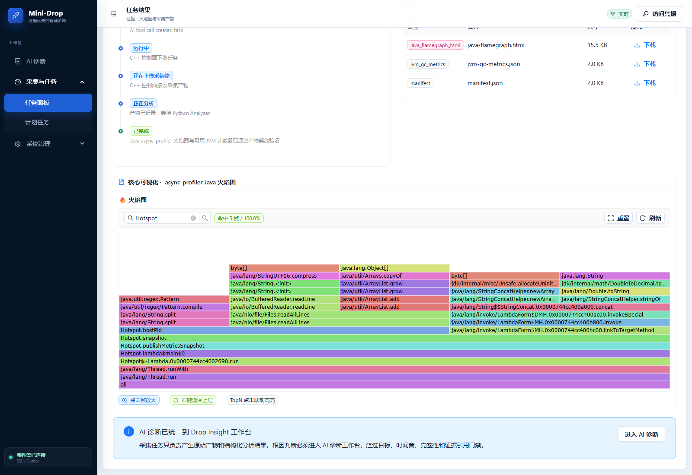

# 后续完善与验收 · 2026-09-09

状态：主要修复已发布到云端，四运行时真机回归和浏览器检查通过。当前目录 `20260909T153610Z`；主修复 `20260909T151902Z` 更新 Web、Diagnosis Worker、演示 Agent，`20260909T152520Z` 仅修复重复 Java 图表，最终版本仅刷新 Worker 挂载的 Python Skill 反证文案。三个在线 C++ Agent 的状态均已核对；新采集器镜像只滚动到演示 Agent。

| 项目 | 已完成证据 | 边界 |
|---|---|---|
| 模型余额 | [充值后真实请求](model-probe-funded-20260909.json)，HTTP 200 | 只证明接口可用 |
| 模型参与真实诊断 | [修复后四运行时复验](hardening-live-final-20260909.json)，4/4；16 次工具全部完成；四条初始规划均 LANGGRAPH_AGENT | [首次复验](model-funded-live-20260909.json) 的 Java 失败保留；后续仍允许有效规则兜底，不宣称模型永不失败 |
| 随机 A/B | [六条真实随机分配](random-ab-live-20260909.json)，AUTO 2、DISABLED 4，六条真实链路与标注 | 小样本返回 NOT_READY，未做上线批准 |
| 操作者偏好 | [保存、跨两个新会话、删除恢复](operator-memory-live-passed-20260909.json) | 仅显式安全偏好，不扩大权限 |
| PostgreSQL 并发 | [三项通过](postgres-concurrency-final-20260909.txt) | 独立测试 DB，生产约束未放宽；前两次失败日志保留 |
| 数据恢复 | [恢复报告](backup-restore-20260909.json)，39 表、2,830 对象逐个 SHA-256 一致 | 同主机隔离恢复，不是异地容灾 |
| 旧 Worker | [退役记录](legacy-worker-retirement-20260909.json)，停止且 restart=no | 原容器配置保留，当前三台 C++ Agent 不受影响 |

Java 图表改为数据解析后用 D3 绘制，保留产物脚本执行隔离。perf 改成检测采样记录，真实空样本仍失败，带明确原因。JVM 等专用探针在有限重规划候选中优先；包含 self 样本时不再把进程包装帧当叶函数热点。模型非法反证条件在接纳前拒绝，最多一次纠正。

原始日志、历史诊断、Evidence/Report、备份和部署回滚版本均保留。本报告不是生产准确率、容量或长期稳定性声明。

## 发布与回归证据

- [主修复发布](hardening-deploy-20260909T151902Z.json)、[Web 单图修正](hardening-deploy-20260909T152520Z.json)、[Python Skill 文案同步](hardening-deploy-20260909T153610Z.json) 均保存旧镜像、旧版本和前后容器 ID；未重建 PostgreSQL/MinIO。
- [发布后持久化与静态文件校验](hardening-final-verification-20260909.json)：四条诊断均有 MODEL 假设，所有当前前端产物与本地构建 SHA-256 一致，六条 A/B 分配及标签仍可读取，三个 Agent ONLINE，活动故障为 0。
- Python 全量 **506 passed / 3 skipped**；三项 PostgreSQL 测试另在专用 test DB **3 passed**，不是把跳过算通过。新增模型/路由/谓词回归 65 项，Skill 与实验相关回归 21 项通过。
- Web 全量 **34 files / 146 tests** 通过；新增任务切换竞态保护后，受影响组件和解析器 **12 tests** 通过（合并计 147 个不同用例）。生产构建、bundle 检查、真实浏览器检查通过。删除重复卡片由云端单图 38 帧实测确认。
- 原生 C++ **CTest 3/3**，新增 perf 检查覆盖小而有样本、大但只有元数据、零长度记录、截断、溢出等七种情况；构建日志在 `output/acceptance/hardening-20260909/native-build.log`。
- [独立空闲进程反例](perf-idle-live-20260909.json)：`task_20260909_152614_3b1964ab` 按预期 FAILED，类型 `ANALYSIS_INPUT_INVALID`，原因为 `NO_PERF_SAMPLES`，没有把空产物作为有效证据。四运行时回归中的原生 perf 与 continuous_perf 均完成；这不能追溯改写之前 12 个失败任务。
- [十分钟读取验证](read-soak-20260909.json)：4 路并发，每路 300 请求，共 1,200 请求无失败；各路 P95 0.92～0.94 秒，包含公网往返及同时进行的验收/构建影响。

| 新版案例 | 打开真实诊断 | 初始规划 | 工具完成 |
|---|---|---|---|
| Java 锁竞争 | [查看](https://120.24.187.205/ai-diagnosis?case=insight_aa52249754ab449281a664ac6c7177de) | LANGGRAPH_AGENT | 4/4，含 JVM Profile |
| Python 源码热点 | [查看](https://120.24.187.205/ai-diagnosis?case=insight_6358b0e0d0e0497594164e1dca5f7dc4) | LANGGRAPH_AGENT | 4/4 |
| Go CPU 热点 | [查看](https://120.24.187.205/ai-diagnosis?case=insight_6e6a4ede53474ab6970099d3a56e7c0d) | LANGGRAPH_AGENT | 4/4 |
| C++ CPU 热点 | [查看](https://120.24.187.205/ai-diagnosis?case=insight_12a8f9f2051b453b8407a21451f6a75f) | LANGGRAPH_AGENT | 4/4 |

## Java 图表截图

同一历史 Java 产物在修复后显示 38 个调用帧、单张图表，可搜索、点击缩放；无 iframe 执行脚本、无浏览器异常。它是图表修复证据，Java 锁竞争的新采集任务是 `task_20260909_152059_3b0098`。

## 尚需积累的验证

- 目前是可重复的受控演示；六个随机样本不足以证明 Skill 在生产流量中的准确率收益，NOT_READY 应保持，未进行上线批准。
- 十分钟的有界读取观察与同主机恢复演练，不能替代小时/天级长稳、容量上限、大并发采集、异地灾难恢复及定期备份策略。
- 规则兜底是保留的机制；模型参与规划不等于每个后续轮次都采纳模型，报告仍须遵守真实证据门禁。
- 新原生镜像已验证并部署于演示 Agent；另外两台在线腾讯 Agent 本轮没有滚动该镜像。

## 最终 Skill 文案补测

[最终版本检查](hardening-current-verification-20260909.json)确认当前目录 `20260909T153610Z`，挂载 Python Skill 正文 SHA-256 与本地一致；[Python 定向补测](python-skill-contract-live-20260909.json)通过，Diagnosis `insight_7edb3ab7bdb7492293342b248a432c70` 的初始规划为 LANGGRAPH_AGENT，并重新完成真实取证与故障清理。此前四运行时的 4/4 记录仍保留，补测不是覆盖旧结果。
