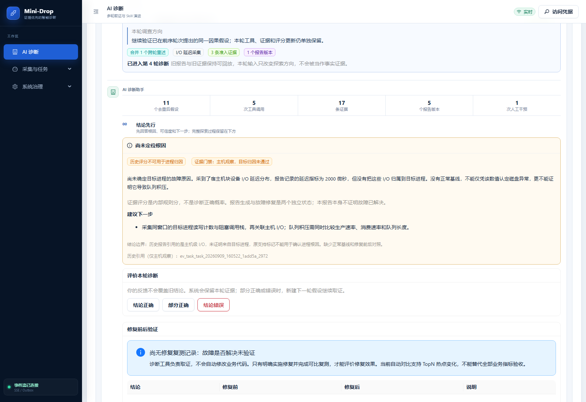
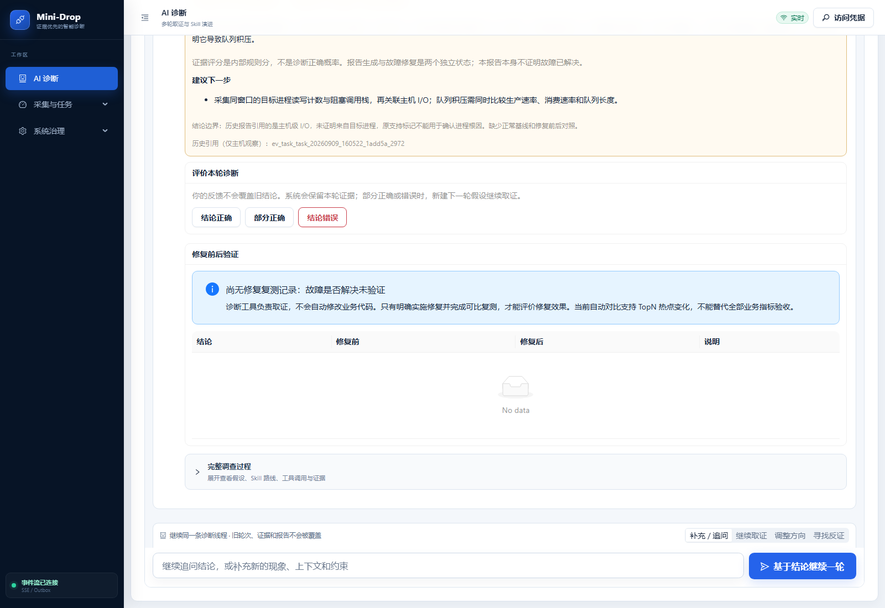
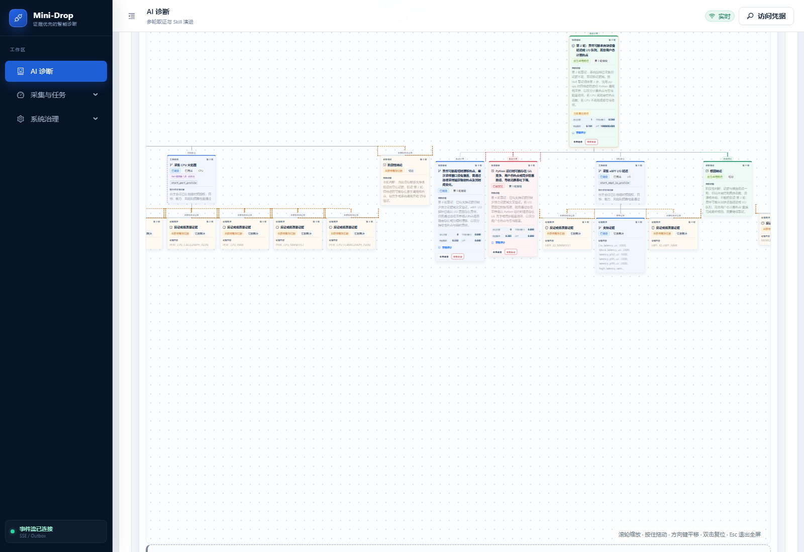
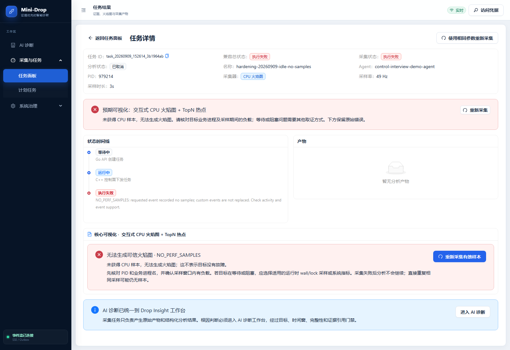
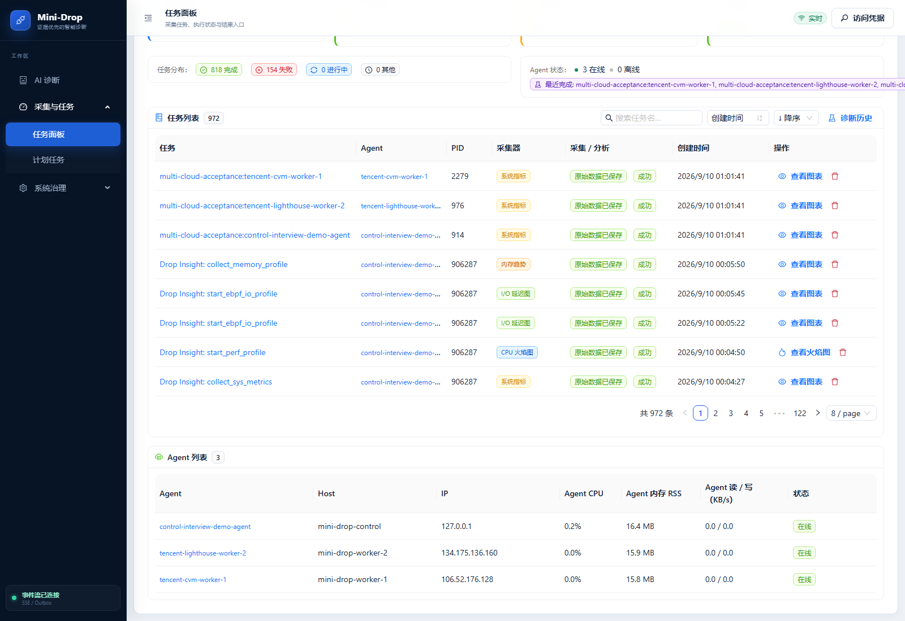

# 用户截图问题修复与验收（2026-09-10）

已发布到 `https://120.24.187.205`，当前目录 `/opt/mini-drop-releases/20260909T170846Z`。三个原生 Agent 均已升级并上报真实自身指标。此报告验收的是页面语义、证据门禁、遥测与采集链；原截图中的队列积压根因尚未确定，也没有修复复测记录。

## 修复结果与页面读法

| 原问题 | 修复后行为 | 怎么看 |
|---|---|---|
| 系统指标节点显示“未知诊断工具” | 用稳定工具 ID 翻译中文名，保留 ID | `collect_sys_metrics` 显示“采集系统指标”；“策略检查通过”只表示允许执行 |
| 树颜色含义混杂 | 蓝：已调查；红：已被反证；橙：采集失败或证据不足；绿：报告采用路径 | 树保存问题、假设、工具、证据、报告的父子关系；绿色不证明修复，紫色 Skill 是路线先验 |
| 报告只有模糊“阶段性根因” | 显示具体结论、证据范围、缺失条件和下一步；证据不足用橙色 | 没有具体定位显示“尚未定位根因”；内部规则评分不是正确概率 |
| 无法判断故障是否解决 | 始终展示修复复测状态 | 无记录是未验证；读取失败是状态未确认；TopN 对比不能替代完整业务指标验收 |
| perf 失败只给英文 | 显示“未获得 CPU 样本”，解释原因和选型；保留原错误 | 空闲或阻塞可能没 CPU 样本；核对业务 PID 和负载，必要时选择 wall/lock 或系统指标 |
| “可信进程快照”不易懂 | 改为“目标进程（Agent 实时发现）”，展示进程名并校验选择 | 可信说的是来源与身份，不是判定进程有故障；切换 Agent 时清空旧快照，忽略迟到响应 |
| Agent 指标都是 0 | 实现原生采样 → 心跳 → Control 入库 → Go API → 前端完整通路 | CPU 是 Agent 自身单核百分比；RSS 是驻留内存 MB；读写是 KB/s。未采到显示“未上报”，实测 0 保留 |
| 测试集口径不清 | 验证中心与学习手册说明生成方式和局限 | 540 条离线回放、500 组离线对照不能当成独立生产事故或真实模型准确率 |

### 原报告为什么不能下根因结论

案例 `insight_9700c04def7c434d83dd65ed9bc6a432` 中，证据 `ev_task_task_20260909_160522_1add5a_2972` 来自 147 个宿主机块设备 I/O 样本，报告记录延迟指标 2000 微秒；元数据明确 `HOST_BLOCK_DEVICE`、`target_attributed=false`。没有目标进程归属、正常基线、生产消费速率与队列长度对照，不能证明它导致 python-hotspot 队列积压。

后端现将这类证据限制为 `ACCEPT_LIMITED`，假设判定 `NEUTRAL`，不能用于该进程的支持或反证。云端按新规则重验该历史证据，报告门禁为 `INSUFFICIENT_EVIDENCE`、评分为 0。历史持久化报告未被回写；前端明确标注旧评分不能用于进程归因。[门禁重验记录](usability-host-io-gate-20260910.json)

下一步应采集同窗口目标进程的读写计数与阻塞栈，再关联主机 I/O；同时对比生产速率、消费速率与队列长度。不能直接跳到“修复后复测”。

## 云端截图

这些截图来自发布后的公网页面，使用既有真实记录，只读检查未触发故障或修改业务数据。原截图任务 `task_20260909_161324_9698a801` 已返回 404，未恢复该记录；无样本页面使用仍保留的负向验收任务 `task_20260909_152614_3b1964ab`。

[截图 SHA-256 与浏览器检查](../../docs/assets/learning-guide/20260910-usability/manifest.json)：五张截图、0 个未捕获浏览器异常；校验报告使用橙色底色、无“未知诊断工具”、无“结论已完成”，修复状态可见。诊断深链接同时兼容纯 ID 和旧 `drop_insight_v2:` 前缀。

## 验收证据

- Python 最终全量：509 passed、3 skipped；跳过项是需独立 PostgreSQL 环境的测试，前一轮已单独通过，本轮没有把跳过计为通过。另有真实 PostgreSQL 迁移预检，确认已有 Agent 行保留、新字段 NULL，不初始化假零。
- Web 全量：35 文件、152 项通过；后续修复状态与任务提示的定向回归通过，最终结论卡与深链接 15 项通过。生产构建与 bundle 检查通过。
- Go `go test ./...` 通过；C++ CTest 4/4，包括自身采样的时间窗口、计数回退与真实 RSS 检查。
- 三个 Agent 分别创建新的 `sys_metrics` 任务：`task_20260909_170141_edd1fa57`、`task_20260909_170141_94ce035b`、`task_20260909_170141_2eb7cb88`，均采集完成、分析成功、产物存在。这验证基础链，不是三种故障根因验证。[采集记录](usability-collection-20260910.json)
- 三个 Agent 在线、指标时间戳新鲜、RSS 实测约 15.8～16.4 MB，CPU 随窗口可为 0 或约 0.2%，磁盘读写空闲时为 0。三台运行二进制 SHA-256 一致：`89a2cd71962fd4c1c83a4fbeda0ee16432e318e2e8d89a612822130d805e0122`。[最终健康与节点检查](usability-final-20260910.json)

## 部署记录与回滚边界

这次部署并非首次即成功，失败尝试保留，不以初始健康检查代替完整验收：

1. `20260909T164346Z` 首次发布遗漏 `agents.latest_metrics` 数据库字段，Control 心跳写入失败、Agent 短暂离线。回退 Control 后恢复。该次 JSON 的 `passed` 仅覆盖当时入口健康，不能作为遥测验收结论。
2. 补充 `20260910_0008` 可空 JSON 字段迁移，完成隔离 PostgreSQL 预检后升级生产。两个更早的迁移候选因预检脚本引号问题停止，未执行生产迁移。
3. `20260909T165645Z` 中 Windows 交叉编译的 Go 二进制缺可执行位，API 容器启动失败；旧 Python 镜像又不识别新 migration head，无法直接整组回退。随后修正执行权限，部署兼容新 schema 的 Python Worker 与 API，所有服务恢复健康。没有降级数据库或重建数据卷。
4. 当前 API 使用 `mini-drop-apiserver:usability-executable-20260910`；Analyzer 与 Diagnosis Worker 使用兼容迁移的 `mini-drop-python-worker:20260909T165645Z`。不要使用缺执行位的 API 候选 `mini-drop-apiserver:20260909T165645Z`。
5. 两台腾讯 Worker 在原镜像上仅覆盖经过验证的 Agent 二进制，保留各自采集工具链、环境文件、证书和挂载。均保留 `mini-drop-native-agent:rollback-usability-20260910`；第二台通过第一台 SSH 跳转部署。
6. 最终 `20260909T170846Z` 仅滚动替换 Web，其他容器 ID 不变。[最终 Web 发布记录](usability-deploy-20260909T170846Z.json)

数据库现在的 head 是 `20260910_0008`。回滚前必须确认 Python 镜像认识该版本；保留新增指标列，不盲目执行 downgrade。服务镜像与当前目录以最终检查 JSON 为准，旧章节中的目录只是历史发布记录。

## 尚未完成的工作

原截图队列故障仍未定位与验证修复；本轮修正了错误归因和展示。大样本随机 A/B、长期稳定性与容量上限压测仍需另行积累。此前 21 场景真机 Campaign 与四运行时模型链路属于历史验收，本轮没有重新运行全部故障或真实模型，不能重复计为新增结果。停止注入器也不代表 AI 自动修复业务代码。
