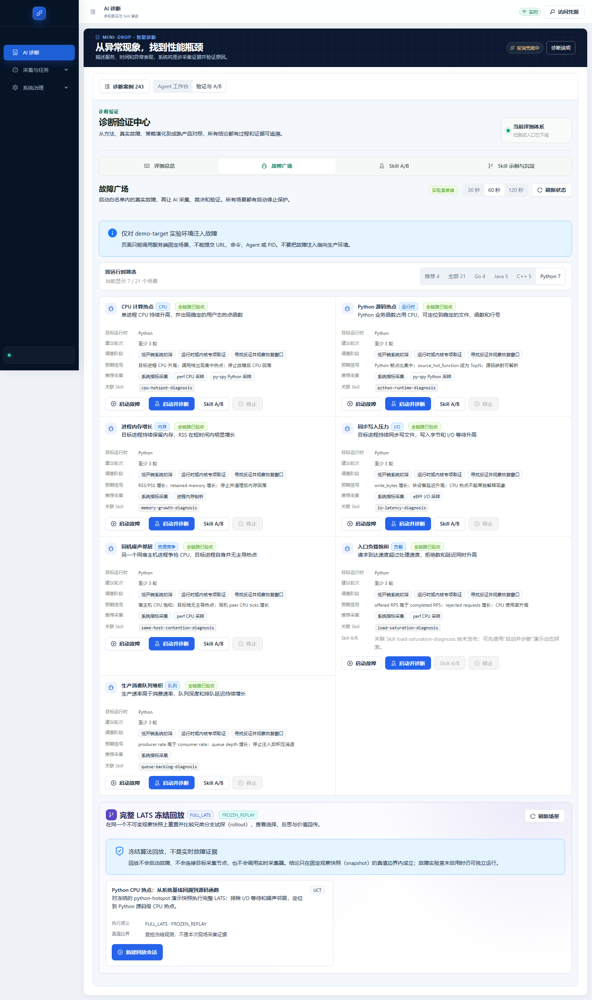
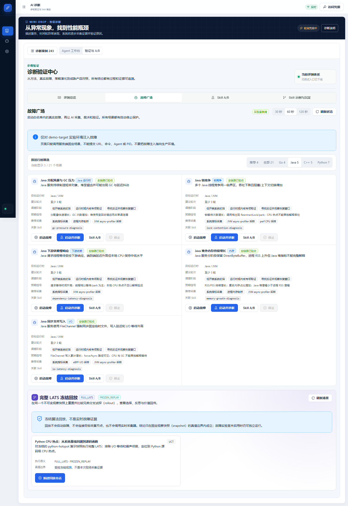
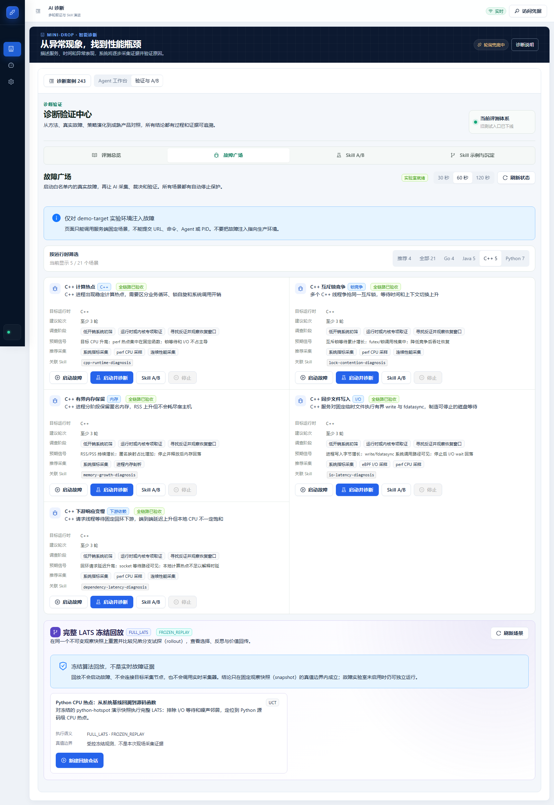

# 故障广场其余 17 场景全链路复验（2026-09-09）

> 2026-09-10 更正：下方“通过”是旧链路验收标准，不代表每个场景根因已验证或故障已修复。原 21 条会话仅 2 条含 VERIFIED 报告。旧正文保留作审计，请先阅读 [验收口径更正](21场景验收口径更正-20260910.md)。

## 本次结果

**17/17 通过，0 个场景失败；17 条新诊断链和 17 次故障清理通过。**
本轮在 `20260909T111410Z` 云端版本上，从公网 API 顺序启动全部仍标为“故障注入已验收”的场景。已有四个全链路标签的场景沿用 9 月 8 日报告，本轮不把它们写成新跑的场景。

每场景要求：新故障与当次目标绑定 → 决定性采集器 Task/Attempt → 非空且校验通过的 Artifact → Analyzer 与可支持结论的 Evidence → Report 引用对应证据 → 至少三轮有报告的调查 → 故障停止校验。

- 本轮运行时分布：{'Python': 6, 'Go': 3, 'Java': 4, 'C++': 4}。
- 真实工具调用 68 次，状态分布：{'COMPLETED': 56, 'FAILED': 12}。
- Evidence 174 条，Report 56 份。
- Planner 来源：{'DETERMINISTIC_RULES': 12, 'AUTONOMOUS_WORKER': 4, 'IDEMPOTENT_REPLAY': 1}。`DETERMINISTIC_RULES` 表示规则兜底，`AUTONOMOUS_WORKER` 表示由后台先推进，不能仅据后者推断大模型成功。

## 逐场景证据入口

| 场景 | 必需采集器 | 新诊断 | 工具 / 证据 / 报告 | 清理 |
|---|---|---|---|---|
| CPU 计算热点（`cpu-hotspot`） | `pyspy` | [打开诊断](https://120.24.187.205/ai-diagnosis?case=insight_bcfe2ca896244405b80ce92fe4864cab) · `insight_bcfe2ca896244405b80ce92fe4864cab` | 4 / 20 / 4 | 已验证停止 |
| 进程内存增长（`memory-pressure`） | `memory_smaps` | [打开诊断](https://120.24.187.205/ai-diagnosis?case=insight_3b815a0da1894fd2a02b4224251ec8ce) · `insight_3b815a0da1894fd2a02b4224251ec8ce` | 4 / 7 / 3 | 已验证停止 |
| 同步写入压力（`io-write-latency`） | `ebpf_io` | [打开诊断](https://120.24.187.205/ai-diagnosis?case=insight_741344696cbb473ebaff4fc83d777e61) · `insight_741344696cbb473ebaff4fc83d777e61` | 4 / 9 / 3 | 已验证停止 |
| 同机噪声邻居（`noisy-neighbor`） | `sys_metrics` | [打开诊断](https://120.24.187.205/ai-diagnosis?case=insight_def6c74ec1ca4cdd905e92d78a248668) · `insight_def6c74ec1ca4cdd905e92d78a248668` | 4 / 8 / 3 | 已验证停止 |
| 入口负载饱和（`load-saturation`） | `sys_metrics` | [打开诊断](https://120.24.187.205/ai-diagnosis?case=insight_31459f991f9c4997abb8015f2466650e) · `insight_31459f991f9c4997abb8015f2466650e` | 4 / 16 / 4 | 已验证停止 |
| 生产消费队列堆积（`queue-backlog`） | `sys_metrics` | [打开诊断](https://120.24.187.205/ai-diagnosis?case=insight_be2db65166f74f9194626656c0b5be24) · `insight_be2db65166f74f9194626656c0b5be24` | 4 / 16 / 4 | 已验证停止 |
| Go 网络等待与下游慢响应（`go-network-latency`） | `sys_metrics` | [打开诊断](https://120.24.187.205/ai-diagnosis?case=insight_594f9aefe4804061bb1790f9099d1a92) · `insight_594f9aefe4804061bb1790f9099d1a92` | 4 / 7 / 3 | 已验证停止 |
| Go 堆内存持续增长（`go-memory-growth`） | `memory_smaps` | [打开诊断](https://120.24.187.205/ai-diagnosis?case=insight_f2e6c8b11a51441dbd075f30015ee569) · `insight_f2e6c8b11a51441dbd075f30015ee569` | 4 / 7 / 3 | 已验证停止 |
| Go 同步文件写入（`go-file-io`） | `ebpf_io` | [打开诊断](https://120.24.187.205/ai-diagnosis?case=insight_6e8ca764162d49c08893591a13872cd7) · `insight_6e8ca764162d49c08893591a13872cd7` | 4 / 7 / 3 | 已验证停止 |
| Java 锁竞争（`java-lock-contention`） | `java_async` | [打开诊断](https://120.24.187.205/ai-diagnosis?case=insight_c4270f3c1ef842f79a48b265a5f027e2) · `insight_c4270f3c1ef842f79a48b265a5f027e2` | 4 / 19 / 4 | 已验证停止 |
| Java 下游依赖慢响应（`java-downstream-latency`） | `sys_metrics` | [打开诊断](https://120.24.187.205/ai-diagnosis?case=insight_4053045c6bcd4580a0aa18dd02b3bb68) · `insight_4053045c6bcd4580a0aa18dd02b3bb68` | 4 / 8 / 3 | 已验证停止 |
| Java 堆外内存持续增长（`java-offheap-growth`） | `memory_smaps` | [打开诊断](https://120.24.187.205/ai-diagnosis?case=insight_9861ab10b09a40089a63a9d6a9f91d3f) · `insight_9861ab10b09a40089a63a9d6a9f91d3f` | 4 / 7 / 3 | 已验证停止 |
| Java 同步文件写入（`java-file-io`） | `ebpf_io` | [打开诊断](https://120.24.187.205/ai-diagnosis?case=insight_babd3b664b654f28a65e95fdbb53fb9d) · `insight_babd3b664b654f28a65e95fdbb53fb9d` | 4 / 8 / 3 | 已验证停止 |
| C++ 互斥锁竞争（`cpp-lock-contention`） | `sys_metrics` | [打开诊断](https://120.24.187.205/ai-diagnosis?case=insight_2e899b624f7a4fa5bf042249abeb04f9) · `insight_2e899b624f7a4fa5bf042249abeb04f9` | 4 / 7 / 3 | 已验证停止 |
| C++ 有界内存保留（`cpp-memory-growth`） | `memory_smaps` | [打开诊断](https://120.24.187.205/ai-diagnosis?case=insight_7d522819ab3b493eab2283169122bbdf) · `insight_7d522819ab3b493eab2283169122bbdf` | 4 / 7 / 3 | 已验证停止 |
| C++ 同步文件写入（`cpp-file-io`） | `ebpf_io` | [打开诊断](https://120.24.187.205/ai-diagnosis?case=insight_992e15ddab2042b38918693c0a1be222) · `insight_992e15ddab2042b38918693c0a1be222` | 4 / 7 / 3 | 已验证停止 |
| C++ 下游响应变慢（`cpp-downstream-latency`） | `sys_metrics` | [打开诊断](https://120.24.187.205/ai-diagnosis?case=insight_ed4cec74504b4261ab403ba64c34b7c5) · `insight_ed4cec74504b4261ab403ba64c34b7c5` | 4 / 14 / 4 | 已验证停止 |

## 失败探针与边界

场景通过不等于所有探针均成功。下面保留本轮失败的真实工具调用；它们没有被当作有效支持证据，最终通过其他合格采集完成场景闭环。

| 场景 | 工具 | Task | 状态 |
|---|---|---|---|
| `memory-pressure` | `start_perf_profile` | `task_20260909_131502_676718` | `FAILED` |
| `io-write-latency` | `start_perf_profile` | `task_20260909_131715_c52945` | `FAILED` |
| `noisy-neighbor` | `start_perf_profile` | `task_20260909_131912_498a16` | `FAILED` |
| `go-network-latency` | `start_perf_profile` | `task_20260909_132432_f64733` | `FAILED` |
| `go-memory-growth` | `start_perf_profile` | `task_20260909_132649_800714` | `FAILED` |
| `go-file-io` | `start_perf_profile` | `task_20260909_132850_c78dbd` | `FAILED` |
| `java-downstream-latency` | `start_perf_profile` | `task_20260909_133217_4577cc` | `FAILED` |
| `java-offheap-growth` | `start_perf_profile` | `task_20260909_133434_33b31c` | `FAILED` |
| `java-file-io` | `start_perf_profile` | `task_20260909_133650_7f80de` | `FAILED` |
| `cpp-lock-contention` | `start_perf_profile` | `task_20260909_133822_69879a` | `FAILED` |
| `cpp-memory-growth` | `start_perf_profile` | `task_20260909_134034_fb7ff5` | `FAILED` |
| `cpp-file-io` | `start_perf_profile` | `task_20260909_134249_aad3ef` | `FAILED` |

本报告证明受控 Linux 演示环境的采集与诊断闭环，不是生产准确率、随机 A/B 收益或纯大模型推理质量评估。报告可能保留阶段性结论和缺少独立反证的限制。网页图表逐像素显示、生产长稳和高并发也不能仅凭本报告推断已经验收。

## 原始报告

- [本轮机器报告](fault-plaza-remaining-17-20260909.json)
- [9 月 8 日完整 21 场景报告](fault-plaza-full-21-final-v2-20260908.json)
- 本轮规范化 payload SHA-256：`95e79972e0c5548a1b5db5b32b8a1c7bc7a0a7350ae382fb07b3333e84c26f70`。
- 本轮 JSON 文件 SHA-256：`44801ec6ada871efa577dd6dfce7683a9ec874d31907ec9a17c7c2674dcd7e69`。
- 标签更新后仍需通过公网 API 和浏览器单独核对 21 张场景卡；部署记录和页面截图位于本次验收输出目录。

## 云端标签与页面复核

更新已发布到 `/opt/mini-drop-releases/20260909T134853Z`，只滚动替换 Diagnosis Worker，其他服务容器 ID 未变。公网三个核心依赖均为 healthy。
浏览器实际读取了 21 张场景卡，21 张均显示“全链路已验收”，全部可用且故障均已停止；未捕获浏览器异常，未发起业务写请求。服务滚动更新后又逐条读取本次 17 条诊断，Evidence 和 Report 仍完整存在。
第一次发布因校验脚本未解包健康接口的 `data` 字段而误判并回滚；独立检查确认服务实际健康。脚本修正后重新发布成功，失败尝试的记录保留，没有改写场景验收数据。

以下是更新后的四种运行时页面实拍：

