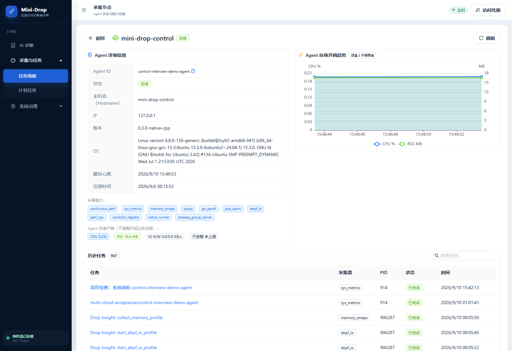

# 项目全面检查与修复 · 2026-09-10

本轮从用户截图继续检查页面、API 权限、任务幂等、Outbox 并发、自动测试和云端运行状态。本轮确认问题已经修复并完成测试，前后端均已发布；最终版本为 `/opt/mini-drop-releases/20260910T074729Z`。

| 范围 | 已确认问题与修复 |
| --- | --- |
| Skill 与评测中心 | 区分本报告不统计、已做受控真机验收、尚缺独立大样本评估；增加跳转故障证据按钮；清除已下线入口的旧宣传 |
| 离线报告输入 | 校验嵌套字段、计数及数值范围；缺失不再变成零分或导致渲染失败 |
| Agent 页面 | 真实采样时间去重、丢弃乱序与迟到响应、切换机器清空历史、多核 CPU 自动纵轴、离线恢复轮询、失败显示重试、缺版本显示未上报 |
| Go 任务创建 | 唯一键竞争失败先回滚释放连接，再查询赢家；避免小连接池卡死 |
| Outbox | 发布/失败操作取得行锁后校验租约，与 SKIP LOCKED 领取互斥；仍要求外部接收端幂等，不宣称消息恰好一次 |
| AI 接口权限 | 当前 V2 RPC 未实现资源范围传递，Go 对受限范围账号统一 403，覆盖 REST 与 SSE；全范围账号继续角色授权 |

## 剩余工作与边界

- 独立大样本随机 A/B、长时间稳定性、容量上限仍无充分证据。既有 21 个受控场景与小规模 A/B 不替代这些结论。
- V2 AI 的细粒度 Agent/Service/Environment 隔离尚需完整设计、传递、过滤及跨资源关联检查；本轮采用拒绝访问关闭绕过路径。
- 控制机检查前磁盘 77%，本轮发布和独立测试后约 81%，最终剩余约 7.5 GB。发布历史、备份、镜像与测试证据需要有保留期限和容量预算；本轮不删除现有数据。
- 原用户截图的诊断仍未定位根因且没有修复复测记录，页面修正不算业务故障已修复。
- 基础 Python 测试 509 passed / 3 skipped；旧跳过项为 PostgreSQL 专项。前端默认大量并行在本机发生进程异常，限定 2 个 Worker 后全量通过；该异常原因未独立定位，不把它写成已确认的产品运行故障。

## 验证证据

- Python 基线：509 passed / 3 skipped。修改后的 Outbox 定向 SQLite 测试 1 passed；2 个新增 PostgreSQL 测试在本地跳过后转独立数据库执行。
- PostgreSQL 真并发：5/5 Python 测试通过（Outbox 发布/失败回写互斥 + 报告租约接管 + 事件锁 + 并发唯一性），另有 Go 单连接池幂等竞争 1/1 通过；任务、状态事件、Outbox 各恰有 1 行。这验证数据库状态，不等于外部消息恰好投递一次。
- Web：全量 161/161，加新增 Agent 组件定向 2/2；构建与 bundle 预算通过。默认并发进程异常后用 `--maxWorkers=2` 执行全量。
- Go：`go test ./...` 与 `go vet ./...` 通过；新增 V2 权限矩阵覆盖三种资源限制、全范围账号以及 GET/POST、REST/SSE。
- 前端生产依赖：`npm audit --omit=dev` 报告 0 个已知漏洞。这不代表应用不存在未知漏洞，也不覆盖后端全部依赖。
- 公网浏览器：桌面、375px、横屏无页面溢出；评测卡跳转真机证据、页面内 Skill 切换、真实心跳趋势、无 CPU 样本负例、原未定根因报告均通过；无浏览器异常。
- 三台 Agent 新任务 `task_20260910_074213_f94819b0`、`task_20260910_074214_96e72b22`、`task_20260910_074214_b89e5174` 均 DONE，有分析产物；每个任务重复相同幂等请求返回同一个 ID。指标新鲜、RSS 非零。

[数据库测试原始结果](../../output/acceptance/project-review-20260910/postgres-tests.json)、[Web 测试](../../output/acceptance/project-review-20260910/web-tests.log)、[Go 测试](../../output/acceptance/project-review-20260910/go-final.log)、[依赖审计](../../output/acceptance/project-review-20260910/npm-audit.json)、[最终容器与 schema 状态](project-review-final-20260910.json)、[真机采集结果](project-review-live-20260910.json)、[浏览器验证清单](../../docs/assets/learning-guide/20260910-project-review/manifest.json)。

## 页面实拍

## 发布与保留边界

最终 Web 布局调整发布 `/opt/mini-drop-releases/20260910T074729Z`，只更新 Web 容器；后端版本保持下述标签。[后端发布记录](project-review-deploy-20260910T073914Z.json)、[最终 Web 发布记录](project-review-deploy-20260910T074729Z.json)。

后端发布 `/opt/mini-drop-releases/20260910T073914Z`：API、两个 Python Worker 和 Web 更新；数据库、对象存储、原生 Control 和三个 Agent 均沿用原服务。数据库仍为 `20260910_0008`。首次构建被旧 Docker 的 `COPY --chmod` 不兼容阻止，发生在切换前；已改为先设置源文件执行权限、普通 COPY、候选容器检查可执行权限。生产服务未因此中断。

独立测试运行环境最初缺 pytest，之后补齐测试工具及正确的 psycopg 驱动 URL 后才通过；早期失败不能计入通过数。测试未访问生产数据库；保留既有备份、卷和验收证据。

本轮没有重新跑完全部 21 场故障或发起大样本真实模型实验；这份检查报告不能被引用成新的 21/21 AI 根因准确率报告。

