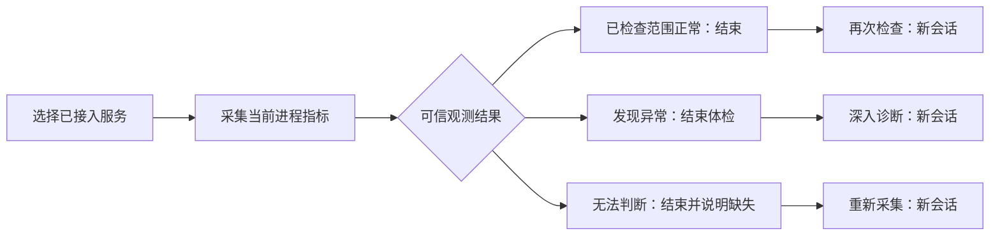

# 当前状态检查与后续调查交付

已发布 `20261001T140111Z`。正常服务现在可以完成检查并得到明确结果，不再因为没有异常根因而结束为“证据不足”。数据不足仍明确无法判断，异常可继续独立调查。

## 实现与边界

一次体检只执行一个真实系统采集，不请求模型根因规划、不做根因候选评分或CPU因果对照。`health_check.completed` / `mini-drop.health-check.v1` 与工具副作用完成标记在一个事务保存；重复推进幂等。正常和异常均为 COMPLETED，表示体检结束；数据不足或采集失败为 INSUFFICIENT_EVIDENCE，明确显示无法判断。所有结果 `causal_root_cause_verified=false`，没有根因报告，不将假设标为SUPPORTED。

正常提供“再次检查”，不足提供“重新采集”，异常提供“深入诊断”。后续记录属于同一用户和服务，重新发现与绑定当前Agent/PID/启动时间，保留原会话。当前状态检查不误关联历史业务请求。取消、失败、归档和已有终态历史不会被迟到采集复活。公开服务请求Schema从模型生成，并加入漂移回归。

正常只覆盖本次窗口内已列出的检查项。默认初筛：CPU单核口径低于50%，窗口RSS增量低于8MiB；有有效请求和身份的HTTP观测检查均值/P95/失败率。无请求时不宣称HTTP已检查。磁盘操作延迟、TCP丢包重传、内存限额与全部接口正确性未由这次体检覆盖。

## 测试与真实验收

后端核心回归66通过，合同专项55通过。Git源码 `0f61e17129d3cc9bf92dfd19fd6e6e867787ebfa` 的 [CI36873505926](https://github.com/llongwang751-arch/mini-drop/actions/runs/36873505926) 13/13成功：Python1418通过/10项登记跳过，PostgreSQL8通过/零跳过，Web307通过。实际Web保留先前已上线视觉改动，为冻结前端加本轮变更，308项通过、构建与体积门禁通过；测试定位兼容修正后的专项12通过。整个Web包不是该Git提交的精确CI产物，来源用逐文件SHA记录。

三条真实Office记录均 NORMAL_OBSERVED / COMPLETED：

| 记录 | 创建途径 | 后续关系 |
|---|---|---|
| `insight_966ff508f40e45ef86fa4520f38c4060` | 服务入口真实体检 | 第一条 |
| `insight_605360be87f4442fb36b2e516518fd77` | 后续检查API | 关联第一条、更新进程快照 |
| `insight_a7140e8fa23c4405bdb6f6919817bfa2` | 浏览器“再次检查” | 关联第一条、更新进程快照 |

第一条15样本/14.005秒：CPU0.5%，RSS237.195MiB，窗口增量0.766MiB。三条都没有根因报告，6份原始采集产物下载SHA一致。服务保持PID2396498和NRestarts=0；实际接入的Office发布为 `research-studio-20261001T130430Z-planner`，本轮未修改或重启它。异常及观测不足分支通过回归验证，本轮没有真实异常注入。

真实Chrome验证正常结果、完整进度、后续按钮、三次记录关联，旧CPU/HTTP路径及I/O反证、前进后退、21类案例/4项工程回归、9份已有工程证据下载SHA、1440/1024/768/375宽度；没有JS/HTTP异常。正常检查另查1440/375宽度无溢出，截图已人工复核。

## 部署及保留结果

Worker/Analyzer各204份文件SHA一致，58份Web容器及公网文件SHA一致；13容器健康，其他10容器ID和Office发布/进程保持。API原二进制SHA保持。回滚配置保留在 `/opt/mini-drop-releases/20261001T140111Z/private/rollback.compose.json`，旧发布与静态哈希资源保留。

21个故障均inactive，旧因果0/21保持；之前冻结三案例的工程判断3/3、路径2/3、反证1条保持，18类工程验收仍NOT_EVALUATED。本轮三条正常体检不加入21类或因果成绩，一小时不重跑。

首次后端回归发现根因候选评分仍执行，已在体检路径移除并加入调用阻断断言；前端首次测试遇到loading图标改变按钮可访问名，已补充稳定标签并验证重试。首次CI因新增测试假定新版服务标题而失败，改为两版共用状态定位后通过。真机校验脚本最初误读取未公开的binding_id；两次生产体检本身均正常，改按公开process_snapshot_id和snapshot_received_at校验后复用原记录通过，没有改变业务代码或阈值。失败材料均保留。

完整原始记录与逐文件SHA见 [证据目录](../quality/health-check-flow-20261001/README.md) 和 [94文件清单](../quality/health-check-flow-20261001/manifest.json)。后续重点是给剩余性能域补充真实可执行观测与工程验收；不将正常体检当作全能诊断平台或持续监控。
