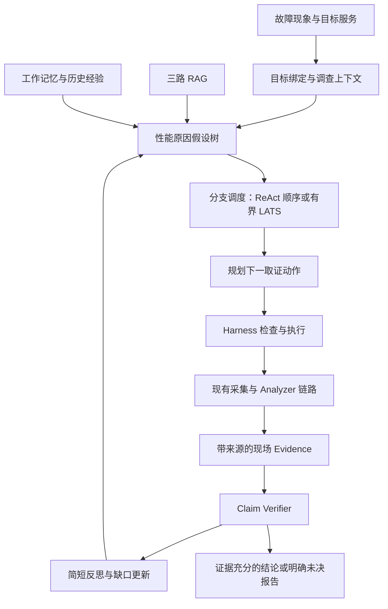

# Mini-Drop SRE 诊断 Agent：定位、开源对照与实现边界

## 本批已交付与验证

三路召回、当前调查工作记忆和零预算截取修正已于本批发布到 `/opt/mini-drop-releases/20260919T133900Z`，只替换 Diagnosis Worker。新语料快照 `md-knowledge-71ac29e6e40c93255b0f152b830e977c`，39 块；旧知识索引、镜像及私有回滚配置保留。

本地 Agent/记忆/检索测试 59 passed、2 skipped；树搜索和服务验收另 36 passed，总计 95 passed、2 skipped。首次新测试导入错误、首次加入数据库记忆后单测缺表错误均已修正；数据库记忆读取失败现明确返回 UNAVAILABLE，不输出 SQL 或提升缺失数据为事实。

云端真实混合检索开发集 Recall@3=1.0、MRR@3=1.0，无答案误召回 0/3；仍是 12 正例+3 负例开发集，不是盲测。实际单次查询三路候选数为 BM25=7、ENTITY=4、DENSE=20，后端 `BM25_ENTITY_CHROMA_RRF_RERANK`。从旧诊断的持久记录读取工作记忆状态 READY、8 条有来源观察，`is_evidence=false`。

本地证据：`output/cloud-sre-20260919/three-route-hybrid.json`、`agent-modules-smoke.json`、`agent-runtime-release.json`。源码包 SHA-256 `f319dbd2daa54948401586a246c1ae5b0483aaa8cfe394c8229ac2eeadb87599`，308 个文件。没有把源码调研记为外部 Agent 已直接集成。

**新 LATS 完整链路回归未通过**：`insight_7f96b792aaba448ab690db15428d73f8` 实际执行模型规划及三路检索，py-spy、sys_metrics 完成，第三项 perf 执行中达到总时限；`diagnosis.expired` 原因为 `wall_clock_budget_exhausted`、age_seconds=300，最终 CANCELLED。两份报告均 PARTIAL_WITHOUT_COUNTER，故障清理成功。记录在 `output/cloud-sre-20260919/lats-agent.json`。不能将上一版成功回归沿用为本版完整验收成功，也不能仅延长预算掩盖失败。

这揭示 Harness 后续必须有“总截止时间分配”：范围理解、模型规划、检索、采集、分析和报告共享剩余时间；派发下一探针前预留结束和报告时间。此次不足以判断新记忆造成变慢，也不能证明 LATS 比 ReAct 更差；需要同版本配对测量。当前仅能确认三路 RAG/工作记忆模块实测与本地回归通过。

## 产品定位

在现有 Go API、C++ Control/Agent、Python Analyzer、PostgreSQL 和 MinIO 基础链路上增加诊断 Agent。Agent 接收故障现象，形成性能原因假设，决定取证动作，读取真实观察，更新诊断树，以可追溯证据给出结论和后续建议。自动改生产配置不是本阶段诊断 Agent 的前置条件。

导师要求的循证诊断和性能诊断树是固定产品要求；ReAct/LATS 是内部决策策略，可以替换，不能因为切换策略而丢弃树或门禁。

## 源码核查后的当前程度

| 模块 | 已实现 | 尚欠缺 |
|---|---|---|
| 规划和工具 | `diagnosis_agent.py` 的 LangChain create_agent，按需知识/记忆查询、结构化探针提案；真实采集仍由服务端异步执行 | 工具选择需要更直接响应验证缺口；当前并非任意工具自主执行器 |
| 调查树 | `lats.py` 与 service 的候选扩展、选择、反思、回传和持久事件；前端 ActualExplorationTree | 业务症状→资源机制→具体代码/依赖的节点语义仍不够统一；当前混合了假设关系与执行投影 |
| 循证门禁 | Evidence 源、目标、时间、质量及 Claim Verifier；反证/证据不足区分 | 尚无稳定的多场景根因正确性成绩；独立对照能力不足 |
| ReAct / LATS | 同 Harness 下顺序候选策略及 UCT/PUCT 选择；都实际跑过 | 不是两套完整独立 Agent；未实现每个候选节点独立的多步 ReAct 子回合预算，不能宣称论文完整 LATS 效果 |
| RAG | 39 块，词法、向量、RRF、重排和按需读取 | 本批加实体精确召回成为三路；盲测、版本过滤和领域覆盖仍需完善 |
| 会话记忆 | PostgreSQL checkpoint、token/message 阈值摘要、用户偏好 | 不能把 checkpoint 当完整经验学习系统 |
| 事故记忆 | 同用户/服务/环境、30 天内、已 VERIFIED 的历史报告只读召回 | 成功案例少；失败经验、过期治理和评审写入机制待补 |
| 当前工作记忆 | 本批从 SQL 重新读取最近报告、验证缺口和最近 8 条证据投影 | 当前为有界摘要；按引用读取更早证据的工具还应补充 |
| Harness | 目标绑定、工具白名单、参数策略、预算、审批、幂等/租约、取消、审计、证据门禁实际存在 | 实现分散在 `service.py`、`policy.py`、Runtime middleware 等处；`harness.py` 单文件只有范围辅助函数，不应据其文件名宣称完整框架 |

## 推荐决策结构

外层树回答“还存在哪些解释、下一个调查哪条”；内层 ReAct 回答“针对这条解释，下一步查什么、观察到了什么”。报告由 Evidence 和 verifier 约束，搜索奖励只决定调查优先级。当前代码已具备该方向的主要部件，本批不把它改名为已经完成的完整嵌套 LATS。

性能树例子：响应变慢 → CPU 计算/内存回收/锁等待/I/O/下游等待 → Python 用户态计算 → 具体函数。每节点应包含假设、支持条件、反证条件、作用域/时间窗、证据引用、缺口、状态和下一探针。工具只是取证动作，不是原因节点。未采到数据应为 UNKNOWN/UNOBSERVABLE，不是 REFUTED；有假设树不代表必须穷举所有分支。

首先保留两种现有选择策略作为可比基线。让每个节点有独立多步循环和停止条件后，再增加外层有界 LATS 调度。线上故障会随时间演进，历史节点不可恢复现场，因此不把树搜索写成可复位模拟环境的完整 MCTS。默认策略在效果实验前保持不变。

## 三路召回合同

查询 → BM25 词法召回 / Qwen Embedding + Chroma 语义召回 / 目录实体及技术标识精确召回 → RRF 合并 → Qwen Reranker → 文档去重 → Top-K 与来源 hash → 按需读块。

第三路使用评审目录中的 knowledge_id、keywords、applies_to，适合 `pg_stat_activity`、`cpu.max`、运行时和机制名称；英文标识要求 token 边界，避免 `go` 命中 `mongodb`。它不是历史事故召回，不能绕过记忆授权。Reranker 是排序阶段，不算第三路召回。当前第三路未读取真实服务拓扑，不称为知识图谱召回。

每次 trace 保存各路是否可用、候选数与 chunk ID，结果保存命中渠道。向量失败时使用 BM25 + ENTITY 的 RRF 并标明降级；不伪装三路成功。目录锚点进入不可变索引 hash，变更需重建快照。纯 lexical 配置仍保持 BM25；三路属于 hybrid 模式。

## 记忆分层

1. 当前调查工作记忆：由 SQL 权威记录投影，保存已观察、被拒绝、待验证和引用，避免聊天摘要丢失关键反证。本批已加入每轮规划上下文，不增加生成式事实写入。
2. 会话记忆：LangGraph checkpoint 与压缩后的消息，让追问和恢复保持连续。摘要没有批准结论的权限。
3. 事故经验记忆：历史报告限定用户、服务、环境、运行时/版本、有效时间；仅提示路线，必须重新取证。当前只有已验证案例可召回，经验覆盖薄。
4. 程序性记忆：已登记 Skill/runbook，作为可审查路线。后续从事故提出候选 Skill，再评审发布，避免把一次误判固化为永久流程。
5. 用户偏好：表达语言等安全字段，与服务事实和诊断权限分开。已有偏好存取，不用聊天内容自行扩权。

下一步增加“失败经验”时，只能记为工具前提、能力限制和未决解释，不能自动记成失败事故的根因。删除/归档和 TTL 要作用于后续召回，历史审计仍保留。

## Harness 整理方向

把现有能力整理成清晰的执行接口，而非再创建一套状态机：输入是带目标句柄和预期信息的 ToolIntent；输出为状态、来源引用、观察、限制和耗时。统一 deadline、预算、重复调用、并发、幂等、取消和错误分类；采集失败反馈为不可观测。大结果继续存 MinIO，通过有授权的产物读取工具按需查看。状态迁移和证据入库由服务端控制。

本批修正上下文截取工具在 limit=0 时返回全部历史的问题；但这不能等价于完成 Harness 全部重构。摘要模型消耗、跨轮总 token 预算和成本审计仍需统一验收。

## 本次上游核查与取舍

均为 2026-09-19 读取官方仓库源码；下面的机制参考不意味着已经部署外部 Agent。

| 项目与源码 | 核查到的机制 | 采用方式 |
|---|---|---|
| [HolmesGPT tool_calling_llm.py](https://github.com/HolmesGPT/holmesgpt/blob/master/holmes/core/tool_calling_llm.py) | 工具循环、重复调用保护、工具执行器、上下文压缩与超大结果外置 | 参考工具治理分层；复用本项目授权采集链，不直接开放它的全部 shell/toolsets |
| [RunbookAI hypothesis.ts](https://github.com/Runbook-Agent/RunbookAI/blob/main/src/agent/hypothesis.ts) | 父子假设、观察、剪枝、确认和启发式 confidence | 参考树的数据组织；不采纳“树越深分数越高”作为本项目根因证据 |
| [RunbookAI hybrid-search.ts](https://github.com/Runbook-Agent/RunbookAI/blob/main/src/knowledge/retriever/hybrid-search.ts) | 全文/向量双路及 RRF | 机制参考；本批第三路实体召回为本项目实现 |
| [Redis SRE Agent memory](https://github.com/redis-applied-ai/redis-sre-agent/blob/main/docs/how-to/agent-memory.md)、[langgraph_agent.py](https://github.com/redis-applied-ai/redis-sre-agent/blob/main/redis_sre_agent/agent/langgraph_agent.py) | LangGraph 调查流程与工作/长期记忆分离 | 继续用 PostgreSQL 权威记录；不额外部署 Redis Memory Server。注意其多许可证条件，不直接当 Apache/MIT 代码复制 |
| [Deep Agents summarization](https://github.com/langchain-ai/deepagents/blob/main/libs/deepagents/deepagents/middleware/summarization.py)、[filesystem](https://github.com/langchain-ai/deepagents/blob/main/libs/deepagents/deepagents/middleware/filesystem.py) | 历史压缩、工具大结果外置、按需读取 | 借鉴上下文管理；当前已使用 LangChain SummarizationMiddleware，并未引入 Deep Agents 全套文件/执行权限 |
| [ReAct](https://github.com/ysymyth/ReAct)、[LATS](https://github.com/andyz245/LanguageAgentTreeSearch) | 观察行动循环与候选轨迹搜索 | 将树、调查循环和选择策略解耦，实验前不宣称 LATS 效果优越 |
| [AIOpsLab](https://github.com/microsoft/AIOpsLab) | 故障、工作负载、Agent 与评测分离 | 用作外部评测适配参照；尚未运行其基准 |

## 实施顺序

先做 Agent 本体：明确性能树节点合同 → 每轮证据/验证缺口工作记忆 → 三路 RAG → 按证据缺口规划探针 → 节点内有界观察行动循环 → 可替换树调度 → 完整 trace 与评测。

基础链路只修影响上述 Agent 取证质量的问题，例如采样身份映射。自动修复、长期容量和故障恢复作为下一阶段独立验收；不能喧宾夺主，也不能由基础链路跑通推断 Agent 已能准确诊断。
