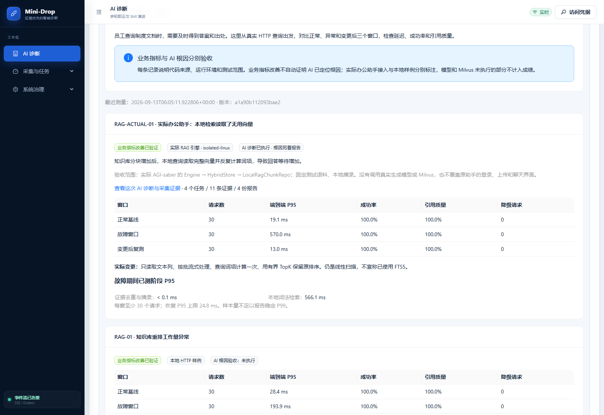
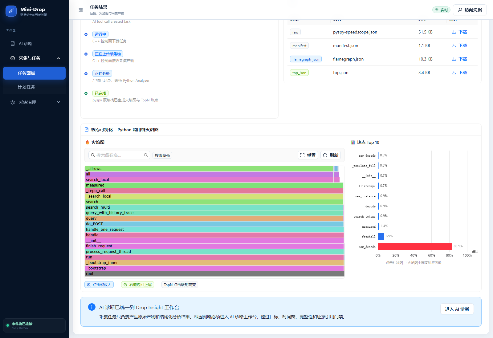

# 实际 RAG 检索优化与 Mini-Drop 联调

业务对照通过，AI 找到了 JSON 解码热点；AI 严格根因门禁仍为 `PARTIAL_WITHOUT_COUNTER`，不能把两种结果合并成“AI 已证明并修复全部故障”。旧 21 场景成绩没有变化。

## 面试时先讲什么

“办公助手的知识库查询变慢。我先用真实请求定位到本地检索阶段，再用 Mini-Drop 对同一服务进程采样。调用栈显示大量时间花在 SQLAlchemy 读取 JSON 字段上。检查代码发现，词法检索把根本不用的向量也读出来了。我改成只读文本、流式算分，保留原排序与租户隔离，再用同一语料和流量复测。”

这是本机已有 AGI-saber 的实际 Engine、HybridStore、LocalRagChunkRepo，HTTP 入口和语料由验收适配器提供。没有覆盖原助手登录、上传、聊天 UI；答案走原摘录逻辑，未调用远程生成模型或 Milvus。本地 Python 路径是词法扫描，**没有使用 FTS5**。

## 同负载复测

Linux 隔离容器 0.75 CPU / 512MiB，600 条固定人工分块，1536 维测试向量字段；每秒 1 请求，每窗 30 个测量和 4 个预热请求，最大 4 并发。六个中英文固定问题检查答案标记和引用。三窗资源、语料及问题集相同。

| 窗口 | 请求 | 端到端 P95 | 成功率 | 固定答案检查 |
|---|---:|---:|---:|---:|
| 修复版正常基线 | 30 | 19.07 ms | 100% | 100% |
| 旧版异常窗口 | 30 | 570.03 ms | 100% | 100% |
| 修复版复测 | 30 | 13.03 ms | 100% | 100% |

结果 `IMPROVEMENT_VERIFIED`。小样本不报告 P99，也不作为生产容量或一般回答正确率。正常基线先运行修复版，旧版作为回归对照，之后再次运行修复版；不是偷偷减少文档数或停止导入来伪造恢复。

原始证据：[三窗请求](actual-rag-linux-20260913-01/report.json)、[容器资源记录](actual-rag-linux-20260913-01/resource-receipt.json)。先前更大本地负载因发生器积压判不可比较，见 [保留的失败与汇总恢复](actual-rag-local-20260913-01/finalized-report.json)。

## AI 取证做到了哪一步

正确绑定的会话：[打开 AI 诊断](https://120.24.187.205/ai-diagnosis?case=insight_d3044891bd5142458b2a3fd7effd8ad9)。模型只收到“知识库查询慢、答案仍正常、Python 服务”等症状，没有收到修复补丁、向量真值或测试答案。

| 采集器 | Task | 采集 / 分析 |
|---|---|---|
| [pyspy](https://120.24.187.205/task/task_20260913_061718_78b95d) | `task_20260913_061718_78b95d` | COLLECTED / SUCCESS |
| [sys_metrics](https://120.24.187.205/task/task_20260913_061748_6e9081) | `task_20260913_061748_6e9081` | COLLECTED / SUCCESS |
| [ebpf_io](https://120.24.187.205/task/task_20260913_061811_7f55b6) | `task_20260913_061811_7f55b6` | COLLECTED / SUCCESS |
| [memory_smaps](https://120.24.187.205/task/task_20260913_061837_70eb9a) | `task_20260913_061837_70eb9a` | COLLECTED / SUCCESS |

四个任务都绑定到 PID `2892193`，进入 Task → Artifact → Analyzer → Evidence → Report。共 11 条证据、4 份报告；证据条数包含中立产物，不能全部算支持票。

最有信息的报告原文：

> 阶段性根因：在 433 个有效样本中，Python 源码热点定位在 `raw_decode`，占有效样本的 83.6%。该函数是当前证据窗口内最集中的执行路径；仍需修复前后对照确认因果贡献。

TopN 第一项 `raw_decode` 自身占 83.1%；报告把多个同名映射项汇总为 83.6%，二者统计口径不同。完整火焰图显示调用关系：

```text
query_with_history_trace → search_multi → _search_local
→ LocalRagChunkRepo.search_local → scalars().all()
→ SQLAlchemy 结果转换 → json.loads → raw_decode
```

这比只说“CPU 热点”更具体。它支持 JSON 字段解码开销的调查方向；还缺在同一诊断会话中导入修复后、同负载的独立反证/对照，当前报告没有达到严格根因验证。

[原始 AI 会话与证据](actual-rag-live-diagnosis-20260913.json)、[实际火焰图](actual-rag-linux-20260913-01/flamegraph_json.json)、[TopN](actual-rag-linux-20260913-01/top_json.json)。

## 代码修复与失败复盘

实际 RAG 改动见 [独立补丁](../../integrations/agi_saber/patches/local-search-text-only.patch)。优化保留相同余弦得分、并列 id 顺序和用户过滤，没有缓存旧结果。独立排序、租户隔离、增删改新鲜度及原质量/父块测试共 19 项通过。仍为 O(N) 文本扫描；更大规模需要另做索引方案实验。

第一次联调创建会话时设置 `auto_scope=false`，后台仍自行选择旧 Python 演示进程。这是 Mini-Drop 的范围控制缺陷，不是 RAG 验收成功。已把创建时的选择写入持久化事件并在后台重试读取；手动范围不会再被自动选走。错误会话和结果保留在 [误绑定记录](actual-rag-wrong-scope-20260913.json)。正确绑定重跑后才得到本页的四个任务。

版本化计划新增 `RAG-ACTUAL-01`。它依赖冻结的外部 RAG 源码，普通 CI 只验证适配器与计划，不能宣称已经在 CI 重跑外部源码实验。混合改动中出现未覆盖的新代码路径时，也会要求完整业务检查。计划与映射不能代替实际运行。

本轮 Mini-Drop 后端全量 537 passed / 5 skipped，后续投影负例和计划回归 11 项通过；前端业务页及验证中心 5 项通过、生产构建通过。跳过的检查没有改写为通过。

## 页面与后续缺口

入口：AI 诊断 → 验证与 A/B → 业务案例。第一条是实际 RAG，后面三条是首批本地样例；“查看这次 AI 诊断与采集证据”打开关联会话。





当前已完成真实检索代码接入、受控原生取证、实际代码优化、同负载业务复测和页面关联。仍需完善业务 trace 的正式 Evidence 合同、修复后独立对照进入根因门禁、原助手全站链路、真实模型/Milvus 实验及独立留出集 A/B。不能将这些待办说成已完成。

临时测量和诊断容器已停止，测试数据库与原始证据保留，[清理记录](actual-rag-linux-20260913-01/cleanup.json)。Mini-Drop 云端服务继续运行。
