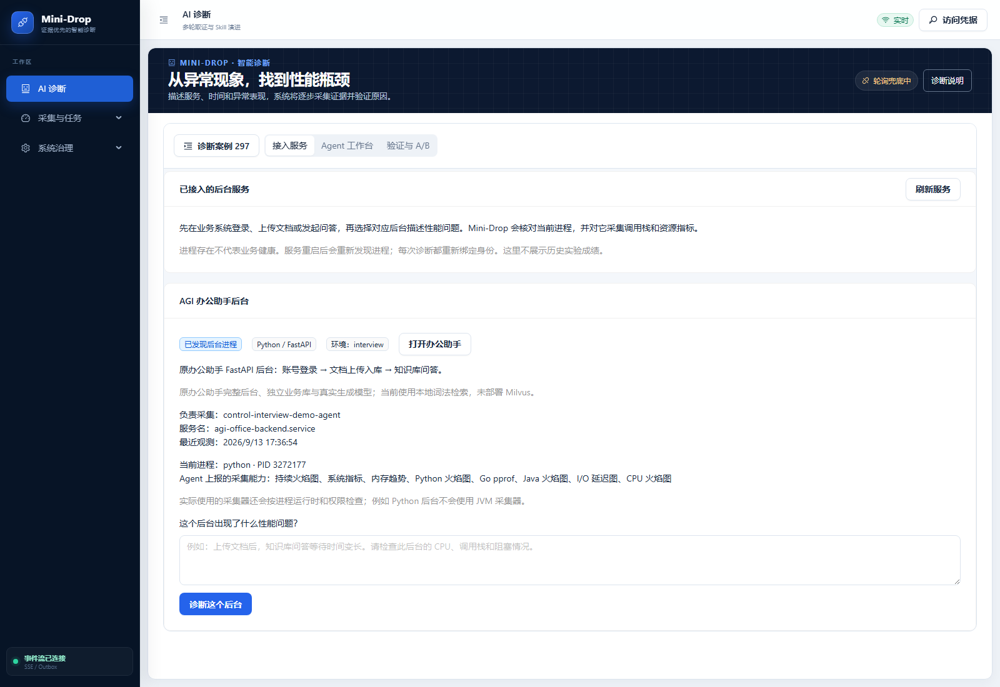
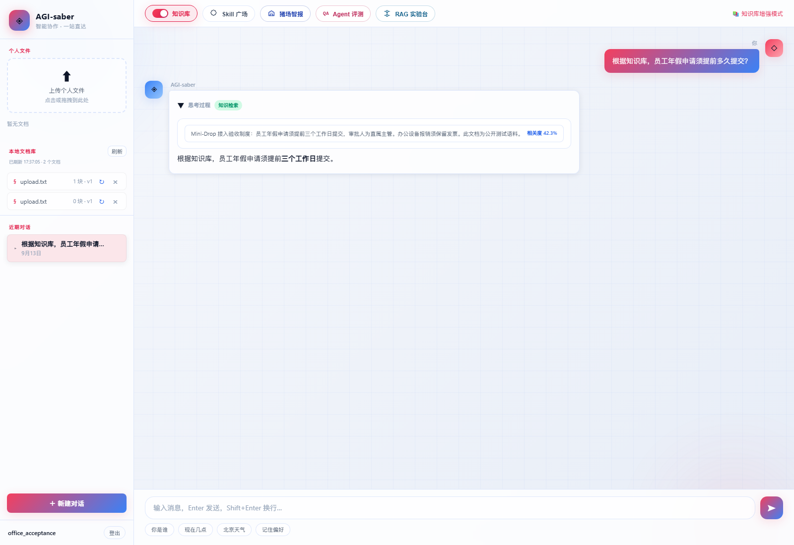
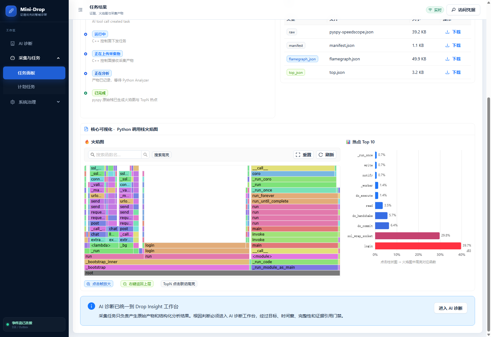

# 原办公助手完整后台接入验收

本次交付是实际业务后台持续运行并被 Mini-Drop 诊断。没有用上一轮 `integrations/agi_saber/service.py` 测试入口代替原服务。

## 可以直接演示的流程

[打开 Mini-Drop](https://120.24.187.205/ai-diagnosis) → 接入服务 → AGI 办公助手后台 → 打开办公助手 → 使用助手自己的账号登录、上传制度文档、打开知识库开关并提问。再回到 Mini-Drop 描述性能现象，点击“诊断这个后台”。原助手与诊断平台保留各自职责。

实际业务路径使用原 `main.build_deps → setup_routes → AuthService / UnifiedAgent → 文档库 / Engine / HybridStore / LocalRagChunkRepo → 真实生成模型`。数据保存在独立 SQLite，未部署 Milvus；原项目的个人数据与配置文件未整体复制。

## 运行证据

| 项目 | 结果 |
| --- | --- |
| Mini-Drop 发布 | `/opt/mini-drop-releases/20260913T093541Z` |
| 办公助手发布 | `/opt/agi-office/releases/20260913T092221Z` |
| 常驻服务 | `agi-office-backend.service`；独立用户，0.75 CPU / 512MiB |
| 重启识别 | 3260865 → 3272177；Agent 新快照更新，非硬编码 PID |
| 业务 HTTP | 真实登录、上传、知识库检索、生成回答通过 |
| 有界请求 | 180/180 符合人工文本的回答；负载单元结束 |
| 原生采集 | 4/4 采集及分析成功，全部绑定实际后台 |
| AI 报告 | 20 条证据记录、4 份报告；全部证据不足，未确认根因 |
| Web | 原 Vue 登录与知识库问答、Mini-Drop 服务入口、手机布局通过，0 个浏览器异常 |
| 自动测试 | Python 545 passed / 5 skipped；Web 171 passed；最后中文名调整 3 项定向通过；原助手模型回归 6 项通过 |

实际诊断：[insight_929235765e3b482cb0b6ed32bd20426b](https://120.24.187.205/ai-diagnosis?case=insight_929235765e3b482cb0b6ed32bd20426b)。

| 采集器 | 任务 |
| --- | --- |
| 系统指标 | [task_20260913_093021_8b2298](https://120.24.187.205/task/task_20260913_093021_8b2298) |
| perf CPU | [task_20260913_093042_e04b49](https://120.24.187.205/task/task_20260913_093042_e04b49) |
| 连续 perf | [task_20260913_093110_019b79](https://120.24.187.205/task/task_20260913_093110_019b79) |
| Python 调用栈 | [task_20260913_093156_a3ee97](https://120.24.187.205/task/task_20260913_093156_a3ee97) |

Python 采样得到 141 个样本，登录校验 39.7%、`ssl_wrap_socket` 29.8%，还有 TLS 握手与数据库提交。采样期间混合了浏览器登录和问答，不能把这些比例直接解释成单个查询的耗时分解。未注入已知故障、没有同负载修复对照，不能称为“AI 已修复业务瓶颈”。

## 本次实际修正

1. 从短时模块实验改为原完整后台常驻服务，保留真实用户操作入口。
2. 运维服务登记与可信 Agent 快照关联，每次诊断重新绑定，限定 Agent、精确服务名。过期、缺失和多实例歧义不自动猜 PID。
3. 发现原助手未配置模型或模型失败时会回退 Mock；为本部署设置 `AGI_LLM_ALLOW_MOCK=0`，原客户端显式失败，避免假问答成功。
4. 原评测目录默认写代码目录导致只读启动失败，改为独立数据目录；保留失败发布。
5. 公网业务入口要求 Mini-Drop 会话，业务内部保留 JWT，不将平台 Cookie/API Key 转发到助手。
6. 源码挂载的绝对链接首次失效，最终修正为同路径只读挂载，实际函数定位核对通过；历史报告保留原 source_context。

部署、HTTP、重启、完整会话、流量、源码映射及浏览器记录在 [原始记录目录](service-integration-20260913/)，执行脚本在 `output/acceptance/service-integration-20260913/`。第一次 Mock 回复保留为未完成真实问答的记录；浏览器首次脚本误判 URL 前缀的失败也保留，后续复用已创建会话，没有重复创建诊断冒充新的验收。

## 截图与操作文档

维护、接入其他项目和后续边界见 [服务接入文档](../../docs/SERVICE_INTEGRATION.md)。仍未完成跨服务分布式 Trace 关联、Kubernetes 自动发现、多 worker 聚合，以及这个后台的严格故障根因与修复验收。
