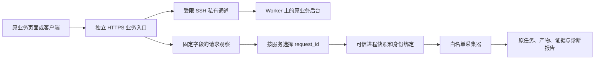
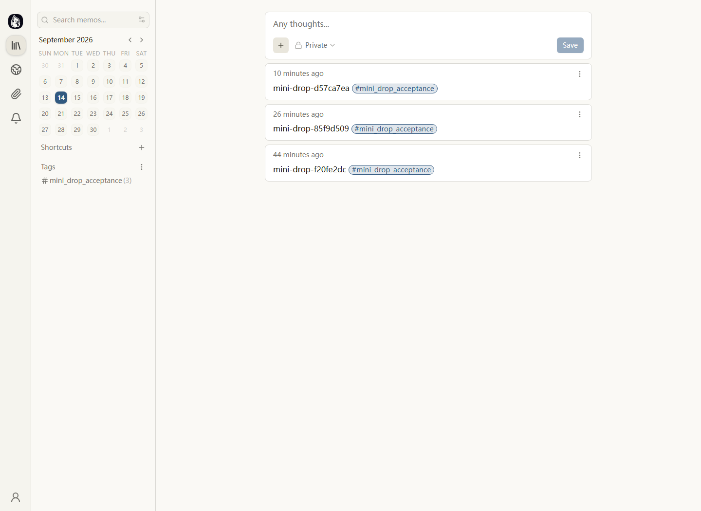
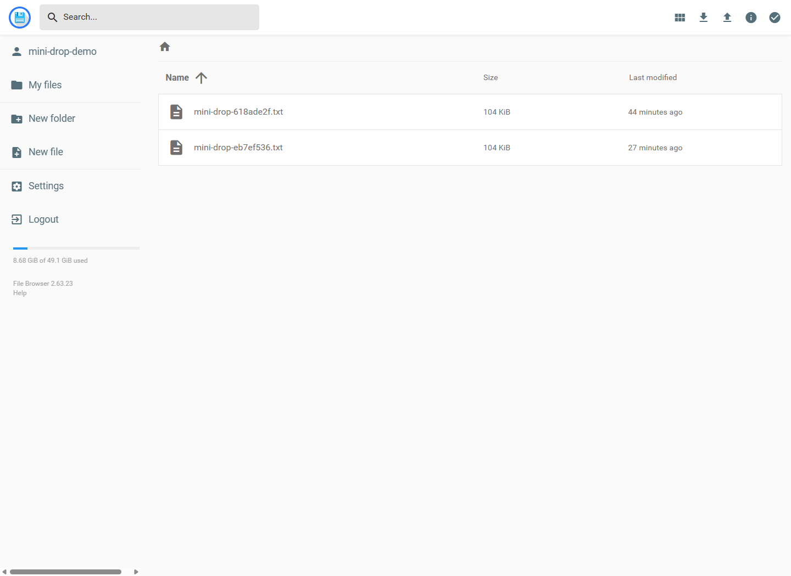
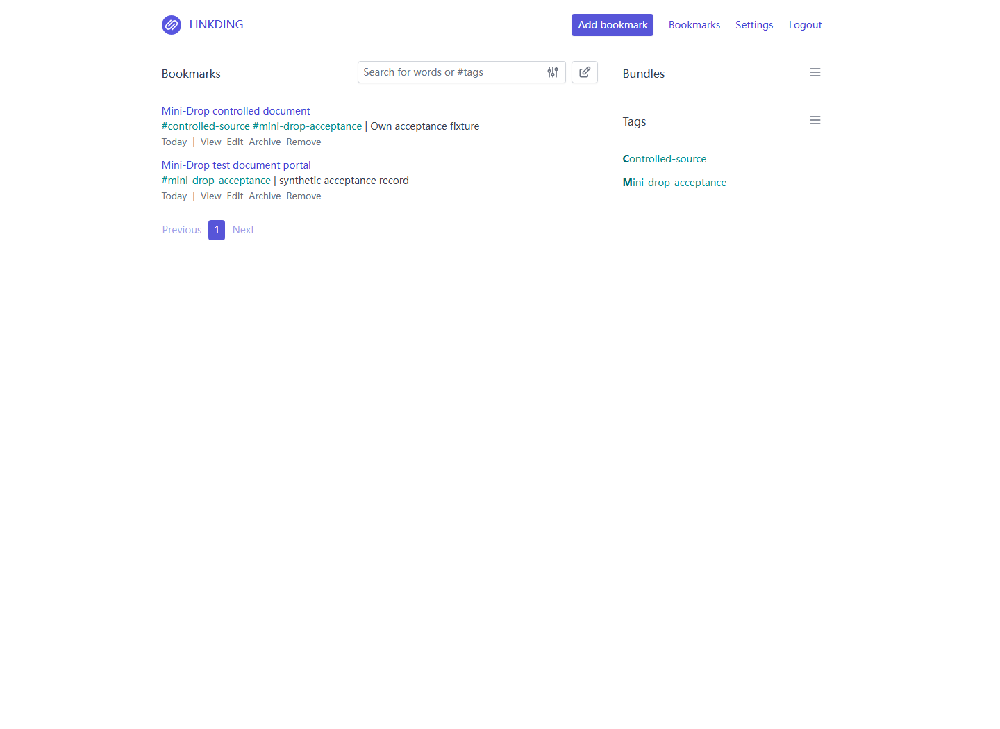
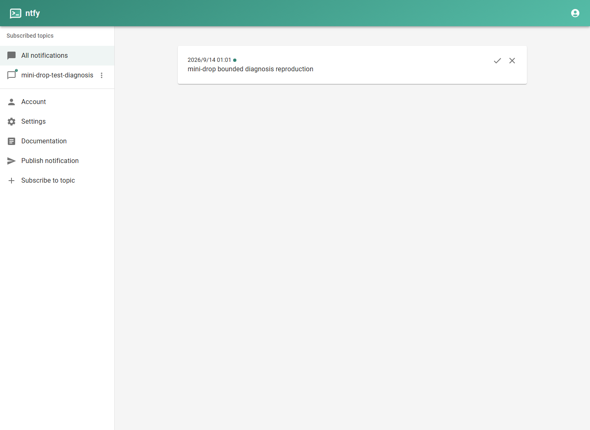
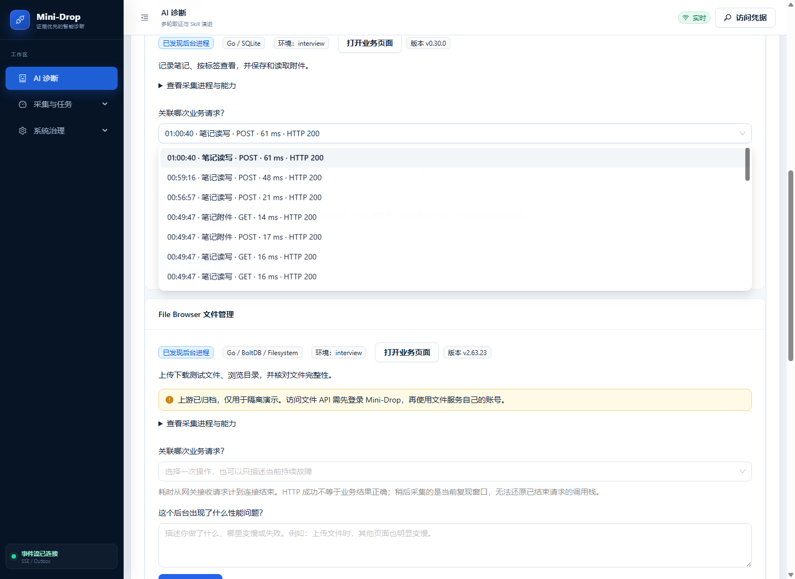
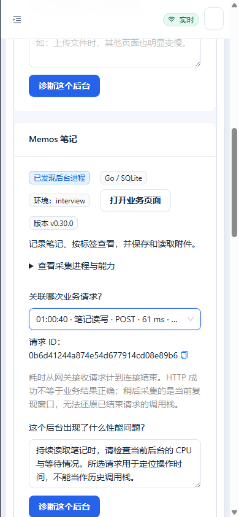

# 四个轻量业务接入与验收

最终平台发布：`/opt/mini-drop-releases/20260913T165503Z`（Web / Diagnosis Worker）。原生三个 Agent 使用同一份 JVM 保护二进制，API、Analyzer 与数据库 schema 本批未变。

2026-09-14。本批把四个上游应用作为独立后台部署到现有两台 Worker，接入 Mini-Drop 的请求观察、进程发现、采集和报告。业务账号、原网页和数据独立保留。现有办公助手仍可使用。

这些是运行真实开源代码的演示业务，使用人工测试数据；没有声称存在企业客户、线上用户规模或生产故障成绩。

## 现在怎么用

先登录 [Mini-Drop](https://120.24.187.205/ai-diagnosis)，点击“接入服务”。每个业务卡片都可打开原项目页面；做完一次操作后，回到平台选择对应请求，描述性能现象，再点击“诊断这个后台”。

| 业务 | 原项目入口 | 本批验证的操作 | 部署与限制 |
| --- | --- | --- | --- |
| Memos v0.30.0 | [笔记](https://120.24.187.205:18441/) | 写入笔记、按标签查询；附件上传下载并校验内容 | Worker 1；256MiB、0.6 CPU |
| File Browser v2.63.23 | [文件管理](https://120.24.187.205:18442/) | 上传下载约 96KiB 测试文件并校验 SHA256；查询目录 | Worker 1；192MiB、0.6 CPU |
| linkding v1.46.2 | [书签](https://120.24.187.205:18443/) | 保存/读取书签、按标签筛选；另测真实网页标题抓取 | Worker 2；384MiB、0.6 CPU；单 HTTP worker、2 线程 |
| ntfy v2.28.0 | [通知](https://120.24.187.205:18444/) | 持续订阅并接收消息；断开后读取缓存并核对消息 ID | Worker 2；192MiB、0.6 CPU；关闭公开注册、匿名读写 |

账号文件保存在本机 `C:/Users/洛伦兹力不做功/.codex/private/mini-drop-business-accounts.json`，限制当前 Windows 用户和 SYSTEM 读取，不在 Git、截图或验收报告中保存密码。每个业务使用自己的账号。

File Browser 上游已经归档，因此这里只作为隔离演示。文件 API 还需要 Mini-Drop 平台认证；只有文件服务 JWT、没有平台凭据时仍返回 401。静态登录页可以打开，文件数据 API 不公开。命令执行保持上游默认禁用，不挂载个人资料或平台证据目录。该项目不应作为新生产文件系统的选型。[上游维护说明](https://github.com/filebrowser/filebrowser#security)

ntfy 的通知只发给自己的测试客户端。使用浏览器桌面通知时需要允许通知权限；本批隔离浏览器在授权后验证通过。未授权时，上游页面能收到消息，但其桌面通知逻辑出现未捕获 Promise 错误，保存在失败记录中，没有修改上游压缩后的 JS 掩盖它。

## 接入实际做了什么

登记源为 `integrations/lightweight/catalog.json`；上游校验和、镜像 digest 在 `artifact-lock.json`。生成器生成网关和服务目录，目录不保存 PID。业务只监听 Worker 环回地址，控制机 SSH 凭据仅允许指定端口转发。服务重启后使用新快照重新绑定，不能复用旧 PID。

网关记录 request_id、服务版本、固定操作分类、时间、状态、发送字节数；不记录原 URL、查询词、文件名、正文或凭据。业务请求的 ID 由网关生成。前端只能提交 ID，服务端从该服务自己的日志重新读取，并把结构化观察存入诊断创建事件。不能从浏览器提交其他服务的 PID、日志路径或伪造观察。

请求观察只描述网关收到请求至连接关闭的时间。长连接持续数分钟不表示单条通知延迟数分钟；HTTP 200 不证明笔记内容正确或通知收到。现在没有函数级 span、数据库执行计划连接器或跨服务全链路追踪。采样记录属于当前复现窗口，不能重建之前已经结束请求的调用栈。

日志每五分钟检查轮转，单文件 5MiB 阈值、保留 3 份归档；这是周期阈值，不是硬磁盘配额。API 每服务最多读取当前文件尾部 2MiB，只展示有效的 24 小时内记录；轮转或高流量挤出的请求会要求重新选择。

浏览器 Cookie 按主机共享，不按端口隔离。网关只向各业务转发它自己的认证 Cookie，并去掉平台 API Key；文件 API 的平台认证在独立内部子请求执行。ntfy WebSocket 的 Upgrade/Connection 转发已配置。

## 真实诊断与复验结果

八项基础业务检查通过；网页标题抓取和受控依赖延迟另行验证。最新四个诊断都正确绑定登记的 Agent 和业务进程，所选 request_id 都已存入创建事件。

| 业务 | 本轮业务复现 | 最新诊断 | 采集任务 | 报告 |
| --- | --- | --- | --- | --- |
| Memos | 198 次真实读取，198 次内容检查通过 | [打开](https://120.24.187.205/ai-diagnosis?case=insight_0a6b902ec03b49d9bb93b177ed7e041c) | 4 成功 | 4 份，证据不足 |
| File Browser | 199 次目录读取，199 次内容检查通过 | [打开](https://120.24.187.205/ai-diagnosis?case=insight_0442bf4579004145af433e1a151e5569) | 3 成功；1 次 CPU perf 无样本 | 3 份，证据不足 |
| linkding | 201 次书签读取，201 次内容检查通过 | [打开](https://120.24.187.205/ai-diagnosis?case=insight_57544a25881d4d59b79f236521c8f709) | 4 成功，含 py-spy | 4 份，证据不足 |
| ntfy | 改用持续订阅后，23 条消息的 ID 和内容全部匹配 | [打开](https://120.24.187.205/ai-diagnosis?case=insight_fdfbfb1dbc8c450885969bee772fa0f7) | 4 成功 | 4 份，证据不足 |

合计最新 16 个采集任务中 15 个成功，51 条证据记录、15 份报告。证据条数不能当作有效支持条数。File Browser 低 CPU 负载窗口没有得到 perf 样本，真实保留为失败，没有补造火焰图。

这是接入、正常业务复现和采集兼容性检查，没有预设四种业务都存在性能故障，因此不能称为“四个故障根因均已定位”。既有 21 场景严格成绩保持 1 通过、20 未通过。

### 一个可观察的业务延迟案例

linkding 调用自己的真实 `/api/bookmarks/check/`，抓取 Worker 私有测试页面；标题由原应用的网页读取和 HTML 解析生成，没有手工填写标题冒充抓取。保存后的书签标题也与测试页一致。

| 窗口 | 请求数 | 客户端中位耗时 | 页面标题正确 |
| --- | ---: | ---: | --- |
| 正常依赖 | 8 | 33.156ms | 8/8 |
| 测试依赖增加 800ms 延迟 | 8 | 834.119ms | 8/8 |
| 撤销延迟 | 8 | 32.861ms | 8/8 |

这是受控依赖延迟与撤销注入的比较，不是发现并修好了 linkding 源码缺陷，也没有算作 AI 已确认根因。样本很小、串行请求，不是容量压测。测试源已经停止，延迟开关已经清零；保留的测试书签指向临时测试源，后续重新抓取前需启动该测试源。

### 验收中发现和修复的问题

1. **JVM 采集器误用于 Go 业务。** 首轮证据不足后的回退只检查了 Agent 是否安装工具，没有可靠限制目标运行时。JVM attach 对文件服务触发 SIGQUIT，服务退出并产生 502；其他业务也出现失败。现在服务端对未知绑定禁用运行时专用工具，服务名与用户描述不能覆盖未知可执行文件；原生 Agent 在调用 asprof 前检查可执行的 `libjvm.so` 映射。三台 Agent 都已更新。另用旧任务 API 故意向文件服务请求 JVM 采集，原生层返回 `RUNTIME_MISMATCH`，业务 PID、内容和可访问性保持不变。
2. **通知测试方式触发限流。** 每秒轮询导致第二轮 ntfy 187 次请求中 91 次业务检查失败，日志显示 429。没有关闭上游限流；改用原业务支持的持续订阅，第三轮 23 条消息全部收到。第一、第二轮失败独立保存。
3. **应用版本差异。** Memos 初始化参数、linkding v1.46.2 的 `ApiToken` 和带 `ld_` 前缀的登录 Cookie、ntfy 的网页登录开关按实际版本修正。书签的 HTTP 路由进程与工作进程已拆清，使用 `http-socket` 直接接收代理请求，排除 master 与后台任务进程；多实例仍需明确选择。
4. **入口和浏览器功能。** 原域名入口在本次网络下 TLS 握手失败，改用已验证的独立 IP HTTPS 端口；修正主站 default server、业务认证 Cookie 和 WebSocket 转发。一次主站健康检查失败已自动回滚，后续发布恢复健康。

首轮失败数据、第二轮限流记录、原始任务 ID 均保留；后续通过不会覆盖前面的失败。

## 资源与测试范围

负载窗口的资源快照：Memos cgroup 内存约 22.9MiB，文件服务约 14.0MiB，ntfy 约 17.2MiB；linkding 容器约 161.1MiB。前三项是 systemd MemoryCurrent，最后一项是 Docker 容器统计，均不应称为同口径 RSS。Worker 1/2 当时可用内存约 1.39/1.33GiB。独立内存/CPU 限制不能隔离共享磁盘与网络。

没有购买新机器，没有删除原数据库、对象存储或历史报告。当前未完成大文件、多用户权限、多进程聚合、容量、长期稳定性、跨服务 span、PostgreSQL 业务连接器及真实业务缺陷修复 A/B。Vikunja、Miniflux 尚未部署，原计划的 12 项业务操作不能全部计为通过。

- Python 全量：560 passed / 5 skipped，跳过项包含 PostgreSQL 专用测试。
- Web 全量：39 文件、172 tests；最后折叠进程详情的改动额外通过 4 项定向测试、生产构建与 bundle 检查。
- Native：5 个 CTest 目标通过，包含运行时拒绝检查。
- OpenAPI：83 组路由通过。
- 四个原业务在隔离浏览器登录、显示测试数据；平台请求选择与 390px 无横向溢出通过。ntfy 桌面通知权限按真实使用需要在该隔离浏览器授权。

机器记录在 [本批数据目录](lightweight-business-20260914/)。安装与生成入口在 [服务接入文档](../../docs/SERVICE_INTEGRATION.md)。

## 截图

原 Memos：

原文件管理：

原书签服务：

原通知客户端：

回到 Mini-Drop 选择具体业务请求：

